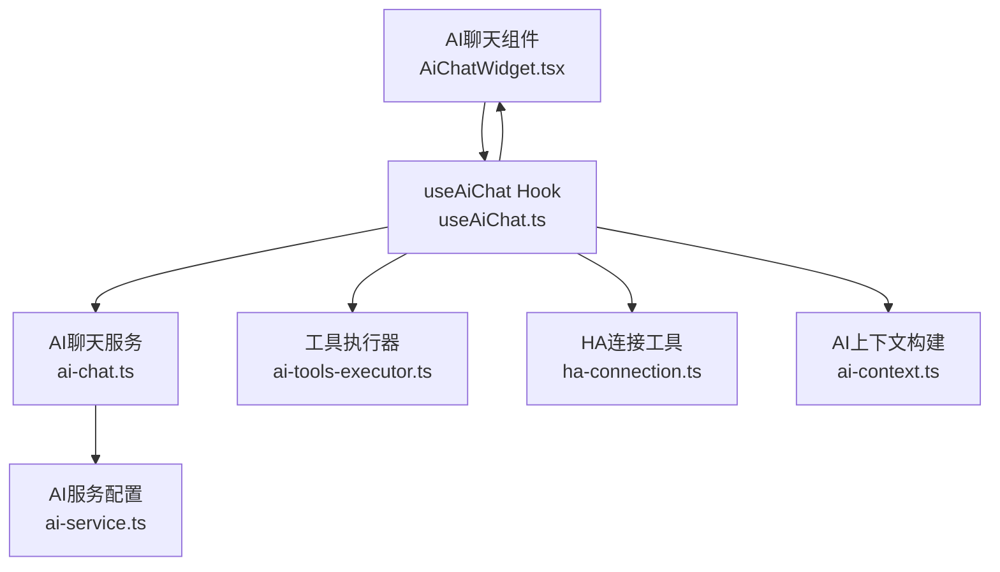
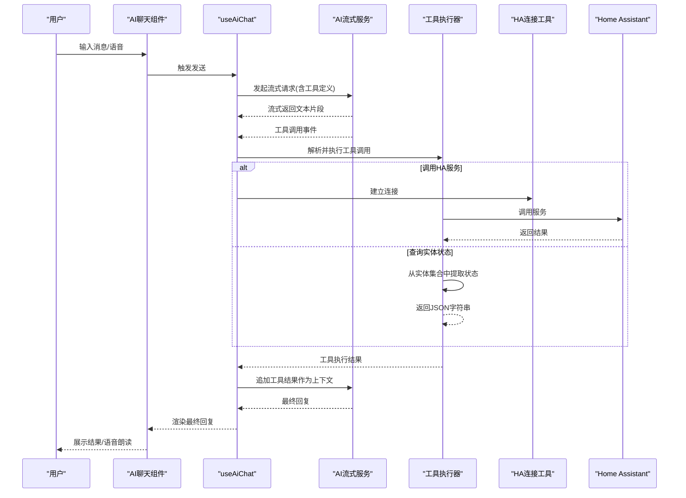
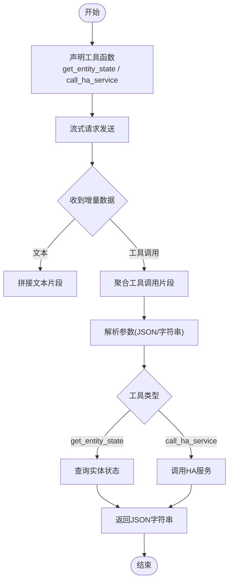
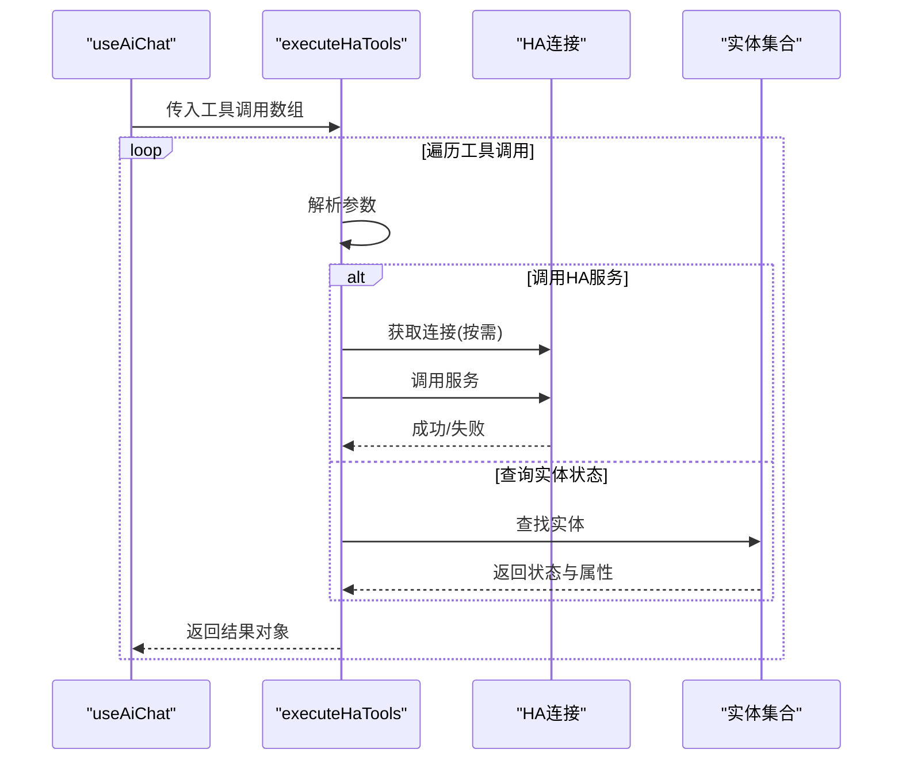
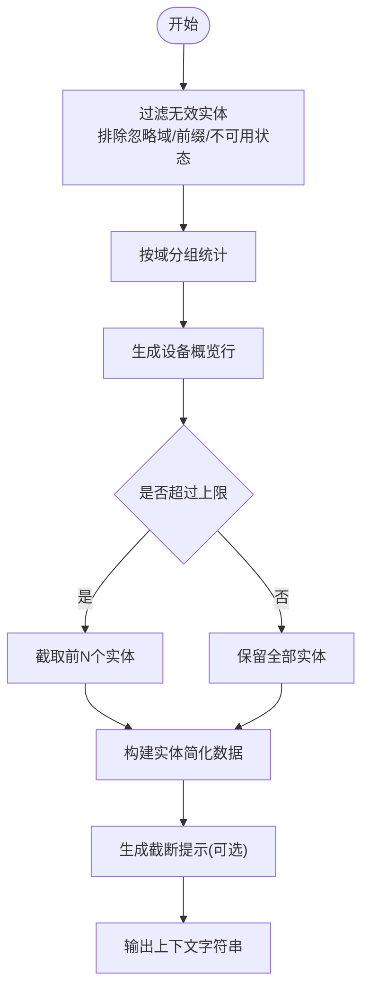
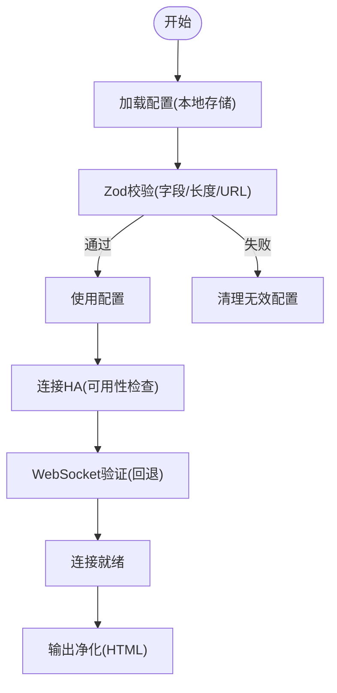
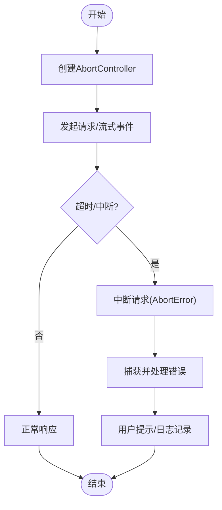
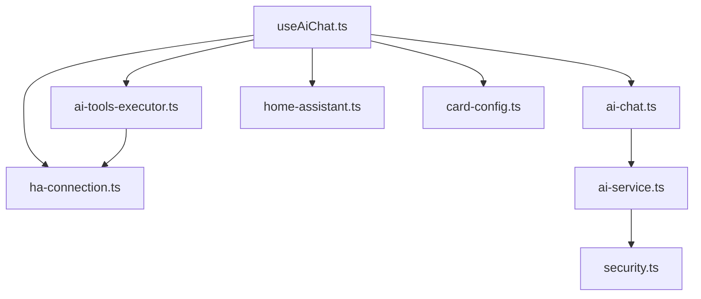

# AI工具执行机制

<cite>
**本文档引用的文件**
- [ai-tools-executor.ts](file://src/services/ai-tools-executor.ts)
- [ai-context.ts](file://src/utils/ai-context.ts)
- [ai-service.ts](file://src/services/ai-service.ts)
- [useAiChat.ts](file://src/hooks/useAiChat.ts)
- [ai-chat.ts](file://src/services/ai-chat.ts)
- [ha-connection.ts](file://src/utils/ha-connection.ts)
- [security.ts](file://src/utils/security.ts)
- [AiChatWidget.tsx](file://src/app/components/AiChatWidget.tsx)
- [home-assistant.ts](file://src/types/home-assistant.ts)
- [card-config.ts](file://src/types/card-config.ts)
</cite>

## 目录
1. [简介](#简介)
2. [项目结构](#项目结构)
3. [核心组件](#核心组件)
4. [架构总览](#架构总览)
5. [详细组件分析](#详细组件分析)
6. [依赖关系分析](#依赖关系分析)
7. [性能考虑](#性能考虑)
8. [故障排除指南](#故障排除指南)
9. [结论](#结论)
10. [附录](#附录)

## 简介
本文件面向AI工具执行系统，围绕Function Calling机制、工具执行器、AI上下文管理、安全验证与权限控制、错误处理与超时控制、重试策略以及自定义工具开发指南进行全面技术文档化。系统通过流式对话与工具调用实现与Home Assistant的深度集成，支持设备状态查询与服务调用，同时提供安全的配置校验、脱敏输出与连接验证能力。

## 项目结构
系统主要由以下层次构成：
- UI层：AI聊天组件负责用户交互、语音模式、消息渲染与状态反馈
- Hook层：useAiChat封装消息管理、配置持久化、流式请求与工具调用编排
- 服务层：ai-chat提供OpenAI兼容的流式对话；ai-service提供AI提供商配置与安全校验
- 工具执行层：ai-tools-executor统一解析与执行工具调用
- 连接层：ha-connection封装Home Assistant连接、订阅与一次性连接
- 工具层：ai-context负责设备上下文构建与过滤；security提供令牌混淆

图表来源
- [AiChatWidget.tsx:1-678](file://src/app/components/AiChatWidget.tsx#L1-L678)
- [useAiChat.ts:1-317](file://src/hooks/useAiChat.ts#L1-L317)
- [ai-chat.ts:1-153](file://src/services/ai-chat.ts#L1-L153)
- [ai-tools-executor.ts:1-60](file://src/services/ai-tools-executor.ts#L1-L60)
- [ha-connection.ts:1-317](file://src/utils/ha-connection.ts#L1-L317)
- [ai-context.ts:1-92](file://src/utils/ai-context.ts#L1-L92)
- [ai-service.ts:1-201](file://src/services/ai-service.ts#L1-L201)

章节来源
- [AiChatWidget.tsx:1-678](file://src/app/components/AiChatWidget.tsx#L1-L678)
- [useAiChat.ts:1-317](file://src/hooks/useAiChat.ts#L1-L317)
- [ai-chat.ts:1-153](file://src/services/ai-chat.ts#L1-L153)
- [ai-tools-executor.ts:1-60](file://src/services/ai-tools-executor.ts#L1-L60)
- [ha-connection.ts:1-317](file://src/utils/ha-connection.ts#L1-L317)
- [ai-context.ts:1-92](file://src/utils/ai-context.ts#L1-L92)
- [ai-service.ts:1-201](file://src/services/ai-service.ts#L1-L201)

## 核心组件
- Function Calling机制：在流式请求中声明工具函数，AI模型在生成过程中可请求工具调用，前端拦截并执行，再将结果回传给模型生成最终回复
- 工具执行器：统一解析工具调用，支持查询实体状态与调用HA服务
- AI上下文管理：从HA实体集中筛选有效设备，构建简洁的设备概览与实体列表
- 安全与权限：Zod配置校验、API Key脱敏、连接URL与令牌验证、HTML净化
- 错误处理与超时：AbortController中断、网络错误捕获、工具执行异常包装
- 自定义工具开发：遵循工具函数schema与参数规范，返回标准化结果

章节来源
- [ai-chat.ts:42-77](file://src/services/ai-chat.ts#L42-L77)
- [ai-tools-executor.ts:17-59](file://src/services/ai-tools-executor.ts#L17-L59)
- [ai-context.ts:32-91](file://src/utils/ai-context.ts#L32-L91)
- [ai-service.ts:55-62](file://src/services/ai-service.ts#L55-L62)
- [useAiChat.ts:169-292](file://src/hooks/useAiChat.ts#L169-L292)

## 架构总览
系统采用前后端分离的流式对话架构：前端直接调用第三方AI服务，AI模型通过Function Calling请求工具调用；前端拦截工具调用，执行本地或HA真实服务，再将结果回传给AI模型生成最终回复。

图表来源
- [useAiChat.ts:169-292](file://src/hooks/useAiChat.ts#L169-L292)
- [ai-chat.ts:25-152](file://src/services/ai-chat.ts#L25-L152)
- [ai-tools-executor.ts:17-59](file://src/services/ai-tools-executor.ts#L17-L59)
- [ha-connection.ts:47-105](file://src/utils/ha-connection.ts#L47-L105)

## 详细组件分析

### Function Calling机制与工具定义
- 工具声明：在流式请求中声明两个工具函数，分别用于查询实体状态与调用HA服务
- 参数解析：前端拦截工具调用事件，聚合增量的工具调用片段，解析参数
- 执行流程：根据工具名称路由到对应执行逻辑，返回标准化结果

图表来源
- [ai-chat.ts:42-77](file://src/services/ai-chat.ts#L42-L77)
- [ai-chat.ts:108-146](file://src/services/ai-chat.ts#L108-L146)
- [ai-tools-executor.ts:30-53](file://src/services/ai-tools-executor.ts#L30-L53)

章节来源
- [ai-chat.ts:42-77](file://src/services/ai-chat.ts#L42-L77)
- [ai-chat.ts:108-146](file://src/services/ai-chat.ts#L108-L146)
- [ai-tools-executor.ts:30-53](file://src/services/ai-tools-executor.ts#L30-L53)

### 工具执行器工作流程
- 工具注册：在工具清单中注册可用工具，支持扩展新工具
- 调用调度：遍历工具调用数组，按名称分派到具体执行函数
- 结果处理：将每个工具调用的结果封装为标准格式，便于回传给AI模型

图表来源
- [useAiChat.ts:228-254](file://src/hooks/useAiChat.ts#L228-L254)
- [ai-tools-executor.ts:17-59](file://src/services/ai-tools-executor.ts#L17-L59)
- [ha-connection.ts:132-139](file://src/utils/ha-connection.ts#L132-L139)

章节来源
- [useAiChat.ts:228-254](file://src/hooks/useAiChat.ts#L228-L254)
- [ai-tools-executor.ts:17-59](file://src/services/ai-tools-executor.ts#L17-L59)
- [ha-connection.ts:132-139](file://src/utils/ha-connection.ts#L132-L139)

### AI上下文管理系统
- 数据收集：从HA实体集合中过滤无效状态与忽略域，统计设备分布
- 数据处理：构建设备概览与实体列表，限制最大实体数量，附加单位与设备类别信息
- 整合输出：将汇总信息与实体JSON合并为系统提示的一部分

图表来源
- [ai-context.ts:32-91](file://src/utils/ai-context.ts#L32-L91)

章节来源
- [ai-context.ts:32-91](file://src/utils/ai-context.ts#L32-L91)

### 安全验证与权限控制
- 配置安全：使用Zod对localStorage读取的配置进行严格校验，限制字段与长度
- API Key脱敏：在日志与错误提示中对API Key进行脱敏显示
- 连接验证：提供HTTP可达性检查与WebSocket验证，支持本地/公网URL自动选择
- 内容净化：对AI输出进行HTML净化，防止恶意脚本注入

图表来源
- [ai-service.ts:55-62](file://src/services/ai-service.ts#L55-L62)
- [ai-service.ts:75-78](file://src/services/ai-service.ts#L75-L78)
- [ha-connection.ts:244-296](file://src/utils/ha-connection.ts#L244-L296)
- [AiChatWidget.tsx:113-118](file://src/app/components/AiChatWidget.tsx#L113-L118)

章节来源
- [ai-service.ts:55-62](file://src/services/ai-service.ts#L55-L62)
- [ai-service.ts:75-78](file://src/services/ai-service.ts#L75-L78)
- [ha-connection.ts:244-296](file://src/utils/ha-connection.ts#L244-L296)
- [AiChatWidget.tsx:113-118](file://src/app/components/AiChatWidget.tsx#L113-L118)

### 错误处理、超时控制与重试策略
- 超时控制：使用AbortController中断正在进行的请求，避免竞态与内存泄漏
- 网络错误：捕获fetch网络异常，区分不同错误类型并给出用户友好提示
- 工具执行异常：将异常包装为可读字符串，避免泄露内部细节
- 连接失败：提供本地/公网URL自动探测与代理回退方案

图表来源
- [useAiChat.ts:151-153](file://src/hooks/useAiChat.ts#L151-L153)
- [useAiChat.ts:272-292](file://src/hooks/useAiChat.ts#L272-L292)
- [ai-chat.ts:147-151](file://src/services/ai-chat.ts#L147-L151)
- [ai-tools-executor.ts:51-53](file://src/services/ai-tools-executor.ts#L51-L53)

章节来源
- [useAiChat.ts:151-153](file://src/hooks/useAiChat.ts#L151-L153)
- [useAiChat.ts:272-292](file://src/hooks/useAiChat.ts#L272-L292)
- [ai-chat.ts:147-151](file://src/services/ai-chat.ts#L147-L151)
- [ai-tools-executor.ts:51-53](file://src/services/ai-tools-executor.ts#L51-L53)

### 自定义工具开发指南
- 工具接口规范：在工具清单中声明工具名称、描述与参数schema，确保required字段明确
- 参数验证：前端解析参数时支持JSON字符串与对象，注意边界情况
- 返回值格式：工具执行结果应包含工具调用ID与内容字符串，便于回传给AI模型
- 扩展建议：新增工具时，保持参数最小化、返回值结构化，避免泄露敏感信息

章节来源
- [ai-chat.ts:42-77](file://src/services/ai-chat.ts#L42-L77)
- [ai-tools-executor.ts:9-12](file://src/services/ai-tools-executor.ts#L9-L12)
- [ai-tools-executor.ts:24-56](file://src/services/ai-tools-executor.ts#L24-L56)

### 与Home Assistant服务调用的集成模式
- 连接建立：按需建立长连接或一次性连接，支持本地/公网URL与代理回退
- 服务调用：通过工具调用触发HA服务，参数包含domain、service与service_data
- 实体查询：通过工具查询单个实体的状态与属性，返回结构化JSON
- 集成最佳实践：在工具调用前确保连接可用，对服务调用结果进行轻量级处理与反馈

章节来源
- [useAiChat.ts:228-254](file://src/hooks/useAiChat.ts#L228-L254)
- [ai-tools-executor.ts:33-36](file://src/services/ai-tools-executor.ts#L33-L36)
- [ai-tools-executor.ts:37-47](file://src/services/ai-tools-executor.ts#L37-L47)
- [ha-connection.ts:47-105](file://src/utils/ha-connection.ts#L47-L105)

## 依赖关系分析
- 组件耦合：useAiChat对ai-chat、ai-tools-executor、ha-connection形成直接依赖
- 外部依赖：依赖home-assistant-js-websocket进行HA连接与服务调用
- 类型约束：通过Zod对配置进行强类型校验，减少运行时错误

图表来源
- [useAiChat.ts:1-317](file://src/hooks/useAiChat.ts#L1-L317)
- [ai-chat.ts:1-153](file://src/services/ai-chat.ts#L1-L153)
- [ai-tools-executor.ts:1-60](file://src/services/ai-tools-executor.ts#L1-L60)
- [ha-connection.ts:1-317](file://src/utils/ha-connection.ts#L1-L317)
- [ai-service.ts:1-201](file://src/services/ai-service.ts#L1-L201)
- [security.ts:1-27](file://src/utils/security.ts#L1-L27)
- [home-assistant.ts:1-12](file://src/types/home-assistant.ts#L1-L12)
- [card-config.ts:1-14](file://src/types/card-config.ts#L1-L14)

章节来源
- [useAiChat.ts:1-317](file://src/hooks/useAiChat.ts#L1-L317)
- [ai-chat.ts:1-153](file://src/services/ai-chat.ts#L1-L153)
- [ai-tools-executor.ts:1-60](file://src/services/ai-tools-executor.ts#L1-L60)
- [ha-connection.ts:1-317](file://src/utils/ha-connection.ts#L1-L317)
- [ai-service.ts:1-201](file://src/services/ai-service.ts#L1-L201)
- [security.ts:1-27](file://src/utils/security.ts#L1-L27)
- [home-assistant.ts:1-12](file://src/types/home-assistant.ts#L1-L12)
- [card-config.ts:1-14](file://src/types/card-config.ts#L1-L14)

## 性能考虑
- 流式传输：使用SSE流式返回，提升用户体验与响应速度
- 实体上下文限制：限制实体数量与字段，避免token超限与延迟增加
- 连接复用：长连接复用降低握手开销，一次性连接用于临时任务
- 缓存与回退：连接可用性检查与代理回退减少失败重试成本

## 故障排除指南
- API Key问题：确认Key格式与长度，避免非法字符；生产环境不暴露原始错误
- 连接失败：检查URL与令牌，尝试本地/公网自动选择与代理回退
- 工具调用失败：检查实体ID是否存在，服务参数是否完整
- 网络中断：使用AbortController中断请求，避免资源泄漏

章节来源
- [ai-service.ts:121-140](file://src/services/ai-service.ts#L121-L140)
- [ha-connection.ts:93-104](file://src/utils/ha-connection.ts#L93-L104)
- [ai-tools-executor.ts:48-53](file://src/services/ai-tools-executor.ts#L48-L53)
- [useAiChat.ts:272-292](file://src/hooks/useAiChat.ts#L272-L292)

## 结论
该系统通过清晰的工具调用机制与严格的上下文管理，实现了与Home Assistant的无缝集成。前端直接对接AI服务，配合工具执行器与HA连接工具，完成从对话到动作的闭环。安全方面通过配置校验、脱敏与净化等手段降低风险；错误处理与超时控制保障了稳定性。未来可在工具扩展、上下文压缩与连接优化方面持续演进。

## 附录
- 配置类型与字段：参考AI配置schema与HA配置类型定义
- 工具清单：工具名称、描述与参数schema需与实现一致
- UI组件：聊天组件提供语音与文本输入、消息渲染与状态反馈

章节来源
- [ai-service.ts:44-69](file://src/services/ai-service.ts#L44-L69)
- [home-assistant.ts:3-11](file://src/types/home-assistant.ts#L3-L11)
- [card-config.ts:1-14](file://src/types/card-config.ts#L1-L14)