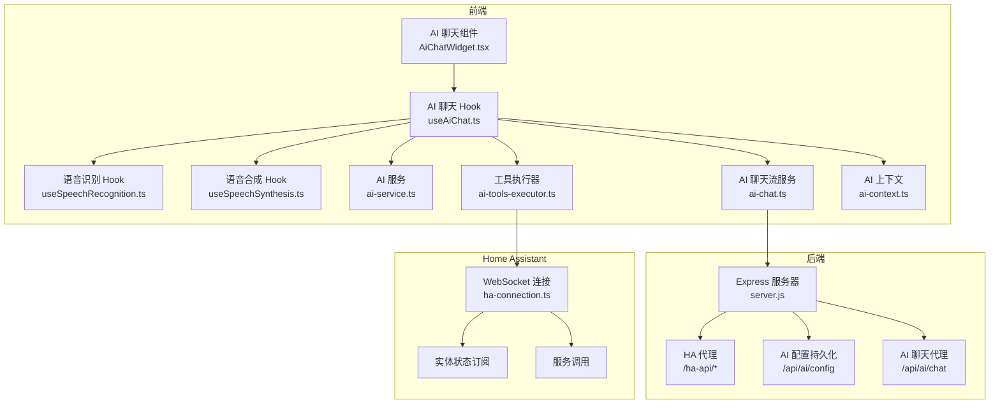
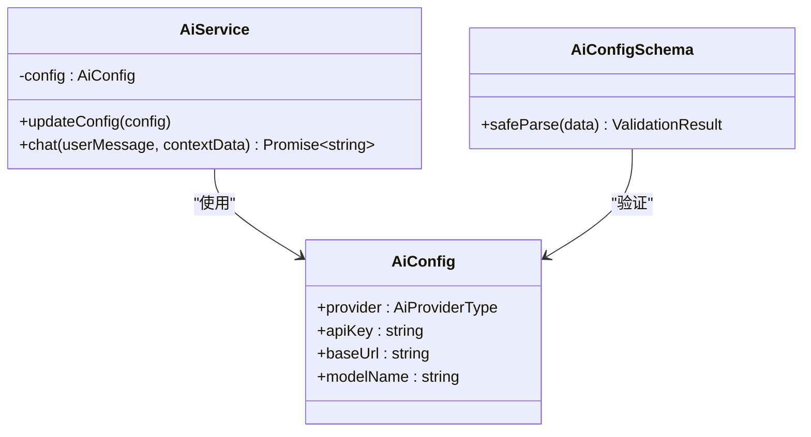
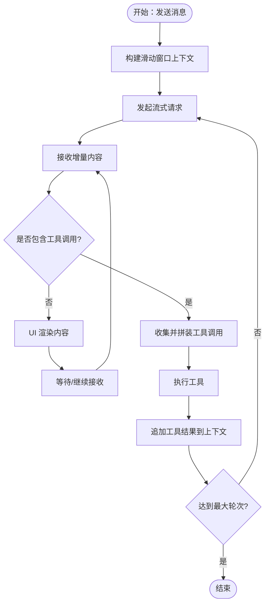
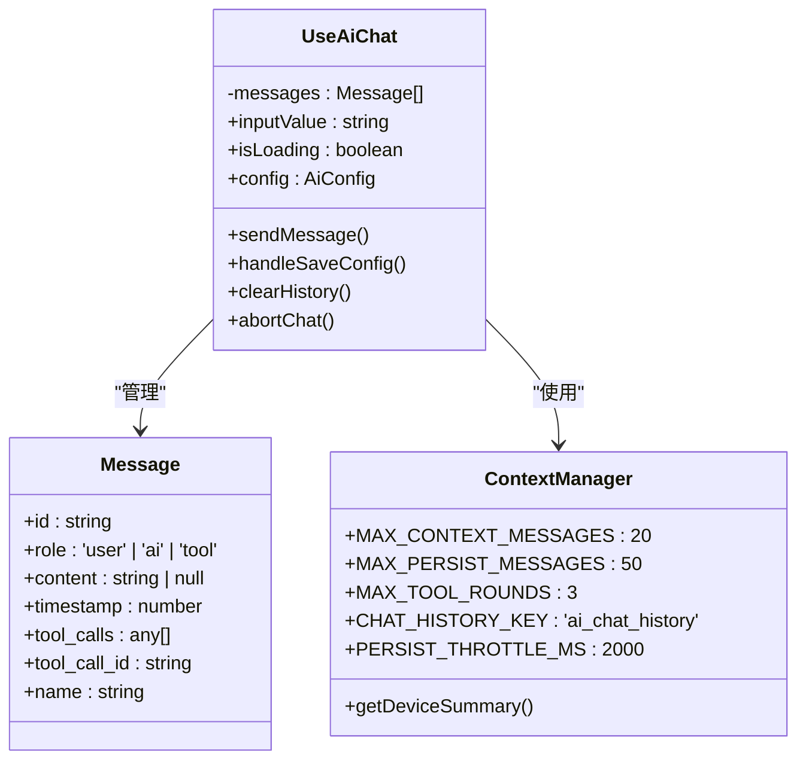
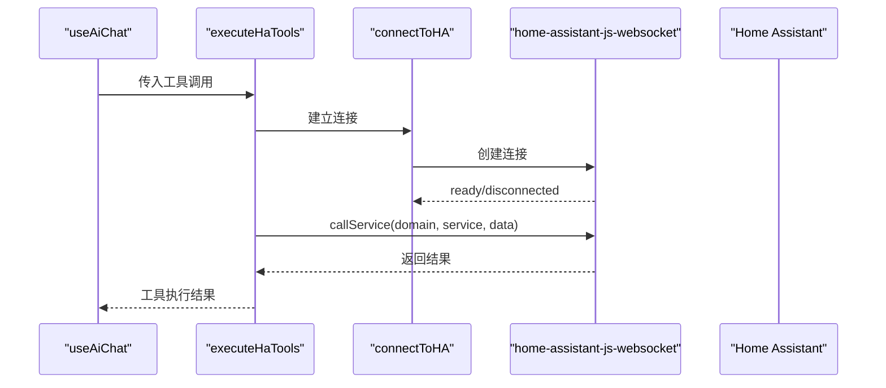
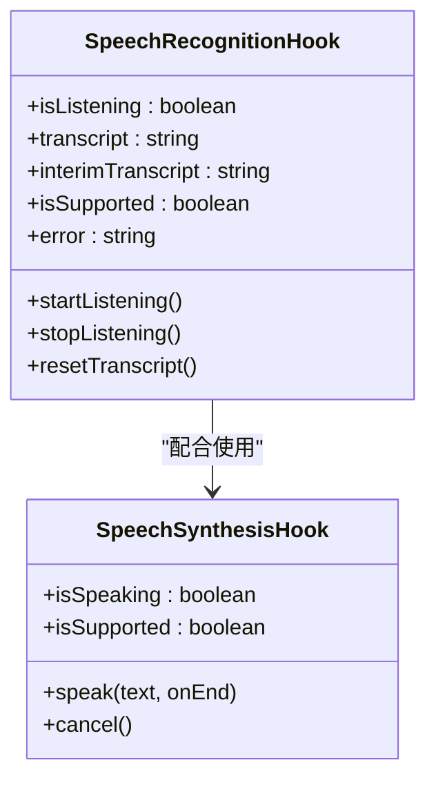
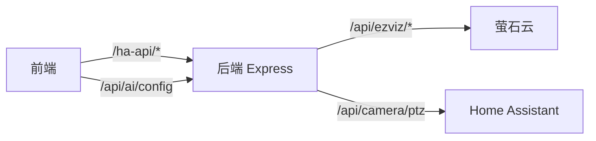
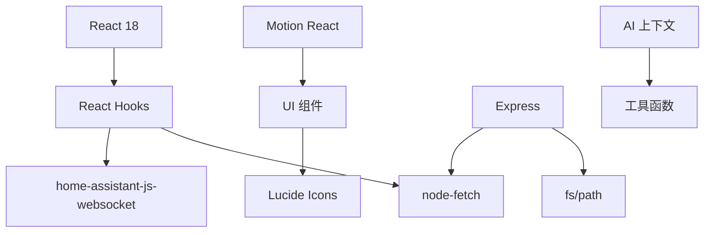

# AI智能助手集成

<cite>
**本文档引用的文件**
- [README.md](file://README.md)
- [ai-service.ts](file://src/services/ai-service.ts)
- [ai-chat.ts](file://src/services/ai-chat.ts)
- [useAiChat.ts](file://src/hooks/useAiChat.ts)
- [ai-tools-executor.ts](file://src/services/ai-tools-executor.ts)
- [AiChatWidget.tsx](file://src/app/components/AiChatWidget.tsx)
- [useSpeechRecognition.ts](file://src/hooks/useSpeechRecognition.ts)
- [useSpeechSynthesis.ts](file://src/hooks/useSpeechSynthesis.ts)
- [ha-connection.ts](file://src/utils/ha-connection.ts)
- [server.js](file://addon/server.js)
- [config.yaml](file://addon/config.yaml)
- [AiSettingsModal.tsx](file://src/app/components/AiSettingsModal.tsx)
- [security.ts](file://src/utils/security.ts)
- [home-assistant.ts](file://src/types/home-assistant.ts)
- [ai-context.ts](file://src/utils/ai-context.ts)
</cite>

## 更新摘要
**变更内容**
- 新增滑动窗口对话管理系统，支持最多10轮对话的历史管理
- 实现持久化对话存储，支持最多50条消息的本地存储
- 增强多轮工具执行能力，支持最多3轮工具调用循环
- 集成设备摘要功能，动态生成设备概览信息注入系统提示词
- 优化消息管理机制，支持用户消息、AI回复和工具调用的分类存储

## 目录
1. [简介](#简介)
2. [项目结构](#项目结构)
3. [核心组件](#核心组件)
4. [架构总览](#架构总览)
5. [详细组件分析](#详细组件分析)
6. [依赖关系分析](#依赖关系分析)
7. [性能考量](#性能考量)
8. [故障排查指南](#故障排查指南)
9. [结论](#结论)
10. [附录](#附录)

## 简介
本项目是一个基于 React 18 的专业级 AI 智能助手系统，集成 Home Assistant 仪表板，提供全双工语音交互与 Function Calling 的自然语言控制能力。系统支持多 LLM 平台接入、工具调用与实体查询、流式对话、语音识别与语音合成、以及与 Home Assistant 的深度集成。最新版本增强了对话管理能力，包括滑动窗口对话管理、持久化存储和多轮工具执行。

## 项目结构
项目采用前后端分离架构，前端使用 Vite + React 18 + Tailwind CSS 构建，后端以 Node.js Express 提供 HA 代理与 AI 配置持久化服务。核心模块包括：
- AI 服务层：LLM 平台接入、Function Calling、工具执行
- 语音交互层：语音识别、语音合成、全双工对话
- Home Assistant 集成：实体查询、服务调用、状态订阅
- 配置管理：AI 配置持久化、安全校验、前端/后端同步
- **新增** 对话管理：滑动窗口对话管理、持久化存储、多轮工具执行



**图表来源**
- [AiChatWidget.tsx:329-678](file://src/app/components/AiChatWidget.tsx#L329-L678)
- [useAiChat.ts:57-368](file://src/hooks/useAiChat.ts#L57-L368)
- [ai-chat.ts:25-156](file://src/services/ai-chat.ts#L25-L156)
- [ai-tools-executor.ts:17-60](file://src/services/ai-tools-executor.ts#L17-L60)
- [ai-service.ts:160-201](file://src/services/ai-service.ts#L160-L201)
- [server.js:48-94](file://addon/server.js#L48-L94)
- [ha-connection.ts:47-105](file://src/utils/ha-connection.ts#L47-L105)
- [ai-context.ts:97-123](file://src/utils/ai-context.ts#L97-L123)

**章节来源**
- [README.md:1-84](file://README.md#L1-L84)
- [AiChatWidget.tsx:329-678](file://src/app/components/AiChatWidget.tsx#L329-L678)
- [useAiChat.ts:57-368](file://src/hooks/useAiChat.ts#L57-L368)
- [server.js:1-521](file://addon/server.js#L1-L521)

## 核心组件
- AI 服务配置与安全校验：提供多平台 LLM 配置、Zod Schema 校验、API Key 脱敏与错误处理
- 流式聊天服务：基于 fetch-event-source 的 SSE 通信，支持工具调用拦截与二次回复
- 工具执行器：统一解析并执行 get_entity_state 与 call_ha_service
- 语音交互：语音识别与语音合成 Hook，支持全双工对话
- Home Assistant 集成：连接管理、实体订阅、服务调用
- 配置持久化：前端 localStorage 与后端文件系统双向同步
- **新增** 对话管理：滑动窗口对话管理、持久化存储、多轮工具执行、设备摘要集成

**章节来源**
- [ai-service.ts:44-201](file://src/services/ai-service.ts#L44-L201)
- [ai-chat.ts:8-156](file://src/services/ai-chat.ts#L8-L156)
- [ai-tools-executor.ts:17-60](file://src/services/ai-tools-executor.ts#L17-L60)
- [useSpeechRecognition.ts:24-216](file://src/hooks/useSpeechRecognition.ts#L24-L216)
- [useSpeechSynthesis.ts:57-149](file://src/hooks/useSpeechSynthesis.ts#L57-L149)
- [ha-connection.ts:47-147](file://src/utils/ha-connection.ts#L47-L147)
- [AiSettingsModal.tsx:12-227](file://src/app/components/AiSettingsModal.tsx#L12-L227)
- [useAiChat.ts:55-64](file://src/hooks/useAiChat.ts#L55-L64)

## 架构总览
系统采用"前端直连 LLM + 后端代理"的混合架构：
- 前端直接与 LLM 平台进行 OpenAI 兼容的流式对话，支持 Function Calling
- 后端提供 HA 代理、AI 配置持久化与萤石云等第三方服务代理
- 工具调用在前端本地解析并执行，减少后端耦合
- **新增** 对话管理在前端本地实现，支持滑动窗口和持久化存储

```mermaid
sequenceDiagram
participant User as "用户"
participant Widget as "AI 聊天组件"
participant Hook as "useAiChat Hook"
participant Context as "AI 上下文"
participant ChatSvc as "AI 聊天流服务"
participant LLM as "LLM 平台"
participant Tools as "工具执行器"
participant HA as "Home Assistant"
User->>Widget : 输入/语音发送
Widget->>Hook : sendMessage()
Hook->>Context : getDeviceSummary()
Context-->>Hook : 设备摘要
Hook->>Hook : 构建滑动窗口上下文
Hook->>ChatSvc : chatStream(消息, 配置, AbortSignal)
ChatSvc->>LLM : POST /chat/completions (流式)
LLM-->>ChatSvc : SSE 内容增量
ChatSvc-->>Hook : onEvent(content)
Hook->>Hook : UI 流式渲染
LLM-->>ChatSvc : SSE 工具调用
ChatSvc-->>Hook : onEvent(tool_call)
Loop 多轮工具执行
Hook->>Tools : executeHaTools(conn, entities, toolCalls)
Tools->>HA : 查询实体/调用服务
HA-->>Tools : 返回状态/结果
Tools-->>Hook : 工具执行结果
Hook->>Hook : 追加工具结果到上下文
End Loop
Hook->>ChatSvc : 追加工具结果并二次请求
ChatSvc->>LLM : 继续流式对话
LLM-->>ChatSvc : 最终回复
ChatSvc-->>Hook : onEvent(done)
Hook->>Hook : 节流持久化到localStorage
Hook->>Widget : TTS 朗读/更新 UI
```

**图表来源**
- [useAiChat.ts:172-341](file://src/hooks/useAiChat.ts#L172-L341)
- [ai-chat.ts:25-156](file://src/services/ai-chat.ts#L25-L156)
- [ai-tools-executor.ts:17-60](file://src/services/ai-tools-executor.ts#L17-L60)
- [ha-connection.ts:132-139](file://src/utils/ha-connection.ts#L132-L139)
- [ai-context.ts:97-123](file://src/utils/ai-context.ts#L97-L123)

## 详细组件分析

### AI 服务与配置管理
- 多平台配置：内置 SiliconFlow、阿里云百炼与自定义 OpenAI 兼容平台
- 安全校验：Zod Schema 验证、API Key ASCII 过滤、错误脱敏
- 默认配置与持久化：localStorage 与后端 /api/ai/config 双向同步



**图表来源**
- [ai-service.ts:160-201](file://src/services/ai-service.ts#L160-L201)
- [ai-service.ts:55-62](file://src/services/ai-service.ts#L55-L62)

**章节来源**
- [ai-service.ts:6-40](file://src/services/ai-service.ts#L6-L40)
- [ai-service.ts:55-62](file://src/services/ai-service.ts#L55-L62)
- [AiSettingsModal.tsx:35-53](file://src/app/components/AiSettingsModal.tsx#L35-L53)
- [server.js:294-313](file://addon/server.js#L294-L313)

### 流式聊天与工具调用
- Function Calling：定义 get_entity_state 与 call_ha_service 工具
- SSE 解析：fetch-event-source 持续接收增量内容与工具调用
- 工具拦截与二次请求：前端收集完整工具调用后，统一执行并追加到上下文
- **新增** 多轮工具执行：支持最多3轮工具调用循环，防止无限循环



**图表来源**
- [ai-chat.ts:79-156](file://src/services/ai-chat.ts#L79-L156)
- [useAiChat.ts:244-315](file://src/hooks/useAiChat.ts#L244-L315)
- [ai-tools-executor.ts:17-60](file://src/services/ai-tools-executor.ts#L17-L60)

**章节来源**
- [ai-chat.ts:42-85](file://src/services/ai-chat.ts#L42-L85)
- [useAiChat.ts:244-341](file://src/hooks/useAiChat.ts#L244-L341)

### 对话管理系统
- **滑动窗口管理**：限制上下文消息数量，避免 token 超限
- **持久化存储**：节流保存最近50条消息到 localStorage
- **多轮工具执行**：支持最多3轮工具调用循环，防止死循环
- **设备摘要集成**：动态生成设备概览信息注入系统提示词



**图表来源**
- [useAiChat.ts:11-45](file://src/hooks/useAiChat.ts#L11-L45)
- [useAiChat.ts:55-64](file://src/hooks/useAiChat.ts#L55-L64)
- [useAiChat.ts:194-196](file://src/hooks/useAiChat.ts#L194-L196)
- [ai-context.ts:97-123](file://src/utils/ai-context.ts#L97-L123)

**章节来源**
- [useAiChat.ts:76-117](file://src/hooks/useAiChat.ts#L76-L117)
- [useAiChat.ts:194-196](file://src/hooks/useAiChat.ts#L194-L196)
- [useAiChat.ts:244-315](file://src/hooks/useAiChat.ts#L244-L315)
- [ai-context.ts:97-123](file://src/utils/ai-context.ts#L97-L123)

### Home Assistant 集成
- 连接管理：长连接认证、事件监听、实体订阅
- 服务调用：封装 callService，支持白名单域过滤
- 实体查询：在工具执行器中查询实体状态



**图表来源**
- [useAiChat.ts:287-292](file://src/hooks/useAiChat.ts#L287-L292)
- [ai-tools-executor.ts:17-60](file://src/services/ai-tools-executor.ts#L17-L60)
- [ha-connection.ts:47-105](file://src/utils/ha-connection.ts#L47-L105)

**章节来源**
- [ha-connection.ts:125-139](file://src/utils/ha-connection.ts#L125-L139)
- [ai-tools-executor.ts:33-50](file://src/services/ai-tools-executor.ts#L33-L50)

### 语音交互
- 语音识别：Web Speech API，支持连续识别、静音超时、错误重试
- 语音合成：分段朗读、Markdown 清洗、iOS/Chrome 兼容处理



**图表来源**
- [useSpeechRecognition.ts:24-216](file://src/hooks/useSpeechRecognition.ts#L24-L216)
- [useSpeechSynthesis.ts:57-149](file://src/hooks/useSpeechSynthesis.ts#L57-L149)

**章节来源**
- [useSpeechRecognition.ts:71-171](file://src/hooks/useSpeechRecognition.ts#L71-L171)
- [useSpeechSynthesis.ts:100-140](file://src/hooks/useSpeechSynthesis.ts#L100-L140)
- [AiChatWidget.tsx:344-354](file://src/app/components/AiChatWidget.tsx#L344-L354)

### 后端代理与配置持久化
- HA 代理：/ha-api/* 透传到 HA Core，支持 Supervisor Token 备用
- AI 配置：/api/ai/config 读写后端持久化配置
- 萤石云代理：隐藏 AppKey/AppSecret，提供直播地址与 Token 获取



**图表来源**
- [server.js:48-94](file://addon/server.js#L48-L94)
- [server.js:294-313](file://addon/server.js#L294-L313)
- [server.js:122-196](file://addon/server.js#L122-L196)
- [server.js:229-286](file://addon/server.js#L229-L286)

**章节来源**
- [server.js:48-94](file://addon/server.js#L48-L94)
- [server.js:294-313](file://addon/server.js#L294-L313)
- [config.yaml:21-31](file://addon/config.yaml#L21-L31)

## 依赖关系分析
- 前端依赖：React Hooks、@microsoft/fetch-event-source、home-assistant-js-websocket、Lucide Icons、Motion React
- 后端依赖：Express、fs、path、node-fetch
- 安全依赖：Zod Schema、Base64 编解码
- **新增** 上下文依赖：ai-context 工具函数



**图表来源**
- [useAiChat.ts:1-8](file://src/hooks/useAiChat.ts#L1-L8)
- [AiChatWidget.tsx:1-16](file://src/app/components/AiChatWidget.tsx#L1-L16)
- [server.js:1-7](file://addon/server.js#L1-L7)
- [ai-context.ts:1-124](file://src/utils/ai-context.ts#L1-L124)

**章节来源**
- [package.json](file://package.json)
- [addon/package.json](file://addon/package.json)

## 性能考量
- 流式渲染：SSE 增量推送，前端逐字渲染，降低首帧延迟
- 工具调用批处理：前端收集完整工具调用后统一执行，减少往返次数
- 语音分段：长文本按句号/问号分段朗读，规避 Chrome 15 秒静音问题
- 连接复用：HA 连接按 URL+Token 建立唯一键，避免重复握手
- 配置持久化：localStorage 与后端文件系统双写，提升可用性
- **新增** 滑动窗口优化：限制上下文大小，避免 token 超限
- **新增** 节流持久化：2秒节流间隔，减少 localStorage 写入频率
- **新增** 多轮执行限制：最多3轮工具调用，防止无限循环

## 故障排查指南
- API Key/URL 错误：检查 AI 配置与后端持久化配置，确认 Base URL 与模型名正确
- 网络连接失败：检查前端 fetch 与后端代理可达性，关注 401/404/502 错误
- 语音识别失败：确认浏览器权限与 Web Speech API 支持，iOS Safari 需注意静音限制
- HA 连接失败：检查 VITE_HA_URL 与 VITE_HA_TOKEN，确认 HA Core 可达
- 工具执行失败：检查工具参数与实体是否存在，关注白名单域限制
- **新增** 对话异常：检查 localStorage 存储是否正常，确认消息格式正确
- **新增** 多轮工具执行失败：确认工具调用参数正确，检查 HA 服务可用性

**章节来源**
- [ai-service.ts:121-157](file://src/services/ai-service.ts#L121-L157)
- [useSpeechRecognition.ts:117-139](file://src/hooks/useSpeechRecognition.ts#L117-L139)
- [ha-connection.ts:94-104](file://src/utils/ha-connection.ts#L94-L104)
- [server.js:48-94](file://addon/server.js#L48-L94)
- [useAiChat.ts:321-333](file://src/hooks/useAiChat.ts#L321-L333)

## 结论
本系统通过前端直连 LLM 与后端代理相结合的方式，实现了高性能、低耦合的 AI 智能助手。完善的工具调用机制与 Home Assistant 深度集成，使得自然语言控制成为可能；语音交互与流式渲染进一步提升了用户体验。**最新版本的增强功能**包括滑动窗口对话管理、持久化存储和多轮工具执行，显著提升了系统的稳定性和用户体验。安全与性能方面的多项措施确保了系统的稳定性与可靠性。

## 附录

### 配置管理最佳实践
- 前端配置：通过 AiSettingsModal 进行配置，保存前进行 Zod 校验
- 后端配置：通过 /api/ai/config 读写，支持 Supervisor Token 备用
- 安全建议：避免在前端硬编码敏感信息，使用后端代理与 Base64 混淆

**章节来源**
- [AiSettingsModal.tsx:35-53](file://src/app/components/AiSettingsModal.tsx#L35-L53)
- [server.js:294-313](file://addon/server.js#L294-L313)
- [security.ts:1-27](file://src/utils/security.ts#L1-L27)

### 工具扩展与自定义开发
- 新增工具：在前端工具定义与后端工具白名单中添加新函数签名
- 参数校验：严格遵循 OpenAI Function Schema，确保参数必填与类型正确
- 执行逻辑：在 executeHaTools 中新增分支处理新工具，必要时建立 HA 连接

**章节来源**
- [ai-chat.ts:42-85](file://src/services/ai-chat.ts#L42-L85)
- [server.js:328-359](file://addon/server.js#L328-L359)
- [ai-tools-executor.ts:24-59](file://src/services/ai-tools-executor.ts#L24-L59)

### 对话管理配置说明
- **滑动窗口大小**：MAX_CONTEXT_MESSAGES = 20，限制上下文消息数量
- **持久化数量**：MAX_PERSIST_MESSAGES = 50，保存最近50条消息
- **多轮执行限制**：MAX_TOOL_ROUNDS = 3，防止无限循环
- **持久化节流**：PERSIST_THROTTLE_MS = 2000，2秒节流间隔
- **存储键名**：CHAT_HISTORY_KEY = 'ai_chat_history'

**章节来源**
- [useAiChat.ts:55-64](file://src/hooks/useAiChat.ts#L55-L64)
- [useAiChat.ts:76-117](file://src/hooks/useAiChat.ts#L76-L117)
- [useAiChat.ts:244-315](file://src/hooks/useAiChat.ts#L244-L315)