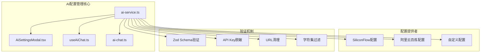
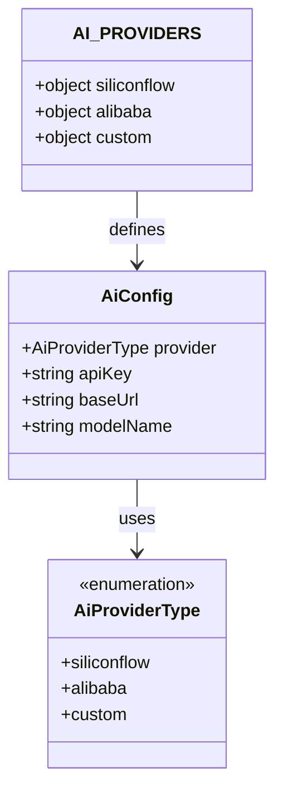
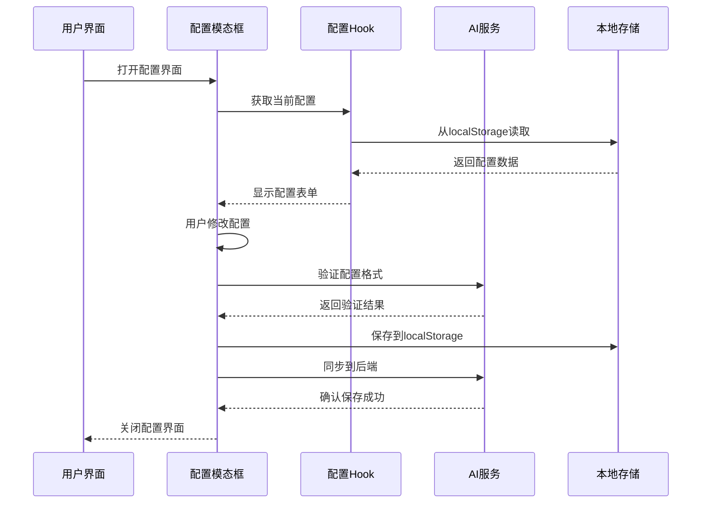
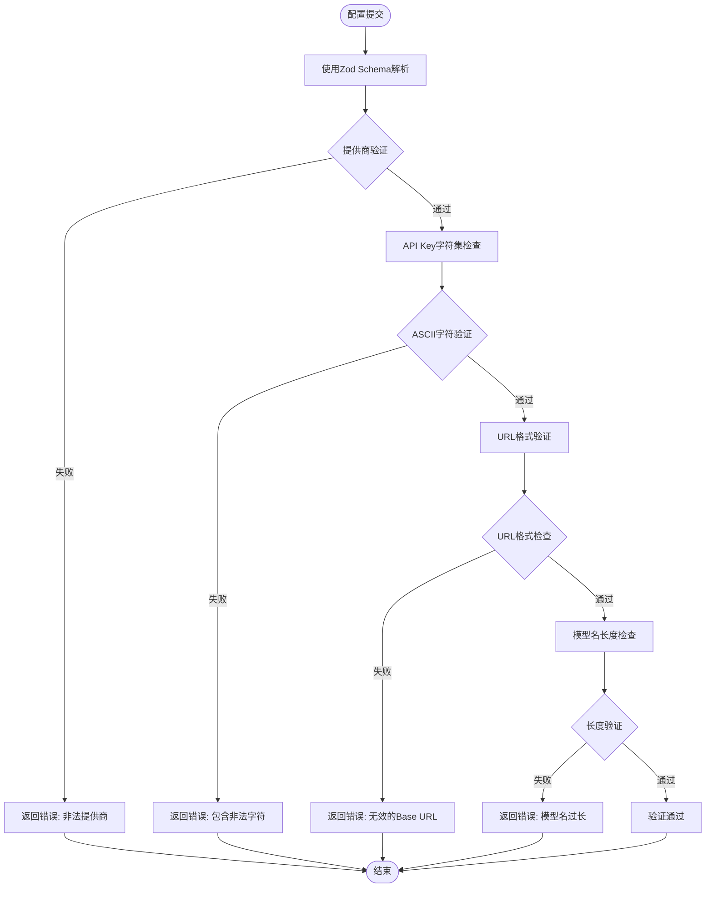
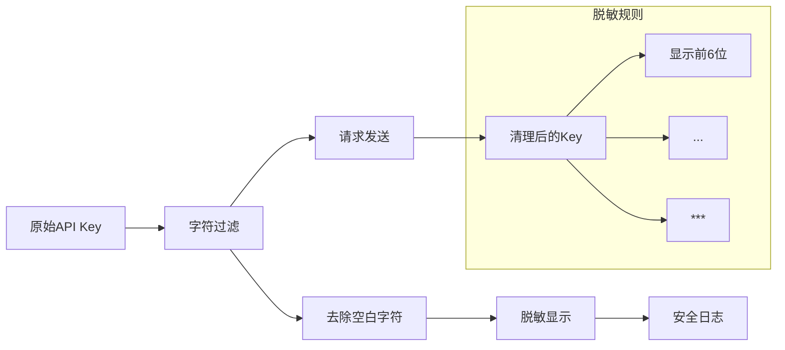
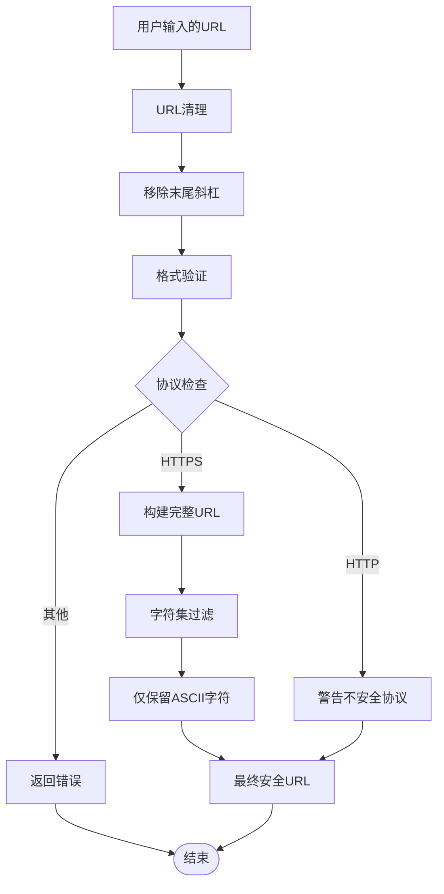
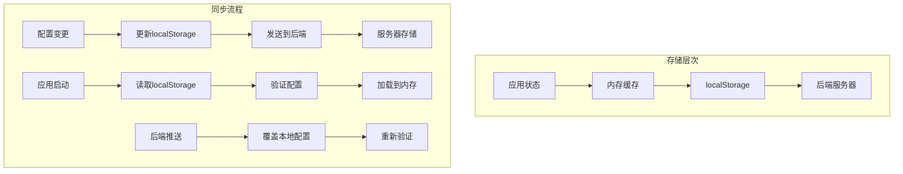
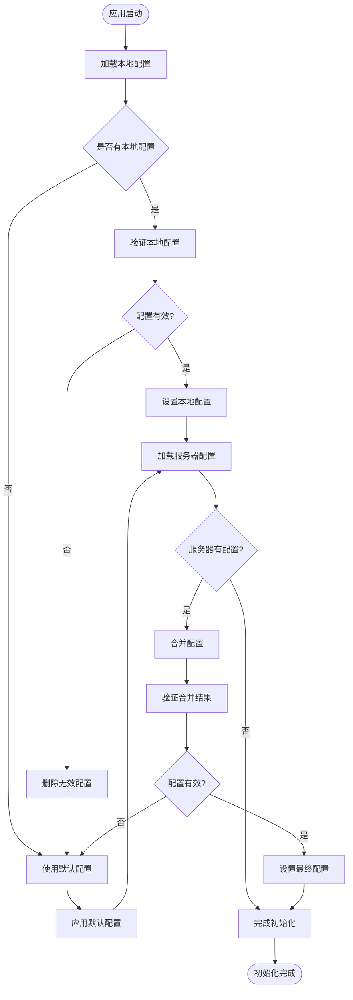
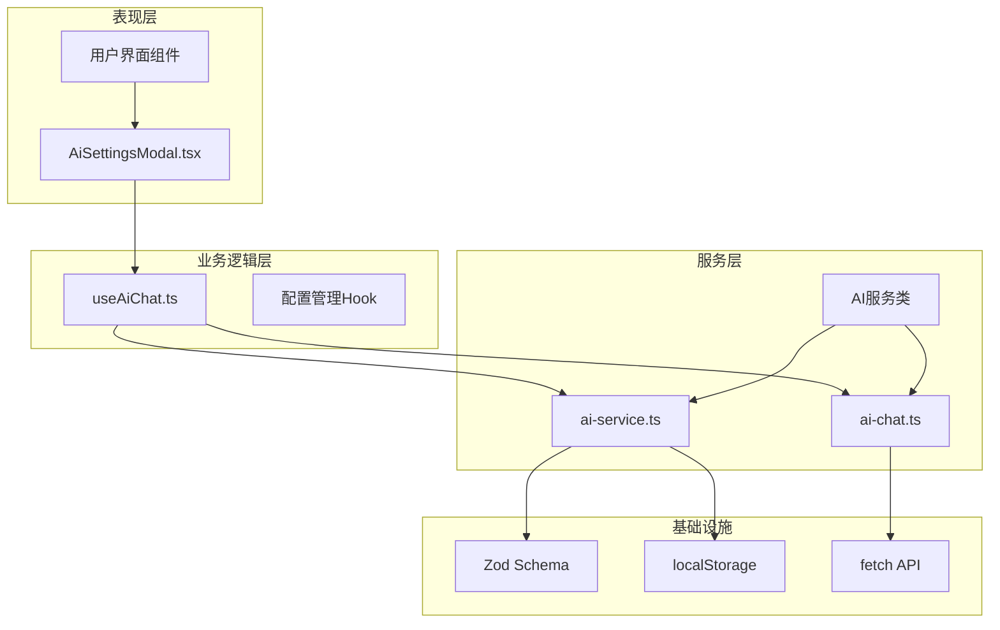

# AI服务配置管理

<cite>
**本文档引用的文件**
- [ai-service.ts](file://src/services/ai-service.ts)
- [AiSettingsModal.tsx](file://src/app/components/AiSettingsModal.tsx)
- [useAiChat.ts](file://src/hooks/useAiChat.ts)
- [ai-chat.ts](file://src/services/ai-chat.ts)
- [README.md](file://README.md)
</cite>

## 目录
1. [简介](#简介)
2. [项目结构](#项目结构)
3. [核心组件](#核心组件)
4. [架构概览](#架构概览)
5. [详细组件分析](#详细组件分析)
6. [依赖关系分析](#依赖关系分析)
7. [性能考虑](#性能考虑)
8. [故障排除指南](#故障排除指南)
9. [结论](#结论)

## 简介

HAUI Dashboard 是一个专业的、基于 AI 的 Home Assistant 仪表板，融合了 iOS 视觉美学与 React 18 的高性能架构。本文档专注于 AI 服务配置管理系统，详细解释了 AI 提供商配置系统的设计与实现，包括硅基流动、阿里云百炼和自定义 OpenAI 兼容接口的配置方法。

该系统提供了完整的配置管理功能，包括配置验证、持久化存储、安全防护和错误处理。通过 Zod Schema 验证机制确保配置的安全性和合法性，实现了 API Key 脱敏处理、URL 清理和字符集过滤等安全措施。

## 项目结构

AI 服务配置管理系统主要分布在以下关键文件中：

**图表来源**
- [ai-service.ts:1-201](file://src/services/ai-service.ts#L1-L201)
- [AiSettingsModal.tsx:1-227](file://src/app/components/AiSettingsModal.tsx#L1-L227)

**章节来源**
- [README.md:1-84](file://README.md#L1-L84)
- [ai-service.ts:1-201](file://src/services/ai-service.ts#L1-L201)

## 核心组件

### AI 配置接口 (AiConfig)

AI 配置接口定义了完整的配置结构，确保所有必要的参数都得到验证和管理：

**图表来源**
- [ai-service.ts:44-49](file://src/services/ai-service.ts#L44-L49)
- [ai-service.ts:42](file://src/services/ai-service.ts#L42)

### 配置提供者系统

系统支持三种主要的 AI 提供商配置：

| 提供商 | 基础URL | 默认模型 | 特点 |
|--------|---------|----------|------|
| SiliconFlow | https://api.siliconflow.cn/v1 | deepseek-ai/DeepSeek-V3 | 免费且模型丰富 |
| 阿里云百炼 | https://dashscope.aliyuncs.com/compatible-mode/v1 | qwen-plus | 稳定可靠 |
| 自定义 | 空字符串 | 空字符串 | OpenAI兼容接口 |

**章节来源**
- [ai-service.ts:6-40](file://src/services/ai-service.ts#L6-L40)

## 架构概览

AI 服务配置管理系统的整体架构采用了分层设计，确保了配置的安全性、可维护性和扩展性：

**图表来源**
- [AiSettingsModal.tsx:35-53](file://src/app/components/AiSettingsModal.tsx#L35-L53)
- [useAiChat.ts:108-120](file://src/hooks/useAiChat.ts#L108-L120)

## 详细组件分析

### Zod Schema 验证机制

系统使用 Zod Schema 实现了多层次的配置验证，确保数据的完整性和安全性：

**图表来源**
- [ai-service.ts:55-62](file://src/services/ai-service.ts#L55-L62)

#### 验证规则详解

1. **提供商验证**: 严格限制提供商类型为 `siliconflow`、`alibaba` 或 `custom`
2. **API Key验证**: 
   - 仅允许 ASCII 可打印字符 (0x20-0x7E)
   - 最大长度 512 字符
   - 防止 Unicode 注入攻击
3. **Base URL验证**: 
   - 必须是有效的 URL 格式
   - 允许为空字符串
   - 自动处理 URL 清理
4. **模型名验证**: 最大长度 256 字符

**章节来源**
- [ai-service.ts:55-62](file://src/services/ai-service.ts#L55-L62)

### API Key 脱敏处理

系统实现了多层 API Key 安全防护机制：

**图表来源**
- [ai-service.ts:75-78](file://src/services/ai-service.ts#L75-L78)
- [ai-service.ts:98](file://src/services/ai-service.ts#L98)

#### 脱敏策略

1. **显示脱敏**: 在用户界面中仅显示 API Key 的前 6 位
2. **日志脱敏**: 在开发者日志中使用脱敏版本
3. **请求脱敏**: 在网络请求中使用清理后的安全 Key

**章节来源**
- [ai-service.ts:75-78](file://src/services/ai-service.ts#L75-L78)

### URL 清理和字符集过滤

系统实现了严格的 URL 和字符集安全处理：

**图表来源**
- [ai-service.ts:92-98](file://src/services/ai-service.ts#L92-L98)

#### 安全过滤规则

1. **URL清理**: 自动移除末尾斜杠，统一 URL 格式
2. **协议验证**: 强制使用 HTTPS 协议
3. **字符过滤**: 移除非 ASCII 字符，防止注入攻击
4. **长度限制**: Base URL 最大长度限制

**章节来源**
- [ai-service.ts:92-98](file://src/services/ai-service.ts#L92-L98)

### 配置持久化存储

系统采用了多层存储策略，确保配置的可靠性和一致性：

**图表来源**
- [useAiChat.ts:80-105](file://src/hooks/useAiChat.ts#L80-L105)
- [useAiChat.ts:108-120](file://src/hooks/useAiChat.ts#L108-L120)

#### 存储策略

1. **本地优先**: 首先从 localStorage 加载配置
2. **后端同步**: 配置变更同时同步到服务器
3. **双重验证**: 本地和服务器配置都进行验证
4. **错误恢复**: 验证失败时自动清理无效配置

**章节来源**
- [useAiChat.ts:80-120](file://src/hooks/useAiChat.ts#L80-L120)

### 默认配置设置和覆盖策略

系统实现了智能的默认配置管理和覆盖机制：

**图表来源**
- [ai-service.ts:64-69](file://src/services/ai-service.ts#L64-L69)
- [useAiChat.ts:80-105](file://src/hooks/useAiChat.ts#L80-L105)

#### 默认配置特性

1. **SiliconFlow 默认**: 推荐的免费提供商
2. **智能回退**: 当配置无效时自动回退到默认值
3. **动态覆盖**: 服务器配置可以动态覆盖本地设置
4. **兼容性保证**: 默认配置确保系统始终可用

**章节来源**
- [ai-service.ts:64-69](file://src/services/ai-service.ts#L64-L69)

## 依赖关系分析

AI 服务配置管理系统展现了清晰的模块化设计和合理的依赖关系：

**图表来源**
- [AiSettingsModal.tsx:1-10](file://src/app/components/AiSettingsModal.tsx#L1-L10)
- [useAiChat.ts:1-8](file://src/hooks/useAiChat.ts#L1-L8)

### 组件耦合度分析

系统采用了松耦合的设计原则：

1. **配置独立**: AI 配置逻辑独立于具体的服务实现
2. **验证隔离**: Zod Schema 验证与业务逻辑分离
3. **存储抽象**: 通过 Hook 抽象存储访问方式
4. **接口统一**: 所有服务共享相同的配置接口

**章节来源**
- [ai-service.ts:1-201](file://src/services/ai-service.ts#L1-L201)
- [useAiChat.ts:1-317](file://src/hooks/useAiChat.ts#L1-L317)

## 性能考虑

系统在设计时充分考虑了性能优化和用户体验：

### 配置加载优化

1. **异步加载**: 配置加载不影响应用启动速度
2. **缓存策略**: 本地存储减少重复验证开销
3. **增量更新**: 仅在配置变更时触发重新验证

### 网络请求优化

1. **URL清理**: 预处理减少网络请求失败
2. **字符过滤**: 避免无效字符导致的请求异常
3. **超时控制**: 合理的请求超时设置

### 内存管理

1. **引用优化**: 使用 useRef 避免不必要的重渲染
2. **状态最小化**: 仅存储必要的配置信息
3. **垃圾回收**: 及时清理过期的配置数据

## 故障排除指南

### 常见配置问题

| 问题类型 | 症状 | 解决方案 |
|----------|------|----------|
| API Key无效 | 鉴权失败(401) | 检查Key格式和有效期 |
| Base URL错误 | 接口未找到(404) | 验证URL格式和网络连通性 |
| 模型名错误 | API请求失败 | 确认模型名称正确性 |
| 字符集问题 | 验证失败 | 检查是否包含特殊字符 |

### 调试技巧

1. **开发模式**: 在 DEV 模式下查看详细错误日志
2. **脱敏日志**: 使用脱敏版本的 API Key 进行调试
3. **网络监控**: 检查网络请求和响应状态

### 错误处理最佳实践

1. **用户友好**: 向用户提供清晰的错误提示
2. **安全日志**: 仅在开发环境记录详细错误信息
3. **优雅降级**: 配置无效时自动使用默认设置

**章节来源**
- [ai-service.ts:125-157](file://src/services/ai-service.ts#L125-L157)
- [useAiChat.ts:272-284](file://src/hooks/useAiChat.ts#L272-L284)

## 结论

AI 服务配置管理系统展现了优秀的软件工程实践，通过以下关键特性确保了系统的安全性、可靠性和易用性：

### 核心优势

1. **多层次安全防护**: 从输入验证到输出脱敏的全方位保护
2. **灵活的配置管理**: 支持多种提供商和自定义配置
3. **智能的错误处理**: 用户友好的错误提示和优雅的降级机制
4. **高效的性能优化**: 异步加载、缓存策略和内存优化

### 技术亮点

- **Zod Schema 验证**: 类型安全和运行时验证的完美结合
- **API Key 脱敏**: 多层脱敏策略确保敏感信息不泄露
- **URL 清理机制**: 自动化的 URL 格式化和安全检查
- **智能持久化**: 分层存储策略确保配置可靠性

### 应用价值

该系统不仅满足了当前的 AI 集成需求，还为未来的扩展和维护奠定了坚实的基础。通过模块化的设计和完善的错误处理机制，系统能够适应不断变化的需求和技术发展。