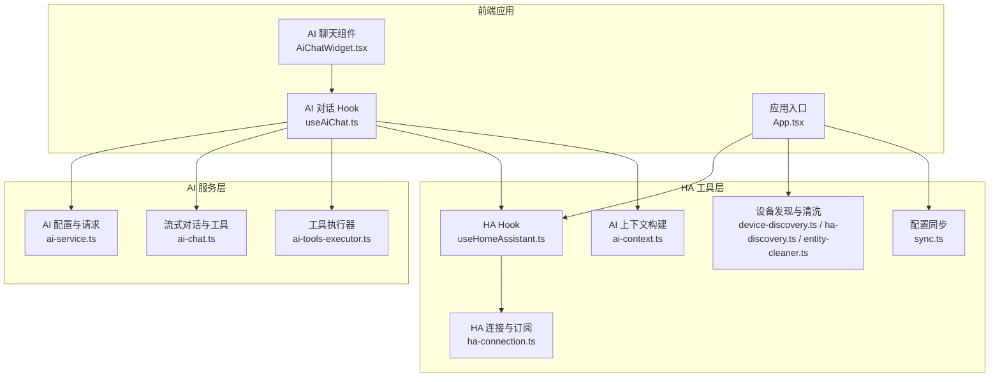
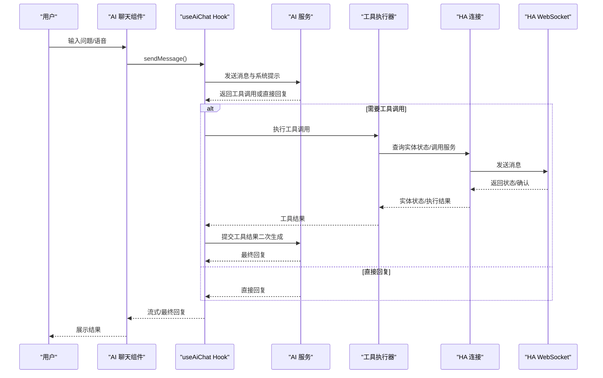
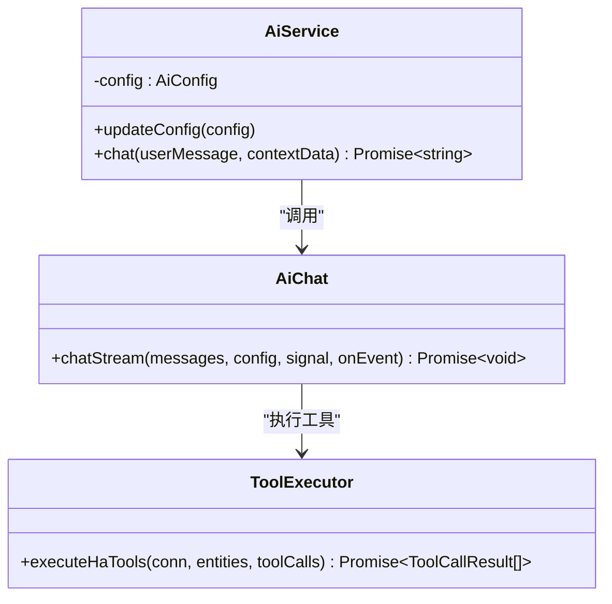
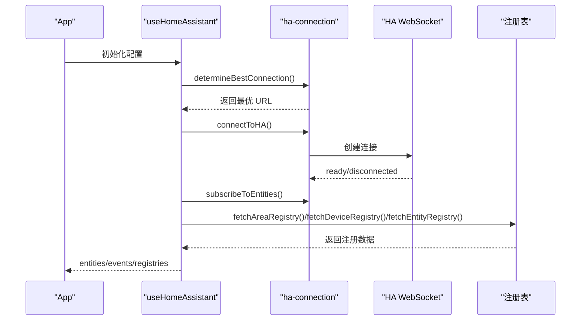
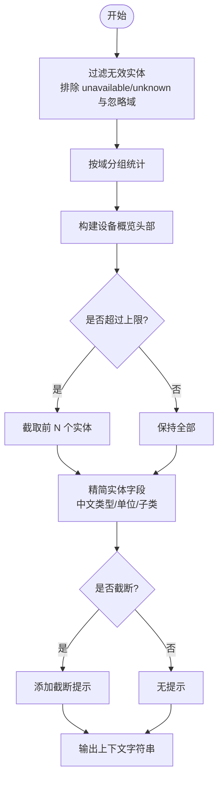
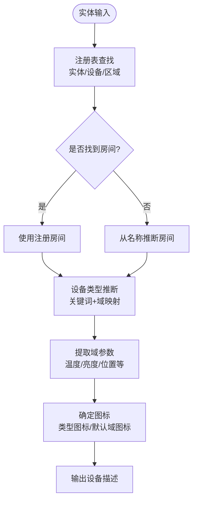
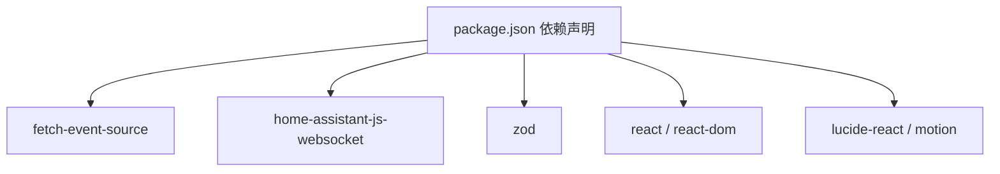

# Home Assistant深度集成

<cite>
**本文档引用的文件**
- [README.md](file://README.md)
- [package.json](file://package.json)
- [src/services/ai-service.ts](file://src/services/ai-service.ts)
- [src/services/ai-chat.ts](file://src/services/ai-chat.ts)
- [src/services/ai-tools-executor.ts](file://src/services/ai-tools-executor.ts)
- [src/utils/ai-context.ts](file://src/utils/ai-context.ts)
- [src/hooks/useHomeAssistant.ts](file://src/hooks/useHomeAssistant.ts)
- [src/utils/ha-connection.ts](file://src/utils/ha-connection.ts)
- [src/utils/device-discovery.ts](file://src/utils/device-discovery.ts)
- [src/utils/ha-discovery.ts](file://src/utils/ha-discovery.ts)
- [src/utils/entity-cleaner.ts](file://src/utils/entity-cleaner.ts)
- [src/hooks/useAiChat.ts](file://src/hooks/useAiChat.ts)
- [src/app/components/AiChatWidget.tsx](file://src/app/components/AiChatWidget.tsx)
- [src/utils/sync.ts](file://src/utils/sync.ts)
- [src/app/App.tsx](file://src/app/App.tsx)
- [src/types/home-assistant.ts](file://src/types/home-assistant.ts)
</cite>

## 目录
1. [简介](#简介)
2. [项目结构](#项目结构)
3. [核心组件](#核心组件)
4. [架构总览](#架构总览)
5. [详细组件分析](#详细组件分析)
6. [依赖关系分析](#依赖关系分析)
7. [性能考量](#性能考量)
8. [故障排查指南](#故障排查指南)
9. [结论](#结论)
10. [附录](#附录)

## 简介
本项目是一个基于 React 18 的专业级 Home Assistant 仪表板，具备 AI 智能助手能力，支持自然语言控制、设备状态查询、自动化建议生成与实时状态同步。本文档聚焦于 AI 与 Home Assistant 的深度集成，涵盖设备状态数据获取与处理、AI 上下文构建、工具调用与服务执行、实时状态同步、实体发现与设备类型识别、以及自动化建议生成与 YAML 代码生成。

## 项目结构
项目采用前端单页应用架构，核心模块围绕 AI 对话、Home Assistant 连接、设备发现与同步、上下文构建与工具执行展开。关键目录与文件如下：
- 服务层：AI 配置与请求封装、流式对话、工具执行
- 工具层：HA 连接、实体清洗、设备发现、上下文构建
- Hooks 层：Home Assistant 连接与状态订阅、AI 对话流程
- 组件层：AI 聊天小部件与 UI 交互
- 类型与配置：Home Assistant 配置类型、依赖声明

**图表来源**
- [src/app/components/AiChatWidget.tsx:1-678](file://src/app/components/AiChatWidget.tsx#L1-678)
- [src/hooks/useAiChat.ts:1-317](file://src/hooks/useAiChat.ts#L1-317)
- [src/services/ai-service.ts:1-201](file://src/services/ai-service.ts#L1-201)
- [src/services/ai-chat.ts:1-153](file://src/services/ai-chat.ts#L1-153)
- [src/services/ai-tools-executor.ts:1-60](file://src/services/ai-tools-executor.ts#L1-60)
- [src/utils/ha-connection.ts:1-317](file://src/utils/ha-connection.ts#L1-317)
- [src/hooks/useHomeAssistant.ts:1-313](file://src/hooks/useHomeAssistant.ts#L1-313)
- [src/utils/ai-context.ts:1-92](file://src/utils/ai-context.ts#L1-92)
- [src/utils/device-discovery.ts:1-161](file://src/utils/device-discovery.ts#L1-161)
- [src/utils/ha-discovery.ts:1-167](file://src/utils/ha-discovery.ts#L1-167)
- [src/utils/entity-cleaner.ts:1-381](file://src/utils/entity-cleaner.ts#L1-381)
- [src/utils/sync.ts:1-161](file://src/utils/sync.ts#L1-161)
- [src/app/App.tsx:1-1053](file://src/app/App.tsx#L1-1053)

**章节来源**
- [README.md:1-84](file://README.md#L1-L84)
- [package.json:1-132](file://package.json#L1-L132)

## 核心组件
- AI 配置与请求封装：提供多厂商 AI 服务配置、Zod 校验、安全脱敏与统一请求封装。
- 流式对话与工具：基于 OpenAI 兼容接口的 Function Calling，支持工具调用拦截与二次回复。
- HA 连接与订阅：WebSocket 连接、实体订阅、事件监听、注册表获取与连接可用性检测。
- AI 上下文构建：过滤无效实体、中文标签映射、实体精简与 JSON 序列化。
- 设备发现与清洗：基于注册表与名称关键字的房间与类型推断、默认图标映射、参数提取。
- 工具执行器：本地实体状态查询与 HA 服务调用执行。
- 配置同步：跨设备配置持久化与增量对齐。

**章节来源**
- [src/services/ai-service.ts:1-201](file://src/services/ai-service.ts#L1-L201)
- [src/services/ai-chat.ts:1-153](file://src/services/ai-chat.ts#L1-L153)
- [src/services/ai-tools-executor.ts:1-60](file://src/services/ai-tools-executor.ts#L1-L60)
- [src/utils/ai-context.ts:1-92](file://src/utils/ai-context.ts#L1-L92)
- [src/utils/ha-connection.ts:1-317](file://src/utils/ha-connection.ts#L1-L317)
- [src/hooks/useHomeAssistant.ts:1-313](file://src/hooks/useHomeAssistant.ts#L1-L313)
- [src/utils/device-discovery.ts:1-161](file://src/utils/device-discovery.ts#L1-L161)
- [src/utils/ha-discovery.ts:1-167](file://src/utils/ha-discovery.ts#L1-L167)
- [src/utils/entity-cleaner.ts:1-381](file://src/utils/entity-cleaner.ts#L1-L381)
- [src/utils/sync.ts:1-161](file://src/utils/sync.ts#L1-L161)

## 架构总览
AI 与 Home Assistant 的深度集成通过以下链路实现：
- 用户通过 AI 聊天组件发起对话，AI 服务根据系统提示与上下文生成回复。
- 当需要设备状态或执行服务时，AI 通过 Function Calling 触发工具调用。
- 工具执行器在本地查询 HA 实体状态或通过 HA 连接调用服务。
- HA Hook 通过 WebSocket 订阅实体状态变化与事件，实现实时同步。
- 设备发现与清洗模块负责从 HA 注册表与实体名称中推断房间与设备类型，提升 AI 理解能力。

**图表来源**
- [src/app/components/AiChatWidget.tsx:1-678](file://src/app/components/AiChatWidget.tsx#L1-678)
- [src/hooks/useAiChat.ts:1-317](file://src/hooks/useAiChat.ts#L1-L317)
- [src/services/ai-service.ts:1-201](file://src/services/ai-service.ts#L1-L201)
- [src/services/ai-chat.ts:1-153](file://src/services/ai-chat.ts#L1-L153)
- [src/services/ai-tools-executor.ts:1-60](file://src/services/ai-tools-executor.ts#L1-L60)
- [src/utils/ha-connection.ts:1-317](file://src/utils/ha-connection.ts#L1-L317)

## 详细组件分析

### AI 服务与对话流程
- AI 配置与请求封装：支持多家 AI 供应商，提供 Zod 校验、API Key 脱敏、URL 正规化与错误处理。
- 流式对话与工具：定义工具函数（查询实体状态、调用 HA 服务），通过 SSE 流式接收内容与工具调用，支持中断与错误处理。
- 工具执行器：解析工具调用参数，执行本地实体查询或 HA 服务调用，返回结构化结果。

**图表来源**
- [src/services/ai-service.ts:1-201](file://src/services/ai-service.ts#L1-L201)
- [src/services/ai-chat.ts:1-153](file://src/services/ai-chat.ts#L1-L153)
- [src/services/ai-tools-executor.ts:1-60](file://src/services/ai-tools-executor.ts#L1-L60)

**章节来源**
- [src/services/ai-service.ts:1-201](file://src/services/ai-service.ts#L1-L201)
- [src/services/ai-chat.ts:1-153](file://src/services/ai-chat.ts#L1-L153)
- [src/services/ai-tools-executor.ts:1-60](file://src/services/ai-tools-executor.ts#L1-L60)

### Home Assistant 连接与实时同步
- 连接与订阅：支持本地/公网 URL 优选、WebSocket 连接、实体订阅、事件订阅、注册表获取。
- 连接可用性检测：HTTP 与 WebSocket 双通道检测，避免 CORS 限制。
- Hook 管理：封装连接生命周期、心跳检测、错误恢复与重连策略。

**图表来源**
- [src/hooks/useHomeAssistant.ts:1-313](file://src/hooks/useHomeAssistant.ts#L1-L313)
- [src/utils/ha-connection.ts:1-317](file://src/utils/ha-connection.ts#L1-L317)

**章节来源**
- [src/hooks/useHomeAssistant.ts:1-313](file://src/hooks/useHomeAssistant.ts#L1-L313)
- [src/utils/ha-connection.ts:1-317](file://src/utils/ha-connection.ts#L1-L317)

### AI 上下文构建与数据格式化
- 实体过滤：排除 unavailable/unknown 状态与特定域（如 update、script、automation 等）。
- 中文标签映射：将域名映射为中文标签，提升 LLM 理解。
- 实体精简：限制最大实体数量，避免 token 超限；附加单位与设备子类信息。
- JSON 序列化：输出结构化上下文字符串，便于 LLM 消费。

**图表来源**
- [src/utils/ai-context.ts:1-92](file://src/utils/ai-context.ts#L1-L92)

**章节来源**
- [src/utils/ai-context.ts:1-92](file://src/utils/ai-context.ts#L1-L92)

### 实体发现、设备类型识别与自定义实体处理
- 注册表驱动：优先从实体/设备注册表获取房间归属，其次从实体名称推断。
- 设备类型推断：基于中文关键词与域映射，区分灯光、开关、窗帘、空调、传感器、安防、人员、场景等。
- 参数提取：针对不同域提取温度、亮度、位置、风速、摆风等参数，增强上下文信息。
- 默认图标映射：域到 MDI 图标的默认映射，支持覆盖。

**图表来源**
- [src/utils/device-discovery.ts:1-161](file://src/utils/device-discovery.ts#L1-L161)
- [src/utils/ha-discovery.ts:1-167](file://src/utils/ha-discovery.ts#L1-L167)
- [src/utils/entity-cleaner.ts:1-381](file://src/utils/entity-cleaner.ts#L1-L381)

**章节来源**
- [src/utils/device-discovery.ts:1-161](file://src/utils/device-discovery.ts#L1-L161)
- [src/utils/ha-discovery.ts:1-167](file://src/utils/ha-discovery.ts#L1-L167)
- [src/utils/entity-cleaner.ts:1-381](file://src/utils/entity-cleaner.ts#L1-L381)

### AI 自动化建议生成与 YAML 代码生成
- 场景分析：基于当前设备状态与类型，分析潜在自动化场景（如光照/存在/温控联动）。
- 逻辑推理：结合设备属性与用户习惯，提出可执行的自动化思路。
- YAML 生成：以简洁易懂的方式输出 Home Assistant Automation YAML 示例，便于用户快速部署。

说明：该功能在 AI 系统提示中明确要求，实际 YAML 生成由 LLM 根据上下文与用户需求动态产出，无需额外代码实现。

**章节来源**
- [src/services/ai-service.ts:170-185](file://src/services/ai-service.ts#L170-L185)

### 应用模式与最佳实践
- 语音与文本双模：支持全双工语音与键盘输入，TTS 朗读 AI 回复。
- 实时状态反馈：通过事件流与 WebSocket 实时展示设备状态变更。
- 配置云端同步：跨设备配置持久化与增量对齐，避免重复配置。
- 安全与健壮性：API Key 校验、脱敏输出、网络错误处理、连接重试与心跳检测。

**章节来源**
- [src/app/components/AiChatWidget.tsx:1-678](file://src/app/components/AiChatWidget.tsx#L1-L678)
- [src/utils/sync.ts:1-161](file://src/utils/sync.ts#L1-L161)
- [src/hooks/useHomeAssistant.ts:1-313](file://src/hooks/useHomeAssistant.ts#L1-L313)

## 依赖关系分析
- 依赖管理：通过 package.json 管理前端依赖，包含 React、@microsoft/fetch-event-source、home-assistant-js-websocket、zod 等。
- 关键依赖：
  - @microsoft/fetch-event-source：用于 SSE 流式对话。
  - home-assistant-js-websocket：HA WebSocket 连接与订阅。
  - zod：AI 配置校验与安全防护。
  - lucide-react、motion/react：UI 与动画。

**图表来源**
- [package.json:1-132](file://package.json#L1-L132)

**章节来源**
- [package.json:1-132](file://package.json#L1-L132)

## 性能考量
- SSE 流式传输：减少首字节延迟，提升交互体验。
- 实体上下文精简：限制实体数量与字段，降低 token 消耗。
- WebSocket 订阅：实时获取状态变化，避免轮询。
- 连接优选与心跳：自动选择最优连接并检测延迟，提升稳定性。
- 配置同步防抖：本地变更合并后批量同步，降低网络压力。

[本节为通用指导，无需具体文件分析]

## 故障排查指南
- 连接失败：检查 HA URL 与 Token 配置，确认网络可达与鉴权有效。
- 401/404 错误：核对 Base URL 与模型名称，确保接口路径正确。
- 网络异常：关注流式连接中断与工具调用失败，必要时重试或切换连接。
- 实体状态缺失：确认实体未被禁用/隐藏，检查注册表与名称映射。
- 配置未同步：检查同步心跳与对齐逻辑，确保服务端可访问。

**章节来源**
- [src/services/ai-service.ts:120-158](file://src/services/ai-service.ts#L120-L158)
- [src/utils/ha-connection.ts:92-104](file://src/utils/ha-connection.ts#L92-L104)
- [src/utils/sync.ts:74-93](file://src/utils/sync.ts#L74-L93)

## 结论
本项目通过完善的 AI 与 Home Assistant 集成方案，实现了从设备状态获取、上下文构建、工具调用到实时同步的全链路闭环。借助流式对话、工具执行与注册表驱动的设备发现，系统在保证安全性与稳定性的同时，提供了自然语言控制与自动化建议生成的能力，适用于多种智能家居场景。

[本节为总结性内容，无需具体文件分析]

## 附录
- 配置类型：Home Assistant 连接配置结构，包含本地/公网 URL、Token、设备映射等。
- 环境变量：VITE_HA_URL、VITE_HA_TOKEN 用于默认连接配置。
- 后端 API：/api/ai/config 用于加载/保存 AI 配置；/api/storage 用于配置同步。

**章节来源**
- [src/types/home-assistant.ts:1-12](file://src/types/home-assistant.ts#L1-L12)
- [src/utils/ha-connection.ts:12-14](file://src/utils/ha-connection.ts#L12-L14)
- [src/hooks/useAiChat.ts:96-120](file://src/hooks/useAiChat.ts#L96-L120)
- [src/utils/sync.ts:4-24](file://src/utils/sync.ts#L4-L24)