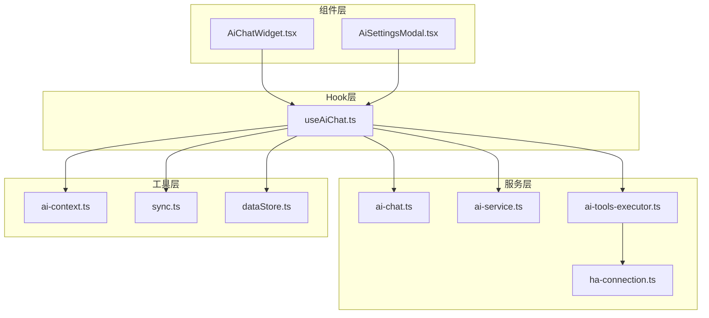
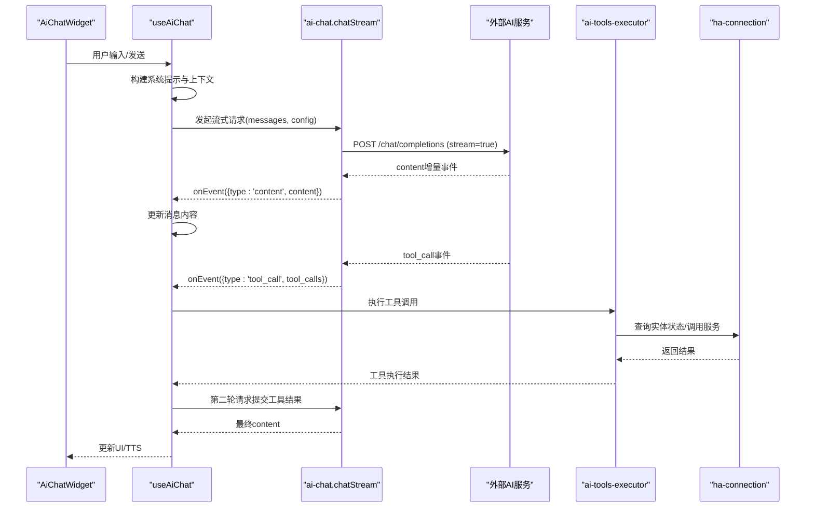
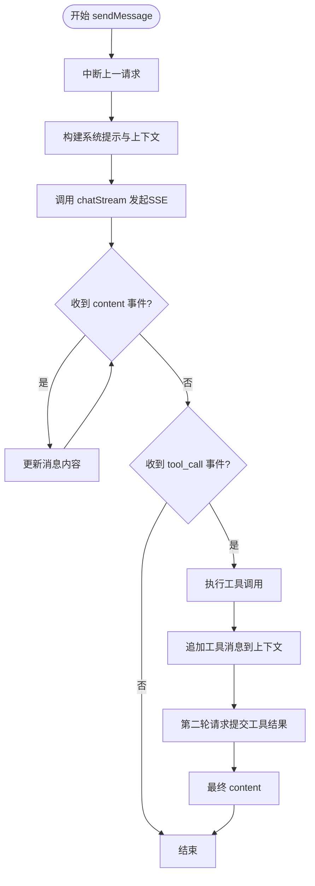
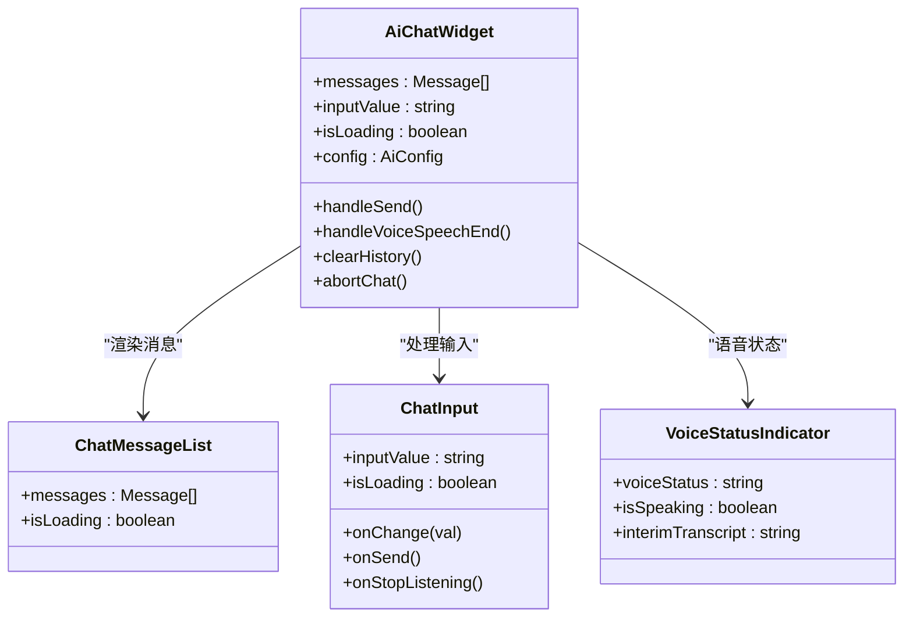
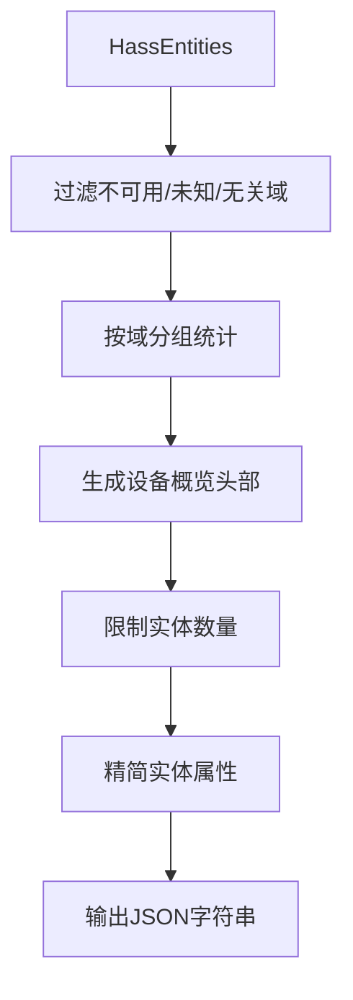
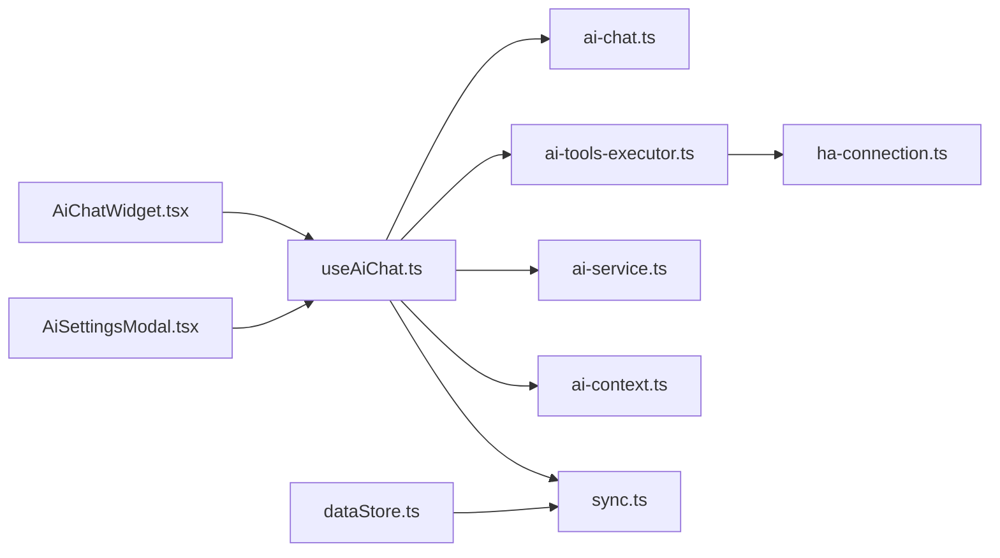

# 聊天对话实现

<cite>
**本文档引用的文件**
- [AiChatWidget.tsx](file://src/app/components/AiChatWidget.tsx)
- [useAiChat.ts](file://src/hooks/useAiChat.ts)
- [ai-chat.ts](file://src/services/ai-chat.ts)
- [ai-service.ts](file://src/services/ai-service.ts)
- [ai-context.ts](file://src/utils/ai-context.ts)
- [ai-tools-executor.ts](file://src/services/ai-tools-executor.ts)
- [ha-connection.ts](file://src/utils/ha-connection.ts)
- [AiSettingsModal.tsx](file://src/app/components/AiSettingsModal.tsx)
- [dataStore.ts](file://src/store/dataStore.ts)
- [sync.ts](file://src/utils/sync.ts)
</cite>

## 目录
1. [简介](#简介)
2. [项目结构](#项目结构)
3. [核心组件](#核心组件)
4. [架构总览](#架构总览)
5. [详细组件分析](#详细组件分析)
6. [依赖关系分析](#依赖关系分析)
7. [性能考虑](#性能考虑)
8. [故障排除指南](#故障排除指南)
9. [结论](#结论)
10. [附录](#附录)

## 简介
本文件面向AI聊天对话系统的实现，围绕以下目标展开：
- 解释消息流式传输机制、上下文管理和会话状态维护
- 深入分析useAiChat Hook的实现逻辑，包括消息发送、接收响应和状态更新
- 阐述AiChatWidget组件的设计模式，包括用户界面交互、消息展示和输入处理
- 分析系统提示词的构建策略，包括设备状态快照整合和任务指令设计
- 包含错误处理、网络异常恢复和用户体验优化的实现细节
- 提供聊天历史管理、消息持久化和并发处理的技术方案

## 项目结构
该聊天系统采用“组件 + Hook + 服务”的分层架构：
- 组件层：负责UI渲染与用户交互（AiChatWidget、AiSettingsModal）
- Hook层：封装业务逻辑与状态管理（useAiChat）
- 服务层：封装外部API与工具执行（ai-chat、ai-service、ai-tools-executor、ha-connection）
- 工具层：上下文构建、同步与连接管理（ai-context、sync、ha-connection）

图表来源
- [AiChatWidget.tsx:1-678](file://src/app/components/AiChatWidget.tsx#L1-L678)
- [useAiChat.ts:1-317](file://src/hooks/useAiChat.ts#L1-L317)
- [ai-chat.ts:1-153](file://src/services/ai-chat.ts#L1-L153)
- [ai-service.ts:1-201](file://src/services/ai-service.ts#L1-L201)
- [ai-tools-executor.ts:1-60](file://src/services/ai-tools-executor.ts#L1-L60)
- [ha-connection.ts:1-317](file://src/utils/ha-connection.ts#L1-L317)
- [ai-context.ts:1-92](file://src/utils/ai-context.ts#L1-L92)
- [sync.ts:1-161](file://src/utils/sync.ts#L1-L161)
- [dataStore.ts:1-129](file://src/store/dataStore.ts#L1-L129)

章节来源
- [AiChatWidget.tsx:1-678](file://src/app/components/AiChatWidget.tsx#L1-L678)
- [useAiChat.ts:1-317](file://src/hooks/useAiChat.ts#L1-L317)

## 核心组件
- AiChatWidget：浮动/侧边栏聊天界面，负责消息渲染、输入处理、语音模式、TTS朗读与设置面板切换
- useAiChat：核心Hook，管理消息列表、输入值、加载状态、配置、发送消息、保存配置、清空历史与中断请求
- ai-chat：封装SSE流式请求，解析content与tool_call事件，统一错误处理
- ai-service：AI配置管理与安全校验，提供通用OpenAI兼容请求能力
- ai-tools-executor：解析并执行AI识别的工具调用（查询实体状态、调用HA服务）
- ha-connection：Home Assistant连接管理与服务调用
- ai-context：设备状态快照构建，过滤与精简实体，限制实体数量
- AiSettingsModal：AI配置面板，提供提供商选择、模型选择、API Key输入与保存
- dataStore/sync：本地持久化与跨设备同步

章节来源
- [AiChatWidget.tsx:329-678](file://src/app/components/AiChatWidget.tsx#L329-L678)
- [useAiChat.ts:57-317](file://src/hooks/useAiChat.ts#L57-L317)
- [ai-chat.ts:25-153](file://src/services/ai-chat.ts#L25-L153)
- [ai-service.ts:44-201](file://src/services/ai-service.ts#L44-L201)
- [ai-tools-executor.ts:17-60](file://src/services/ai-tools-executor.ts#L17-L60)
- [ha-connection.ts:47-147](file://src/utils/ha-connection.ts#L47-L147)
- [ai-context.ts:32-92](file://src/utils/ai-context.ts#L32-L92)
- [AiSettingsModal.tsx:12-227](file://src/app/components/AiSettingsModal.tsx#L12-L227)
- [dataStore.ts:58-129](file://src/store/dataStore.ts#L58-L129)
- [sync.ts:52-161](file://src/utils/sync.ts#L52-L161)

## 架构总览
系统采用“前端直连外部AI服务”的SSE流式架构，同时支持工具调用以查询或控制Home Assistant设备。整体流程如下：

图表来源
- [useAiChat.ts:132-292](file://src/hooks/useAiChat.ts#L132-L292)
- [ai-chat.ts:89-151](file://src/services/ai-chat.ts#L89-L151)
- [ai-tools-executor.ts:17-60](file://src/services/ai-tools-executor.ts#L17-L60)
- [ha-connection.ts:132-139](file://src/utils/ha-connection.ts#L132-L139)

## 详细组件分析

### useAiChat Hook实现
- 状态管理
  - messages：消息数组，包含user/ai/tool三类消息；初始化包含欢迎消息
  - inputValue：当前输入文本
  - isLoading：是否处于流式生成中
  - config：AI配置（provider、apiKey、baseUrl、modelName）
- 生命周期与配置
  - 初始化：从localStorage与后端拉取配置，Zod校验合法性
  - 保存配置：本地+后端同步，失败静默处理
- 发送消息流程
  - 中断上一次请求（AbortController）
  - 构建系统提示与上下文（不直接塞入全量实体状态）
  - 调用chatStream发起SSE流式请求
  - 流式事件处理：content增量更新UI；tool_call拦截工具调用
  - 工具执行：本地查询实体状态或远程调用HA服务
  - 第二轮请求：将工具结果提交给模型生成最终回复
  - 结束：清理状态、触发TTS回调
- 并发与中断
  - 使用AbortController保证同一时间只有一个活跃请求
  - 支持用户在生成过程中再次发送消息中断旧请求
- 错误处理
  - 捕获AbortError（用户中断）与网络错误
  - 将错误消息插入消息列表，触发onError回调
- 清空历史
  - 确认后中断请求并重置为欢迎消息

图表来源
- [useAiChat.ts:132-292](file://src/hooks/useAiChat.ts#L132-L292)

章节来源
- [useAiChat.ts:57-317](file://src/hooks/useAiChat.ts#L57-L317)

### AiChatWidget组件设计
- 视图模式
  - floating：浮动窗口，支持拖拽、最小化、侧边栏切换
  - sidebar：侧边栏模式（桌面端）
  - minimized：最小化
- 消息展示
  - ChatMessageList：渲染用户/助手/工具消息，支持Markdown渲染与安全净化
  - 加载指示器：流式生成时显示“思考中”动画
- 输入处理
  - 文本输入：自动高度调整、快捷键发送
  - 语音输入：按住说话手势、上滑取消、录音状态提示
  - 语音识别：手动模式，支持实时转写与取消
- 语音与TTS
  - voiceStatus：idle/listening/thinking/speaking状态指示
  - TTS：AI回复完成后触发朗读，支持打断
- 设置面板
  - 切换到AiSettingsModal，保存配置后返回聊天页

图表来源
- [AiChatWidget.tsx:329-678](file://src/app/components/AiChatWidget.tsx#L329-L678)

章节来源
- [AiChatWidget.tsx:1-678](file://src/app/components/AiChatWidget.tsx#L1-L678)

### 系统提示词构建策略
- 设备状态快照整合
  - ai-context过滤不可用/未知状态实体，排除无关域与前缀
  - 限制实体数量上限，避免token超限
  - 生成中文标签与单位信息，便于LLM理解
- 任务指令设计
  - 明确角色定位（家庭自动化管家）
  - 指导工具使用（先查询状态再回答）
  - 语音场景下的简练要求
  - 未找到设备或调用报错时如实告知

图表来源
- [ai-context.ts:32-92](file://src/utils/ai-context.ts#L32-L92)

章节来源
- [ai-context.ts:1-92](file://src/utils/ai-context.ts#L1-L92)
- [useAiChat.ts:154-166](file://src/hooks/useAiChat.ts#L154-L166)

### 流式传输机制与上下文管理
- SSE流式请求
  - 使用@ms/fetch-event-source，逐条解析choices.delta.content
  - 工具调用按索引聚合，最终一次性上报
- 上下文管理
  - 不直接塞入全量实体状态，避免token超限
  - 仅将对话历史与工具结果作为上下文
- 并发控制
  - 单请求AbortController，避免竞态
  - 用户中断即刻停止

章节来源
- [ai-chat.ts:25-153](file://src/services/ai-chat.ts#L25-L153)
- [useAiChat.ts:168-200](file://src/hooks/useAiChat.ts#L168-L200)

### 工具调用与Home Assistant集成
- 工具类型
  - get_entity_state：查询实体状态
  - call_ha_service：调用HA服务控制设备
- 执行策略
  - 本地查询：直接从entities对象读取
  - 远程调用：建立HA连接后调用对应服务
- 错误处理
  - 工具执行异常捕获并返回可读结果

章节来源
- [ai-tools-executor.ts:17-60](file://src/services/ai-tools-executor.ts#L17-L60)
- [ha-connection.ts:132-139](file://src/utils/ha-connection.ts#L132-L139)

### 配置与安全
- 配置来源
  - localStorage优先，后端接口兜底
  - Zod Schema严格校验，防止非法配置
- 安全措施
  - API Key清洗（仅ASCII可打印字符）
  - 错误信息脱敏，不向用户暴露敏感信息
  - Provider预设与模型下拉选择

章节来源
- [useAiChat.ts:79-120](file://src/hooks/useAiChat.ts#L79-L120)
- [ai-service.ts:55-78](file://src/services/ai-service.ts#L55-L78)
- [AiSettingsModal.tsx:35-53](file://src/app/components/AiSettingsModal.tsx#L35-L53)

### 聊天历史管理与持久化
- 前端状态
  - useAiChat维护messages与inputValue，支持清空历史
- 本地持久化
  - dataStore：设备、房间、场景、用户、日志等数据持久化
  - sync：主动/被动同步localStorage到服务端，支持防抖与版本控制
- 聊天历史
  - 当前实现未将messages持久化到localStorage或服务端
  - 如需长期保留，可在clearHistory与sendMessage处扩展

章节来源
- [useAiChat.ts:294-303](file://src/hooks/useAiChat.ts#L294-L303)
- [dataStore.ts:58-129](file://src/store/dataStore.ts#L58-L129)
- [sync.ts:52-161](file://src/utils/sync.ts#L52-L161)

## 依赖关系分析

图表来源
- [AiChatWidget.tsx:10-15](file://src/app/components/AiChatWidget.tsx#L10-L15)
- [useAiChat.ts:2-7](file://src/hooks/useAiChat.ts#L2-L7)
- [ai-chat.ts:5-6](file://src/services/ai-chat.ts#L5-L6)
- [ai-tools-executor.ts:6-7](file://src/services/ai-tools-executor.ts#L6-L7)
- [ha-connection.ts:1-10](file://src/utils/ha-connection.ts#L1-L10)
- [AiSettingsModal.tsx:3](file://src/app/components/AiSettingsModal.tsx#L3)
- [dataStore.ts:1-2](file://src/store/dataStore.ts#L1-L2)
- [sync.ts:4-24](file://src/utils/sync.ts#L4-L24)

章节来源
- [useAiChat.ts:1-317](file://src/hooks/useAiChat.ts#L1-L317)
- [ai-chat.ts:1-153](file://src/services/ai-chat.ts#L1-L153)

## 性能考虑
- 流式渲染
  - SSE增量推送，即时更新UI，减少等待时间
- 实体上下文优化
  - 过滤与限制实体数量，降低token消耗
- 并发控制
  - 单请求AbortController，避免重复计算与网络争用
- UI动画与懒加载
  - 使用AnimatePresence与motion组件，仅在必要时渲染
- 网络异常恢复
  - fetchEventSource自动重连策略（由库实现）
  - HA连接可用性检查与代理回退

[本节为通用性能讨论，无需特定文件来源]

## 故障排除指南
- 网络与鉴权
  - 401/404错误：检查API Key与Base URL/模型名
  - 网络失败：检查网络连通性与代理设置
- HA连接
  - 无法连接：确认URL与Token，尝试代理回退
  - 无效Token：更换有效长期访问令牌
- 工具调用
  - 实体不存在：提示用户检查实体ID
  - 服务调用失败：查看HA日志与服务参数
- UI卡顿
  - 检查消息数量与Markdown渲染复杂度
  - 关闭不必要的动画或降级渲染

章节来源
- [ai-service.ts:121-158](file://src/services/ai-service.ts#L121-L158)
- [ha-connection.ts:94-104](file://src/utils/ha-connection.ts#L94-L104)
- [useAiChat.ts:272-292](file://src/hooks/useAiChat.ts#L272-L292)

## 结论
该聊天系统通过清晰的分层架构实现了稳定的流式对话体验，具备以下优势：
- 流式传输与工具调用无缝衔接，满足“先查询状态再执行”的自动化需求
- 安全与健壮性：Zod校验、API Key清洗、错误脱敏与连接可用性检查
- 用户体验：语音输入、TTS朗读、侧边栏/浮动视图与状态指示
建议后续增强：
- 将messages持久化到localStorage或服务端，支持跨设备恢复
- 引入消息分页与历史检索功能
- 增加工具调用的可视化反馈与重试机制

[本节为总结性内容，无需特定文件来源]

## 附录
- 术语
  - SSE：Server-Sent Events，服务端推送事件
  - LLM：大语言模型
  - HA：Home Assistant
- 相关文件
  - [AiChatWidget.tsx](file://src/app/components/AiChatWidget.tsx)
  - [useAiChat.ts](file://src/hooks/useAiChat.ts)
  - [ai-chat.ts](file://src/services/ai-chat.ts)
  - [ai-service.ts](file://src/services/ai-service.ts)
  - [ai-context.ts](file://src/utils/ai-context.ts)
  - [ai-tools-executor.ts](file://src/services/ai-tools-executor.ts)
  - [ha-connection.ts](file://src/utils/ha-connection.ts)
  - [AiSettingsModal.tsx](file://src/app/components/AiSettingsModal.tsx)
  - [dataStore.ts](file://src/store/dataStore.ts)
  - [sync.ts](file://src/utils/sync.ts)

[本节为附录内容，无需特定文件来源]