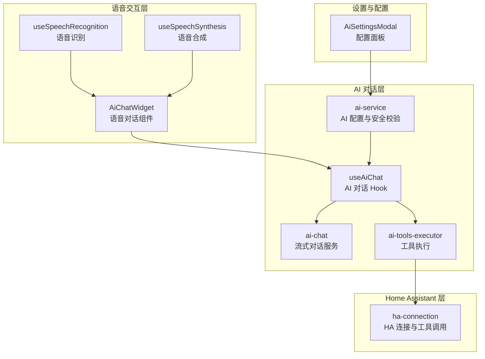
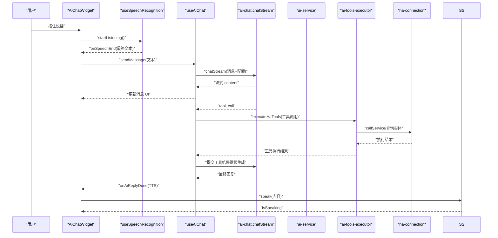
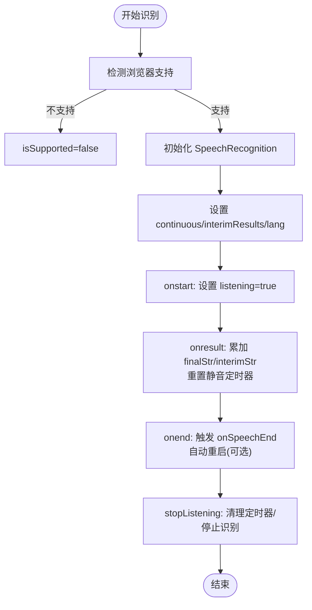
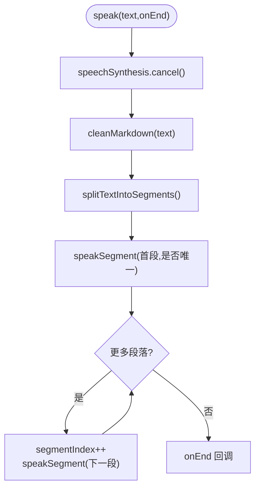
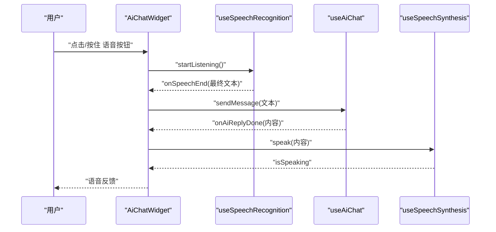
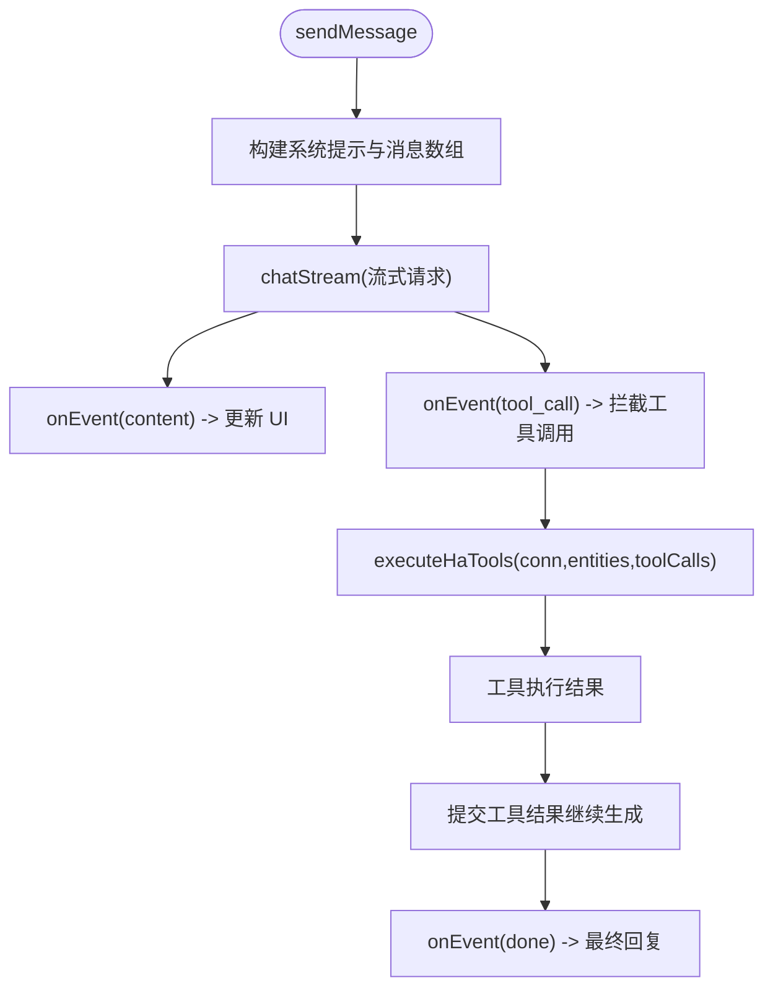
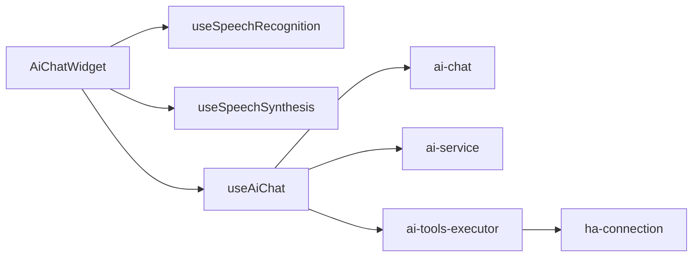

# 语音交互系统

<cite>
**本文档引用的文件**
- [useSpeechRecognition.ts](file://src/hooks/useSpeechRecognition.ts)
- [useSpeechSynthesis.ts](file://src/hooks/useSpeechSynthesis.ts)
- [AiChatWidget.tsx](file://src/app/components/AiChatWidget.tsx)
- [useAiChat.ts](file://src/hooks/useAiChat.ts)
- [ai-chat.ts](file://src/services/ai-chat.ts)
- [ai-service.ts](file://src/services/ai-service.ts)
- [ai-tools-executor.ts](file://src/services/ai-tools-executor.ts)
- [ha-connection.ts](file://src/utils/ha-connection.ts)
- [AiSettingsModal.tsx](file://src/app/components/AiSettingsModal.tsx)
</cite>

## 目录
1. [简介](#简介)
2. [项目结构](#项目结构)
3. [核心组件](#核心组件)
4. [架构总览](#架构总览)
5. [详细组件分析](#详细组件分析)
6. [依赖关系分析](#依赖关系分析)
7. [性能考虑](#性能考虑)
8. [故障排除指南](#故障排除指南)
9. [结论](#结论)
10. [附录](#附录)

## 简介
本项目为基于浏览器 Web Speech API 的 AI 语音交互系统，集成了语音识别、语音合成、AI 对话、Home Assistant 设备控制与状态查询等功能。系统采用 React Hooks 抽象语音能力，配合流式 AI 对话与工具调用机制，实现从语音输入到设备控制的完整闭环。同时提供可视化设置面板，支持多模型提供商、API Key 管理与语音参数配置。

## 项目结构
系统围绕语音交互的关键模块组织，主要包括：
- 语音识别 Hook：useSpeechRecognition
- 语音合成 Hook：useSpeechSynthesis
- AI 对话 Hook：useAiChat
- 语音对话组件：AiChatWidget
- AI 服务与工具执行：ai-chat、ai-service、ai-tools-executor
- Home Assistant 连接与工具执行：ha-connection、ai-tools-executor
- 设置面板：AiSettingsModal

**图表来源**
- [useSpeechRecognition.ts:1-215](file://src/hooks/useSpeechRecognition.ts#L1-L215)
- [useSpeechSynthesis.ts:1-148](file://src/hooks/useSpeechSynthesis.ts#L1-L148)
- [AiChatWidget.tsx:1-678](file://src/app/components/AiChatWidget.tsx#L1-L678)
- [useAiChat.ts:1-317](file://src/hooks/useAiChat.ts#L1-L317)
- [ai-chat.ts:1-153](file://src/services/ai-chat.ts#L1-L153)
- [ai-service.ts:1-201](file://src/services/ai-service.ts#L1-L201)
- [ai-tools-executor.ts:1-60](file://src/services/ai-tools-executor.ts#L1-L60)
- [ha-connection.ts:1-317](file://src/utils/ha-connection.ts#L1-L317)
- [AiSettingsModal.tsx:1-227](file://src/app/components/AiSettingsModal.tsx#L1-L227)

**章节来源**
- [useSpeechRecognition.ts:1-215](file://src/hooks/useSpeechRecognition.ts#L1-L215)
- [useSpeechSynthesis.ts:1-148](file://src/hooks/useSpeechSynthesis.ts#L1-L148)
- [AiChatWidget.tsx:1-678](file://src/app/components/AiChatWidget.tsx#L1-L678)
- [useAiChat.ts:1-317](file://src/hooks/useAiChat.ts#L1-L317)
- [ai-chat.ts:1-153](file://src/services/ai-chat.ts#L1-L153)
- [ai-service.ts:1-201](file://src/services/ai-service.ts#L1-L201)
- [ai-tools-executor.ts:1-60](file://src/services/ai-tools-executor.ts#L1-L60)
- [ha-connection.ts:1-317](file://src/utils/ha-connection.ts#L1-L317)
- [AiSettingsModal.tsx:1-227](file://src/app/components/AiSettingsModal.tsx#L1-L227)

## 核心组件
- 语音识别 Hook：封装浏览器 Web Speech Recognition API，支持连续识别、临时结果、静音超时、错误重试与自动重启。
- 语音合成 Hook：封装浏览器 SpeechSynthesis API，支持分段朗读、iOS/Chrome 兼容性处理、速率/音调参数配置。
- AI 对话 Hook：封装流式对话、工具调用拦截与执行、消息管理、配置持久化与加载。
- 语音对话组件：提供“按住说话”手势交互、语音状态指示、TTS 朗读、设置面板集成。
- AI 服务与工具执行：提供 OpenAI 兼容接口调用、Zod 配置校验、工具函数定义与执行。
- Home Assistant 连接：WebSocket 连接、实体订阅、服务调用、可用性检测与最佳连接选择。

**章节来源**
- [useSpeechRecognition.ts:1-215](file://src/hooks/useSpeechRecognition.ts#L1-L215)
- [useSpeechSynthesis.ts:1-148](file://src/hooks/useSpeechSynthesis.ts#L1-L148)
- [AiChatWidget.tsx:1-678](file://src/app/components/AiChatWidget.tsx#L1-L678)
- [useAiChat.ts:1-317](file://src/hooks/useAiChat.ts#L1-L317)
- [ai-chat.ts:1-153](file://src/services/ai-chat.ts#L1-L153)
- [ai-service.ts:1-201](file://src/services/ai-service.ts#L1-L201)
- [ai-tools-executor.ts:1-60](file://src/services/ai-tools-executor.ts#L1-L60)
- [ha-connection.ts:1-317](file://src/utils/ha-connection.ts#L1-L317)

## 架构总览
系统采用“前端直连 OpenAI 兼容接口”的流式对话架构，AI 服务通过工具函数实现 Home Assistant 设备状态查询与服务调用，形成“语音输入 -> 文字识别 -> AI 对话 -> 工具执行 -> 设备控制”的完整链路。

**图表来源**
- [AiChatWidget.tsx:374-381](file://src/app/components/AiChatWidget.tsx#L374-L381)
- [useSpeechRecognition.ts:141-161](file://src/hooks/useSpeechRecognition.ts#L141-L161)
- [useAiChat.ts:168-200](file://src/hooks/useAiChat.ts#L168-L200)
- [ai-chat.ts:89-151](file://src/services/ai-chat.ts#L89-L151)
- [ai-tools-executor.ts:17-59](file://src/services/ai-tools-executor.ts#L17-L59)
- [ha-connection.ts:132-139](file://src/utils/ha-connection.ts#L132-L139)

## 详细组件分析

### 语音识别组件分析
- 功能特性
  - 浏览器兼容性：检测 WebKitSpeechRecognition 与标准 SpeechRecognition，iOS Safari 特殊处理。
  - 连续识别：Android 开启 continuous，iOS 关闭以避免断连。
  - 实时结果：interimResults 与 finalText 累积，支持静音超时自动停止。
  - 错误处理：no-speech 视为正常，网络/音频捕获错误自动重试一次；权限类错误停止监听并清理定时器。
  - 自动重启：非手动停止且启用 autoRestart 时，在 onend 后延时重启识别。
- 关键流程
  - startListening：启动识别、重置定时器、清空临时文本。
  - onresult：累加 finalStr，更新 interimTranscript，重置静音定时器。
  - onend：触发 onSpeechEnd 回调，必要时自动重启。
  - stopListening：手动停止，标记 manualStop，清理定时器。

**图表来源**
- [useSpeechRecognition.ts:71-171](file://src/hooks/useSpeechRecognition.ts#L71-L171)
- [useSpeechRecognition.ts:173-197](file://src/hooks/useSpeechRecognition.ts#L173-L197)

**章节来源**
- [useSpeechRecognition.ts:1-215](file://src/hooks/useSpeechRecognition.ts#L1-L215)

### 语音合成组件分析
- 功能特性
  - 兼容性检测：window.speechSynthesis 存在性判断。
  - iOS/Chrome 兼容：Chrome 15 秒静音 bug，通过分段朗读规避；iOS speak 前延迟 cancel。
  - 参数配置：lang、rate、pitch 控制语速与音调。
  - 文本净化：去除 Markdown 格式噪音，避免 TTS 读出符号。
- 关键流程
  - speak：取消上一条语音，清理队列，分段并逐段朗读，最后一个段落触发 onEnd。
  - cancel：清空队列并停止朗读。
  - speakSegment：创建 SpeechSynthesisUtterance，绑定 onstart/onend/onerror。

**图表来源**
- [useSpeechSynthesis.ts:100-132](file://src/hooks/useSpeechSynthesis.ts#L100-L132)
- [useSpeechSynthesis.ts:66-98](file://src/hooks/useSpeechSynthesis.ts#L66-L98)

**章节来源**
- [useSpeechSynthesis.ts:1-148](file://src/hooks/useSpeechSynthesis.ts#L1-L148)

### 语音对话组件分析
- 功能特性
  - 语音状态指示器：监听中/思考中/说话中/暂停四种状态，配合动画与图标。
  - “按住说话”手势：支持上滑取消，松开发送或取消。
  - 实时同步：识别到的 interimTranscript 实时同步到输入框。
  - TTS 集成：AI 回复完成后自动朗读，支持取消。
  - 设置面板：模型提供商、API Key、模型名称、Base URL 配置与保存。
- 关键流程
  - handleVoiceSpeechEnd：收到最终文本后设置输入框并触发 sendMessage。
  - handleSend：停止语音识别与 TTS，发送消息。
  - ChatInput：文本/语音模式切换，键盘快捷键与发送按钮。

**图表来源**
- [AiChatWidget.tsx:374-381](file://src/app/components/AiChatWidget.tsx#L374-L381)
- [AiChatWidget.tsx:431-436](file://src/app/components/AiChatWidget.tsx#L431-L436)
- [AiChatWidget.tsx:347-354](file://src/app/components/AiChatWidget.tsx#L347-L354)

**章节来源**
- [AiChatWidget.tsx:1-678](file://src/app/components/AiChatWidget.tsx#L1-L678)

### AI 对话与工具执行分析
- 功能特性
  - 流式对话：通过 @microsoft/fetch-event-source 接收 OpenAI 兼容格式的流式事件。
  - 工具调用：AI 返回 tool_calls 时拦截，统一执行本地状态查询或 HA 服务调用。
  - 配置管理：Zod Schema 校验，localStorage 持久化，后端同步保存。
  - 安全性：API Key 脱敏输出，错误信息不暴露敏感内容。
- 关键流程
  - doChatStream：添加占位消息，接收 content 流，收集 tool_call，错误处理，完成回调。
  - executeHaTools：解析工具调用，调用 HA 服务或查询实体状态，返回结果。
  - connectToHA：建立 WebSocket 连接，订阅实体状态，事件监听。

**图表来源**
- [useAiChat.ts:168-200](file://src/hooks/useAiChat.ts#L168-L200)
- [ai-chat.ts:89-151](file://src/services/ai-chat.ts#L89-L151)
- [ai-tools-executor.ts:17-59](file://src/services/ai-tools-executor.ts#L17-L59)
- [ha-connection.ts:47-105](file://src/utils/ha-connection.ts#L47-L105)

**章节来源**
- [useAiChat.ts:1-317](file://src/hooks/useAiChat.ts#L1-L317)
- [ai-chat.ts:1-153](file://src/services/ai-chat.ts#L1-L153)
- [ai-tools-executor.ts:1-60](file://src/services/ai-tools-executor.ts#L1-L60)
- [ha-connection.ts:1-317](file://src/utils/ha-connection.ts#L1-L317)

### 设置与配置分析
- 功能特性
  - 多提供商：硅基流动、阿里云百炼、自定义 OpenAI 兼容。
  - 配置校验：Zod Schema 严格校验，防止非法配置写入。
  - 安全存储：localStorage 与后端同步，API Key 脱敏日志。
  - UI 体验：一键预设模型、显示/隐藏密钥、保存状态反馈。
- 关键流程
  - AiSettingsModal：提供者切换、API Key 输入、模型选择、Base URL 管理、保存校验与提示。

**章节来源**
- [AiSettingsModal.tsx:1-227](file://src/app/components/AiSettingsModal.tsx#L1-L227)
- [ai-service.ts:55-62](file://src/services/ai-service.ts#L55-L62)

## 依赖关系分析
- 组件耦合
  - AiChatWidget 依赖 useSpeechRecognition、useSpeechSynthesis、useAiChat。
  - useAiChat 依赖 ai-chat、ai-service、ai-tools-executor、ha-connection。
  - ai-tools-executor 依赖 ha-connection。
- 外部依赖
  - @microsoft/fetch-event-source：SSE 流式通信。
  - home-assistant-js-websocket：HA 连接与服务调用。
  - lucide-react：图标库。
  - react-markdown + rehype-sanitize：安全渲染 AI 输出。
- 潜在循环依赖
  - 当前模块划分清晰，未发现循环依赖。

**图表来源**
- [AiChatWidget.tsx:1-678](file://src/app/components/AiChatWidget.tsx#L1-L678)
- [useAiChat.ts:1-317](file://src/hooks/useAiChat.ts#L1-L317)
- [ai-chat.ts:1-153](file://src/services/ai-chat.ts#L1-L153)
- [ai-service.ts:1-201](file://src/services/ai-service.ts#L1-L201)
- [ai-tools-executor.ts:1-60](file://src/services/ai-tools-executor.ts#L1-L60)
- [ha-connection.ts:1-317](file://src/utils/ha-connection.ts#L1-L317)

**章节来源**
- [AiChatWidget.tsx:1-678](file://src/app/components/AiChatWidget.tsx#L1-L678)
- [useAiChat.ts:1-317](file://src/hooks/useAiChat.ts#L1-L317)

## 性能考虑
- 语音识别
  - 静音超时：合理设置 silenceTimeout，避免长时间无响应占用资源。
  - 自动重启：在对话模式下谨慎使用 autoRestart，避免频繁重启造成抖动。
  - 错误重试：仅在网络/音频捕获错误时重试一次，降低重复开销。
- 语音合成
  - 分段朗读：长文本按标点分段，避免 Chrome 15 秒静音问题。
  - iOS/Chrome 兼容：speak 前延迟 cancel，减少异常状态。
  - 文本净化：去除 Markdown 符号，减少 TTS 异常与噪音。
- AI 对话
  - 流式渲染：增量更新 UI，减少重排与重绘。
  - 工具调用：仅在需要 HA 服务时建立连接，避免不必要的握手。
  - 配置校验：前端 Zod 校验减少无效请求与后端压力。
- UI 交互
  - 动画与过渡：使用 AnimatePresence 与 motion，避免不必要的 DOM 变更。
  - 按需渲染：设置面板与聊天面板分离，减少渲染成本。

[本节为通用指导，无需特定文件来源]

## 故障排除指南
- 语音识别
  - 权限问题：首次访问需授权麦克风，否则会弹出提示。
  - 网络/音频错误：自动重试一次；若仍失败，检查浏览器与网络。
  - iOS Safari：continuous 不支持，系统自动调整识别模式。
- 语音合成
  - iOS 静音：speak 前延迟 cancel，确保静音状态清除。
  - Chrome 静音：长文本自动分段，避免 15 秒静音。
  - 文本异常：Markdown 符号会被净化，确保 TTS 正常。
- AI 对话
  - API Key/URL：Zod 校验失败会提示格式错误；生产环境不暴露内部错误。
  - 工具调用：HA 连接失败会记录错误，工具执行结果为空或错误提示。
  - 流式中断：AbortController 支持中断当前请求，避免资源浪费。
- 设置面板
  - 配置保存：保存前进行 Zod 校验，非法配置会阻止写入并提示错误。
  - 后端同步：保存到后端失败不影响本地配置，但可能影响跨设备一致性。

**章节来源**
- [useSpeechRecognition.ts:117-139](file://src/hooks/useSpeechRecognition.ts#L117-L139)
- [useSpeechSynthesis.ts:100-132](file://src/hooks/useSpeechSynthesis.ts#L100-L132)
- [ai-service.ts:55-62](file://src/services/ai-service.ts#L55-L62)
- [useAiChat.ts:272-276](file://src/hooks/useAiChat.ts#L272-L276)

## 结论
该语音交互系统通过 React Hooks 将浏览器 Web Speech API 与现代前端工程实践相结合，实现了从语音输入到设备控制的完整闭环。系统具备良好的浏览器兼容性、安全性与可维护性，同时提供灵活的配置与工具执行能力，适合在家庭自动化场景中部署与扩展。

[本节为总结，无需特定文件来源]

## 附录
- 语音交互与聊天对话协同
  - 语音模式：AiChatWidget 提供“按住说话”手势与状态指示，识别结束后自动发送。
  - 文字模式：支持键盘输入与快捷键，与语音模式共享同一套 AI 对话与工具执行逻辑。
  - TTS 集成：AI 回复完成后自动朗读，支持取消与状态反馈。
- 语音设置配置
  - 语音参数：useSpeechSynthesis 支持 lang、rate、pitch 配置。
  - 麦克风权限：AiChatWidget 在录音开始时请求权限，失败时提示用户。
  - 配置面板：AiSettingsModal 提供模型提供商、API Key、模型名称与 Base URL 管理。

**章节来源**
- [AiChatWidget.tsx:181-190](file://src/app/components/AiChatWidget.tsx#L181-L190)
- [useSpeechSynthesis.ts:57-98](file://src/hooks/useSpeechSynthesis.ts#L57-L98)
- [AiSettingsModal.tsx:1-227](file://src/app/components/AiSettingsModal.tsx#L1-L227)