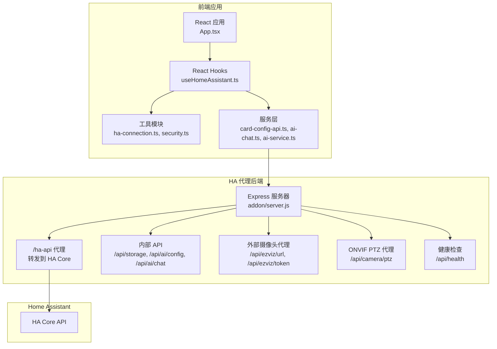
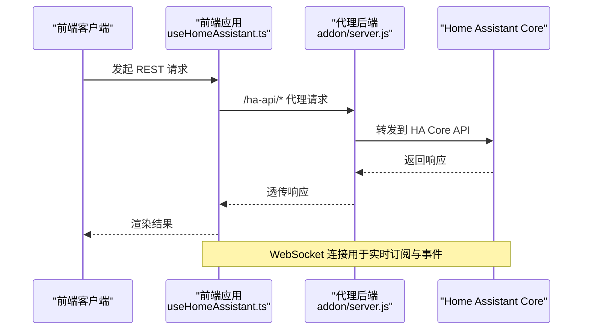
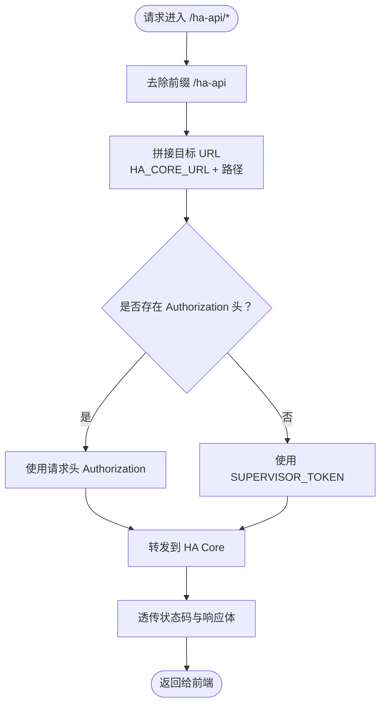
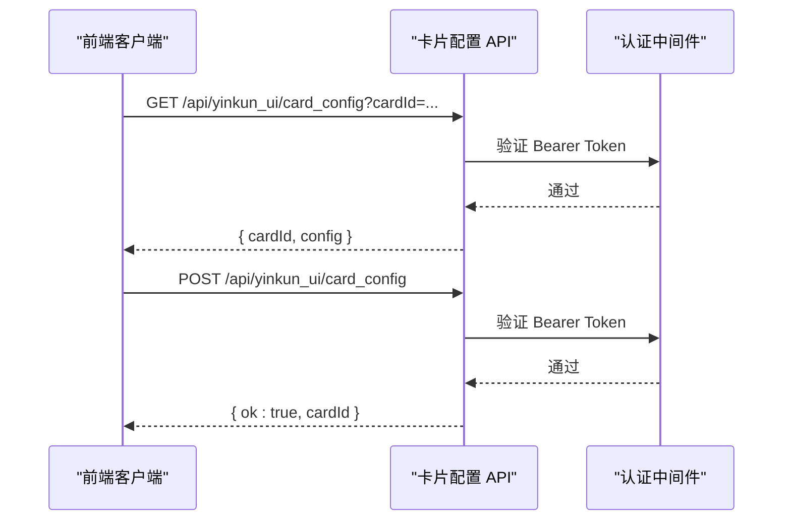
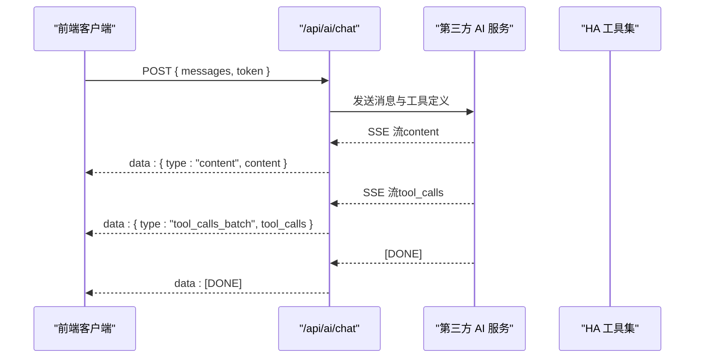
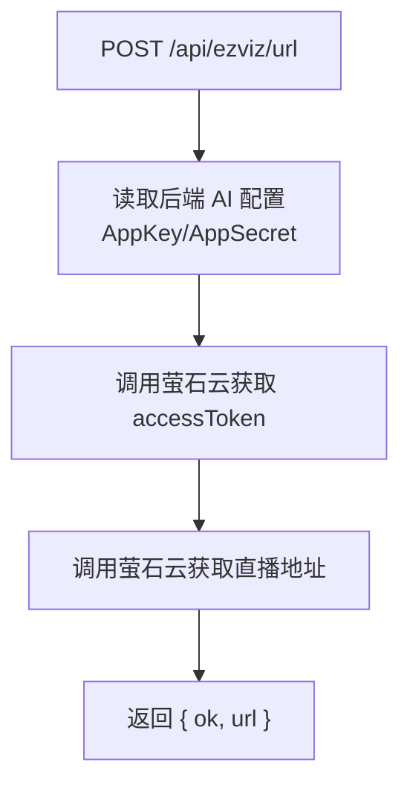
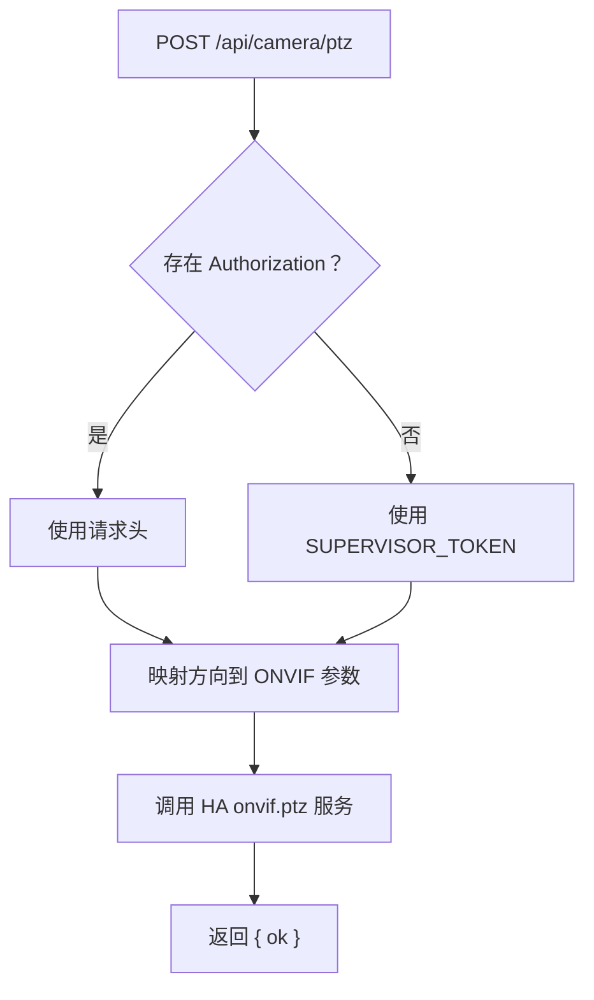
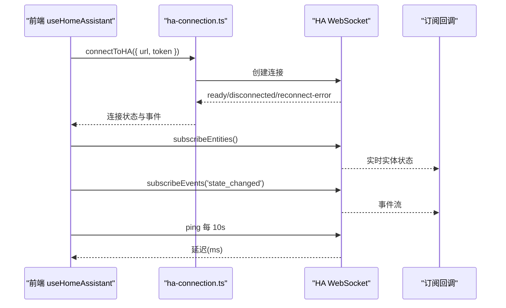
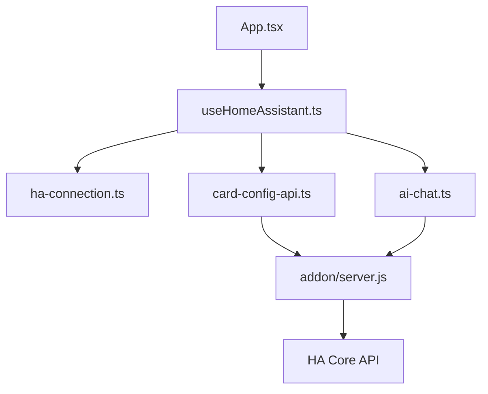

# API参考文档

<cite>
**本文档引用的文件**
- [server.js](file://addon/server.js)
- [card-config-api.ts](file://src/services/card-config-api.ts)
- [ha-connection.ts](file://src/utils/ha-connection.ts)
- [useHomeAssistant.ts](file://src/hooks/useHomeAssistant.ts)
- [App.tsx](file://src/app/App.tsx)
- [home-assistant.ts](file://src/types/home-assistant.ts)
- [ai-chat.ts](file://src/services/ai-chat.ts)
- [ai-service.ts](file://src/services/ai-service.ts)
- [security.ts](file://src/utils/security.ts)
- [Header.tsx](file://src/app/components/dashboard/Header.tsx)
- [config.yaml](file://addon/config.yaml)
</cite>

## 目录
1. [简介](#简介)
2. [项目结构](#项目结构)
3. [核心组件](#核心组件)
4. [架构总览](#架构总览)
5. [详细组件分析](#详细组件分析)
6. [依赖关系分析](#依赖关系分析)
7. [性能考量](#性能考量)
8. [故障排除指南](#故障排除指南)
9. [结论](#结论)
10. [附录](#附录)

## 简介
本文件为 HAUI 项目的完整 API 参考文档，涵盖以下方面：
- 内部 REST API：Home Assistant 代理接口、AI 配置与聊天接口、外部摄像头代理接口
- WebSocket API：Home Assistant 实时连接、事件订阅、延迟监控
- 外部集成 API：萤石云摄像头、ONVIF PTZ 控制、第三方 AI 服务
- 错误处理策略、安全考虑与限流机制
- API 版本管理、向后兼容性与迁移指南
- 使用示例、客户端实现指导与性能优化建议

## 项目结构
HAUI 项目由三部分组成：
- 前端应用：React + TypeScript，负责用户界面与交互
- Home Assistant 代理后端：Node.js Express，提供 /ha-api 代理与内部 API
- HA Add-on 配置：Supervisor 集成，提供 ingress 端口与静态资源

**图表来源**
- [server.js:1-521](file://addon/server.js#L1-L521)
- [useHomeAssistant.ts:1-313](file://src/hooks/useHomeAssistant.ts#L1-L313)
- [ha-connection.ts:1-317](file://src/utils/ha-connection.ts#L1-L317)
- [card-config-api.ts:1-32](file://src/services/card-config-api.ts#L1-L32)
- [ai-chat.ts:1-153](file://src/services/ai-chat.ts#L1-L153)

**章节来源**
- [server.js:1-521](file://addon/server.js#L1-L521)
- [useHomeAssistant.ts:1-313](file://src/hooks/useHomeAssistant.ts#L1-L313)
- [ha-connection.ts:1-317](file://src/utils/ha-connection.ts#L1-L317)

## 核心组件
- Home Assistant 代理与连接管理：通过 /ha-api 代理 REST 请求，并建立 WebSocket 连接订阅实体状态与事件
- 卡片配置 API：提供卡片配置的读取与保存，使用 Bearer Token 认证
- AI 聊天与配置：支持直接对接第三方 AI 服务，提供 SSE 流式响应与工具调用
- 外部摄像头与 PTZ 控制：萤石云代理与 ONVIF PTZ 云台控制
- 安全与加密：前端令牌加密存储与解密，以及后端代理鉴权

**章节来源**
- [card-config-api.ts:1-32](file://src/services/card-config-api.ts#L1-L32)
- [ai-chat.ts:1-153](file://src/services/ai-chat.ts#L1-L153)
- [server.js:48-94](file://addon/server.js#L48-L94)
- [security.ts:1-27](file://src/utils/security.ts#L1-L27)

## 架构总览
HAUI 的 API 分层如下：
- 前端 REST 层：调用 /ha-api 代理与内部 API
- 代理后端层：Express 服务器，统一处理鉴权与转发
- Home Assistant 层：HA Core API 与 WebSocket
- 外部服务层：萤石云、ONVIF、第三方 AI 服务

**图表来源**
- [useHomeAssistant.ts:250-293](file://src/hooks/useHomeAssistant.ts#L250-L293)
- [ha-connection.ts:125-139](file://src/utils/ha-connection.ts#L125-L139)
- [server.js:56-94](file://addon/server.js#L56-L94)

## 详细组件分析

### Home Assistant 代理 REST API
- 路径：/ha-api/*
- 方法：GET、POST、PUT、DELETE、PATCH 等（透传）
- 认证：使用前端传入的 Authorization 头（用户 Long-Lived Token），若无则使用 SUPERVISOR_TOKEN
- 功能：将前端 REST 请求转发到 HA Core API，支持摄像头头像等大体积负载

**图表来源**
- [server.js:56-94](file://addon/server.js#L56-L94)

**章节来源**
- [server.js:48-94](file://addon/server.js#L48-L94)
- [useHomeAssistant.ts:250-293](file://src/hooks/useHomeAssistant.ts#L250-L293)

### 卡片配置 API
- 读取卡片配置
  - 方法：GET
  - 路径：/api/yinkun_ui/card_config?cardId={cardId}
  - 认证：Bearer Token
  - 响应：{ cardId: string; config: CardConfig | null }
- 保存卡片配置
  - 方法：POST
  - 路径：/api/yinkun_ui/card_config
  - 认证：Bearer Token
  - 请求体：{ cardId: string; config: CardConfig }
  - 响应：{ ok: true; cardId: string }

**图表来源**
- [card-config-api.ts:3-30](file://src/services/card-config-api.ts#L3-L30)

**章节来源**
- [card-config-api.ts:1-32](file://src/services/card-config-api.ts#L1-L32)

### AI 配置与聊天 API
- 读取 AI 配置
  - 方法：GET
  - 路径：/api/ai/config
  - 响应：AI 配置对象
- 保存 AI 配置
  - 方法：POST
  - 路径：/api/ai/config
  - 请求体：AI 配置对象
  - 响应：{ ok: true }
- AI 聊天（SSE）
  - 方法：POST
  - 路径：/api/ai/chat
  - 请求体：{ messages, token }
  - 响应：SSE 流，事件类型：
    - content：增量文本内容
    - tool_calls_batch：工具调用批处理
    - [DONE]：结束标记
  - 安全限制：仅允许特定 HA 域的服务调用

**图表来源**
- [server.js:422-503](file://addon/server.js#L422-L503)
- [ai-chat.ts:25-152](file://src/services/ai-chat.ts#L25-L152)

**章节来源**
- [server.js:293-313](file://addon/server.js#L293-L313)
- [server.js:422-503](file://addon/server.js#L422-L503)
- [ai-chat.ts:1-153](file://src/services/ai-chat.ts#L1-L153)

### 外部摄像头代理 API
- 萤石云直播地址
  - 方法：POST
  - 路径：/api/ezviz/url
  - 请求体：{ deviceSerial, channelNo, protocol, validateCode }
  - 响应：{ ok: true, url }
  - 安全：从后端配置读取 AppKey/AppSecret，避免前端暴露
- 萤石云 Token
  - 方法：POST
  - 路径：/api/ezviz/token
  - 响应：{ ok: true, accessToken }

**图表来源**
- [server.js:125-196](file://addon/server.js#L125-L196)

**章节来源**
- [server.js:122-196](file://addon/server.js#L122-L196)

### ONVIF PTZ 云台控制代理 API
- 方法：POST
- 路径：/api/camera/ptz
- 请求体：{ deviceId, direction, name, entityId? }
- 认证：Authorization 头或 SUPERVISOR_TOKEN
- 行为：将方向映射为 ONVIF 属性，调用 HA onvif.ptz 服务

**图表来源**
- [server.js:231-286](file://addon/server.js#L231-L286)

**章节来源**
- [server.js:229-286](file://addon/server.js#L229-L286)

### 健康检查 API
- 方法：GET
- 路径：/api/health
- 响应：{ status: 'ok', time: ISO 时间字符串 }

**章节来源**
- [server.js:288-291](file://addon/server.js#L288-L291)

### Home Assistant WebSocket API
- 连接建立：使用长期访问令牌，支持本地/公网 URL 自动选择与可用性检测
- 订阅实体：实时接收实体状态变化
- 订阅事件：接收 state_changed 等事件流
- 延迟监控：每 10 秒发送 ping 并计算往返时间
- REST 基础地址：根据连接类型动态设置 /ha-api 或实际 HA 地址

**图表来源**
- [useHomeAssistant.ts:67-189](file://src/hooks/useHomeAssistant.ts#L67-L189)
- [ha-connection.ts:47-105](file://src/utils/ha-connection.ts#L47-L105)
- [Header.tsx:133-150](file://src/app/components/dashboard/Header.tsx#L133-L150)

**章节来源**
- [useHomeAssistant.ts:1-313](file://src/hooks/useHomeAssistant.ts#L1-L313)
- [ha-connection.ts:1-317](file://src/utils/ha-connection.ts#L1-L317)
- [Header.tsx:133-150](file://src/app/components/dashboard/Header.tsx#L133-L150)

### 安全与认证机制
- 前端令牌存储：使用 Base64 混淆存储，仅防截图泄露，不提供强加密
- 后端代理鉴权：优先使用前端 Authorization 头，否则使用 SUPERVISOR_TOKEN
- AI 服务鉴权：直接在前端请求中携带 API Key，后端不缓存敏感信息
- 白名单工具：仅允许特定 HA 域的服务调用，降低风险

**章节来源**
- [security.ts:1-27](file://src/utils/security.ts#L1-L27)
- [server.js:62-70](file://addon/server.js#L62-L70)
- [server.js:320-325](file://addon/server.js#L320-L325)

## 依赖关系分析

**图表来源**
- [App.tsx:83-550](file://src/app/App.tsx#L83-L550)
- [useHomeAssistant.ts:1-313](file://src/hooks/useHomeAssistant.ts#L1-L313)
- [ha-connection.ts:1-317](file://src/utils/ha-connection.ts#L1-L317)
- [card-config-api.ts:1-32](file://src/services/card-config-api.ts#L1-L32)
- [ai-chat.ts:1-153](file://src/services/ai-chat.ts#L1-L153)
- [server.js:1-521](file://addon/server.js#L1-L521)

**章节来源**
- [App.tsx:1-1053](file://src/app/App.tsx#L1-L1053)
- [home-assistant.ts:1-12](file://src/types/home-assistant.ts#L1-L12)

## 性能考量
- 连接选择策略：优先使用可达性检测，自动选择本地或公网 URL，减少跨网段延迟
- 心跳与延迟：每 10 秒 ping，实时显示延迟指示，便于诊断网络质量
- REST 回退：WebSocket 失败时自动回退到 REST 接口
- 大体积负载：代理层启用 20MB JSON 限制，满足摄像头配置与头像等场景
- SSE 流式传输：AI 聊天采用 SSE，边到边渲染，提升交互体验

[本节为通用性能讨论，无需具体文件分析]

## 故障排除指南
- 连接失败
  - 检查 HA URL 与 Token 配置，确认 Token 非默认值
  - 使用 /api/health 进行健康检查
  - 查看前端延迟指示与连接状态
- 代理转发失败
  - 确认 Authorization 头或 SUPERVISOR_TOKEN 设置
  - 检查 HA Core 地址与网络连通性
- AI 聊天错误
  - 检查 AI API Key、Base URL 与模型名称
  - 关注 SSE 错误事件与工具调用批处理
- 权限与安全
  - 确保只使用受信任的 Token
  - 避免在前端暴露敏感信息

**章节来源**
- [useHomeAssistant.ts:182-203](file://src/hooks/useHomeAssistant.ts#L182-L203)
- [server.js:90-94](file://addon/server.js#L90-L94)
- [ai-chat.ts:147-151](file://src/services/ai-chat.ts#L147-L151)

## 结论
HAUI 提供了完整的 Home Assistant 集成方案，包含：
- 稳健的代理层与 WebSocket 实时连接
- 灵活的外部服务集成（萤石云、ONVIF、第三方 AI）
- 清晰的认证与安全策略
- 可扩展的卡片配置与 AI 能力

建议在生产环境中：
- 使用 HTTPS 与强 Token 管理
- 启用本地优先连接与健康检查
- 对外部服务调用进行超时与重试控制

[本节为总结性内容，无需具体文件分析]

## 附录

### API 版本管理与兼容性
- Add-on 版本：通过 config.yaml 中的 version 字段标识
- 前端与后端通过 HA Ingress 端口 8099 提供服务
- 建议遵循语义化版本，变更重大接口时更新主版本号

**章节来源**
- [config.yaml:1-37](file://addon/config.yaml#L1-L37)

### 迁移指南
- 从默认 Token 迁移到用户自定义 Token
- 从直接后端调用迁移到 /ha-api 代理
- 从环境变量迁移到 /api/storage 与 /api/ai/config 存储

**章节来源**
- [server.js:96-120](file://addon/server.js#L96-L120)
- [server.js:293-313](file://addon/server.js#L293-L313)

### 使用示例与客户端实现要点
- Home Assistant 连接
  - 使用 useHomeAssistant 钩子初始化连接
  - 监听 isConnected、connectionType、latency
- 卡片配置
  - 使用 fetchCardConfig 与 saveCardConfig
  - 通过 Bearer Token 认证
- AI 聊天
  - 使用 chatStream 直接对接第三方 AI
  - 处理 content、tool_call、error、done 事件
- 外部摄像头
  - 使用 /api/ezviz/url 获取直播地址
  - 使用 /api/ezviz/token 获取 AccessToken

**章节来源**
- [useHomeAssistant.ts:295-311](file://src/hooks/useHomeAssistant.ts#L295-L311)
- [card-config-api.ts:3-30](file://src/services/card-config-api.ts#L3-L30)
- [ai-chat.ts:25-152](file://src/services/ai-chat.ts#L25-L152)
- [server.js:125-196](file://addon/server.js#L125-L196)