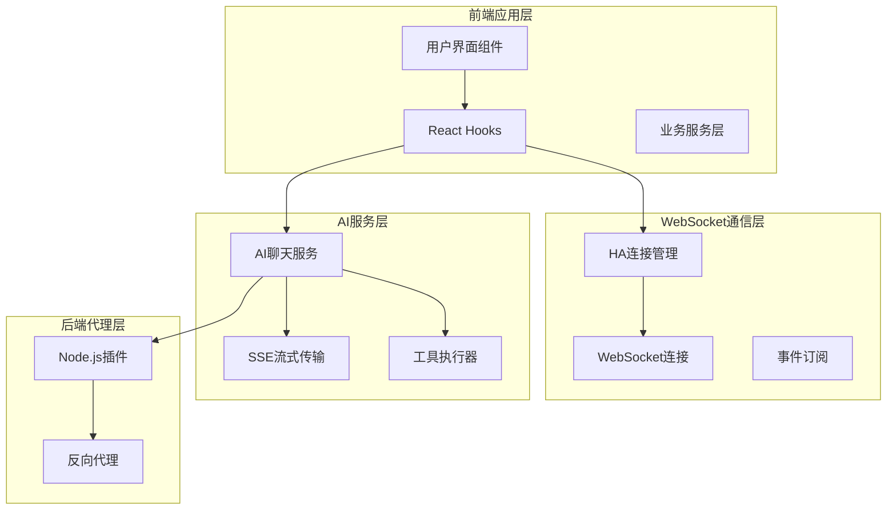
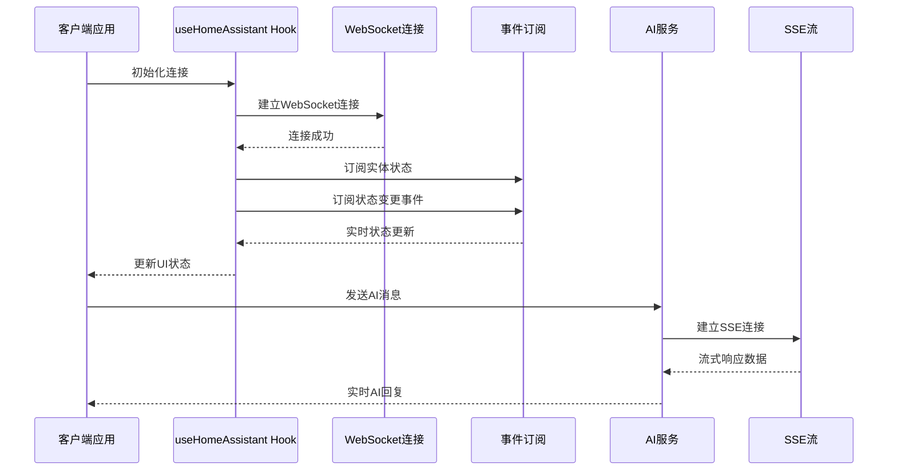
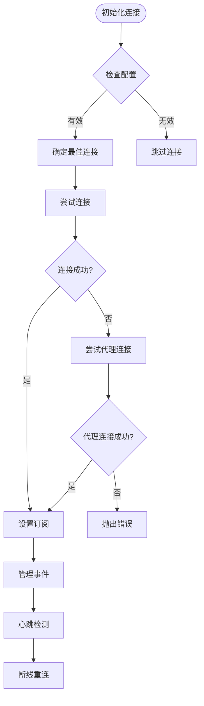
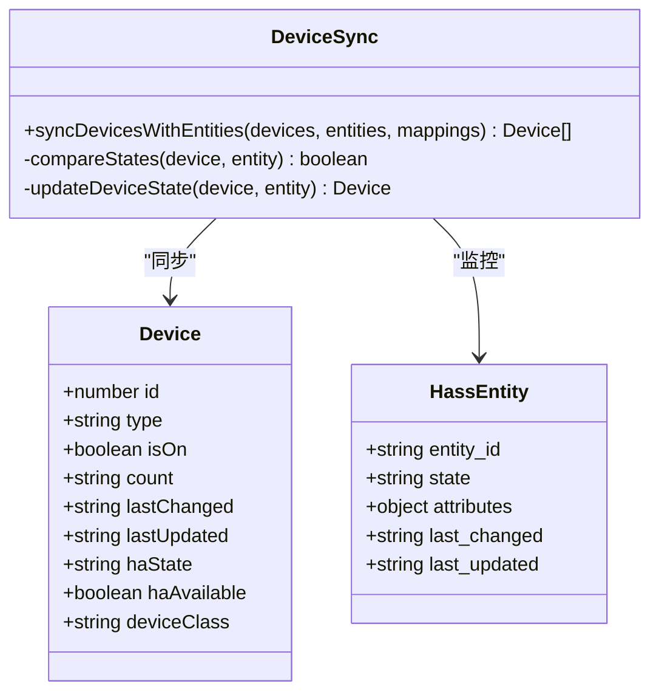
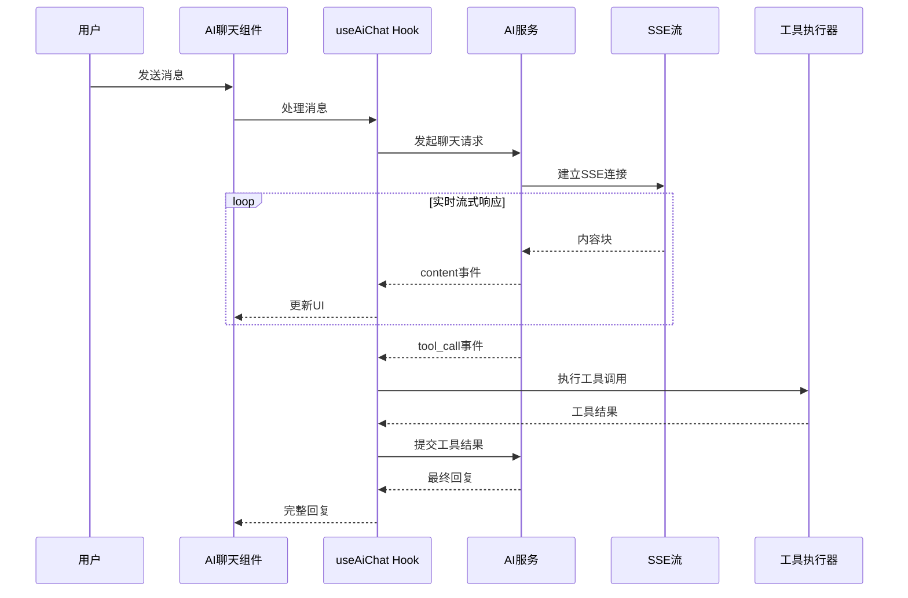

# WebSocket实时通信

<cite>
**本文档引用的文件**
- [src/hooks/useHomeAssistant.ts](file://src/hooks/useHomeAssistant.ts)
- [src/utils/ha-connection.ts](file://src/utils/ha-connection.ts)
- [src/app/components/dashboard/Header.tsx](file://src/app/components/dashboard/Header.tsx)
- [src/app/components/AiChatWidget.tsx](file://src/app/components/AiChatWidget.tsx)
- [src/hooks/useAiChat.ts](file://src/hooks/useAiChat.ts)
- [src/services/ai-chat.ts](file://src/services/ai-chat.ts)
- [src/services/ai-service.ts](file://src/services/ai-service.ts)
- [src/app/App.tsx](file://src/app/App.tsx)
- [src/utils/device-sync.ts](file://src/utils/device-sync.ts)
- [src/utils/log-helper.ts](file://src/utils/log-helper.ts)
- [addon/server.js](file://addon/server.js)
</cite>

## 目录
1. [简介](#简介)
2. [项目结构](#项目结构)
3. [核心组件](#核心组件)
4. [架构概览](#架构概览)
5. [详细组件分析](#详细组件分析)
6. [依赖关系分析](#依赖关系分析)
7. [性能考虑](#性能考虑)
8. [故障排除指南](#故障排除指南)
9. [结论](#结论)

## 简介

HAUI WebSocket实时通信系统是一个基于Home Assistant JS WebSocket库构建的实时数据传输解决方案。该系统实现了设备状态更新、实体状态变化、AI聊天流式响应等实时数据的传输协议，提供了完整的连接管理、重连机制、错误处理和性能优化策略。

系统采用模块化设计，通过useHomeAssistant Hook管理WebSocket连接，通过useAiChat Hook处理AI聊天流式响应，通过device-sync模块同步设备状态，通过log-helper模块处理日志记录。

## 项目结构



**图表来源**
- [src/hooks/useHomeAssistant.ts:23-313](file://src/hooks/useHomeAssistant.ts#L23-L313)
- [src/utils/ha-connection.ts:47-105](file://src/utils/ha-connection.ts#L47-L105)
- [src/hooks/useAiChat.ts:57-317](file://src/hooks/useAiChat.ts#L57-L317)

**章节来源**
- [src/hooks/useHomeAssistant.ts:1-313](file://src/hooks/useHomeAssistant.ts#L1-L313)
- [src/utils/ha-connection.ts:1-317](file://src/utils/ha-connection.ts#L1-L317)

## 核心组件

### WebSocket连接管理

系统的核心是基于home-assistant-js-websocket库的连接管理机制。主要组件包括：

- **连接建立**: 通过createConnection函数建立WebSocket连接
- **认证管理**: 使用createLongLivedTokenAuth进行长期访问令牌认证
- **事件监听**: 监听ready、disconnected、reconnect-error等事件
- **连接池管理**: 缓存连接实例，避免重复创建

### 实时数据同步

系统实现了多层次的实时数据同步机制：

- **实体状态订阅**: 通过subscribeToEntities订阅实体状态变化
- **事件监听**: 通过conn.subscribeEvents监听state_changed事件
- **心跳检测**: 定期发送ping消息检测连接延迟
- **设备状态同步**: 通过device-sync模块同步设备状态

### AI聊天流式响应

AI聊天功能通过fetch-event-source实现SSE流式传输：

- **流式消息处理**: 实时接收和处理AI回复内容
- **工具调用拦截**: 拦截工具调用请求并执行相应操作
- **状态管理**: 管理聊天会话状态和用户交互

**章节来源**
- [src/hooks/useHomeAssistant.ts:37-164](file://src/hooks/useHomeAssistant.ts#L37-L164)
- [src/utils/ha-connection.ts:47-147](file://src/utils/ha-connection.ts#L47-L147)

## 架构概览



**图表来源**
- [src/hooks/useHomeAssistant.ts:67-189](file://src/hooks/useHomeAssistant.ts#L67-L189)
- [src/services/ai-chat.ts:25-153](file://src/services/ai-chat.ts#L25-L153)

## 详细组件分析

### 连接管理组件

#### useHomeAssistant Hook

useHomeAssistant Hook是整个WebSocket系统的中枢，负责：



**图表来源**
- [src/hooks/useHomeAssistant.ts:67-189](file://src/hooks/useHomeAssistant.ts#L67-L189)

**章节来源**
- [src/hooks/useHomeAssistant.ts:23-313](file://src/hooks/useHomeAssistant.ts#L23-L313)

#### HA连接工具类

ha-connection工具类提供了完整的连接管理功能：

- **连接缓存**: 避免重复创建相同配置的连接
- **配置验证**: 验证URL和Token的有效性
- **可用性检查**: 支持HTTP和WebSocket双重验证
- **最佳连接选择**: 并行检查本地和公网连接

**章节来源**
- [src/utils/ha-connection.ts:47-317](file://src/utils/ha-connection.ts#L47-L317)

### 实时数据处理组件

#### 设备状态同步

device-sync模块实现了设备状态与Home Assistant实体状态的双向同步：



**图表来源**
- [src/utils/device-sync.ts:4-190](file://src/utils/device-sync.ts#L4-L190)

**章节来源**
- [src/utils/device-sync.ts:1-190](file://src/utils/device-sync.ts#L1-L190)

#### 事件处理系统

系统通过事件订阅机制实现实时事件处理：

- **状态变更事件**: 监听state_changed事件获取实体状态变化
- **设备映射**: 将Home Assistant实体映射到本地设备对象
- **日志记录**: 通过cleanLogMessage清理和翻译事件日志

**章节来源**
- [src/app/App.tsx:353-396](file://src/app/App.tsx#L353-L396)
- [src/utils/log-helper.ts:1-32](file://src/utils/log-helper.ts#L1-L32)

### AI聊天组件

#### 流式响应处理

AI聊天功能通过fetch-event-source实现SSE流式传输：



**图表来源**
- [src/hooks/useAiChat.ts:169-292](file://src/hooks/useAiChat.ts#L169-L292)
- [src/services/ai-chat.ts:25-153](file://src/services/ai-chat.ts#L25-L153)

**章节来源**
- [src/hooks/useAiChat.ts:57-317](file://src/hooks/useAiChat.ts#L57-L317)
- [src/services/ai-chat.ts:1-153](file://src/services/ai-chat.ts#L1-L153)

#### 工具调用机制

系统支持多种工具调用，包括：

- **get_entity_state**: 查询设备状态
- **call_ha_service**: 调用Home Assistant服务
- **工具结果聚合**: 收集多个工具调用的结果

**章节来源**
- [src/services/ai-chat.ts:42-77](file://src/services/ai-chat.ts#L42-L77)
- [src/hooks/useAiChat.ts:229-245](file://src/hooks/useAiChat.ts#L229-L245)

### 前端UI组件

#### 实时状态显示

Header组件提供了实时连接状态显示：

- **连接状态指示器**: 显示连接是否正常
- **延迟检测**: 通过ping消息检测WebSocket延迟
- **颜色编码**: 不同延迟范围使用不同颜色表示

**章节来源**
- [src/app/components/dashboard/Header.tsx:133-156](file://src/app/components/dashboard/Header.tsx#L133-L156)

#### AI聊天界面

AiChatWidget组件提供了完整的AI聊天界面：

- **消息列表**: 实时显示聊天历史
- **流式输入**: 支持实时流式内容显示
- **语音模式**: 支持语音输入和TTS输出
- **工具调用反馈**: 显示工具执行状态

**章节来源**
- [src/app/components/AiChatWidget.tsx:1-678](file://src/app/components/AiChatWidget.tsx#L1-L678)

## 依赖关系分析

```mermaid
graph TB
subgraph "核心依赖"
HAJS[home-assistant-js-websocket]
FES[@microsoft/fetch-event-source]
React[React]
end
subgraph "系统模块"
HAConn[ha-connection]
HAHook[useHomeAssistant]
AIService[ai-service]
AIChat[ai-chat]
DeviceSync[device-sync]
LogHelper[log-helper]
end
subgraph "UI组件"
Header[Header组件]
ChatWidget[AiChatWidget]
EntityCard[ConfigurableEntityCard]
end
HAJS --> HAConn
FES --> AIChat
React --> HAHook
React --> ChatWidget
HAConn --> HAHook
AIService --> AIChat
DeviceSync --> HAHook
LogHelper --> HAHook
HAHook --> Header
HAHook --> EntityCard
AIChat --> ChatWidget
```

**图表来源**
- [src/hooks/useHomeAssistant.ts:1-15](file://src/hooks/useHomeAssistant.ts#L1-L15)
- [src/utils/ha-connection.ts:1-10](file://src/utils/ha-connection.ts#L1-L10)
- [src/services/ai-chat.ts:5-6](file://src/services/ai-chat.ts#L5-L6)

**章节来源**
- [src/hooks/useHomeAssistant.ts:1-313](file://src/hooks/useHomeAssistant.ts#L1-L313)
- [src/utils/ha-connection.ts:1-317](file://src/utils/ha-connection.ts#L1-L317)

## 性能考虑

### 连接优化策略

系统采用了多项性能优化措施：

- **连接复用**: 通过连接缓存避免重复创建连接
- **并行检查**: 同时检查多个连接配置以快速确定最佳连接
- **心跳检测**: 定期ping检测连接质量，及时发现网络问题
- **事件去重**: 避免重复处理相同的实体状态变化

### 内存管理

- **引用清理**: 使用useRef避免闭包陷阱
- **订阅管理**: 提供unsubscribe函数清理事件订阅
- **状态优化**: 使用useMemo和useCallback优化渲染性能

### 网络优化

- **超时控制**: 为HTTP和WebSocket请求设置合理的超时时间
- **重试机制**: 断线后自动重连，重试间隔递增
- **代理支持**: 支持通过代理服务器连接Home Assistant

## 故障排除指南

### 常见连接问题

#### 连接失败排查

1. **检查Token配置**
   - 确认VITE_HA_TOKEN环境变量设置正确
   - 验证Token长度和格式
   - 确认Token具有足够的权限

2. **网络连接检查**
   - 验证Home Assistant URL可达性
   - 检查防火墙和代理设置
   - 确认WebSocket端口开放

3. **证书问题**
   - 检查SSL证书有效性
   - 验证域名匹配
   - 确认证书链完整

#### 实时数据问题

1. **状态不同步**
   - 检查实体ID映射配置
   - 验证设备类型支持情况
   - 确认实体属性完整性

2. **事件丢失**
   - 检查事件订阅是否正常
   - 验证事件过滤条件
   - 确认事件处理逻辑

#### AI聊天问题

1. **流式响应中断**
   - 检查SSE连接状态
   - 验证API密钥配置
   - 确认网络稳定性

2. **工具调用失败**
   - 检查工具函数定义
   - 验证Home Assistant服务可用性
   - 确认参数格式正确

**章节来源**
- [src/utils/ha-connection.ts:244-296](file://src/utils/ha-connection.ts#L244-L296)
- [src/hooks/useHomeAssistant.ts:182-188](file://src/hooks/useHomeAssistant.ts#L182-L188)

## 结论

HAUI WebSocket实时通信系统通过模块化设计和完善的错误处理机制，实现了可靠的实时数据传输。系统的主要优势包括：

1. **高可靠性**: 完善的连接管理和重连机制
2. **高性能**: 连接复用和优化的事件处理
3. **易扩展**: 模块化的架构便于功能扩展
4. **用户体验**: 实时的状态显示和流畅的交互体验

系统支持设备状态更新、实体状态变化、AI聊天流式响应等多种实时数据场景，为智能家居应用提供了坚实的技术基础。通过持续的优化和改进，该系统能够满足各种复杂的实时通信需求。