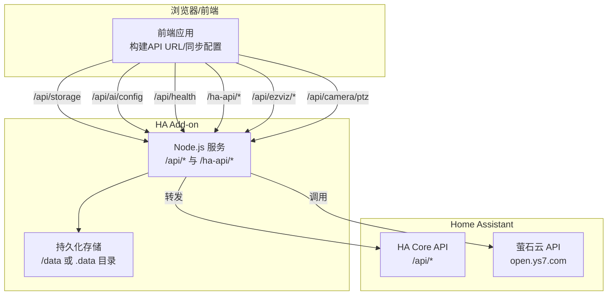
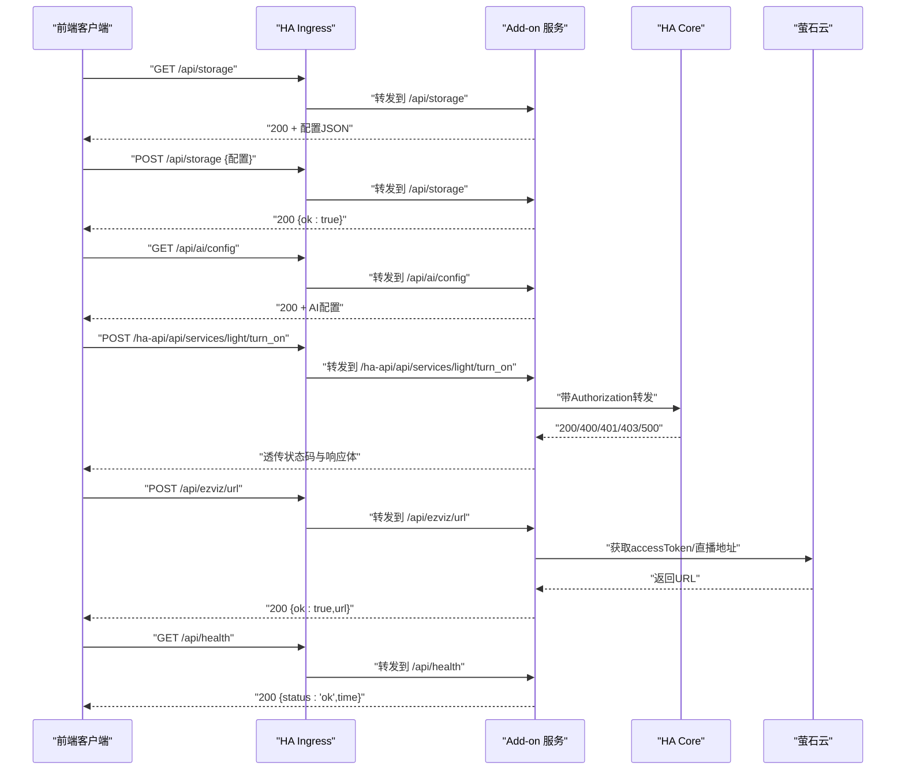
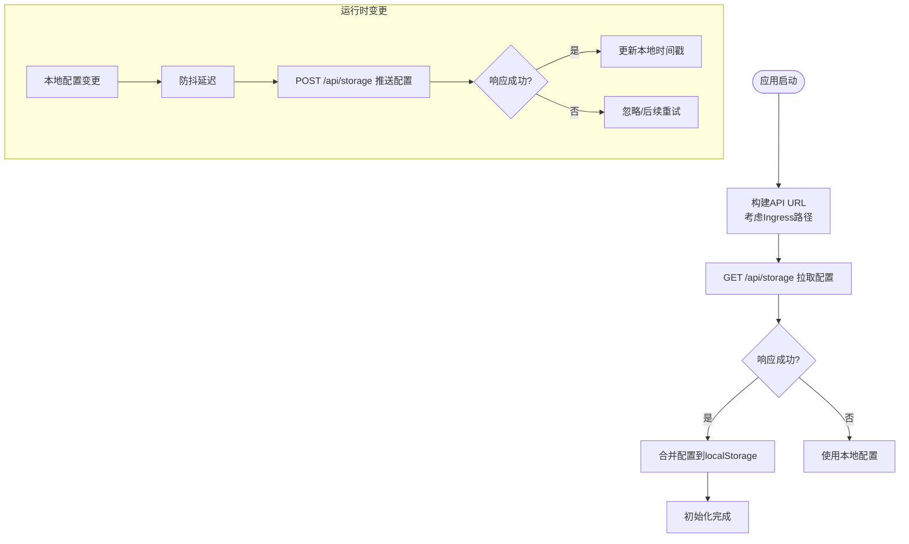
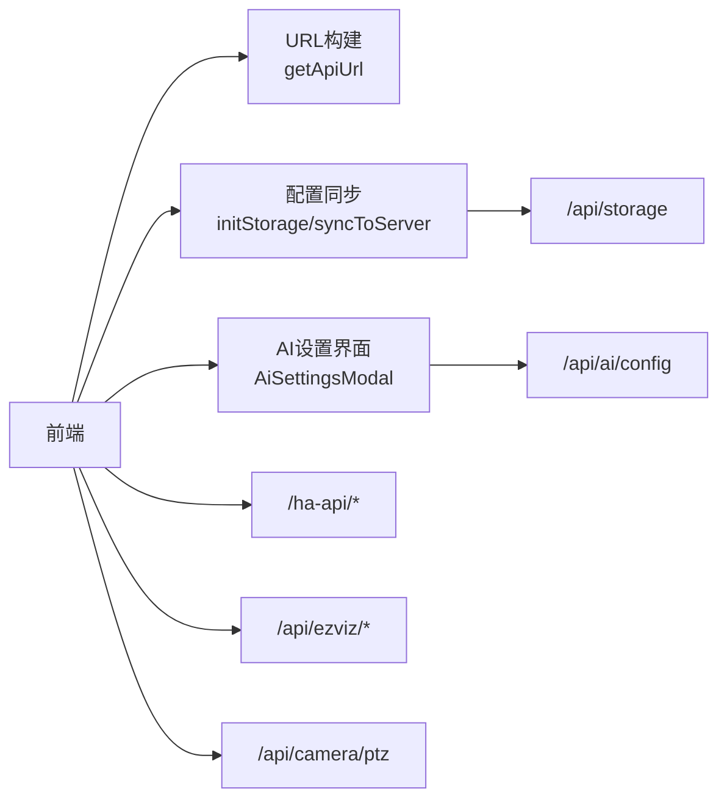

# 内部API接口

<cite>
**本文引用的文件**
- [addon/server.js](file://addon/server.js)
- [src/utils/sync.ts](file://src/utils/sync.ts)
- [src/main.tsx](file://src/main.tsx)
- [src/services/ai-service.ts](file://src/services/ai-service.ts)
- [src/app/components/AiSettingsModal.tsx](file://src/app/components/AiSettingsModal.tsx)
- [src/services/card-config-api.ts](file://src/services/card-config-api.ts)
- [src/utils/ha-connection.ts](file://src/utils/ha-connection.ts)
- [config/configuration.yaml](file://config/configuration.yaml)
- [addon/config.yaml](file://addon/config.yaml)
</cite>

## 目录
1. [简介](#简介)
2. [项目结构](#项目结构)
3. [核心组件](#核心组件)
4. [架构总览](#架构总览)
5. [详细组件分析](#详细组件分析)
6. [依赖关系分析](#依赖关系分析)
7. [性能考量](#性能考量)
8. [故障排查指南](#故障排查指南)
9. [结论](#结论)
10. [附录](#附录)

## 简介
本文件面向HAUI内部API接口的使用者与维护者，系统性梳理以下核心内部端点：
- 配置存储API：/api/storage（GET/POST）
- AI配置API：/api/ai/config（GET/POST）
- 健康检查API：/api/health（GET）
- HA代理API：/ha-api/*（任意REST方法）
- 摄像头萤石云代理：/api/ezviz/url、/api/ezviz/token（POST）
- 摄像头PTZ控制代理：/api/camera/ptz（POST）

文档覆盖各端点的HTTP方法、URL模式、请求/响应格式、认证机制、错误码与使用限制，并提供调用示例与最佳实践。

## 项目结构
HAUI的内部API主要由Add-on内的Node.js服务提供，前端通过浏览器或嵌入式Ingress访问。关键位置如下：
- Add-on服务：提供内部API与静态资源分发
- 前端工具：统一构建API URL、Ingress路径适配、配置同步
- Home Assistant：作为外部服务被代理访问（/ha-api/*）

图表来源
- [addon/server.js:96-291](file://addon/server.js#L96-L291)
- [src/utils/sync.ts:4-17](file://src/utils/sync.ts#L4-L17)

章节来源
- [addon/server.js:1-521](file://addon/server.js#L1-L521)
- [src/utils/sync.ts:1-122](file://src/utils/sync.ts#L1-L122)

## 核心组件
- Add-on内部API服务：负责配置读写、健康检查、HA代理、萤石云代理、PTZ控制代理与静态资源分发。
- 前端URL构建与同步：根据Ingress动态拼接API基础路径；在Add-on模式下主动拉取/推送配置。
- AI配置管理：前端设置界面与后端AI配置接口配合，保障配置合法性与安全性。

章节来源
- [addon/server.js:96-291](file://addon/server.js#L96-L291)
- [src/utils/sync.ts:1-122](file://src/utils/sync.ts#L1-L122)
- [src/services/ai-service.ts:1-201](file://src/services/ai-service.ts#L1-L201)

## 架构总览
内部API的典型调用链路如下：

图表来源
- [addon/server.js:96-291](file://addon/server.js#L96-L291)
- [addon/server.js:122-196](file://addon/server.js#L122-L196)
- [addon/server.js:229-286](file://addon/server.js#L229-L286)

## 详细组件分析

### 配置存储API（/api/storage）
- 方法与URL
  - GET /api/storage：读取持久化配置
  - POST /api/storage：写入配置（键值对JSON）
- 认证机制
  - 无内置认证；前端在Add-on模式下通过Ingress访问，无需额外凭据。
- 请求参数
  - GET：无
  - POST：JSON对象，键为字符串，值为字符串（localStorage键值对）
- 响应格式
  - GET：纯JSON文本（配置对象）
  - POST：JSON对象 { ok: true }
- 错误码
  - 500：读取/写入失败
- 使用限制
  - 首次访问会自动初始化空配置文件。
  - 建议在Add-on模式下使用，避免非Add-on环境下的404/502。
- 调用示例（伪代码）
  - GET：curl -sS http://<addon-host>:8099/api/storage
  - POST：curl -sS -X POST http://<addon-host>:8099/api/storage -H "Content-Type: application/json" -d '{"key":"value"}'

章节来源
- [addon/server.js:96-121](file://addon/server.js#L96-L121)
- [src/utils/sync.ts:19-41](file://src/utils/sync.ts#L19-L41)
- [src/main.tsx:31-61](file://src/main.tsx#L31-L61)

### AI配置API（/api/ai/config）
- 方法与URL
  - GET /api/ai/config：读取AI配置
  - POST /api/ai/config：写入AI配置（JSON）
- 认证机制
  - 无内置认证；前端通过Ingress访问。
- 请求参数
  - GET：无
  - POST：JSON对象，包含 provider、apiKey、baseUrl、modelName 等字段
- 响应格式
  - GET：AI配置JSON
  - POST：JSON对象 { ok: true }
- 错误码
  - 500：读取/写入失败
- 使用限制
  - 写入前前端会进行Zod校验，非法字段会被拒绝。
  - 配置变更后会同步到localStorage并触发后端持久化。
- 调用示例（伪代码）
  - GET：curl -sS http://<addon-host>:8099/api/ai/config
  - POST：curl -sS -X POST http://<addon-host>:8099/api/ai/config -H "Content-Type: application/json" -d '{"provider":"siliconflow","apiKey":"...","baseUrl":"https://api.siliconflow.cn/v1","modelName":"deepseek-ai/DeepSeek-V3"}'

章节来源
- [addon/server.js:293-313](file://addon/server.js#L293-L313)
- [src/services/ai-service.ts:55-62](file://src/services/ai-service.ts#L55-L62)
- [src/app/components/AiSettingsModal.tsx:35-53](file://src/app/components/AiSettingsModal.tsx#L35-L53)

### 健康检查API（/api/health）
- 方法与URL
  - GET /api/health
- 认证机制
  - 无内置认证
- 请求参数
  - 无
- 响应格式
  - JSON：{ status: "ok", time: ISO时间字符串 }
- 错误码
  - 200：正常；其他：异常（通常由Ingress或Add-on层处理）
- 使用限制
  - 用于Ingress心跳探测与服务可用性检查。
- 调用示例（伪代码）
  - curl -sS http://<addon-host>:8099/api/health

章节来源
- [addon/server.js:288-291](file://addon/server.js#L288-L291)

### HA代理API（/ha-api/*）
- 方法与URL
  - 任意REST方法与路径：/ha-api/*
- 认证机制
  - 使用前端传入的Authorization头（用户Long-lived Token）
  - 若未提供，则使用环境变量SUPERVISOR_TOKEN作为备选
- 请求参数
  - 透传原始请求方法、头与Body（非GET/HEAD）
- 响应格式
  - 透传HA Core的响应状态码与响应体
- 错误码
  - 502：代理转发失败
  - 其他：HA Core返回的原生状态码
- 使用限制
  - 仅在Add-on内网可达HA Core时有效（http://supervisor/core）
  - 建议前端携带Authorization头，避免鉴权失败
- 调用示例（伪代码）
  - curl -sS -H "Authorization: Bearer <LLAT>" http://<addon-host>:8099/ha-api/api/states

章节来源
- [addon/server.js:48-94](file://addon/server.js#L48-L94)
- [src/utils/ha-connection.ts:240-260](file://src/utils/ha-connection.ts#L240-L260)

### 萤石云代理API（/api/ezviz/*）
- /api/ezviz/url（POST）
  - 作用：隐藏AppKey/AppSecret，获取HLS直播地址
  - 请求参数：deviceSerial、channelNo、protocol、validateCode（可选）
  - 响应：{ ok: true, url }
  - 错误：400（参数缺失）、500（第三方接口错误）
- /api/ezviz/token（POST）
  - 作用：仅获取accessToken（供eZUKit SDK使用）
  - 请求参数：同上
  - 响应：{ ok: true, accessToken }
  - 错误：400、500
- 使用限制
  - AppKey/AppSecret需在AI配置中设置或通过环境变量提供
  - protocol=2为HLS，3为FLV(HTTP-FLV)

章节来源
- [addon/server.js:122-196](file://addon/server.js#L122-L196)
- [addon/server.js:198-227](file://addon/server.js#L198-L227)

### 摄像头PTZ控制代理（/api/camera/ptz）
- 方法与URL
  - POST /api/camera/ptz
- 认证机制
  - Authorization头（用户LLAT）或环境变量SUPERVISOR_TOKEN
- 请求参数
  - deviceId、direction（up/down/left/right/zoomIn/zoomOut）、name、entityId（可选）
- 响应格式
  - JSON：{ ok: true/false }
- 错误码
  - 401：未授权
  - 500：HA服务调用失败
- 使用限制
  - 仅允许特定域的服务（light、switch、cover、fan、media_player、climate、lock、scene、input_boolean、script、automation、vacuum、humidifier、water_heater）

章节来源
- [addon/server.js:229-286](file://addon/server.js#L229-L286)

### 前端配置同步流程（GET/POST /api/storage）
- 动态URL构建
  - 当页面路径包含hassio_ingress时，自动拼接Ingress根路径，保证在不同入口下API可达
- 拉取与推送
  - 启动时尝试从Add-on拉取最新配置，失败则回退到本地
  - 本地配置变更后，防抖触发同步至Add-on
- 版本控制
  - 使用SYNC_TS_KEY进行远端/本地版本比较，仅在远端更新时覆盖

图表来源
- [src/utils/sync.ts:4-17](file://src/utils/sync.ts#L4-L17)
- [src/utils/sync.ts:52-93](file://src/utils/sync.ts#L52-L93)
- [src/main.tsx:31-61](file://src/main.tsx#L31-L61)

章节来源
- [src/utils/sync.ts:1-122](file://src/utils/sync.ts#L1-L122)
- [src/main.tsx:31-81](file://src/main.tsx#L31-L81)

## 依赖关系分析
- Add-on服务依赖
  - 存储：/data（持久化）或 .data（本地开发）
  - 环境变量：SUPERVISOR_TOKEN、HA_CORE_URL、AI_*（用于默认AI配置）
- 前端依赖
  - URL构建：getApiUrl/getStorageUrl
  - 同步：initStorage/syncToServer/syncFromServer
  - AI配置：AiConfigSchema校验、AiSettingsModal设置
- 外部依赖
  - HA Core API（/api/*）
  - 萤石云开放平台（open.ys7.com）

图表来源
- [src/utils/sync.ts:4-17](file://src/utils/sync.ts#L4-L17)
- [src/utils/sync.ts:52-93](file://src/utils/sync.ts#L52-L93)
- [addon/server.js:96-291](file://addon/server.js#L96-L291)

章节来源
- [addon/server.js:1-521](file://addon/server.js#L1-L521)
- [src/services/ai-service.ts:1-201](file://src/services/ai-service.ts#L1-L201)

## 性能考量
- Ingress与静态资源
  - Add-on启用ingress与ingress_stream，静态资源缓存1天，减少重复下载
- 请求体大小
  - Express JSON限制为20MB，满足摄像头配置、布局信息等大体量负载
- 超时与重试
  - 前端同步默认4~5秒超时，失败自动重试，避免首屏阻塞
- SSE与工具调用
  - AI聊天支持SSE流式传输与工具调用批处理，最大工具轮次限制为5，防止无限调用

章节来源
- [addon/config.yaml:31-37](file://addon/config.yaml#L31-L37)
- [addon/server.js:46](file://addon/server.js#L46)
- [src/main.tsx:31-61](file://src/main.tsx#L31-L61)
- [addon/server.js:317-318](file://addon/server.js#L317-L318)

## 故障排查指南
- /api/storage 404/502
  - 可能原因：非Add-on环境或Ingress未映射
  - 处理：确认Add-on运行状态与ingress_port: 8099
- /api/ai/config 500
  - 可能原因：写入JSON格式错误或磁盘权限问题
  - 处理：检查前端Zod校验与后端文件写入权限
- /ha-api/* 401/403
  - 可能原因：Authorization头缺失或LLAT无效
  - 处理：在前端设置正确的LLAT并透传到请求头
- /api/ezviz/* 400/500
  - 可能原因：AppKey/AppSecret缺失或萤石云接口异常
  - 处理：在AI配置中填写AppKey/AppSecret，检查网络与第三方接口状态
- /api/camera/ptz 401
  - 可能原因：未提供Authorization或SUPERVISOR_TOKEN
  - 处理：提供有效的Authorization头或配置SUPERVISOR_TOKEN

章节来源
- [src/main.tsx:31-61](file://src/main.tsx#L31-L61)
- [addon/server.js:122-196](file://addon/server.js#L122-L196)
- [addon/server.js:229-286](file://addon/server.js#L229-L286)
- [src/utils/ha-connection.ts:240-260](file://src/utils/ha-connection.ts#L240-L260)

## 结论
HAUI内部API围绕“配置存储”“AI配置”“健康检查”“HA代理”“萤石云代理”“PTZ控制代理”六大能力构建，配合前端URL适配与配置同步机制，在Add-on模式下提供稳定、安全、易用的内部接口。建议在生产环境严格遵循认证与参数校验策略，并结合Ingress与静态资源缓存优化用户体验。

## 附录

### API清单与规范
- /api/storage
  - GET：读取配置（纯JSON文本）
  - POST：写入配置（键值对JSON）
  - 认证：无
  - 错误码：500
- /api/ai/config
  - GET：读取AI配置（JSON）
  - POST：写入AI配置（JSON）
  - 认证：无
  - 错误码：500
- /api/health
  - GET：健康检查（JSON）
  - 认证：无
  - 错误码：200
- /ha-api/*
  - 任意REST方法：代理HA Core API
  - 认证：Authorization（LLAT）或SUPERVISOR_TOKEN
  - 错误码：502或其他HA Core状态码
- /api/ezviz/url
  - POST：获取HLS直播地址
  - 参数：deviceSerial、channelNo、protocol、validateCode
  - 错误码：400/500
- /api/ezviz/token
  - POST：获取accessToken
  - 参数：同上
  - 错误码：400/500
- /api/camera/ptz
  - POST：PTZ控制
  - 参数：deviceId、direction、name、entityId
  - 错误码：401/500

章节来源
- [addon/server.js:96-291](file://addon/server.js#L96-L291)
- [addon/server.js:122-196](file://addon/server.js#L122-L196)
- [addon/server.js:229-286](file://addon/server.js#L229-L286)

### 最佳实践
- 在Add-on模式下使用Ingress访问内部API，避免跨域与鉴权问题
- 前端统一通过getApiUrl构建URL，确保在不同入口下路径正确
- AI配置写入前务必通过Zod校验，避免非法字段进入存储
- 配置变更后及时触发同步，避免本地与远端不一致
- 对外暴露的API尽量使用Authorization头，避免硬编码凭据

章节来源
- [src/utils/sync.ts:4-17](file://src/utils/sync.ts#L4-L17)
- [src/services/ai-service.ts:55-62](file://src/services/ai-service.ts#L55-L62)
- [src/app/components/AiSettingsModal.tsx:35-53](file://src/app/components/AiSettingsModal.tsx#L35-L53)