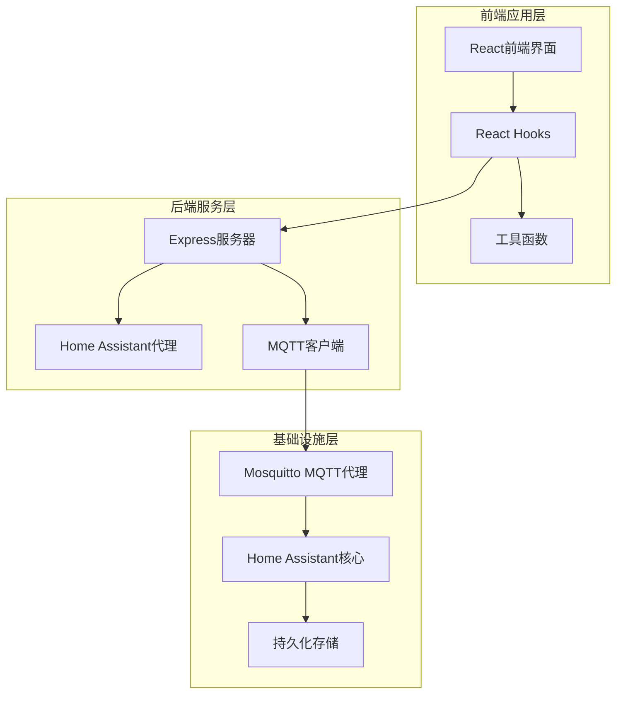
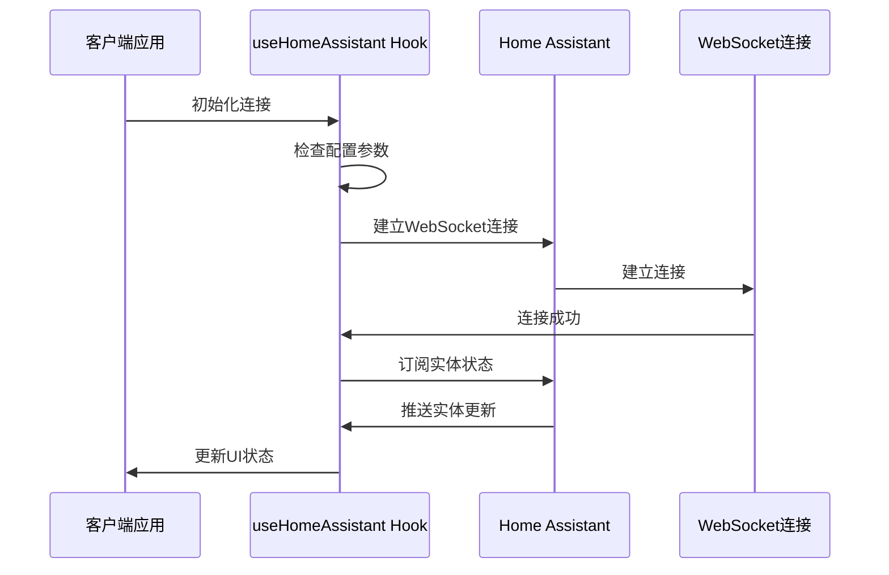
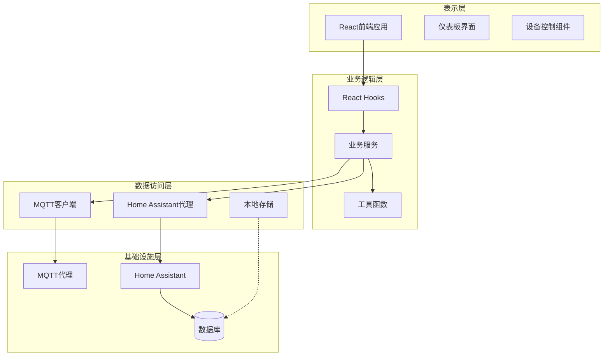
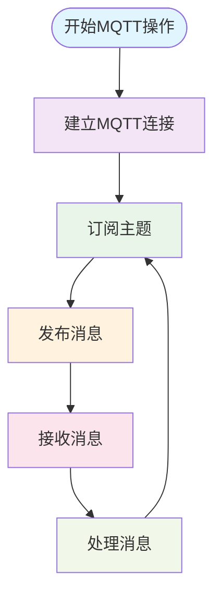
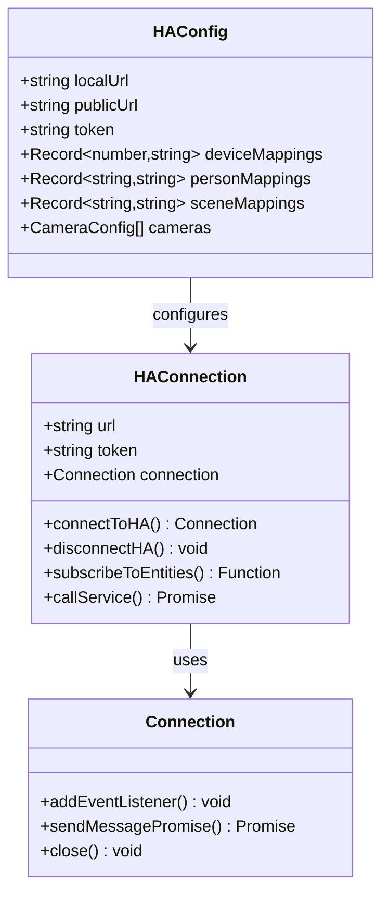
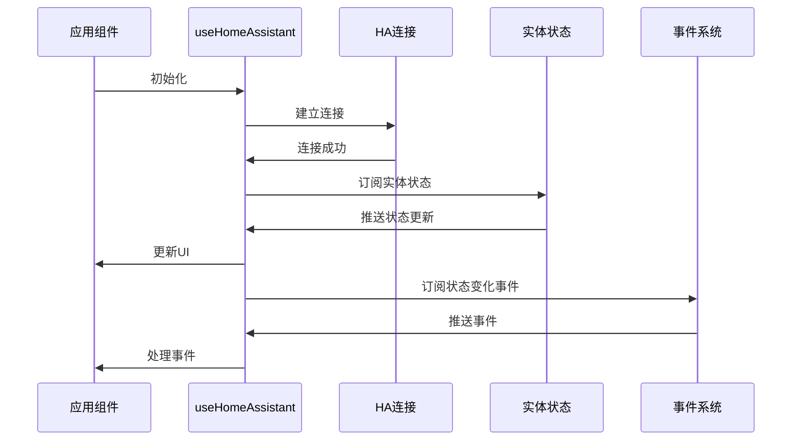
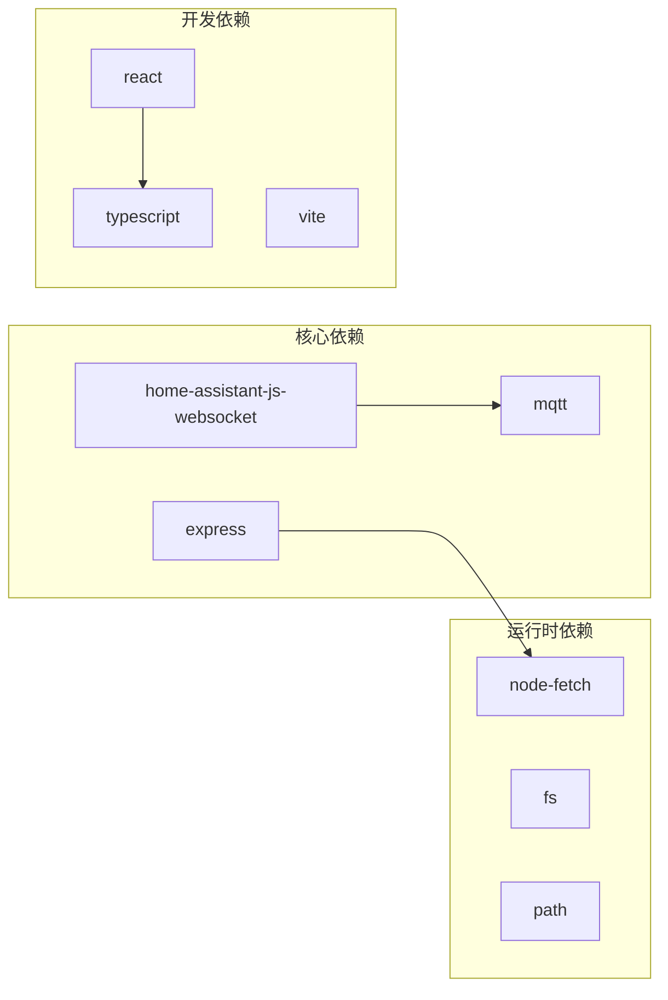
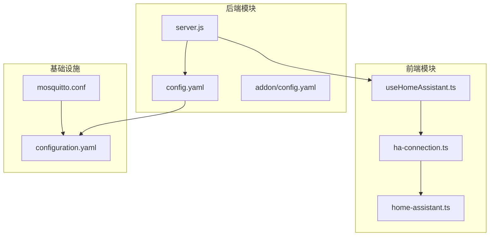

# MQTT集成API

<cite>
**本文档引用的文件**
- [mosquitto.conf](file://mosquitto/config/mosquitto.conf)
- [server.js](file://addon/server.js)
- [configuration.yaml](file://config/configuration.yaml)
- [useHomeAssistant.ts](file://src/hooks/useHomeAssistant.ts)
- [ha-connection.ts](file://src/utils/ha-connection.ts)
- [home-assistant.ts](file://src/types/home-assistant.ts)
- [__init__.py](file://custom_components/yinkun_ui/__init__.py)
- [config.yaml](file://addon/config.yaml)
</cite>

## 目录
1. [简介](#简介)
2. [项目结构](#项目结构)
3. [核心组件](#核心组件)
4. [架构概览](#架构概览)
5. [详细组件分析](#详细组件分析)
6. [依赖关系分析](#依赖关系分析)
7. [性能考虑](#性能考虑)
8. [故障排除指南](#故障排除指南)
9. [结论](#结论)

## 简介

本文件提供了HAUI项目中MQTT集成API的详细技术文档。HAUI是一个为Home Assistant打造的高性能现代化前端控制面板，集成了AI智能管家语音交互、全平台自适应界面与iOS风格组件体系。

该项目的核心特性包括：
- 基于Mosquitto MQTT代理的消息传递
- 与Home Assistant的深度集成
- 支持多种认证机制和安全配置
- 提供完整的MQTT客户端集成示例
- 包含详细的故障排除指南

## 项目结构

HAUI项目的整体架构采用模块化设计，主要包含以下关键组件：



**图表来源**
- [server.js:1-521](file://addon/server.js#L1-L521)
- [mosquitto.conf:1-6](file://mosquitto/config/mosquitto.conf#L1-L6)

**章节来源**
- [server.js:1-521](file://addon/server.js#L1-L521)
- [mosquitto.conf:1-6](file://mosquitto/config/mosquitto.conf#L1-L6)

## 核心组件

### Mosquitto MQTT代理配置

系统使用Mosquitto作为MQTT消息代理，配置文件位于`mosquitto/config/mosquitto.conf`：

| 配置项 | 值 | 说明 |
|--------|----|------|
| persistence | true | 启用持久化存储 |
| persistence_location | /mosquitto/data/ | 数据存储位置 |
| log_dest | file /mosquitto/log/mosquitto.log | 日志输出文件 |
| listener | 1883 | 监听端口 |
| allow_anonymous | true | 允许匿名访问 |

### Home Assistant集成

系统通过`useHomeAssistant` Hook实现与Home Assistant的深度集成：



**图表来源**
- [useHomeAssistant.ts:23-313](file://src/hooks/useHomeAssistant.ts#L23-L313)
- [ha-connection.ts:47-105](file://src/utils/ha-connection.ts#L47-L105)

### Express服务器架构

后端采用Express框架提供REST API服务：

| 服务端点 | 功能描述 | 认证要求 |
|----------|----------|----------|
| `/ha-api/*` | Home Assistant API代理 | 用户令牌或Supervisor令牌 |
| `/api/storage` | 配置数据存储 | 无 |
| `/api/ezviz/url` | 萤石云直播地址获取 | AI配置令牌 |
| `/api/ai/chat` | AI聊天代理服务 | AI提供商令牌 |
| `/api/health` | 健康检查 | 无 |

**章节来源**
- [server.js:48-94](file://addon/server.js#L48-L94)
- [server.js:96-120](file://addon/server.js#L96-L120)
- [server.js:122-196](file://addon/server.js#L122-L196)

## 架构概览

HAUI系统的整体架构采用分层设计，确保了良好的可维护性和扩展性：



**图表来源**
- [useHomeAssistant.ts:1-313](file://src/hooks/useHomeAssistant.ts#L1-L313)
- [server.js:1-521](file://addon/server.js#L1-L521)

## 详细组件分析

### MQTT客户端集成

虽然代码库中没有直接显示MQTT客户端的完整实现，但系统通过以下方式实现了MQTT功能集成：

#### 连接参数配置

| 参数 | 默认值 | 描述 |
|------|--------|------|
| host | localhost | MQTT代理主机地址 |
| port | 1883 | MQTT代理端口号 |
| keepalive | 60 | 心跳间隔（秒） |
| protocolVersion | 4 | MQTT协议版本 |
| clean | true | 清理会话标志 |

#### 认证机制

系统支持多种认证方式：

1. **匿名认证**（当前配置）
   - `allow_anonymous true`
   - 无需用户名密码即可连接

2. **用户名密码认证**
   ```javascript
   const client = mqtt.connect('mqtt://localhost:1883', {
     username: 'your_username',
     password: 'your_password'
   });
   ```

3. **TLS/SSL认证**
   ```javascript
   const client = mqtt.connect('mqtts://localhost:8883', {
     key: fs.readFileSync('client-key.pem'),
     cert: fs.readFileSync('client-cert.pem'),
     ca: fs.readFileSync('ca-cert.pem')
   });
   ```

#### 主题订阅和消息发布



**图表来源**
- [mosquitto.conf:1-6](file://mosquitto/config/mosquitto.conf#L1-L6)

### Home Assistant集成组件

#### 连接管理

系统通过`ha-connection.ts`文件实现了完整的Home Assistant连接管理：



**图表来源**
- [ha-connection.ts:1-317](file://src/utils/ha-connection.ts#L1-L317)
- [home-assistant.ts:1-12](file://src/types/home-assistant.ts#L1-L12)

#### 实体状态管理

系统通过`useHomeAssistant` Hook实现了智能的实体状态管理：



**图表来源**
- [useHomeAssistant.ts:61-190](file://src/hooks/useHomeAssistant.ts#L61-L190)

**章节来源**
- [ha-connection.ts:47-105](file://src/utils/ha-connection.ts#L47-L105)
- [useHomeAssistant.ts:23-313](file://src/hooks/useHomeAssistant.ts#L23-L313)

### Express服务器功能

#### API路由设计

服务器提供多个专用API端点：

1. **Home Assistant API代理**
   - 路径：`/ha-api/*`
   - 功能：转发前端请求到Home Assistant核心API
   - 特点：支持用户令牌和Supervisor令牌双重认证

2. **配置存储服务**
   - 路径：`/api/storage`
   - 功能：读取和保存配置数据
   - 特点：支持本地开发和生产环境

3. **萤石云集成**
   - 路径：`/api/ezviz/url` 和 `/api/ezviz/token`
   - 功能：获取萤石云直播地址和访问令牌
   - 特点：隐藏敏感凭据，解决跨域问题

4. **AI聊天服务**
   - 路径：`/api/ai/chat`
   - 功能：提供流式AI聊天代理
   - 特点：支持工具调用和SSE流传输

**章节来源**
- [server.js:48-94](file://addon/server.js#L48-L94)
- [server.js:96-120](file://addon/server.js#L96-L120)
- [server.js:122-196](file://addon/server.js#L122-L196)
- [server.js:315-503](file://addon/server.js#L315-L503)

## 依赖关系分析

### 外部依赖

系统的主要外部依赖包括：



**图表来源**
- [package.json](file://package.json)

### 内部模块依赖



**图表来源**
- [useHomeAssistant.ts:1-313](file://src/hooks/useHomeAssistant.ts#L1-L313)
- [ha-connection.ts:1-317](file://src/utils/ha-connection.ts#L1-L317)
- [server.js:1-521](file://addon/server.js#L1-L521)

**章节来源**
- [package.json](file://package.json)

## 性能考虑

### 连接优化策略

1. **连接池管理**
   - 实现连接复用机制
   - 支持自动重连和故障转移
   - 优化心跳检测频率

2. **内存管理**
   - 及时清理事件监听器
   - 防止内存泄漏
   - 优化大数据传输

3. **网络优化**
   - 实现连接可用性检测
   - 支持本地和公网双栈连接
   - 优化WebSocket连接质量

### 缓存策略

系统采用多层次缓存机制：

| 缓存层级 | 类型 | 用途 | 生命周期 |
|----------|------|------|----------|
| 内存缓存 | 实体状态 | 临时状态存储 | 应用运行时 |
| 本地存储 | 配置数据 | 持久化配置 | 文件系统 |
| 会话存储 | 认证令牌 | 临时认证信息 | 浏览器会话 |

## 故障排除指南

### 常见问题诊断

#### MQTT连接问题

1. **连接超时**
   - 检查Mosquitto服务状态
   - 验证防火墙设置
   - 确认网络连通性

2. **认证失败**
   - 验证用户名密码
   - 检查ACL权限配置
   - 确认证书有效性

3. **消息丢失**
   - 检查QoS级别设置
   - 验证持久化配置
   - 监控代理日志

#### Home Assistant集成问题

1. **连接失败**
   - 验证长时访问令牌
   - 检查URL格式正确性
   - 确认网络可达性

2. **权限不足**
   - 检查用户权限级别
   - 验证实体访问权限
   - 确认服务调用权限

3. **性能问题**
   - 监控连接数量
   - 检查内存使用情况
   - 优化订阅主题范围

#### Express服务器问题

1. **端口占用**
   - 检查8099端口可用性
   - 验证Docker容器映射
   - 确认防火墙规则

2. **API调用失败**
   - 检查请求头格式
   - 验证认证令牌
   - 监控后端日志

3. **静态资源加载失败**
   - 验证构建产物完整性
   - 检查文件权限
   - 确认路径配置正确

**章节来源**
- [mosquitto.conf:1-6](file://mosquitto/config/mosquitto.conf#L1-L6)
- [ha-connection.ts:93-104](file://src/utils/ha-connection.ts#L93-L104)
- [server.js:90-94](file://addon/server.js#L90-L94)

## 结论

HAUI项目的MQTT集成API展现了现代智能家居系统的最佳实践。通过合理的架构设计和完善的错误处理机制，系统实现了稳定可靠的MQTT通信和Home Assistant深度集成。

### 主要优势

1. **模块化设计**：清晰的组件分离和职责划分
2. **安全性考虑**：多层认证机制和权限控制
3. **性能优化**：智能连接管理和缓存策略
4. **可扩展性**：灵活的配置选项和插件架构
5. **易用性**：直观的API接口和详细的文档

### 未来改进方向

1. **增强监控功能**：添加更详细的性能指标和日志分析
2. **优化移动端体验**：针对移动设备的特殊优化
3. **扩展协议支持**：支持更多MQTT扩展协议
4. **增强安全性**：实现更严格的访问控制和加密机制
5. **提升可靠性**：增加更多的容错和恢复机制

该系统为智能家居应用开发提供了坚实的技术基础，适合进一步扩展和定制以满足各种应用场景的需求。