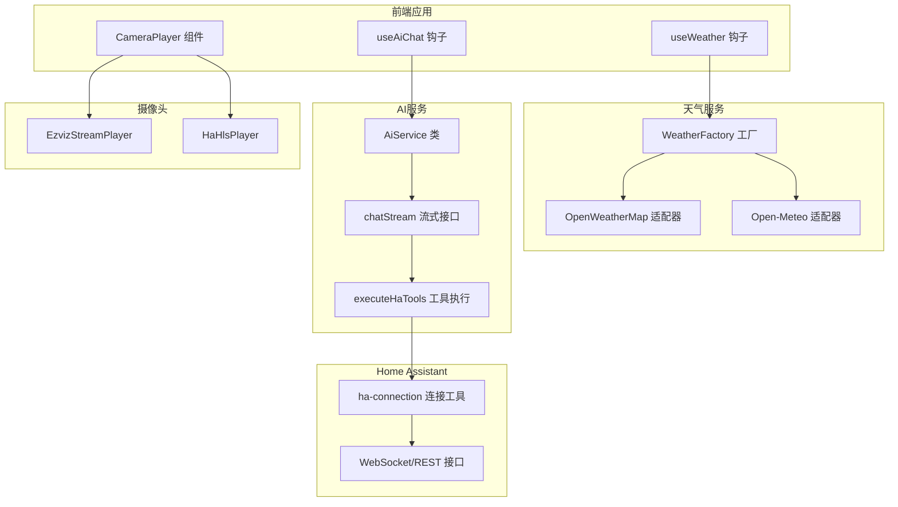
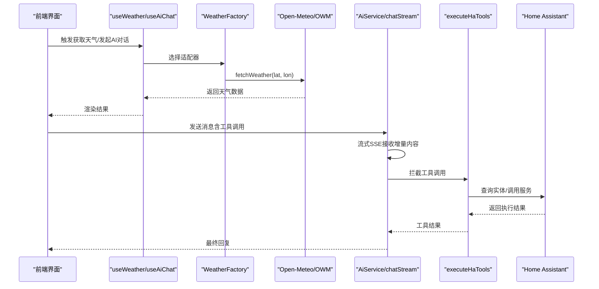
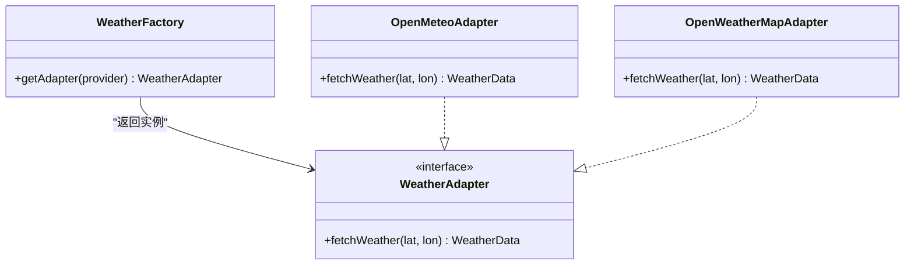
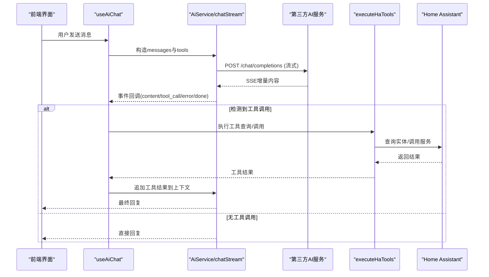
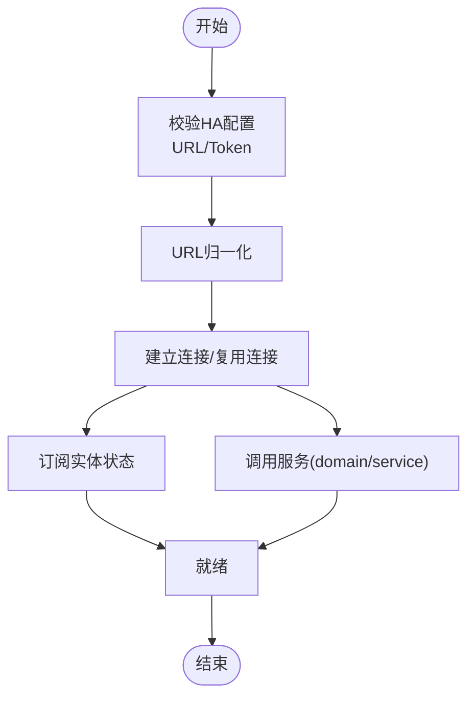
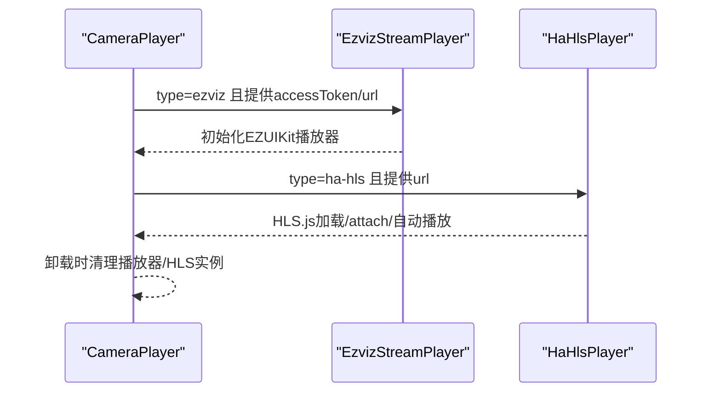
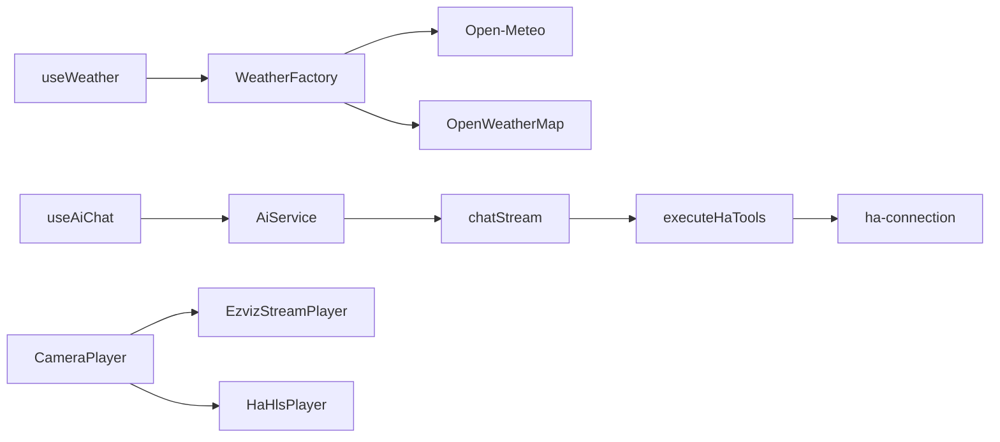

# 外部集成接口

<cite>
**本文引用的文件**
- [src/services/weather/weather-factory.ts](file://src/services/weather/weather-factory.ts)
- [src/services/weather/adapters/open-meteo.ts](file://src/services/weather/adapters/open-meteo.ts)
- [src/services/weather/adapters/open-weather-map.ts](file://src/services/weather/adapters/open-weather-map.ts)
- [src/services/weather/types.ts](file://src/services/weather/types.ts)
- [src/hooks/useWeather.ts](file://src/hooks/useWeather.ts)
- [src/services/ai-service.ts](file://src/services/ai-service.ts)
- [src/services/ai-chat.ts](file://src/services/ai-chat.ts)
- [src/hooks/useAiChat.ts](file://src/hooks/useAiChat.ts)
- [src/utils/ha-connection.ts](file://src/utils/ha-connection.ts)
- [src/services/ai-tools-executor.ts](file://src/services/ai-tools-executor.ts)
- [src/components/camera/CameraPlayer.tsx](file://src/components/camera/CameraPlayer.tsx)
- [src/components/camera/EzvizStreamPlayer.tsx](file://src/components/camera/EzvizStreamPlayer.tsx)
- [src/components/camera/HaHlsPlayer.tsx](file://src/components/camera/HaHlsPlayer.tsx)
- [config/configuration.yaml](file://config/configuration.yaml)
</cite>

## 目录
1. [简介](#简介)
2. [项目结构](#项目结构)
3. [核心组件](#核心组件)
4. [架构总览](#架构总览)
5. [详细组件分析](#详细组件分析)
6. [依赖关系分析](#依赖关系分析)
7. [性能考量](#性能考量)
8. [故障排除指南](#故障排除指南)
9. [结论](#结论)
10. [附录](#附录)

## 简介
本文件面向HAUI的外部集成接口，系统化梳理以下第三方服务对接能力与规范：
- 天气服务适配器：Open-Meteo与OpenWeatherMap的统一接入与降级策略
- AI服务集成：兼容OpenAI格式的对话与工具调用（含流式SSE），以及与Home Assistant的联动
- 摄像头集成：萤石云（EZVIZ）与Home Assistant HLS流的播放与资源管理
- Home Assistant连接：长连接、鉴权、可用性探测与实体订阅
- MQTT通信：基于Mosquitto配置的本地消息总线（本仓库以Mosquitto配置文件形式提供）

本指南兼顾技术深度与可读性，提供接口规范、认证机制、请求/响应格式、错误恢复策略、集成示例与排障建议。

## 项目结构
围绕外部集成的关键目录与文件：
- 天气服务：src/services/weather/*（适配器工厂、适配器、类型）
- AI服务：src/services/ai-service.ts、src/services/ai-chat.ts、src/hooks/useAiChat.ts
- HA连接：src/utils/ha-connection.ts
- 摄像头：src/components/camera/*（播放器与类型）
- 配置：config/configuration.yaml（Home Assistant前端与CORS配置）
- MQTT：mosquitto/config/mosquitto.conf（Mosquitto服务配置）

图表来源
- [src/hooks/useWeather.ts:1-128](file://src/hooks/useWeather.ts#L1-L128)
- [src/services/weather/weather-factory.ts:1-21](file://src/services/weather/weather-factory.ts#L1-L21)
- [src/services/weather/adapters/open-weather-map.ts:1-46](file://src/services/weather/adapters/open-weather-map.ts#L1-L46)
- [src/services/weather/adapters/open-meteo.ts:1-115](file://src/services/weather/adapters/open-meteo.ts#L1-L115)
- [src/services/ai-service.ts:1-201](file://src/services/ai-service.ts#L1-L201)
- [src/services/ai-chat.ts:1-153](file://src/services/ai-chat.ts#L1-L153)
- [src/services/ai-tools-executor.ts:1-60](file://src/services/ai-tools-executor.ts#L1-L60)
- [src/utils/ha-connection.ts:1-317](file://src/utils/ha-connection.ts#L1-L317)
- [src/components/camera/CameraPlayer.tsx:1-88](file://src/components/camera/CameraPlayer.tsx#L1-L88)
- [src/components/camera/EzvizStreamPlayer.tsx:1-80](file://src/components/camera/EzvizStreamPlayer.tsx#L1-L80)
- [src/components/camera/HaHlsPlayer.tsx:1-100](file://src/components/camera/HaHlsPlayer.tsx#L1-L100)

章节来源
- [src/hooks/useWeather.ts:1-128](file://src/hooks/useWeather.ts#L1-L128)
- [src/services/weather/weather-factory.ts:1-21](file://src/services/weather/weather-factory.ts#L1-L21)
- [src/services/ai-service.ts:1-201](file://src/services/ai-service.ts#L1-L201)
- [src/services/ai-chat.ts:1-153](file://src/services/ai-chat.ts#L1-L153)
- [src/utils/ha-connection.ts:1-317](file://src/utils/ha-connection.ts#L1-L317)
- [src/components/camera/CameraPlayer.tsx:1-88](file://src/components/camera/CameraPlayer.tsx#L1-L88)

## 核心组件
- 天气服务适配器：通过工厂模式选择Open-Meteo或OpenWeatherMap；具备主备切换与缓存/离线回退
- AI服务：统一OpenAI兼容接口，支持配置校验、安全脱敏、错误映射与流式SSE
- HA连接：长连接封装、URL归一化、鉴权、可用性探测、一次性连接与实体订阅
- 摄像头播放：萤石云SDK与HLS.js双通道播放，资源生命周期管理
- MQTT：Mosquitto配置文件，便于本地消息总线部署

章节来源
- [src/services/weather/weather-factory.ts:1-21](file://src/services/weather/weather-factory.ts#L1-L21)
- [src/services/weather/adapters/open-meteo.ts:1-115](file://src/services/weather/adapters/open-meteo.ts#L1-L115)
- [src/services/weather/adapters/open-weather-map.ts:1-46](file://src/services/weather/adapters/open-weather-map.ts#L1-L46)
- [src/hooks/useWeather.ts:1-128](file://src/hooks/useWeather.ts#L1-L128)
- [src/services/ai-service.ts:1-201](file://src/services/ai-service.ts#L1-L201)
- [src/services/ai-chat.ts:1-153](file://src/services/ai-chat.ts#L1-L153)
- [src/utils/ha-connection.ts:1-317](file://src/utils/ha-connection.ts#L1-L317)
- [src/components/camera/EzvizStreamPlayer.tsx:1-80](file://src/components/camera/EzvizStreamPlayer.tsx#L1-L80)
- [src/components/camera/HaHlsPlayer.tsx:1-100](file://src/components/camera/HaHlsPlayer.tsx#L1-L100)

## 架构总览
外部集成采用“前端直连第三方”的轻量代理策略：
- 天气：前端直接调用第三方API，工厂负责适配与降级
- AI：前端直连第三方模型服务，通过SSE流式交互；工具调用通过HA连接执行
- 摄像头：前端直接加载萤石云SDK或HLS流；组件负责生命周期与资源释放
- HA：前端通过WebSocket/REST与Home Assistant交互，连接工具提供鉴权与可用性探测

图表来源
- [src/hooks/useWeather.ts:1-128](file://src/hooks/useWeather.ts#L1-L128)
- [src/services/weather/weather-factory.ts:1-21](file://src/services/weather/weather-factory.ts#L1-L21)
- [src/services/weather/adapters/open-meteo.ts:1-115](file://src/services/weather/adapters/open-meteo.ts#L1-L115)
- [src/services/ai-service.ts:1-201](file://src/services/ai-service.ts#L1-L201)
- [src/services/ai-chat.ts:1-153](file://src/services/ai-chat.ts#L1-L153)
- [src/services/ai-tools-executor.ts:1-60](file://src/services/ai-tools-executor.ts#L1-L60)
- [src/utils/ha-connection.ts:1-317](file://src/utils/ha-connection.ts#L1-L317)

## 详细组件分析

### 天气服务适配器（Weather Adapter）
- 设计要点
  - 工厂模式：根据特性开关选择适配器
  - 主备降级：主源失败自动切换至备用源
  - 缓存与离线回退：命中缓存优先展示，网络异常时加载陈旧缓存
  - HTTP回退：在特定环境下自动降级为HTTP请求
- 数据模型
  - WeatherData：温度、湿度、PM2.5、体感温度、风速、气压、能见度、紫外线指数、逐日预报
  - ForecastData：日期、最高/最低温度、天气现象代码与描述
- 错误处理
  - 对第三方返回结构进行严格校验，缺失字段或错误标志时抛出明确错误
  - 对网络错误与解析异常进行捕获与提示

图表来源
- [src/services/weather/weather-factory.ts:1-21](file://src/services/weather/weather-factory.ts#L1-L21)
- [src/services/weather/adapters/open-meteo.ts:1-115](file://src/services/weather/adapters/open-meteo.ts#L1-L115)
- [src/services/weather/adapters/open-weather-map.ts:1-46](file://src/services/weather/adapters/open-weather-map.ts#L1-L46)
- [src/services/weather/types.ts:1-28](file://src/services/weather/types.ts#L1-L28)

章节来源
- [src/hooks/useWeather.ts:1-128](file://src/hooks/useWeather.ts#L1-L128)
- [src/services/weather/weather-factory.ts:1-21](file://src/services/weather/weather-factory.ts#L1-L21)
- [src/services/weather/adapters/open-meteo.ts:1-115](file://src/services/weather/adapters/open-meteo.ts#L1-L115)
- [src/services/weather/adapters/open-weather-map.ts:1-46](file://src/services/weather/adapters/open-weather-map.ts#L1-L46)
- [src/services/weather/types.ts:1-28](file://src/services/weather/types.ts#L1-L28)

### AI服务集成（OpenAI兼容）
- 认证机制
  - Authorization: Bearer <API Key>，Key经ASCII白名单清洗，避免非打印字符注入
  - 支持三种提供商：硅基流动、阿里云百炼、自定义（OpenAI兼容）
- 请求格式
  - POST /chat/completions
  - Body包含model、messages、stream、tools、tool_choice
  - 流式SSE：事件类型为message，数据为增量内容；结束事件为[DONE]
- 响应处理
  - 成功：提取choices[0].message.content
  - 错误：对401/404等状态码进行用户友好提示；网络错误进行兜底提示
- 工具调用
  - 支持get_entity_state与call_ha_service两类工具
  - 工具调用结果作为后续轮对话上下文返回给模型，生成最终回复
- 配置与安全
  - Zod Schema校验localStorage中的配置，防止恶意篡改
  - 脱敏输出：日志中仅显示Key前缀，避免泄露

图表来源
- [src/services/ai-service.ts:1-201](file://src/services/ai-service.ts#L1-L201)
- [src/services/ai-chat.ts:1-153](file://src/services/ai-chat.ts#L1-L153)
- [src/hooks/useAiChat.ts:1-317](file://src/hooks/useAiChat.ts#L1-L317)
- [src/services/ai-tools-executor.ts:1-60](file://src/services/ai-tools-executor.ts#L1-L60)
- [src/utils/ha-connection.ts:1-317](file://src/utils/ha-connection.ts#L1-L317)

章节来源
- [src/services/ai-service.ts:1-201](file://src/services/ai-service.ts#L1-L201)
- [src/services/ai-chat.ts:1-153](file://src/services/ai-chat.ts#L1-L153)
- [src/hooks/useAiChat.ts:1-317](file://src/hooks/useAiChat.ts#L1-L317)
- [src/services/ai-tools-executor.ts:1-60](file://src/services/ai-tools-executor.ts#L1-L60)

### Home Assistant连接与工具执行
- 连接建立
  - 支持长连接与一次性连接
  - URL归一化：自动去除多余路径与协议差异
  - 鉴权：长期访问令牌（Long-Lived Access Token）
  - 可用性探测：HTTP与WebSocket双重探测，优先返回可达URL
- 实体订阅与服务调用
  - subscribeEntities：订阅实体状态变更
  - callService：调用指定domain/service
- 工具执行
  - executeHaTools：解析工具调用参数，执行查询或服务调用，返回结构化结果

图表来源
- [src/utils/ha-connection.ts:1-317](file://src/utils/ha-connection.ts#L1-L317)
- [src/services/ai-tools-executor.ts:1-60](file://src/services/ai-tools-executor.ts#L1-L60)

章节来源
- [src/utils/ha-connection.ts:1-317](file://src/utils/ha-connection.ts#L1-L317)
- [src/services/ai-tools-executor.ts:1-60](file://src/services/ai-tools-executor.ts#L1-L60)

### 摄像头集成（萤石云与HLS）
- 萤石云（EZVIZ）
  - 动态导入ezuikit-js，构造播放器实例
  - 支持音频初始静音、尺寸延时初始化、组件卸载时stop/destroy清理
- Home Assistant HLS
  - 使用hls.js在不支持HLS的环境中播放m3u8
  - 原生HLS支持时直接赋值video.src
  - 错误恢复：网络/媒体错误自动重连与层级恢复
- 生命周期管理
  - 组件卸载时彻底释放HLS实例与video资源，避免内存泄漏

图表来源
- [src/components/camera/CameraPlayer.tsx:1-88](file://src/components/camera/CameraPlayer.tsx#L1-L88)
- [src/components/camera/EzvizStreamPlayer.tsx:1-80](file://src/components/camera/EzvizStreamPlayer.tsx#L1-L80)
- [src/components/camera/HaHlsPlayer.tsx:1-100](file://src/components/camera/HaHlsPlayer.tsx#L1-L100)

章节来源
- [src/components/camera/CameraPlayer.tsx:1-88](file://src/components/camera/CameraPlayer.tsx#L1-L88)
- [src/components/camera/EzvizStreamPlayer.tsx:1-80](file://src/components/camera/EzvizStreamPlayer.tsx#L1-L80)
- [src/components/camera/HaHlsPlayer.tsx:1-100](file://src/components/camera/HaHlsPlayer.tsx#L1-L100)

### MQTT通信（Mosquitto）
- 仓库提供Mosquitto配置文件，可用于本地部署消息总线
- 建议在开发与测试环境中启用，生产环境需结合安全策略与网络隔离

章节来源
- [mosquitto/config/mosquitto.conf](file://mosquitto/config/mosquitto.conf)

## 依赖关系分析
- 组件耦合
  - useWeather依赖WeatherFactory与具体适配器，耦合度低，便于扩展新适配器
  - useAiChat依赖AiService与chatStream，工具执行依赖HA连接工具
  - 摄像头组件与播放器解耦，便于替换不同播放方案
- 外部依赖
  - 天气：Open-Meteo、OpenWeatherMap
  - AI：第三方OpenAI兼容服务（SiliconFlow、阿里云百炼、自定义）
  - HA：home-assistant-js-websocket
  - 摄像头：ezuikit-js、hls.js
- 循环依赖
  - 未发现循环依赖；模块职责清晰

图表来源
- [src/hooks/useWeather.ts:1-128](file://src/hooks/useWeather.ts#L1-L128)
- [src/services/weather/weather-factory.ts:1-21](file://src/services/weather/weather-factory.ts#L1-L21)
- [src/services/ai-service.ts:1-201](file://src/services/ai-service.ts#L1-L201)
- [src/services/ai-chat.ts:1-153](file://src/services/ai-chat.ts#L1-L153)
- [src/services/ai-tools-executor.ts:1-60](file://src/services/ai-tools-executor.ts#L1-L60)
- [src/utils/ha-connection.ts:1-317](file://src/utils/ha-connection.ts#L1-L317)
- [src/components/camera/CameraPlayer.tsx:1-88](file://src/components/camera/CameraPlayer.tsx#L1-L88)

章节来源
- [src/hooks/useWeather.ts:1-128](file://src/hooks/useWeather.ts#L1-L128)
- [src/services/weather/weather-factory.ts:1-21](file://src/services/weather/weather-factory.ts#L1-L21)
- [src/services/ai-service.ts:1-201](file://src/services/ai-service.ts#L1-L201)
- [src/services/ai-chat.ts:1-153](file://src/services/ai-chat.ts#L1-L153)
- [src/services/ai-tools-executor.ts:1-60](file://src/services/ai-tools-executor.ts#L1-L60)
- [src/utils/ha-connection.ts:1-317](file://src/utils/ha-connection.ts#L1-L317)
- [src/components/camera/CameraPlayer.tsx:1-88](file://src/components/camera/CameraPlayer.tsx#L1-L88)

## 性能考量
- 天气
  - 缓存命中优先展示，后台刷新；失败重试采用指数回退
  - 主源不可用时快速切换备用源，减少用户等待
- AI
  - 流式SSE提升感知速度；工具调用前后端分离，避免阻塞
  - 配置校验与脱敏降低运行时风险
- 摄像头
  - HLS.js低延迟配置与错误恢复，保障直播体验
  - 组件卸载时彻底释放资源，避免内存累积
- HA
  - URL归一化与可用性探测减少无效连接
  - 长连接复用与一次性连接按需使用

## 故障排除指南
- 天气接口
  - 症状：无数据或错误提示
  - 排查：确认经纬度有效；检查主/备适配器可用性；查看缓存是否陈旧
  - 参考
    - [src/hooks/useWeather.ts:1-128](file://src/hooks/useWeather.ts#L1-L128)
    - [src/services/weather/adapters/open-meteo.ts:1-115](file://src/services/weather/adapters/open-meteo.ts#L1-L115)
- AI接口
  - 症状：鉴权失败/404/网络异常
  - 排查：核对API Key/Base URL/模型名；检查网络连通性；查看脱敏日志定位问题
  - 参考
    - [src/services/ai-service.ts:1-201](file://src/services/ai-service.ts#L1-L201)
    - [src/services/ai-chat.ts:1-153](file://src/services/ai-chat.ts#L1-L153)
- HA连接
  - 症状：无法连接/鉴权失败
  - 排查：确认URL与Token；使用可用性探测；检查CORS配置
  - 参考
    - [src/utils/ha-connection.ts:1-317](file://src/utils/ha-connection.ts#L1-L317)
    - [config/configuration.yaml:1-24](file://config/configuration.yaml#L1-L24)
- 摄像头
  - 症状：播放失败/黑屏/卡顿
  - 排查：确认URL与权限；检查hls.js支持情况；组件卸载时是否正确清理
  - 参考
    - [src/components/camera/EzvizStreamPlayer.tsx:1-80](file://src/components/camera/EzvizStreamPlayer.tsx#L1-L80)
    - [src/components/camera/HaHlsPlayer.tsx:1-100](file://src/components/camera/HaHlsPlayer.tsx#L1-L100)
- MQTT
  - 症状：无法发布/订阅
  - 排查：检查Mosquitto配置与端口；验证ACL与认证设置
  - 参考
    - [mosquitto/config/mosquitto.conf](file://mosquitto/config/mosquitto.conf)

章节来源
- [src/hooks/useWeather.ts:1-128](file://src/hooks/useWeather.ts#L1-L128)
- [src/services/ai-service.ts:1-201](file://src/services/ai-service.ts#L1-L201)
- [src/services/ai-chat.ts:1-153](file://src/services/ai-chat.ts#L1-L153)
- [src/utils/ha-connection.ts:1-317](file://src/utils/ha-connection.ts#L1-L317)
- [config/configuration.yaml:1-24](file://config/configuration.yaml#L1-L24)
- [src/components/camera/EzvizStreamPlayer.tsx:1-80](file://src/components/camera/EzvizStreamPlayer.tsx#L1-L80)
- [src/components/camera/HaHlsPlayer.tsx:1-100](file://src/components/camera/HaHlsPlayer.tsx#L1-L100)

## 结论
本项目以外部直连为核心设计，结合工厂模式、适配器与工具执行，实现了对天气、AI、摄像头与Home Assistant的稳健集成。通过缓存/降级、流式SSE、资源生命周期管理与连接可用性探测，提升了用户体验与系统稳定性。建议在生产环境强化配置校验、日志脱敏与网络隔离，并持续评估第三方服务的SLA与合规要求。

## 附录
- 接口清单与规范（示例）
  - 天气接口
    - 方法：GET
    - 参数：latitude、longitude
    - 返回：温度、湿度、PM2.5、体感温度、风速、气压、能见度、紫外线指数、逐日预报
    - 参考
      - [src/services/weather/adapters/open-meteo.ts:1-115](file://src/services/weather/adapters/open-meteo.ts#L1-L115)
      - [src/services/weather/types.ts:1-28](file://src/services/weather/types.ts#L1-L28)
  - AI对话接口
    - 方法：POST /chat/completions
    - 请求头：Authorization: Bearer <API Key>, Content-Type: application/json
    - 请求体：model、messages、stream、tools、tool_choice
    - 响应：SSE事件，增量content与工具调用聚合
    - 参考
      - [src/services/ai-chat.ts:1-153](file://src/services/ai-chat.ts#L1-L153)
      - [src/services/ai-service.ts:1-201](file://src/services/ai-service.ts#L1-L201)
  - HA工具调用
    - 方法：call_service(domain, service, service_data)
    - 参考
      - [src/services/ai-tools-executor.ts:1-60](file://src/services/ai-tools-executor.ts#L1-L60)
      - [src/utils/ha-connection.ts:1-317](file://src/utils/ha-connection.ts#L1-L317)
  - 摄像头播放
    - 萤石云：动态加载ezuikit-js，播放器实例化与清理
    - HA HLS：Hls.js加载/attach与错误恢复
    - 参考
      - [src/components/camera/EzvizStreamPlayer.tsx:1-80](file://src/components/camera/EzvizStreamPlayer.tsx#L1-L80)
      - [src/components/camera/HaHlsPlayer.tsx:1-100](file://src/components/camera/HaHlsPlayer.tsx#L1-L100)