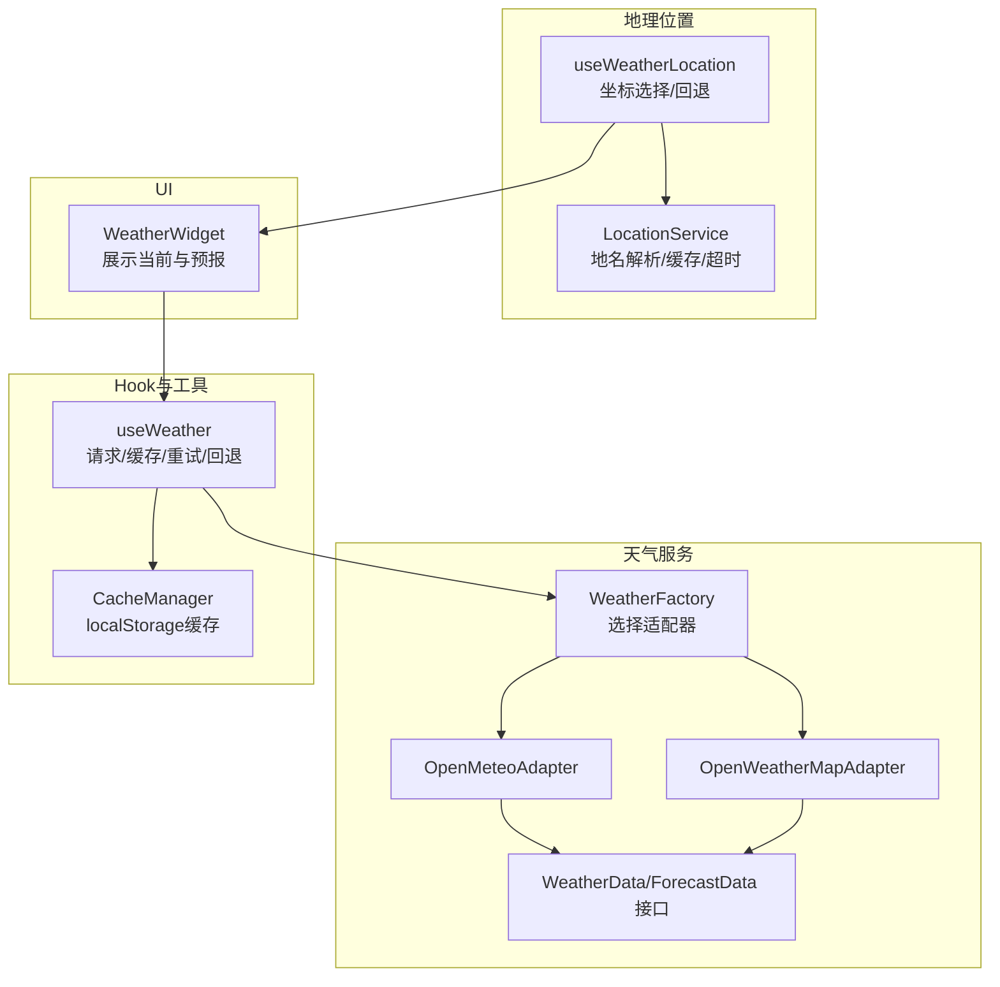
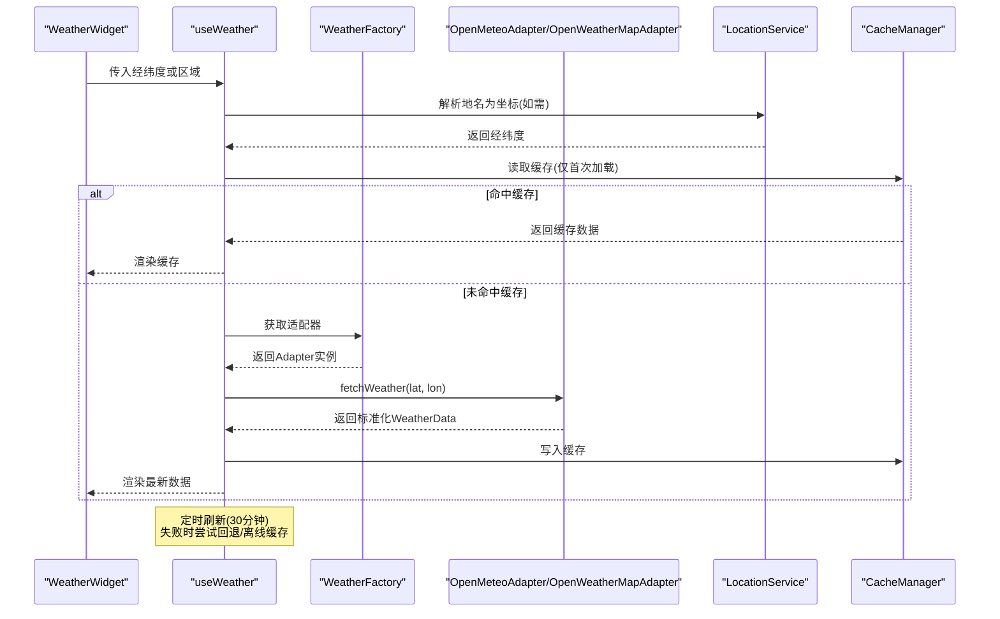
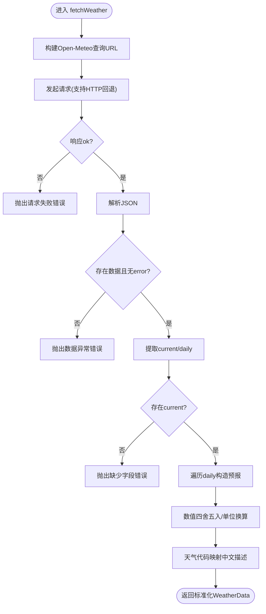
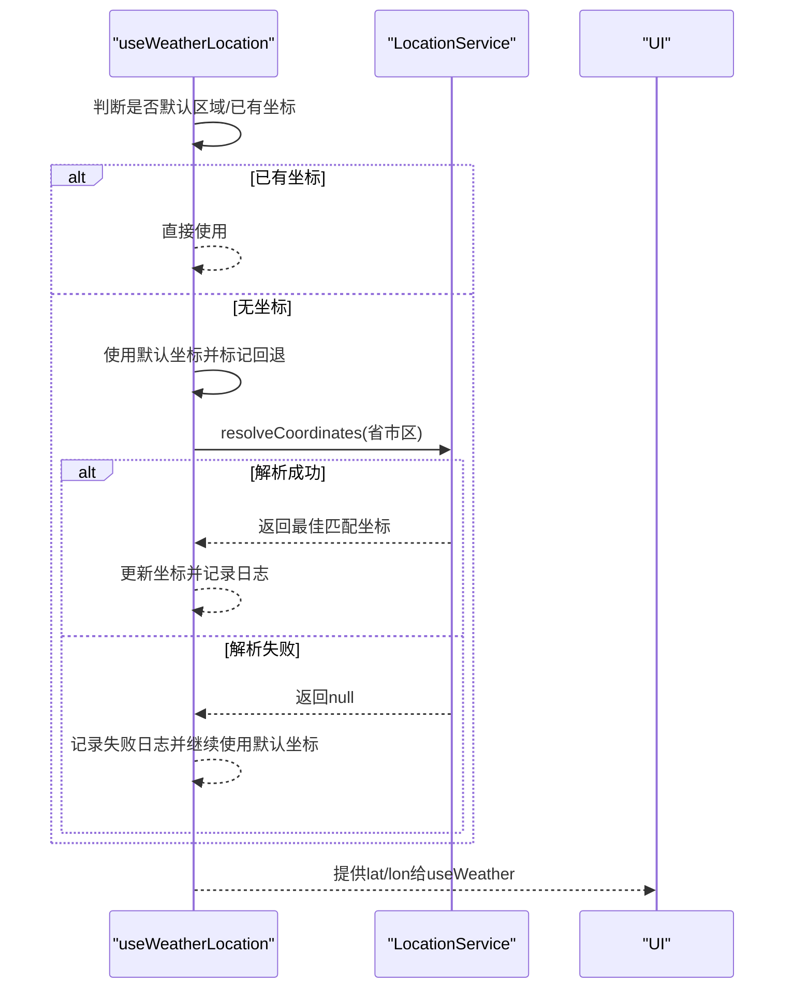
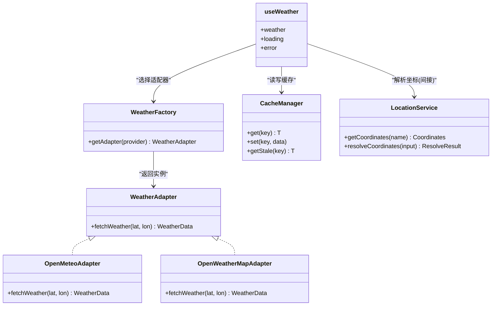

# 天气数据API

<cite>
**本文引用的文件**
- [src/services/weather/adapters/open-meteo.ts](file://src/services/weather/adapters/open-meteo.ts)
- [src/services/weather/adapters/open-weather-map.ts](file://src/services/weather/adapters/open-weather-map.ts)
- [src/services/weather/types.ts](file://src/services/weather/types.ts)
- [src/services/weather/weather-factory.ts](file://src/services/weather/weather-factory.ts)
- [src/hooks/useWeather.ts](file://src/hooks/useWeather.ts)
- [src/utils/cache-manager.ts](file://src/utils/cache-manager.ts)
- [src/config/feature-flags.ts](file://src/config/feature-flags.ts)
- [src/services/LocationService.ts](file://src/services/LocationService.ts)
- [src/hooks/useWeatherLocation.ts](file://src/hooks/useWeatherLocation.ts)
- [src/app/components/dashboard/widgets/WeatherWidget.tsx](file://src/app/components/dashboard/widgets/WeatherWidget.tsx)
- [src/utils/regions.ts](file://src/utils/regions.ts)
- [src/services/weather/__tests__/weather-factory.test.ts](file://src/services/weather/__tests__/weather-factory.test.ts)
</cite>

## 目录
1. [简介](#简介)
2. [项目结构](#项目结构)
3. [核心组件](#核心组件)
4. [架构总览](#架构总览)
5. [详细组件分析](#详细组件分析)
6. [依赖关系分析](#依赖关系分析)
7. [性能考量](#性能考量)
8. [故障排查指南](#故障排查指南)
9. [结论](#结论)
10. [附录](#附录)

## 简介
本文件系统化梳理天气数据API的设计与实现，重点覆盖以下方面：
- 天气服务适配器：Open-Meteo与OpenWeatherMap两个适配器的接口规范与实现差异
- 数据获取流程：从地理坐标到天气数据的完整链路
- 参数映射与数据转换：字段映射规则、单位换算与本地化描述
- 地理位置服务集成：坐标解析、缓存与降级策略
- 缓存策略：本地存储缓存、失效时间与“先显示后刷新”策略
- 错误处理：重试、回退、离线缓存与用户提示
- 数据格式说明与使用示例：接口契约、返回字段与典型调用方式

## 项目结构
围绕天气能力的关键目录与文件如下：
- 适配器层：Open-Meteo与OpenWeatherMap适配器，统一实现WeatherAdapter接口
- 类型定义：WeatherData、ForecastData、WeatherAdapter接口
- 工厂：根据特性开关选择具体适配器
- Hook：useWeather封装请求、缓存、重试与回退逻辑
- 工具：CacheManager提供本地缓存
- 地理位置：LocationService负责地名到坐标的解析与缓存
- UI：WeatherWidget展示当前天气与短期预报
- 配置：feature-flags控制天气提供商



**图表来源**
- [src/services/weather/weather-factory.ts:1-21](file://src/services/weather/weather-factory.ts#L1-L21)
- [src/services/weather/adapters/open-meteo.ts:1-115](file://src/services/weather/adapters/open-meteo.ts#L1-L115)
- [src/services/weather/adapters/open-weather-map.ts:1-46](file://src/services/weather/adapters/open-weather-map.ts#L1-L46)
- [src/services/weather/types.ts:1-28](file://src/services/weather/types.ts#L1-L28)
- [src/hooks/useWeather.ts:1-128](file://src/hooks/useWeather.ts#L1-L128)
- [src/utils/cache-manager.ts:1-57](file://src/utils/cache-manager.ts#L1-L57)
- [src/services/LocationService.ts:1-303](file://src/services/LocationService.ts#L1-L303)
- [src/hooks/useWeatherLocation.ts:1-101](file://src/hooks/useWeatherLocation.ts#L1-L101)
- [src/app/components/dashboard/widgets/WeatherWidget.tsx:1-117](file://src/app/components/dashboard/widgets/WeatherWidget.tsx#L1-L117)

**章节来源**
- [src/services/weather/weather-factory.ts:1-21](file://src/services/weather/weather-factory.ts#L1-L21)
- [src/services/weather/types.ts:1-28](file://src/services/weather/types.ts#L1-L28)
- [src/hooks/useWeather.ts:1-128](file://src/hooks/useWeather.ts#L1-L128)
- [src/utils/cache-manager.ts:1-57](file://src/utils/cache-manager.ts#L1-L57)
- [src/services/LocationService.ts:1-303](file://src/services/LocationService.ts#L1-L303)
- [src/hooks/useWeatherLocation.ts:1-101](file://src/hooks/useWeatherLocation.ts#L1-L101)
- [src/app/components/dashboard/widgets/WeatherWidget.tsx:1-117](file://src/app/components/dashboard/widgets/WeatherWidget.tsx#L1-L117)

## 核心组件
- WeatherAdapter接口：定义fetchWeather(lat, lon)方法，返回标准化的WeatherData
- WeatherData：标准化后的天气数据对象，包含温度、湿度、风速、气压、能见度、紫外线指数、空气质量、体感温度、天气现象代码与描述、当日与未来几天的预报
- ForecastData：单日预报，包含日期、最高/最低温度、天气现象代码与描述
- OpenMeteoAdapter：对接Open-Meteo API，支持HTTP回退、错误处理与数据转换
- OpenWeatherMapAdapter：演示适配器，模拟返回不同风格的数据以验证适配器切换
- WeatherFactory：根据特性开关返回对应适配器实例
- useWeather：封装请求、缓存、重试、回退与离线缓存，暴露weather、loading、error
- CacheManager：基于localStorage的简单缓存，带TTL
- LocationService：地名解析为坐标，含缓存、并发去重、超时与HTTPS/HTTP回退
- useWeatherLocation：根据区域选择计算最终经纬度，支持默认回退与日志记录
- WeatherWidget：展示当前天气与短期预报

**章节来源**
- [src/services/weather/types.ts:1-28](file://src/services/weather/types.ts#L1-L28)
- [src/services/weather/adapters/open-meteo.ts:1-115](file://src/services/weather/adapters/open-meteo.ts#L1-L115)
- [src/services/weather/adapters/open-weather-map.ts:1-46](file://src/services/weather/adapters/open-weather-map.ts#L1-L46)
- [src/services/weather/weather-factory.ts:1-21](file://src/services/weather/weather-factory.ts#L1-L21)
- [src/hooks/useWeather.ts:1-128](file://src/hooks/useWeather.ts#L1-L128)
- [src/utils/cache-manager.ts:1-57](file://src/utils/cache-manager.ts#L1-L57)
- [src/services/LocationService.ts:1-303](file://src/services/LocationService.ts#L1-L303)
- [src/hooks/useWeatherLocation.ts:1-101](file://src/hooks/useWeatherLocation.ts#L1-L101)
- [src/app/components/dashboard/widgets/WeatherWidget.tsx:1-117](file://src/app/components/dashboard/widgets/WeatherWidget.tsx#L1-L117)

## 架构总览
天气数据API采用“适配器+工厂+Hook”的分层设计，结合地理位置服务与本地缓存，形成高可用、可扩展的天气数据获取体系。



**图表来源**
- [src/hooks/useWeather.ts:1-128](file://src/hooks/useWeather.ts#L1-L128)
- [src/services/weather/weather-factory.ts:1-21](file://src/services/weather/weather-factory.ts#L1-L21)
- [src/services/weather/adapters/open-meteo.ts:1-115](file://src/services/weather/adapters/open-meteo.ts#L1-L115)
- [src/services/weather/adapters/open-weather-map.ts:1-46](file://src/services/weather/adapters/open-weather-map.ts#L1-L46)
- [src/services/LocationService.ts:1-303](file://src/services/LocationService.ts#L1-L303)
- [src/utils/cache-manager.ts:1-57](file://src/utils/cache-manager.ts#L1-L57)

## 详细组件分析

### Open-Meteo 适配器
- 职责：调用Open-Meteo公开API，拉取逐小时与逐日数据，进行字段映射与本地化描述生成
- 关键点：
  - 支持HTTP回退：在HTTP页面上自动将HTTPS替换为HTTP发起请求
  - 错误处理：区分网络错误、HTTP状态码错误与业务错误，抛出明确错误
  - 数据转换：四舍五入数值、生成PM2.5与空气质量等级、构造7天预报数组
  - 天气现象代码映射：将数值代码映射为中文描述
- 典型字段映射：
  - temperature_2m → temperature（摄氏度）
  - relative_humidity_2m → humidity（百分比）
  - apparent_temperature → apparentTemperature（体感温度）
  - wind_speed_10m → windSpeed（km/h）
  - surface_pressure → pressure（百帕）
  - visibility → visibility（公里）
  - uv_index_max → uvIndex（整数）
  - weather_code → weatherCode与description
  - PM2.5与空气质量：mock值与固定等级



**图表来源**
- [src/services/weather/adapters/open-meteo.ts:1-115](file://src/services/weather/adapters/open-meteo.ts#L1-L115)

**章节来源**
- [src/services/weather/adapters/open-meteo.ts:1-115](file://src/services/weather/adapters/open-meteo.ts#L1-L115)

### OpenWeatherMap 适配器
- 职责：演示适配器，用于验证适配器切换与接口一致性
- 关键点：
  - 模拟网络延迟与返回结构，便于对比不同提供商的数据风格
  - 通过后缀“(OWM)”标识来源，便于调试与演示
  - 作为回退适配器时，可快速获得一致的WeatherData结构

**章节来源**
- [src/services/weather/adapters/open-weather-map.ts:1-46](file://src/services/weather/adapters/open-weather-map.ts#L1-L46)

### WeatherFactory 与 Provider 切换
- 职责：根据特性开关返回对应适配器实例
- 当前默认：OPEN_METEO；可切换至OPEN_WEATHER_MAP
- 测试覆盖：确保工厂返回正确的适配器类型

**章节来源**
- [src/services/weather/weather-factory.ts:1-21](file://src/services/weather/weather-factory.ts#L1-L21)
- [src/config/feature-flags.ts:1-7](file://src/config/feature-flags.ts#L1-L7)
- [src/services/weather/__tests__/weather-factory.test.ts:1-74](file://src/services/weather/__tests__/weather-factory.test.ts#L1-L74)

### useWeather Hook：请求、缓存、重试与回退
- 功能要点：
  - 缓存策略：首次加载优先读取缓存；坐标变化时清空旧数据；后台刷新不改变loading状态
  - 重试机制：最多3次，指数退避（1s、2s、4s）
  - 回退策略：主提供商失败时尝试OPEN_WEATHER_MAP
  - 离线缓存：网络异常时尝试读取“陈旧缓存”，并提示用户
  - 坐标变更检测：按精度保留字符串键，避免微小漂移导致重复请求
- 输出：weather、loading、error三态

```mermaid
sequenceDiagram
participant Hook as "useWeather"
participant Cache as "CacheManager"
participant Factory as "WeatherFactory"
participant Adapter as "Adapter"
participant Fallback as "回退适配器"
Hook->>Cache : get(cacheKey)
alt 命中缓存
Cache-->>Hook : 返回缓存
Hook-->>Hook : 后台刷新(不设loading)
else 未命中
Hook->>Factory : getAdapter(provider)
Factory-->>Hook : 返回Adapter
loop 最多3次
Hook->>Adapter : fetchWeather(lat, lon)
alt 成功
Adapter-->>Hook : 返回WeatherData
Hook->>Cache : set(cacheKey, data)
Hook-->>Hook : 更新状态
break
else 失败
Hook->>Hook : 指数退避等待
end
end
alt 主提供商为OPEN_METEO
Hook->>Factory : getAdapter(OPEN_WEATHER_MAP)
Factory-->>Hook : 返回回退适配器
Hook->>Fallback : fetchWeather(lat, lon)
alt 成功
Fallback-->>Hook : 返回WeatherData
Hook->>Cache : set(cacheKey, data)
Hook-->>Hook : 设置回退提示
else 失败
Hook-->>Hook : 抛出最后一次错误
end
else
Hook-->>Hook : 抛出最后一次错误
end
end
Hook->>Cache : getStale(cacheKey)
alt 存在陈旧缓存
Cache-->>Hook : 返回陈旧缓存
Hook-->>Hook : 提示离线缓存
else
Hook-->>Hook : 设置错误消息
end
```

**图表来源**
- [src/hooks/useWeather.ts:1-128](file://src/hooks/useWeather.ts#L1-L128)
- [src/utils/cache-manager.ts:1-57](file://src/utils/cache-manager.ts#L1-L57)
- [src/services/weather/weather-factory.ts:1-21](file://src/services/weather/weather-factory.ts#L1-L21)
- [src/services/weather/adapters/open-weather-map.ts:1-46](file://src/services/weather/adapters/open-weather-map.ts#L1-L46)

**章节来源**
- [src/hooks/useWeather.ts:1-128](file://src/hooks/useWeather.ts#L1-L128)
- [src/utils/cache-manager.ts:1-57](file://src/utils/cache-manager.ts#L1-L57)

### 地理位置服务集成
- LocationService：
  - 支持地名解析为坐标，含缓存、并发去重、超时控制
  - HTTPS优先，若HTTPS失败且当前页面为HTTP则回退到HTTP
  - 统计记录：成功/失败次数、分位耗时、按分辨率统计
- useWeatherLocation：
  - 优先使用已有的区域坐标；否则回退到默认坐标并异步解析
  - 解析成功后更新天气坐标并记录日志；失败提示并继续使用默认位置



**图表来源**
- [src/hooks/useWeatherLocation.ts:1-101](file://src/hooks/useWeatherLocation.ts#L1-L101)
- [src/services/LocationService.ts:1-303](file://src/services/LocationService.ts#L1-L303)
- [src/utils/regions.ts:1-15](file://src/utils/regions.ts#L1-L15)

**章节来源**
- [src/hooks/useWeatherLocation.ts:1-101](file://src/hooks/useWeatherLocation.ts#L1-L101)
- [src/services/LocationService.ts:1-303](file://src/services/LocationService.ts#L1-L303)
- [src/utils/regions.ts:1-15](file://src/utils/regions.ts#L1-L15)

### 数据模型与格式说明
- WeatherData
  - 字段：temperature、weatherCode、description、isDay、humidity、pm25、airQuality、apparentTemperature、windSpeed、pressure、visibility、uvIndex、forecast[]
  - 单位与取整：温度、体感温度、风速、气压、能见度等按适配器转换；数值通常四舍五入
  - 空气质量：OpenMeteo适配器固定为“优”，OpenWeatherMap适配器固定为“良”
- ForecastData
  - 字段：date、maxTemp、minTemp、weatherCode、description
  - 日期：当天/次日/“MM/DD”格式
- 适配器差异
  - OpenMeteo：真实API，字段丰富，支持UV指数与多日预报
  - OpenWeatherMap：演示适配器，返回固定风格数据，便于对比

**章节来源**
- [src/services/weather/types.ts:1-28](file://src/services/weather/types.ts#L1-L28)
- [src/services/weather/adapters/open-meteo.ts:1-115](file://src/services/weather/adapters/open-meteo.ts#L1-L115)
- [src/services/weather/adapters/open-weather-map.ts:1-46](file://src/services/weather/adapters/open-weather-map.ts#L1-L46)

### UI 展示组件
- WeatherWidget：展示当前温度、体感、湿度、图标与短期预报（默认展示中间三天）
- 图标映射：依据weatherCode映射到不同天气图标
- 状态提示：加载中、错误、回退提示

**章节来源**
- [src/app/components/dashboard/widgets/WeatherWidget.tsx:1-117](file://src/app/components/dashboard/widgets/WeatherWidget.tsx#L1-L117)

## 依赖关系分析
- 低耦合：适配器实现WeatherAdapter接口，工厂屏蔽具体实现细节
- 可替换性：通过特性开关与工厂即可切换提供商
- 缓存独立：CacheManager与Hook解耦，便于复用
- 地理位置独立：LocationService与useWeatherLocation分离职责



**图表来源**
- [src/services/weather/types.ts:1-28](file://src/services/weather/types.ts#L1-L28)
- [src/services/weather/weather-factory.ts:1-21](file://src/services/weather/weather-factory.ts#L1-L21)
- [src/hooks/useWeather.ts:1-128](file://src/hooks/useWeather.ts#L1-L128)
- [src/utils/cache-manager.ts:1-57](file://src/utils/cache-manager.ts#L1-L57)
- [src/services/LocationService.ts:1-303](file://src/services/LocationService.ts#L1-L303)

**章节来源**
- [src/services/weather/types.ts:1-28](file://src/services/weather/types.ts#L1-L28)
- [src/services/weather/weather-factory.ts:1-21](file://src/services/weather/weather-factory.ts#L1-L21)
- [src/hooks/useWeather.ts:1-128](file://src/hooks/useWeather.ts#L1-L128)
- [src/utils/cache-manager.ts:1-57](file://src/utils/cache-manager.ts#L1-L57)
- [src/services/LocationService.ts:1-303](file://src/services/LocationService.ts#L1-L303)

## 性能考量
- 缓存策略：30分钟TTL，首次加载命中即快速渲染，后台刷新不阻塞UI
- 重试退避：指数退避降低对上游的压力，提升成功率
- 并发去重：LocationService对同一查询去重，避免重复请求
- 超时控制：地理解析设置超时，防止长时间阻塞
- UI优化：图标映射与短预报展示减少渲染开销

[本节为通用性能建议，无需特定文件引用]

## 故障排查指南
- 网络错误
  - 现象：请求被拦截或跨域失败
  - 处理：OpenMeteo适配器自动HTTP回退；LocationService在HTTP页面上回退到HTTP
- 业务错误
  - 现象：HTTP状态非200或返回error字段
  - 处理：抛出明确错误；useWeather捕获后尝试回退或离线缓存
- 适配器切换
  - 现象：数据风格差异明显
  - 处理：确认WEATHER_PROVIDER配置；OpenWeatherMap适配器返回“OWM”标识
- 缓存问题
  - 现象：数据长时间未更新
  - 处理：检查TTL与刷新间隔；必要时清理localStorage对应键
- 地理解析失败
  - 现象：无法解析省市区到坐标
  - 处理：检查输入名称；查看统计日志；回退到默认坐标

**章节来源**
- [src/hooks/useWeather.ts:1-128](file://src/hooks/useWeather.ts#L1-L128)
- [src/services/weather/adapters/open-meteo.ts:1-115](file://src/services/weather/adapters/open-meteo.ts#L1-L115)
- [src/services/LocationService.ts:1-303](file://src/services/LocationService.ts#L1-L303)
- [src/config/feature-flags.ts:1-7](file://src/config/feature-flags.ts#L1-L7)

## 结论
该天气数据API通过适配器模式实现了对多家天气提供商的抽象与切换，结合地理位置服务、本地缓存与完善的错误处理机制，提供了稳定、可扩展且用户体验友好的天气数据能力。开发者可通过特性开关灵活切换提供商，并在保证性能与可靠性的同时，平滑应对网络异常与上游故障。

[本节为总结性内容，无需特定文件引用]

## 附录

### 使用示例
- 在组件中使用useWeather获取天气数据
  - 传入经纬度或通过useWeatherLocation获取坐标
  - 监听weather、loading、error三态进行渲染
- 切换天气提供商
  - 修改特性开关WEATHER_PROVIDER为OPEN_WEATHER_MAP或OPEN_METEO
- 自定义UI
  - 使用WeatherWidget或自行组合图标、温度、体感、湿度与短期预报

**章节来源**
- [src/hooks/useWeather.ts:1-128](file://src/hooks/useWeather.ts#L1-L128)
- [src/hooks/useWeatherLocation.ts:1-101](file://src/hooks/useWeatherLocation.ts#L1-L101)
- [src/app/components/dashboard/widgets/WeatherWidget.tsx:1-117](file://src/app/components/dashboard/widgets/WeatherWidget.tsx#L1-L117)
- [src/config/feature-flags.ts:1-7](file://src/config/feature-flags.ts#L1-L7)