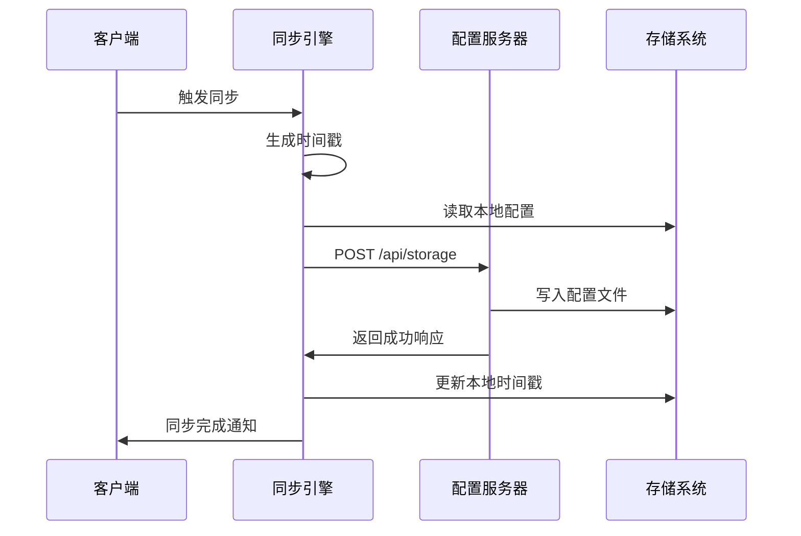
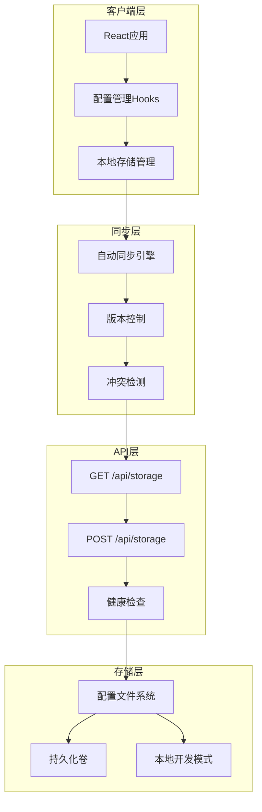
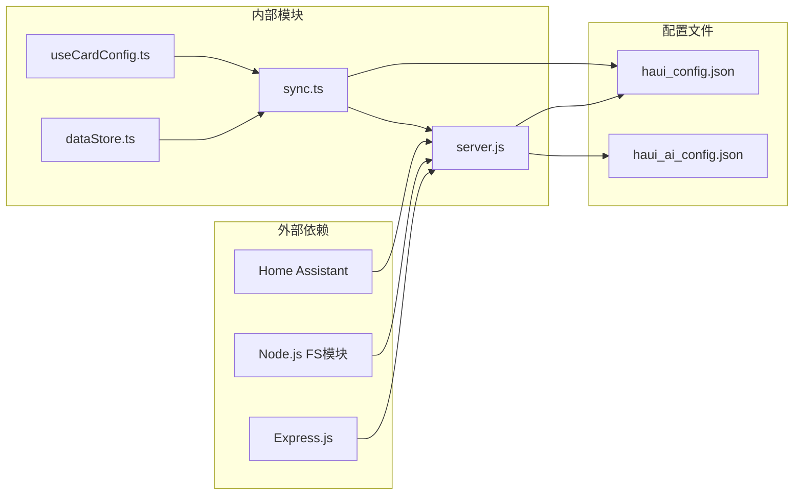

# 配置存储API

<cite>
**本文档引用的文件**
- [server.js](file://addon/server.js)
- [sync.ts](file://src/utils/sync.ts)
- [dataStore.ts](file://src/store/dataStore.ts)
- [useCardConfig.ts](file://src/hooks/useCardConfig.ts)
- [config.yaml](file://addon/config.yaml)
- [home-assistant.ts](file://src/types/home-assistant.ts)
</cite>

## 目录
1. [简介](#简介)
2. [项目结构](#项目结构)
3. [核心组件](#核心组件)
4. [架构概览](#架构概览)
5. [详细组件分析](#详细组件分析)
6. [依赖关系分析](#依赖关系分析)
7. [性能考虑](#性能考虑)
8. [故障排除指南](#故障排除指南)
9. [结论](#结论)

## 简介

配置存储API是HAUI Dashboard系统的核心组件，负责管理用户界面配置、设备状态和系统设置的持久化存储。该API提供了RESTful接口，支持配置文件的读取、写入和同步机制，确保用户在不同设备间能够无缝访问和同步个人化设置。

系统采用双层存储架构：前端使用浏览器localStorage进行本地存储，后端使用Express.js提供REST API进行配置管理。配置文件采用JSON格式存储，支持版本控制和冲突检测机制。

## 项目结构

```mermaid
graph TB
subgraph "前端应用"
A[dataStore.ts] --> B[sync.ts]
B --> C[localStorage]
D[useCardConfig.ts] --> C
end
subgraph "后端服务"
E[server.js] --> F[配置文件]
F --> G[/data/haui_config.json]
F --> H[.data/haui_config.json]
end
subgraph "存储介质"
I[HA Supervisor持久化卷]
J[本地开发目录]
end
G --> I
H --> J
C --> E
E --> C
```

**图表来源**
- [server.js:10-33](file://addon/server.js#L10-L33)
- [dataStore.ts:104-127](file://src/store/dataStore.ts#L104-L127)

**章节来源**
- [server.js:1-521](file://addon/server.js#L1-L521)
- [sync.ts:1-161](file://src/utils/sync.ts#L1-L161)
- [dataStore.ts:1-129](file://src/store/dataStore.ts#L1-L129)

## 核心组件

### 配置文件存储机制

系统实现了智能的配置文件存储策略，根据运行环境自动选择存储位置：

**生产环境存储路径**：`/data/haui_config.json`
- 由HA Supervisor管理的持久化卷
- 确保容器重启后配置不丢失
- 支持多实例部署的一致性

**开发环境存储路径**：`.data/haui_config.json`
- 本地开发时的回退方案
- 避免权限问题影响开发流程

**章节来源**
- [server.js:10-33](file://addon/server.js#L10-L33)

### 版本控制与同步机制

系统采用时间戳驱动的版本控制系统，确保配置同步的准确性和一致性：



**图表来源**
- [sync.ts:52-93](file://src/utils/sync.ts#L52-L93)
- [server.js:110-120](file://addon/server.js#L110-L120)

**章节来源**
- [sync.ts:46-93](file://src/utils/sync.ts#L46-L93)
- [server.js:98-120](file://addon/server.js#L98-L120)

## 架构概览

配置存储API采用分层架构设计，确保系统的可扩展性和可靠性：



**图表来源**
- [dataStore.ts:58-127](file://src/store/dataStore.ts#L58-L127)
- [sync.ts:136-161](file://src/utils/sync.ts#L136-L161)
- [server.js:96-120](file://addon/server.js#L96-L120)

## 详细组件分析

### 后端API实现

#### GET /api/storage - 配置读取接口

该接口负责从服务器读取当前的配置状态：

**核心功能**：
- 自动检测并创建配置文件
- 读取JSON格式的配置数据
- 返回标准的HTTP响应格式

**错误处理**：
- 文件不存在时返回500状态码
- 解析失败时记录详细错误信息
- 提供友好的错误消息格式

**章节来源**
- [server.js:98-108](file://addon/server.js#L98-L108)

#### POST /api/storage - 配置写入接口

该接口处理客户端提交的配置更新请求：

**核心功能**：
- 验证请求体格式
- 写入配置文件到持久化存储
- 返回操作结果状态

**数据验证**：
- 支持原始JSON字符串和对象格式
- 自动转换数据格式
- 错误捕获和处理机制

**章节来源**
- [server.js:110-120](file://addon/server.js#L110-L120)

### 前端同步机制

#### 自动同步引擎

系统实现了智能的自动同步机制，确保配置在多个设备间的实时同步：

**同步策略**：
- 30秒间隔的定期同步
- 页面焦点变化时的即时同步
- 手动触发的同步操作

**防抖机制**：
- 1秒延迟的防抖处理
- 避免频繁同步导致的性能问题
- 合并多次快速修改

**章节来源**
- [sync.ts:136-161](file://src/utils/sync.ts#L136-L161)
- [sync.ts:44-93](file://src/utils/sync.ts#L44-L93)

#### 版本控制机制

系统采用时间戳驱动的版本控制系统：

**版本标识**：`haui_last_sync_ts`
- 记录最后一次同步的时间戳
- 支持双向版本比较
- 防止配置覆盖和丢失

**同步算法**：
- 远程版本优先于本地版本
- 强制同步模式支持
- 增量同步优化

**章节来源**
- [sync.ts:46-131](file://src/utils/sync.ts#L46-L131)

### 数据存储模型

#### 配置文件格式

配置文件采用JSON格式存储，支持任意层级的数据结构：

**基本结构**：
```json
{
  "haui_last_sync_ts": "1700000000000",
  "card_config_device_1": "{...}",
  "ha_devices": "[...]",
  "ha_rooms": "[...]"
}
```

**数据类型支持**：
- 字符串类型的配置值
- JSON序列化的复杂对象
- 数组和嵌套对象结构

**章节来源**
- [sync.ts:62-72](file://src/utils/sync.ts#L62-L72)
- [dataStore.ts:108-117](file://src/store/dataStore.ts#L108-L117)

#### 配置键命名规范

系统采用统一的配置键命名约定：

**设备配置**：`card_config_{cardId}`
- 存储卡片配置信息
- 支持动态卡片配置
- 自动序列化和反序列化

**持久化数据**：`ha_*` 前缀
- 设备列表配置
- 房间布局信息
- 用户偏好设置

**章节来源**
- [useCardConfig.ts:13-28](file://src/hooks/useCardConfig.ts#L13-L28)
- [dataStore.ts:49-56](file://src/store/dataStore.ts#L49-L56)

## 依赖关系分析



**图表来源**
- [server.js:1-7](file://addon/server.js#L1-L7)
- [sync.ts:1-41](file://src/utils/sync.ts#L1-L41)
- [dataStore.ts:1-8](file://src/store/dataStore.ts#L1-L8)

### 组件耦合度分析

系统设计遵循低耦合原则，各组件职责明确：

**高内聚组件**：
- `server.js`：专注于配置文件的读写操作
- `sync.ts`：负责同步逻辑和版本控制
- `dataStore.ts`：管理应用状态和持久化

**松耦合设计**：
- 前后端通过REST API通信
- 配置文件格式标准化
- 版本控制机制独立于业务逻辑

**章节来源**
- [server.js:96-120](file://addon/server.js#L96-L120)
- [sync.ts:136-161](file://src/utils/sync.ts#L136-L161)
- [dataStore.ts:58-127](file://src/store/dataStore.ts#L58-L127)

## 性能考虑

### 同步性能优化

系统实现了多项性能优化措施：

**防抖机制**：
- 1秒延迟避免频繁同步
- 合并多次快速修改操作
- 减少服务器负载

**异步处理**：
- 非阻塞的文件I/O操作
- Promise链式调用优化
- 超时控制机制

**内存管理**：
- 限制localStorage存储大小
- 智能清理过期配置
- 增量更新策略

### 存储性能优化

**文件系统优化**：
- 批量写入减少磁盘I/O
- 原子性写入确保数据完整性
- 缓存机制提升读取速度

**网络优化**：
- 连接复用减少握手开销
- 压缩传输减少带宽占用
- 超时重试机制提升可靠性

## 故障排除指南

### 常见问题诊断

**配置无法同步**：
1. 检查网络连接状态
2. 验证服务器端点可达性
3. 查看浏览器控制台错误信息

**配置丢失问题**：
1. 确认持久化卷挂载正常
2. 检查文件权限设置
3. 验证磁盘空间充足

**版本冲突处理**：
1. 检查本地和远程版本差异
2. 分析同步时间戳
3. 手动备份重要配置

### 错误恢复机制

系统提供了多层次的错误恢复能力：

**自动重试**：
- 网络异常时自动重试
- 指数退避策略避免雪崩效应
- 最大重试次数限制

**数据恢复**：
- 自动备份机制
- 版本回滚功能
- 手动恢复选项

**章节来源**
- [server.js:104-107](file://addon/server.js#L104-L107)
- [sync.ts:89-92](file://src/utils/sync.ts#L89-L92)

## 结论

配置存储API为HAUI Dashboard提供了可靠、高效的配置管理解决方案。通过智能的同步机制、完善的错误处理和性能优化，系统能够在复杂的Home Assistant环境中稳定运行。

**主要优势**：
- 双层存储架构确保数据安全
- 智能同步机制提升用户体验
- 标准化的API接口便于集成
- 完善的错误处理和恢复机制

**未来改进方向**：
- 增强配置加密功能
- 优化大数据量场景下的性能
- 扩展配置模板和导入导出功能
- 加强配置审计和变更追踪

该系统为Home Assistant用户提供了无缝的配置管理体验，是构建现代化智能家居控制面板的重要基础设施。