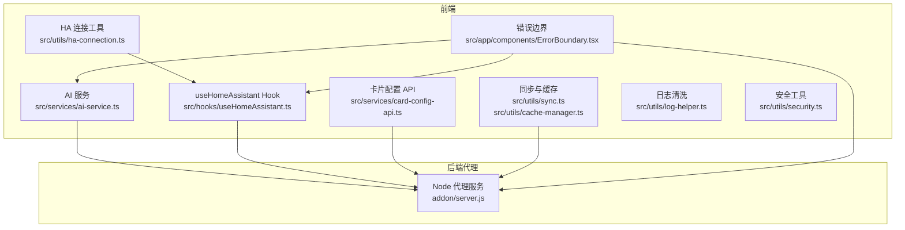
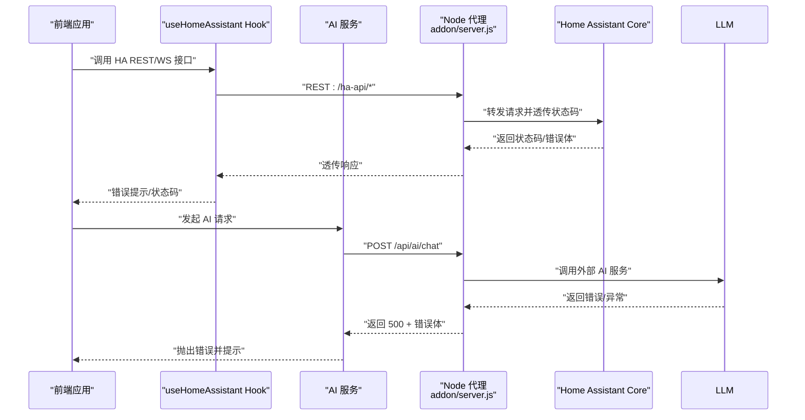
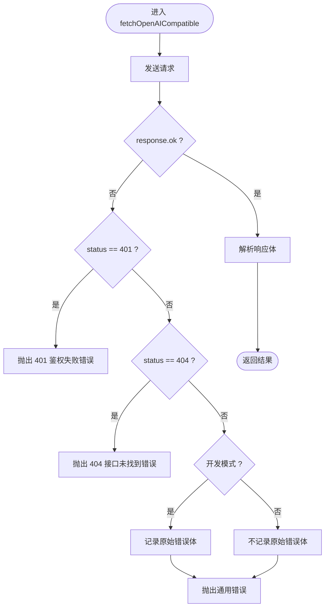
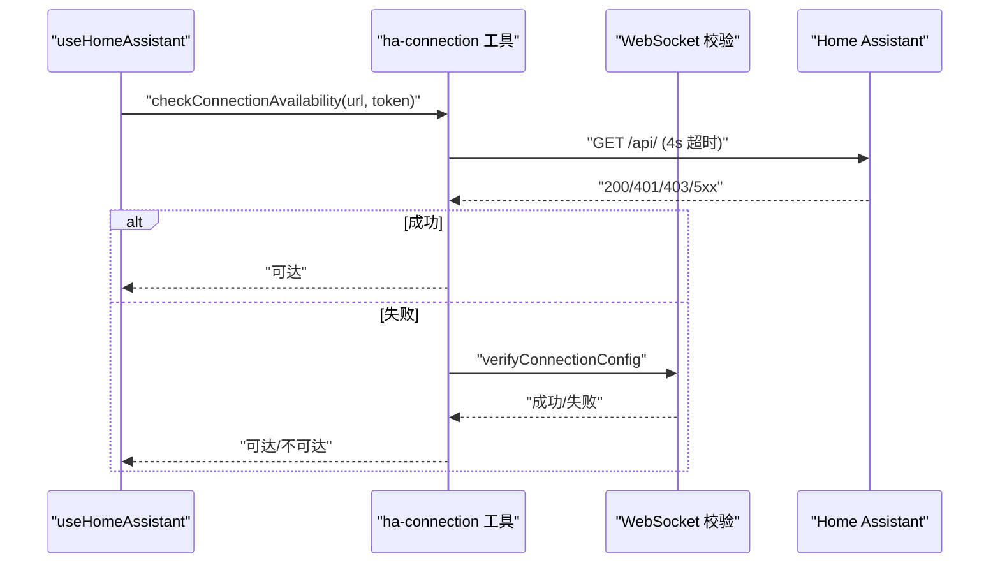
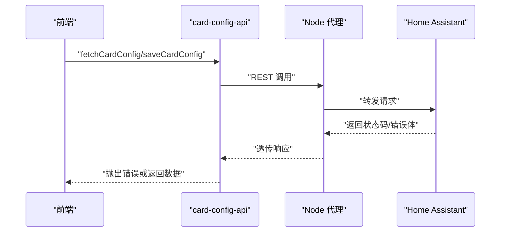
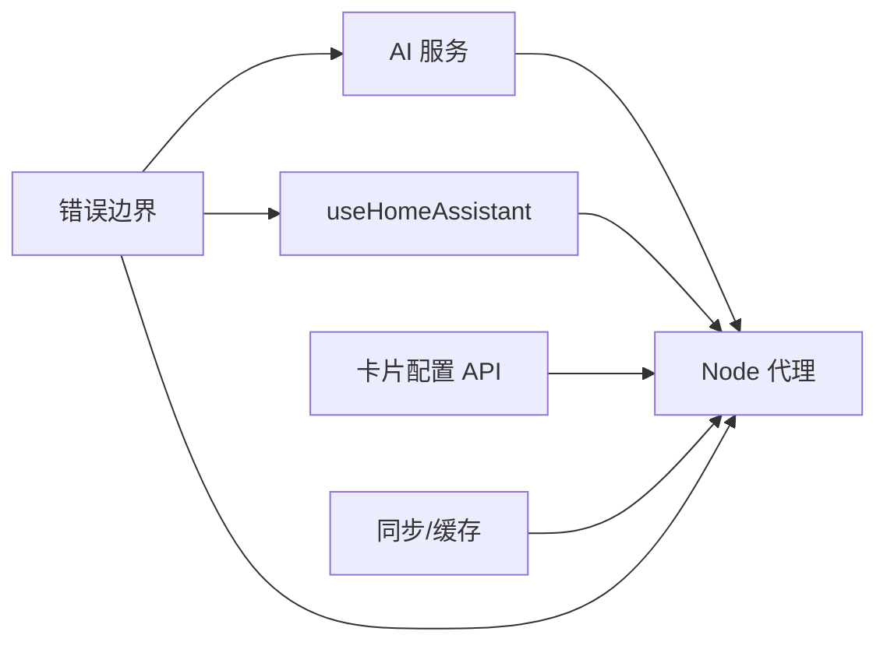

# 错误处理和状态码

<cite>
**本文引用的文件**
- [src/services/ai-service.ts](file://src/services/ai-service.ts)
- [addon/server.js](file://addon/server.js)
- [src/utils/ha-connection.ts](file://src/utils/ha-connection.ts)
- [src/hooks/useHomeAssistant.ts](file://src/hooks/useHomeAssistant.ts)
- [src/services/card-config-api.ts](file://src/services/card-config-api.ts)
- [src/utils/sync.ts](file://src/utils/sync.ts)
- [src/app/components/ErrorBoundary.tsx](file://src/app/components/ErrorBoundary.tsx)
- [src/utils/log-helper.ts](file://src/utils/log-helper.ts)
- [src/utils/cache-manager.ts](file://src/utils/cache-manager.ts)
- [src/utils/security.ts](file://src/utils/security.ts)
</cite>

## 目录
1. [简介](#简介)
2. [项目结构](#项目结构)
3. [核心组件](#核心组件)
4. [架构总览](#架构总览)
5. [详细组件分析](#详细组件分析)
6. [依赖关系分析](#依赖关系分析)
7. [性能考量](#性能考量)
8. [故障排查指南](#故障排查指南)
9. [结论](#结论)
10. [附录](#附录)

## 简介
本文件系统性梳理 HAUI 的 API 错误处理与状态码规范，覆盖以下方面：
- 所有对外暴露的 API 端点可能返回的 HTTP 状态码与错误响应格式
- 错误类型定义：认证失败、参数验证错误、服务调用异常、网络连接问题
- 错误日志记录策略与安全脱敏
- 错误恢复策略与用户体验优化
- 错误诊断工具与常见问题排查清单

## 项目结构
围绕错误处理与状态码的关键模块分布如下：
- 前端服务层：AI 服务、Home Assistant 连接与订阅、卡片配置 API、同步与缓存、表单校验辅助
- 后端代理层：Node.js 代理服务器，统一转发 HA Core API、AI 聊天、萤石云代理、健康检查与配置读写
- 异常边界与日志：全局错误边界、日志清洗、缓存管理、安全工具

图表来源
- [src/services/ai-service.ts:114-158](file://src/services/ai-service.ts#L114-L158)
- [src/utils/ha-connection.ts:240-316](file://src/utils/ha-connection.ts#L240-L316)
- [src/hooks/useHomeAssistant.ts:61-120](file://src/hooks/useHomeAssistant.ts#L61-L120)
- [src/services/card-config-api.ts:3-30](file://src/services/card-config-api.ts#L3-L30)
- [src/utils/sync.ts:29-41](file://src/utils/sync.ts#L29-L41)
- [src/app/components/ErrorBoundary.tsx:12-50](file://src/app/components/ErrorBoundary.tsx#L12-L50)
- [addon/server.js:56-94](file://addon/server.js#L56-L94)

章节来源
- [src/services/ai-service.ts:114-158](file://src/services/ai-service.ts#L114-L158)
- [addon/server.js:56-94](file://addon/server.js#L56-L94)
- [src/utils/ha-connection.ts:240-316](file://src/utils/ha-connection.ts#L240-L316)
- [src/hooks/useHomeAssistant.ts:61-120](file://src/hooks/useHomeAssistant.ts#L61-L120)
- [src/services/card-config-api.ts:3-30](file://src/services/card-config-api.ts#L3-L30)
- [src/utils/sync.ts:29-41](file://src/utils/sync.ts#L29-L41)
- [src/app/components/ErrorBoundary.tsx:12-50](file://src/app/components/ErrorBoundary.tsx#L12-L50)
- [src/utils/log-helper.ts:1-32](file://src/utils/log-helper.ts#L1-L32)
- [src/utils/cache-manager.ts:1-57](file://src/utils/cache-manager.ts#L1-L57)
- [src/utils/security.ts:1-27](file://src/utils/security.ts#L1-L27)

## 核心组件
- AI 服务与错误处理：封装 OpenAI 兼容请求，针对 401/404 等状态进行用户友好提示与安全脱敏，捕获网络错误并区分 TypeError。
- Home Assistant 连接与可用性检查：提供连接建立、可用性探测、WebSocket 回退校验，区分网络错误与鉴权错误。
- useHomeAssistant Hook：负责连接生命周期、心跳与延迟测量、实体订阅、事件订阅、注册表获取与错误状态上报。
- 卡片配置 API：封装 REST 调用，统一处理非 OK 状态并抛出错误。
- 后端代理：统一转发 HA Core API、AI 聊天、萤石云代理、健康检查与配置读写，按场景返回标准状态码与错误体。
- 同步与缓存：带超时的 fetch、防抖同步、TTL 缓存、增量对齐与事件通知。
- 错误边界：捕获未处理异常，记录错误并提供“清缓存并刷新”入口。
- 日志清洗与安全：日志消息清洗、令牌加解密与脱敏。

章节来源
- [src/services/ai-service.ts:114-158](file://src/services/ai-service.ts#L114-L158)
- [src/utils/ha-connection.ts:240-316](file://src/utils/ha-connection.ts#L240-L316)
- [src/hooks/useHomeAssistant.ts:61-120](file://src/hooks/useHomeAssistant.ts#L61-L120)
- [src/services/card-config-api.ts:3-30](file://src/services/card-config-api.ts#L3-L30)
- [addon/server.js:56-94](file://addon/server.js#L56-L94)
- [src/utils/sync.ts:29-41](file://src/utils/sync.ts#L29-L41)
- [src/app/components/ErrorBoundary.tsx:12-50](file://src/app/components/ErrorBoundary.tsx#L12-L50)
- [src/utils/log-helper.ts:1-32](file://src/utils/log-helper.ts#L1-L32)
- [src/utils/cache-manager.ts:1-57](file://src/utils/cache-manager.ts#L1-L57)
- [src/utils/security.ts:1-27](file://src/utils/security.ts#L1-L27)

## 架构总览
下面的序列图展示典型错误处理流程：前端发起请求 → 后端代理转发/业务处理 → 返回状态码与错误体 → 前端错误边界与用户提示。

图表来源
- [src/hooks/useHomeAssistant.ts:250-293](file://src/hooks/useHomeAssistant.ts#L250-L293)
- [addon/server.js:56-94](file://addon/server.js#L56-L94)
- [src/services/ai-service.ts:114-158](file://src/services/ai-service.ts#L114-L158)

## 详细组件分析

### AI 服务错误处理与状态码
- 行为要点
  - 对非 OK 响应进行状态码分支处理，401 提示鉴权失败，404 提示接口不存在，其余统一提示“API 请求失败 + 状态码”
  - 开发模式下记录原始错误体，生产环境不暴露原始错误体
  - 捕获网络错误（TypeError）并提示“网络请求失败：请检查网络连接或 Base URL”
  - 对 API Key 进行 ASCII 字符过滤与脱敏日志输出
- 错误类型与状态码
  - 401：鉴权失败（API Key 错误或过期）
  - 404：接口未找到（Base URL 或模型名错误）
  - 其他 4xx/5xx：统一提示“API 请求失败 + 状态码”，具体原因在开发模式下记录
- 用户体验
  - 针对常见错误给出明确指引（如检查 API Key/Base URL/模型名）
  - 网络错误提示引导检查网络连通性

图表来源
- [src/services/ai-service.ts:114-158](file://src/services/ai-service.ts#L114-L158)

章节来源
- [src/services/ai-service.ts:114-158](file://src/services/ai-service.ts#L114-L158)

### Home Assistant 连接与可用性检查
- 行为要点
  - 可用性检查：HTTP GET /api/（带可选 Authorization），4 秒超时；若失败尝试 WebSocket 回退校验
  - 连接建立：长链接令牌认证，区分 ERR_CANNOT_CONNECT 与 ERR_INVALID_AUTH 并抛出用户可理解的错误
  - Hook 生命周期：心跳与延迟测量、实体订阅、事件订阅、注册表获取、断线重连与错误状态上报
- 错误类型与状态码
  - 网络错误/超时：视为“不可达”，不暴露底层细节
  - 401/403：视为“可达但鉴权失败”，用于区分“服务器可达 vs 鉴权失败”
  - WebSocket 回退失败：记录警告并返回不可达
- 用户体验
  - 提供“最佳连接”选择（本地/公网），失败时给出明确提示
  - 断线自动重连与延迟指标帮助用户感知网络质量

图表来源
- [src/utils/ha-connection.ts:240-316](file://src/utils/ha-connection.ts#L240-L316)
- [src/hooks/useHomeAssistant.ts:61-120](file://src/hooks/useHomeAssistant.ts#L61-L120)

章节来源
- [src/utils/ha-connection.ts:240-316](file://src/utils/ha-connection.ts#L240-L316)
- [src/hooks/useHomeAssistant.ts:61-120](file://src/hooks/useHomeAssistant.ts#L61-L120)

### 卡片配置 API 错误处理
- 行为要点
  - 读取与保存卡片配置均通过 REST 接口完成，非 OK 状态统一抛出错误
  - 读取失败时包含状态码信息，便于前端定位问题
- 错误类型与状态码
  - 401：未授权（Token 缺失或无效）
  - 400：参数错误（如缺少必要字段）
  - 500：服务端异常（读写失败、解析异常）

图表来源
- [src/services/card-config-api.ts:3-30](file://src/services/card-config-api.ts#L3-L30)
- [addon/server.js:56-94](file://addon/server.js#L56-L94)

章节来源
- [src/services/card-config-api.ts:3-30](file://src/services/card-config-api.ts#L3-L30)

### 后端代理错误处理与状态码规范
- /ha-api/* 代理
  - 透传 HA Core 的状态码与响应体；转发失败返回 502 + 错误体
- /api/storage
  - GET：读取配置；失败返回 500 + 错误体
  - POST：保存配置；失败返回 500 + 错误体
- /api/ezviz/url 与 /api/ezviz/token
  - 参数缺失返回 400；第三方接口异常返回 500 + 错误体
- /api/camera/ptz
  - 缺少授权返回 401；HA 服务调用失败返回 500 + 错误体
- /api/health
  - 健康检查返回 200 + 响应体
- /api/ai/config
  - GET/POST：读取/保存 AI 配置；失败返回 500 + 错误体
- /api/ai/chat
  - 缺少 API Key 返回 400；外部 LLM 失败返回 500 + 错误体；SSE 写入异常时回退发送 JSON 错误事件

章节来源
- [addon/server.js:56-94](file://addon/server.js#L56-L94)
- [addon/server.js:96-120](file://addon/server.js#L96-L120)
- [addon/server.js:122-196](file://addon/server.js#L122-L196)
- [addon/server.js:229-286](file://addon/server.js#L229-L286)
- [addon/server.js:288-291](file://addon/server.js#L288-L291)
- [addon/server.js:293-313](file://addon/server.js#L293-L313)
- [addon/server.js:422-503](file://addon/server.js#L422-L503)

### 同步与缓存错误处理
- 带超时的 fetch：统一使用 AbortController 控制超时，避免长时间阻塞
- 防抖同步：本地变更后 1 秒内去抖，失败静默处理，不影响主流程
- TTL 缓存：严格过期策略，异常时回退为空值
- 自动同步：每 30 秒心跳对齐，页面聚焦时对齐，失败记录警告

章节来源
- [src/utils/sync.ts:29-41](file://src/utils/sync.ts#L29-L41)
- [src/utils/sync.ts:52-93](file://src/utils/sync.ts#L52-L93)
- [src/utils/sync.ts:98-131](file://src/utils/sync.ts#L98-L131)
- [src/utils/cache-manager.ts:1-57](file://src/utils/cache-manager.ts#L1-L57)

### 全局错误边界与日志
- ErrorBoundary：捕获未处理异常，记录错误并提供“清缓存并刷新”按钮
- 日志清洗：数字保留两位小数、常用英文词翻译为中文，提升可读性
- 安全工具：令牌 Base64 混淆与解密，兼容旧版 AES 特征并回退

章节来源
- [src/app/components/ErrorBoundary.tsx:12-50](file://src/app/components/ErrorBoundary.tsx#L12-L50)
- [src/utils/log-helper.ts:1-32](file://src/utils/log-helper.ts#L1-L32)
- [src/utils/security.ts:1-27](file://src/utils/security.ts#L1-L27)

## 依赖关系分析
- 前端错误处理链路
  - AI 服务依赖后端代理；HA 连接工具与 Hook 共同构成连接层；卡片配置 API 依赖代理；同步与缓存为横切关注点；错误边界贯穿各模块
- 后端代理职责
  - 统一入口、鉴权透传、错误收敛、SSE 流式响应与工具调用批处理
- 耦合与内聚
  - 前端模块内聚度高，错误处理集中在各自模块；后端代理集中处理跨域、鉴权与错误收敛，降低前端复杂度

图表来源
- [src/services/ai-service.ts:114-158](file://src/services/ai-service.ts#L114-L158)
- [src/hooks/useHomeAssistant.ts:61-120](file://src/hooks/useHomeAssistant.ts#L61-L120)
- [src/services/card-config-api.ts:3-30](file://src/services/card-config-api.ts#L3-L30)
- [src/utils/sync.ts:29-41](file://src/utils/sync.ts#L29-L41)
- [src/app/components/ErrorBoundary.tsx:12-50](file://src/app/components/ErrorBoundary.tsx#L12-L50)
- [addon/server.js:56-94](file://addon/server.js#L56-L94)

## 性能考量
- 超时控制：统一使用 AbortController 控制超时，避免长时间阻塞
- 去抖与节流：配置同步采用 1 秒去抖，减少频繁写入
- TTL 缓存：30 分钟过期，兼顾新鲜度与性能
- 心跳与延迟：每 10 秒心跳检测，帮助评估网络质量
- SSE 流式响应：后端按块推送增量内容，前端实时渲染，降低首屏等待

## 故障排查指南
- 认证失败（401）
  - AI 服务：检查 API Key 是否正确、Base URL 与模型名是否匹配；开发模式下查看脱敏 Key 日志
  - HA 代理：确认 Authorization 头是否透传；检查 Supervisor Token 配置
  - 卡片配置：确认 Token 是否有效
- 参数验证错误（400）
  - 萤石云代理：确认 AppKey/AppSecret/设备序列号等参数齐全
  - 卡片配置：确认请求体结构与必填字段
- 服务调用异常（500）
  - HA 代理：查看后端错误日志，确认转发目标与鉴权头
  - AI 聊天：检查外部 LLM 返回体与工具调用白名单
- 网络连接问题
  - HA 连接：使用可用性检查与 WebSocket 回退；确认本地/公网 URL 与防火墙
  - 同步：检查超时与去抖策略；观察心跳与延迟指标
- 用户体验优化
  - 错误边界：提供“清缓存并刷新”快速恢复
  - 日志清洗：提升日志可读性，便于自助排查

章节来源
- [src/services/ai-service.ts:114-158](file://src/services/ai-service.ts#L114-L158)
- [addon/server.js:56-94](file://addon/server.js#L56-L94)
- [src/utils/ha-connection.ts:240-316](file://src/utils/ha-connection.ts#L240-L316)
- [src/hooks/useHomeAssistant.ts:61-120](file://src/hooks/useHomeAssistant.ts#L61-L120)
- [src/services/card-config-api.ts:3-30](file://src/services/card-config-api.ts#L3-L30)
- [src/app/components/ErrorBoundary.tsx:12-50](file://src/app/components/ErrorBoundary.tsx#L12-L50)
- [src/utils/log-helper.ts:1-32](file://src/utils/log-helper.ts#L1-L32)

## 结论
本规范明确了 HAUI 前后端的错误处理与状态码策略：前端模块内聚、后端代理统一收敛、错误边界兜底、日志清洗与安全脱敏贯穿始终。通过清晰的错误类型、状态码与用户提示，配合可用性检查、心跳与延迟监控，能够显著提升系统的可观测性与用户体验。

## 附录
- 常用状态码速查
  - 200：成功
  - 400：参数错误/缺少必要参数
  - 401：未授权/鉴权失败
  - 404：接口不存在
  - 500：服务端内部错误
  - 502：上游代理转发失败
- 建议的错误响应格式
  - JSON：{ "error": "错误描述" }（如适用，包含可选字段如 code、details）
  - SSE：type 为 error 时，内容为 { "type":"error","content":"错误描述" }