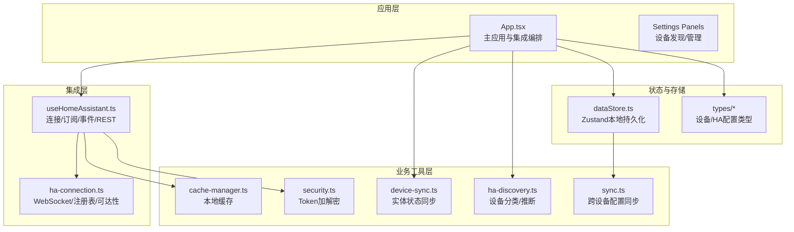
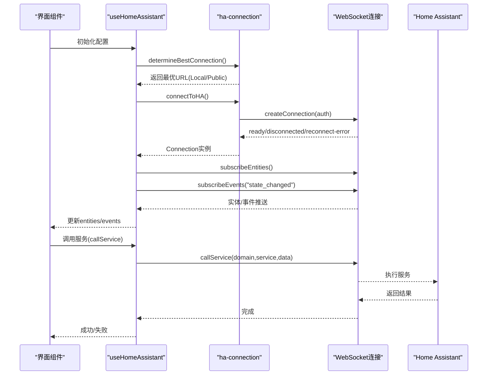
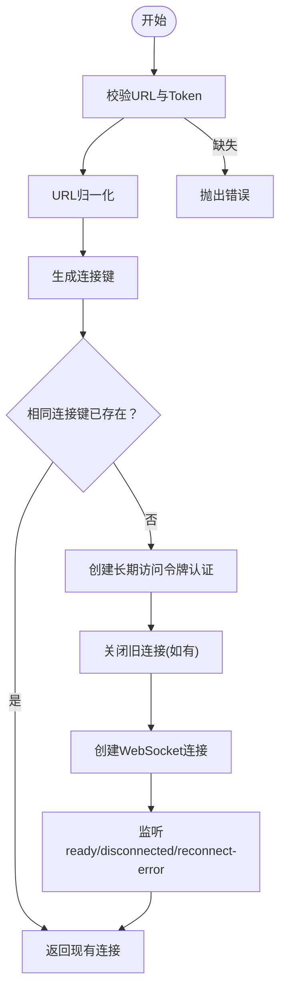
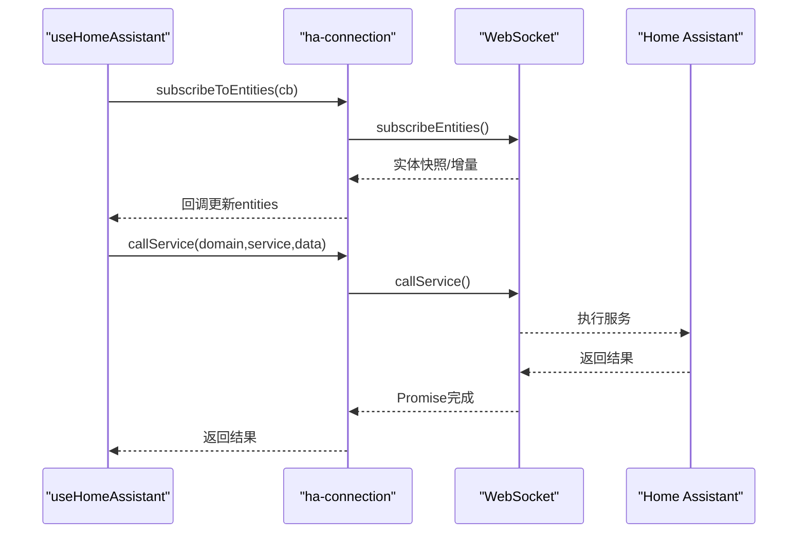
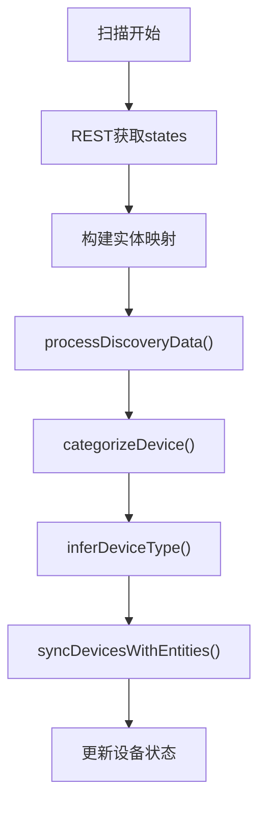
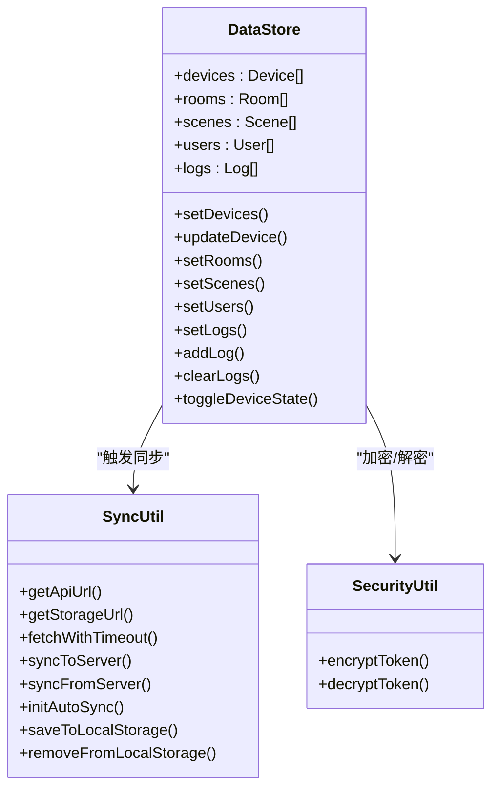
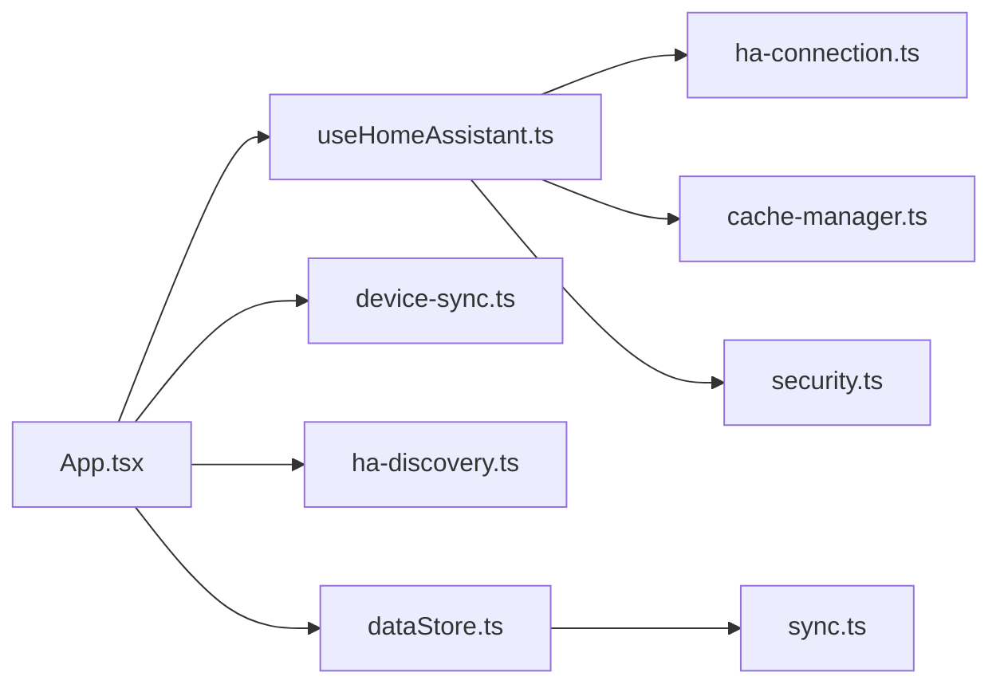

# Home Assistant集成

<cite>
**本文引用的文件**
- [src/utils/ha-connection.ts](file://src/utils/ha-connection.ts)
- [src/hooks/useHomeAssistant.ts](file://src/hooks/useHomeAssistant.ts)
- [src/utils/device-sync.ts](file://src/utils/device-sync.ts)
- [src/utils/ha-discovery.ts](file://src/utils/ha-discovery.ts)
- [src/app/App.tsx](file://src/app/App.tsx)
- [src/app/components/settings/DeviceDiscoveryPanel.tsx](file://src/app/components/settings/DeviceDiscoveryPanel.tsx)
- [src/utils/sync.ts](file://src/utils/sync.ts)
- [src/store/dataStore.ts](file://src/store/dataStore.ts)
- [src/utils/security.ts](file://src/utils/security.ts)
- [src/utils/cache-manager.ts](file://src/utils/cache-manager.ts)
- [src/types/home-assistant.ts](file://src/types/home-assistant.ts)
- [src/types/device.ts](file://src/types/device.ts)
- [package.json](file://package.json)
- [README.md](file://README.md)
</cite>

## 目录
1. [简介](#简介)
2. [项目结构](#项目结构)
3. [核心组件](#核心组件)
4. [架构总览](#架构总览)
5. [详细组件分析](#详细组件分析)
6. [依赖关系分析](#依赖关系分析)
7. [性能考量](#性能考量)
8. [故障排除指南](#故障排除指南)
9. [结论](#结论)
10. [附录](#附录)

## 简介
本文件面向Home Assistant生态系统的集成开发者，系统化阐述本项目的WebSocket连接管理、实体状态同步与REST API调用机制；深入解析Home Assistant实体模型、服务调用协议与事件监听机制；梳理设备发现、配置导入与状态更新的自动化流程；总结双向数据交换、错误处理与连接恢复策略；并提供安全认证、权限管理与性能优化的最佳实践与故障排除指南。

## 项目结构
本项目采用React 18 + Vite构建，核心集成逻辑集中在工具层与Hook层，通过Zustand状态管理持久化本地配置与设备状态，配合Web Worker与缓存策略提升性能与稳定性。

**图表来源**
- [src/app/App.tsx:1-120](file://src/app/App.tsx#L1-L120)
- [src/hooks/useHomeAssistant.ts:1-60](file://src/hooks/useHomeAssistant.ts#L1-L60)
- [src/utils/ha-connection.ts:1-60](file://src/utils/ha-connection.ts#L1-L60)
- [src/utils/device-sync.ts:1-40](file://src/utils/device-sync.ts#L1-L40)
- [src/utils/ha-discovery.ts:1-40](file://src/utils/ha-discovery.ts#L1-L40)
- [src/store/dataStore.ts:1-40](file://src/store/dataStore.ts#L1-L40)
- [src/utils/cache-manager.ts:1-20](file://src/utils/cache-manager.ts#L1-L20)
- [src/utils/security.ts:1-20](file://src/utils/security.ts#L1-L20)
- [src/utils/sync.ts:1-40](file://src/utils/sync.ts#L1-L40)

**章节来源**
- [README.md:1-84](file://README.md#L1-L84)
- [package.json:1-132](file://package.json#L1-L132)

## 核心组件
- WebSocket连接与认证
  - 使用长期访问令牌进行认证，支持URL归一化与连接键复用，避免重复连接。
  - 提供一次性连接与持久连接两种模式，用于不同场景下的资源管理。
- 实体订阅与事件监听
  - 订阅实体状态变更与事件流，支持心跳检测与延迟计算。
- REST API调用
  - 优先使用WebSocket，失败时回退到REST API；支持代理路径与Ingress场景。
- 设备状态同步
  - 基于映射表将Home Assistant实体状态同步到本地设备模型，覆盖灯光、开关、窗帘、传感器、空调等多种类型。
- 设备发现与分类
  - 结合区域、设备与实体注册表，推断房间归属与设备类别，支持自动分类与类型推断。
- 配置与安全
  - Token本地加密存储，支持跨设备配置同步与持久化；提供缓存管理与心跳对齐。
- 自动化流程
  - 首次连接后自动扫描实体、初始化配置同步、持续事件日志记录与状态同步。

**章节来源**
- [src/utils/ha-connection.ts:47-147](file://src/utils/ha-connection.ts#L47-L147)
- [src/hooks/useHomeAssistant.ts:23-210](file://src/hooks/useHomeAssistant.ts#L23-L210)
- [src/utils/device-sync.ts:4-191](file://src/utils/device-sync.ts#L4-L191)
- [src/utils/ha-discovery.ts:18-167](file://src/utils/ha-discovery.ts#L18-L167)
- [src/utils/sync.ts:52-161](file://src/utils/sync.ts#L52-L161)
- [src/utils/security.ts:1-27](file://src/utils/security.ts#L1-L27)
- [src/utils/cache-manager.ts:1-57](file://src/utils/cache-manager.ts#L1-L57)

## 架构总览
本系统围绕useHomeAssistant Hook构建，统一管理连接生命周期、实体订阅、事件监听与REST回退；通过device-sync与ha-discovery实现双向状态同步与设备推断；借助Zustand持久化本地状态与配置，结合Web Worker与缓存策略优化性能。

**图表来源**
- [src/hooks/useHomeAssistant.ts:61-210](file://src/hooks/useHomeAssistant.ts#L61-L210)
- [src/utils/ha-connection.ts:47-147](file://src/utils/ha-connection.ts#L47-L147)

## 详细组件分析

### WebSocket连接管理与可达性检测
- URL归一化与连接键
  - 归一化输入URL，去除多余斜杠与API路径，生成连接键以避免重复连接。
- 可达性检测
  - 并行检测本地与公网URL，使用HTTP GET与WebSocket双重验证，确保在CORS限制下仍可判断可达性。
- 连接与事件
  - 监听ready/disconnected/reconnect-error事件，维护连接状态与错误信息。
- 一次性连接
  - 为短任务提供一次性连接能力，避免资源泄漏。

**图表来源**
- [src/utils/ha-connection.ts:47-105](file://src/utils/ha-connection.ts#L47-L105)

**章节来源**
- [src/utils/ha-connection.ts:24-105](file://src/utils/ha-connection.ts#L24-L105)

### 实体状态同步与服务调用
- 实体订阅
  - 订阅实体状态变更，回调中更新本地entities状态。
- 服务调用
  - 封装callService，支持domain/service/serviceData参数，统一错误处理。
- REST回退
  - WebSocket失败时回退到REST API，支持代理路径与Ingress场景。
- 事件监听
  - 订阅state_changed事件，记录最近事件列表，驱动日志与联动。

**图表来源**
- [src/hooks/useHomeAssistant.ts:150-180](file://src/hooks/useHomeAssistant.ts#L150-L180)
- [src/utils/ha-connection.ts:125-139](file://src/utils/ha-connection.ts#L125-L139)

**章节来源**
- [src/hooks/useHomeAssistant.ts:150-293](file://src/hooks/useHomeAssistant.ts#L150-L293)
- [src/utils/ha-connection.ts:125-139](file://src/utils/ha-connection.ts#L125-L139)

### 设备发现、分类与状态同步
- 发现流程
  - 通过REST获取实体列表，结合区域、设备与实体注册表推断房间与设备属性。
- 分类与类型推断
  - 基于domain与device_class进行分类，支持person/scene/security/hvac等类别。
- 状态同步
  - 根据映射表将实体状态同步到本地设备模型，覆盖灯光亮度/色温、窗帘位置、传感器数值、空调模式等。

**图表来源**
- [src/app/components/settings/DeviceDiscoveryPanel.tsx:86-121](file://src/app/components/settings/DeviceDiscoveryPanel.tsx#L86-L121)
- [src/utils/ha-discovery.ts:18-167](file://src/utils/ha-discovery.ts#L18-L167)
- [src/utils/device-sync.ts:4-191](file://src/utils/device-sync.ts#L4-L191)

**章节来源**
- [src/app/components/settings/DeviceDiscoveryPanel.tsx:86-174](file://src/app/components/settings/DeviceDiscoveryPanel.tsx#L86-L174)
- [src/utils/ha-discovery.ts:18-167](file://src/utils/ha-discovery.ts#L18-L167)
- [src/utils/device-sync.ts:4-191](file://src/utils/device-sync.ts#L4-L191)

### 配置导入、持久化与跨设备同步
- 配置存储
  - 使用Zustand持久化设备、房间、场景、用户与日志；支持localStorage存储与JSON序列化。
- Token安全
  - 本地加密存储Token，加载时解密；支持历史AES特征识别与回退。
- 跨设备同步
  - 通过/get_api/storage接口实现配置上传/下载，带超时与防抖；定时心跳与页面聚焦触发对齐。

**图表来源**
- [src/store/dataStore.ts:58-129](file://src/store/dataStore.ts#L58-L129)
- [src/utils/sync.ts:4-161](file://src/utils/sync.ts#L4-L161)
- [src/utils/security.ts:1-27](file://src/utils/security.ts#L1-L27)

**章节来源**
- [src/store/dataStore.ts:58-129](file://src/store/dataStore.ts#L58-L129)
- [src/utils/sync.ts:52-161](file://src/utils/sync.ts#L52-L161)
- [src/utils/security.ts:1-27](file://src/utils/security.ts#L1-L27)

### 错误处理与连接恢复策略
- 连接失败
  - 区分网络不可达与无效认证，提供明确错误信息。
- 断线重连
  - 监听disconnected事件，5秒后自动重试连接；同时尝试代理路径回退。
- REST回退
  - WebSocket失败时自动回退到REST API，保证功能可用性。
- 事件与日志
  - 订阅state_changed事件，记录最近事件列表，便于问题定位。

**章节来源**
- [src/utils/ha-connection.ts:84-104](file://src/utils/ha-connection.ts#L84-L104)
- [src/hooks/useHomeAssistant.ts:140-148](file://src/hooks/useHomeAssistant.ts#L140-L148)
- [src/hooks/useHomeAssistant.ts:267-293](file://src/hooks/useHomeAssistant.ts#L267-L293)

## 依赖关系分析
- 外部依赖
  - home-assistant-js-websocket：WebSocket连接、认证、实体订阅与服务调用。
  - zustand：状态管理与持久化。
  - react-router-dom：路由与页面切换。
- 内部模块耦合
  - App.tsx依赖useHomeAssistant与device-sync，形成主集成入口。
  - DeviceDiscoveryPanel依赖discoverDevicesFromStates与Web Worker，承担设备发现职责。
  - dataStore与sync.ts形成配置同步闭环。

**图表来源**
- [src/app/App.tsx:268-325](file://src/app/App.tsx#L268-L325)
- [src/hooks/useHomeAssistant.ts:1-20](file://src/hooks/useHomeAssistant.ts#L1-L20)
- [src/utils/ha-connection.ts:1-15](file://src/utils/ha-connection.ts#L1-L15)
- [src/utils/device-sync.ts:1-5](file://src/utils/device-sync.ts#L1-L5)
- [src/utils/ha-discovery.ts:1-5](file://src/utils/ha-discovery.ts#L1-L5)
- [src/store/dataStore.ts:1-10](file://src/store/dataStore.ts#L1-L10)
- [src/utils/sync.ts:1-10](file://src/utils/sync.ts#L1-L10)
- [src/utils/cache-manager.ts:1-10](file://src/utils/cache-manager.ts#L1-L10)
- [src/utils/security.ts:1-10](file://src/utils/security.ts#L1-L10)

**章节来源**
- [package.json:65-96](file://package.json#L65-L96)

## 性能考量
- 主线程优化
  - 图标搜索与房间推断在Web Worker中执行，避免阻塞UI。
  - 设备网格采用虚拟化渲染，减少DOM节点数量。
- 缓存策略
  - 本地缓存30分钟过期，支持严格过期与静默失效策略。
- 网络与连接
  - WebSocket优先，失败回退REST；并行可达性检测选择最优路径。
  - 心跳检测与延迟计算，辅助诊断网络质量。
- 存储与同步
  - 持久化只保存必要字段，减少存储压力；跨设备同步带防抖与版本控制。

**章节来源**
- [README.md:37-83](file://README.md#L37-L83)
- [src/utils/cache-manager.ts:6-57](file://src/utils/cache-manager.ts#L6-L57)
- [src/utils/sync.ts:29-93](file://src/utils/sync.ts#L29-L93)

## 故障排除指南
- 连接失败
  - 检查VITE_HA_URL与VITE_HA_TOKEN是否正确设置；确认URL归一化与可达性检测结果。
  - 若网络错误，尝试代理路径回退；若认证错误，重新生成长期访问令牌。
- 实体不显示或状态不同步
  - 确认实体未被禁用或隐藏；检查映射表与设备绑定状态。
  - 使用事件面板查看state_changed事件，核对实体ID与friendly_name。
- 服务调用无响应
  - 确认domain/service/serviceData格式正确；查看REST回退是否生效。
- 配置未同步
  - 检查/get_api/storage接口可用性与超时设置；确认版本戳与防抖逻辑。
- Token安全问题
  - 若检测到旧版AES特征，系统会回退为明文；建议重新输入并保存。

**章节来源**
- [src/utils/ha-connection.ts:51-104](file://src/utils/ha-connection.ts#L51-L104)
- [src/hooks/useHomeAssistant.ts:182-210](file://src/hooks/useHomeAssistant.ts#L182-L210)
- [src/utils/sync.ts:98-131](file://src/utils/sync.ts#L98-L131)
- [src/utils/security.ts:13-25](file://src/utils/security.ts#L13-L25)

## 结论
本项目通过统一的Hook与工具层，实现了Home Assistant的全栈集成：从WebSocket连接与事件监听，到实体状态同步与服务调用；从设备发现与分类，到配置持久化与跨设备同步。配合缓存、Worker与回退策略，系统在复杂网络环境下保持稳定与高性能。建议在生产环境中强化认证与权限控制、完善异常监控与告警，并持续优化设备映射与分类规则以提升用户体验。

## 附录
- 类型定义
  - HAConfig：包含本地/公网URL、Token与设备/人物/场景映射。
  - Device：设备模型，涵盖状态、属性与显示配置。
- 最佳实践
  - 使用长期访问令牌并加密存储；启用代理路径回退；合理设置映射表与分类规则；利用事件面板与日志进行问题定位。

**章节来源**
- [src/types/home-assistant.ts:3-11](file://src/types/home-assistant.ts#L3-L11)
- [src/types/device.ts:1-46](file://src/types/device.ts#L1-L46)