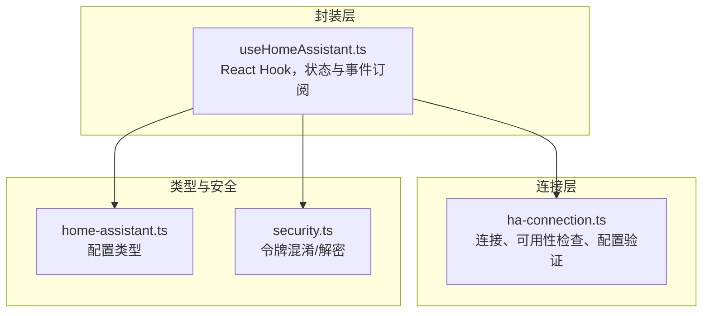
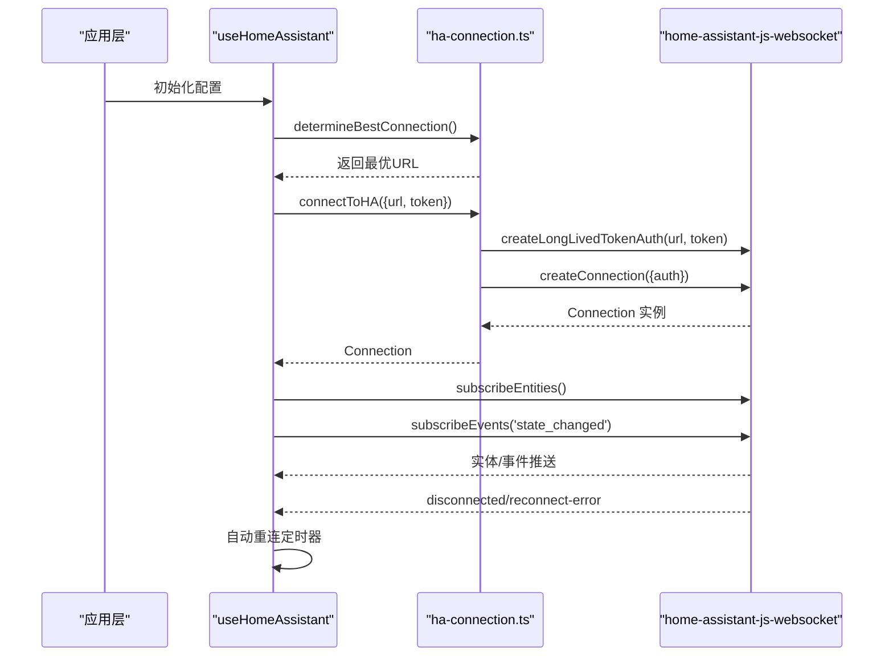
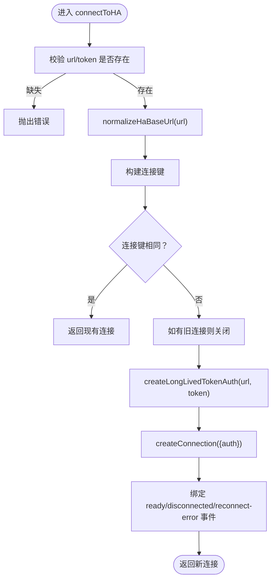
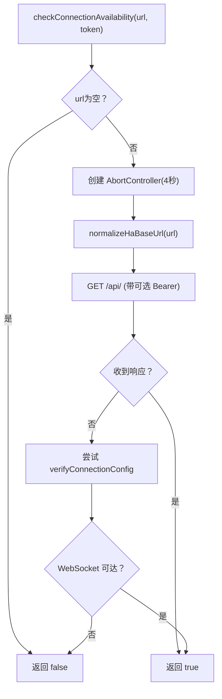
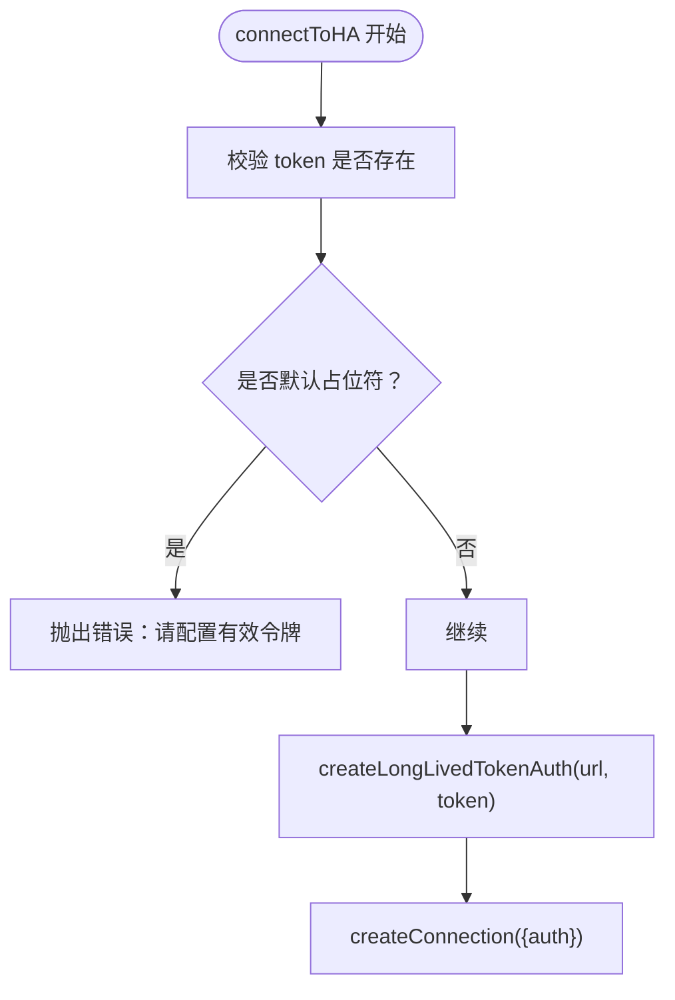
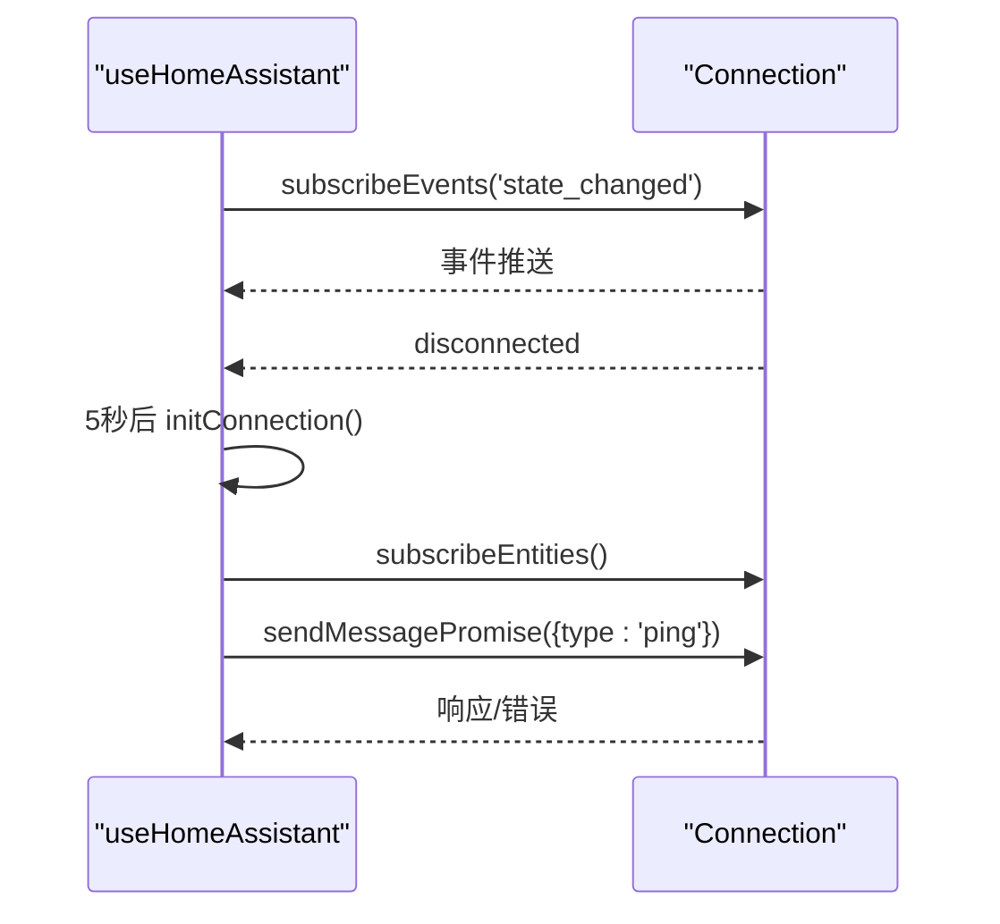
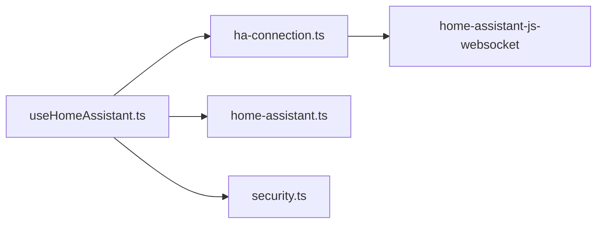

# WebSocket连接管理

<cite>
**本文引用的文件**
- [src/utils/ha-connection.ts](file://src/utils/ha-connection.ts)
- [src/hooks/useHomeAssistant.ts](file://src/hooks/useHomeAssistant.ts)
- [src/types/home-assistant.ts](file://src/types/home-assistant.ts)
- [src/utils/security.ts](file://src/utils/security.ts)
</cite>

## 目录
1. [简介](#简介)
2. [项目结构](#项目结构)
3. [核心组件](#核心组件)
4. [架构总览](#架构总览)
5. [详细组件分析](#详细组件分析)
6. [依赖关系分析](#依赖关系分析)
7. [性能考虑](#性能考虑)
8. [故障排除指南](#故障排除指南)
9. [结论](#结论)
10. [附录](#附录)

## 简介
本文件系统性梳理 Home Assistant WebSocket 连接管理的实现与使用模式，覆盖连接建立、维护与断开机制；连接配置项、URL 规范化与令牌验证流程；连接状态监听、错误处理与自动重连策略；并发连接与性能优化；以及安全认证、网络异常与超时配置等主题。目标读者既包括需要快速上手的开发者，也包括希望深入理解实现细节的技术人员。

## 项目结构
与 WebSocket 连接管理直接相关的模块主要分布在以下位置：
- 连接与工具：src/utils/ha-connection.ts
- React Hook 封装：src/hooks/useHomeAssistant.ts
- 类型定义：src/types/home-assistant.ts
- 安全工具（令牌混淆）：src/utils/security.ts

图表来源
- [src/utils/ha-connection.ts:1-317](file://src/utils/ha-connection.ts#L1-L317)
- [src/hooks/useHomeAssistant.ts:1-313](file://src/hooks/useHomeAssistant.ts#L1-L313)
- [src/types/home-assistant.ts:1-12](file://src/types/home-assistant.ts#L1-L12)
- [src/utils/security.ts:1-27](file://src/utils/security.ts#L1-L27)

章节来源
- [src/utils/ha-connection.ts:1-317](file://src/utils/ha-connection.ts#L1-L317)
- [src/hooks/useHomeAssistant.ts:1-313](file://src/hooks/useHomeAssistant.ts#L1-L313)
- [src/types/home-assistant.ts:1-12](file://src/types/home-assistant.ts#L1-L12)
- [src/utils/security.ts:1-27](file://src/utils/security.ts#L1-L27)

## 核心组件
- 连接配置与工厂
  - HAConnectionConfig 接口用于传入连接参数（url、token）
  - connectToHA 建立持久连接，支持单例复用与事件监听
  - createOneOffConnection 提供一次性连接能力
- URL 规范化与可用性检查
  - normalizeHaBaseUrl 统一去除协议后缀与尾部斜杠，兼容相对路径与多种 API 路径写法
  - determineBestConnection 并行探测本地/公网 URL，优先返回可达实例
  - checkConnectionAvailability 通过 HTTP GET /api/ 快速判断可达性，失败时回退 WebSocket 验证
  - verifyConnectionConfig 使用长连接令牌进行 WebSocket 可达性验证
- 订阅与服务调用
  - subscribeToEntities 订阅实体状态
  - callService 调用服务
- 断开与清理
  - disconnectHA 关闭全局连接并清空缓存键
- 注册表获取
  - fetchAreaRegistry/fetchDeviceRegistry/fetchEntityRegistry 获取区域/设备/实体注册信息
- React Hook 封装 useHomeAssistant
  - 自动选择最优 URL、代理回退、心跳/延迟测量、事件订阅、注册表拉取、REST 回退

章节来源
- [src/utils/ha-connection.ts:16-19](file://src/utils/ha-connection.ts#L16-L19)
- [src/utils/ha-connection.ts:47-105](file://src/utils/ha-connection.ts#L47-L105)
- [src/utils/ha-connection.ts:107-123](file://src/utils/ha-connection.ts#L107-L123)
- [src/utils/ha-connection.ts:24-41](file://src/utils/ha-connection.ts#L24-L41)
- [src/utils/ha-connection.ts:193-238](file://src/utils/ha-connection.ts#L193-L238)
- [src/utils/ha-connection.ts:244-296](file://src/utils/ha-connection.ts#L244-L296)
- [src/utils/ha-connection.ts:303-316](file://src/utils/ha-connection.ts#L303-L316)
- [src/utils/ha-connection.ts:125-139](file://src/utils/ha-connection.ts#L125-L139)
- [src/utils/ha-connection.ts:141-147](file://src/utils/ha-connection.ts#L141-L147)
- [src/utils/ha-connection.ts:177-187](file://src/utils/ha-connection.ts#L177-L187)
- [src/hooks/useHomeAssistant.ts:23-313](file://src/hooks/useHomeAssistant.ts#L23-L313)

## 架构总览
下图展示从应用层到 WebSocket 库的调用链路与关键事件：

图表来源
- [src/hooks/useHomeAssistant.ts:67-189](file://src/hooks/useHomeAssistant.ts#L67-L189)
- [src/utils/ha-connection.ts:47-105](file://src/utils/ha-connection.ts#L47-L105)

## 详细组件分析

### 连接建立与单例管理
- 单例键值：基于“规范化后的 URL + 令牌”生成唯一键，相同配置复用同一连接实例
- 连接生命周期：
  - 若已有连接且键一致，直接返回
  - 否则关闭旧连接，创建新连接
  - 订阅 ready/disconnected/reconnect-error 事件，便于调试与监控
- 错误映射：
  - ERR_CANNOT_CONNECT → “无法连接，请检查 URL 与网络”
  - ERR_INVALID_AUTH → “令牌无效”

图表来源
- [src/utils/ha-connection.ts:47-105](file://src/utils/ha-connection.ts#L47-L105)
- [src/utils/ha-connection.ts:24-41](file://src/utils/ha-connection.ts#L24-L41)
- [src/utils/ha-connection.ts:43-45](file://src/utils/ha-connection.ts#L43-L45)

章节来源
- [src/utils/ha-connection.ts:47-105](file://src/utils/ha-connection.ts#L47-L105)

### URL 规范化与可达性探测
- normalizeHaBaseUrl 支持：
  - 去除多余前导斜杠与尾部斜杠
  - 将 ws(s) 替换为 http(s)，统一为 REST API 基址
  - 移除 /api/websocket 与 /api
- determineBestConnection 并行探测本地/公网 URL，返回首个可达结果
- checkConnectionAvailability：
  - 4 秒超时的 HTTP GET /api/
  - 失败时回退 verifyConnectionConfig（WebSocket）
  - 将 401/403/404/5xx 均视为“可达”，仅网络错误/超时视为“不可达”

图表来源
- [src/utils/ha-connection.ts:244-296](file://src/utils/ha-connection.ts#L244-L296)
- [src/utils/ha-connection.ts:303-316](file://src/utils/ha-connection.ts#L303-L316)
- [src/utils/ha-connection.ts:24-41](file://src/utils/ha-connection.ts#L24-L41)

章节来源
- [src/utils/ha-connection.ts:244-296](file://src/utils/ha-connection.ts#L244-L296)
- [src/utils/ha-connection.ts:303-316](file://src/utils/ha-connection.ts#L303-L316)

### 令牌验证与安全注意事项
- 长期访问令牌（Long-Lived Access Token）通过 createLongLivedTokenAuth 注入
- detectDefaultToken 保护：若检测到默认占位符，立即报错，避免误用
- 令牌混淆/解密：
  - encryptToken 使用 Base64 对令牌进行简单混淆，仅用于降低屏幕截图泄露风险
  - decryptToken 兼容旧版 AES 特征，若检测到则提示重置令牌

图表来源
- [src/utils/ha-connection.ts:51-60](file://src/utils/ha-connection.ts#L51-L60)
- [src/utils/security.ts:1-27](file://src/utils/security.ts#L1-L27)

章节来源
- [src/utils/ha-connection.ts:51-60](file://src/utils/ha-connection.ts#L51-L60)
- [src/utils/security.ts:1-27](file://src/utils/security.ts#L1-L27)

### 连接状态监听、错误处理与自动重连
- useHomeAssistant 中：
  - 心跳：每 10 秒发送 ping 并记录往返时间
  - 连接断开：监听 disconnected 事件，5 秒后自动重连
  - 事件订阅：订阅 state_changed 事件，最多保留最近 100 条
  - 注册表：并发拉取区域/设备/实体注册信息
  - REST 回退：WebSocket 失败时回退到 REST API（/api/states）

图表来源
- [src/hooks/useHomeAssistant.ts:37-59](file://src/hooks/useHomeAssistant.ts#L37-L59)
- [src/hooks/useHomeAssistant.ts:140-148](file://src/hooks/useHomeAssistant.ts#L140-L148)
- [src/hooks/useHomeAssistant.ts:150-164](file://src/hooks/useHomeAssistant.ts#L150-L164)

章节来源
- [src/hooks/useHomeAssistant.ts:37-59](file://src/hooks/useHomeAssistant.ts#L37-L59)
- [src/hooks/useHomeAssistant.ts:140-148](file://src/hooks/useHomeAssistant.ts#L140-L148)
- [src/hooks/useHomeAssistant.ts:150-164](file://src/hooks/useHomeAssistant.ts#L150-L164)

### REST 回退与并发优化
- REST 回退策略：
  - WebSocket get_states 失败时，使用 REST /api/states 或 /api/states/{entity_id}
  - 通过 Authorization: Bearer {token} 传递令牌
- 并发优化：
  - 注册表拉取使用 Promise.all 并发请求
  - 刷新实体状态时使用刷新去重（refreshInFlightRef），避免重复请求

章节来源
- [src/hooks/useHomeAssistant.ts:267-293](file://src/hooks/useHomeAssistant.ts#L267-L293)
- [src/hooks/useHomeAssistant.ts:225-248](file://src/hooks/useHomeAssistant.ts#L225-L248)

### 配置选项与类型定义
- HAConfig（类型定义）：
  - localUrl/publicUrl/token：连接配置
  - 设备/人/场景映射字段（用于扩展功能）
- useHomeAssistant 接收可选配置对象，内部根据是否存在 localUrl/publicUrl 决定是否执行“最优连接选择”

章节来源
- [src/types/home-assistant.ts:3-11](file://src/types/home-assistant.ts#L3-L11)
- [src/hooks/useHomeAssistant.ts:17-21](file://src/hooks/useHomeAssistant.ts#L17-L21)
- [src/hooks/useHomeAssistant.ts:73-89](file://src/hooks/useHomeAssistant.ts#L73-L89)

## 依赖关系分析
- 模块耦合
  - useHomeAssistant 依赖 ha-connection.ts 的连接、订阅与注册表接口
  - HAConfig 类型定义被 useHomeAssistant 使用
  - security.ts 与连接流程解耦，仅用于令牌混淆/解密
- 外部依赖
  - home-assistant-js-websocket：WebSocket 连接、认证、订阅、服务调用
- 潜在循环依赖
  - 当前文件间无循环导入迹象

图表来源
- [src/hooks/useHomeAssistant.ts:1-14](file://src/hooks/useHomeAssistant.ts#L1-L14)
- [src/utils/ha-connection.ts:1-10](file://src/utils/ha-connection.ts#L1-L10)

章节来源
- [src/hooks/useHomeAssistant.ts:1-14](file://src/hooks/useHomeAssistant.ts#L1-L14)
- [src/utils/ha-connection.ts:1-10](file://src/utils/ha-connection.ts#L1-L10)

## 性能考虑
- 连接复用：通过连接键避免重复握手，减少握手开销
- 并发请求：注册表拉取使用 Promise.all，缩短首屏加载时间
- 心跳与延迟：定期 ping 测量往返时间，便于定位网络问题
- REST 回退：在 WebSocket 不稳定时保证功能可用，避免阻塞
- 超时控制：HTTP 可达性检查使用 AbortController 控制 4 秒超时，避免长时间阻塞

章节来源
- [src/utils/ha-connection.ts:43-45](file://src/utils/ha-connection.ts#L43-L45)
- [src/hooks/useHomeAssistant.ts:167-180](file://src/hooks/useHomeAssistant.ts#L167-L180)
- [src/hooks/useHomeAssistant.ts:37-59](file://src/hooks/useHomeAssistant.ts#L37-L59)
- [src/utils/ha-connection.ts:248-250](file://src/utils/ha-connection.ts#L248-L250)

## 故障排除指南
- 无法连接
  - 检查 VITE_HA_URL/VITE_HA_TOKEN 或传入配置是否正确
  - 使用 determineBestConnection 与 checkConnectionAvailability 排查本地/公网可达性
  - 若 HTTP 受 CORS 限制，verifyConnectionConfig 可绕过 CORS 进行 WebSocket 可达性验证
- 令牌无效
  - 确认使用长期访问令牌（Long-Lived Access Token）
  - 避免使用默认占位符，否则会触发保护性错误
- 断线重连
  - useHomeAssistant 已内置 5 秒重连逻辑，观察 disconnected 事件日志
- REST 回退
  - 当 WebSocket get_states 失败时，自动回退到 REST /api/states
- 代理回退
  - 默认连接失败时，尝试使用 /ha-api 作为本地代理入口

章节来源
- [src/utils/ha-connection.ts:51-60](file://src/utils/ha-connection.ts#L51-L60)
- [src/utils/ha-connection.ts:244-296](file://src/utils/ha-connection.ts#L244-L296)
- [src/utils/ha-connection.ts:303-316](file://src/utils/ha-connection.ts#L303-L316)
- [src/hooks/useHomeAssistant.ts:96-120](file://src/hooks/useHomeAssistant.ts#L96-L120)
- [src/hooks/useHomeAssistant.ts:140-148](file://src/hooks/useHomeAssistant.ts#L140-L148)
- [src/hooks/useHomeAssistant.ts:267-293](file://src/hooks/useHomeAssistant.ts#L267-L293)

## 结论
该实现以“规范化 URL + 可达性探测 + 单例连接 + 事件驱动”的方式，提供了稳健的 Home Assistant WebSocket 连接管理方案。通过心跳与自动重连保障连接稳定性，通过 REST 回退提升可用性，通过令牌混淆与默认占位符检测强化安全意识。整体设计兼顾易用性与可维护性，适合在多网络环境与复杂部署场景下使用。

## 附录
- 最佳实践建议
  - 明确区分本地/公网 URL，优先使用可达性更高的地址
  - 使用长期访问令牌并妥善保管，避免使用默认占位符
  - 在生产环境启用心跳监控，结合日志定位网络波动
  - 对高频操作使用 REST 回退，确保用户体验连续性
  - 合理设置超时与重试策略，避免资源浪费