# 实体状态同步

<cite>
**本文引用的文件**
- [src/hooks/useHomeAssistant.ts](file://src/hooks/useHomeAssistant.ts)
- [src/utils/ha-connection.ts](file://src/utils/ha-connection.ts)
- [src/utils/device-sync.ts](file://src/utils/device-sync.ts)
- [src/store/dataStore.ts](file://src/store/dataStore.ts)
- [src/utils/sync.ts](file://src/utils/sync.ts)
- [src/utils/cache-manager.ts](file://src/utils/cache-manager.ts)
- [src/utils/entity-cleaner.ts](file://src/utils/entity-cleaner.ts)
- [src/app/components/dashboard/DeviceCard.tsx](file://src/app/components/dashboard/DeviceCard.tsx)
- [src/types/home-assistant.ts](file://src/types/home-assistant.ts)
- [src/types/device.ts](file://src/types/device.ts)
- [src/config/initialDevices.ts](file://src/config/initialDevices.ts)
- [src/utils/regions.ts](file://src/utils/regions.ts)
</cite>

## 目录
1. [简介](#简介)
2. [项目结构](#项目结构)
3. [核心组件](#核心组件)
4. [架构总览](#架构总览)
5. [详细组件分析](#详细组件分析)
6. [依赖关系分析](#依赖关系分析)
7. [性能考量](#性能考量)
8. [故障排除指南](#故障排除指南)
9. [结论](#结论)
10. [附录](#附录)

## 简介
本文件系统性梳理 Home Assistant 实体状态同步机制，覆盖以下主题：
- 实体订阅、状态变更监听与实时更新流程
- 实体注册表查询、区域与设备信息获取
- 状态缓存策略、增量更新机制与冲突解决算法
- 实体过滤、批量更新与性能优化方案
- 状态同步故障排除与调试技巧
- 离线状态处理、数据一致性保证与同步延迟优化

## 项目结构
围绕“状态同步”的关键模块包括：
- 连接与订阅层：负责建立与 Home Assistant 的 WebSocket 连接、订阅实体状态与事件，并提供 REST 回退
- 数据存储层：使用持久化状态管理，记录设备、房间、场景、用户与日志等
- 同步与缓存层：提供本地配置到服务端的双向同步、增量校验与缓存
- 实体清洗与映射：从实体属性与名称推断设备类型、房间与图标，支撑 UI 展示与交互
- UI 组件层：根据设备类型渲染不同卡片，展示状态与时间戳

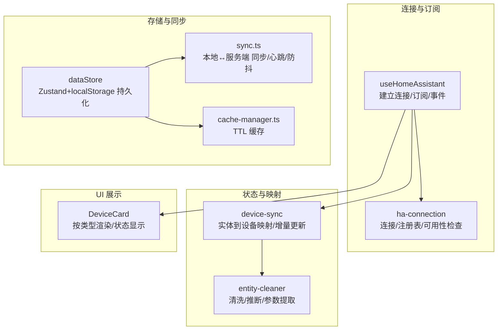

**图表来源**
- [src/hooks/useHomeAssistant.ts:1-313](file://src/hooks/useHomeAssistant.ts#L1-L313)
- [src/utils/ha-connection.ts:1-317](file://src/utils/ha-connection.ts#L1-L317)
- [src/utils/device-sync.ts:1-191](file://src/utils/device-sync.ts#L1-L191)
- [src/utils/entity-cleaner.ts:1-381](file://src/utils/entity-cleaner.ts#L1-L381)
- [src/store/dataStore.ts:1-129](file://src/store/dataStore.ts#L1-L129)
- [src/utils/sync.ts:1-161](file://src/utils/sync.ts#L1-L161)
- [src/utils/cache-manager.ts:1-57](file://src/utils/cache-manager.ts#L1-L57)
- [src/app/components/dashboard/DeviceCard.tsx:1-293](file://src/app/components/dashboard/DeviceCard.tsx#L1-L293)

**章节来源**
- [src/hooks/useHomeAssistant.ts:1-313](file://src/hooks/useHomeAssistant.ts#L1-L313)
- [src/utils/ha-connection.ts:1-317](file://src/utils/ha-connection.ts#L1-L317)
- [src/store/dataStore.ts:1-129](file://src/store/dataStore.ts#L1-L129)

## 核心组件
- useHomeAssistant：建立 WebSocket 连接，订阅实体状态与 state_changed 事件，拉取区域/设备/实体注册表，提供服务调用与 REST 回退
- ha-connection：封装连接创建、认证、注册表查询、最佳连接选择与可用性验证
- device-sync：将 HassEntities 映射为本地 Device 并执行增量更新，处理多类设备的状态与属性同步
- dataStore：Zustand 状态管理，持久化到 localStorage，触发同步
- sync.ts：本地配置到服务端的同步、增量校验、心跳与页面聚焦对齐
- entity-cleaner：从 friendly_name 与 domain 推断房间、设备类型与图标，提取实体参数
- DeviceCard：按设备类型渲染 UI，展示状态与时间信息

**章节来源**
- [src/hooks/useHomeAssistant.ts:23-313](file://src/hooks/useHomeAssistant.ts#L23-L313)
- [src/utils/ha-connection.ts:47-105](file://src/utils/ha-connection.ts#L47-L105)
- [src/utils/device-sync.ts:4-191](file://src/utils/device-sync.ts#L4-L191)
- [src/store/dataStore.ts:58-129](file://src/store/dataStore.ts#L58-L129)
- [src/utils/sync.ts:46-161](file://src/utils/sync.ts#L46-L161)
- [src/utils/entity-cleaner.ts:62-381](file://src/utils/entity-cleaner.ts#L62-L381)
- [src/app/components/dashboard/DeviceCard.tsx:26-293](file://src/app/components/dashboard/DeviceCard.tsx#L26-L293)

## 架构总览
下图展示从连接建立到状态更新、再到 UI 渲染的全链路。

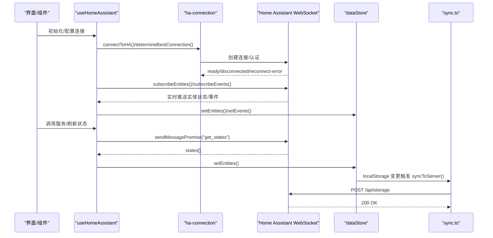

**图表来源**
- [src/hooks/useHomeAssistant.ts:67-210](file://src/hooks/useHomeAssistant.ts#L67-L210)
- [src/utils/ha-connection.ts:47-105](file://src/utils/ha-connection.ts#L47-L105)
- [src/store/dataStore.ts:104-127](file://src/store/dataStore.ts#L104-L127)
- [src/utils/sync.ts:52-93](file://src/utils/sync.ts#L52-L93)

## 详细组件分析

### 连接与订阅：useHomeAssistant 与 ha-connection
- 连接建立：支持本地/公网 URL 自动择优，失败时回退到代理路径；支持环境变量注入 token
- 订阅实体：实时接收实体状态变更，驱动 UI 即时更新
- 订阅事件：监听 state_changed 事件，维护最近事件列表
- 注册表：并发拉取区域、设备、实体注册表，用于房间与设备信息
- 服务调用：封装 callService，REST 回退：当 WebSocket 失败时走 REST API
- 心跳与延迟：周期性 ping，计算往返延迟

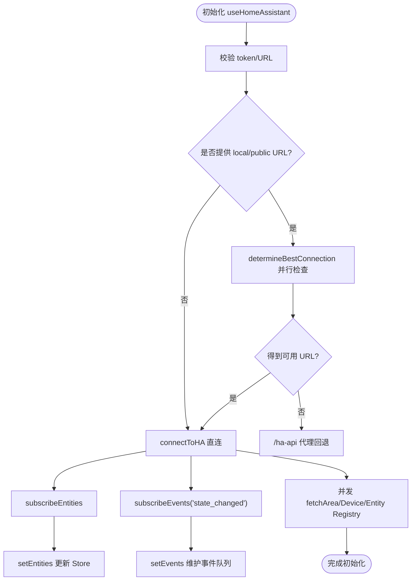

**图表来源**
- [src/hooks/useHomeAssistant.ts:67-189](file://src/hooks/useHomeAssistant.ts#L67-L189)
- [src/utils/ha-connection.ts:193-238](file://src/utils/ha-connection.ts#L193-L238)

**章节来源**
- [src/hooks/useHomeAssistant.ts:23-313](file://src/hooks/useHomeAssistant.ts#L23-L313)
- [src/utils/ha-connection.ts:177-187](file://src/utils/ha-connection.ts#L177-L187)

### 实体到设备映射与增量更新：device-sync
- 映射策略：依据 deviceMappings 将设备与实体关联，逐设备比对状态与属性
- 增量更新：仅在字段实际变化时写入更新对象，减少 UI 重绘与副作用
- 设备类型分支：灯光/开关、窗帘、传感器、二进制传感器、空调/环境设备等分别处理
- 可用性与状态：基于 state 判定 online/offline，记录 last_updated/last_changed
- HVAC 模式：仅在数组内容变化时更新 hvac_modes/fan_modes/swing_modes 等

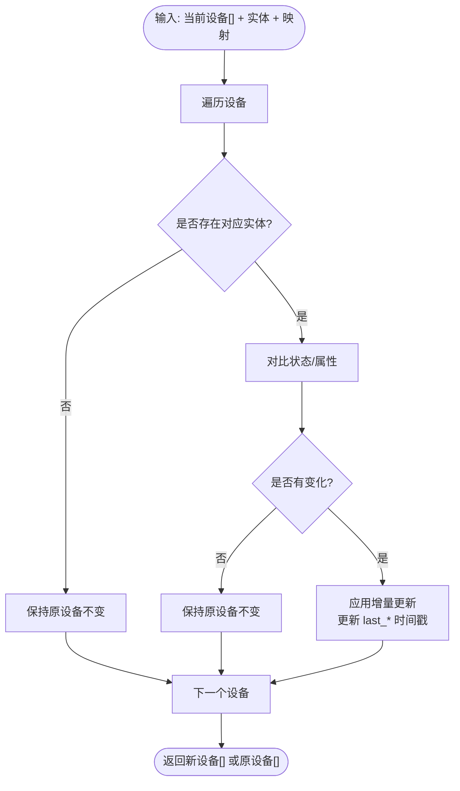

**图表来源**
- [src/utils/device-sync.ts:4-191](file://src/utils/device-sync.ts#L4-L191)

**章节来源**
- [src/utils/device-sync.ts:4-191](file://src/utils/device-sync.ts#L4-L191)

### 存储与同步：dataStore 与 sync.ts
- dataStore：以 Zustand + persist 管理设备/房间/场景/用户/日志；localStorage 变更时触发同步
- 同步策略：防抖合并、版本号（时间戳）增量校验、心跳与聚焦对齐、错误静默
- 服务端接口：/api/storage 的 GET/POST，携带所有键值对与版本时间戳

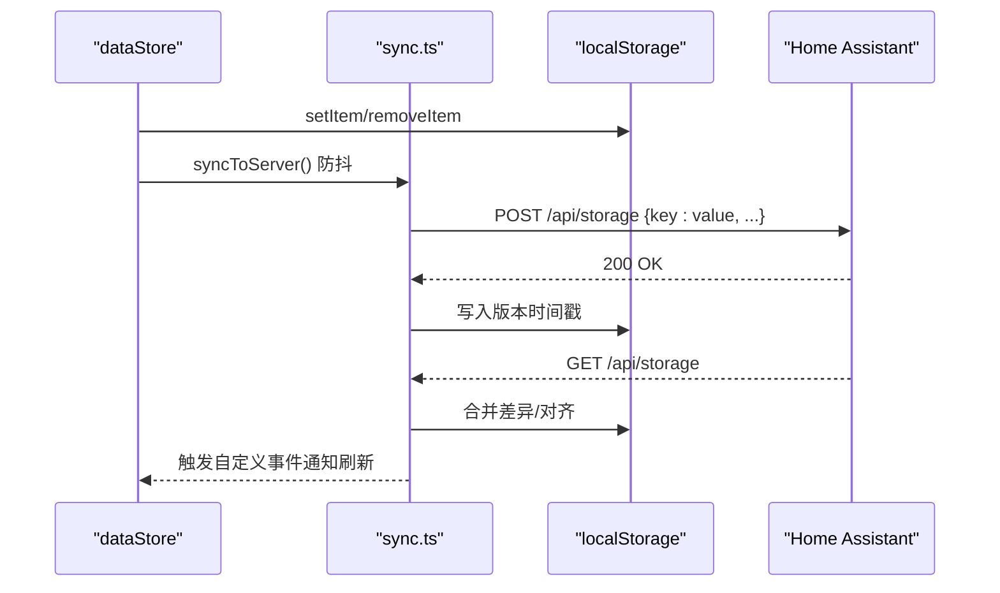

**图表来源**
- [src/store/dataStore.ts:104-127](file://src/store/dataStore.ts#L104-L127)
- [src/utils/sync.ts:52-131](file://src/utils/sync.ts#L52-L131)

**章节来源**
- [src/store/dataStore.ts:58-129](file://src/store/dataStore.ts#L58-L129)
- [src/utils/sync.ts:46-161](file://src/utils/sync.ts#L46-L161)

### 实体清洗与映射：entity-cleaner
- 房间推断：中文关键词优先匹配 friendly_name 或 entity_id，支持英文房间标识
- 设备类型推断：优先中文关键词，其次 domain 映射，再细分传感器与二进制传感器子类
- 参数提取：针对不同 domain 提取关键属性（如 hvac_modes、brightness、position 等）
- 图标映射：domain 到 MDI 图标的默认映射

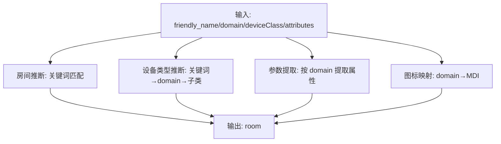

**图表来源**
- [src/utils/entity-cleaner.ts:172-381](file://src/utils/entity-cleaner.ts#L172-L381)

**章节来源**
- [src/utils/entity-cleaner.ts:62-381](file://src/utils/entity-cleaner.ts#L62-L381)

### UI 展示：DeviceCard
- 类型路由：灯光/窗帘/空调/传感器/遥控器等不同类型卡片
- 状态展示：根据 device.isOn、device.haAvailable、device.haState 计算触发态与文案
- 时间显示：传感器类卡片展示相对/绝对时间，支持 nowMs 传入优化渲染频率

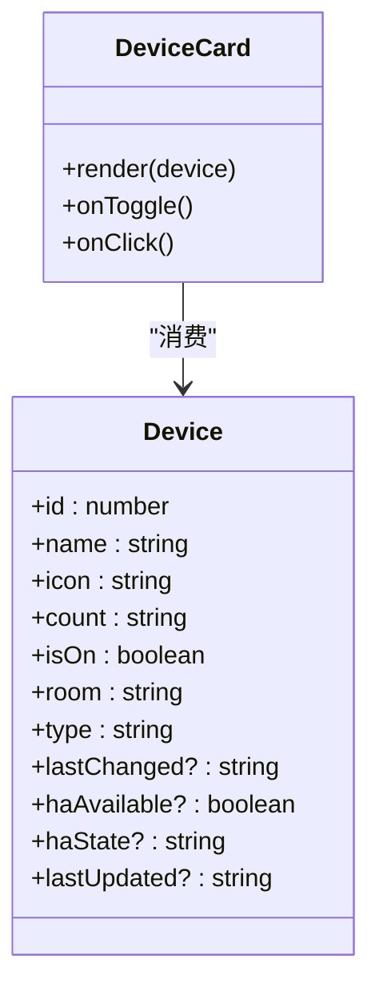

**图表来源**
- [src/app/components/dashboard/DeviceCard.tsx:26-293](file://src/app/components/dashboard/DeviceCard.tsx#L26-L293)
- [src/types/device.ts:1-46](file://src/types/device.ts#L1-L46)

**章节来源**
- [src/app/components/dashboard/DeviceCard.tsx:26-293](file://src/app/components/dashboard/DeviceCard.tsx#L26-L293)
- [src/types/device.ts:1-46](file://src/types/device.ts#L1-L46)

## 依赖关系分析
- useHomeAssistant 依赖 ha-connection 提供连接、注册表与可用性检查
- device-sync 依赖 HassEntities 与设备映射，输出本地 Device
- dataStore 依赖 localStorage 与 sync.ts 完成双向同步
- entity-cleaner 为 UI 与映射提供清洗与推断能力
- DeviceCard 依赖 Device 类型进行渲染

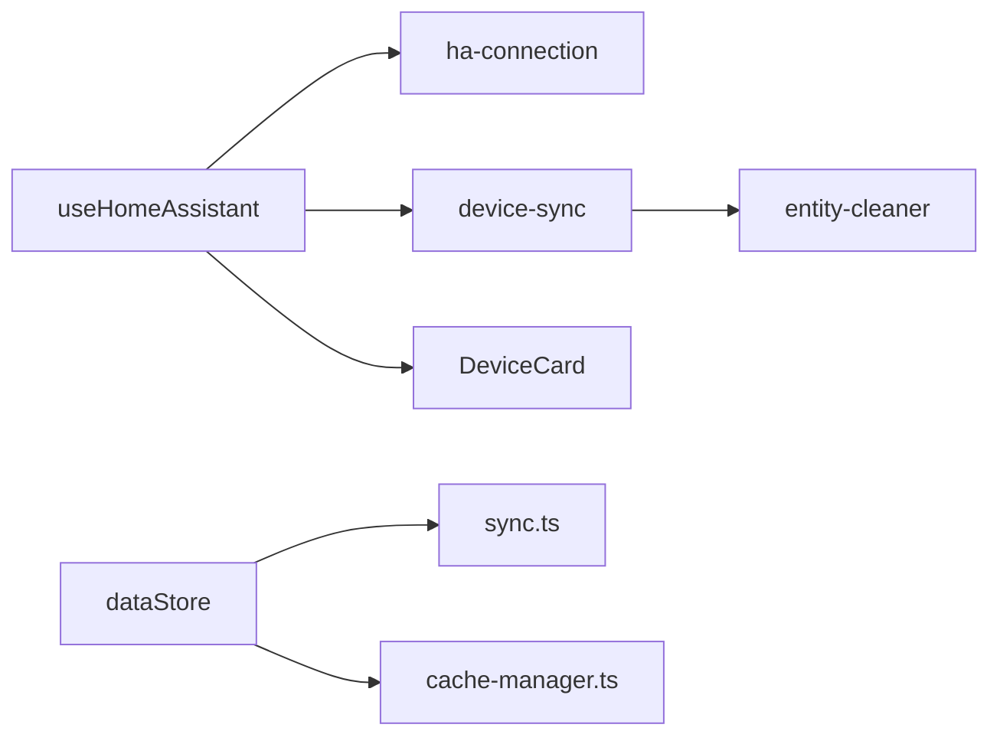

**图表来源**
- [src/hooks/useHomeAssistant.ts:1-313](file://src/hooks/useHomeAssistant.ts#L1-L313)
- [src/utils/ha-connection.ts:1-317](file://src/utils/ha-connection.ts#L1-L317)
- [src/utils/device-sync.ts:1-191](file://src/utils/device-sync.ts#L1-L191)
- [src/utils/entity-cleaner.ts:1-381](file://src/utils/entity-cleaner.ts#L1-L381)
- [src/store/dataStore.ts:1-129](file://src/store/dataStore.ts#L1-L129)
- [src/utils/sync.ts:1-161](file://src/utils/sync.ts#L1-L161)
- [src/utils/cache-manager.ts:1-57](file://src/utils/cache-manager.ts#L1-L57)
- [src/app/components/dashboard/DeviceCard.tsx:1-293](file://src/app/components/dashboard/DeviceCard.tsx#L1-L293)

**章节来源**
- [src/hooks/useHomeAssistant.ts:1-313](file://src/hooks/useHomeAssistant.ts#L1-L313)
- [src/utils/ha-connection.ts:1-317](file://src/utils/ha-connection.ts#L1-L317)
- [src/utils/device-sync.ts:1-191](file://src/utils/device-sync.ts#L1-L191)
- [src/utils/entity-cleaner.ts:1-381](file://src/utils/entity-cleaner.ts#L1-L381)
- [src/store/dataStore.ts:1-129](file://src/store/dataStore.ts#L1-L129)
- [src/utils/sync.ts:1-161](file://src/utils/sync.ts#L1-L161)
- [src/utils/cache-manager.ts:1-57](file://src/utils/cache-manager.ts#L1-L57)
- [src/app/components/dashboard/DeviceCard.tsx:1-293](file://src/app/components/dashboard/DeviceCard.tsx#L1-L293)

## 性能考量
- 连接与订阅
  - 使用 subscribeEntities 与 subscribeEvents 实时推送，避免轮询
  - 心跳 ping 降低到 10 秒，平衡可观测性与网络负载
- 增量更新
  - device-sync 仅在字段变化时写入更新，减少不必要的渲染
  - last_changed/last_updated 仅在变化时更新，避免无意义的 diff
- 同步与缓存
  - sync.ts 对 localStorage 变更进行 1 秒防抖，合并多次写入
  - /api/storage 采用版本时间戳增量校验，避免全量覆盖
  - cache-manager.ts 30 分钟 TTL，严格过期策略，必要时可扩展“先返回旧值再刷新”
- UI 渲染
  - DeviceCard 对传感器类组件按 nowMs 优化重渲染频率，避免每秒重绘
- REST 回退
  - WebSocket 失败时自动降级到 REST，保障可用性

[本节为通用性能建议，不直接分析具体文件]

## 故障排除指南
- 连接问题
  - 检查 token 是否有效且长度足够；确认本地/公网 URL 可达
  - 使用 determineBestConnection 并行探测，观察日志中的“Best connection found”提示
  - 若默认连接失败，确认代理路径 /ha-api 是否可用
- 实体未更新
  - 确认 subscribeEntities 是否成功，查看 setEntities 是否被调用
  - 如 WebSocket get_states 失败，检查 REST 路径与 Authorization
- 同步异常
  - 查看 /api/storage 的响应与错误日志
  - 检查版本时间戳是否正确写入与读取
  - 若失败静默，请临时禁用错误捕获以定位问题
- 注册表缺失
  - 确保并发 fetchArea/Device/Entity Registry 成功
  - 若部分失败，检查 HA 权限与网络策略
- UI 不显示或显示异常
  - 检查 device-cleaner 推断结果（房间/类型/图标）
  - 确认 device-sync 是否正确映射实体状态与属性

**章节来源**
- [src/hooks/useHomeAssistant.ts:67-210](file://src/hooks/useHomeAssistant.ts#L67-L210)
- [src/utils/ha-connection.ts:193-296](file://src/utils/ha-connection.ts#L193-L296)
- [src/utils/sync.ts:89-131](file://src/utils/sync.ts#L89-L131)
- [src/utils/entity-cleaner.ts:172-381](file://src/utils/entity-cleaner.ts#L172-L381)

## 结论
该系统通过 WebSocket 实时订阅、Zustand 持久化与 localStorage 同步、以及针对多类设备的增量映射，构建了高效、稳健的实体状态同步机制。配合实体清洗与 UI 渲染优化，实现了从连接、映射、存储到展示的完整闭环。建议在生产环境中进一步增强：
- “先返回旧值再刷新”的缓存策略
- 更细粒度的批量更新与去抖策略
- 事件流的背压与丢弃策略
- 更完善的错误上报与重试机制

[本节为总结性内容，不直接分析具体文件]

## 附录

### 关键流程图：实体状态变更到 UI 更新
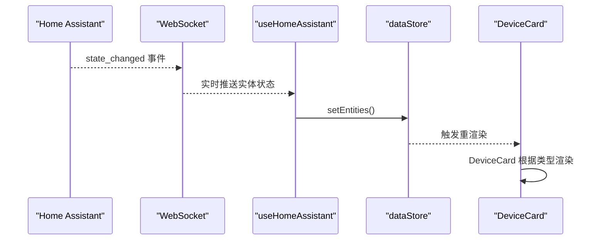

**图表来源**
- [src/hooks/useHomeAssistant.ts:150-164](file://src/hooks/useHomeAssistant.ts#L150-L164)
- [src/store/dataStore.ts:67-73](file://src/store/dataStore.ts#L67-L73)
- [src/app/components/dashboard/DeviceCard.tsx:26-293](file://src/app/components/dashboard/DeviceCard.tsx#L26-L293)

### 关键流程图：实体注册表查询与房间/设备信息获取
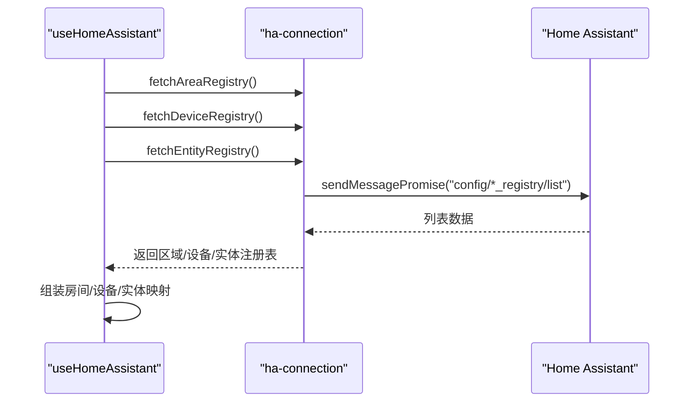

**图表来源**
- [src/hooks/useHomeAssistant.ts:166-180](file://src/hooks/useHomeAssistant.ts#L166-L180)
- [src/utils/ha-connection.ts:177-187](file://src/utils/ha-connection.ts#L177-L187)

### 关键流程图：状态缓存策略与增量更新
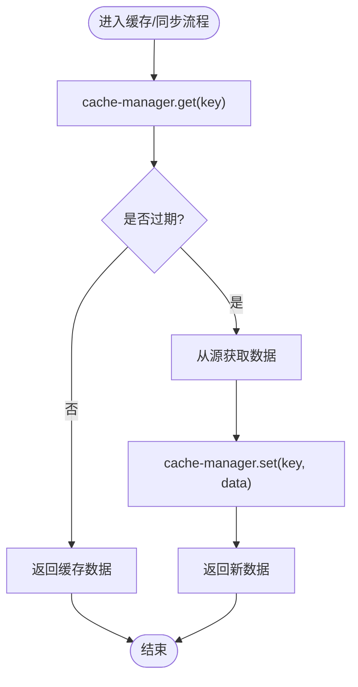

**图表来源**
- [src/utils/cache-manager.ts:9-43](file://src/utils/cache-manager.ts#L9-L43)

### 关键流程图：冲突解决与一致性保证
- 版本时间戳：服务端返回最新时间戳，本地仅在远端较新或强制同步时覆盖
- 防抖与幂等：localStorage 写入后统一触发 syncToServer，避免并发写入导致的覆盖
- UI 一致性：device-sync 仅在字段变化时更新，确保 UI 与数据一致

**章节来源**
- [src/utils/sync.ts:98-131](file://src/utils/sync.ts#L98-L131)
- [src/utils/device-sync.ts:172-187](file://src/utils/device-sync.ts#L172-L187)

### 配置与类型参考
- HA 配置：包含本地/公网 URL、token 与设备映射
- 设备类型：涵盖灯光、开关、窗帘、空调、传感器、安全、媒体等
- 初始设备：演示性初始数据，便于快速体验

**章节来源**
- [src/types/home-assistant.ts:3-11](file://src/types/home-assistant.ts#L3-L11)
- [src/types/device.ts:1-46](file://src/types/device.ts#L1-L46)
- [src/config/initialDevices.ts:3-67](file://src/config/initialDevices.ts#L3-L67)