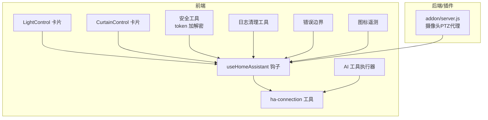
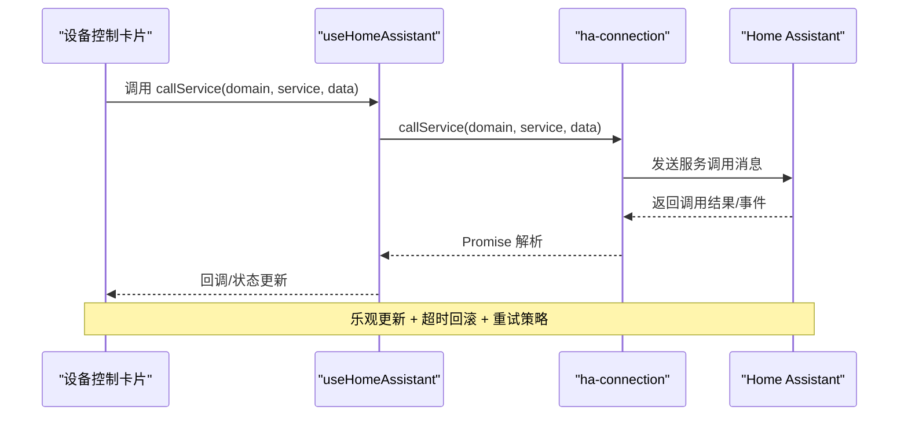
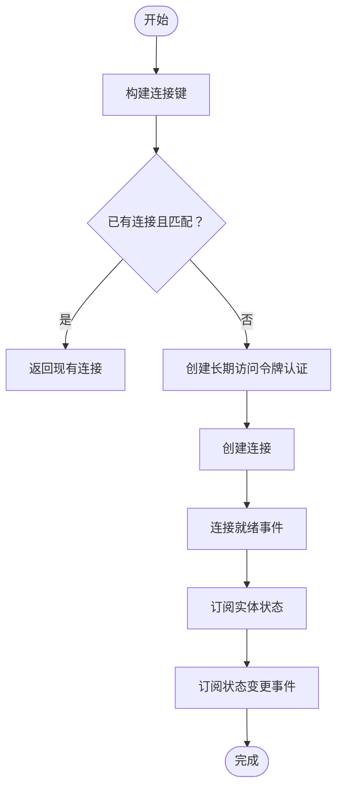
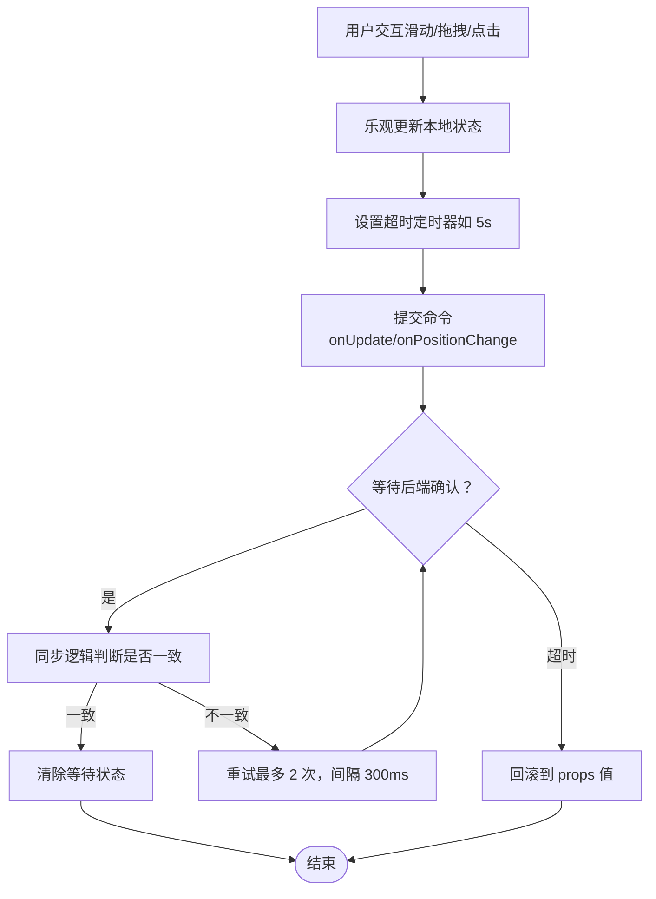
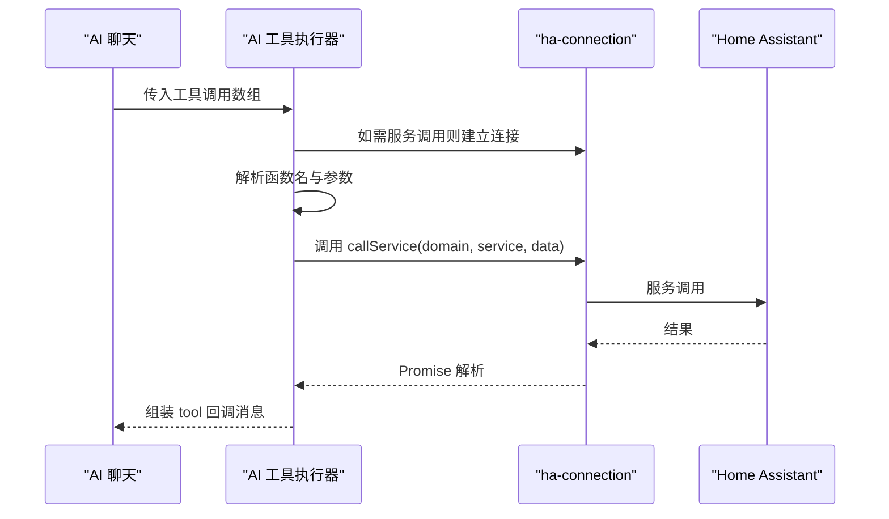
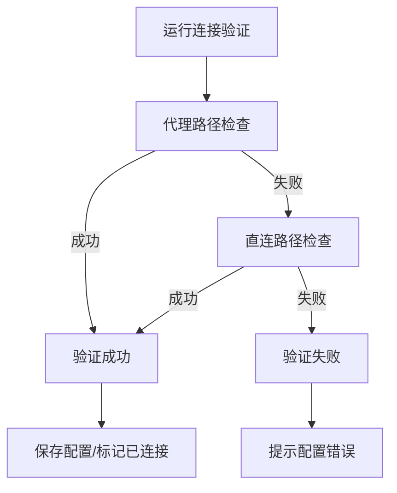
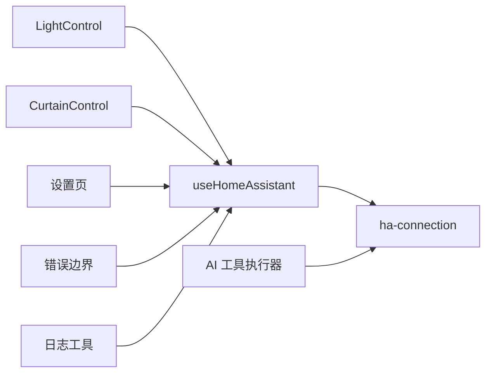

# 服务调用与动作执行

<cite>
**本文引用的文件**   
- [src/utils/ha-connection.ts](file://src/utils/ha-connection.ts)
- [src/hooks/useHomeAssistant.ts](file://src/hooks/useHomeAssistant.ts)
- [src/services/ai-tools-executor.ts](file://src/services/ai-tools-executor.ts)
- [src/app/components/dashboard/cards/LightControl.tsx](file://src/app/components/dashboard/cards/LightControl.tsx)
- [src/app/components/dashboard/cards/CurtainControl.tsx](file://src/app/components/dashboard/cards/CurtainControl.tsx)
- [src/app/components/SettingsModal.tsx](file://src/app/components/SettingsModal.tsx)
- [src/app/components/ErrorBoundary.tsx](file://src/app/components/ErrorBoundary.tsx)
- [src/utils/log-helper.ts](file://src/utils/log-helper.ts)
- [src/utils/security.ts](file://src/utils/security.ts)
- [src/utils/icon-telemetry.ts](file://src/utils/icon-telemetry.ts)
- [addon/server.js](file://addon/server.js)
</cite>

## 目录
1. [简介](#简介)
2. [项目结构](#项目结构)
3. [核心组件](#核心组件)
4. [架构总览](#架构总览)
5. [详细组件分析](#详细组件分析)
6. [依赖关系分析](#依赖关系分析)
7. [性能考量](#性能考量)
8. [故障排查指南](#故障排查指南)
9. [结论](#结论)
10. [附录](#附录)

## 简介
本文件系统性梳理 Home Assistant 服务调用与动作执行在前端侧的实现与使用方式，覆盖以下主题：
- 服务调用协议与域/服务参数规范
- 异步处理、结果回调与错误传播机制
- 设备控制命令的封装、参数校验与执行确认流程
- 批量服务调用、事务与回滚思路
- 调试工具、性能监控与错误处理最佳实践
- 权限验证、安全检查与操作审计建议

## 项目结构
围绕服务调用与动作执行的关键目录与文件如下：
- 连接与服务调用：src/utils/ha-connection.ts、src/hooks/useHomeAssistant.ts
- 设备控制卡片：src/app/components/dashboard/cards/LightControl.tsx、src/app/components/dashboard/cards/CurtainControl.tsx
- AI 工具执行：src/services/ai-tools-executor.ts
- 安全与验证：src/app/components/SettingsModal.tsx、src/utils/security.ts
- 日志与错误边界：src/utils/log-helper.ts、src/app/components/ErrorBoundary.tsx
- 图标性能遥测：src/utils/icon-telemetry.ts
- 摄像头 PTZ 代理：addon/server.js

**图表来源**
- [src/hooks/useHomeAssistant.ts:1-313](file://src/hooks/useHomeAssistant.ts#L1-L313)
- [src/utils/ha-connection.ts:1-317](file://src/utils/ha-connection.ts#L1-L317)
- [src/app/components/dashboard/cards/LightControl.tsx:1-246](file://src/app/components/dashboard/cards/LightControl.tsx#L1-L246)
- [src/app/components/dashboard/cards/CurtainControl.tsx:1-234](file://src/app/components/dashboard/cards/CurtainControl.tsx#L1-L234)
- [src/services/ai-tools-executor.ts:1-60](file://src/services/ai-tools-executor.ts#L1-L60)
- [src/utils/security.ts:1-27](file://src/utils/security.ts#L1-L27)
- [src/utils/log-helper.ts:1-33](file://src/utils/log-helper.ts#L1-L33)
- [src/app/components/ErrorBoundary.tsx:1-51](file://src/app/components/ErrorBoundary.tsx#L1-L51)
- [src/utils/icon-telemetry.ts:1-57](file://src/utils/icon-telemetry.ts#L1-L57)
- [addon/server.js:225-258](file://addon/server.js#L225-L258)

**章节来源**
- [src/hooks/useHomeAssistant.ts:1-313](file://src/hooks/useHomeAssistant.ts#L1-L313)
- [src/utils/ha-connection.ts:1-317](file://src/utils/ha-connection.ts#L1-L317)

## 核心组件
- 连接与服务调用
  - 提供长连接创建、实体订阅、一次性连接、服务调用封装、注册表查询等能力。
  - 支持本地/公网地址自动探测与可用性检查，以及 WebSocket 验证。
- 设备控制卡片
  - 灯光亮度与色温滑杆、百叶窗位置拖拽，均采用乐观更新与超时回滚策略，并内置重试逻辑。
- AI 工具执行
  - 解析并执行 call_ha_service 与 get_entity_state 等工具，统一结果回调。
- 安全与验证
  - 设置页支持连接验证（代理/直连），token 加解密工具用于界面显示保护。
- 错误边界与日志
  - 全局错误捕获与缓存清理，日志消息清洗便于阅读。

**章节来源**
- [src/utils/ha-connection.ts:132-187](file://src/utils/ha-connection.ts#L132-L187)
- [src/app/components/dashboard/cards/LightControl.tsx:82-134](file://src/app/components/dashboard/cards/LightControl.tsx#L82-L134)
- [src/app/components/dashboard/cards/CurtainControl.tsx:101-134](file://src/app/components/dashboard/cards/CurtainControl.tsx#L101-L134)
- [src/services/ai-tools-executor.ts:17-59](file://src/services/ai-tools-executor.ts#L17-L59)
- [src/app/components/SettingsModal.tsx:99-114](file://src/app/components/SettingsModal.tsx#L99-L114)
- [src/utils/security.ts:1-27](file://src/utils/security.ts#L1-L27)
- [src/app/components/ErrorBoundary.tsx:12-24](file://src/app/components/ErrorBoundary.tsx#L12-L24)
- [src/utils/log-helper.ts:1-33](file://src/utils/log-helper.ts#L1-L33)

## 架构总览
前端通过 useHomeAssistant 建立与 Home Assistant 的持久连接，订阅实体状态与事件；设备控制卡片在交互时发起乐观更新并在超时或确认后回滚；AI 工具执行器按需建立连接并调用服务；设置页负责连接验证与 token 管理；错误边界与日志工具保障可观测性与可恢复性。

**图表来源**
- [src/hooks/useHomeAssistant.ts:212-223](file://src/hooks/useHomeAssistant.ts#L212-L223)
- [src/utils/ha-connection.ts:132-139](file://src/utils/ha-connection.ts#L132-L139)

## 详细组件分析

### 连接与服务调用（ha-connection 与 useHomeAssistant）
- 连接管理
  - 支持长连接与一次性连接，自动规范化 URL，避免重复连接。
  - 提供 determineBestConnection 与 checkConnectionAvailability，优先选择可达地址并回退至代理。
  - verifyConnectionConfig 使用 WebSocket 验证配置，绕过 CORS 限制。
- 服务调用
  - callService 包装底层库调用，统一异常处理与错误提示。
- 订阅与事件
  - subscribeToEntities 订阅实体状态；subscribeEvents 订阅 state_changed 事件，维护最近事件列表。
- REST 回退
  - 当 WebSocket 失败时，提供 REST 接口回退（states API）。

**图表来源**
- [src/utils/ha-connection.ts:47-105](file://src/utils/ha-connection.ts#L47-L105)
- [src/hooks/useHomeAssistant.ts:150-164](file://src/hooks/useHomeAssistant.ts#L150-L164)

**章节来源**
- [src/utils/ha-connection.ts:47-105](file://src/utils/ha-connection.ts#L47-L105)
- [src/utils/ha-connection.ts:193-238](file://src/utils/ha-connection.ts#L193-L238)
- [src/utils/ha-connection.ts:244-296](file://src/utils/ha-connection.ts#L244-L296)
- [src/utils/ha-connection.ts:303-316](file://src/utils/ha-connection.ts#L303-L316)
- [src/hooks/useHomeAssistant.ts:61-189](file://src/hooks/useHomeAssistant.ts#L61-L189)
- [src/hooks/useHomeAssistant.ts:212-223](file://src/hooks/useHomeAssistant.ts#L212-L223)

### 设备控制命令封装与执行确认（灯光与百叶窗）
- 乐观更新
  - 交互时立即更新本地状态，提升响应感；设置等待标志与超时定时器。
- 同步与回滚
  - 通过 props 同步逻辑判断是否已收到后端确认；若超时未同步，回滚到 props 值。
- 重试机制
  - 若仍处于等待状态且值未变化，延迟重试一次，避免网络抖动导致的丢失。
- 参数与校验
  - 亮度范围 0–255；色温范围由组件定义；百叶窗位置 0–100；拖拽时计算百分比并限制边界。

**图表来源**
- [src/app/components/dashboard/cards/LightControl.tsx:82-134](file://src/app/components/dashboard/cards/LightControl.tsx#L82-L134)
- [src/app/components/dashboard/cards/CurtainControl.tsx:101-134](file://src/app/components/dashboard/cards/CurtainControl.tsx#L101-L134)

**章节来源**
- [src/app/components/dashboard/cards/LightControl.tsx:36-70](file://src/app/components/dashboard/cards/LightControl.tsx#L36-L70)
- [src/app/components/dashboard/cards/LightControl.tsx:82-134](file://src/app/components/dashboard/cards/LightControl.tsx#L82-L134)
- [src/app/components/dashboard/cards/CurtainControl.tsx:37-55](file://src/app/components/dashboard/cards/CurtainControl.tsx#L37-L55)
- [src/app/components/dashboard/cards/CurtainControl.tsx:101-134](file://src/app/components/dashboard/cards/CurtainControl.tsx#L101-L134)

### AI 工具执行与服务调用
- 工具解析
  - 支持 call_ha_service 与 get_entity_state；对 JSON 字符串 arguments 自动解析。
- 执行与回调
  - 成功返回领域与服务标识；失败返回错误信息；统一组装 tool 消息并追加到对话历史。
- 连接管理
  - 仅当存在 call_ha_service 时才建立 HA 连接，避免不必要的握手。

**图表来源**
- [src/services/ai-tools-executor.ts:17-59](file://src/services/ai-tools-executor.ts#L17-L59)
- [src/hooks/useAiChat.ts:228-254](file://src/hooks/useAiChat.ts#L228-L254)

**章节来源**
- [src/services/ai-tools-executor.ts:17-59](file://src/services/ai-tools-executor.ts#L17-L59)
- [src/hooks/useAiChat.ts:228-254](file://src/hooks/useAiChat.ts#L228-L254)

### 权限验证、安全检查与操作审计
- 连接验证
  - 设置页支持代理与直连两种路径的可用性检查，优先使用代理以规避跨域问题。
- token 管理
  - 提供 Base64 简单混淆显示，便于防止屏幕截图泄露；解密兼容旧版特征。
- 操作审计
  - 订阅 state_changed 事件，保留最近 100 条事件；日志消息清洗便于阅读。

**图表来源**
- [src/app/components/SettingsModal.tsx:99-114](file://src/app/components/SettingsModal.tsx#L99-L114)
- [src/utils/ha-connection.ts:244-296](file://src/utils/ha-connection.ts#L244-L296)

**章节来源**
- [src/app/components/SettingsModal.tsx:99-114](file://src/app/components/SettingsModal.tsx#L99-L114)
- [src/utils/security.ts:1-27](file://src/utils/security.ts#L1-L27)
- [src/utils/log-helper.ts:1-33](file://src/utils/log-helper.ts#L1-L33)
- [src/hooks/useHomeAssistant.ts:155-164](file://src/hooks/useHomeAssistant.ts#L155-L164)

### 批量服务调用、事务与回滚（设计建议）
- 批量调用
  - 可在上层聚合多个工具调用或设备控制命令，统一发起与汇总结果。
- 事务与回滚
  - 建议引入“乐观事务”：所有命令同时进入等待队列，任一失败则整体回滚；或采用“部分回滚”：仅回滚已确认失败的命令。
- 幂等性
  - 对重复提交的命令应具备幂等处理（例如去重、时间戳校验）。

[本节为概念性建议，不直接分析具体文件，故不附“章节来源”]

## 依赖关系分析
- useHomeAssistant 依赖 ha-connection 提供的连接、订阅与服务调用能力。
- 设备控制卡片通过回调驱动 useHomeAssistant 的 callService。
- AI 工具执行器在需要时复用 ha-connection 的 callService。
- 设置页负责连接验证与 token 管理，间接影响连接可用性。
- 错误边界与日志工具贯穿全局，提供可观测性与可恢复性。

**图表来源**
- [src/app/components/dashboard/cards/LightControl.tsx:102-108](file://src/app/components/dashboard/cards/LightControl.tsx#L102-L108)
- [src/app/components/dashboard/cards/CurtainControl.tsx:121-123](file://src/app/components/dashboard/cards/CurtainControl.tsx#L121-L123)
- [src/hooks/useHomeAssistant.ts:212-223](file://src/hooks/useHomeAssistant.ts#L212-L223)
- [src/services/ai-tools-executor.ts:35](file://src/services/ai-tools-executor.ts#L35)
- [src/app/components/SettingsModal.tsx:99-114](file://src/app/components/SettingsModal.tsx#L99-L114)
- [src/app/components/ErrorBoundary.tsx:12-24](file://src/app/components/ErrorBoundary.tsx#L12-L24)
- [src/utils/log-helper.ts:1-33](file://src/utils/log-helper.ts#L1-L33)

**章节来源**
- [src/hooks/useHomeAssistant.ts:125-180](file://src/hooks/useHomeAssistant.ts#L125-L180)
- [src/utils/ha-connection.ts:132-187](file://src/utils/ha-connection.ts#L132-L187)

## 性能考量
- 连接与心跳
  - 定期 ping 检测延迟，避免频繁重连；连接断开后自动重试。
- 乐观更新与超时
  - 控制超时时间与重试次数，平衡用户体验与一致性。
- 遥测与日志
  - 图标加载性能与错误事件缓冲，限制事件数量与去重窗口，避免内存膨胀。

**章节来源**
- [src/hooks/useHomeAssistant.ts:37-59](file://src/hooks/useHomeAssistant.ts#L37-L59)
- [src/utils/icon-telemetry.ts:17-45](file://src/utils/icon-telemetry.ts#L17-L45)

## 故障排查指南
- 连接失败
  - 检查 token 是否有效与长度；确认直连/代理路径可达；查看可用性检查返回。
- 服务调用失败
  - 查看控制台错误与 useHomeAssistant 的错误状态；确认 domain/service 与 service_data 格式正确。
- 设备控制无响应
  - 观察是否触发乐观更新与超时回滚；检查重试逻辑是否生效。
- 日志与审计
  - 使用日志清洗工具查看中文化后的消息；通过事件订阅定位状态变更轨迹。
- 全局错误
  - 错误边界会捕获未处理异常并提供缓存清理与刷新入口。

**章节来源**
- [src/utils/ha-connection.ts:92-104](file://src/utils/ha-connection.ts#L92-L104)
- [src/app/components/ErrorBoundary.tsx:18-24](file://src/app/components/ErrorBoundary.tsx#L18-L24)
- [src/utils/log-helper.ts:1-33](file://src/utils/log-helper.ts#L1-L33)

## 结论
本项目在前端侧通过统一的连接与服务调用抽象，结合设备控制的乐观更新与回滚、AI 工具的统一执行器，实现了稳定、可观察且易扩展的服务调用与动作执行体系。配合连接验证、安全工具与错误边界，整体具备良好的生产可用性与可维护性。

## 附录

### 服务调用协议与参数规范（摘要）
- 调用接口
  - callService(domain, service, serviceData?)
- 参数要点
  - domain：服务域（如 light、cover、camera 等）
  - service：具体服务名（如 turn_on、set_cover_position 等）
  - serviceData：服务数据对象（如 brightness、entity_id 等）

**章节来源**
- [src/utils/ha-connection.ts:132-139](file://src/utils/ha-connection.ts#L132-L139)
- [src/hooks/useHomeAssistant.ts:212-223](file://src/hooks/useHomeAssistant.ts#L212-L223)

### 摄像头 PTZ 云台控制代理（示例）
- 代理端点：POST /api/camera/ptz
- 参数映射：方向 up/down 转换为 tilt 属性；连续移动模式与速度距离参数
- 鉴权：优先使用请求头 Authorization，否则使用环境变量 SUPERVISOR_TOKEN

**章节来源**
- [addon/server.js:231-258](file://addon/server.js#L231-L258)