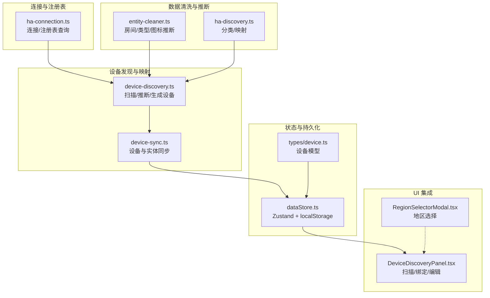
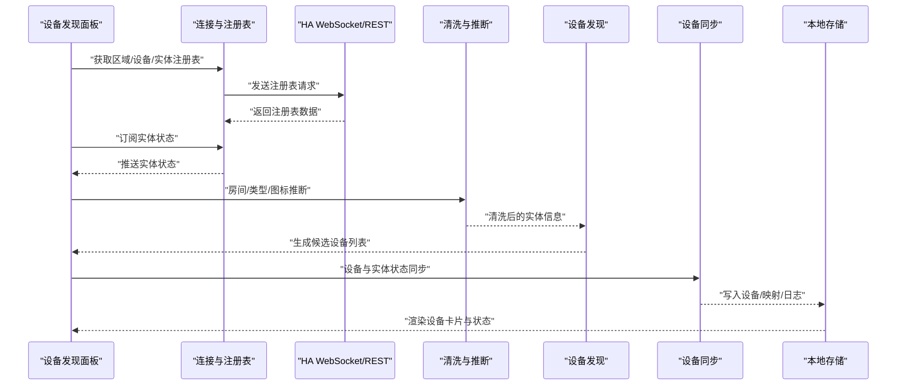
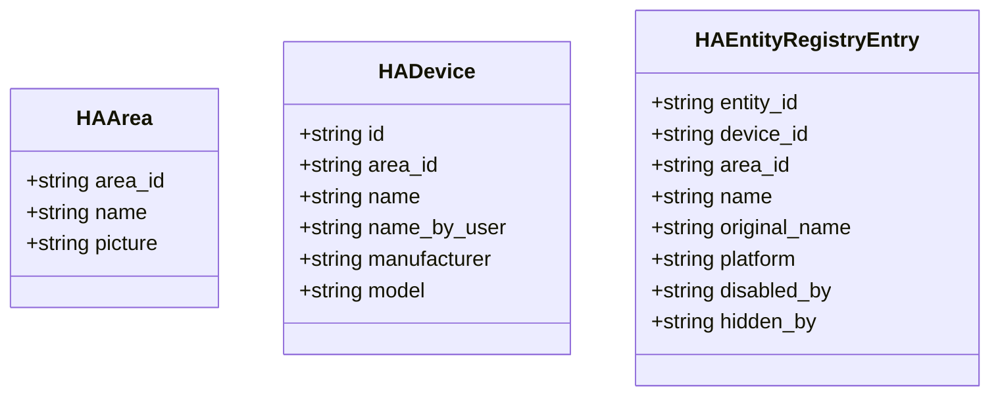
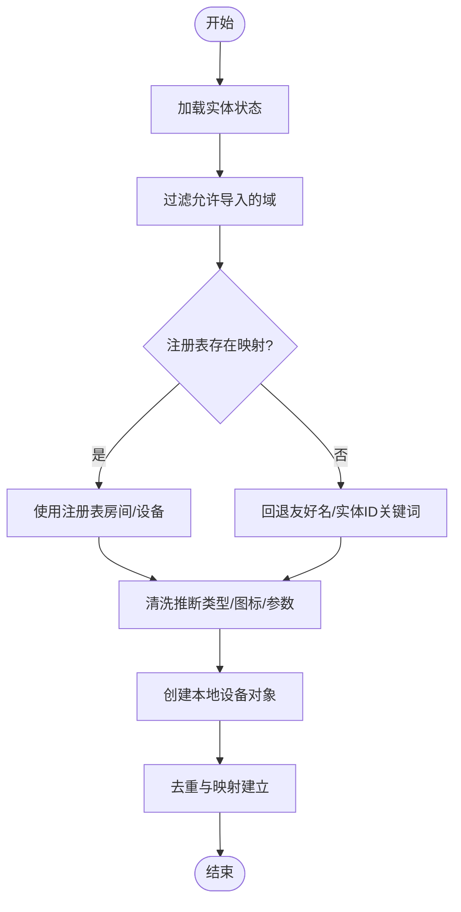
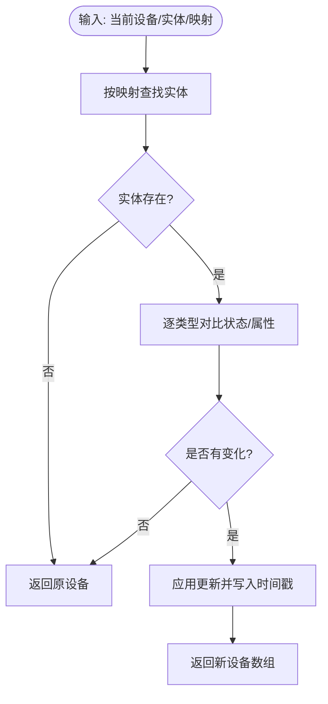
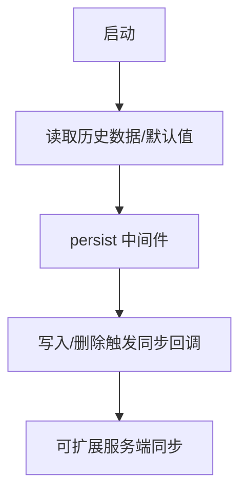
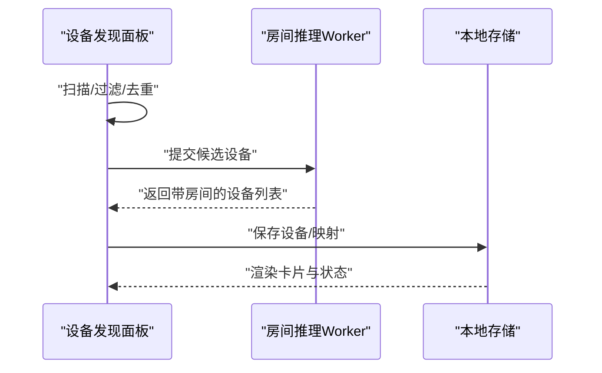
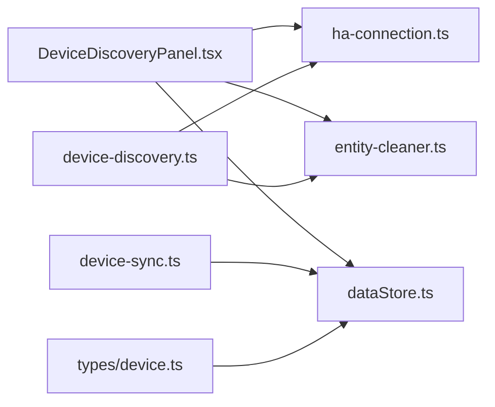

# 注册表管理

<cite>
**本文档引用的文件**   
- [src/utils/ha-connection.ts](file://src/utils/ha-connection.ts)
- [src/utils/ha-discovery.ts](file://src/utils/ha-discovery.ts)
- [src/utils/device-discovery.ts](file://src/utils/device-discovery.ts)
- [src/utils/device-sync.ts](file://src/utils/device-sync.ts)
- [src/utils/entity-cleaner.ts](file://src/utils/entity-cleaner.ts)
- [src/store/dataStore.ts](file://src/store/dataStore.ts)
- [src/app/components/settings/DeviceDiscoveryPanel.tsx](file://src/app/components/settings/DeviceDiscoveryPanel.tsx)
- [src/types/device.ts](file://src/types/device.ts)
- [src/utils/regions.ts](file://src/utils/regions.ts)
- [src/app/components/dashboard/RegionSelectorModal.tsx](file://src/app/components/dashboard/RegionSelectorModal.tsx)
</cite>

## 目录
1. [简介](#简介)
2. [项目结构](#项目结构)
3. [核心组件](#核心组件)
4. [架构总览](#架构总览)
5. [详细组件分析](#详细组件分析)
6. [依赖关系分析](#依赖关系分析)
7. [性能考量](#性能考量)
8. [故障排查指南](#故障排查指南)
9. [结论](#结论)
10. [附录](#附录)

## 简介
本文件系统性梳理 Home Assistant 注册表管理在前端侧的实现与最佳实践，覆盖区域、设备与实体注册表的数据结构与查询接口；解析注册表数据的获取、缓存与更新机制；阐述设备发现、实体映射与配置导入的自动化流程；并给出本地存储、版本管理与迁移策略建议。同时提供查询优化、数据完整性检查与冲突解决思路，以及设备识别、实体分类与配置同步的最佳实践。

## 项目结构
围绕注册表管理的关键模块分布如下：
- 连接与注册表查询：通过 WebSocket/REST 访问 HA 注册表，封装区域、设备、实体三项清单的获取接口
- 数据清洗与推断：基于实体友好名与 domain 推断房间、设备类型与图标
- 设备发现与映射：从实体状态构建本地设备视图，并与注册表联动
- 同步与状态管理：将设备与实体状态双向同步，持久化到本地存储
- UI 面板：提供设备扫描、绑定、编辑与批量操作界面

**图表来源**
- [src/utils/ha-connection.ts:177-187](file://src/utils/ha-connection.ts#L177-L187)
- [src/utils/entity-cleaner.ts:171-255](file://src/utils/entity-cleaner.ts#L171-L255)
- [src/utils/ha-discovery.ts:18-73](file://src/utils/ha-discovery.ts#L18-L73)
- [src/utils/device-discovery.ts:12-161](file://src/utils/device-discovery.ts#L12-L161)
- [src/utils/device-sync.ts:4-191](file://src/utils/device-sync.ts#L4-L191)
- [src/store/dataStore.ts:58-129](file://src/store/dataStore.ts#L58-L129)
- [src/types/device.ts:1-46](file://src/types/device.ts#L1-L46)
- [src/app/components/settings/DeviceDiscoveryPanel.tsx:34-515](file://src/app/components/settings/DeviceDiscoveryPanel.tsx#L34-L515)
- [src/app/components/dashboard/RegionSelectorModal.tsx:30-245](file://src/app/components/dashboard/RegionSelectorModal.tsx#L30-L245)

**章节来源**
- [src/utils/ha-connection.ts:177-187](file://src/utils/ha-connection.ts#L177-L187)
- [src/utils/device-discovery.ts:12-161](file://src/utils/device-discovery.ts#L12-L161)
- [src/utils/device-sync.ts:4-191](file://src/utils/device-sync.ts#L4-L191)
- [src/store/dataStore.ts:58-129](file://src/store/dataStore.ts#L58-L129)
- [src/app/components/settings/DeviceDiscoveryPanel.tsx:34-515](file://src/app/components/settings/DeviceDiscoveryPanel.tsx#L34-L515)

## 核心组件
- 注册表接口与连接
  - 提供区域、设备、实体注册表的查询方法，统一通过消息通道请求 HA
  - 封装连接建立、事件监听与断开逻辑
- 设备发现与映射
  - 从实体状态扫描可导入设备，结合注册表与清洗规则推断房间、类型、图标
  - 生成本地设备对象并维护设备 ID 到实体 ID 的映射
- 设备与实体同步
  - 将实体状态与属性映射到本地设备，按设备类型进行差异化更新
  - 保持设备在线状态、最后变更时间等元数据
- 本地存储与版本管理
  - 使用 Zustand + persist 将设备、房间、场景、用户、日志等持久化到 localStorage
  - 提供存储分区与变更触发同步的策略
- UI 集成
  - 设备发现面板支持扫描、筛选、绑定、批量绑定与编辑
  - 地区选择模态框用于天气等场景的地理信息配置

**章节来源**
- [src/utils/ha-connection.ts:149-187](file://src/utils/ha-connection.ts#L149-L187)
- [src/utils/device-discovery.ts:12-161](file://src/utils/device-discovery.ts#L12-L161)
- [src/utils/device-sync.ts:4-191](file://src/utils/device-sync.ts#L4-L191)
- [src/store/dataStore.ts:58-129](file://src/store/dataStore.ts#L58-L129)
- [src/app/components/settings/DeviceDiscoveryPanel.tsx:34-515](file://src/app/components/settings/DeviceDiscoveryPanel.tsx#L34-L515)

## 架构总览
下图展示从连接 HA 到设备面板的完整流程：连接建立与注册表拉取 → 实体状态订阅 → 设备发现与清洗 → 设备与实体同步 → 本地持久化与 UI 展示。

**图表来源**
- [src/utils/ha-connection.ts:177-187](file://src/utils/ha-connection.ts#L177-L187)
- [src/utils/ha-connection.ts:125-130](file://src/utils/ha-connection.ts#L125-L130)
- [src/utils/entity-cleaner.ts:171-255](file://src/utils/entity-cleaner.ts#L171-L255)
- [src/utils/device-discovery.ts:12-161](file://src/utils/device-discovery.ts#L12-L161)
- [src/utils/device-sync.ts:4-191](file://src/utils/device-sync.ts#L4-L191)
- [src/store/dataStore.ts:58-129](file://src/store/dataStore.ts#L58-L129)

## 详细组件分析

### 注册表接口与连接
- 数据结构
  - 区域：包含区域标识、名称与图片
  - 设备：包含设备标识、所属区域、厂商与型号等
  - 实体注册表：包含实体标识、设备/区域关联、平台、禁用/隐藏标记等
- 查询接口
  - 区域注册表、设备注册表、实体注册表分别提供异步获取方法
- 连接与可用性
  - 支持长连接认证、事件监听与断线重连提示
  - 提供 HTTP/WS 双通道可达性检测，以适配跨域与内网环境

**图表来源**
- [src/utils/ha-connection.ts:150-174](file://src/utils/ha-connection.ts#L150-L174)

**章节来源**
- [src/utils/ha-connection.ts:149-187](file://src/utils/ha-connection.ts#L149-L187)

### 设备发现与映射
- 发现流程
  - 从实体状态过滤允许导入的域
  - 优先使用注册表中的区域/设备信息，其次回退到友好名与实体 ID 关键词
  - 结合清洗规则推断设备类型与图标，提取设备参数
  - 生成本地设备对象并记录设备 ID → 实体 ID 映射
- 冲突与去重
  - 已存在的实体 ID 将被跳过
  - 对“幽灵设备”（未分配房间）进行覆盖绑定处理

**图表来源**
- [src/utils/device-discovery.ts:12-161](file://src/utils/device-discovery.ts#L12-L161)
- [src/utils/entity-cleaner.ts:171-255](file://src/utils/entity-cleaner.ts#L171-L255)

**章节来源**
- [src/utils/device-discovery.ts:12-161](file://src/utils/device-discovery.ts#L12-L161)
- [src/app/components/settings/DeviceDiscoveryPanel.tsx:176-174](file://src/app/components/settings/DeviceDiscoveryPanel.tsx#L176-L174)

### 设备与实体同步
- 同步策略
  - 按设备类型差异更新状态与属性（如开关/灯亮度/色温、窗帘位置、传感器数值、空调模式与温度等）
  - 维护设备在线状态、设备类别、最后更新/变更时间戳
- 性能优化
  - 仅在状态或属性发生变化时才返回新设备数组，避免不必要的重渲染
  - 通过映射表快速定位对应实体，减少遍历成本

**图表来源**
- [src/utils/device-sync.ts:4-191](file://src/utils/device-sync.ts#L4-L191)

**章节来源**
- [src/utils/device-sync.ts:4-191](file://src/utils/device-sync.ts#L4-L191)

### 本地存储与版本管理
- 存储方案
  - 使用 Zustand + persist 将设备、房间、场景、用户、日志等字段持久化到 localStorage
  - 自动在写入/删除时触发同步回调，便于扩展服务端同步
- 迁移策略
  - 通过加载器读取历史数据，若不存在则回退到初始值
  - 保证默认遥控器设备的存在，提升首次体验
- 版本与分区
  - 通过部分化策略仅持久化必要字段，降低存储体积与迁移成本

**图表来源**
- [src/store/dataStore.ts:58-129](file://src/store/dataStore.ts#L58-L129)

**章节来源**
- [src/store/dataStore.ts:58-129](file://src/store/dataStore.ts#L58-L129)

### UI 集成与交互
- 设备发现面板
  - 支持搜索、分类筛选、批量选择与一键绑定
  - 严格区分“已绑定”与“幽灵设备”，避免重复绑定
  - 通过 Web Worker 异步推理房间，提升大列表响应性能
- 地区选择
  - 支持省市区三级联动，直辖市特殊处理
  - 选择后可获取坐标并同步天气等场景

**图表来源**
- [src/app/components/settings/DeviceDiscoveryPanel.tsx:34-515](file://src/app/components/settings/DeviceDiscoveryPanel.tsx#L34-L515)
- [src/workers/room-inference.worker.ts](file://src/workers/room-inference.worker.ts)

**章节来源**
- [src/app/components/settings/DeviceDiscoveryPanel.tsx:34-515](file://src/app/components/settings/DeviceDiscoveryPanel.tsx#L34-L515)
- [src/app/components/dashboard/RegionSelectorModal.tsx:30-245](file://src/app/components/dashboard/RegionSelectorModal.tsx#L30-L245)

## 依赖关系分析
- 组件耦合
  - 设备发现依赖清洗与注册表数据，同步依赖设备映射表
  - UI 面板依赖连接层与清洗层，同时与本地存储解耦
- 外部依赖
  - home-assistant-js-websocket 提供连接与实体订阅能力
  - localStorage 作为轻量持久化介质
- 循环依赖
  - 代码组织上未见循环依赖迹象，模块职责清晰

**图表来源**
- [src/app/components/settings/DeviceDiscoveryPanel.tsx:34-515](file://src/app/components/settings/DeviceDiscoveryPanel.tsx#L34-L515)
- [src/utils/ha-connection.ts:177-187](file://src/utils/ha-connection.ts#L177-L187)
- [src/utils/entity-cleaner.ts:171-255](file://src/utils/entity-cleaner.ts#L171-L255)
- [src/utils/device-discovery.ts:12-161](file://src/utils/device-discovery.ts#L12-L161)
- [src/utils/device-sync.ts:4-191](file://src/utils/device-sync.ts#L4-L191)
- [src/store/dataStore.ts:58-129](file://src/store/dataStore.ts#L58-L129)
- [src/types/device.ts:1-46](file://src/types/device.ts#L1-L46)

**章节来源**
- [src/app/components/settings/DeviceDiscoveryPanel.tsx:34-515](file://src/app/components/settings/DeviceDiscoveryPanel.tsx#L34-L515)
- [src/utils/ha-connection.ts:177-187](file://src/utils/ha-connection.ts#L177-L187)
- [src/utils/device-discovery.ts:12-161](file://src/utils/device-discovery.ts#L12-L161)
- [src/utils/device-sync.ts:4-191](file://src/utils/device-sync.ts#L4-L191)
- [src/store/dataStore.ts:58-129](file://src/store/dataStore.ts#L58-L129)
- [src/types/device.ts:1-46](file://src/types/device.ts#L1-L46)

## 性能考量
- 扫描与推断
  - 使用 Map 快速构建注册表索引，降低查找复杂度
  - 将房间推断交给 Web Worker，避免阻塞主线程
- 同步更新
  - 仅在状态/属性变化时返回新数组，减少渲染与序列化开销
  - 通过映射表 O(1) 定位实体，避免全量遍历
- 存储与迁移
  - 仅持久化必要字段，缩短序列化时间
  - 历史数据加载采用容错策略，避免因异常中断初始化

[本节为通用性能建议，不直接分析具体文件]

## 故障排查指南
- 连接问题
  - 检查 URL 与 Token 配置，确认网络可达与认证有效
  - 观察连接事件日志，定位断线/重连/认证错误
- 注册表为空
  - 确认 HA 已启用相应注册表功能，或回退到 REST 获取
- 设备未显示
  - 检查实体是否被禁用/隐藏
  - 确认实体域在允许导入列表中
- 幽灵设备与重复绑定
  - 使用“已绑定/未绑定”状态与“幽灵设备”覆盖逻辑，避免重复映射
- 同步不同步
  - 核对设备映射表与实体 ID 是否一致
  - 检查设备类型分支是否覆盖目标实体属性

**章节来源**
- [src/utils/ha-connection.ts:47-105](file://src/utils/ha-connection.ts#L47-L105)
- [src/utils/ha-discovery.ts:36-40](file://src/utils/ha-discovery.ts#L36-L40)
- [src/app/components/settings/DeviceDiscoveryPanel.tsx:215-255](file://src/app/components/settings/DeviceDiscoveryPanel.tsx#L215-L255)

## 结论
本项目在前端侧实现了完整的 Home Assistant 注册表管理闭环：通过连接与注册表查询获取权威数据，结合清洗与推断生成高质量设备视图，再以映射表驱动设备与实体的高效同步，并以本地存储保障离线可用与配置持久化。UI 面板提供完善的设备扫描、绑定与批量操作能力，配合地区选择与天气同步，形成从数据到可视化的完整链路。建议后续在服务端同步、版本迁移与冲突仲裁方面进一步完善，以提升大规模场景下的稳定性与一致性。

[本节为总结性内容，不直接分析具体文件]

## 附录
- 数据模型与关键字段
  - 设备模型包含基础属性、可见性、自定义显示、空调/风扇/摆风等参数、HA 状态与时间戳等
  - 地区模型包含省市区层级与经纬度，直辖市特殊处理
- 最佳实践
  - 优先使用注册表信息确定房间与设备归属
  - 严格区分“幽灵设备”与真实设备，避免重复绑定
  - 对大列表场景启用异步房间推断与增量同步
  - 仅持久化必要字段，定期清理无效映射

**章节来源**
- [src/types/device.ts:1-46](file://src/types/device.ts#L1-L46)
- [src/utils/regions.ts:1-15](file://src/utils/regions.ts#L1-L15)
- [src/app/components/settings/DeviceDiscoveryPanel.tsx:176-174](file://src/app/components/settings/DeviceDiscoveryPanel.tsx#L176-L174)