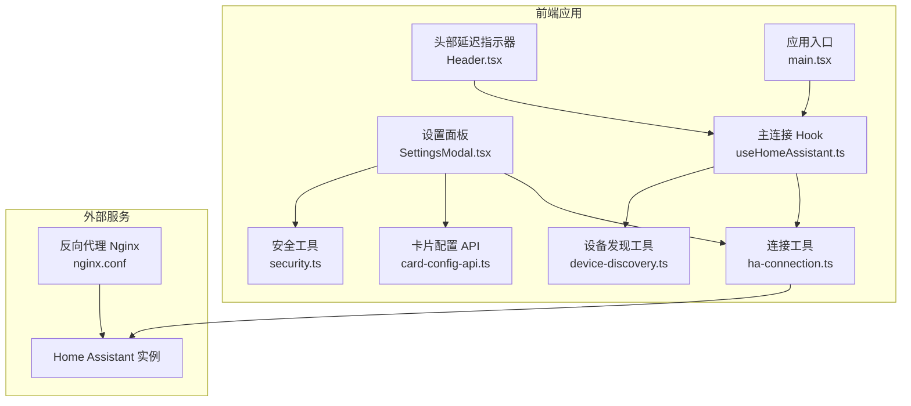
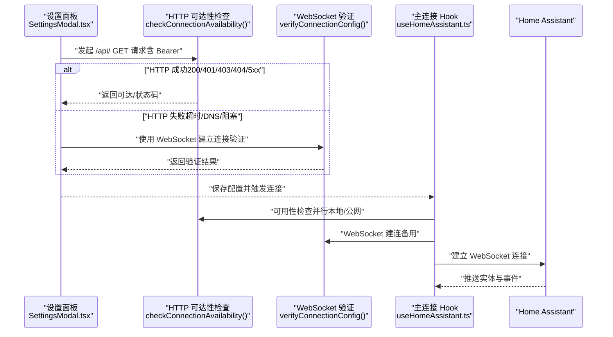
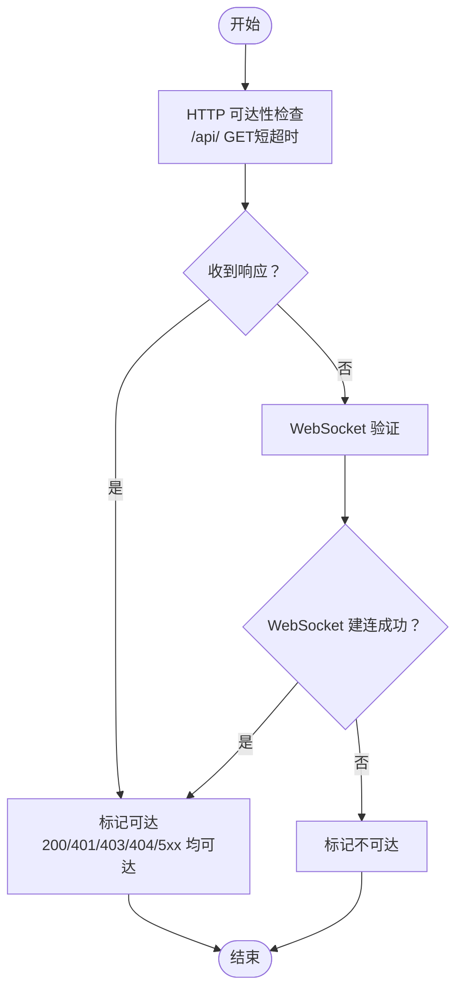
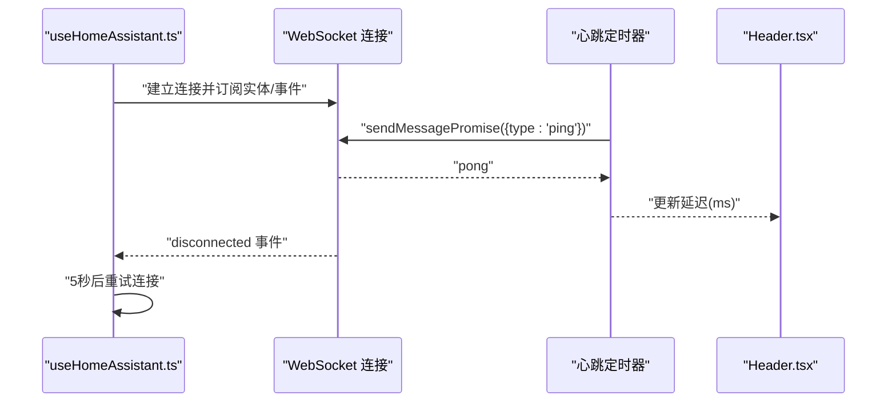
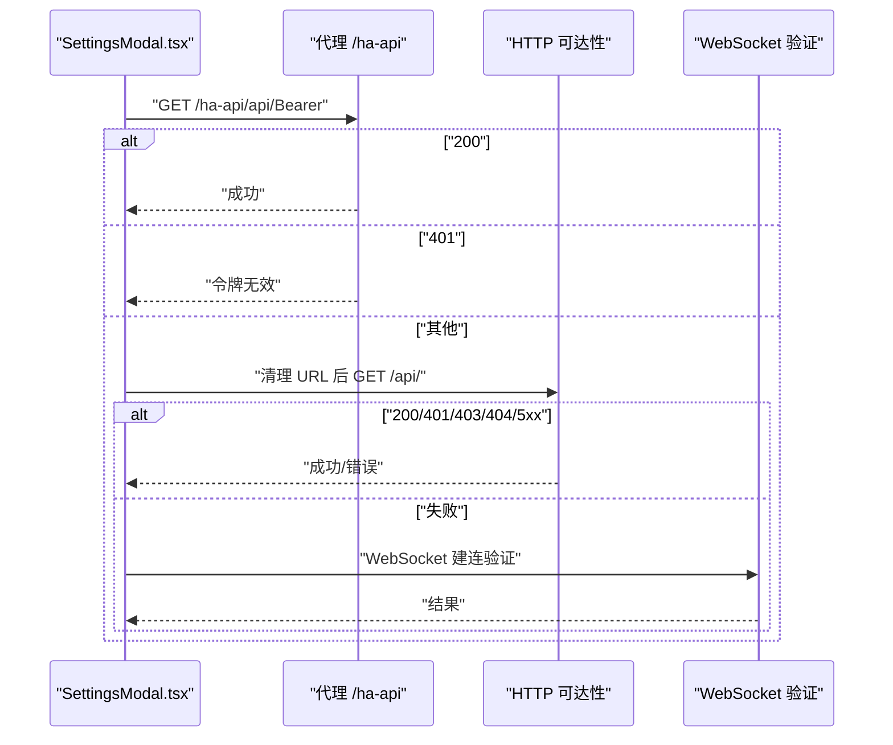
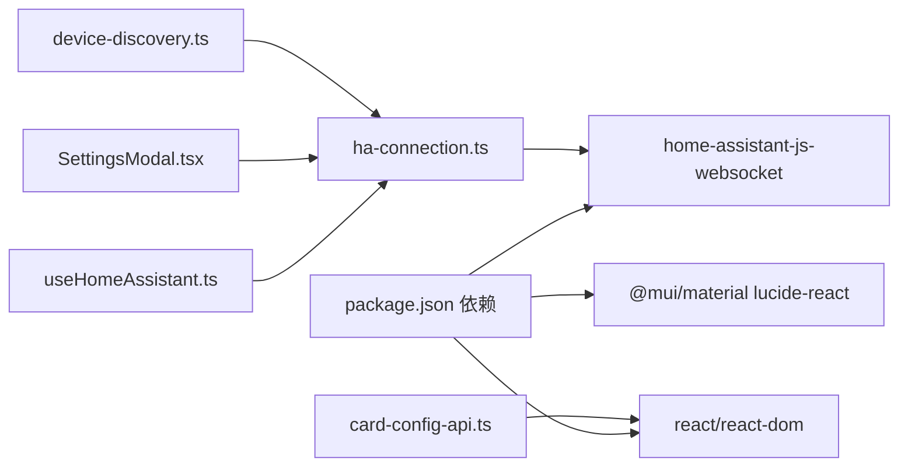
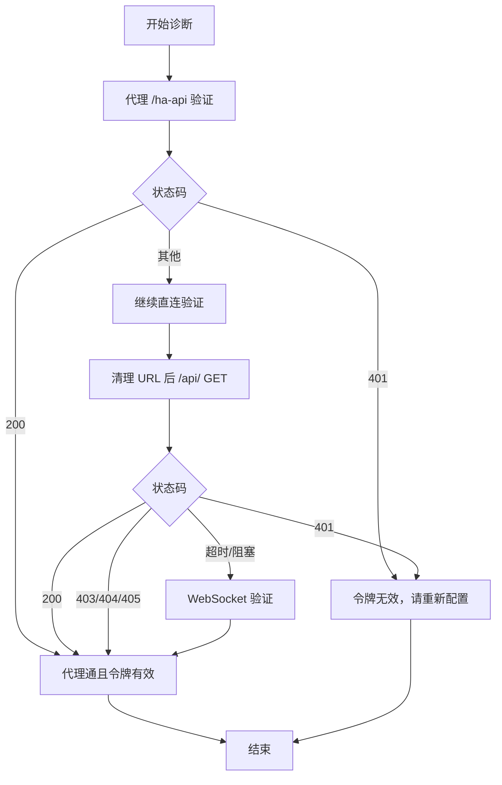

# 连接验证与诊断

<cite>
**本文引用的文件**   
- [src/utils/ha-connection.ts](file://src/utils/ha-connection.ts)
- [src/hooks/useHomeAssistant.ts](file://src/hooks/useHomeAssistant.ts)
- [src/app/components/SettingsModal.tsx](file://src/app/components/SettingsModal.tsx)
- [src/app/components/dashboard/Header.tsx](file://src/app/components/dashboard/Header.tsx)
- [src/utils/security.ts](file://src/utils/security.ts)
- [src/services/card-config-api.ts](file://src/services/card-config-api.ts)
- [src/tabs/settings/DeviceDiscoveryPanel.tsx](file://src/app/components/settings/DeviceDiscoveryPanel.tsx)
- [src/utils/device-discovery.ts](file://src/utils/device-discovery.ts)
- [src/main.tsx](file://src/main.tsx)
- [nginx.conf](file://nginx.conf)
- [package.json](file://package.json)
</cite>

## 目录
1. [引言](#引言)
2. [项目结构](#项目结构)
3. [核心组件](#核心组件)
4. [架构总览](#架构总览)
5. [详细组件分析](#详细组件分析)
6. [依赖关系分析](#依赖关系分析)
7. [性能考量](#性能考量)
8. [故障排查指南](#故障排查指南)
9. [结论](#结论)
10. [附录](#附录)

## 引言
本文件聚焦 Home Assistant 连接验证与诊断能力，覆盖以下主题：
- 连接可用性检查：HTTP 与 WebSocket 双通道验证，URL 可达性与配置正确性检测
- 网络环境诊断：内网直连、公网访问、代理（/ha-api）与反向代理（Nginx）场景
- 安全配置检查：令牌有效性、加密存储与传输、证书与协议要求
- 连接性能评估：延迟测量（WebSocket ping）、心跳与事件流健康度
- 常见问题诊断：错误代码与日志解读、重连与降级策略
- 诊断工具与流程：设置面板中的“连接验证”、可用性检查函数、心跳指标展示

## 项目结构
围绕连接验证与诊断的关键模块如下：
- 连接与可用性检查：src/utils/ha-connection.ts
- 主连接生命周期与心跳：src/hooks/useHomeAssistant.ts
- 设置面板中的连接验证与 UI 状态：src/app/components/SettingsModal.tsx
- 延迟指标展示：src/app/components/dashboard/Header.tsx
- 令牌加密与解密：src/utils/security.ts
- 卡片配置 REST 接口：src/services/card-config-api.ts
- 设备发现与注册表获取：src/utils/device-discovery.ts
- 应用启动与配置同步：src/main.tsx
- 反向代理与静态资源：nginx.conf
- 依赖与版本：package.json

图表来源
- [src/app/components/SettingsModal.tsx](file://src/app/components/SettingsModal.tsx)
- [src/hooks/useHomeAssistant.ts](file://src/hooks/useHomeAssistant.ts)
- [src/utils/ha-connection.ts](file://src/utils/ha-connection.ts)
- [src/utils/security.ts](file://src/utils/security.ts)
- [src/services/card-config-api.ts](file://src/services/card-config-api.ts)
- [src/utils/device-discovery.ts](file://src/utils/device-discovery.ts)
- [src/app/components/dashboard/Header.tsx](file://src/app/components/dashboard/Header.tsx)
- [src/main.tsx](file://src/main.tsx)
- [nginx.conf](file://nginx.conf)

章节来源
- [src/utils/ha-connection.ts](file://src/utils/ha-connection.ts)
- [src/hooks/useHomeAssistant.ts](file://src/hooks/useHomeAssistant.ts)
- [src/app/components/SettingsModal.tsx](file://src/app/components/SettingsModal.tsx)
- [src/app/components/dashboard/Header.tsx](file://src/app/components/dashboard/Header.tsx)
- [src/utils/security.ts](file://src/utils/security.ts)
- [src/services/card-config-api.ts](file://src/services/card-config-api.ts)
- [src/utils/device-discovery.ts](file://src/utils/device-discovery.ts)
- [src/main.tsx](file://src/main.tsx)
- [nginx.conf](file://nginx.conf)

## 核心组件
- 连接与可用性检查
  - HTTP 可达性检查：对 /api/ 发起短超时请求，容忍 401/403/404/5xx，只要能收到响应即视为可达
  - WebSocket 验证：在 HTTP 失败或被 CORS 阻挡时，使用 WebSocket 建立连接进行验证
  - 最佳连接选择：并行检查本地与公网 URL，返回首个可达的 URL
- 主连接生命周期与心跳
  - 自动选择最佳 URL 并建立 WebSocket 连接
  - 心跳与延迟：周期性发送 ping，计算往返时间并在 UI 展示
  - 断线重连：监听断开事件，定时重试
- 设置面板中的连接验证
  - 支持三种场景：代理（/ha-api）直连、用户配置直连
  - 代理 200 表示代理通且令牌有效；401 明确令牌无效；其余状态继续直连验证
- 安全与配置
  - 令牌加密存储与解密，避免明文泄露
  - 默认令牌检测与错误提示
- 性能与诊断
  - 延迟指标可视化
  - REST 与 WebSocket 双通道数据获取回退策略

章节来源
- [src/utils/ha-connection.ts](file://src/utils/ha-connection.ts)
- [src/hooks/useHomeAssistant.ts](file://src/hooks/useHomeAssistant.ts)
- [src/app/components/SettingsModal.tsx](file://src/app/components/SettingsModal.tsx)
- [src/app/components/dashboard/Header.tsx](file://src/app/components/dashboard/Header.tsx)
- [src/utils/security.ts](file://src/utils/security.ts)

## 架构总览
下图展示“设置面板验证”与“主连接 Hook”的协作流程，以及与 Home Assistant 的交互路径。

图表来源
- [src/app/components/SettingsModal.tsx](file://src/app/components/SettingsModal.tsx)
- [src/utils/ha-connection.ts](file://src/utils/ha-connection.ts)
- [src/hooks/useHomeAssistant.ts](file://src/hooks/useHomeAssistant.ts)

## 详细组件分析

### 组件一：连接可用性检查（HTTP 与 WebSocket）
- HTTP 可达性检查
  - 目的：快速判断目标 URL 是否可达，容忍鉴权错误与路径错误
  - 关键点：短超时、携带 Authorization 头、忽略网络错误并回退到 WebSocket
- WebSocket 验证
  - 目的：绕过 CORS 限制，验证 WebSocket 能否建立
  - 关键点：独立连接，不影响全局连接状态
- 最佳连接选择
  - 并行检查本地与公网 URL，返回首个可达项
  - 适用于多网络环境（内网直连 vs 外网代理）

图表来源
- [src/utils/ha-connection.ts](file://src/utils/ha-connection.ts)

章节来源
- [src/utils/ha-connection.ts](file://src/utils/ha-connection.ts)

### 组件二：主连接生命周期与心跳（useHomeAssistant）
- 生命周期
  - 选择最佳 URL（若提供本地/公网）
  - 建立 WebSocket 连接，订阅实体与事件
  - 获取区域/设备/实体注册表
  - 断线重连与错误处理
- 心跳与延迟
  - 每 10 秒发送 ping，计算往返时间
  - UI 根据延迟区间高亮显示

图表来源
- [src/hooks/useHomeAssistant.ts](file://src/hooks/useHomeAssistant.ts)
- [src/app/components/dashboard/Header.tsx](file://src/app/components/dashboard/Header.tsx)

章节来源
- [src/hooks/useHomeAssistant.ts](file://src/hooks/useHomeAssistant.ts)
- [src/app/components/dashboard/Header.tsx](file://src/app/components/dashboard/Header.tsx)

### 组件三：设置面板中的连接验证（SettingsModal）
- 三种验证场景
  - 代理直连：/ha-api/api/，200 表示代理通且令牌有效；401 明确令牌无效
  - 用户配置直连：清理 URL 后对 /api/ 发起请求，依据状态码判定
- 自动验证与防抖
  - 输入变化 1 秒后自动验证
  - 若主连接已建立，直接信任并置为成功

图表来源
- [src/app/components/SettingsModal.tsx](file://src/app/components/SettingsModal.tsx)

章节来源
- [src/app/components/SettingsModal.tsx](file://src/app/components/SettingsModal.tsx)

### 组件四：REST 与 WebSocket 双通道数据获取
- REST 回退策略
  - WebSocket 获取 states 失败时，回退到 REST /api/states
  - 单独的 REST 获取单个实体状态
- 卡片配置 REST 接口
  - 通过 /api/yinkun_ui/card_config 读取与保存卡片配置

章节来源
- [src/hooks/useHomeAssistant.ts](file://src/hooks/useHomeAssistant.ts)
- [src/services/card-config-api.ts](file://src/services/card-config-api.ts)

### 组件五：安全配置与令牌处理
- 令牌加密存储
  - Base64 混淆，降低截图泄露风险
  - 解密兼容旧版 AES 特征，避免依赖丢失时回退
- 默认令牌检测
  - 发现默认令牌时抛出明确错误，引导用户配置有效令牌

章节来源
- [src/utils/security.ts](file://src/utils/security.ts)
- [src/utils/ha-connection.ts](file://src/utils/ha-connection.ts)

### 组件六：网络环境与代理配置
- 代理与反向代理
  - /ha-api 作为代理端点，用于 Ingress 或本地代理场景
  - Nginx 提供静态资源与可选的 /ha-api 反代（需手动启用）
- 应用启动与配置同步
  - 启动阶段从后端拉取配置并注入 localStorage，保证跨设备一致性

章节来源
- [src/app/components/SettingsModal.tsx](file://src/app/components/SettingsModal.tsx)
- [nginx.conf](file://nginx.conf)
- [src/main.tsx](file://src/main.tsx)

## 依赖关系分析
- 外部库
  - home-assistant-js-websocket：WebSocket 连接、认证、消息收发
  - react、react-dom：UI 与生命周期
  - @mui/material、lucide-react：UI 组件与图标
- 内部模块
  - 连接工具与 Hook：统一管理连接、可用性检查、心跳
  - 设置面板：负责输入校验、验证与保存
  - 设备发现：基于实体与注册表推断设备信息

图表来源
- [package.json](file://package.json)
- [src/utils/ha-connection.ts](file://src/utils/ha-connection.ts)
- [src/hooks/useHomeAssistant.ts](file://src/hooks/useHomeAssistant.ts)
- [src/app/components/SettingsModal.tsx](file://src/app/components/SettingsModal.tsx)
- [src/utils/device-discovery.ts](file://src/utils/device-discovery.ts)
- [src/services/card-config-api.ts](file://src/services/card-config-api.ts)

章节来源
- [package.json](file://package.json)

## 性能考量
- 延迟测量
  - WebSocket ping/pong 计算往返时间，UI 分档高亮（低/中/高）
- 心跳频率
  - 每 10 秒一次，平衡实时性与开销
- 数据获取回退
  - WebSocket 失败时自动回退到 REST，保障可用性
- 并行可用性检查
  - 最佳连接选择并行检查本地与公网 URL，缩短首次连接时间

章节来源
- [src/hooks/useHomeAssistant.ts](file://src/hooks/useHomeAssistant.ts)
- [src/app/components/dashboard/Header.tsx](file://src/app/components/dashboard/Header.tsx)
- [src/utils/ha-connection.ts](file://src/utils/ha-connection.ts)

## 故障排查指南

### 常见连接问题与诊断步骤
- 代理（/ha-api）验证失败
  - 200：代理通且令牌有效
  - 401：明确令牌无效，需重新配置
  - 其余：代理不可达，继续直连验证
- 直连 URL 验证失败
  - 401：令牌无效或权限不足
  - 403/404/405：代理通但方法/路径错误，继续直连
  - 超时/DNS/阻塞：考虑 WebSocket 验证或更换网络
- 默认令牌
  - 发现默认令牌时，抛出明确错误，需在设置中替换为有效令牌
- 断线与重连
  - 监听断开事件，5 秒后自动重试
  - 心跳失败时清空延迟值，等待恢复

图表来源
- [src/app/components/SettingsModal.tsx](file://src/app/components/SettingsModal.tsx)
- [src/utils/ha-connection.ts](file://src/utils/ha-connection.ts)

章节来源
- [src/app/components/SettingsModal.tsx](file://src/app/components/SettingsModal.tsx)
- [src/utils/ha-connection.ts](file://src/utils/ha-connection.ts)

### 错误代码解释与建议
- 200：成功，连接正常
- 401：未授权，令牌无效或过期
- 403：禁止，令牌有效但无权限
- 404：路径错误，服务器可达但接口不存在
- 405：方法不允许，代理或服务器配置问题
- 超时/阻塞：网络异常、DNS 失败、CORS 阻挡

### 安全配置检查
- 令牌有效性
  - 使用设置面板验证令牌，优先代理 200
  - 避免使用默认令牌，及时替换为长期访问令牌
- 存储与传输
  - 令牌本地加密存储，减少泄露风险
  - 传输使用 HTTPS，避免中间人攻击
- 证书与协议
  - 公网访问建议使用 HTTPS 与有效证书
  - 内网直连注意防火墙与端口开放

章节来源
- [src/app/components/SettingsModal.tsx](file://src/app/components/SettingsModal.tsx)
- [src/utils/security.ts](file://src/utils/security.ts)
- [src/utils/ha-connection.ts](file://src/utils/ha-connection.ts)

### 网络环境检测与代理配置
- 代理（/ha-api）
  - 用于 Ingress 或本地代理场景，简化跨域与鉴权
  - Nginx 可选反代（需手动启用），便于统一入口
- 反向代理与静态资源
  - Nginx 提供安全头与缓存策略，静态资源可长期缓存
- 本地与公网直连
  - 并行检查本地与公网 URL，自动选择最佳路径
  - WebSocket 验证可绕过 CORS 限制

章节来源
- [src/app/components/SettingsModal.tsx](file://src/app/components/SettingsModal.tsx)
- [nginx.conf](file://nginx.conf)
- [src/utils/ha-connection.ts](file://src/utils/ha-connection.ts)

## 结论
本项目提供了完善的连接验证与诊断能力：
- 双通道验证（HTTP 与 WebSocket）覆盖主流网络环境
- 设置面板与主连接 Hook 协同，提供即时反馈与自动重连
- 延迟指标与注册表获取增强可观测性
- 安全工具与默认令牌检测提升安全性
建议在生产环境中结合代理与 HTTPS，配合定期心跳与断线重试，确保稳定体验。

## 附录

### 诊断工具与流程速查
- 设置面板验证
  - 代理直连：/ha-api/api/
  - 用户直连：清理 URL 后 /api/
  - WebSocket 验证：独立建连
- 主连接 Hook
  - 自动选择最佳 URL
  - 心跳与延迟展示
  - 断线重连与错误处理
- REST 回退
  - states 获取失败时回退到 REST
  - 单实体状态 REST 获取

章节来源
- [src/app/components/SettingsModal.tsx](file://src/app/components/SettingsModal.tsx)
- [src/hooks/useHomeAssistant.ts](file://src/hooks/useHomeAssistant.ts)
- [src/utils/ha-connection.ts](file://src/utils/ha-connection.ts)
- [src/services/card-config-api.ts](file://src/services/card-config-api.ts)