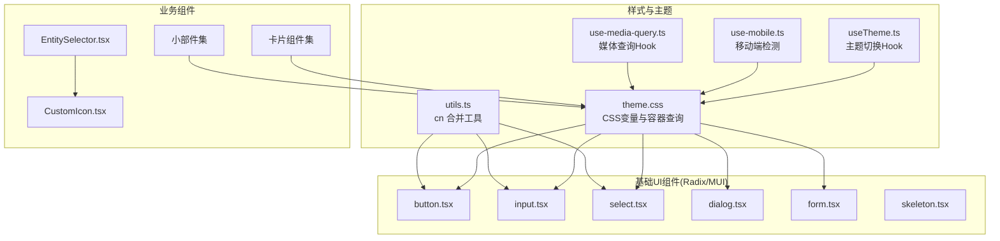
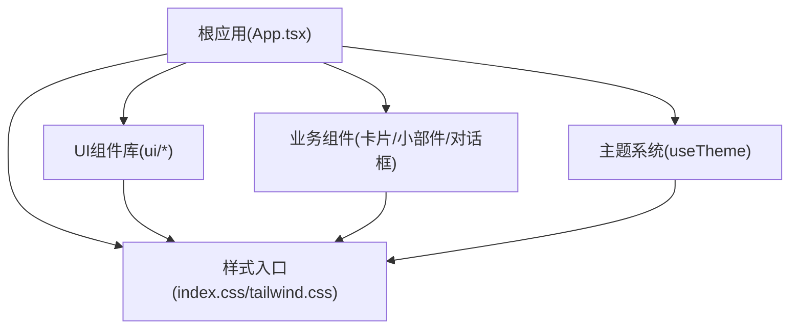
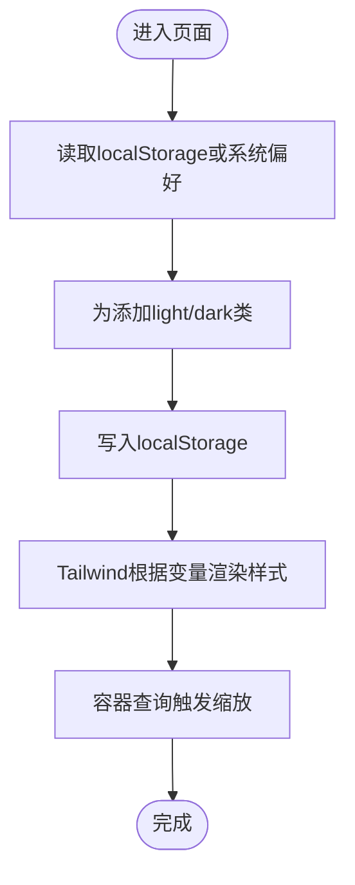
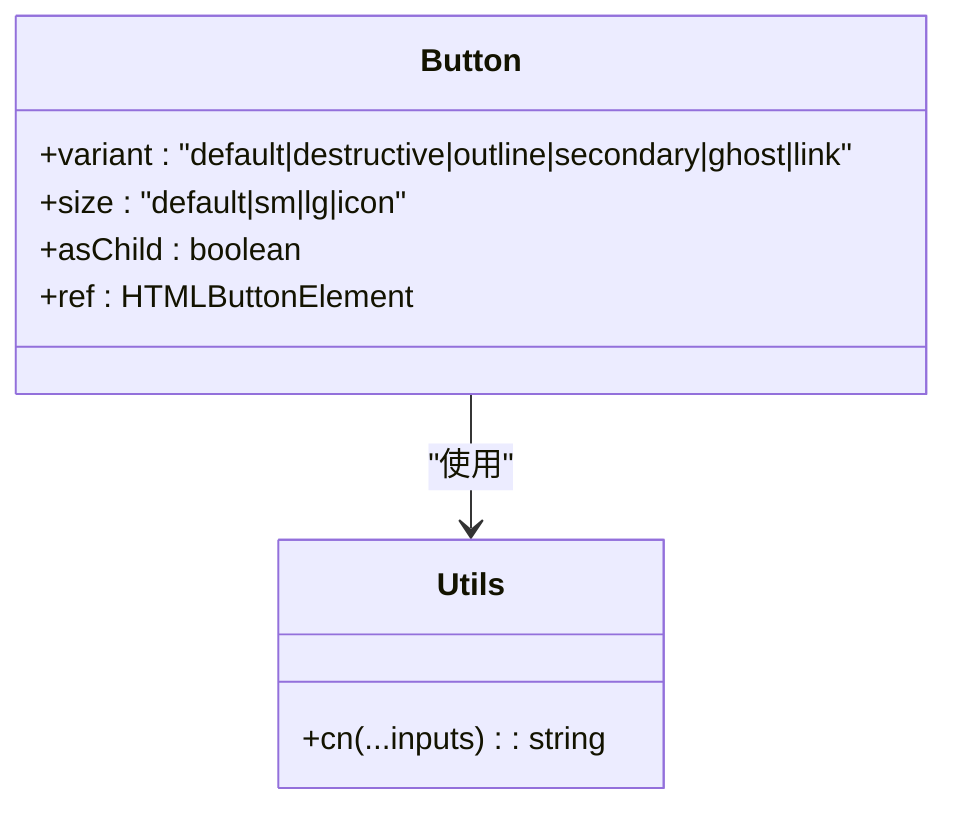
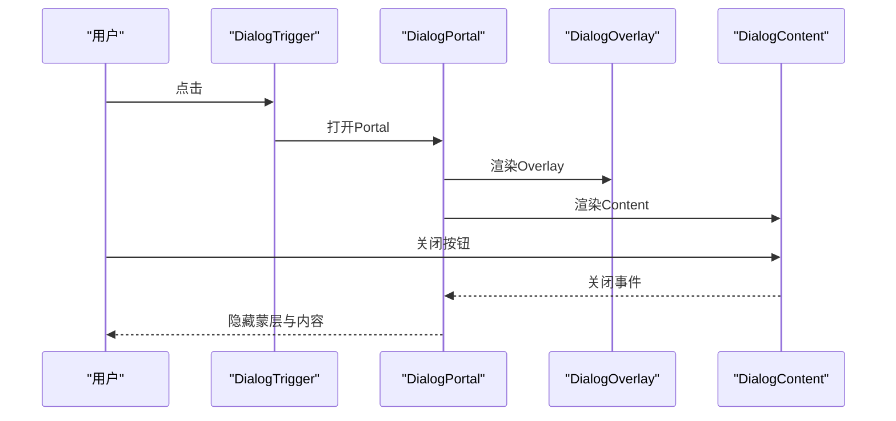
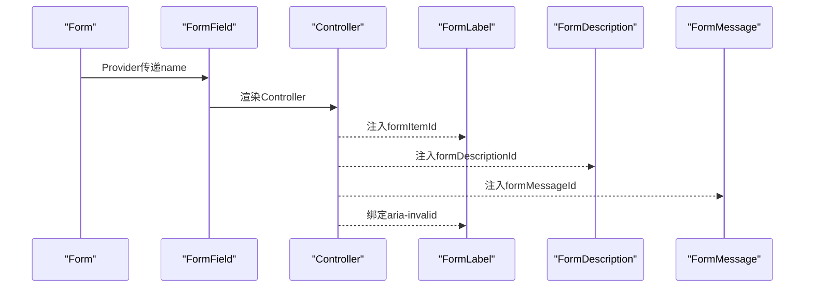
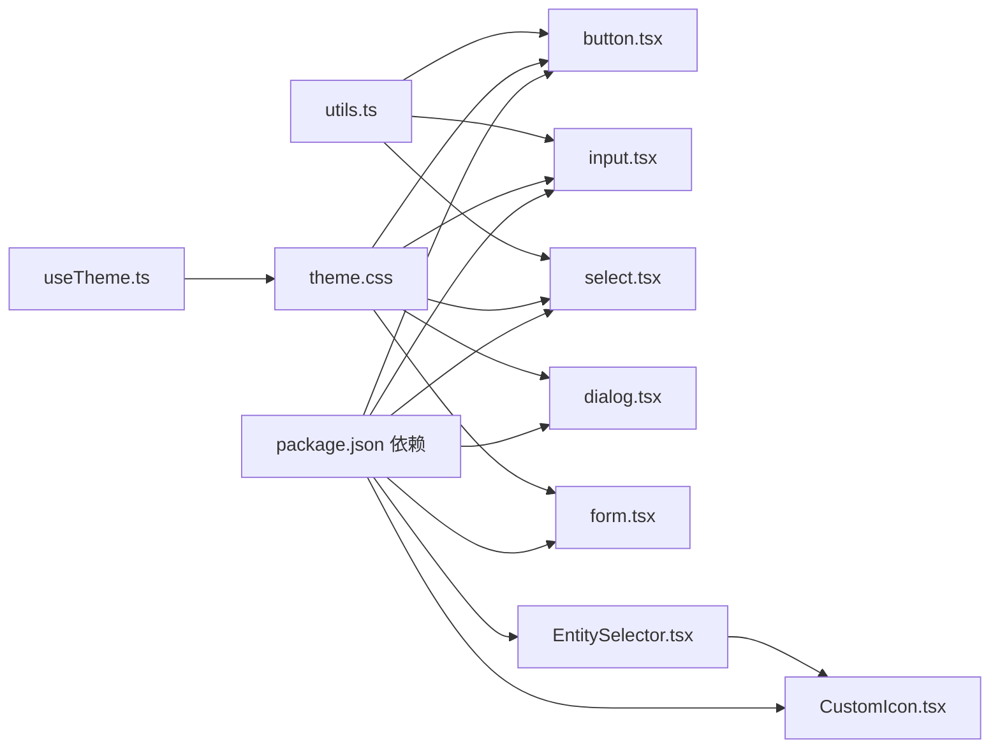

# UI组件系统

<cite>
**本文引用的文件**
- [README.md](file://README.md)
- [package.json](file://package.json)
- [theme.css](file://src/styles/theme.css)
- [useTheme.ts](file://src/hooks/useTheme.ts)
- [utils.ts](file://src/app/components/ui/utils.ts)
- [button.tsx](file://src/app/components/ui/button.tsx)
- [dialog.tsx](file://src/app/components/ui/dialog.tsx)
- [form.tsx](file://src/app/components/ui/form.tsx)
- [input.tsx](file://src/app/components/ui/input.tsx)
- [select.tsx](file://src/app/components/ui/select.tsx)
- [use-mobile.ts](file://src/app/components/ui/use-mobile.ts)
- [use-media-query.ts](file://src/hooks/use-media-query.ts)
- [skeleton.tsx](file://src/app/components/ui/skeleton.ts)
- [EntitySelector.tsx](file://src/app/components/common/EntitySelector.tsx)
- [CustomIcon.tsx](file://src/app/components/dashboard/cards/shared/CustomIcon.tsx)
- [widgetRegistry.tsx](file://src/app/components/dashboard/widgets/widgetRegistry.tsx)
- [IconPicker.tsx](file://src/app/components/dashboard/IconPicker.tsx)
- [IconPickerPopover.tsx](file://src/app/components/dashboard/IconPickerPopover.tsx)
- [RemoteCard.tsx](file://src/app/components/remote/RemoteCard.tsx)
- [RemoteControlModal.tsx](file://src/app/components/remote/RemoteControlModal.tsx)
- [AiChatWidget.tsx](file://src/app/components/AiChatWidget.tsx)
- [StatisticsPanel.tsx](file://src/app/components/dashboard/StatisticsPanel.tsx)
- [ClimateControl.tsx](file://src/app/components/dashboard/cards/ClimateControl.tsx)
- [LightControl.tsx](file://src/app/components/dashboard/cards/LightControl.tsx)
- [CurtainControl.tsx](file://src/app/components/dashboard/cards/CurtainControl.tsx)
- [SensorStatusCard.tsx](file://src/app/components/dashboard/cards/SensorStatusCard.tsx)
- [IndoorEnvironmentCard.tsx](file://src/app/components/dashboard/cards/IndoorEnvironment/IndoorEnvironmentCard.tsx)
- [ConfigurableEntityCard.tsx](file://src/app/components/dashboard/cards/shared/ConfigurableEntityCard.tsx)
- [CardSettingsPanel.tsx](file://src/app/components/dashboard/cards/shared/CardSettingsPanel.tsx)
- [CardSettings.validation.ts](file://src/app/components/dashboard/cards/shared/cardSettings.validation.ts)
- [AiSettingsModal.tsx](file://src/app/components/AiSettingsModal.tsx)
- [SettingsModal.tsx](file://src/app/components/SettingsModal.tsx)
- [ErrorBoundary.tsx](file://src/app/components/ErrorBoundary.tsx)
- [App.tsx](file://src/app/App.tsx)
- [index.css](file://src/styles/index.css)
- [tailwind.css](file://src/styles/tailwind.css)
- [main.tsx](file://src/main.tsx)
- [cypress.config.ts](file://cypress.config.ts)
- [setup.ts](file://src/test/setup.ts)
- [device-sync.light.test.ts](file://src/utils/__tests__/device-sync.light.test.ts)
- [remote-input.test.ts](file://src/utils/__tests__/remote-input.test.ts)
- [LocationService.test.ts](file://src/services/__tests__/LocationService.test.ts)
- [DeviceDiscoveryPanel.test.tsx](file://src/app/components/settings/__tests__/DeviceDiscoveryPanel.test.tsx)
- [AiChatWidget.test.tsx](file://src/app/components/__tests__/AiChatWidget.test.tsx)
- [SettingsModalDeleteDevice.test.tsx](file://src/app/components/__tests__/SettingsModalDeleteDevice.test.tsx)
- [SettingsModalWindow.test.tsx](file://src/app/components/__tests__/SettingsModalWindow.test.tsx)
- [DeviceCardCurtain.test.tsx](file://src/app/components/dashboard/__tests__/DeviceCardCurtain.test.tsx)
- [DeviceCardLightOffBrightness.test.tsx](file://src/app/components/dashboard/__tests__/DeviceCardLightOffBrightness.test.tsx)
- [DeviceCardSensorStatus.test.tsx](file://src/app/components/dashboard/__tests__/DeviceCardSensorStatus.test.tsx)
- [IconPicker.filter.test.tsx](file://src/app/components/dashboard/__tests__/IconPicker.filter.test.tsx)
- [IconPickerPopover.test.tsx](file://src/app/components/dashboard/__tests__/IconPickerPopover.test.tsx)
- [RegionSelectorModal.test.tsx](file://src/app/components/dashboard/__tests__/RegionSelectorModal.test.tsx)
- [SensorTimestamp.test.tsx](file://src/app/components/dashboard/__tests__/SensorTimestamp.test.tsx)
- [StatisticsPanelIndoorEnvironmentRefresh.test.tsx](file://src/app/components/dashboard/__tests__/StatisticsPanelIndoorEnvironmentRefresh.test.tsx)
- [RemoteCardQuickKeys.test.tsx](file://src/app/components/remote/__tests__/RemoteCardQuickKeys.test.tsx)
- [RemoteControlModal.test.tsx](file://src/app/components/remote/__tests__/RemoteControlModal.test.tsx)
- [DeviceDiscoveryPanelStability.test.tsx](file://src/app/components/settings/__tests__/DeviceDiscoveryPanelStability.test.tsx)
- [DeviceEditorForm.test.tsx](file://src/app/components/settings/__tests__/DeviceEditorForm.test.tsx)
- [RoomManagementTab.test.tsx](file://src/app/components/settings/__tests__/RoomManagementTab.test.tsx)
- [SettingsDeviceCard.test.tsx](file://src/app/components/settings/__tests__/SettingsDeviceCard.test.tsx)
- [weather-factory.test.ts](file://src/services/weather/__tests__/weather-factory.test.ts)
</cite>

## 目录
1. [引言](#引言)
2. [项目结构](#项目结构)
3. [核心组件](#核心组件)
4. [架构总览](#架构总览)
5. [组件详解](#组件详解)
6. [依赖关系分析](#依赖关系分析)
7. [性能考量](#性能考量)
8. [故障排查指南](#故障排查指南)
9. [结论](#结论)
10. [附录](#附录)

## 引言
本设计文档面向HAUI的UI组件系统，系统性阐述基于Material UI与Radix UI的组件库使用方式、主题系统、样式定制与响应式设计策略；同时总结自定义组件的开发规范、API设计与可复用性考虑；并覆盖交互设计原则、动画效果实现、用户体验优化策略；最后给出可访问性支持、国际化适配与跨浏览器兼容性的实践建议，并提供组件测试策略、文档编写与版本管理的最佳实践，以及扩展与自定义开发的指导原则。

## 项目结构
HAUI采用React 18 + Vite + Tailwind CSS技术栈，UI组件主要位于src/app/components/ui目录下，配合自定义Hook与工具函数实现主题、响应式与表单体系；样式通过CSS变量与Tailwind原子类组合，形成以“主题色板 + 容器查询 + 动画过渡”为核心的视觉与交互基座。

图示来源
- [theme.css:1-207](file://src/styles/theme.css#L1-L207)
- [utils.ts:1-7](file://src/app/components/ui/utils.ts#L1-L7)
- [useTheme.ts:1-26](file://src/hooks/useTheme.ts#L1-L26)
- [use-mobile.ts:1-22](file://src/app/components/ui/use-mobile.ts#L1-L22)
- [use-media-query.ts:1-35](file://src/hooks/use-media-query.ts#L1-L35)
- [button.tsx:1-57](file://src/app/components/ui/button.tsx#L1-L57)
- [input.tsx:1-22](file://src/app/components/ui/input.tsx#L1-L22)
- [select.tsx:1-190](file://src/app/components/ui/select.tsx#L1-L190)
- [dialog.tsx:1-135](file://src/app/components/ui/dialog.tsx#L1-L135)
- [form.tsx:1-169](file://src/app/components/ui/form.tsx#L1-L169)
- [skeleton.tsx:1-14](file://src/app/components/ui/skeleton.tsx#L1-L14)
- [EntitySelector.tsx:1-71](file://src/app/components/common/EntitySelector.tsx#L1-L71)
- [CustomIcon.tsx:1-74](file://src/app/components/dashboard/cards/shared/CustomIcon.tsx#L1-L74)

章节来源
- [README.md:1-84](file://README.md#L1-L84)
- [package.json:1-132](file://package.json#L1-L132)

## 核心组件
本节聚焦UI组件库的核心构成与职责边界：
- 主题系统：通过CSS变量与Tailwind层化规则，统一色彩、圆角、阴影与字体层级；支持明暗主题切换与持久化。
- 基础组件：基于Radix UI与部分Material UI组件封装，提供语义化数据槽(data-slot)、无障碍属性与动画过渡。
- 表单体系：集成react-hook-form，提供字段上下文、错误传播与ARIA状态绑定。
- 响应式与容器查询：结合useIsMobile与容器查询，实现卡片与图标在不同宽度下的缩放与布局调整。
- 自定义组件：实体选择器、图标渲染器等，满足业务场景的高复用需求。

章节来源
- [theme.css:1-207](file://src/styles/theme.css#L1-L207)
- [useTheme.ts:1-26](file://src/hooks/useTheme.ts#L1-L26)
- [button.tsx:1-57](file://src/app/components/ui/button.tsx#L1-L57)
- [dialog.tsx:1-135](file://src/app/components/ui/dialog.tsx#L1-L135)
- [form.tsx:1-169](file://src/app/components/ui/form.tsx#L1-L169)
- [input.tsx:1-22](file://src/app/components/ui/input.tsx#L1-L22)
- [select.tsx:1-190](file://src/app/components/ui/select.tsx#L1-L190)
- [use-mobile.ts:1-22](file://src/app/components/ui/use-mobile.ts#L1-L22)
- [EntitySelector.tsx:1-71](file://src/app/components/common/EntitySelector.tsx#L1-L71)
- [CustomIcon.tsx:1-74](file://src/app/components/dashboard/cards/shared/CustomIcon.tsx#L1-L74)

## 架构总览
UI组件系统围绕“主题 → 组件 → 业务”的分层组织，主题层提供全局变量与变体；组件层提供可组合的基础UI；业务层通过卡片、小部件与对话框等模块化组件实现功能闭环。

图示来源
- [App.tsx](file://src/app/App.tsx)
- [useTheme.ts:1-26](file://src/hooks/useTheme.ts#L1-L26)
- [index.css](file://src/styles/index.css)
- [tailwind.css](file://src/styles/tailwind.css)
- [button.tsx:1-57](file://src/app/components/ui/button.tsx#L1-L57)
- [dialog.tsx:1-135](file://src/app/components/ui/dialog.tsx#L1-L135)

## 组件详解

### 主题系统与样式定制
- CSS变量与Tailwind层化：通过CSS自定义属性与@theme指令，将变量映射为Tailwind可用的color/radius等令牌；在@layer base中定义默认排版与尺寸，确保原子类优先级合理。
- 明暗主题：useTheme Hook读取localStorage或系统偏好，动态为documentElement添加light/dark类，实现主题切换与持久化。
- 容器查询：针对实体卡片容器进行宽度监听，按比例缩放图标、标签与数值字号，保证在不同容器宽度下的可读性与密度。

图示来源
- [useTheme.ts:1-26](file://src/hooks/useTheme.ts#L1-L26)
- [theme.css:1-207](file://src/styles/theme.css#L1-L207)

章节来源
- [theme.css:1-207](file://src/styles/theme.css#L1-L207)
- [useTheme.ts:1-26](file://src/hooks/useTheme.ts#L1-L26)

### 基础组件：按钮(Button)
- 设计要点：使用cva定义变体与尺寸，结合data-slot语义化标记；支持asChild透传至Radix Slot，便于嵌套其他组件；统一焦点态与禁用态的视觉反馈。
- 可复用性：通过VariantProps与className合并工具，允许上层灵活组合样式与行为。

图示来源
- [button.tsx:1-57](file://src/app/components/ui/button.tsx#L1-L57)
- [utils.ts:1-7](file://src/app/components/ui/utils.ts#L1-L7)

章节来源
- [button.tsx:1-57](file://src/app/components/ui/button.tsx#L1-L57)
- [utils.ts:1-7](file://src/app/components/ui/utils.ts#L1-L7)

### 对话框(Dialog)
- 设计要点：基于@radix-ui/react-dialog封装，提供Portal、Overlay、Content、Title、Description等子组件；统一动画过渡与关闭按钮的无障碍标签。
- 可复用性：通过data-slot统一调试与测试定位；支持受控/非受控模式。

图示来源
- [dialog.tsx:1-135](file://src/app/components/ui/dialog.tsx#L1-L135)

章节来源
- [dialog.tsx:1-135](file://src/app/components/ui/dialog.tsx#L1-L135)

### 表单体系(Form)
- 设计要点：以react-hook-form为核心，提供FormField/FormItem上下文，自动注入ARIA属性与错误提示；FormControl通过Slot透传ID与aria-describedby/invalid状态。
- 可复用性：useFormField集中处理字段状态与ID生成，降低重复代码。

图示来源
- [form.tsx:1-169](file://src/app/components/ui/form.tsx#L1-L169)

章节来源
- [form.tsx:1-169](file://src/app/components/ui/form.tsx#L1-L169)

### 输入与选择器
- Input：统一边框、背景、选中与焦点态，支持aria-invalid状态与占位符样式。
- Select：封装Trigger/Content/Item等子组件，支持滚动按钮、尺寸与位置控制，提供清晰的键盘与触控交互。

章节来源
- [input.tsx:1-22](file://src/app/components/ui/input.tsx#L1-L22)
- [select.tsx:1-190](file://src/app/components/ui/select.tsx#L1-L190)

### 响应式与容器查询
- useIsMobile：基于断点768px判断移动端，适合布局切换与交互优化。
- use-media-query：通用媒体查询Hook，支持任意断点监听。
- 容器查询：实体卡片容器按宽度缩放图标与文本，提升密集信息展示的可读性。

章节来源
- [use-mobile.ts:1-22](file://src/app/components/ui/use-mobile.ts#L1-L22)
- [use-media-query.ts:1-35](file://src/hooks/use-media-query.ts#L1-L35)
- [theme.css:183-207](file://src/styles/theme.css#L183-L207)

### 自定义组件
- 实体选择器(EntitySelector)：提供实体搜索与选择，支持友好名与entity_id过滤，限制初始渲染数量以提升性能。
- 图标渲染器(CustomIcon)：优先使用本地SVG资源，其次MDI路径，最后回退到Lucide图标，统一状态色与无障碍属性。

章节来源
- [EntitySelector.tsx:1-71](file://src/app/components/common/EntitySelector.tsx#L1-L71)
- [CustomIcon.tsx:1-74](file://src/app/components/dashboard/cards/shared/CustomIcon.tsx#L1-L74)

### 业务组件概览
- 小部件与卡片：widgets与cards目录下包含多种业务组件，如天气、能耗、统计面板、远程控制等，均遵循统一的主题与交互规范。
- 设置与对话框：SettingsModal、AiSettingsModal、ErrorBoundary等提供一致的交互与错误处理体验。

章节来源
- [widgetRegistry.tsx](file://src/app/components/dashboard/widgets/widgetRegistry.tsx)
- [IconPicker.tsx](file://src/app/components/dashboard/IconPicker.tsx)
- [IconPickerPopover.tsx](file://src/app/components/dashboard/IconPickerPopover.tsx)
- [RemoteCard.tsx](file://src/app/components/remote/RemoteCard.tsx)
- [RemoteControlModal.tsx](file://src/app/components/remote/RemoteControlModal.tsx)
- [AiChatWidget.tsx](file://src/app/components/AiChatWidget.tsx)
- [StatisticsPanel.tsx](file://src/app/components/dashboard/StatisticsPanel.tsx)
- [ClimateControl.tsx](file://src/app/components/dashboard/cards/ClimateControl.tsx)
- [LightControl.tsx](file://src/app/components/dashboard/cards/LightControl.tsx)
- [CurtainControl.tsx](file://src/app/components/dashboard/cards/CurtainControl.tsx)
- [SensorStatusCard.tsx](file://src/app/components/dashboard/cards/SensorStatusCard.tsx)
- [IndoorEnvironmentCard.tsx](file://src/app/components/dashboard/cards/IndoorEnvironment/IndoorEnvironmentCard.tsx)
- [ConfigurableEntityCard.tsx](file://src/app/components/dashboard/cards/shared/ConfigurableEntityCard.tsx)
- [CardSettingsPanel.tsx](file://src/app/components/dashboard/cards/shared/CardSettingsPanel.tsx)
- [CardSettings.validation.ts](file://src/app/components/dashboard/cards/shared/cardSettings.validation.ts)
- [AiSettingsModal.tsx](file://src/app/components/AiSettingsModal.tsx)
- [SettingsModal.tsx](file://src/app/components/SettingsModal.tsx)
- [ErrorBoundary.tsx](file://src/app/components/ErrorBoundary.tsx)

## 依赖关系分析
- 组件依赖：UI组件普遍依赖utils.ts中的cn工具与主题变量；表单组件依赖react-hook-form与@radix-ui/react-label。
- 主题依赖：useTheme与theme.css共同驱动明暗主题；容器查询依赖theme.css中的容器声明。
- 业务依赖：实体选择器依赖Home Assistant实体类型；图标渲染器依赖资产与MDI辅助工具。

图示来源
- [package.json:13-96](file://package.json#L13-L96)
- [theme.css:1-207](file://src/styles/theme.css#L1-L207)
- [useTheme.ts:1-26](file://src/hooks/useTheme.ts#L1-L26)
- [utils.ts:1-7](file://src/app/components/ui/utils.ts#L1-L7)
- [button.tsx:1-57](file://src/app/components/ui/button.tsx#L1-L57)
- [input.tsx:1-22](file://src/app/components/ui/input.tsx#L1-L22)
- [select.tsx:1-190](file://src/app/components/ui/select.tsx#L1-L190)
- [dialog.tsx:1-135](file://src/app/components/ui/dialog.tsx#L1-L135)
- [form.tsx:1-169](file://src/app/components/ui/form.tsx#L1-L169)
- [EntitySelector.tsx:1-71](file://src/app/components/common/EntitySelector.tsx#L1-L71)
- [CustomIcon.tsx:1-74](file://src/app/components/dashboard/cards/shared/CustomIcon.tsx#L1-L74)

章节来源
- [package.json:13-96](file://package.json#L13-L96)

## 性能考量
- 图标性能：MDI图标通过CSS mask直接加载SVG，避免大量SVG文本解析；图标网格采用虚拟化渲染，减少DOM节点数量。
- 动画与过渡：统一使用data-[state]动画与轻量过渡，避免复杂计算；Skeleton提供占位动画。
- 响应式与容器查询：通过容器查询实现按需缩放，减少复杂布局计算。

章节来源
- [README.md:37-83](file://README.md#L37-L83)
- [skeleton.tsx:1-14](file://src/app/components/ui/skeleton.tsx#L1-L14)
- [theme.css:183-207](file://src/styles/theme.css#L183-L207)

## 故障排查指南
- 主题不生效：检查useTheme是否正确写入html类与localStorage；确认theme.css变量已加载。
- 表单错误未显示：确认Form/FormLabel/FormControl/FormField上下文链完整；检查useFormField返回的ID与aria属性。
- 对话框无法关闭：确认DialogTrigger/Portal/Overlay/Content的组合使用；检查关闭按钮的data-slot与事件绑定。
- 图标不显示：检查CustomIcon的资源路径与MDI路径；确认CSS mask属性与无障碍标签。
- 单元与端到端测试：参考现有测试用例，确保组件API变更时同步更新测试；关注交互稳定性与可访问性。

章节来源
- [useTheme.ts:1-26](file://src/hooks/useTheme.ts#L1-L26)
- [form.tsx:1-169](file://src/app/components/ui/form.tsx#L1-L169)
- [dialog.tsx:1-135](file://src/app/components/ui/dialog.tsx#L1-L135)
- [CustomIcon.tsx:1-74](file://src/app/components/dashboard/cards/shared/CustomIcon.tsx#L1-L74)
- [cypress.config.ts](file://cypress.config.ts)
- [setup.ts](file://src/test/setup.ts)

## 结论
HAUI的UI组件系统以主题变量与容器查询为基础，结合Radix UI与部分Material UI组件，构建了高可复用、可维护且具备良好可访问性的组件生态。通过统一的表单体系、响应式策略与性能优化手段，系统在复杂业务场景下仍能保持流畅体验。建议在后续迭代中持续完善测试矩阵、文档与版本管理流程，确保组件演进的稳定性与一致性。

## 附录

### 开发规范与最佳实践
- 组件API设计：优先使用data-slot语义化标记；统一className合并与变体参数；提供asChild透传能力。
- 可复用性：拆分基础组件与业务组件；通过Hook抽象状态与逻辑；提供配置面板与校验工具。
- 可访问性：为交互元素提供aria-*属性与无障碍标签；确保键盘可达与焦点可见。
- 国际化适配：避免硬编码文案；使用i18n库进行翻译；注意文本方向与数字格式。
- 跨浏览器兼容：使用PostCSS/Tailwind特性前检查兼容性；对旧版浏览器提供降级方案。
- 测试策略：单元测试覆盖组件渲染与交互；端到端测试覆盖关键流程；快照测试用于回归验证。
- 文档编写：为每个组件提供API文档与使用示例；记录变更日志与迁移指南。
- 版本管理：遵循语义化版本；在package.json中锁定关键依赖；使用overrides统一版本冲突。

### 组件扩展与自定义开发指导
- 新增基础组件：遵循cva变体与className合并约定；提供尺寸与状态变体；确保动画与焦点态一致。
- 新增业务组件：复用表单与对话框体系；使用EntitySelector与CustomIcon提升一致性；提供配置面板与校验。
- 主题扩展：在theme.css中新增CSS变量；通过@theme映射为Tailwind令牌；在useTheme中处理持久化。
- 响应式增强：利用容器查询与useIsMobile；为窄屏提供简化布局与交互。
- 动画与过渡：统一使用data-[state]动画；避免复杂CSS动画影响性能；提供骨架屏与占位动画。