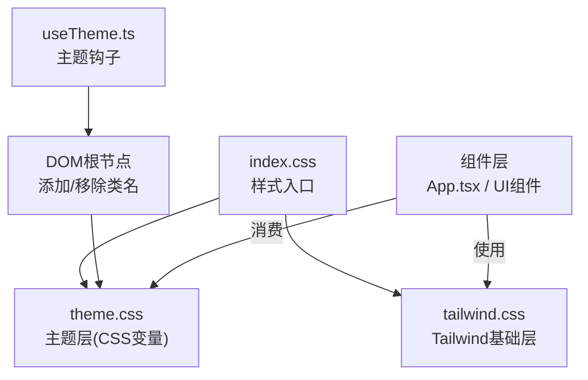
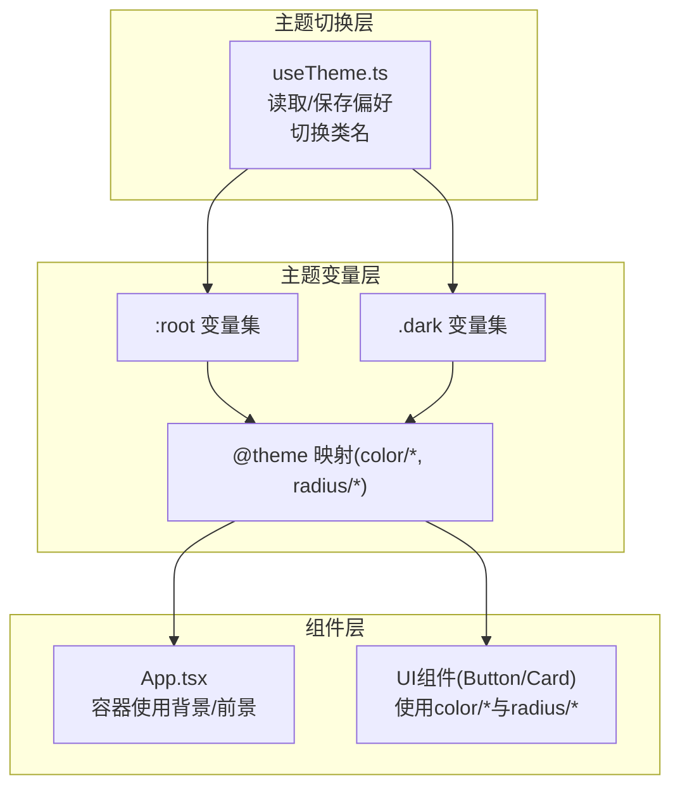
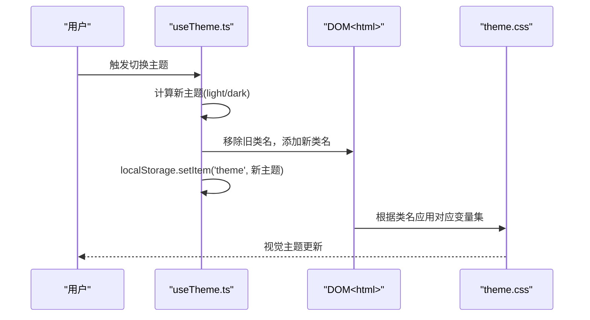
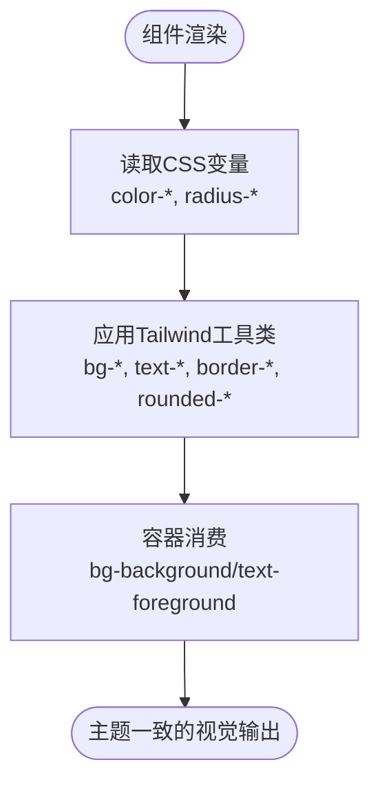
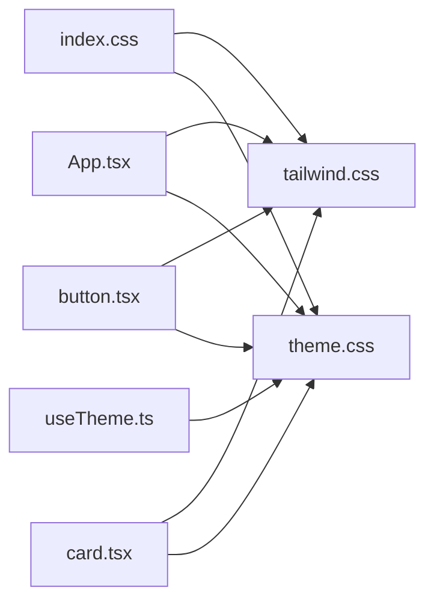

# 主题系统

<cite>
**本文引用的文件**
- [theme.css](file://src/styles/theme.css)
- [tailwind.css](file://src/styles/tailwind.css)
- [index.css](file://src/styles/index.css)
- [useTheme.ts](file://src/hooks/useTheme.ts)
- [App.tsx](file://src/app/App.tsx)
- [Header.tsx](file://src/app/components/dashboard/Header.tsx)
- [SettingsDeviceCard.tsx](file://src/app/components/settings/SettingsDeviceCard.tsx)
- [button.tsx](file://src/app/components/ui/button.tsx)
- [card.tsx](file://src/app/components/ui/card.tsx)
- [EntitySelector.tsx](file://src/app/components/common/EntitySelector.tsx)
</cite>

## 目录
1. [简介](#简介)
2. [项目结构](#项目结构)
3. [核心组件](#核心组件)
4. [架构总览](#架构总览)
5. [详细组件分析](#详细组件分析)
6. [依赖关系分析](#依赖关系分析)
7. [性能考量](#性能考量)
8. [故障排查指南](#故障排查指南)
9. [结论](#结论)
10. [附录](#附录)

## 简介
本文件面向HAUI的主题系统，系统性阐述其基于Tailwind CSS与CSS变量的主题架构设计，涵盖颜色体系、字体规范、间距与半径规则、断点配置；深入说明主题切换机制、暗黑模式实现与动态主题更新；并提供自定义主题的创建方法、命名规范与样式覆盖策略，以及主题扩展的最佳实践与性能优化建议。

## 项目结构
主题系统由三层构成：
- 样式入口：统一引入字体、Tailwind基础层与主题层
- 主题层：通过CSS变量定义颜色、字体、半径等全局主题属性，并提供亮/暗两套值
- 组件层：通过Tailwind工具类与CSS变量消费主题属性，实现一致且可替换的视觉风格

图示来源
- [index.css:1-4](file://src/styles/index.css#L1-L4)
- [tailwind.css:1-14](file://src/styles/tailwind.css#L1-L14)
- [theme.css:1-207](file://src/styles/theme.css#L1-L207)
- [useTheme.ts:1-26](file://src/hooks/useTheme.ts#L1-L26)

章节来源
- [index.css:1-4](file://src/styles/index.css#L1-L4)
- [tailwind.css:1-14](file://src/styles/tailwind.css#L1-L14)
- [theme.css:1-207](file://src/styles/theme.css#L1-L207)
- [useTheme.ts:1-26](file://src/hooks/useTheme.ts#L1-L26)

## 核心组件
- 主题变量层：集中定义颜色、字体、半径等主题属性，支持亮/暗两套值，通过@theme映射为Tailwind可用的color/radius变量
- 主题切换钩子：负责读取用户偏好、持久化选择并在DOM根节点上切换类名，驱动CSS变量生效
- 组件层：通过Tailwind工具类与CSS变量消费主题属性，确保组件在不同主题下保持一致的视觉语义

章节来源
- [theme.css:1-207](file://src/styles/theme.css#L1-L207)
- [useTheme.ts:1-26](file://src/hooks/useTheme.ts#L1-L26)
- [App.tsx:746-750](file://src/app/App.tsx#L746-L750)

## 架构总览
主题系统采用“CSS变量 + Tailwind工具类”的组合方案：
- CSS变量层提供全局主题属性，包含背景、前景、卡片、弹出层、主色/次色、输入框、开关背景、图表色板、圆角半径等
- 暗黑模式通过根节点类名切换，自动切换至对应的深色变量集
- 组件通过Tailwind工具类直接消费这些变量，无需硬编码颜色值，实现主题解耦与可替换

图示来源
- [theme.css:1-120](file://src/styles/theme.css#L1-L120)
- [useTheme.ts:13-18](file://src/hooks/useTheme.ts#L13-L18)
- [App.tsx:746-750](file://src/app/App.tsx#L746-L750)
- [button.tsx:7-35](file://src/app/components/ui/button.tsx#L7-L35)
- [card.tsx:5-16](file://src/app/components/ui/card.tsx#L5-L16)

## 详细组件分析

### 主题变量与颜色系统
- 颜色系统采用oklch色彩空间，提供高可读性与一致的明度/色相/彩度表达，便于在亮/暗模式间平滑过渡
- 关键变量族
  - 背景与前景：--background、--foreground
  - 容器与弹出层：--card、--popover
  - 主色/次色/强调/破坏性：--primary、--secondary、--accent、--destructive
  - 输入与开关：--input、--input-background、--switch-background
  - 边框与环光：--border、--ring
  - 图表色板：--chart-1 ~ --chart-5
  - 侧边栏系列：--sidebar、--sidebar-primary、--sidebar-accent、--sidebar-border、--sidebar-ring
- 亮/暗模式
  - :root定义亮色变量集
  - .dark定义暗色变量集，确保对比度与可读性
- @theme映射
  - 将CSS变量映射为Tailwind可用的color-*/radius-*变量，供工具类直接消费

章节来源
- [theme.css:3-42](file://src/styles/theme.css#L3-L42)
- [theme.css:44-79](file://src/styles/theme.css#L44-L79)
- [theme.css:81-120](file://src/styles/theme.css#L81-L120)

### 字体规范与排版
- 字号基准：--font-size控制html根字号
- 标题与文本：h1~h4、label、button、input均基于CSS变量设置字号、字重与行高，保证层级一致性
- 字重：--font-weight-medium与--font-weight-normal用于标题与正文区分

章节来源
- [theme.css:136-181](file://src/styles/theme.css#L136-L181)

### 间距与圆角规则
- 半径：--radius作为基准，衍生--radius-sm、--radius-md、--radius-lg、--radius-xl
- 间距：组件层通过Tailwind工具类(px/py/pa等)与CSS变量结合，形成统一的网格与留白体系

章节来源
- [theme.css:108-111](file://src/styles/theme.css#L108-L111)

### 断点与响应式
- Tailwind默认断点：sm、md、lg、xl、2xl
- 组件层广泛使用响应式工具类(grid-cols-2/sm:grid-cols-3/.../2xl:grid-cols-10)，配合容器查询(entity-card)实现更精细的自适应

章节来源
- [App.tsx:936-955](file://src/app/App.tsx#L936-L955)
- [theme.css:189-198](file://src/styles/theme.css#L189-L198)

### 主题切换机制与暗黑模式
- 初始偏好：优先读取localStorage中的'light'/'dark'，否则根据系统偏好匹配
- DOM切换：useEffect在每次主题变化时，移除并添加<html>上的light/dark类名
- 持久化：每次切换后写入localStorage，确保页面刷新后主题不变
- 暗黑模式：.dark类名覆盖关键变量，实现整体色调反转与对比度优化

图示来源
- [useTheme.ts:3-25](file://src/hooks/useTheme.ts#L3-L25)
- [theme.css:1-1](file://src/styles/theme.css#L1-L1)
- [theme.css:44-79](file://src/styles/theme.css#L44-L79)

章节来源
- [useTheme.ts:1-26](file://src/hooks/useTheme.ts#L1-L26)
- [theme.css:1-1](file://src/styles/theme.css#L1-L1)
- [theme.css:44-79](file://src/styles/theme.css#L44-L79)

### 动态主题更新与组件消费
- 容器使用：App.tsx容器使用bg-background与text-foreground，随主题变量动态更新
- UI组件：Button/Card等组件通过工具类消费color-*/radius-*变量，无需修改组件代码即可适配新主题
- 自适应容器：实体卡片使用容器查询与CSS变量--entity-scale，实现尺寸随容器宽度自适应缩放

图示来源
- [App.tsx:746-750](file://src/app/App.tsx#L746-L750)
- [button.tsx:7-35](file://src/app/components/ui/button.tsx#L7-L35)
- [card.tsx:5-16](file://src/app/components/ui/card.tsx#L5-L16)
- [theme.css:108-111](file://src/styles/theme.css#L108-L111)

章节来源
- [App.tsx:746-750](file://src/app/App.tsx#L746-L750)
- [button.tsx:7-35](file://src/app/components/ui/button.tsx#L7-L35)
- [card.tsx:5-16](file://src/app/components/ui/card.tsx#L5-L16)
- [theme.css:108-111](file://src/styles/theme.css#L108-L111)

### 自定义主题创建与命名规范
- 创建步骤
  - 在:root或@media/.dark中新增或覆盖目标CSS变量
  - 使用@theme将变量映射为color-*/radius-*，确保Tailwind工具类可用
  - 在useTheme.ts中扩展可选主题集合（如需要多主题）
- 命名规范
  - 颜色变量：--color-语义名（如--color-primary、--color-destructive）
  - 圆角变量：--radius-级别（如--radius-sm、--radius-lg）
  - 字体变量：--font-size、--font-weight-级别
  - 图表变量：--color-chart-N
- 样式覆盖策略
  - 优先通过CSS变量覆盖，避免在组件内硬编码颜色
  - 对于局部差异，使用组件级Tailwind工具类进行微调
  - 避免在组件层重复定义颜色常量

章节来源
- [theme.css:81-120](file://src/styles/theme.css#L81-L120)
- [theme.css:3-42](file://src/styles/theme.css#L3-L42)
- [theme.css:44-79](file://src/styles/theme.css#L44-L79)

### 主题扩展最佳实践
- 新颜色
  - 在:root与.dark中同时补充新变量，保持亮/暗一致
  - 通过@theme映射为color-新色，再在组件中使用工具类消费
- 新组件样式
  - 仅使用工具类与CSS变量，不直接写死颜色值
  - 对复杂组件，优先通过cva/variants抽象，复用color-*/radius-*变量
- 可访问性
  - 确保亮/暗模式下的对比度满足WCAG建议
  - 为交互元素提供足够的悬停/焦点反馈

章节来源
- [button.tsx:7-35](file://src/app/components/ui/button.tsx#L7-L35)
- [card.tsx:5-16](file://src/app/components/ui/card.tsx#L5-L16)
- [theme.css:81-120](file://src/styles/theme.css#L81-L120)

## 依赖关系分析
- 样式入口依赖：index.css统一导入字体、Tailwind与主题层
- 主题层依赖：theme.css定义变量与@theme映射，useTheme.ts驱动变量生效
- 组件层依赖：组件通过Tailwind工具类与CSS变量消费主题属性

图示来源
- [index.css:1-4](file://src/styles/index.css#L1-L4)
- [tailwind.css:1-14](file://src/styles/tailwind.css#L1-L14)
- [theme.css:1-120](file://src/styles/theme.css#L1-L120)
- [useTheme.ts:1-26](file://src/hooks/useTheme.ts#L1-L26)
- [App.tsx:746-750](file://src/app/App.tsx#L746-L750)
- [button.tsx:7-35](file://src/app/components/ui/button.tsx#L7-L35)
- [card.tsx:5-16](file://src/app/components/ui/card.tsx#L5-L16)

章节来源
- [index.css:1-4](file://src/styles/index.css#L1-L4)
- [tailwind.css:1-14](file://src/styles/tailwind.css#L1-L14)
- [theme.css:1-120](file://src/styles/theme.css#L1-L120)
- [useTheme.ts:1-26](file://src/hooks/useTheme.ts#L1-L26)
- [App.tsx:746-750](file://src/app/App.tsx#L746-L750)
- [button.tsx:7-35](file://src/app/components/ui/button.tsx#L7-L35)
- [card.tsx:5-16](file://src/app/components/ui/card.tsx#L5-L16)

## 性能考量
- CSS变量切换成本低：仅改变根节点类名，无需重载样式表
- Tailwind按需生成：通过@source与构建工具按实际使用生成类，减少无效CSS
- 组件层避免重复计算：颜色与半径变量集中管理，降低组件内样式分支
- 建议
  - 控制主题变量数量，避免过度细分导致维护成本上升
  - 使用容器查询与响应式工具类，减少媒体查询数量
  - 在组件层尽量复用工具类，减少内联样式的使用

## 故障排查指南
- 主题未生效
  - 检查<html>是否正确添加/移除light/dark类名
  - 确认localStorage中'light'/'dark'值是否正确
- 暗黑模式异常
  - 检查.css文件中.dark块是否完整覆盖关键变量
  - 确认@theme映射是否包含所需color-*/radius-*变量
- 组件颜色不随主题变化
  - 确认组件是否使用工具类而非硬编码颜色
  - 检查是否存在局部内联样式覆盖了主题变量

章节来源
- [useTheme.ts:13-18](file://src/hooks/useTheme.ts#L13-L18)
- [theme.css:44-79](file://src/styles/theme.css#L44-L79)
- [theme.css:81-120](file://src/styles/theme.css#L81-L120)

## 结论
HAUI的主题系统以CSS变量为核心，结合Tailwind工具类与暗黑模式类名切换，实现了高可维护性与强扩展性的视觉体系。通过集中管理颜色、字体、半径等变量，并在组件层统一消费，既保证了设计一致性，又为后续主题扩展提供了清晰路径。

## 附录
- 组件消费示例
  - 容器背景/文字：App.tsx容器使用背景/前景变量
  - 按钮与卡片：Button/Card组件使用color-*/radius-*变量
  - 实体卡片：容器查询与CSS变量--entity-scale实现自适应缩放

章节来源
- [App.tsx:746-750](file://src/app/App.tsx#L746-L750)
- [button.tsx:7-35](file://src/app/components/ui/button.tsx#L7-L35)
- [card.tsx:5-16](file://src/app/components/ui/card.tsx#L5-L16)
- [theme.css:189-206](file://src/styles/theme.css#L189-L206)