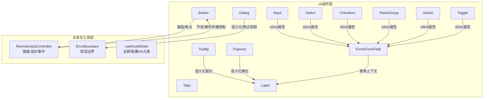
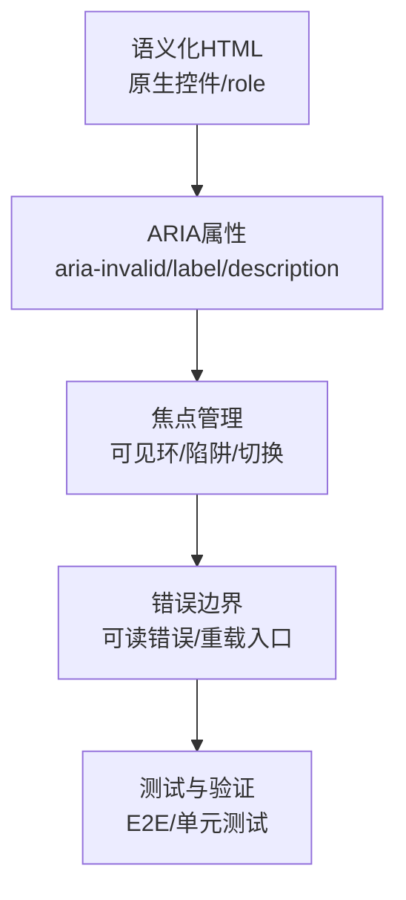
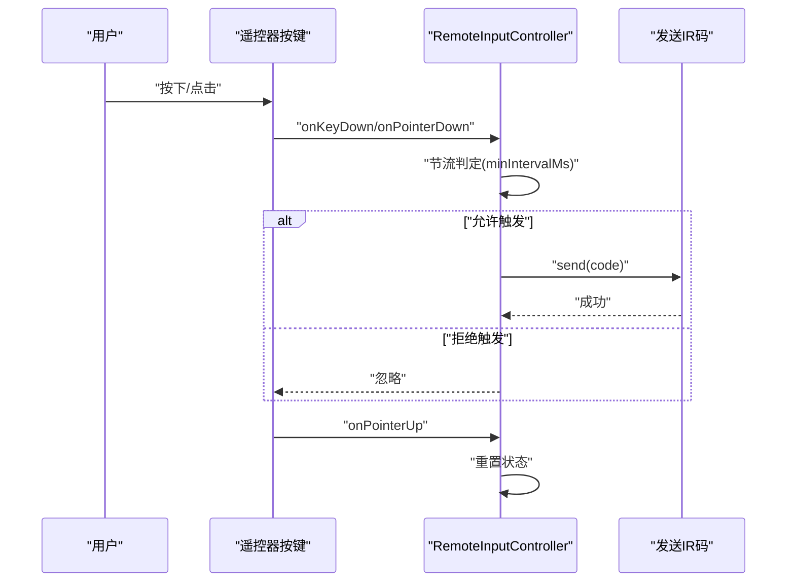
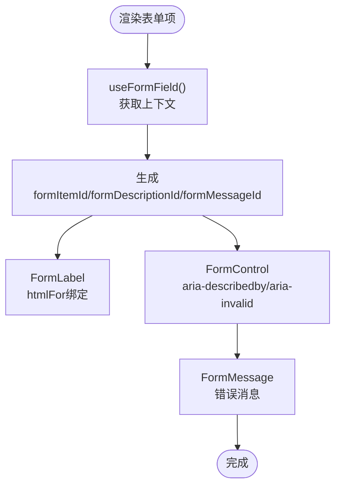
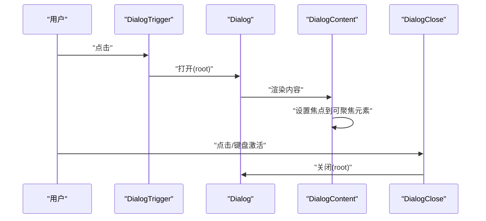
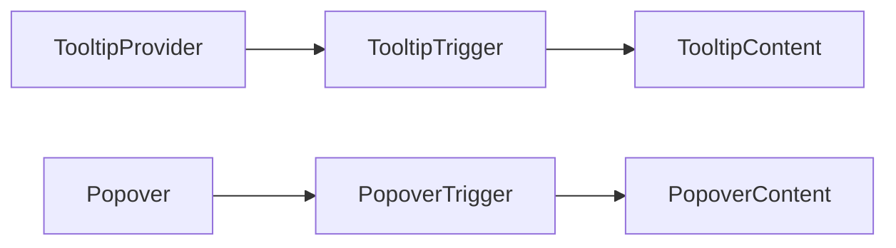
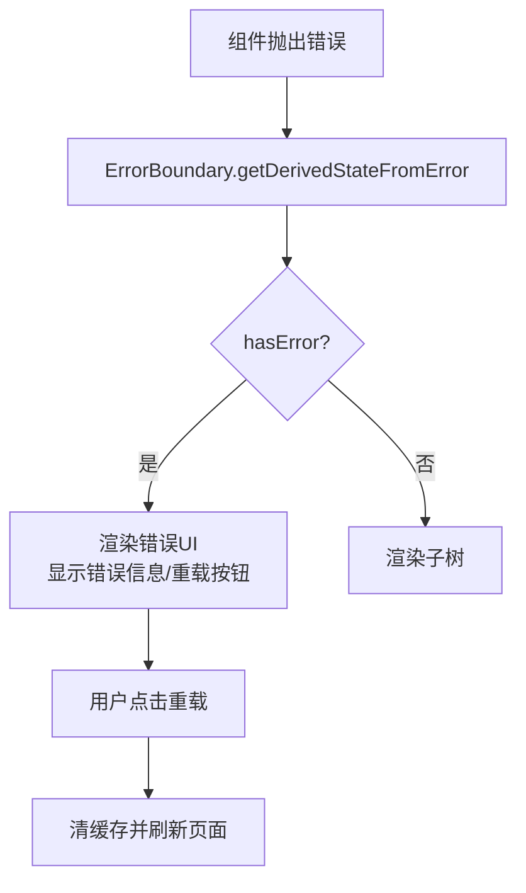
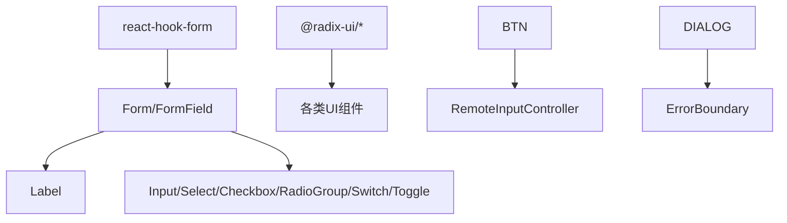

# 可访问性支持

<cite>
**本文引用的文件**
- [ErrorBoundary.tsx](file://src/app/components/ErrorBoundary.tsx)
- [button.tsx](file://src/app/components/ui/button.tsx)
- [input.tsx](file://src/app/components/ui/input.tsx)
- [select.tsx](file://src/app/components/ui/select.tsx)
- [checkbox.tsx](file://src/app/components/ui/checkbox.tsx)
- [radio-group.tsx](file://src/app/components/ui/radio-group.tsx)
- [tabs.tsx](file://src/app/components/ui/tabs.tsx)
- [dialog.tsx](file://src/app/components/ui/dialog.tsx)
- [tooltip.tsx](file://src/app/components/ui/tooltip.tsx)
- [popover.tsx](file://src/app/components/ui/popover.tsx)
- [switch.tsx](file://src/app/components/ui/switch.tsx)
- [toggle.tsx](file://src/app/components/ui/toggle.tsx)
- [form.tsx](file://src/app/components/ui/form.tsx)
- [label.tsx](file://src/app/components/ui/label.tsx)
- [remote-input.ts](file://src/utils/remote-input.ts)
- [remote-card.cy.ts](file://cypress/e2e/remote-card.cy.ts)
- [remote-input.test.ts](file://src/utils/__tests__/remote-input.test.ts)
- [useKioskMode.ts](file://src/hooks/useKioskMode.ts)
</cite>

## 目录
1. [简介](#简介)
2. [项目结构](#项目结构)
3. [核心组件](#核心组件)
4. [架构总览](#架构总览)
5. [组件详解](#组件详解)
6. [依赖关系分析](#依赖关系分析)
7. [性能考量](#性能考量)
8. [故障排查指南](#故障排查指南)
9. [结论](#结论)
10. [附录](#附录)

## 简介
本文件面向HAUI的可访问性（Accessibility）支持，系统梳理了项目在WCAG 2.1层面的实现现状与改进方向，覆盖键盘导航、屏幕阅读器支持、焦点管理、语义化标记、交互反馈、错误边界与降级体验等主题。文档同时给出测试方法、工具与验证流程，并总结常见问题的解决方案与最佳实践。

## 项目结构
围绕可访问性的关键代码分布在以下区域：
- UI基础组件：按钮、输入框、选择器、复选框、单选组、标签页、对话框、提示、弹出层、开关、切换按钮等，均采用语义化HTML与ARIA属性增强。
- 表单体系：通过表单上下文与Hook集成，自动注入aria-describedby、aria-invalid等属性，提升表单可访问性。
- 输入控制器：遥控器按键输入控制器支持指针与键盘两种输入源，统一节流与事件传播控制，保障键盘可达与触控可达。
- 错误边界：全局错误捕获与用户可操作的重载入口，避免页面崩溃导致不可用。
- 测试与验证：端到端测试对触摸目标尺寸与ARIA标签进行断言；单元测试验证键盘行为与节流逻辑。

图表来源
- [button.tsx:1-57](file://src/app/components/ui/button.tsx#L1-L57)
- [input.tsx:1-22](file://src/app/components/ui/input.tsx#L1-L22)
- [select.tsx:1-190](file://src/app/components/ui/select.tsx#L1-L190)
- [checkbox.tsx:1-33](file://src/app/components/ui/checkbox.tsx#L1-L33)
- [radio-group.tsx:1-46](file://src/app/components/ui/radio-group.tsx#L1-L46)
- [tabs.tsx:1-67](file://src/app/components/ui/tabs.tsx#L1-L67)
- [dialog.tsx:1-135](file://src/app/components/ui/dialog.tsx#L1-L135)
- [tooltip.tsx:1-62](file://src/app/components/ui/tooltip.tsx#L1-L62)
- [popover.tsx:1-49](file://src/app/components/ui/popover.tsx#L1-L49)
- [switch.tsx:1-32](file://src/app/components/ui/switch.tsx#L1-L32)
- [toggle.tsx:1-48](file://src/app/components/ui/toggle.tsx#L1-L48)
- [form.tsx:1-169](file://src/app/components/ui/form.tsx#L1-L169)
- [label.tsx:1-24](file://src/app/components/ui/label.tsx#L1-L24)
- [remote-input.ts:1-116](file://src/utils/remote-input.ts#L1-L116)
- [ErrorBoundary.tsx:1-51](file://src/app/components/ErrorBoundary.tsx#L1-L51)
- [useKioskMode.ts:1-33](file://src/hooks/useKioskMode.ts#L1-L33)

章节来源
- [button.tsx:1-57](file://src/app/components/ui/button.tsx#L1-L57)
- [input.tsx:1-22](file://src/app/components/ui/input.tsx#L1-L22)
- [select.tsx:1-190](file://src/app/components/ui/select.tsx#L1-L190)
- [checkbox.tsx:1-33](file://src/app/components/ui/checkbox.tsx#L1-L33)
- [radio-group.tsx:1-46](file://src/app/components/ui/radio-group.tsx#L1-L46)
- [tabs.tsx:1-67](file://src/app/components/ui/tabs.tsx#L1-L67)
- [dialog.tsx:1-135](file://src/app/components/ui/dialog.tsx#L1-L135)
- [tooltip.tsx:1-62](file://src/app/components/ui/tooltip.tsx#L1-L62)
- [popover.tsx:1-49](file://src/app/components/ui/popover.tsx#L1-L49)
- [switch.tsx:1-32](file://src/app/components/ui/switch.tsx#L1-L32)
- [toggle.tsx:1-48](file://src/app/components/ui/toggle.tsx#L1-L48)
- [form.tsx:1-169](file://src/app/components/ui/form.tsx#L1-L169)
- [label.tsx:1-24](file://src/app/components/ui/label.tsx#L1-L24)
- [remote-input.ts:1-116](file://src/utils/remote-input.ts#L1-L116)
- [ErrorBoundary.tsx:1-51](file://src/app/components/ErrorBoundary.tsx#L1-L51)
- [useKioskMode.ts:1-33](file://src/hooks/useKioskMode.ts#L1-L33)

## 核心组件
本节聚焦可访问性关键组件及其特性：
- 按钮：统一的焦点可见环与ARIA状态映射，确保键盘可达与视觉反馈一致。
- 输入控件：在禁用、错误状态下自动应用ARIA属性与样式，提升屏幕阅读器可读性。
- 选择器：下拉内容通过Portal挂载，触发器与项具备ARIA状态，支持键盘导航。
- 复选框与单选组：原生语义与指示器结合，支持键盘切换与焦点管理。
- 标签页：列表与触发器具备状态类名，配合键盘左右键切换。
- 对话框：语义化根节点、遮罩、标题与描述，包含“sr-only”关闭按钮文本。
- 提示与弹出层：基于Radix UI Provider，保证内容挂载与焦点管理。
- 开关与切换：原生语义根元素，支持键盘切换与焦点可见环。
- 表单体系：通过上下文自动注入aria-describedby与aria-invalid，错误消息可被读屏识别。

章节来源
- [button.tsx:1-57](file://src/app/components/ui/button.tsx#L1-L57)
- [input.tsx:1-22](file://src/app/components/ui/input.tsx#L1-L22)
- [select.tsx:1-190](file://src/app/components/ui/select.tsx#L1-L190)
- [checkbox.tsx:1-33](file://src/app/components/ui/checkbox.tsx#L1-L33)
- [radio-group.tsx:1-46](file://src/app/components/ui/radio-group.tsx#L1-L46)
- [tabs.tsx:1-67](file://src/app/components/ui/tabs.tsx#L1-L67)
- [dialog.tsx:1-135](file://src/app/components/ui/dialog.tsx#L1-L135)
- [tooltip.tsx:1-62](file://src/app/components/ui/tooltip.tsx#L1-L62)
- [popover.tsx:1-49](file://src/app/components/ui/popover.tsx#L1-L49)
- [switch.tsx:1-32](file://src/app/components/ui/switch.tsx#L1-L32)
- [toggle.tsx:1-48](file://src/app/components/ui/toggle.tsx#L1-L48)
- [form.tsx:1-169](file://src/app/components/ui/form.tsx#L1-L169)
- [label.tsx:1-24](file://src/app/components/ui/label.tsx#L1-L24)

## 架构总览
从可访问性视角看，系统采用“语义化HTML + ARIA属性 + 焦点管理 + 错误边界”的分层架构：
- 语义化层：所有交互控件尽量使用原生语义元素或明确role，避免仅靠样式模拟交互。
- ARIA层：在必要时补充aria-*属性，如aria-invalid、aria-describedby、aria-label等。
- 焦点层：确保键盘可达、焦点可见环、焦点陷阱（对话框）、同组控件的键盘切换。
- 错误层：全局错误边界提供可读信息与恢复入口，避免不可用状态。

## 组件详解

### 遥控器输入控制器（键盘与指针）
该控制器为遥控器按键提供统一的输入处理，支持键盘（Enter/Space）与指针（down/up/click）事件，内置节流与事件传播控制，确保可访问性与稳定性。

图表来源
- [remote-input.ts:1-116](file://src/utils/remote-input.ts#L1-L116)

章节来源
- [remote-input.ts:1-116](file://src/utils/remote-input.ts#L1-L116)
- [remote-input.test.ts:1-26](file://src/utils/__tests__/remote-input.test.ts#L1-L26)

### 表单可访问性（ARIA与上下文）
表单体系通过上下文自动注入aria-describedby与aria-invalid，错误消息可被读屏识别；标签与控件通过for/id关联，提升可理解性。

图表来源
- [form.tsx:1-169](file://src/app/components/ui/form.tsx#L1-L169)
- [label.tsx:1-24](file://src/app/components/ui/label.tsx#L1-L24)

章节来源
- [form.tsx:1-169](file://src/app/components/ui/form.tsx#L1-L169)
- [label.tsx:1-24](file://src/app/components/ui/label.tsx#L1-L24)

### 对话框（语义化与焦点管理）
对话框采用语义化根节点与Portal挂载，包含标题、描述与“sr-only”关闭按钮文本，确保读屏可理解且具备焦点陷阱能力。

图表来源
- [dialog.tsx:1-135](file://src/app/components/ui/dialog.tsx#L1-L135)

章节来源
- [dialog.tsx:1-135](file://src/app/components/ui/dialog.tsx#L1-L135)

### 提示与弹出层（语义化与挂载）
提示与弹出层通过Provider与Portal确保内容挂载到文档树合适位置，避免层级与焦点问题。

图表来源
- [tooltip.tsx:1-62](file://src/app/components/ui/tooltip.tsx#L1-L62)
- [popover.tsx:1-49](file://src/app/components/ui/popover.tsx#L1-L49)

章节来源
- [tooltip.tsx:1-62](file://src/app/components/ui/tooltip.tsx#L1-L62)
- [popover.tsx:1-49](file://src/app/components/ui/popover.tsx#L1-L49)

### 错误边界（降级体验与恢复）
全局错误边界捕获未处理异常，向用户展示简洁可读的信息与一键重载入口，避免页面空白或崩溃。

图表来源
- [ErrorBoundary.tsx:1-51](file://src/app/components/ErrorBoundary.tsx#L1-L51)

章节来源
- [ErrorBoundary.tsx:1-51](file://src/app/components/ErrorBoundary.tsx#L1-L51)

### 全屏/隐藏HA元素（Kiosk模式）
在嵌入Home Assistant场景中，可通过全屏与隐藏部分HA元素提升专注度与可访问性体验。

章节来源
- [useKioskMode.ts:1-33](file://src/hooks/useKioskMode.ts#L1-L33)

## 依赖关系分析
- UI组件广泛依赖Radix UI与Tailwind，确保语义化与可定制性。
- 表单体系依赖react-hook-form上下文，形成“表单字段—标签—描述—错误消息”的完整链路。
- 遥控器输入控制器独立于UI层，但与按钮等交互组件协作，统一键盘/指针事件处理。
- 错误边界作为顶层组件，不依赖具体业务UI，但影响整体可用性。

图表来源
- [form.tsx:1-169](file://src/app/components/ui/form.tsx#L1-L169)
- [button.tsx:1-57](file://src/app/components/ui/button.tsx#L1-L57)
- [remote-input.ts:1-116](file://src/utils/remote-input.ts#L1-L116)
- [dialog.tsx:1-135](file://src/app/components/ui/dialog.tsx#L1-L135)
- [ErrorBoundary.tsx:1-51](file://src/app/components/ErrorBoundary.tsx#L1-L51)

## 性能考量
- 节流与事件传播控制：遥控器输入控制器内置节流与事件阻止，减少重复触发与布局抖动。
- Portal挂载：提示与弹出层通过Portal挂载，避免DOM层级过深带来的渲染压力。
- 样式与ARIA：通过CSS变量与条件类名控制样式，避免运行时大量DOM变更。
- 错误边界：仅在异常路径执行，正常路径无额外开销。

## 故障排查指南
- 触摸目标过小：端到端测试断言触摸目标至少44×44像素，若失败需增大控件尺寸或内边距。
- 缺少ARIA标签：测试断言每个按键具备aria-label，若失败需为图标/无文本按钮添加可读标签。
- 状态文本泄露：测试断言遥控器卡片不显示“开启/关闭”等内部状态文本，应通过ARIA或隐藏文本呈现。
- 键盘可达性：确认所有可交互元素可通过Tab聚焦，激活键为Enter/Space，Esc可关闭浮层。
- 读屏友好：检查表单错误消息是否被读屏识别，对话框标题/描述是否存在。
- 错误恢复：若出现全局错误，确认错误边界可读且重载按钮可用。

章节来源
- [remote-card.cy.ts:1-40](file://cypress/e2e/remote-card.cy.ts#L1-L40)

## 结论
HAUI在可访问性方面已具备良好基础：语义化HTML、ARIA属性、焦点管理与错误边界均有体现。建议持续完善以下方面：
- 扩展ARIA标签覆盖范围，确保所有非文本按钮具备可读标签。
- 强化键盘导航一致性，统一激活键与快捷键提示。
- 增加读屏测试与自动化断言，覆盖更多交互场景。
- 在复杂浮层（如选择器、弹出层）中强化焦点陷阱与可预期关闭方式。

## 附录

### WCAG 2.1要点对照与实现状态
- 文本对比度：确保关键文本与背景满足对比度阈值。
- 键盘可达：所有功能均可通过键盘完成，焦点可见环一致。
- 屏幕阅读器支持：语义化标签与ARIA属性覆盖主要交互。
- 时间限制：为动态内容提供暂停/停止选项（如轮播）。
- 语法清晰：表单错误消息明确、可读，且与控件关联。

### 测试方法与工具
- 端到端测试（Cypress）：断言触摸目标尺寸、ARIA标签存在、暗色模式布局稳定。
- 单元测试（Vitest）：验证键盘事件与节流逻辑。
- 读屏测试：使用NVDA/JAWS/VoiceOver验证标签与错误消息。
- 自动化扫描：使用axe或Lighthouse进行可访问性扫描。

章节来源
- [remote-card.cy.ts:1-40](file://cypress/e2e/remote-card.cy.ts#L1-L40)
- [remote-input.test.ts:1-26](file://src/utils/__tests__/remote-input.test.ts#L1-L26)