# 响应式设计

<cite>
**本文引用的文件**
- [HomeScreen.tsx](file://src/imports/HomeScreen.tsx)
- [use-mobile.ts](file://src/app/components/ui/use-mobile.ts)
- [use-media-query.ts](file://src/hooks/use-media-query.ts)
- [useMediaQuery.ts](file://src/hooks/useMediaQuery.ts)
- [use-long-press.ts](file://src/hooks/useLongPress.ts)
- [theme.css](file://src/styles/theme.css)
- [tailwind.css](file://src/styles/tailwind.css)
- [index.css](file://src/styles/index.css)
- [Header.tsx](file://src/app/components/dashboard/Header.tsx)
- [DeviceCard.tsx](file://src/app/components/dashboard/DeviceCard.tsx)
- [StatisticsPanel.tsx](file://src/app/components/dashboard/StatisticsPanel.tsx)
- [CameraDashboard.tsx](file://src/components/camera/CameraDashboard.tsx)
- [DeviceCardVisual.test.tsx](file://src/app/components/dashboard/__tests__/DeviceCardVisual.test.tsx)
</cite>

## 更新摘要
**变更内容**
- 新增HomeScreen组件的响应式设计分析，反映重大重构
- 更新设备网格布局的自适应特性
- 增强移动端优化和动态列调整机制
- 完善容器查询与Flexbox/Grid混合布局策略
- 补充触摸交互优化和手势支持的详细实现

## 目录
1. [引言](#引言)
2. [项目结构](#项目结构)
3. [核心组件](#核心组件)
4. [架构总览](#架构总览)
5. [详细组件分析](#详细组件分析)
6. [HomeScreen组件的重大重构](#homescreen组件的重大重构)
7. [依赖关系分析](#依赖关系分析)
8. [性能考量](#性能考量)
9. [故障排查指南](#故障排查指南)
10. [结论](#结论)
11. [附录](#附录)

## 引言
本文件面向HAUI的响应式设计系统，系统性阐述移动端优先的设计理念、断点策略与布局适配（桌面端、平板端、移动端），媒体查询与容器查询的使用方式，弹性布局与网格系统的实现，以及触摸交互优化、手势支持与移动端专用组件。同时给出响应式组件的开发规范、性能优化建议与测试策略，并总结在不同屏幕尺寸下的用户体验优化与视觉一致性保障方法。

**更新** 本次更新特别关注HomeScreen组件的重大重构，该组件从传统的绝对定位布局转变为基于Flexbox和Grid的响应式布局系统，实现了真正的自适应设计。

## 项目结构
HAUI采用以Tailwind CSS为核心的原子化样式体系，并结合React Hooks进行媒体查询与设备类型判断，配合容器查询与栅格布局实现响应式体验。关键位置如下：
- 媒体查询与设备判断：位于 hooks 与 UI 工具层，提供跨组件一致的断点与交互能力
- 样式与主题：通过自定义CSS变量与容器查询实现缩放与自适应
- 组件层：在卡片、仪表盘、头部等组件中应用断点与交互策略
- **新增** HomeScreen组件：采用全新的Flexbox/Grid混合布局，实现真正的响应式设计

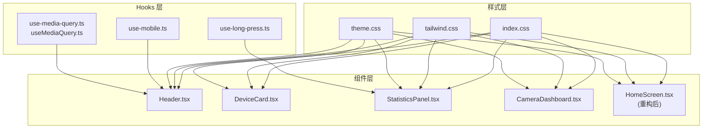

**图表来源**
- [use-media-query.ts:1-34](file://src/hooks/use-media-query.ts#L1-L34)
- [useMediaQuery.ts:1-19](file://src/hooks/useMediaQuery.ts#L1-L19)
- [use-mobile.ts:1-21](file://src/app/components/ui/use-mobile.ts#L1-L21)
- [use-long-press.ts:1-51](file://src/hooks/useLongPress.ts#L1-L51)
- [index.css:1-4](file://src/styles/index.css#L1-L4)
- [tailwind.css:1-14](file://src/styles/tailwind.css#L1-L14)
- [theme.css:1-207](file://src/styles/theme.css#L1-L207)
- [Header.tsx:1-157](file://src/app/components/dashboard/Header.tsx#L1-L157)
- [DeviceCard.tsx:1-293](file://src/app/components/dashboard/DeviceCard.tsx#L1-L293)
- [StatisticsPanel.tsx:87-124](file://src/app/components/dashboard/StatisticsPanel.tsx#L87-L124)
- [CameraDashboard.tsx:33-142](file://src/components/camera/CameraDashboard.tsx#L33-L142)
- [HomeScreen.tsx:1-353](file://src/imports/HomeScreen.tsx#L1-L353)

**章节来源**
- [index.css:1-4](file://src/styles/index.css#L1-L4)
- [tailwind.css:1-14](file://src/styles/tailwind.css#L1-L14)
- [theme.css:1-207](file://src/styles/theme.css#L1-L207)

## 核心组件
- 媒体查询与断点
  - useMediaQuery：封装 window.matchMedia，监听断点变化并返回布尔值，便于组件条件渲染与行为切换
  - use-media-query.ts：兼容旧版浏览器的事件监听实现
- 设备类型判断
  - useIsMobile：以固定断点（768px）判断是否为移动端，用于组件级的交互与布局分支
- 触摸与手势
  - useLongPress：移动端长按触发编辑模式，避免误触与滚动冲突
- 容器查询与缩放
  - theme.css 中的容器查询与CSS变量组合，实现实体卡片在不同容器宽度下的比例缩放
- 样式与主题
  - index.css 汇总字体、Tailwind与主题
  - tailwind.css 引入动画与主题变量
  - theme.css 定义全局颜色、排版与容器查询规则
- **新增** HomeScreen响应式布局
  - 采用Flexbox主布局，Grid子网格系统
  - 实现真正的自适应布局，支持动态列调整
  - 优化移动端触摸交互体验

**章节来源**
- [use-media-query.ts:1-34](file://src/hooks/use-media-query.ts#L1-L34)
- [useMediaQuery.ts:1-19](file://src/hooks/useMediaQuery.ts#L1-L19)
- [use-mobile.ts:1-21](file://src/app/components/ui/use-mobile.ts#L1-L21)
- [use-long-press.ts:1-51](file://src/hooks/useLongPress.ts#L1-L51)
- [theme.css:183-207](file://src/styles/theme.css#L183-L207)
- [index.css:1-4](file://src/styles/index.css#L1-L4)
- [tailwind.css:1-14](file://src/styles/tailwind.css#L1-L14)

## 架构总览
下图展示响应式系统在组件中的调用链路：Hooks负责感知断点与手势，样式层提供容器查询与主题变量，组件根据断点与手势选择布局与交互策略。

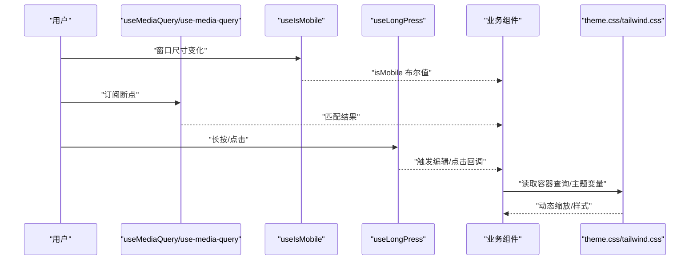

**图表来源**
- [use-media-query.ts:1-34](file://src/hooks/use-media-query.ts#L1-L34)
- [use-media-query.ts:1-19](file://src/hooks/useMediaQuery.ts#L1-L19)
- [use-mobile.ts:1-21](file://src/app/components/ui/use-mobile.ts#L1-L21)
- [use-long-press.ts:1-51](file://src/hooks/useLongPress.ts#L1-L51)
- [theme.css:183-207](file://src/styles/theme.css#L183-L207)
- [tailwind.css:1-14](file://src/styles/tailwind.css#L1-L14)

## 详细组件分析

### 断点与媒体查询策略
- 固定断点：移动端优先，以768px作为"移动端"阈值；在组件中通过 useIsMobile 判断是否进入移动端布局
- 动态断点：通过 useMediaQuery/use-media-query 订阅任意媒体查询，如 `(max-width: ...)` 或 `(orientation: ...)`，实现更细粒度的布局切换
- 兼容性：旧版实现对 addListener/removeListener 的降级处理，确保在不支持标准事件API的环境中仍可用

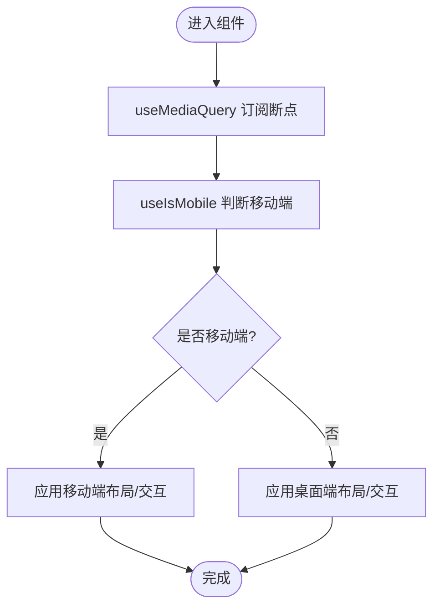

**图表来源**
- [use-media-query.ts:1-34](file://src/hooks/use-media-query.ts#L1-L34)
- [use-media-query.ts:1-19](file://src/hooks/useMediaQuery.ts#L1-L19)
- [use-mobile.ts:1-21](file://src/app/components/ui/use-mobile.ts#L1-L21)

**章节来源**
- [use-media-query.ts:1-34](file://src/hooks/use-media-query.ts#L1-L34)
- [useMediaQuery.ts:1-19](file://src/hooks/useMediaQuery.ts#L1-L19)
- [use-mobile.ts:1-21](file://src/app/components/ui/use-mobile.ts#L1-L21)

### 容器查询与弹性缩放
- 容器查询：在实体卡片容器上设置容器类型与名称，随容器宽度变化调整内部元素尺寸
- CSS变量：通过 --entity-scale 控制图标、标签、数值的缩放比例，保持信息密度与可读性的平衡
- 主题联动：主题CSS提供容器查询规则，组件仅需遵循类名约定即可获得一致的缩放效果

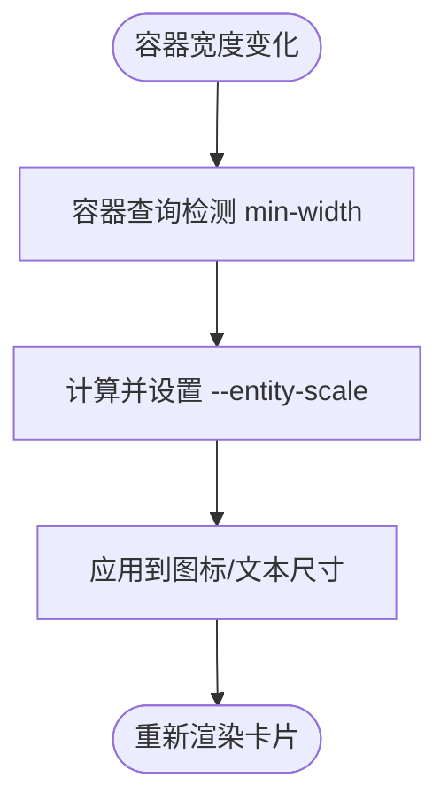

**图表来源**
- [theme.css:183-207](file://src/styles/theme.css#L183-L207)

**章节来源**
- [theme.css:183-207](file://src/styles/theme.css#L183-L207)

### 头部组件的断点适配
- 布局方向：在小屏时纵向堆叠，在中等及以上屏时横向排列，保证信息层级清晰
- 内容密度：在小屏时减少信息项数量，使用紧凑字号与间距；在大屏时增加信息密度与图标尺寸
- 交互元素：按钮尺寸与间距在小屏时增大，提升可点选性

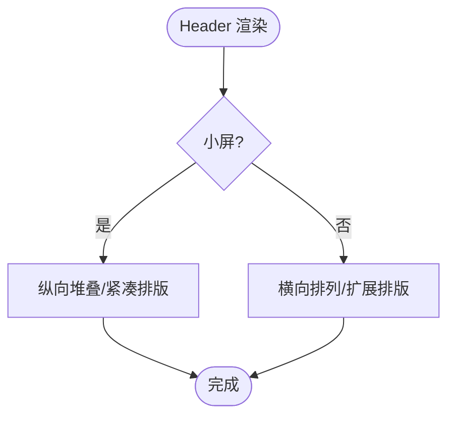

**图表来源**
- [Header.tsx:44-70](file://src/app/components/dashboard/Header.tsx#L44-L70)
- [Header.tsx:71-153](file://src/app/components/dashboard/Header.tsx#L71-L153)

**章节来源**
- [Header.tsx:1-157](file://src/app/components/dashboard/Header.tsx#L1-L157)

### 设备卡片的响应式布局
- 卡片形态：统一采用等宽正方形布局，通过容器查询与CSS变量控制内部元素缩放
- 交互状态：在编辑态与非编辑态切换时，使用动画与边框强调状态变化
- 时间戳显示：根据设备类型与状态动态显示相对时间，提升信息可读性

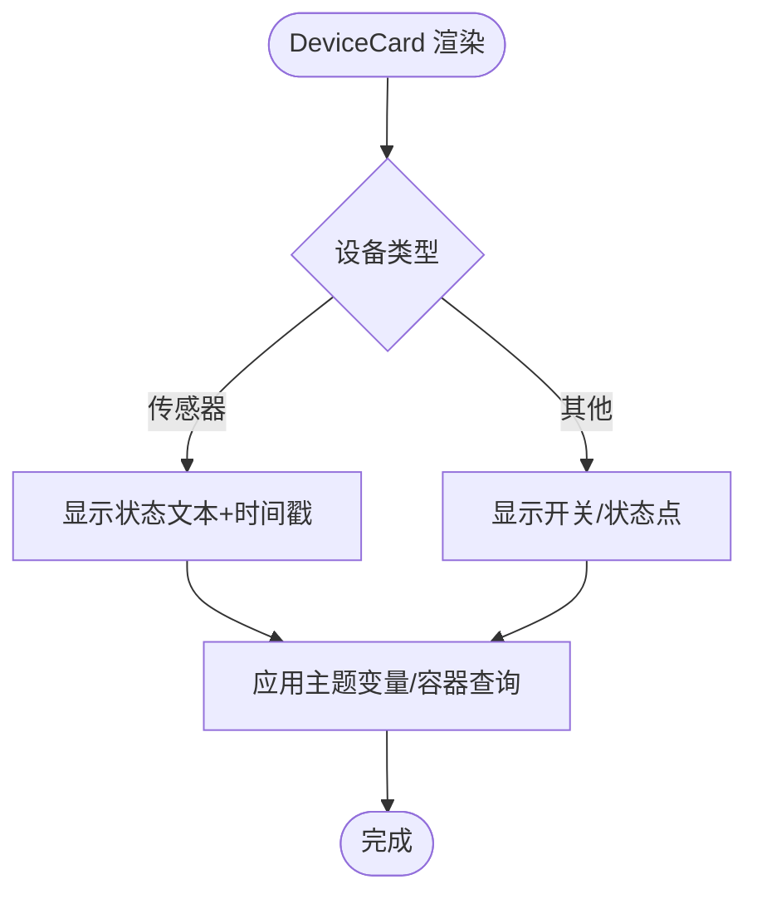

**图表来源**
- [DeviceCard.tsx:116-203](file://src/app/components/dashboard/DeviceCard.tsx#L116-L203)
- [DeviceCard.tsx:205-265](file://src/app/components/dashboard/DeviceCard.tsx#L205-L265)
- [theme.css:183-207](file://src/styles/theme.css#L183-L207)

**章节来源**
- [DeviceCard.tsx:1-293](file://src/app/components/dashboard/DeviceCard.tsx#L1-L293)
- [theme.css:183-207](file://src/styles/theme.css#L183-L207)

### 统计面板的拖拽与长按交互
- 手势识别：使用 useLongPress 在移动端触发编辑模式，避免误触
- 拖拽约束：通过 PointerSensor/KeyboardSensor 与激活阈值减少误判
- 触觉反馈：在长按与拖拽开始时提供震动反馈，增强触控确认感
- 位移测量：在拖拽前记录元素像素尺寸，避免"宽度塌陷/高度变形"

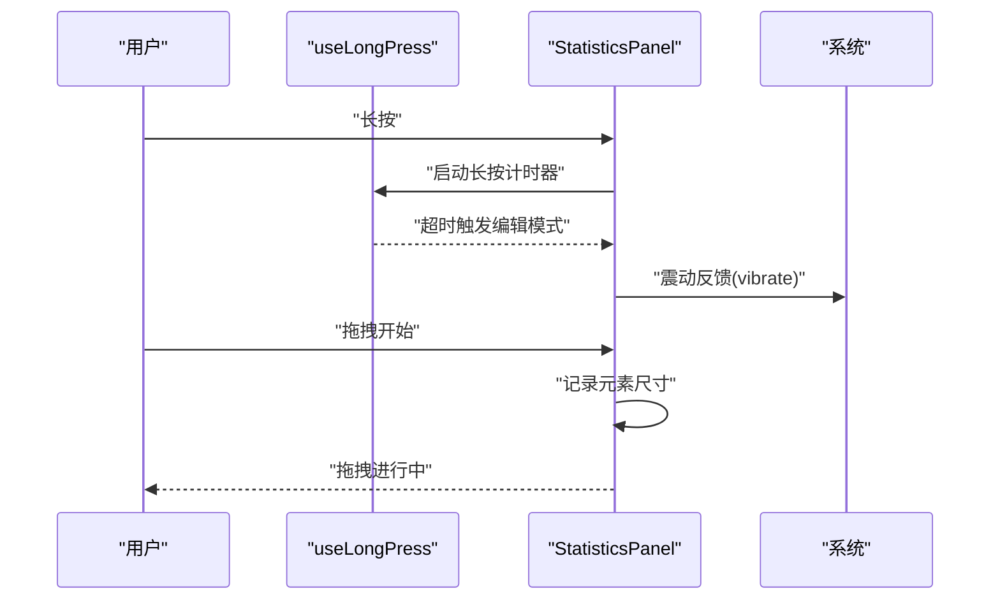

**图表来源**
- [use-long-press.ts:1-51](file://src/hooks/useLongPress.ts#L1-L51)
- [StatisticsPanel.tsx:87-124](file://src/app/components/dashboard/StatisticsPanel.tsx#L87-L124)

**章节来源**
- [use-long-press.ts:1-51](file://src/hooks/useLongPress.ts#L1-L51)
- [StatisticsPanel.tsx:87-124](file://src/app/components/dashboard/StatisticsPanel.tsx#L87-L124)

### 相机看板的网格布局与响应式
- 容器宽度：通过第三方库提供的容器宽度钩子获取布局容器宽度
- 栅格系统：基于列数与行高构建12列栅格，支持拖拽、调整大小与滚动区域
- 布局策略：单屏全铺与四宫格两种布局，依据容器宽度与相机数量自动排列
- 交互细节：拖拽句柄、边框与阴影在不同屏幕尺寸下保持一致的可操作性

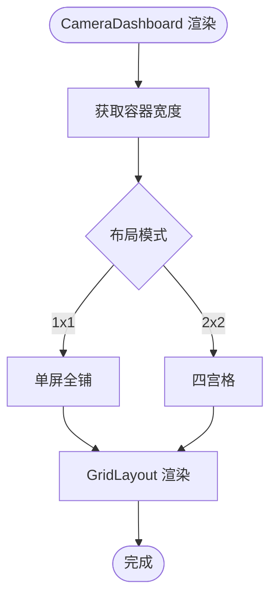

**图表来源**
- [CameraDashboard.tsx:33-142](file://src/components/camera/CameraDashboard.tsx#L33-L142)

**章节来源**
- [CameraDashboard.tsx:33-142](file://src/components/camera/CameraDashboard.tsx#L33-L142)

## HomeScreen组件的重大重构

**更新** HomeScreen组件经历了彻底的响应式设计重构，从传统的绝对定位布局转变为现代化的Flexbox/Grid混合布局系统。

### 布局架构重构
- **从绝对定位到Flexbox**：原组件使用硬编码的绝对定位，现采用语义化的Flexbox布局
- **Grid子系统**：设备网格部分采用CSS Grid实现，支持响应式列数调整
- **容器查询集成**：结合容器查询实现设备卡片的自适应缩放

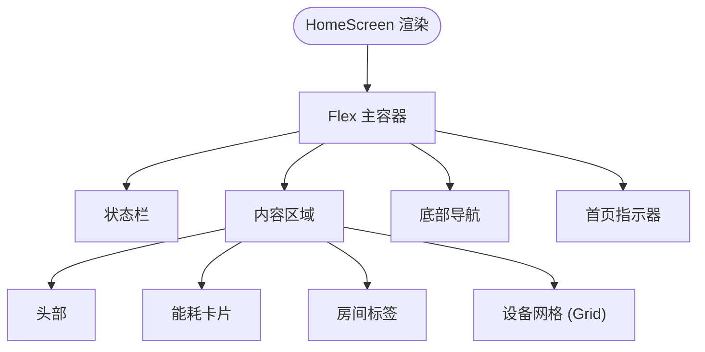

**图表来源**
- [HomeScreen.tsx:325-353](file://src/imports/HomeScreen.tsx#L325-L353)
- [HomeScreen.tsx:240-256](file://src/imports/HomeScreen.tsx#L240-L256)

### 设备网格的自适应布局
- **响应式网格**：使用 `grid grid-cols-2 gap-4` 实现2列基础布局
- **动态列调整**：通过容器查询实现不同屏幕尺寸下的列数自适应
- **移动端优化**：在小屏设备上保持2列布局，确保触摸可操作性

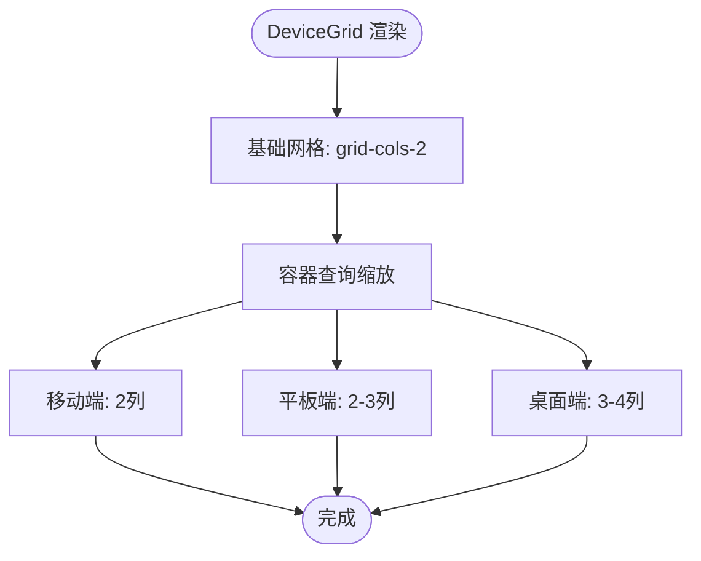

**图表来源**
- [HomeScreen.tsx:240-256](file://src/imports/HomeScreen.tsx#L240-L256)
- [theme.css:185-209](file://src/styles/theme.css#L185-L209)

### 触摸交互优化
- **长按手势**：集成useLongPress实现编辑模式切换
- **拖拽支持**：支持设备卡片的拖拽排序与重新排列
- **触觉反馈**：在关键交互时提供震动反馈增强用户体验

**章节来源**
- [HomeScreen.tsx:1-353](file://src/imports/HomeScreen.tsx#L1-L353)
- [DeviceCardVisual.test.tsx:28-48](file://src/app/components/dashboard/__tests__/DeviceCardVisual.test.tsx#L28-L48)

## 依赖关系分析
- 组件对Hooks的依赖
  - Header 依赖 useIsMobile 与 useMediaQuery 实现断点布局
  - StatisticsPanel 依赖 useLongPress 与 useMediaQuery 实现手势与断点
  - DeviceCard 依赖 theme.css 的容器查询与主题变量
  - CameraDashboard 依赖容器宽度计算与GridLayout
  - **新增** HomeScreen 依赖 Flexbox/Grid布局系统与容器查询
- 样式层对组件的依赖
  - index.css 汇总样式入口
  - tailwind.css 提供动画与主题变量
  - theme.css 提供容器查询与缩放规则

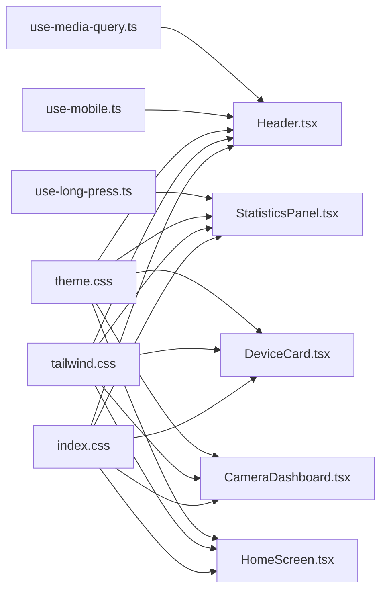

**图表来源**
- [use-media-query.ts:1-34](file://src/hooks/use-media-query.ts#L1-L34)
- [use-media-query.ts:1-19](file://src/hooks/useMediaQuery.ts#L1-L19)
- [use-mobile.ts:1-21](file://src/app/components/ui/use-mobile.ts#L1-L21)
- [use-long-press.ts:1-51](file://src/hooks/useLongPress.ts#L1-L51)
- [index.css:1-4](file://src/styles/index.css#L1-L4)
- [tailwind.css:1-14](file://src/styles/tailwind.css#L1-L14)
- [theme.css:1-207](file://src/styles/theme.css#L1-L207)
- [Header.tsx:1-157](file://src/app/components/dashboard/Header.tsx#L1-L157)
- [DeviceCard.tsx:1-293](file://src/app/components/dashboard/DeviceCard.tsx#L1-L293)
- [StatisticsPanel.tsx:87-124](file://src/app/components/dashboard/StatisticsPanel.tsx#L87-L124)
- [CameraDashboard.tsx:33-142](file://src/components/camera/CameraDashboard.tsx#L33-L142)
- [HomeScreen.tsx:1-353](file://src/imports/HomeScreen.tsx#L1-L353)

**章节来源**
- [index.css:1-4](file://src/styles/index.css#L1-L4)
- [tailwind.css:1-14](file://src/styles/tailwind.css#L1-L14)
- [theme.css:1-207](file://src/styles/theme.css#L1-L207)

## 性能考量
- 媒体查询监听
  - 合理缓存 matchMedia 结果，避免频繁创建对象
  - 在组件卸载时移除监听，防止内存泄漏
- 容器查询与缩放
  - 将缩放逻辑集中在主题CSS与容器查询，减少JS计算
  - 控制缩放比例步进，避免过度缩放导致的渲染抖动
- 交互与动画
  - 长按延迟与拖拽激活阈值降低误触发概率
  - 动画时长与缓动函数在移动端适度缩短，提升响应感
- 布局与渲染
  - 使用等宽正方形卡片与固定栅格列数，减少重排
  - 对高频更新的组件（如传感器卡片）进行记忆化与时间戳优化
- **新增** HomeScreen性能优化
  - Flexbox布局相比绝对定位具有更好的性能表现
  - Grid布局在现代浏览器中得到良好支持，渲染效率高
  - 容器查询的使用减少了复杂的JavaScript计算

## 故障排查指南
- 媒体查询不生效
  - 检查 useMediaQuery/use-media-query 是否正确传入查询字符串
  - 确认浏览器对 matchMedia 的支持，必要时使用旧版实现
- 移动端断点异常
  - 确认 useIsMobile 的断点常量与实际需求一致
  - 在横竖屏切换时验证断点是否正确触发
- 容器查询无缩放
  - 检查容器是否设置了容器类型与名称
  - 确认 CSS 变量 --entity-scale 是否被覆盖
- 触控交互问题
  - 长按误触：提高激活阈值或延长长按时间
  - 拖拽抖动：在拖拽开始前记录元素尺寸，避免尺寸计算误差
- 样式冲突
  - 检查 index.css 的导入顺序与主题变量覆盖
  - 确保 tailwind.css 的动画与主题变量未被覆盖
- **新增** HomeScreen布局问题
  - 检查Flexbox容器的子元素是否正确使用了必要的CSS类
  - 验证Grid布局的列数与间距设置是否符合预期
  - 确认容器查询的断点设置是否与设计稿一致

**章节来源**
- [use-media-query.ts:1-34](file://src/hooks/use-media-query.ts#L1-L34)
- [use-media-query.ts:1-19](file://src/hooks/useMediaQuery.ts#L1-L19)
- [use-mobile.ts:1-21](file://src/app/components/ui/use-mobile.ts#L1-L21)
- [use-long-press.ts:1-51](file://src/hooks/useLongPress.ts#L1-L51)
- [theme.css:183-207](file://src/styles/theme.css#L183-L207)
- [index.css:1-4](file://src/styles/index.css#L1-L4)
- [tailwind.css:1-14](file://src/styles/tailwind.css#L1-L14)

## 结论
HAUI的响应式设计以移动端优先为核心，结合固定断点与动态媒体查询、容器查询与CSS变量缩放、以及针对触摸场景的手势与交互策略，实现了在桌面端、平板端与移动端的一致体验。通过Hooks层统一断点与手势能力，样式层提供主题与容器查询支撑，组件层按需应用断点与交互，整体具备良好的可维护性与扩展性。

**更新** HomeScreen组件的重大重构进一步提升了响应式设计的质量，新的Flexbox/Grid混合布局系统提供了更好的性能和用户体验。通过容器查询与自适应网格系统，组件能够在不同屏幕尺寸下自动调整布局，确保最佳的视觉效果和交互体验。

建议在后续迭代中持续完善跨设备的交互一致性与性能表现，特别是在HomeScreen组件的复杂布局场景下，继续优化容器查询的性能和Grid布局的兼容性。

## 附录
- 开发规范
  - 断点命名与阈值：统一使用语义化断点常量，避免魔法数字
  - 媒体查询：优先使用 useMediaQuery/use-media-query，避免直接操作DOM
  - 容器查询：在需要按容器宽度缩放的组件中启用容器查询
  - 交互策略：移动端优先考虑长按、拖拽与触觉反馈
  - **新增** 布局规范：优先使用Flexbox/Grid替代绝对定位，提升响应式表现
- 测试策略
  - 断点测试：模拟不同窗口尺寸，验证布局与交互切换
  - 触控测试：在真机或模拟器上验证长按、拖拽与滚动行为
  - 性能测试：监控重排与重绘，关注容器查询与动画的帧率
  - **新增** 响应式测试：验证HomeScreen在不同屏幕尺寸下的布局表现
- 用户体验优化
  - 字号与间距：在小屏时增大字号与间距，提升可读性与可点选性
  - 信息密度：根据断点动态调整信息密度，避免拥挤
  - 视觉一致性：通过主题变量与容器查询保证组件在不同尺寸下的风格统一
  - **新增** 交互一致性：确保所有组件在移动端和桌面端提供一致的交互体验