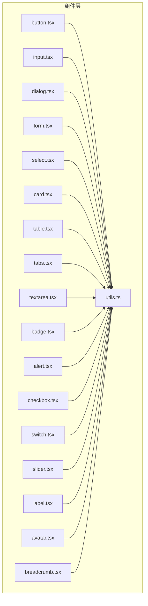
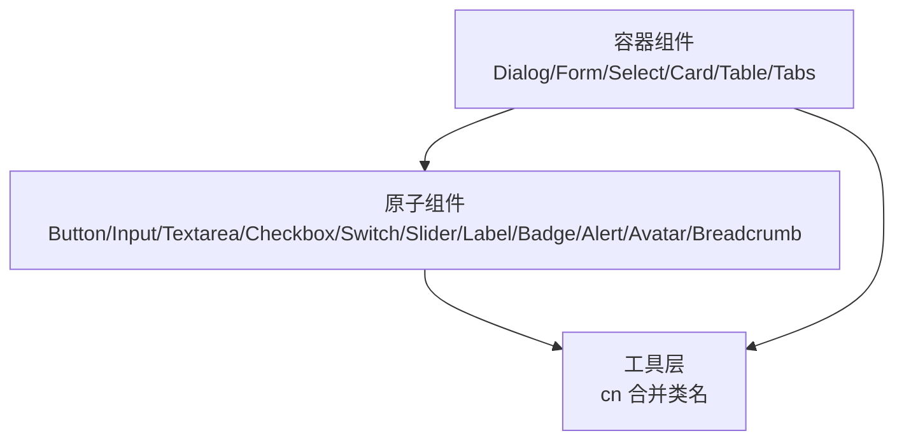
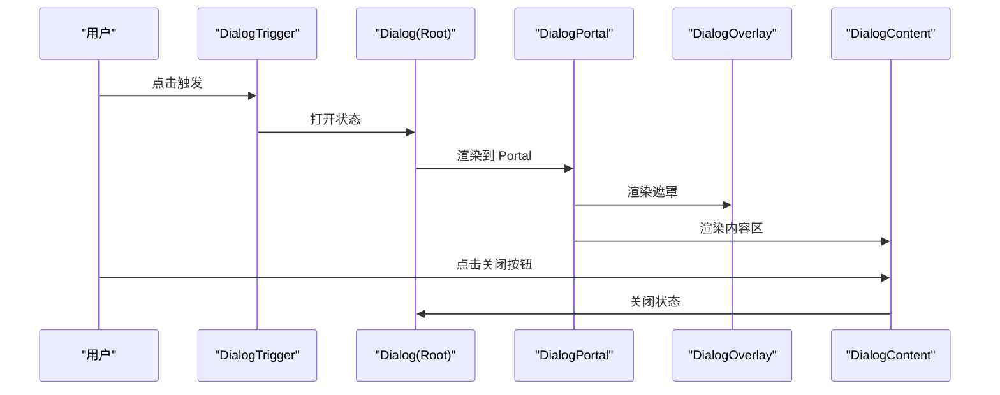
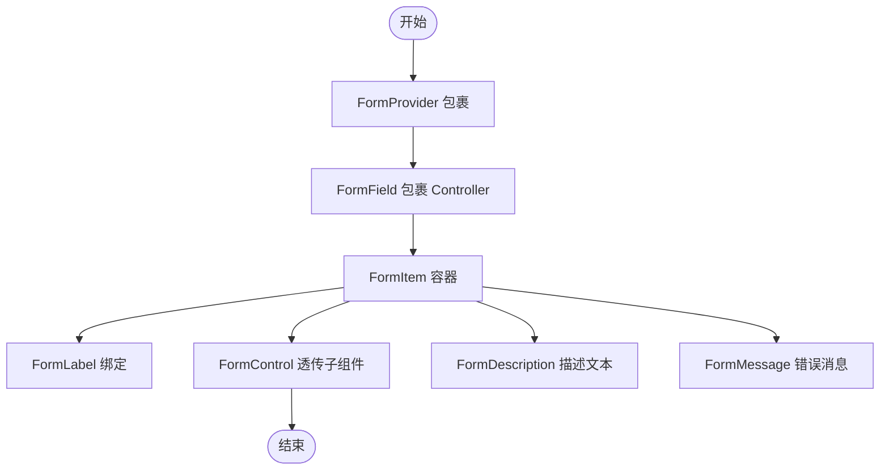
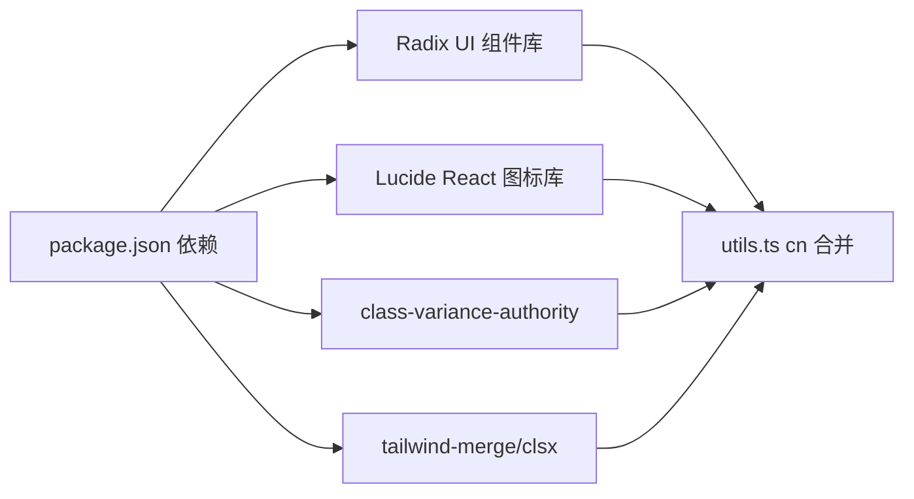

# 组件库基础

<cite>
**本文引用的文件**
- [README.md](file://README.md)
- [package.json](file://package.json)
- [src/app/components/ui/utils.ts](file://src/app/components/ui/utils.ts)
- [src/app/components/ui/button.tsx](file://src/app/components/ui/button.tsx)
- [src/app/components/ui/input.tsx](file://src/app/components/ui/input.tsx)
- [src/app/components/ui/dialog.tsx](file://src/app/components/ui/dialog.tsx)
- [src/app/components/ui/form.tsx](file://src/app/components/ui/form.tsx)
- [src/app/components/ui/select.tsx](file://src/app/components/ui/select.tsx)
- [src/app/components/ui/card.tsx](file://src/app/components/ui/card.tsx)
- [src/app/components/ui/table.tsx](file://src/app/components/ui/table.tsx)
- [src/app/components/ui/tabs.tsx](file://src/app/components/ui/tabs.tsx)
- [src/app/components/ui/textarea.tsx](file://src/app/components/ui/textarea.tsx)
- [src/app/components/ui/badge.tsx](file://src/app/components/ui/badge.tsx)
- [src/app/components/ui/alert.tsx](file://src/app/components/ui/alert.tsx)
- [src/app/components/ui/checkbox.tsx](file://src/app/components/ui/checkbox.tsx)
- [src/app/components/ui/switch.tsx](file://src/app/components/ui/switch.tsx)
- [src/app/components/ui/slider.tsx](file://src/app/components/ui/slider.tsx)
- [src/app/components/ui/label.tsx](file://src/app/components/ui/label.tsx)
- [src/app/components/ui/avatar.tsx](file://src/app/components/ui/avatar.tsx)
- [src/app/components/ui/breadcrumb.tsx](file://src/app/components/ui/breadcrumb.tsx)
</cite>

## 目录
1. [简介](#简介)
2. [项目结构](#项目结构)
3. [核心组件](#核心组件)
4. [架构总览](#架构总览)
5. [组件详解](#组件详解)
6. [依赖关系分析](#依赖关系分析)
7. [性能考量](#性能考量)
8. [故障排查指南](#故障排查指南)
9. [结论](#结论)
10. [附录](#附录)

## 简介
本文件面向HAUI基础组件库，系统梳理基于Radix UI与部分Material UI风格的通用UI组件实现，覆盖按钮、输入框、对话框、表单、选择器、卡片、表格、标签页、文本域、徽章、警示、复选框、开关、滑块、标签、头像、面包屑等核心组件。文档从架构、数据流、处理逻辑、可访问性与响应式行为等方面进行深入说明，并提供API接口、属性参数、事件处理与样式定制要点，以及组合使用与状态管理的最佳实践。

## 项目结构
组件库位于 src/app/components/ui 目录下，采用“按功能模块拆分”的组织方式，每个组件独立文件，统一通过工具函数进行类名合并与主题适配。外部依赖主要来自 Radix UI 生态与 Lucide React 图标库，样式由 Tailwind CSS 与自定义主题变量驱动。

图表来源
- [src/app/components/ui/button.tsx:1-57](file://src/app/components/ui/button.tsx#L1-L57)
- [src/app/components/ui/input.tsx:1-22](file://src/app/components/ui/input.tsx#L1-L22)
- [src/app/components/ui/dialog.tsx:1-135](file://src/app/components/ui/dialog.tsx#L1-L135)
- [src/app/components/ui/form.tsx:1-169](file://src/app/components/ui/form.tsx#L1-L169)
- [src/app/components/ui/select.tsx:1-190](file://src/app/components/ui/select.tsx#L1-L190)
- [src/app/components/ui/card.tsx:1-93](file://src/app/components/ui/card.tsx#L1-L93)
- [src/app/components/ui/table.tsx:1-117](file://src/app/components/ui/table.tsx#L1-L117)
- [src/app/components/ui/tabs.tsx:1-67](file://src/app/components/ui/tabs.tsx#L1-L67)
- [src/app/components/ui/textarea.tsx:1-19](file://src/app/components/ui/textarea.tsx#L1-L19)
- [src/app/components/ui/badge.tsx:1-47](file://src/app/components/ui/badge.tsx#L1-L47)
- [src/app/components/ui/alert.tsx:1-67](file://src/app/components/ui/alert.tsx#L1-L67)
- [src/app/components/ui/checkbox.tsx:1-33](file://src/app/components/ui/checkbox.tsx#L1-L33)
- [src/app/components/ui/switch.tsx:1-32](file://src/app/components/ui/switch.tsx#L1-L32)
- [src/app/components/ui/slider.tsx:1-64](file://src/app/components/ui/slider.tsx#L1-L64)
- [src/app/components/ui/label.tsx:1-25](file://src/app/components/ui/label.tsx#L1-L25)
- [src/app/components/ui/avatar.tsx:1-54](file://src/app/components/ui/avatar.tsx#L1-L54)
- [src/app/components/ui/breadcrumb.tsx:1-110](file://src/app/components/ui/breadcrumb.tsx#L1-L110)
- [src/app/components/ui/utils.ts:1-7](file://src/app/components/ui/utils.ts#L1-L7)

章节来源
- [README.md:1-84](file://README.md#L1-L84)
- [package.json:1-132](file://package.json#L1-L132)

## 核心组件
本节概览各组件的关键职责与共性特征：
- 统一的类名合并工具：通过工具函数对传入 className 进行合并与去重，确保样式链路清晰、可维护。
- 可访问性与焦点管理：广泛使用 aria-* 属性、sr-only 文本、focus-visible 边框与 ring 效果，保证键盘可达与高对比度。
- 主题与暗色模式：通过 Tailwind 变量与 dark: 前缀类适配明暗主题，确保视觉一致性。
- 动画与过渡：借助 Radix UI 的 data-state 与 animate-* 类，实现平滑的进入/退出动画。
- 尺寸与间距：提供默认尺寸与紧凑/宽松变体，满足不同布局密度需求。

章节来源
- [src/app/components/ui/utils.ts:1-7](file://src/app/components/ui/utils.ts#L1-L7)
- [src/app/components/ui/button.tsx:1-57](file://src/app/components/ui/button.tsx#L1-L57)
- [src/app/components/ui/dialog.tsx:1-135](file://src/app/components/ui/dialog.tsx#L1-L135)
- [src/app/components/ui/form.tsx:1-169](file://src/app/components/ui/form.tsx#L1-L169)
- [src/app/components/ui/select.tsx:1-190](file://src/app/components/ui/select.tsx#L1-L190)
- [src/app/components/ui/card.tsx:1-93](file://src/app/components/ui/card.tsx#L1-L93)
- [src/app/components/ui/table.tsx:1-117](file://src/app/components/ui/table.tsx#L1-L117)
- [src/app/components/ui/tabs.tsx:1-67](file://src/app/components/ui/tabs.tsx#L1-L67)
- [src/app/components/ui/textarea.tsx:1-19](file://src/app/components/ui/textarea.tsx#L1-L19)
- [src/app/components/ui/badge.tsx:1-47](file://src/app/components/ui/badge.tsx#L1-L47)
- [src/app/components/ui/alert.tsx:1-67](file://src/app/components/ui/alert.tsx#L1-L67)
- [src/app/components/ui/checkbox.tsx:1-33](file://src/app/components/ui/checkbox.tsx#L1-L33)
- [src/app/components/ui/switch.tsx:1-32](file://src/app/components/ui/switch.tsx#L1-L32)
- [src/app/components/ui/slider.tsx:1-64](file://src/app/components/ui/slider.tsx#L1-L64)
- [src/app/components/ui/label.tsx:1-25](file://src/app/components/ui/label.tsx#L1-L25)
- [src/app/components/ui/avatar.tsx:1-54](file://src/app/components/ui/avatar.tsx#L1-L54)
- [src/app/components/ui/breadcrumb.tsx:1-110](file://src/app/components/ui/breadcrumb.tsx#L1-L110)

## 架构总览
组件库以“原子化组件 + 组合容器”为核心理念，通过以下方式实现一致的交互与视觉体验：
- 原子组件：Button、Input、Textarea、Checkbox、Switch、Slider、Label、Badge、Alert、Avatar、Breadcrumb 等，负责单一交互或展示职责。
- 容器组件：Dialog、Form、Select、Card、Table、Tabs 等，封装复杂交互与状态管理，提供语义化的子组件。
- 工具层：cn 合并类名，统一主题与可访问性基线。
- 动画与过渡：基于 Radix UI 的 data-state 与内置动画类，保证流畅体验。
- 可组合性：asChild 模式与 Slot 组件，允许上层灵活包裹与扩展。

图表来源
- [src/app/components/ui/utils.ts:1-7](file://src/app/components/ui/utils.ts#L1-L7)
- [src/app/components/ui/button.tsx:1-57](file://src/app/components/ui/button.tsx#L1-L57)
- [src/app/components/ui/dialog.tsx:1-135](file://src/app/components/ui/dialog.tsx#L1-L135)
- [src/app/components/ui/form.tsx:1-169](file://src/app/components/ui/form.tsx#L1-L169)
- [src/app/components/ui/select.tsx:1-190](file://src/app/components/ui/select.tsx#L1-L190)
- [src/app/components/ui/card.tsx:1-93](file://src/app/components/ui/card.tsx#L1-L93)
- [src/app/components/ui/table.tsx:1-117](file://src/app/components/ui/table.tsx#L1-L117)
- [src/app/components/ui/tabs.tsx:1-67](file://src/app/components/ui/tabs.tsx#L1-L67)

## 组件详解

### 按钮 Button
- 设计原则：提供多种语义与尺寸变体，支持作为容器包裹任意子元素；聚焦态与禁用态具备明确视觉反馈。
- 关键属性
  - variant: default/destructive/outline/secondary/ghost/link
  - size: default/sm/lg/icon
  - asChild: 是否以子元素作为渲染根节点
  - 其余原生 button 属性透传
- 可访问性：自动注入 focus-visible 边框与 ring，支持 aria-invalid 与 sr-only 文本。
- 样式定制：通过 variant/size 与 className 合并实现；支持在子元素中嵌入图标并自动对齐。

章节来源
- [src/app/components/ui/button.tsx:1-57](file://src/app/components/ui/button.tsx#L1-L57)

### 输入框 Input
- 设计原则：简洁的边框与背景，聚焦态高对比度提示；支持占位符与禁用态。
- 关键属性
  - type: 原生 input 类型
  - 其余原生 input 属性透传
- 可访问性：聚焦态与错误态具备 aria-invalid 与 ring 提示。
- 样式定制：通过 className 合并实现宽度、圆角、内边距等调整。

章节来源
- [src/app/components/ui/input.tsx:1-22](file://src/app/components/ui/input.tsx#L1-L22)

### 对话框 Dialog
- 设计原则：模态遮罩、居中内容区、带关闭按钮；支持 Portal 渲染，避免层级问题。
- 子组件
  - Dialog/DialogTrigger/DialogPortal/DialogClose
  - DialogOverlay/DialogContent/DialogTitle/DialogDescription/DialogHeader/DialogFooter
- 关键属性
  - Root/Trigger/Portal/Close: 透传 Radix UI 原生属性
  - Content: 支持 className 与动画类
- 可访问性：包含 sr-only 文本与键盘关闭；支持 ESC 关闭。
- 样式定制：通过 className 自定义尺寸、圆角、阴影与动画。

图表来源
- [src/app/components/ui/dialog.tsx:1-135](file://src/app/components/ui/dialog.tsx#L1-L135)

章节来源
- [src/app/components/ui/dialog.tsx:1-135](file://src/app/components/ui/dialog.tsx#L1-L135)

### 表单 Form（含 FormField）
- 设计原则：基于 react-hook-form 的上下文，提供 Form、FormField、FormItem、FormLabel、FormControl、FormDescription、FormMessage。
- 关键能力
  - useFormField 获取字段状态与 aria-* 属性 ID
  - 自动注入 aria-describedby 与 aria-invalid
  - 支持错误消息渲染与描述文本
- 使用建议：在 FormProvider 包裹下使用，结合 Label 与 FormControl 组合，确保可访问性与一致性。

图表来源
- [src/app/components/ui/form.tsx:1-169](file://src/app/components/ui/form.tsx#L1-L169)

章节来源
- [src/app/components/ui/form.tsx:1-169](file://src/app/components/ui/form.tsx#L1-L169)

### 选择器 Select
- 设计原则：下拉面板、滚动条、选中指示器；支持分组、标签、分隔线与滚动按钮。
- 子组件
  - Select/SelectTrigger/SelectValue/SelectContent/SelectViewport/SelectItem/SelectLabel/SelectSeparator/SelectScrollUpButton/SelectScrollDownButton
- 关键属性
  - Trigger 支持 size: sm/default
  - Content 支持 position: popper 或指定侧向偏移
- 可访问性：自动对齐触发器尺寸与宽度，支持键盘导航与滚动。
- 样式定制：通过 className 控制尺寸、圆角、阴影与动画。

章节来源
- [src/app/components/ui/select.tsx:1-190](file://src/app/components/ui/select.tsx#L1-L190)

### 卡片 Card
- 设计原则：统一的卡片容器，支持头部、标题、描述、操作区、内容区与底部区。
- 子组件
  - Card/CardHeader/CardTitle/CardDescription/CardAction/CardContent/CardFooter
- 使用建议：头部区域可放置操作按钮，内容区承载复杂布局，底部区用于操作按钮组。

章节来源
- [src/app/components/ui/card.tsx:1-93](file://src/app/components/ui/card.tsx#L1-L93)

### 表格 Table
- 设计原则：容器 + 语义化表格结构，支持横向滚动与悬停/选中态。
- 子组件
  - Table/TableHeader/TableBody/TableFooter/TableRow/TableCell/TableHead/TableCaption
- 使用建议：配合 @tanstack/react-table 实现排序、分页与虚拟化；Table 容器提供横向滚动能力。

章节来源
- [src/app/components/ui/table.tsx:1-117](file://src/app/components/ui/table.tsx#L1-L117)

### 标签页 Tabs
- 设计原则：标签列表与内容区分离，支持激活态样式与键盘导航。
- 子组件
  - Tabs/TabsList/TabsTrigger/TabsContent
- 使用建议：为每个 Tab 设置唯一 key，内容区使用 TabsContent 包裹。

章节来源
- [src/app/components/ui/tabs.tsx:1-67](file://src/app/components/ui/tabs.tsx#L1-L67)

### 文本域 Textarea
- 设计原则：禁用自动调整大小，聚焦态高对比度提示；支持禁用态。
- 关键属性
  - 其余原生 textarea 属性透传
- 样式定制：通过 className 控制尺寸、圆角与内边距。

章节来源
- [src/app/components/ui/textarea.tsx:1-19](file://src/app/components/ui/textarea.tsx#L1-L19)

### 徽章 Badge
- 设计原则：强调信息与状态标记，支持多种语义变体与 asChild 模式。
- 关键属性
  - variant: default/secondary/destructive/outline
  - asChild: 是否以子元素作为渲染根节点
- 使用建议：配合状态变化动态切换变体。

章节来源
- [src/app/components/ui/badge.tsx:1-47](file://src/app/components/ui/badge.tsx#L1-L47)

### 警示 Alert
- 设计原则：信息提示容器，支持标题与描述文本；支持破坏性样式。
- 子组件
  - Alert/AlertTitle/AlertDescription
- 使用建议：用于全局通知、表单错误提示或操作结果反馈。

章节来源
- [src/app/components/ui/alert.tsx:1-67](file://src/app/components/ui/alert.tsx#L1-L67)

### 复选框 Checkbox
- 设计原则：选中/未选中态与指示器；支持禁用态与聚焦态。
- 关键属性
  - 其余原生 checkbox 属性透传
- 使用建议：与 Label 组合使用，确保点击区域与可访问性。

章节来源
- [src/app/components/ui/checkbox.tsx:1-33](file://src/app/components/ui/checkbox.tsx#L1-L33)

### 开关 Switch
- 设计原则：滑动开关，支持禁用态与聚焦态；拇指位置随状态变化。
- 关键属性
  - 其余原生 switch 属性透传
- 使用建议：用于二元状态切换，如“夜间模式”、“启用通知”。

章节来源
- [src/app/components/ui/switch.tsx:1-32](file://src/app/components/ui/switch.tsx#L1-L32)

### 滑块 Slider
- 设计原则：支持单值与多值滑块；track/range/thumb 结构清晰；支持垂直/水平方向。
- 关键属性
  - defaultValue/value/min/max
  - 其余原生 slider 属性透传
- 使用建议：与数值输入联动，提供精确与直观的调节体验。

章节来源
- [src/app/components/ui/slider.tsx:1-64](file://src/app/components/ui/slider.tsx#L1-L64)

### 标签 Label
- 设计原则：与表单控件配对使用，支持禁用态与分组禁用态。
- 关键属性
  - 其余原生 label 属性透传
- 使用建议：与 FormControl/Checkbox/Radio 等组合，提升可访问性。

章节来源
- [src/app/components/ui/label.tsx:1-25](file://src/app/components/ui/label.tsx#L1-L25)

### 头像 Avatar
- 设计原则：头像容器、图片与回退占位；支持尺寸与圆角。
- 子组件
  - Avatar/AvatarImage/AvatarFallback
- 使用建议：图片加载失败时显示回退占位，保持界面一致性。

章节来源
- [src/app/components/ui/avatar.tsx:1-54](file://src/app/components/ui/avatar.tsx#L1-L54)

### 面包屑 Breadcrumb
- 设计原则：导航路径指示，支持省略号与链接/当前页状态。
- 子组件
  - Breadcrumb/BreadcrumbList/BreadcrumbItem/BreadcrumbLink/BreadcrumbPage/BreadcrumbSeparator/BreadcrumbEllipsis
- 使用建议：长路径场景使用省略号，短路径直接展示全部。

章节来源
- [src/app/components/ui/breadcrumb.tsx:1-110](file://src/app/components/ui/breadcrumb.tsx#L1-L110)

## 依赖关系分析
组件库依赖 Radix UI 与 Lucide React，通过 cn 工具统一类名合并，形成稳定的样式与交互基线。

图表来源
- [package.json:1-132](file://package.json#L1-L132)
- [src/app/components/ui/utils.ts:1-7](file://src/app/components/ui/utils.ts#L1-L7)

章节来源
- [package.json:1-132](file://package.json#L1-L132)

## 性能考量
- 动画与过渡：组件普遍使用 Radix UI 的 data-state 与内置动画类，避免复杂 JS 动画，降低主线程压力。
- 类名合并：通过 cn 合并与去重，减少无效样式叠加，提升渲染效率。
- 可访问性与响应式：统一的 focus-visible 与 ring 效果，减少重复计算；尺寸与间距通过 Tailwind 工具类实现，避免运行时样式计算。
- 建议
  - 在大量列表场景优先使用虚拟化方案（如 @tanstack/react-virtual），减少 DOM 节点数量。
  - 图标与媒体资源尽量使用 CSS mask 或预加载策略，避免频繁解析与重绘。
  - 表单与选择器组件在高频交互场景下，注意防抖与批量更新，避免不必要的重渲染。

## 故障排查指南
- 可访问性相关
  - 确保表单控件与 Label 正确关联，错误态通过 aria-invalid 与 aria-describedby 明确提示。
  - 对话框与弹出层使用 Portal 渲染，避免层级与滚动穿透问题。
- 样式冲突
  - 使用 className 合并工具，避免重复覆盖；必要时使用 !important 前缀定位冲突来源。
- 交互异常
  - 检查禁用态与聚焦态类是否正确应用；确认事件冒泡与阻止默认行为的使用场景。
- 性能问题
  - 大量渲染时启用虚拟化；避免在渲染周期内进行昂贵计算；合理拆分组件与使用 memo。

章节来源
- [src/app/components/ui/form.tsx:1-169](file://src/app/components/ui/form.tsx#L1-L169)
- [src/app/components/ui/dialog.tsx:1-135](file://src/app/components/ui/dialog.tsx#L1-L135)
- [src/app/components/ui/utils.ts:1-7](file://src/app/components/ui/utils.ts#L1-L7)

## 结论
HAUI 基础组件库以 Radix UI 为核心，结合 Lucide 图标与 Tailwind CSS，构建了高可访问性、强一致性与良好性能的通用组件体系。通过清晰的子组件划分、统一的工具层与主题适配，开发者可以快速搭建复杂的仪表板与交互界面。建议在实际项目中遵循可访问性与性能最佳实践，结合业务场景进行样式与交互的二次封装。

## 附录
- 最佳实践清单
  - 表单：使用 FormProvider + FormField + Label + FormControl 组合，确保可访问性与错误提示。
  - 弹窗：Dialog 内容区使用 Header/Footer 分离结构，提供明确关闭入口。
  - 列表/表格：优先考虑虚拟化与分页，避免一次性渲染过多节点。
  - 图标：统一使用 Lucide 组件，避免内联 SVG 字符串带来的解析成本。
  - 主题：利用 dark: 前缀与 Tailwind 变量，确保明暗模式一致体验。