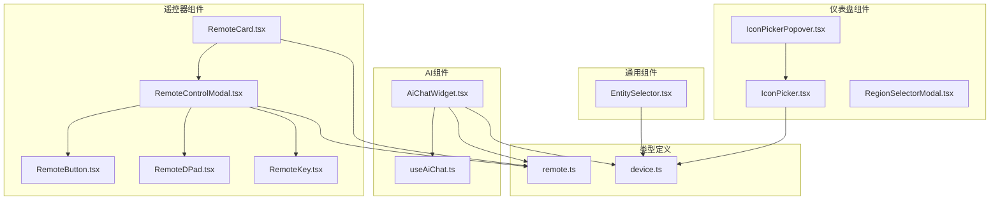
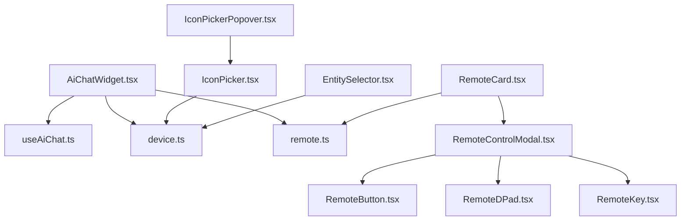
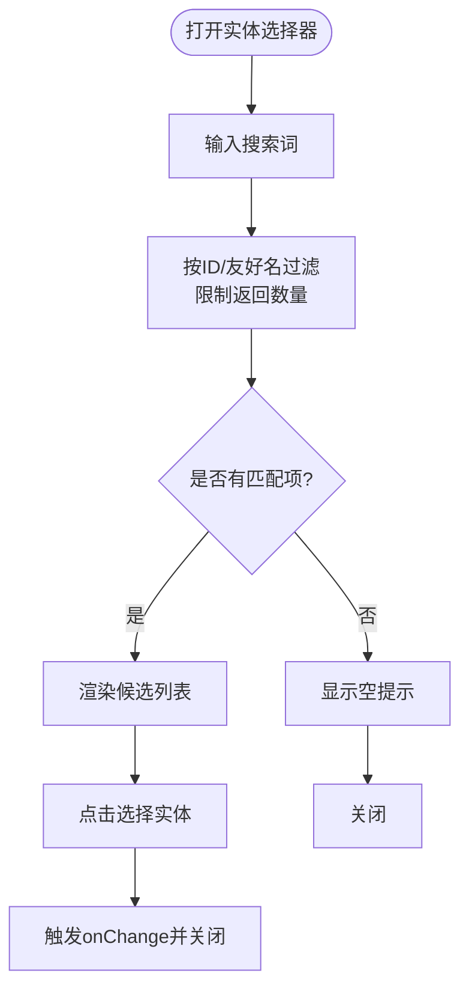
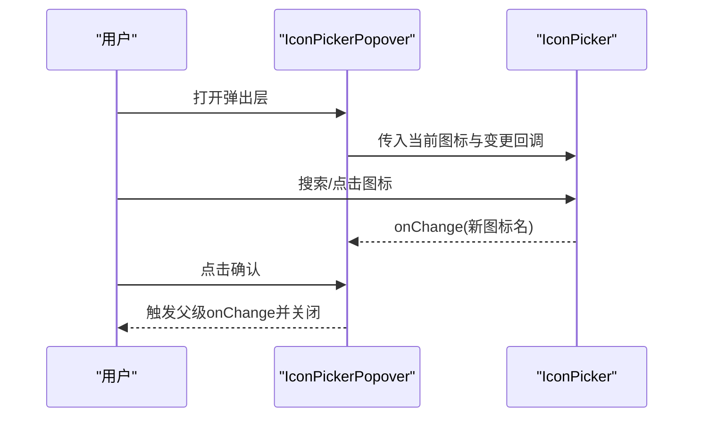
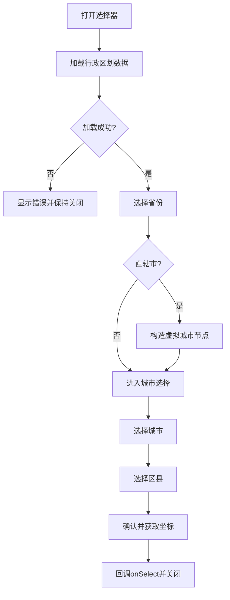
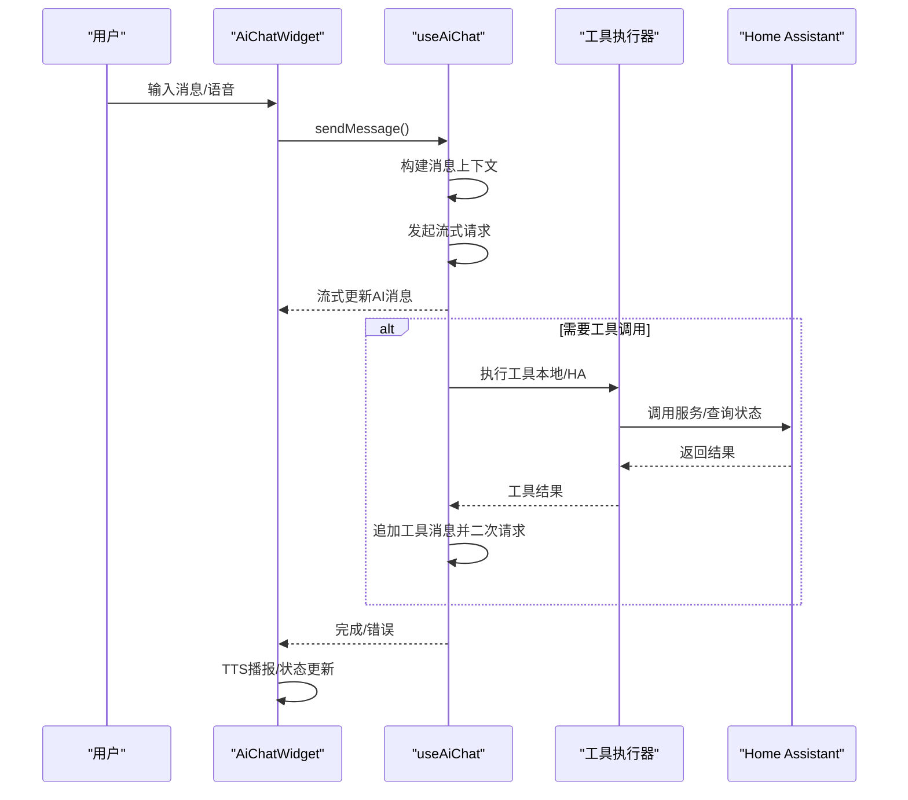
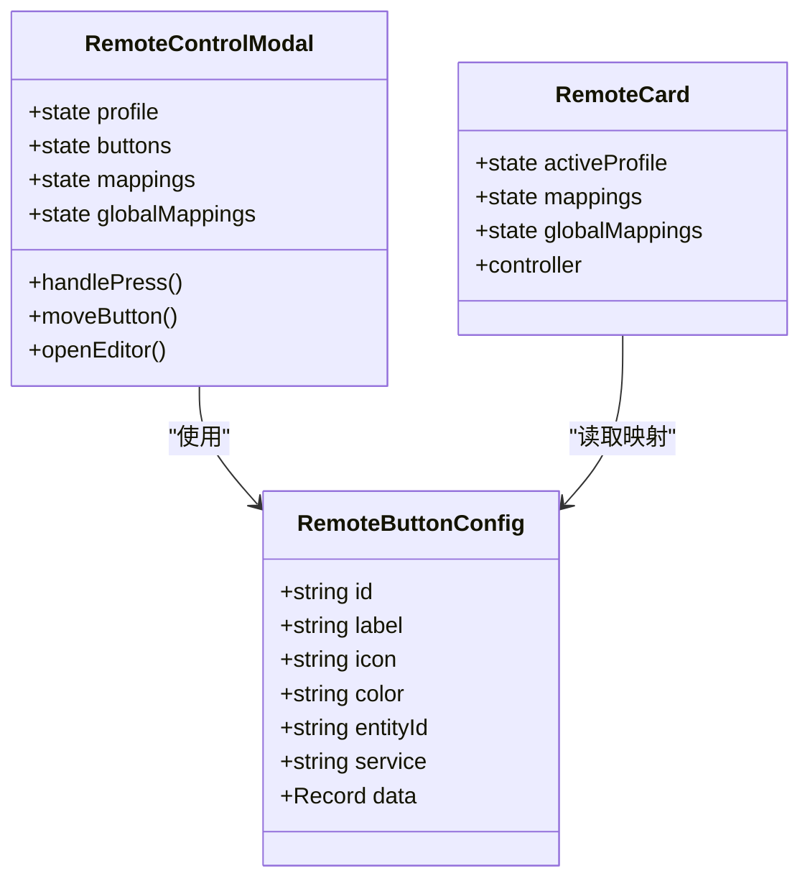
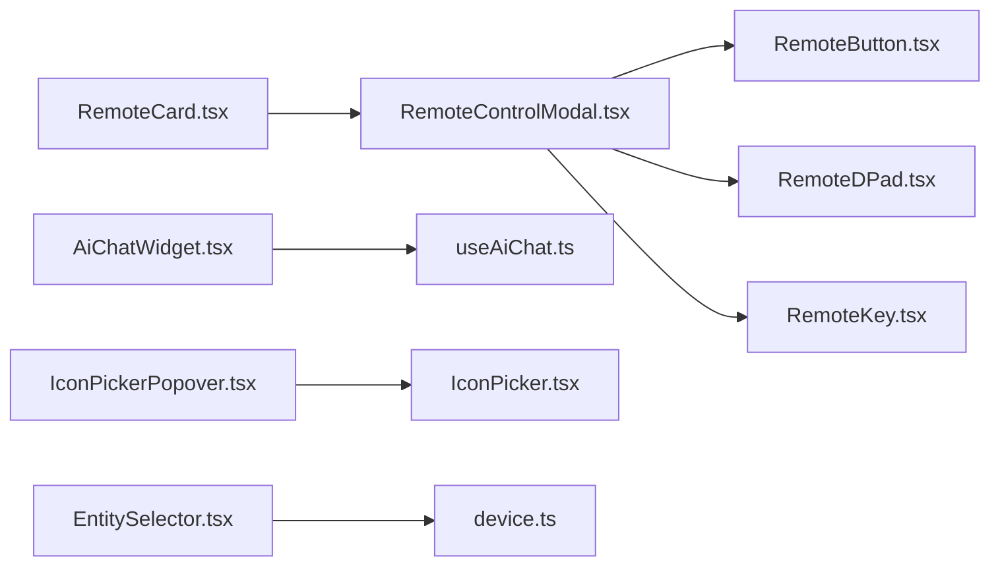

# 自定义组件

<cite>
**本文档引用的文件**
- [EntitySelector.tsx](file://src/app/components/common/EntitySelector.tsx)
- [IconPicker.tsx](file://src/app/components/dashboard/IconPicker.tsx)
- [IconPickerPopover.tsx](file://src/app/components/dashboard/IconPickerPopover.tsx)
- [RegionSelectorModal.tsx](file://src/app/components/dashboard/RegionSelectorModal.tsx)
- [AiChatWidget.tsx](file://src/app/components/AiChatWidget.tsx)
- [useAiChat.ts](file://src/hooks/useAiChat.ts)
- [RemoteCard.tsx](file://src/app/components/remote/RemoteCard.tsx)
- [RemoteControlModal.tsx](file://src/app/components/remote/RemoteControlModal.tsx)
- [RemoteDPad.tsx](file://src/app/components/remote/RemoteDPad.tsx)
- [RemoteButton.tsx](file://src/app/components/remote/RemoteButton.tsx)
- [RemoteKey.tsx](file://src/app/components/remote/RemoteKey.tsx)
- [remote.ts](file://src/types/remote.ts)
- [device.ts](file://src/types/device.ts)
</cite>

## 目录
1. [简介](#简介)
2. [项目结构](#项目结构)
3. [核心组件](#核心组件)
4. [架构总览](#架构总览)
5. [详细组件分析](#详细组件分析)
6. [依赖分析](#依赖分析)
7. [性能考虑](#性能考虑)
8. [故障排查指南](#故障排查指南)
9. [结论](#结论)
10. [附录](#附录)

## 简介
本文件面向HAUI的自定义组件开发，围绕以下业务组件进行深入解析：实体选择器、图标选择器、区域选择器、AI聊天组件与遥控器组件。内容涵盖功能特性、API接口、配置选项、使用场景、可复用性设计、状态管理与事件处理机制，并提供最佳实践、测试策略与性能优化建议，以及组件间的依赖关系与集成模式。

## 项目结构
本项目采用按功能域划分的组织方式，自定义组件主要分布在以下路径：
- 通用组件：common/EntitySelector
- 仪表盘组件：dashboard/IconPicker、IconPickerPopover、RegionSelectorModal
- AI组件：AiChatWidget 及其核心Hook useAiChat
- 遥控器组件：remote/RemoteCard、RemoteControlModal、RemoteDPad、RemoteButton、RemoteKey
- 类型定义：types/remote.ts、types/device.ts

图表来源
- [AiChatWidget.tsx:1-678](file://src/app/components/AiChatWidget.tsx#L1-L678)
- [useAiChat.ts:1-317](file://src/hooks/useAiChat.ts#L1-L317)
- [RemoteCard.tsx:1-310](file://src/app/components/remote/RemoteCard.tsx#L1-L310)
- [RemoteControlModal.tsx:1-778](file://src/app/components/remote/RemoteControlModal.tsx#L1-L778)
- [RemoteDPad.tsx:1-114](file://src/app/components/remote/RemoteDPad.tsx#L1-L114)
- [RemoteButton.tsx:1-120](file://src/app/components/remote/RemoteButton.tsx#L1-L120)
- [RemoteKey.tsx:1-81](file://src/app/components/remote/RemoteKey.tsx#L1-L81)
- [IconPicker.tsx:1-90](file://src/app/components/dashboard/IconPicker.tsx#L1-L90)
- [IconPickerPopover.tsx:1-91](file://src/app/components/dashboard/IconPickerPopover.tsx#L1-L91)
- [RegionSelectorModal.tsx:1-245](file://src/app/components/dashboard/RegionSelectorModal.tsx#L1-L245)
- [EntitySelector.tsx:1-71](file://src/app/components/common/EntitySelector.tsx#L1-L71)
- [remote.ts:1-45](file://src/types/remote.ts#L1-L45)
- [device.ts:1-46](file://src/types/device.ts#L1-L46)

章节来源
- [AiChatWidget.tsx:1-678](file://src/app/components/AiChatWidget.tsx#L1-L678)
- [RemoteControlModal.tsx:1-778](file://src/app/components/remote/RemoteControlModal.tsx#L1-L778)
- [IconPicker.tsx:1-90](file://src/app/components/dashboard/IconPicker.tsx#L1-L90)
- [RegionSelectorModal.tsx:1-245](file://src/app/components/dashboard/RegionSelectorModal.tsx#L1-L245)
- [EntitySelector.tsx:1-71](file://src/app/components/common/EntitySelector.tsx#L1-L71)

## 核心组件
本节概述各组件的职责、对外API与典型使用场景：
- 实体选择器：在大量实体中提供搜索与快速选择，支持友好名与实体ID过滤，限制初始展示数量以提升性能。
- 图标选择器：基于MDI图标库的搜索与选择，支持常用图标默认展示与动态搜索。
- 区域选择器：多级联动选择省市区并获取地理坐标，支持直辖市特殊结构处理。
- AI聊天组件：提供浮动/侧边栏/最小化三种视图模式，支持文本与语音输入、流式响应、TTS播报、快捷键与拖拽关闭。
- 遥控器组件：提供可配置的遥控器界面，支持多配置文件（电视/机顶盒/音响）、按键映射（名称、图标、实体ID）、拖拽排序与全局配置同步。

章节来源
- [EntitySelector.tsx:1-71](file://src/app/components/common/EntitySelector.tsx#L1-L71)
- [IconPicker.tsx:1-90](file://src/app/components/dashboard/IconPicker.tsx#L1-L90)
- [RegionSelectorModal.tsx:1-245](file://src/app/components/dashboard/RegionSelectorModal.tsx#L1-L245)
- [AiChatWidget.tsx:1-678](file://src/app/components/AiChatWidget.tsx#L1-L678)
- [RemoteControlModal.tsx:1-778](file://src/app/components/remote/RemoteControlModal.tsx#L1-L778)

## 架构总览
AI聊天组件与遥控器组件均依赖类型定义与工具模块；遥控器组件内部进一步拆分为卡片与模态编辑器，配合按键与方向键组件；图标选择器通过弹出层承载资产选择器；实体选择器作为通用交互组件被多个页面复用。

图表来源
- [AiChatWidget.tsx:1-678](file://src/app/components/AiChatWidget.tsx#L1-L678)
- [useAiChat.ts:1-317](file://src/hooks/useAiChat.ts#L1-L317)
- [RemoteControlModal.tsx:1-778](file://src/app/components/remote/RemoteControlModal.tsx#L1-L778)
- [RemoteButton.tsx:1-120](file://src/app/components/remote/RemoteButton.tsx#L1-L120)
- [RemoteDPad.tsx:1-114](file://src/app/components/remote/RemoteDPad.tsx#L1-L114)
- [RemoteKey.tsx:1-81](file://src/app/components/remote/RemoteKey.tsx#L1-L81)
- [RemoteCard.tsx:1-310](file://src/app/components/remote/RemoteCard.tsx#L1-L310)
- [IconPicker.tsx:1-90](file://src/app/components/dashboard/IconPicker.tsx#L1-L90)
- [IconPickerPopover.tsx:1-91](file://src/app/components/dashboard/IconPickerPopover.tsx#L1-L91)
- [EntitySelector.tsx:1-71](file://src/app/components/common/EntitySelector.tsx#L1-L71)
- [remote.ts:1-45](file://src/types/remote.ts#L1-L45)
- [device.ts:1-46](file://src/types/device.ts#L1-L46)

## 详细组件分析

### 实体选择器（EntitySelector）
- 功能特性
  - 支持按实体ID与友好名搜索，区分大小写不敏感。
  - 初始展示限制，避免一次性渲染过多实体导致卡顿。
  - 选中态高亮与关闭回调。
- API接口
  - 属性
    - entities: Home Assistant实体集合
    - value?: 当前选中实体ID
    - onChange(entityId): 选中回调
    - onClose(): 关闭回调
- 使用场景
  - 设备编辑、服务调用目标选择、卡片配置等需要从大量实体中挑选目标的场景。
- 状态管理与事件
  - 内部维护搜索词与过滤结果，使用memo化减少无效渲染。
- 性能优化
  - 限制初始列表长度与搜索结果上限；使用防抖/节流可进一步优化（当前为即时过滤）。
- 可复用性
  - 无副作用依赖，可直接复用至任意页面。

图表来源
- [EntitySelector.tsx:12-71](file://src/app/components/common/EntitySelector.tsx#L12-L71)

章节来源
- [EntitySelector.tsx:1-71](file://src/app/components/common/EntitySelector.tsx#L1-L71)

### 图标选择器（IconPicker）与弹出层（IconPickerPopover）
- 功能特性
  - 常用MDI图标默认展示，支持中英文搜索。
  - 弹出层提供预览与确认/取消操作，便于在表单中选择图标。
- API接口
  - IconPicker
    - 属性：value（当前图标名）、onChange(iconName)
  - IconPickerPopover
    - 属性：value、onChange、children、align、side
- 使用场景
  - 卡片/设备自定义图标设置、主题化UI元素。
- 状态管理与事件
  - IconPicker内部维护搜索词与过滤结果。
  - IconPickerPopover维护待确认图标与打开状态。
- 性能优化
  - 搜索结果限制；网格渲染按需滚动。
- 可复用性
  - 作为独立UI控件，可在多处复用。

图表来源
- [IconPicker.tsx:19-90](file://src/app/components/dashboard/IconPicker.tsx#L19-L90)
- [IconPickerPopover.tsx:14-91](file://src/app/components/dashboard/IconPickerPopover.tsx#L14-L91)

章节来源
- [IconPicker.tsx:1-90](file://src/app/components/dashboard/IconPicker.tsx#L1-L90)
- [IconPickerPopover.tsx:1-91](file://src/app/components/dashboard/IconPickerPopover.tsx#L1-L91)

### 区域选择器（RegionSelectorModal）
- 功能特性
  - 多级联动选择省/市/区县，支持直辖市特殊结构处理。
  - 选择后异步获取区县坐标，若失败则降级为默认位置。
- API接口
  - 属性：open、onOpenChange、onSelect、defaultRegion
  - onSelect回调返回包含省市区与坐标（可选）的对象。
- 使用场景
  - 天气/地理相关配置，需要同步到具体城市。
- 状态管理与事件
  - 内部维护regions数据、加载状态、错误状态与三段选择值。
  - 通过fetch加载level.json，错误时提示。
- 性能优化
  - 仅在打开时加载数据；选择过程禁用无效选项。
- 可复用性
  - 作为通用选择器，可扩展至其他需要多级选择的场景。

图表来源
- [RegionSelectorModal.tsx:30-245](file://src/app/components/dashboard/RegionSelectorModal.tsx#L30-L245)

章节来源
- [RegionSelectorModal.tsx:1-245](file://src/app/components/dashboard/RegionSelectorModal.tsx#L1-L245)

### AI聊天组件（AiChatWidget）与Hook（useAiChat）
- 功能特性
  - 三种视图模式：浮动、侧边栏、最小化；支持拖拽关闭与键盘快捷键。
  - 文本与语音输入（按住说话/上滑取消），流式响应，TTS播报。
  - 配置面板（模型参数、历史记录管理）。
- API接口
  - AiChatWidget
    - 属性：entities（HassEntities）
  - useAiChat
    - 返回：messages、inputValue、setInputValue、isLoading、config、sendMessage、handleSaveConfig、clearHistory、abortChat
- 使用场景
  - 家庭自动化助手、设备状态查询与控制、智能问答。
- 状态管理与事件
  - AiChatWidget管理视图模式、可见性、语音状态、拖拽与快捷键。
  - useAiChat管理消息流、配置持久化、工具调用（本地/HA服务）与错误处理。
- 性能优化
  - 流式渲染、占位消息、工具调用前后端分离、AbortController中断请求。
- 可复用性
  - Hook抽离核心逻辑，组件负责UI与交互；可在不同页面复用。

图表来源
- [AiChatWidget.tsx:335-678](file://src/app/components/AiChatWidget.tsx#L335-L678)
- [useAiChat.ts:57-317](file://src/hooks/useAiChat.ts#L57-L317)

章节来源
- [AiChatWidget.tsx:1-678](file://src/app/components/AiChatWidget.tsx#L1-L678)
- [useAiChat.ts:1-317](file://src/hooks/useAiChat.ts#L1-L317)

### 遥控器组件（RemoteCard、RemoteControlModal、RemoteDPad、RemoteButton、RemoteKey）
- 功能特性
  - 多配置文件（电视/机顶盒/音响），按键映射（名称、图标、实体ID）。
  - 编辑模式：拖拽排序、新增/删除按钮、实体搜索与选择。
  - 全局配置与本地存储同步，跨组件事件通知。
- API接口
  - RemoteCard
    - 属性：device、onClick、sendIR、isEditing、isCommon、onToggleCommon
  - RemoteControlModal
    - 属性：isOpen、onClose、device、callService、entities
  - RemoteDPad/RemoteButton/RemoteKey
    - 属性：buttons、onClick、isEditing、size、variant、isReserved等
  - 类型定义：remote.ts（RemoteButtonConfig、DEFAULT_REMOTE_BUTTONS）
- 使用场景
  - 设备遥控、自定义快捷键、媒体控制。
- 状态管理与事件
  - 本地存储持久化配置；窗口事件通知其他实例；拖拽排序与实体搜索。
- 性能优化
  - 按钮列表虚拟滚动、按键映射缓存、事件去抖。
- 可复用性
  - 组件拆分清晰，按键与方向键可复用；配置持久化与事件广播增强复用性。

图表来源
- [RemoteControlModal.tsx:49-200](file://src/app/components/remote/RemoteControlModal.tsx#L49-L200)
- [RemoteCard.tsx:40-128](file://src/app/components/remote/RemoteCard.tsx#L40-L128)
- [remote.ts:1-45](file://src/types/remote.ts#L1-L45)

章节来源
- [RemoteCard.tsx:1-310](file://src/app/components/remote/RemoteCard.tsx#L1-L310)
- [RemoteControlModal.tsx:1-778](file://src/app/components/remote/RemoteControlModal.tsx#L1-L778)
- [RemoteDPad.tsx:1-114](file://src/app/components/remote/RemoteDPad.tsx#L1-L114)
- [RemoteButton.tsx:1-120](file://src/app/components/remote/RemoteButton.tsx#L1-L120)
- [RemoteKey.tsx:1-81](file://src/app/components/remote/RemoteKey.tsx#L1-L81)
- [remote.ts:1-45](file://src/types/remote.ts#L1-L45)

## 依赖分析
- 组件耦合
  - RemoteControlModal与RemoteButton/RemoteDPad/RemoteKey存在组合关系，RemoteCard依赖RemoteControlModal进行编辑与展示。
  - AiChatWidget依赖useAiChat进行消息与配置管理。
  - IconPickerPopover承载IconPicker，形成弹出层选择链路。
  - EntitySelector作为通用选择器被多处使用。
- 外部依赖
  - Home Assistant实体与服务调用（通过工具执行器与连接封装）。
  - 本地存储与窗口事件用于配置同步。
- 循环依赖
  - 未发现循环导入；组件间通过props与事件通信。

图表来源
- [RemoteControlModal.tsx:1-778](file://src/app/components/remote/RemoteControlModal.tsx#L1-L778)
- [RemoteButton.tsx:1-120](file://src/app/components/remote/RemoteButton.tsx#L1-L120)
- [RemoteDPad.tsx:1-114](file://src/app/components/remote/RemoteDPad.tsx#L1-L114)
- [RemoteKey.tsx:1-81](file://src/app/components/remote/RemoteKey.tsx#L1-L81)
- [RemoteCard.tsx:1-310](file://src/app/components/remote/RemoteCard.tsx#L1-L310)
- [AiChatWidget.tsx:1-678](file://src/app/components/AiChatWidget.tsx#L1-L678)
- [useAiChat.ts:1-317](file://src/hooks/useAiChat.ts#L1-L317)
- [IconPickerPopover.tsx:1-91](file://src/app/components/dashboard/IconPickerPopover.tsx#L1-L91)
- [IconPicker.tsx:1-90](file://src/app/components/dashboard/IconPicker.tsx#L1-L90)
- [EntitySelector.tsx:1-71](file://src/app/components/common/EntitySelector.tsx#L1-L71)

章节来源
- [RemoteControlModal.tsx:1-778](file://src/app/components/remote/RemoteControlModal.tsx#L1-L778)
- [AiChatWidget.tsx:1-678](file://src/app/components/AiChatWidget.tsx#L1-L678)
- [IconPickerPopover.tsx:1-91](file://src/app/components/dashboard/IconPickerPopover.tsx#L1-L91)
- [EntitySelector.tsx:1-71](file://src/app/components/common/EntitySelector.tsx#L1-L71)

## 性能考虑
- 列表渲染
  - 实体选择器与遥控器按键列表限制初始/搜索结果数量，避免一次性渲染过多节点。
- 渲染优化
  - 使用memo化与浅比较减少无效重渲染；AiChatWidget对消息列表与输入框进行自动滚动与动画过渡。
- IO与网络
  - useAiChat使用AbortController中断请求，避免重复流式请求；远程配置通过本地存储与事件广播同步，降低频繁读写。
- 交互体验
  - 按键与方向键采用clipPath与触摸目标尺寸优化，保证可点区域与视觉反馈。

## 故障排查指南
- AI聊天组件
  - 现象：发送消息无响应或报错
  - 排查：检查网络连通、后端AI服务状态、配置持久化与工具调用异常
  - 参考
    - [AiChatWidget.tsx:431-436](file://src/app/components/AiChatWidget.tsx#L431-L436)
    - [useAiChat.ts:122-130](file://src/hooks/useAiChat.ts#L122-L130)
    - [useAiChat.ts:272-284](file://src/hooks/useAiChat.ts#L272-L284)
- 遥控器组件
  - 现象：按键无响应或配置未生效
  - 排查：确认本地存储键值、事件广播是否触发、实体ID是否有效
  - 参考
    - [RemoteControlModal.tsx:144-150](file://src/app/components/remote/RemoteControlModal.tsx#L144-L150)
    - [RemoteCard.tsx:84-91](file://src/app/components/remote/RemoteCard.tsx#L84-L91)
- 图标选择器
  - 现象：搜索无结果或图标不显示
  - 排查：确认MDI元数据与图标路径生成逻辑
  - 参考
    - [IconPicker.tsx:23-26](file://src/app/components/dashboard/IconPicker.tsx#L23-L26)
    - [IconPicker.tsx:52-77](file://src/app/components/dashboard/IconPicker.tsx#L52-L77)
- 区域选择器
  - 现象：加载失败或坐标为空
  - 排查：检查level.json加载与坐标服务接口
  - 参考
    - [RegionSelectorModal.tsx:47-64](file://src/app/components/dashboard/RegionSelectorModal.tsx#L47-L64)
    - [RegionSelectorModal.tsx:120-143](file://src/app/components/dashboard/RegionSelectorModal.tsx#L120-L143)

章节来源
- [AiChatWidget.tsx:1-678](file://src/app/components/AiChatWidget.tsx#L1-L678)
- [useAiChat.ts:1-317](file://src/hooks/useAiChat.ts#L1-L317)
- [RemoteControlModal.tsx:1-778](file://src/app/components/remote/RemoteControlModal.tsx#L1-L778)
- [RemoteCard.tsx:1-310](file://src/app/components/remote/RemoteCard.tsx#L1-L310)
- [IconPicker.tsx:1-90](file://src/app/components/dashboard/IconPicker.tsx#L1-L90)
- [RegionSelectorModal.tsx:1-245](file://src/app/components/dashboard/RegionSelectorModal.tsx#L1-L245)

## 结论
上述组件围绕Home Assistant生态提供了高复用、可配置的UI能力：实体选择器与图标选择器满足基础配置需求；区域选择器完善地理信息；AI聊天组件打通对话与工具调用；遥控器组件提供强大的可定制遥控体验。通过合理的状态管理、事件广播与类型约束，组件具备良好的扩展性与稳定性。建议在新场景中优先复用这些组件，并遵循统一的配置与持久化策略。

## 附录
- 最佳实践
  - 组件职责单一，通过props与事件解耦；必要时拆分子组件。
  - 使用本地存储与事件广播实现跨组件配置同步。
  - 对长列表与流式渲染进行性能优化，避免阻塞主线程。
- 测试策略
  - 单元测试：针对过滤逻辑、映射计算、事件处理进行断言。
  - 集成测试：模拟AI流式响应、遥控器按键映射、区域选择流程。
  - 端到端测试：覆盖用户交互路径（如AI聊天、遥控器编辑、图标选择）。
- 性能优化清单
  - 列表虚拟化与懒加载
  - 事件节流/防抖
  - 请求中断与缓存
  - 动画与滚动优化