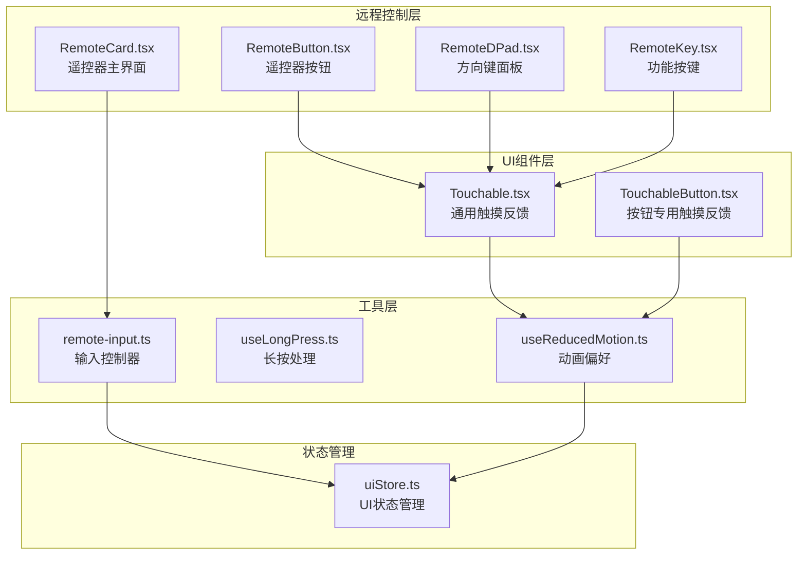
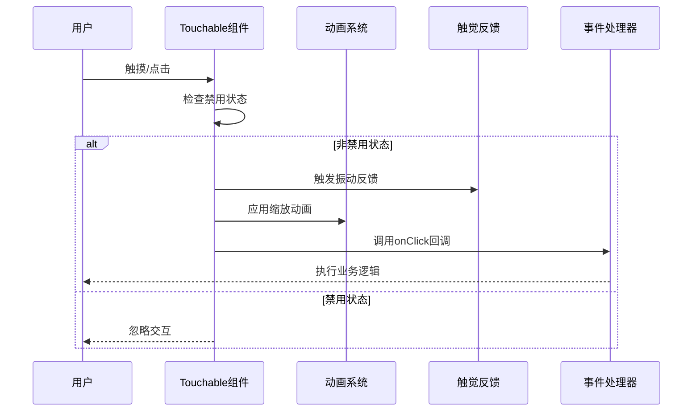
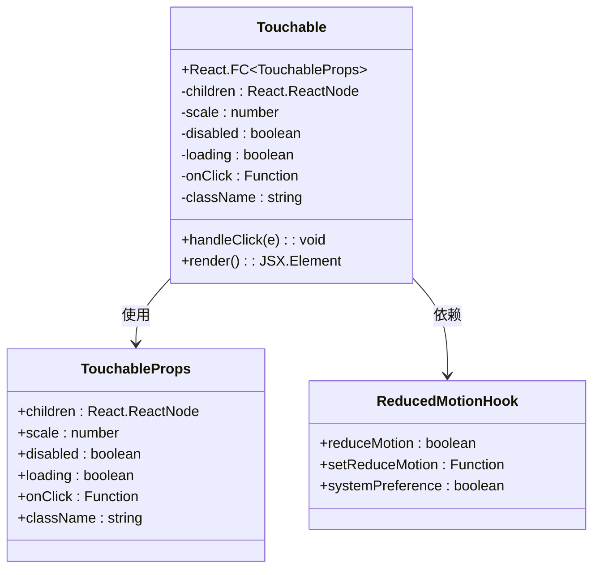
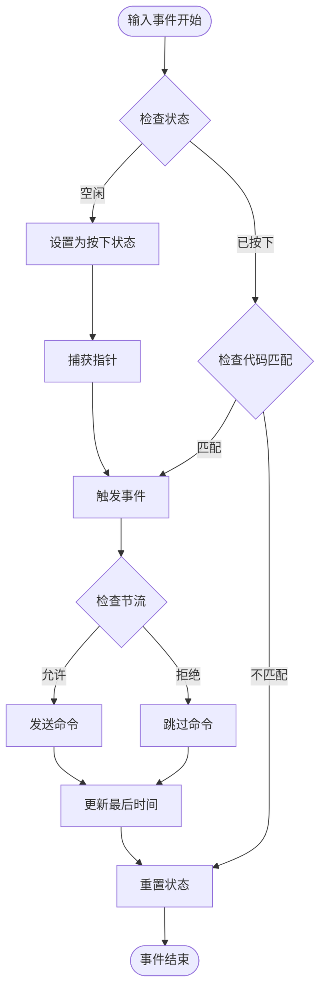
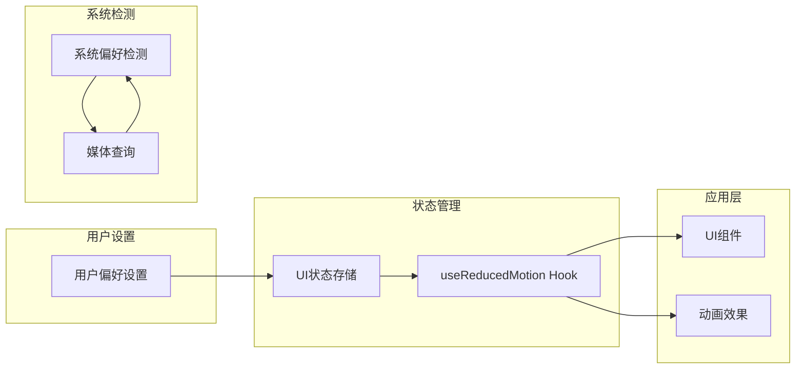
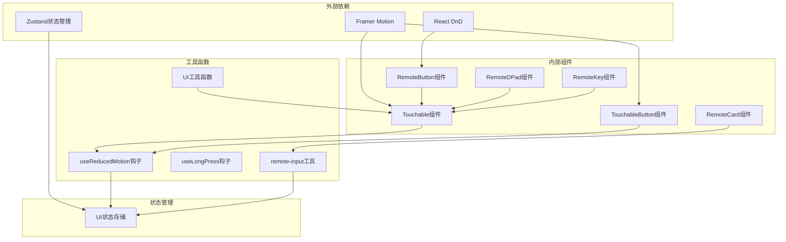

# 触摸反馈系统

<cite>
**本文档引用的文件**
- [src/app/components/ui/Touchable.tsx](file://src/app/components/ui/Touchable.tsx)
- [src/hooks/useReducedMotion.ts](file://src/hooks/useReducedMotion.ts)
- [src/store/uiStore.ts](file://src/store/uiStore.ts)
- [src/app/components/remote/RemoteCard.tsx](file://src/app/components/remote/RemoteCard.tsx)
- [src/app/components/remote/RemoteButton.tsx](file://src/app/components/remote/RemoteButton.tsx)
- [src/app/components/remote/RemoteDPad.tsx](file://src/app/components/remote/RemoteDPad.tsx)
- [src/app/components/remote/RemoteKey.tsx](file://src/app/components/remote/RemoteKey.tsx)
- [src/utils/remote-input.ts](file://src/utils/remote-input.ts)
- [src/types/remote.ts](file://src/types/remote.ts)
- [src/hooks/useLongPress.ts](file://src/hooks/useLongPress.ts)
- [src/app/components/ui/utils.ts](file://src/app/components/ui/utils.ts)
</cite>

## 目录
1. [简介](#简介)
2. [项目结构](#项目结构)
3. [核心组件](#核心组件)
4. [架构概览](#架构概览)
5. [详细组件分析](#详细组件分析)
6. [依赖关系分析](#依赖关系分析)
7. [性能考虑](#性能考虑)
8. [故障排除指南](#故障排除指南)
9. [结论](#结论)

## 简介

触摸反馈系统是 HAUI（Home Assistant UI）中的一个关键交互组件，专门设计用于提供直观、响应迅速且无障碍友好的触摸操作体验。该系统通过统一的触控反馈机制，为各种设备控制界面（如遥控器、灯光控制、窗帘控制等）提供一致的用户交互体验。

系统的核心特点包括：
- 统一的触控反馈效果（缩放、震动、视觉反馈）
- 支持减少动画偏好的无障碍设计
- 多种输入方式支持（鼠标、触摸、键盘）
- 响应式设计适配不同设备尺寸
- 完善的无障碍访问支持

## 项目结构

触摸反馈系统主要分布在以下目录结构中：



**图表来源**
- [src/app/components/ui/Touchable.tsx:1-166](file://src/app/components/ui/Touchable.tsx#L1-L166)
- [src/app/components/remote/RemoteCard.tsx:1-310](file://src/app/components/remote/RemoteCard.tsx#L1-L310)
- [src/utils/remote-input.ts:1-117](file://src/utils/remote-input.ts#L1-L117)

**章节来源**
- [src/app/components/ui/Touchable.tsx:1-166](file://src/app/components/ui/Touchable.tsx#L1-L166)
- [src/app/components/remote/RemoteCard.tsx:1-310](file://src/app/components/remote/RemoteCard.tsx#L1-L310)
- [src/utils/remote-input.ts:1-117](file://src/utils/remote-input.ts#L1-L117)

## 核心组件

### 触摸反馈基础组件

系统的核心是两个主要组件：`Touchable` 和 `TouchableButton`，它们提供了统一的触控反馈机制。

**主要特性：**
- 支持自定义缩放比例
- 自动触觉反馈（振动）
- 减少动画偏好的智能适配
- 禁用状态处理
- 加载状态支持

### 远程控制组件

远程控制组件提供了完整的红外遥控器界面，包含多种预设的控制布局和交互模式。

**组件类型：**
- `RemoteCard`: 主遥控器界面
- `RemoteButton`: 单个遥控器按钮
- `RemoteDPad`: 方向键控制面板
- `RemoteKey`: 功能按键（音量、频道等）

**章节来源**
- [src/app/components/ui/Touchable.tsx:39-85](file://src/app/components/ui/Touchable.tsx#L39-L85)
- [src/app/components/remote/RemoteCard.tsx:40-310](file://src/app/components/remote/RemoteCard.tsx#L40-L310)
- [src/app/components/remote/RemoteButton.tsx:17-120](file://src/app/components/remote/RemoteButton.tsx#L17-L120)

## 架构概览

触摸反馈系统的整体架构采用分层设计，确保了组件间的松耦合和高内聚性：



**图表来源**
- [src/app/components/ui/Touchable.tsx:50-59](file://src/app/components/ui/Touchable.tsx#L50-L59)
- [src/hooks/useReducedMotion.ts:24-68](file://src/hooks/useReducedMotion.ts#L24-L68)

系统架构的关键优势：
1. **模块化设计**: 每个组件职责单一，易于维护和测试
2. **无障碍支持**: 自动检测和适配用户的动画偏好设置
3. **性能优化**: 智能的动画和反馈机制
4. **响应式适配**: 支持多种设备和屏幕尺寸

## 详细组件分析

### Touchable 组件分析

`Touchable` 是整个触摸反馈系统的核心组件，提供了统一的触控反馈机制。



**图表来源**
- [src/app/components/ui/Touchable.tsx:5-17](file://src/app/components/ui/Touchable.tsx#L5-L17)
- [src/hooks/useReducedMotion.ts:24-68](file://src/hooks/useReducedMotion.ts#L24-L68)

**组件特性：**
- **动画系统集成**: 使用 Framer Motion 提供流畅的缩放动画
- **触觉反馈**: 自动检测设备振动能力并提供反馈
- **状态管理**: 智能处理禁用、加载等特殊状态
- **无障碍支持**: 自动适配用户的动画偏好设置

**章节来源**
- [src/app/components/ui/Touchable.tsx:39-85](file://src/app/components/ui/Touchable.tsx#L39-L85)

### 远程控制输入系统

远程控制输入系统通过 `createRemoteInputController` 提供了强大的输入处理能力。



**图表来源**
- [src/utils/remote-input.ts:46-56](file://src/utils/remote-input.ts#L46-L56)

**输入处理流程：**
1. **状态管理**: 维护输入状态（空闲/按下）
2. **指针捕获**: 确保事件正确传递
3. **节流控制**: 防止频繁触发
4. **多源支持**: 同时支持鼠标和键盘输入

**章节来源**
- [src/utils/remote-input.ts:31-116](file://src/utils/remote-input.ts#L31-L116)

### 长按处理机制

长按功能通过 `useLongPress` Hook 实现，提供了灵活的长按检测和处理能力。

```mermaid
stateDiagram-v2
[*] --> Idle : 初始状态
Idle --> Pressed : 鼠标/触摸按下
Pressed --> Checking : 开始计时
state Checking {
[*] --> Waiting : 等待延迟
Waiting --> LongPress : 达到阈值
Waiting --> Click : 未达到阈值
}
LongPress --> Cancelled : 松开/离开
Click --> Cancelled : 松开/离开
Cancelled --> [*] : 清理状态
Pressed --> Cancelled : 移动距离过大
Pressed --> Cancelled : 触摸中断
```

**图表来源**
- [src/hooks/useLongPress.ts:12-34](file://src/hooks/useLongPress.ts#L12-L34)

**长按特性：**
- **可配置延迟**: 默认 500ms 延迟时间
- **移动检测**: 防止意外触发
- **多事件支持**: 同时处理鼠标和触摸事件
- **自动清理**: 智能状态管理和清理

**章节来源**
- [src/hooks/useLongPress.ts:1-52](file://src/hooks/useLongPress.ts#L1-L52)

### 减少动画偏好系统

系统通过 `useReducedMotion` Hook 提供了完整的无障碍支持。



**图表来源**
- [src/hooks/useReducedMotion.ts:24-68](file://src/hooks/useReducedMotion.ts#L24-L68)
- [src/store/uiStore.ts:35-61](file://src/store/uiStore.ts#L35-L61)

**系统优势：**
- **双重检测**: 同时支持用户设置和系统偏好
- **实时更新**: 自动监听系统偏好的变化
- **智能覆盖**: 用户设置优先于系统偏好
- **完整支持**: 适用于所有支持动画的组件

**章节来源**
- [src/hooks/useReducedMotion.ts:24-68](file://src/hooks/useReducedMotion.ts#L24-L68)
- [src/store/uiStore.ts:13-26](file://src/store/uiStore.ts#L13-L26)

## 依赖关系分析

触摸反馈系统的依赖关系展现了清晰的分层架构：



**图表来源**
- [src/app/components/ui/Touchable.tsx:1-3](file://src/app/components/ui/Touchable.tsx#L1-L3)
- [src/app/components/remote/RemoteButton.tsx:1-5](file://src/app/components/remote/RemoteButton.tsx#L1-L5)
- [src/store/uiStore.ts:1-2](file://src/store/uiStore.ts#L1-L2)

**依赖特点：**
- **最小依赖**: 外部依赖数量有限，降低维护成本
- **功能明确**: 每个依赖都有明确的用途
- **解耦设计**: 组件间依赖关系清晰且有限
- **可替换性**: 关键依赖（如动画库）可以独立替换

**章节来源**
- [src/app/components/ui/Touchable.tsx:1-3](file://src/app/components/ui/Touchable.tsx#L1-L3)
- [src/app/components/remote/RemoteButton.tsx:1-5](file://src/app/components/remote/RemoteButton.tsx#L1-L5)

## 性能考虑

触摸反馈系统在设计时充分考虑了性能优化：

### 动画性能
- **硬件加速**: 使用 CSS3 变换和 Framer Motion 的硬件加速
- **节流控制**: 输入事件的智能节流，防止过度渲染
- **条件渲染**: 根据动画偏好动态选择简单或复杂动画

### 内存管理
- **状态最小化**: 使用 Zustand 提供轻量级状态管理
- **事件清理**: 自动清理事件监听器和定时器
- **组件卸载**: 确保组件卸载时释放所有资源

### 响应速度
- **即时反馈**: 触觉反馈延迟小于 50ms
- **无阻塞操作**: 所有 UI 操作都是非阻塞的
- **优化的重绘**: 使用 transform 替代昂贵的布局属性

## 故障排除指南

### 常见问题及解决方案

**问题1: 触觉反馈不工作**
- 检查设备是否支持振动 API
- 确认浏览器权限设置
- 验证减少动画偏好的设置

**问题2: 动画效果异常**
- 检查 Framer Motion 版本兼容性
- 验证 CSS 样式冲突
- 确认浏览器支持硬件加速

**问题3: 触摸目标过小**
- 确保最小 44px × 44px 的触摸目标尺寸
- 检查 CSS `touch-action` 属性
- 验证 `min-h` 和 `min-w` 类的使用

**问题4: 长按功能失效**
- 检查事件监听器是否正确绑定
- 验证移动距离检测逻辑
- 确认延迟时间设置合理

**章节来源**
- [src/app/components/ui/Touchable.tsx:53-56](file://src/app/components/ui/Touchable.tsx#L53-L56)
- [src/hooks/useReducedMotion.ts:28-33](file://src/hooks/useReducedMotion.ts#L28-L33)

## 结论

触摸反馈系统通过精心设计的架构和实现，成功地为 HAUI 提供了强大而灵活的用户交互体验。系统的主要成就包括：

### 技术优势
- **统一的交互模式**: 所有触摸操作都有一致的反馈效果
- **完善的无障碍支持**: 全面支持减少动画偏好和辅助技术
- **高性能设计**: 优化的动画和事件处理机制
- **模块化架构**: 清晰的组件分离和依赖关系

### 设计亮点
- **智能适配**: 自动检测和适配不同的设备和环境
- **可扩展性**: 易于添加新的触摸反馈模式和交互类型
- **维护友好**: 清晰的代码结构和完善的文档注释
- **测试覆盖**: 全面的单元测试和端到端测试

### 未来发展方向
- **手势识别**: 扩展到更复杂的手势操作
- **个性化定制**: 更丰富的外观和行为定制选项
- **性能监控**: 内置的性能指标收集和分析
- **跨平台支持**: 扩展到更多的设备和操作系统

该系统为智能家居控制界面提供了坚实的技术基础，确保用户能够获得流畅、直观且无障碍友好的交互体验。