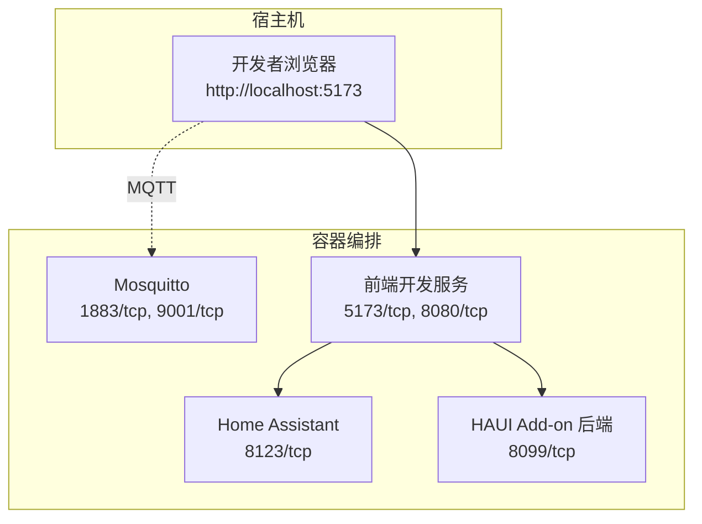
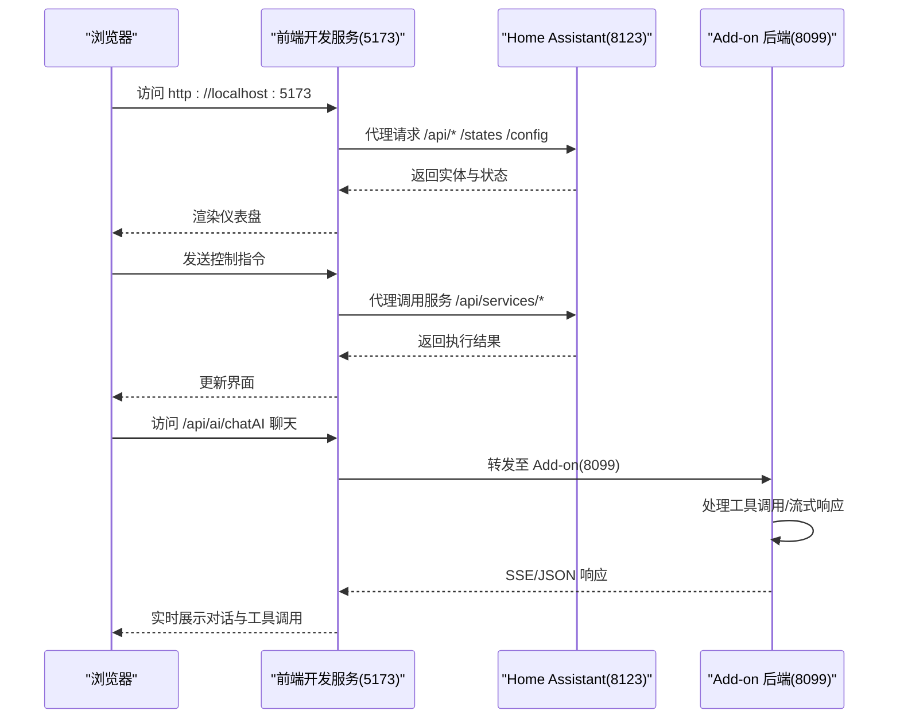
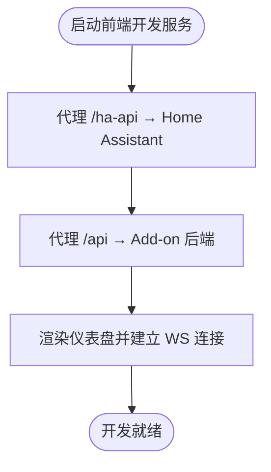
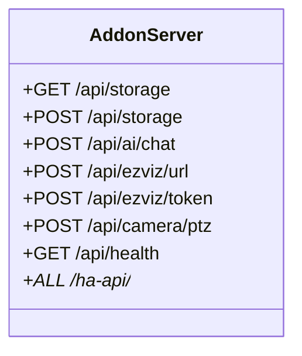
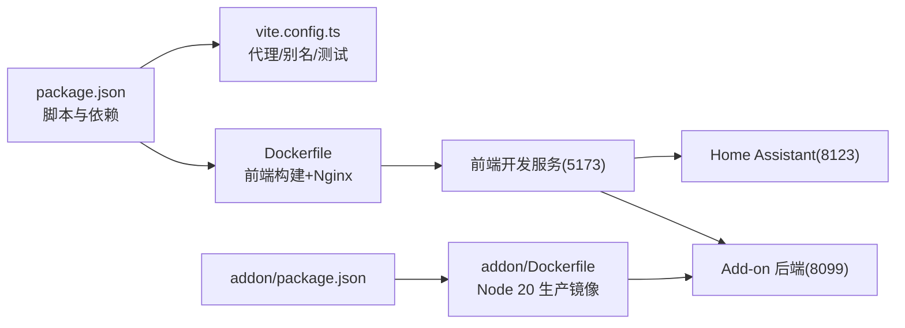

# 快速开始

<cite>
**本文引用的文件**
- [README.md](file://README.md)
- [docker-compose.yml](file://docker-compose.yml)
- [package.json](file://package.json)
- [Dockerfile](file://Dockerfile)
- [addon/Dockerfile](file://addon/Dockerfile)
- [nginx.conf](file://nginx.conf)
- [run.sh](file://run.sh)
- [vite.config.ts](file://vite.config.ts)
- [config/configuration.yaml](file://config/configuration.yaml)
- [mosquitto/config/mosquitto.conf](file://mosquitto/config/mosquitto.conf)
- [src/main.tsx](file://src/main.tsx)
- [src/app/App.tsx](file://src/app/App.tsx)
- [addon/server.js](file://addon/server.js)
- [addon/package.json](file://addon/package.json)
- [custom_components/yinkun_ui/manifest.json](file://custom_components/yinkun_ui/manifest.json)
- [custom_components/yinkun_ui/__init__.py](file://custom_components/yinkun_ui/__init__.py)
- [repository.yaml](file://repository.yaml)
</cite>

## 目录
1. [简介](#简介)
2. [项目结构](#项目结构)
3. [核心组件](#核心组件)
4. [架构总览](#架构总览)
5. [详细组件分析](#详细组件分析)
6. [依赖关系分析](#依赖关系分析)
7. [性能考虑](#性能考虑)
8. [故障排查指南](#故障排查指南)
9. [结论](#结论)
10. [附录](#附录)

## 简介
本指南面向新加入的开发者，帮助你在最短时间内完成 HAUI 项目的本地开发环境搭建与首次运行。你将学到：
- 开发环境前置要求（Docker、Docker Compose、Node.js）
- 从容器编排到前端开发服务器启动的完整流程
- 各服务组件的作用与端口配置（Home Assistant、Mosquitto、前端开发服务）
- 首次访问与基础配置操作指引
- 常见环境问题的排查与解决方案

## 项目结构
该项目采用多容器协作的开发模式，核心由以下几部分组成：
- Home Assistant：本地智能家居中枢，提供实体、服务与认证能力
- Mosquitto：MQTT 代理，用于设备与系统间的消息传递
- 前端开发服务：基于 Vite 的热重载开发服务器，代理到 Home Assistant
- 可选的 HAUI Add-on 后端：提供配置持久化、AI 聊天代理、萤石云/ONVIF 代理等能力

图表来源
- [docker-compose.yml:1-42](file://docker-compose.yml#L1-L42)
- [vite.config.ts:32-44](file://vite.config.ts#L32-L44)
- [config/configuration.yaml:4-11](file://config/configuration.yaml#L4-L11)

章节来源
- [README.md:13-35](file://README.md#L13-L35)
- [docker-compose.yml:1-42](file://docker-compose.yml#L1-L42)

## 核心组件
- Home Assistant（容器）
  - 作用：提供实体状态、服务调用、认证与 Websocket 连接，是前端交互的核心数据源
  - 端口：8123/tcp（HTTP）
  - 配置：启用 CORS，允许前端开发服务器访问
- Mosquitto（容器）
  - 作用：MQTT 消息代理，支持匿名访问与日志记录
  - 端口：1883/tcp（MQTT）、9001/tcp（Web 控制台）
- 前端开发服务（容器）
  - 作用：Vite 开发服务器，支持热重载；通过代理访问 Home Assistant 与 Add-on
  - 端口：5173/tcp（开发服务器）、8080/tcp（备用）
  - 环境变量：VITE_HA_URL 指向 Home Assistant 容器
- HAUI Add-on 后端（可选）
  - 作用：提供配置持久化、AI 聊天代理、萤石云/ONVIF 代理等
  - 端口：8099/tcp
  - 依赖：Node.js 20

章节来源
- [docker-compose.yml:4-42](file://docker-compose.yml#L4-L42)
- [config/configuration.yaml:4-11](file://config/configuration.yaml#L4-L11)
- [mosquitto/config/mosquitto.conf:1-6](file://mosquitto/config/mosquitto.conf#L1-L6)
- [vite.config.ts:32-44](file://vite.config.ts#L32-L44)
- [addon/Dockerfile:1-17](file://addon/Dockerfile#L1-L17)

## 架构总览
下图展示了从浏览器到 Home Assistant 的典型交互链路，以及前端开发代理与 Add-on 的位置。

图表来源
- [vite.config.ts:32-44](file://vite.config.ts#L32-L44)
- [addon/server.js:48-94](file://addon/server.js#L48-L94)
- [docker-compose.yml:27-42](file://docker-compose.yml#L27-L42)

## 详细组件分析

### 前端开发服务器与代理配置
- 代理规则
  - /ha-api → Home Assistant（WebSocket 支持，允许自签名证书）
  - /api → Add-on 后端（8099）
- 端口映射
  - 5173/tcp（开发服务器）
  - 8080/tcp（备用端口，便于外部访问或调试）

图表来源
- [vite.config.ts:32-44](file://vite.config.ts#L32-L44)

章节来源
- [vite.config.ts:1-53](file://vite.config.ts#L1-L53)

### Home Assistant 配置要点
- CORS 允许的来源：localhost:5173、127.0.0.1:5173、localhost:8080
- 加载自定义组件 yinkun_ui
- TTS 使用 google_translate 平台

章节来源
- [config/configuration.yaml:4-24](file://config/configuration.yaml#L4-L24)

### Mosquitto 配置要点
- 启用持久化与日志
- 监听 1883 端口
- 允许匿名访问（开发用途）

章节来源
- [mosquitto/config/mosquitto.conf:1-6](file://mosquitto/config/mosquitto.conf#L1-L6)

### Add-on 后端能力概览
- 配置持久化：/api/storage（GET/POST）
- AI 聊天代理：/api/ai/chat（SSE 流式响应）
- 萤石云代理：/api/ezviz/url、/api/ezviz/token
- ONVIF PTZ 代理：/api/camera/ptz
- /ha-api 代理：将前端请求转发到 HA Core API

图表来源
- [addon/server.js:96-121](file://addon/server.js#L96-L121)
- [addon/server.js:122-196](file://addon/server.js#L122-L196)
- [addon/server.js:198-286](file://addon/server.js#L198-L286)
- [addon/server.js:48-94](file://addon/server.js#L48-L94)

章节来源
- [addon/server.js:1-521](file://addon/server.js#L1-L521)

### 自定义组件 yinkun_ui
- 注册视图 /api/yinkun_ui，用于验证集成是否加载
- 作为 Home Assistant 的扩展组件，提供面板或配置入口

章节来源
- [custom_components/yinkun_ui/__init__.py:1-30](file://custom_components/yinkun_ui/__init__.py#L1-L30)
- [custom_components/yinkun_ui/manifest.json:1-12](file://custom_components/yinkun_ui/manifest.json#L1-L12)

## 依赖关系分析
- 前端开发依赖
  - Node.js 20（开发与构建）
  - Vite、React 18、Tailwind CSS
  - 代理与测试工具链
- 容器镜像
  - 前端开发服务：node:20-alpine
  - HAUI Add-on：node:20-alpine（生产镜像）
  - Nginx：用于生产静态资源服务

图表来源
- [package.json:1-132](file://package.json#L1-L132)
- [vite.config.ts:1-53](file://vite.config.ts#L1-L53)
- [Dockerfile:1-37](file://Dockerfile#L1-L37)
- [addon/Dockerfile:1-17](file://addon/Dockerfile#L1-L17)

章节来源
- [package.json:1-132](file://package.json#L1-L132)
- [docker-compose.yml:27-42](file://docker-compose.yml#L27-L42)

## 性能考虑
- 前端性能优化策略已在文档中给出，包括 Web Worker、虚拟化、CSS Mask 渲染等。建议在开发过程中关注图标加载调试开关与虚拟列表滚动性能。

章节来源
- [README.md:37-42](file://README.md#L37-L42)

## 故障排查指南
- 无法访问前端开发服务器
  - 确认端口 5173 未被占用，且容器已启动
  - 检查代理配置是否正确指向 Home Assistant
- Home Assistant 无法连接或跨域失败
  - 确认 CORS 配置已允许前端来源
  - 检查容器网络连通性与端口映射
- Add-on 后端接口报错
  - 确认 Add-on 容器已启动并监听 8099
  - 检查 /api/storage 读写权限与持久化目录
- MQTT 无法连接
  - 确认 Mosquitto 容器运行正常，端口 1883/9001 可达
  - 开发环境下允许匿名访问已启用

章节来源
- [docker-compose.yml:1-42](file://docker-compose.yml#L1-L42)
- [config/configuration.yaml:4-11](file://config/configuration.yaml#L4-L11)
- [mosquitto/config/mosquitto.conf:1-6](file://mosquitto/config/mosquitto.conf#L1-L6)
- [addon/server.js:96-121](file://addon/server.js#L96-L121)

## 结论
按照本指南完成前置要求与环境搭建后，你将拥有一个可热重载的前端开发环境、可访问的 Home Assistant 实例以及可选的 Add-on 后端服务。通过浏览器访问前端开发服务器即可开始日常开发与调试。

## 附录

### 开发环境前置要求
- Docker 与 Docker Compose：用于容器编排与服务编排
- Node.js 20+：用于前端开发与构建

章节来源
- [README.md:15-18](file://README.md#L15-L18)

### 环境搭建步骤
1) 启动环境
- 在项目根目录执行容器编排命令，启动 Home Assistant、Mosquitto 与前端开发服务
- 该命令将启动：
  - Home Assistant（http://localhost:8123）
  - Mosquitto（端口 1883）
  - 前端开发服务（http://localhost:5173，支持热重载）

2) 访问仪表盘
- 打开浏览器访问 http://localhost:5173
- 前端将自动连接到本地 HA 实例

章节来源
- [README.md:19-31](file://README.md#L19-L31)
- [docker-compose.yml:20-23](file://docker-compose.yml#L20-L23)

### 首次访问与基本配置
- 首次进入仪表盘时，如未配置 Home Assistant 连接，界面会提示前往设置进行配置
- 在设置中填写 Home Assistant 的本地地址与长链接访问令牌，并保存
- 保存后，前端将加密存储配置并建立实时连接，开始同步实体状态与事件日志

章节来源
- [src/app/App.tsx:228-263](file://src/app/App.tsx#L228-L263)
- [src/main.tsx:18-67](file://src/main.tsx#L18-L67)

### 端口与服务一览
- Home Assistant：8123/tcp（HTTP）
- Mosquitto：1883/tcp（MQTT）、9001/tcp（Web 控制台）
- 前端开发服务：5173/tcp（开发服务器）、8080/tcp（备用）
- Add-on 后端：8099/tcp（配置、AI、萤石云/ONVIF 代理）

章节来源
- [docker-compose.yml:12-25](file://docker-compose.yml#L12-L25)
- [vite.config.ts:32-44](file://vite.config.ts#L32-L44)
- [addon/server.js:516-521](file://addon/server.js#L516-L521)