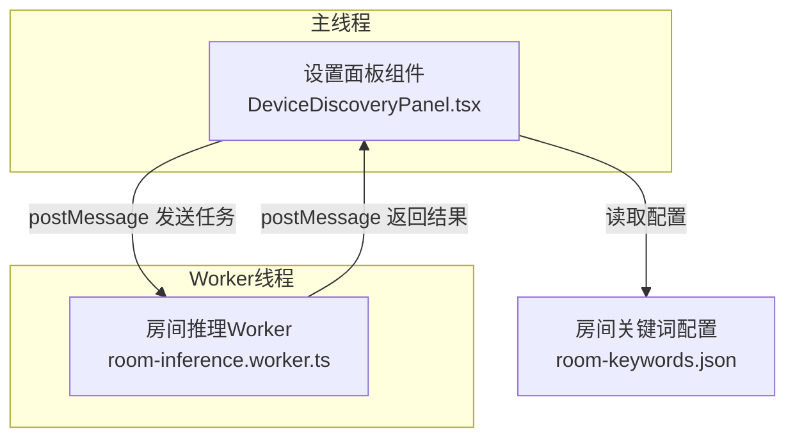
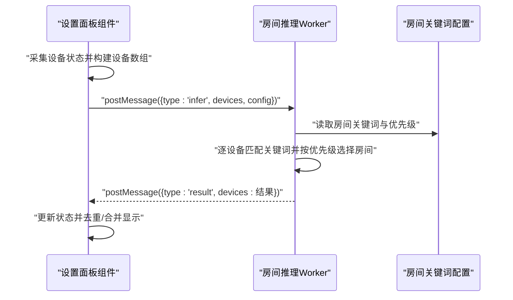
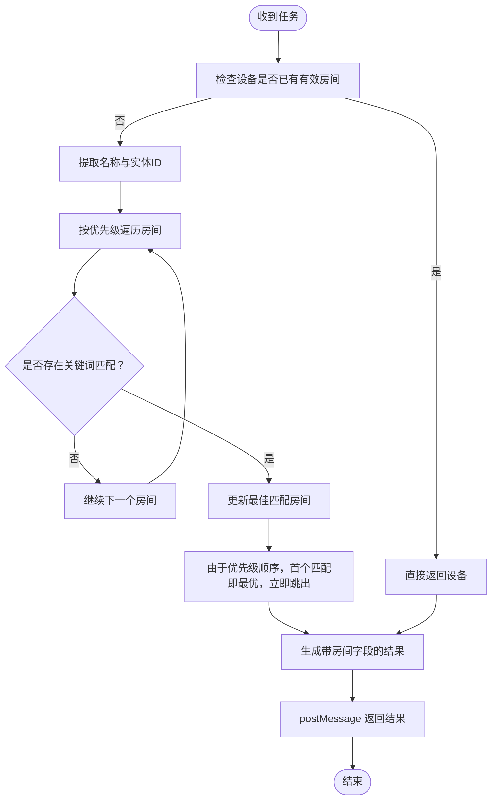
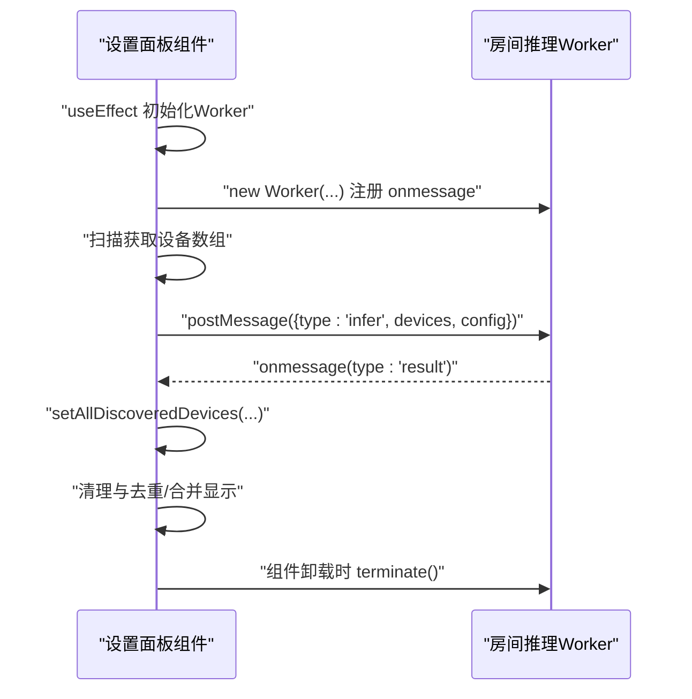
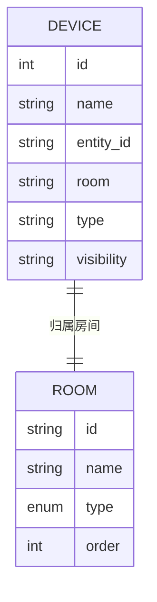
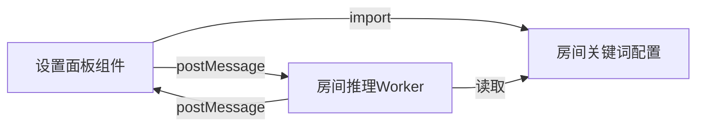

# Web Worker优化

<cite>
**本文引用的文件**
- [room-inference.worker.ts](file://src/workers/room-inference.worker.ts)
- [DeviceDiscoveryPanel.tsx](file://src/app/components/settings/DeviceDiscoveryPanel.tsx)
- [room-keywords.json](file://src/config/room-keywords.json)
- [device.ts](file://src/types/device.ts)
- [room.ts](file://src/types/room.ts)
</cite>

## 目录
1. [引言](#引言)
2. [项目结构](#项目结构)
3. [核心组件](#核心组件)
4. [架构总览](#架构总览)
5. [详细组件分析](#详细组件分析)
6. [依赖关系分析](#依赖关系分析)
7. [性能考量](#性能考量)
8. [故障排查指南](#故障排查指南)
9. [结论](#结论)
10. [附录](#附录)

## 引言
本文件面向HAUI项目的Web Worker优化，聚焦“房间推理Worker”的实现与性能提升。该Worker负责对设备进行房间推断，通过名称关键字匹配与优先级排序，将设备归属到具体房间，从而避免主线程阻塞，提升UI交互流畅度与大规模设备场景下的响应能力。文档将从系统架构、组件关系、数据流、处理逻辑、并发控制、通信优化、调试与监控等方面展开，并给出可操作的最佳实践。

## 项目结构
围绕房间推理Worker的关键文件与职责如下：
- src/workers/room-inference.worker.ts：房间推理Worker，接收设备列表与房间关键词配置，返回带房间信息的设备结果。
- src/app/components/settings/DeviceDiscoveryPanel.tsx：设置面板组件，负责初始化Worker、发起扫描、向Worker投递任务、接收结果并更新界面状态。
- src/config/room-keywords.json：房间关键词与优先级配置，包含多语言关键词与房间优先级顺序。
- src/types/device.ts 与 src/types/room.ts：设备与房间的数据模型定义，用于类型约束与一致性保障。

图表来源
- [DeviceDiscoveryPanel.tsx:55-69](file://src/app/components/settings/DeviceDiscoveryPanel.tsx#L55-L69)
- [room-inference.worker.ts:24-73](file://src/workers/room-inference.worker.ts#L24-L73)
- [room-keywords.json:1-34](file://src/config/room-keywords.json#L1-L34)

章节来源
- [DeviceDiscoveryPanel.tsx:55-69](file://src/app/components/settings/DeviceDiscoveryPanel.tsx#L55-L69)
- [room-inference.worker.ts:1-73](file://src/workers/room-inference.worker.ts#L1-L73)
- [room-keywords.json:1-34](file://src/config/room-keywords.json#L1-L34)

## 核心组件
- 房间推理Worker
  - 输入：设备数组与房间配置（关键词映射与优先级）。
  - 处理：对每个设备跳过已有有效房间的设备；对名称与实体ID进行关键字匹配；按优先级顺序选择最佳匹配房间。
  - 输出：带房间字段的设备数组。
- 设置面板组件
  - 初始化Worker并注册消息回调。
  - 采集设备状态，构建设备数组后投递给Worker。
  - 接收Worker结果并更新界面状态，完成去重与显示合并。
- 房间关键词配置
  - 提供房间名到关键词数组的映射，以及房间优先级顺序，决定匹配优先级。
- 类型定义
  - 设备与房间的结构化类型，确保跨线程数据一致与可维护性。

章节来源
- [room-inference.worker.ts:5-22](file://src/workers/room-inference.worker.ts#L5-L22)
- [DeviceDiscoveryPanel.tsx:55-69](file://src/app/components/settings/DeviceDiscoveryPanel.tsx#L55-L69)
- [room-keywords.json:1-34](file://src/config/room-keywords.json#L1-L34)
- [device.ts:1-46](file://src/types/device.ts#L1-L46)
- [room.ts:1-33](file://src/types/room.ts#L1-L33)

## 架构总览
下图展示了从设备扫描到房间推理再到结果回传的完整流程，强调主线程与Worker之间的解耦与高效通信。

图表来源
- [DeviceDiscoveryPanel.tsx:103-114](file://src/app/components/settings/DeviceDiscoveryPanel.tsx#L103-L114)
- [room-inference.worker.ts:24-73](file://src/workers/room-inference.worker.ts#L24-L73)
- [room-keywords.json:1-34](file://src/config/room-keywords.json#L1-L34)

## 详细组件分析

### 房间推理Worker实现
- 消息协议
  - 主线程发送：type为'infer'，携带devices与config。
  - Worker返回：type为'result'，携带处理后的devices。
- 匹配策略
  - 若设备已有有效房间则直接返回。
  - 对设备名称与实体ID进行子串匹配，命中任一关键词即视为匹配。
  - 按配置中房间优先级顺序遍历，首个匹配即为最佳匹配。
- 性能记录
  - 使用高精度计时记录处理耗时，便于监控与优化。

图表来源
- [room-inference.worker.ts:24-73](file://src/workers/room-inference.worker.ts#L24-L73)

章节来源
- [room-inference.worker.ts:18-73](file://src/workers/room-inference.worker.ts#L18-L73)

### 主线程组件与Worker集成
- Worker生命周期
  - 组件挂载时创建Worker并注册消息回调。
  - 组件卸载时终止Worker，释放资源。
- 任务投递
  - 采集设备状态后，将设备数组与配置对象作为消息体发送至Worker。
- 结果处理
  - 接收Worker返回的设备数组，更新内部状态。
  - 进行去重与显示合并，保证最终展示的一致性与正确性。

图表来源
- [DeviceDiscoveryPanel.tsx:55-69](file://src/app/components/settings/DeviceDiscoveryPanel.tsx#L55-L69)
- [DeviceDiscoveryPanel.tsx:103-114](file://src/app/components/settings/DeviceDiscoveryPanel.tsx#L103-L114)

章节来源
- [DeviceDiscoveryPanel.tsx:55-69](file://src/app/components/settings/DeviceDiscoveryPanel.tsx#L55-L69)
- [DeviceDiscoveryPanel.tsx:103-114](file://src/app/components/settings/DeviceDiscoveryPanel.tsx#L103-L114)

### 数据模型与配置
- 设备模型
  - 包含标识、名称、实体ID、房间、类别等字段，支持显示覆盖与可见性控制。
- 房间模型
  - 定义房间类型枚举与默认房间集合，便于UI渲染与选择。
- 房间关键词配置
  - 提供房间到关键词数组的映射，以及房间优先级顺序，直接影响匹配结果与性能。

图表来源
- [device.ts:1-46](file://src/types/device.ts#L1-L46)
- [room.ts:1-33](file://src/types/room.ts#L1-L33)

章节来源
- [device.ts:1-46](file://src/types/device.ts#L1-L46)
- [room.ts:1-33](file://src/types/room.ts#L1-L33)
- [room-keywords.json:1-34](file://src/config/room-keywords.json#L1-L34)

## 依赖关系分析
- 组件耦合
  - 设置面板组件与Worker之间通过消息接口耦合，无直接函数调用依赖，降低耦合度。
  - Worker内部不依赖外部模块，仅使用本地类型定义，简化构建与部署。
- 外部依赖
  - 房间关键词配置以JSON形式注入，便于热更新与多语言扩展。
- 潜在风险
  - 当前Worker未实现任务队列与并发控制，若主线程频繁投递任务，可能造成堆积或竞争。
  - 消息体包含大量设备数据，序列化开销与传输成本需关注。

图表来源
- [DeviceDiscoveryPanel.tsx:103-114](file://src/app/components/settings/DeviceDiscoveryPanel.tsx#L103-L114)
- [room-inference.worker.ts:24-73](file://src/workers/room-inference.worker.ts#L24-L73)
- [room-keywords.json:1-34](file://src/config/room-keywords.json#L1-L34)

章节来源
- [DeviceDiscoveryPanel.tsx:103-114](file://src/app/components/settings/DeviceDiscoveryPanel.tsx#L103-L114)
- [room-inference.worker.ts:24-73](file://src/workers/room-inference.worker.ts#L24-L73)
- [room-keywords.json:1-34](file://src/config/room-keywords.json#L1-L34)

## 性能考量
- CPU密集型任务Worker化
  - 将设备房间推断从主线程迁移至Worker，避免UI卡顿，尤其在设备数量较多时收益显著。
- 任务分发与并发控制
  - 当前实现为单实例Worker，建议引入任务队列与并发上限控制，防止主线程高频投递导致堆积。
  - 可采用“请求-确认”机制，主线程等待上一批任务完成后再投递下一批。
- 消息传递优化
  - 控制消息体大小，必要时对设备字段做裁剪或延迟加载。
  - 合并多次小任务为批量任务，减少消息往返次数。
- 序列化开销控制
  - 避免传输不可序列化对象；对大数组采用分片策略或增量处理。
- 计时与监控
  - Worker内记录处理耗时，主线程收集统计并上报，形成端到端性能画像。

[本节为通用性能指导，无需特定文件来源]

## 故障排查指南
- Worker无法初始化
  - 检查Worker构造URL是否正确，确认模块打包器支持动态Worker URL。
  - 确认组件卸载时调用了终止，避免内存泄漏。
- 无结果返回
  - 核对消息类型与字段命名，确保主线程与Worker的消息协议一致。
  - 检查Worker是否成功处理并返回结果。
- 匹配结果异常
  - 校验房间关键词配置是否正确、优先级顺序是否符合预期。
  - 确认设备名称与实体ID是否包含期望关键词。
- 性能问题
  - 使用Worker内的计时日志定位瓶颈；结合主线程统计分析端到端耗时。
  - 评估任务频率与批处理策略，避免过度投递。

章节来源
- [DeviceDiscoveryPanel.tsx:55-69](file://src/app/components/settings/DeviceDiscoveryPanel.tsx#L55-L69)
- [room-inference.worker.ts:24-73](file://src/workers/room-inference.worker.ts#L24-L73)

## 结论
房间推理Worker通过将CPU密集型的房间推断逻辑移出主线程，显著提升了UI的响应性与稳定性。当前实现简洁清晰，具备良好的可维护性。为进一步增强可靠性与吞吐能力，建议引入任务队列、并发控制与批量处理策略，并完善消息体压缩与监控体系。这些改进将在大规模设备场景下带来更稳健的用户体验。

[本节为总结性内容，无需特定文件来源]

## 附录
- 最佳实践清单
  - 使用Worker处理所有CPU密集型任务，保持主线程轻量。
  - 明确消息协议，严格校验字段与类型。
  - 实施任务队列与背压控制，避免任务堆积。
  - 控制消息体大小，必要时采用分片或增量处理。
  - 记录端到端性能指标，持续优化关键路径。
  - 在组件卸载时及时终止Worker，避免资源泄漏。
  - 对配置进行版本化管理，支持热更新与灰度发布。

[本节为通用实践建议，无需特定文件来源]