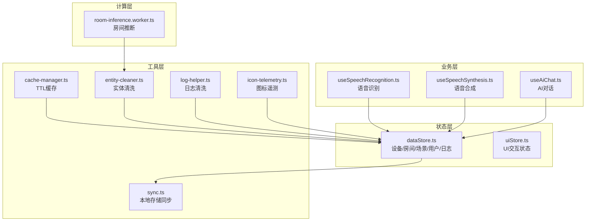
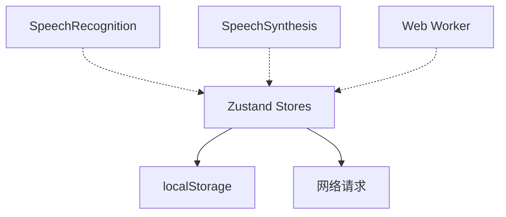
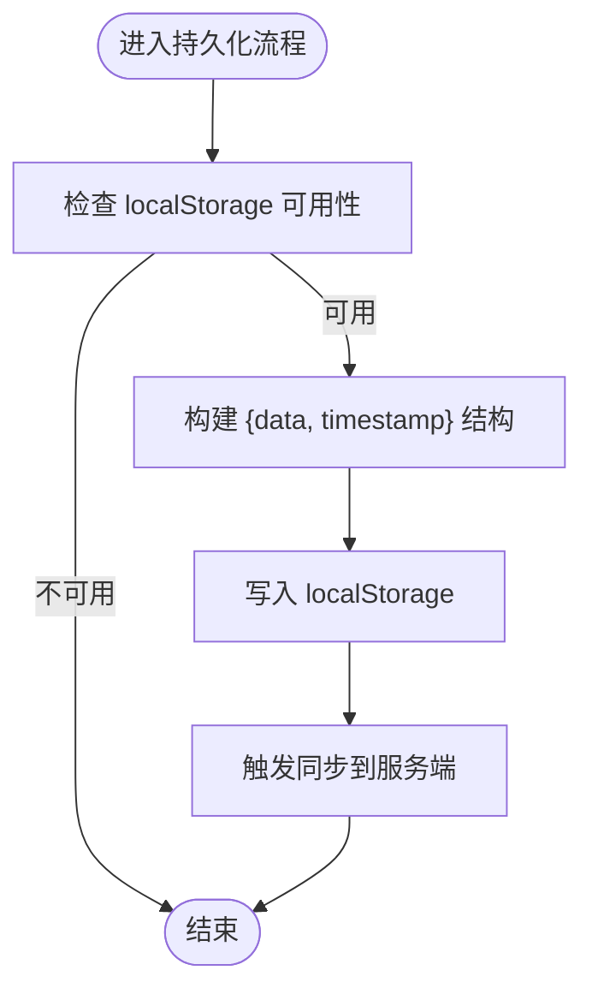
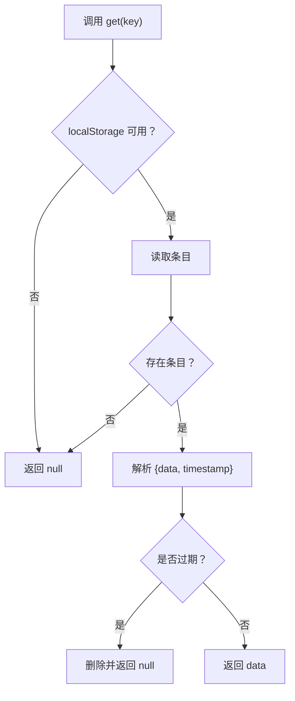
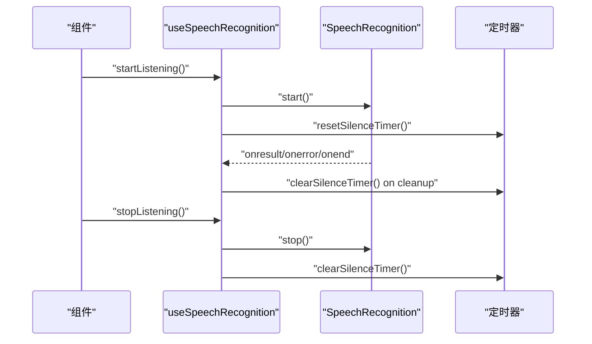
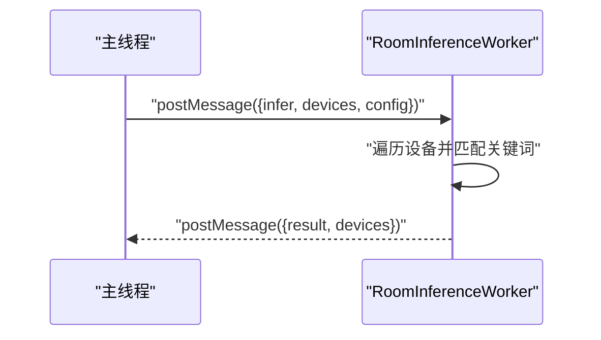
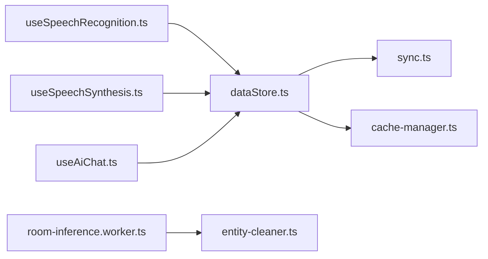

# 内存管理优化

<cite>
**本文引用的文件**
- [dataStore.ts](file://src/store/dataStore.ts)
- [uiStore.ts](file://src/store/uiStore.ts)
- [cache-manager.ts](file://src/utils/cache-manager.ts)
- [useSpeechRecognition.ts](file://src/hooks/useSpeechRecognition.ts)
- [useSpeechSynthesis.ts](file://src/hooks/useSpeechSynthesis.ts)
- [room-inference.worker.ts](file://src/workers/room-inference.worker.ts)
- [entity-cleaner.ts](file://src/utils/entity-cleaner.ts)
- [sync.ts](file://src/utils/sync.ts)
- [icon-telemetry.ts](file://src/utils/icon-telemetry.ts)
- [log-helper.ts](file://src/utils/log-helper.ts)
- [useAiChat.ts](file://src/hooks/useAiChat.ts)
</cite>

## 目录
1. [引言](#引言)
2. [项目结构](#项目结构)
3. [核心组件](#核心组件)
4. [架构总览](#架构总览)
5. [详细组件分析](#详细组件分析)
6. [依赖关系分析](#依赖关系分析)
7. [性能考量](#性能考量)
8. [故障排查指南](#故障排查指南)
9. [结论](#结论)
10. [附录](#附录)

## 引言
本文件面向HAUI项目的内存管理优化，围绕以下主题展开：
- Zustand状态管理的内存优化策略：状态树设计、状态清理与持久化边界控制、内存泄漏预防
- 缓存管理器实现原理：基于localStorage的TTL缓存、缓存失效策略与内存回收
- 音频与语音处理的内存优化：SpeechRecognition与SpeechSynthesis的资源管理与释放
- 大型数据结构的内存使用优化：弱引用容器（WeakMap/WeakSet）的应用场景
- 内存使用监控工具、内存泄漏检测方法与性能优化最佳实践

## 项目结构
本项目采用按功能域划分的组织方式，与内存优化相关的关键模块如下：
- 状态层：Zustand stores（数据与UI状态）
- 工具层：缓存、同步、日志清洗、遥测
- 业务层：语音识别/合成Hook、AI对话Hook
- 计算层：Web Worker（房间推断）

**图表来源**
- [dataStore.ts:1-128](file://src/store/dataStore.ts#L1-L128)
- [uiStore.ts:1-55](file://src/store/uiStore.ts#L1-L55)
- [cache-manager.ts:1-56](file://src/utils/cache-manager.ts#L1-L56)
- [useSpeechRecognition.ts:1-215](file://src/hooks/useSpeechRecognition.ts#L1-L215)
- [useSpeechSynthesis.ts:117-148](file://src/hooks/useSpeechSynthesis.ts#L117-L148)
- [room-inference.worker.ts:1-73](file://src/workers/room-inference.worker.ts#L1-L73)
- [entity-cleaner.ts:1-381](file://src/utils/entity-cleaner.ts#L1-L381)
- [sync.ts:1-161](file://src/utils/sync.ts#L1-L161)
- [icon-telemetry.ts:1-57](file://src/utils/icon-telemetry.ts#L1-L57)
- [log-helper.ts:1-33](file://src/utils/log-helper.ts#L1-L33)

**章节来源**
- [dataStore.ts:1-128](file://src/store/dataStore.ts#L1-L128)
- [uiStore.ts:1-55](file://src/store/uiStore.ts#L1-L55)
- [cache-manager.ts:1-56](file://src/utils/cache-manager.ts#L1-L56)
- [useSpeechRecognition.ts:1-215](file://src/hooks/useSpeechRecognition.ts#L1-L215)
- [useSpeechSynthesis.ts:117-148](file://src/hooks/useSpeechSynthesis.ts#L117-L148)
- [room-inference.worker.ts:1-73](file://src/workers/room-inference.worker.ts#L1-L73)
- [entity-cleaner.ts:1-381](file://src/utils/entity-cleaner.ts#L1-L381)
- [sync.ts:1-161](file://src/utils/sync.ts#L1-L161)
- [icon-telemetry.ts:1-57](file://src/utils/icon-telemetry.ts#L1-L57)
- [log-helper.ts:1-33](file://src/utils/log-helper.ts#L1-L33)

## 核心组件
- Zustand状态管理（dataStore与uiStore）：以最小必要字段持久化，避免冗余数据膨胀；通过局部化选择器减少订阅范围；及时清理日志与临时状态。
- 缓存管理器（CacheManager）：基于localStorage的键值+时间戳结构，统一TTL策略，严格过期控制，避免无限增长。
- 语音处理（useSpeechRecognition/useSpeechSynthesis）：识别器生命周期与定时器管理，主动停止与取消，防止后台资源占用。
- 大数据清洗（entity-cleaner）：关键词映射与正则清洗，避免重复构造与内存驻留。
- 同步与遥测（sync/icon-telemetry）：批量同步与缓冲区长度限制，降低频繁IO与内存压力。

**章节来源**
- [dataStore.ts:58-128](file://src/store/dataStore.ts#L58-L128)
- [uiStore.ts:31-55](file://src/store/uiStore.ts#L31-L55)
- [cache-manager.ts:6-56](file://src/utils/cache-manager.ts#L6-L56)
- [useSpeechRecognition.ts:30-215](file://src/hooks/useSpeechRecognition.ts#L30-L215)
- [useSpeechSynthesis.ts:134-148](file://src/hooks/useSpeechSynthesis.ts#L134-L148)
- [entity-cleaner.ts:170-381](file://src/utils/entity-cleaner.ts#L170-L381)
- [sync.ts:52-161](file://src/utils/sync.ts#L52-L161)
- [icon-telemetry.ts:17-57](file://src/utils/icon-telemetry.ts#L17-L57)

## 架构总览
Zustand状态树与外部资源的关系如下：

**图表来源**
- [dataStore.ts:104-128](file://src/store/dataStore.ts#L104-L128)
- [useSpeechRecognition.ts:71-171](file://src/hooks/useSpeechRecognition.ts#L71-L171)
- [useSpeechSynthesis.ts:134-148](file://src/hooks/useSpeechSynthesis.ts#L134-L148)
- [room-inference.worker.ts:24-73](file://src/workers/room-inference.worker.ts#L24-L73)
- [sync.ts:52-161](file://src/utils/sync.ts#L52-L161)

## 详细组件分析

### Zustand状态管理的内存优化
- 状态树设计
  - 将设备、房间、场景、用户、日志拆分为独立字段，避免跨域耦合导致的全量重渲染与内存驻留。
  - UI状态（如模态框开关、编辑态）与业务数据分离，降低UI变更对业务数据的影响。
- 持久化边界控制
  - 使用持久化中间件的partialize选择性持久化字段，避免将大对象或临时数据写入localStorage。
  - 在storage钩子中手动触发同步，避免劫持localStorage带来的额外开销与副作用。
- 日志与临时数据的清理
  - 日志上限截断，避免无限增长；提供clearLogs动作以便主动回收。
  - 通过局部化更新（函数式set）减少不必要的深拷贝与对象重建。
- 内存泄漏预防
  - 在组件卸载时确保不会持有对store的长期引用；避免在effect中累积闭包引用。
  - 对UI状态的开关与选中项保持轻量，避免绑定重型对象。

**图表来源**
- [dataStore.ts:104-128](file://src/store/dataStore.ts#L104-L128)
- [sync.ts:52-93](file://src/utils/sync.ts#L52-L93)

**章节来源**
- [dataStore.ts:58-128](file://src/store/dataStore.ts#L58-L128)
- [uiStore.ts:31-55](file://src/store/uiStore.ts#L31-L55)

### 缓存管理器的实现原理
- 数据结构
  - 缓存条目包含数据与时间戳，统一以JSON形式序列化存储，便于跨会话恢复。
- TTL策略
  - 30分钟严格过期：读取时比较当前时间与存储时间，超时即返回空，避免使用陈旧数据。
  - 提供getStale接口用于需要容忍陈旧数据的场景，但需谨慎评估一致性风险。
- 内存回收机制
  - localStorage容量有限，结合TTL可自然淘汰过期条目；建议配合业务侧定期清理不常用键。
  - 写入异常时仅记录警告，避免影响主线程稳定性。

**图表来源**
- [cache-manager.ts:9-30](file://src/utils/cache-manager.ts#L9-L30)

**章节来源**
- [cache-manager.ts:6-56](file://src/utils/cache-manager.ts#L6-L56)

### 音频与语音处理的内存优化
- SpeechRecognition
  - 生命周期管理：在effect中创建识别器实例，退出时清除静音超时定时器并stop识别器，防止后台持续占用。
  - 自动重启与手动停止：通过标志位区分用户主动停止与自动重启，避免重复启动造成资源堆积。
  - 错误处理：对网络/音频捕获错误进行有限次数重试，避免无限循环。
- SpeechSynthesis
  - 取消朗读：cancel会清空分段队列与索引，确保不再有后续回调产生。
  - 平台差异：针对iOS增加短延迟确保cancel生效，避免残留任务。

**图表来源**
- [useSpeechRecognition.ts:71-171](file://src/hooks/useSpeechRecognition.ts#L71-L171)
- [useSpeechRecognition.ts:188-197](file://src/hooks/useSpeechRecognition.ts#L188-L197)

**章节来源**
- [useSpeechRecognition.ts:30-215](file://src/hooks/useSpeechRecognition.ts#L30-L215)
- [useSpeechSynthesis.ts:134-148](file://src/hooks/useSpeechSynthesis.ts#L134-L148)

### 大型数据结构的内存使用优化与弱引用应用
- 关键词映射与正则清洗
  - 将房间关键词、设备类型关键词集中定义，避免在运行时重复构造数组/正则，降低GC压力。
  - 清洗函数对字符串进行一次性转换，避免链式多次拼接导致的中间字符串驻留。
- WeakMap/WeakSet应用场景
  - 当前代码未直接使用WeakMap/WeakSet。建议在以下场景引入：
    - 为DOM节点或复杂对象建立弱引用映射，避免强引用导致的DOM泄漏；
    - 为临时计算结果建立弱引用缓存，随对象销毁自动回收；
    - 为事件监听器或订阅者集合使用WeakSet，避免订阅者列表膨胀。
  - 注意：WeakMap/WeakSet键必须为对象，且无法遍历，需配合其他结构实现统计与调试。

**章节来源**
- [entity-cleaner.ts:9-57](file://src/utils/entity-cleaner.ts#L9-L57)
- [entity-cleaner.ts:170-381](file://src/utils/entity-cleaner.ts#L170-L381)
- [log-helper.ts:1-33](file://src/utils/log-helper.ts#L1-L33)

### Web Worker与大数据处理的内存优化
- 房间推断Worker
  - 将设备名称匹配与优先级排序移出主线程，避免主线程阻塞与大数组操作造成的内存峰值。
  - 通过postMessage传递设备列表与配置，处理完成后回传结果，保持主线程轻量。
  - 性能日志输出便于定位耗时热点。

**图表来源**
- [room-inference.worker.ts:24-73](file://src/workers/room-inference.worker.ts#L24-L73)

**章节来源**
- [room-inference.worker.ts:1-73](file://src/workers/room-inference.worker.ts#L1-L73)

### 内存使用监控与遥测
- 图标遥测
  - 事件缓冲区限制为300条，去重窗口30秒，避免遥测自身成为内存负担。
  - 支持性能事件与错误事件两类，便于定位UI渲染与资源加载问题。
- 日志清洗
  - 数值保留两位小数、常用英文术语翻译，减少冗余与歧义，间接降低UI渲染与存储压力。

**章节来源**
- [icon-telemetry.ts:17-57](file://src/utils/icon-telemetry.ts#L17-L57)
- [log-helper.ts:1-33](file://src/utils/log-helper.ts#L1-L33)

## 依赖关系分析
- 组件耦合
  - dataStore与sync紧密耦合（持久化与同步），uiStore与业务组件松耦合。
  - 语音Hook与浏览器API耦合，需关注平台差异与生命周期。
- 外部依赖
  - localStorage作为缓存与持久化载体，受浏览器容量限制。
  - 网络请求用于配置同步，需考虑超时与失败重试策略。

**图表来源**
- [dataStore.ts:104-128](file://src/store/dataStore.ts#L104-L128)
- [sync.ts:52-161](file://src/utils/sync.ts#L52-L161)
- [cache-manager.ts:6-56](file://src/utils/cache-manager.ts#L6-L56)
- [useSpeechRecognition.ts:30-215](file://src/hooks/useSpeechRecognition.ts#L30-L215)
- [useSpeechSynthesis.ts:134-148](file://src/hooks/useSpeechSynthesis.ts#L134-L148)
- [useAiChat.ts:1-317](file://src/hooks/useAiChat.ts#L1-L317)
- [room-inference.worker.ts:24-73](file://src/workers/room-inference.worker.ts#L24-L73)
- [entity-cleaner.ts:170-381](file://src/utils/entity-cleaner.ts#L170-L381)

**章节来源**
- [dataStore.ts:104-128](file://src/store/dataStore.ts#L104-L128)
- [sync.ts:52-161](file://src/utils/sync.ts#L52-L161)
- [cache-manager.ts:6-56](file://src/utils/cache-manager.ts#L6-L56)
- [useSpeechRecognition.ts:30-215](file://src/hooks/useSpeechRecognition.ts#L30-L215)
- [useSpeechSynthesis.ts:134-148](file://src/hooks/useSpeechSynthesis.ts#L134-L148)
- [useAiChat.ts:1-317](file://src/hooks/useAiChat.ts#L1-L317)
- [room-inference.worker.ts:24-73](file://src/workers/room-inference.worker.ts#L24-L73)
- [entity-cleaner.ts:170-381](file://src/utils/entity-cleaner.ts#L170-L381)

## 性能考量
- 状态更新
  - 使用函数式set与局部选择器，避免全量替换导致的深拷贝与重渲染。
  - 控制日志数量与字段大小，必要时启用分页或滚动窗口。
- 缓存策略
  - TTL与getStale组合使用，平衡一致性与性能；对热数据可考虑内存缓存与localStorage双重缓存。
- 语音处理
  - 合理设置静音超时，避免长时间无响应导致的资源占用；在后台或离开页面时主动停止识别。
- Worker并行
  - 将CPU密集型任务放入Worker，保持主线程流畅；注意消息传递的数据体积，避免序列化开销。
- 存储与同步
  - 批量同步与防抖合并，避免频繁IO；对大对象采用分片或增量更新策略。

## 故障排查指南
- 语音识别无法启动或反复重启
  - 检查浏览器权限与网络状态；确认onerror分支的重试次数与自动重启逻辑。
  - 关注静音超时与手动停止标志，避免冲突。
- 语音合成卡顿或残留声音
  - 确认cancel调用时机与平台差异处理；检查分段索引与回调清理。
- 日志过多导致内存上涨
  - 使用clearLogs主动清理；检查addLog的截断逻辑是否生效。
- 缓存命中率低或频繁过期
  - 检查TTL设置与getStale使用场景；确认键命名一致性。
- Worker性能异常
  - 关注设备数量与关键词匹配复杂度；必要时对配置进行压缩或分批处理。

**章节来源**
- [useSpeechRecognition.ts:117-161](file://src/hooks/useSpeechRecognition.ts#L117-L161)
- [useSpeechSynthesis.ts:134-148](file://src/hooks/useSpeechSynthesis.ts#L134-L148)
- [dataStore.ts:85-93](file://src/store/dataStore.ts#L85-L93)
- [cache-manager.ts:6-56](file://src/utils/cache-manager.ts#L6-L56)
- [room-inference.worker.ts:24-73](file://src/workers/room-inference.worker.ts#L24-L73)

## 结论
通过合理的状态树设计、严格的持久化边界、TTL缓存策略、语音资源生命周期管理以及Worker并行化，HAUI在保证功能完整性的同时有效降低了内存占用与泄漏风险。建议进一步引入WeakMap/WeakSet以优化对象与DOM的引用管理，并持续监控遥测数据以指导性能优化迭代。

## 附录
- 最佳实践清单
  - 状态：最小化持久化字段，使用函数式更新，限制日志长度。
  - 缓存：明确TTL与陈旧数据策略，避免无限增长。
  - 语音：严格管理生命周期与定时器，区分自动重启与手动停止。
  - Worker：控制消息体积，合理拆分任务批次。
  - 弱引用：在对象映射与临时缓存场景引入WeakMap/WeakSet。