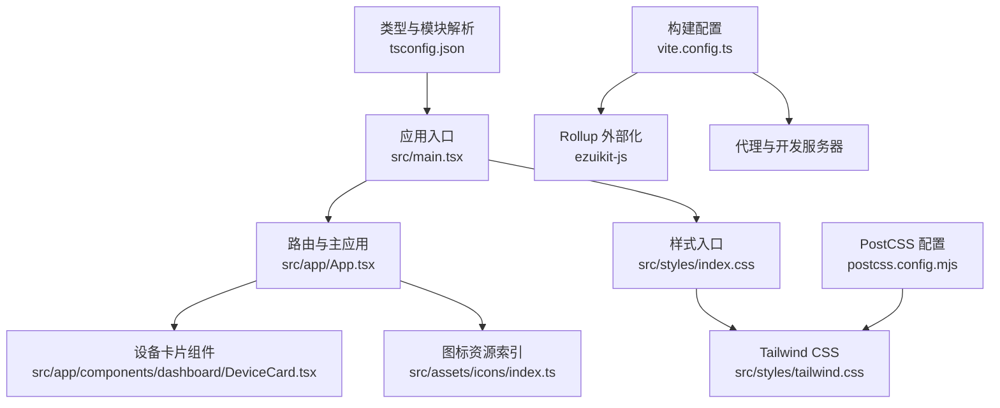
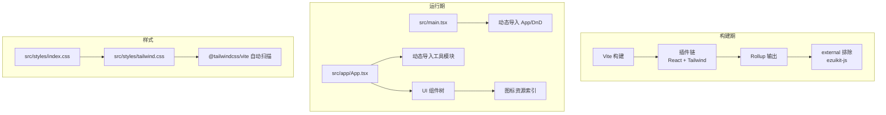
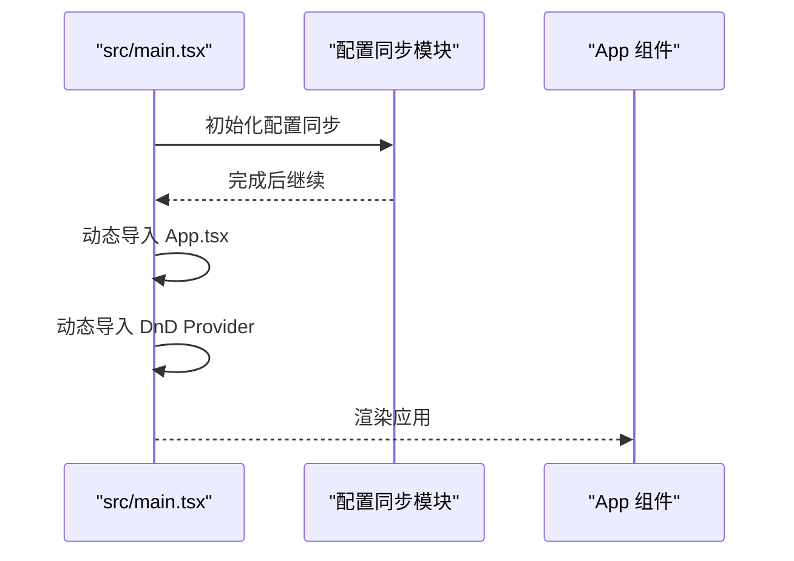
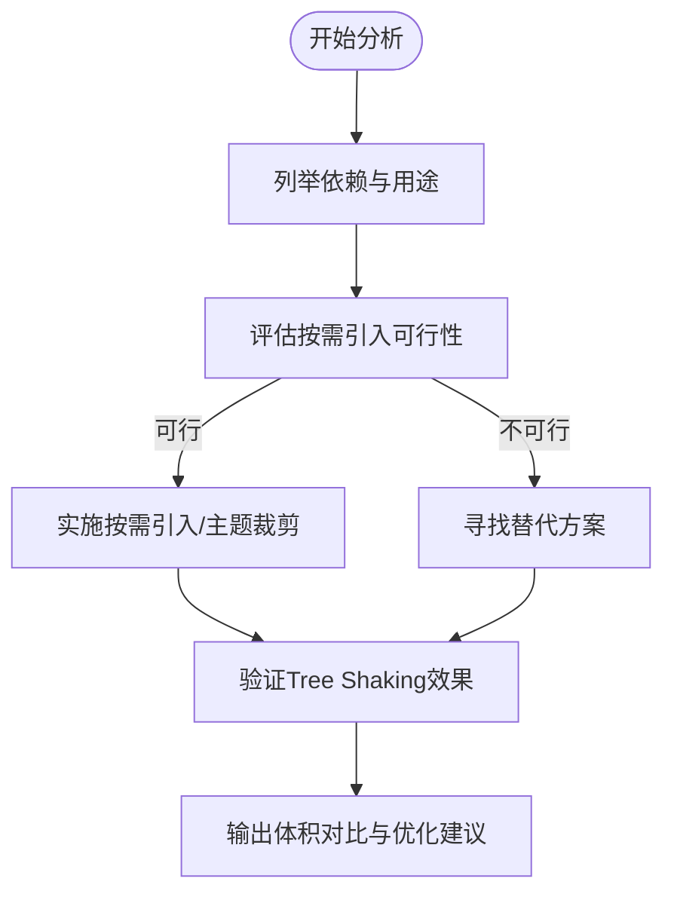
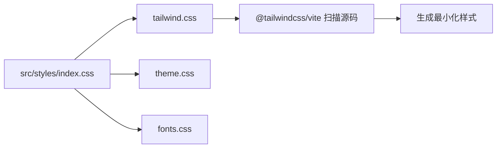
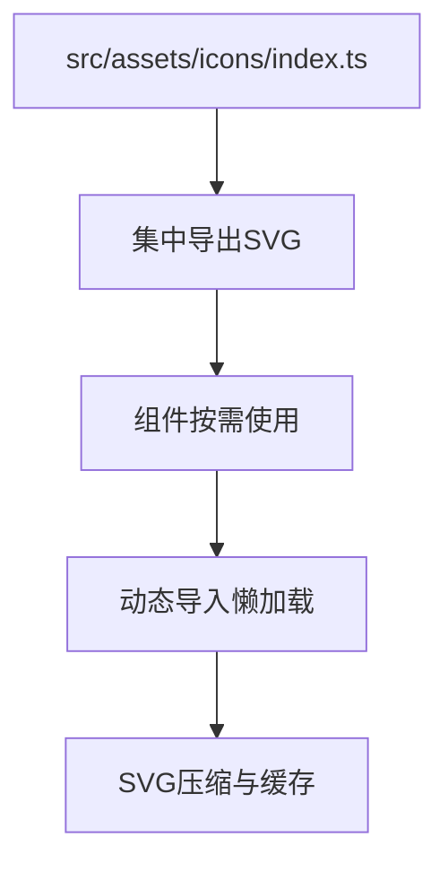
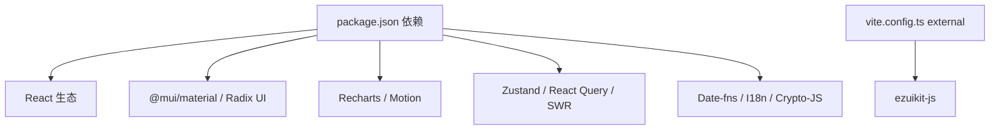

# 包体积优化

<cite>
**本文引用的文件**
- [package.json](file://package.json)
- [vite.config.ts](file://vite.config.ts)
- [postcss.config.mjs](file://postcss.config.mjs)
- [tsconfig.json](file://tsconfig.json)
- [src/main.tsx](file://src/main.tsx)
- [src/app/App.tsx](file://src/app/App.tsx)
- [src/styles/index.css](file://src/styles/index.css)
- [src/styles/tailwind.css](file://src/styles/tailwind.css)
- [src/utils/sync.ts](file://src/utils/sync.ts)
- [src/assets/icons/index.ts](file://src/assets/icons/index.ts)
- [src/app/components/dashboard/DeviceCard.tsx](file://src/app/components/dashboard/DeviceCard.tsx)
</cite>

## 目录
1. [简介](#简介)
2. [项目结构](#项目结构)
3. [核心组件](#核心组件)
4. [架构总览](#架构总览)
5. [详细组件分析](#详细组件分析)
6. [依赖分析](#依赖分析)
7. [性能考量](#性能考量)
8. [故障排查指南](#故障排查指南)
9. [结论](#结论)
10. [附录](#附录)

## 简介
本文件面向HAUI项目的包体积优化，系统性梳理Vite构建配置中的Tree Shaking、代码分割与动态导入策略，分析第三方依赖体积与按需引入现状，并给出UI组件库按需加载、样式提取与全局样式优化建议。同时覆盖图片与图标资源优化（SVG、懒加载）、Bundle分析工具使用、体积监控与持续优化流程，帮助团队建立可落地的体积治理方法论。

## 项目结构
- 构建与开发工具链：Vite 6、React 插件、Tailwind CSS v4（@tailwindcss/vite）
- 语言与类型：TypeScript ESNext 模块解析、bundler 模式
- 样式体系：Tailwind CSS 自动扫描源码、主题与动画变量
- 资源组织：SVG 图标集中导出、按需动态导入模块

**图表来源**
- [src/main.tsx:1-82](file://src/main.tsx#L1-L82)
- [src/app/App.tsx:1-120](file://src/app/App.tsx#L1-L120)
- [src/styles/index.css:1-4](file://src/styles/index.css#L1-L4)
- [src/styles/tailwind.css:1-14](file://src/styles/tailwind.css#L1-L14)
- [src/app/components/dashboard/DeviceCard.tsx:1-60](file://src/app/components/dashboard/DeviceCard.tsx#L1-L60)
- [src/assets/icons/index.ts:1-60](file://src/assets/icons/index.ts#L1-L60)
- [vite.config.ts:1-53](file://vite.config.ts#L1-L53)
- [tsconfig.json:1-30](file://tsconfig.json#L1-L30)
- [postcss.config.mjs:1-16](file://postcss.config.mjs#L1-L16)

**章节来源**
- [vite.config.ts:1-53](file://vite.config.ts#L1-L53)
- [tsconfig.json:1-30](file://tsconfig.json#L1-L30)
- [src/main.tsx:1-82](file://src/main.tsx#L1-L82)
- [src/app/App.tsx:1-120](file://src/app/App.tsx#L1-L120)
- [src/styles/index.css:1-4](file://src/styles/index.css#L1-L4)
- [src/styles/tailwind.css:1-14](file://src/styles/tailwind.css#L1-L14)
- [postcss.config.mjs:1-16](file://postcss.config.mjs#L1-L16)

## 核心组件
- 构建配置与外部化
  - 使用 Rollup external 将可选SDK（如萤石云ezuikit-js）排除在bundle之外，通过全局变量或CDN按需加载，显著减少主包体积。
  - 开发代理配置便于联调Home Assistant与后端接口。
- 类型与模块解析
  - TypeScript启用bundler解析、ESNext模块、严格模式，有利于Tree Shaking与按需打包。
- 样式体系
  - Tailwind CSS v4 通过@tailwindcss/vite自动扫描源码，避免手动维护类名白名单，降低样式冗余风险。
- 动态导入与懒加载
  - 应用入口先完成配置同步，再动态导入App组件与DnD Provider，实现首屏最小化。
  - 主应用内多处使用动态import进行功能模块与工具函数的按需加载，减少初始包体。

**章节来源**
- [vite.config.ts:20-30](file://vite.config.ts#L20-L30)
- [vite.config.ts:31-45](file://vite.config.ts#L31-L45)
- [tsconfig.json:9-16](file://tsconfig.json#L9-L16)
- [src/main.tsx:72-82](file://src/main.tsx#L72-L82)
- [src/app/App.tsx:218-226](file://src/app/App.tsx#L218-L226)
- [src/app/App.tsx:317-325](file://src/app/App.tsx#L317-L325)

## 架构总览
下图展示构建期与运行期的关键交互：Vite基于TS配置进行模块解析与Tree Shaking；Rollup输出阶段对外部依赖进行排除；运行时通过动态导入实现按需加载；Tailwind CSS自动扫描源码生成样式。

**图表来源**
- [vite.config.ts:8-13](file://vite.config.ts#L8-L13)
- [vite.config.ts:21-29](file://vite.config.ts#L21-L29)
- [src/main.tsx:72-82](file://src/main.tsx#L72-L82)
- [src/app/App.tsx:218-226](file://src/app/App.tsx#L218-L226)
- [src/styles/index.css:1-4](file://src/styles/index.css#L1-L4)
- [src/styles/tailwind.css:1-14](file://src/styles/tailwind.css#L1-L14)

## 详细组件分析

### Vite构建配置与Tree Shaking
- Tree Shaking
  - TypeScript以bundler解析与ESNext模块目标，配合严格的类型约束，有助于打包器识别无用导出并剔除。
  - 保持依赖的ES模块入口，避免打包器误判为副作用导致死区。
- 代码分割与动态导入
  - 入口先执行配置同步，随后动态导入App与DnD Provider，减少首屏阻塞。
  - 主应用内对工具模块与同步逻辑采用动态import，按需加载。
- 外部化与CDN集成
  - 可选SDK（ezuikit-js）通过external排除，运行时由全局变量或CDN注入，避免捆绑大体积二进制资源。

**图表来源**
- [src/main.tsx:72-82](file://src/main.tsx#L72-L82)
- [src/utils/sync.ts:1-161](file://src/utils/sync.ts#L1-L161)

**章节来源**
- [vite.config.ts:20-30](file://vite.config.ts#L20-L30)
- [tsconfig.json:9-16](file://tsconfig.json#L9-L16)
- [src/main.tsx:72-82](file://src/main.tsx#L72-L82)
- [src/app/App.tsx:218-226](file://src/app/App.tsx#L218-L226)

### 依赖体积分析与按需引入
- 依赖概览
  - UI库：Material-UI（@mui/material、@mui/icons-material）与大量Radix UI组件，体量较大。
  - 图表与可视化：Recharts、Motion等。
  - 状态与网络：Zustand、Axios、React Query、SWR等。
  - 工具与国际化：Date-fns、I18n、Crypto-JS等。
- 按需引入现状
  - 当前未见明确的按需导入示例（如MUI仅引入所需组件或主题变体）。建议评估按需引入与主题裁剪，以减少主包体积。
  - 图标：使用Lucide React与自定义SVG集合，建议统一走SVG或矢量图标，避免字体图标带来的额外包体。
- 替代方案与建议
  - UI库：优先选择更轻量的组件库或按需引入，必要时拆分主题与样式。
  - 图表：按需引入图表子模块，避免整包引入。
  - 状态与网络：评估是否需要同时使用多个状态管理与请求库，合并为单一方案以减少重复依赖。

**图表来源**
- [package.json:13-96](file://package.json#L13-L96)

**章节来源**
- [package.json:13-96](file://package.json#L13-L96)

### UI组件库的按需加载、样式提取与全局样式优化
- 按需加载
  - 对于大型UI库（如MUI），建议改为按需引入组件与主题，避免整包引入。
  - 结合动态import在功能模块内部按需加载，减少初始包体。
- 样式提取
  - Tailwind CSS v4 通过@tailwindcss/vite自动扫描源码，无需手动维护类名白名单，降低样式冗余。
  - 建议禁用未使用的动画与变量，清理无用类名。
- 全局样式优化
  - 在样式入口中按需引入主题与动画，避免一次性引入全部样式。
  - 使用CSS变量与原子化类名，减少重复样式与运行时计算。

**图表来源**
- [src/styles/index.css:1-4](file://src/styles/index.css#L1-L4)
- [src/styles/tailwind.css:1-14](file://src/styles/tailwind.css#L1-L14)

**章节来源**
- [src/styles/index.css:1-4](file://src/styles/index.css#L1-L4)
- [src/styles/tailwind.css:1-14](file://src/styles/tailwind.css#L1-L14)
- [postcss.config.mjs:1-16](file://postcss.config.mjs#L1-L16)

### 图片与图标资源优化
- SVG优化
  - 图标资源集中导出为SVG，便于按需使用与缓存复用。
  - 建议对SVG进行压缩与内联策略，减少HTTP请求数与体积。
- 图标字体与懒加载
  - 当前主要使用Lucide React与自定义SVG，建议统一为SVG矢量图标，避免字体图标带来的额外包体与跨域问题。
  - 对于非首屏使用的图标，采用懒加载策略，结合动态import按需加载。
- 设备卡片中的图标使用
  - 设备卡片根据设备类型选择不同子组件，图标作为静态资源被集中管理，建议进一步拆分与压缩。

**图表来源**
- [src/assets/icons/index.ts:1-60](file://src/assets/icons/index.ts#L1-L60)
- [src/app/components/dashboard/DeviceCard.tsx:1-60](file://src/app/components/dashboard/DeviceCard.tsx#L1-L60)

**章节来源**
- [src/assets/icons/index.ts:1-60](file://src/assets/icons/index.ts#L1-L60)
- [src/app/components/dashboard/DeviceCard.tsx:1-60](file://src/app/components/dashboard/DeviceCard.tsx#L1-L60)

### Bundle分析工具使用、体积监控与持续优化流程
- Bundle分析
  - 建议在CI中集成体积分析工具（如rollup-plugin-visualizer或webpack-bundle-analyzer），生成依赖关系图与体积占比报告。
- 体积监控
  - 在PR与发布流程中加入体积阈值检查，防止回归。
- 持续优化
  - 定期评估依赖体积与使用频率，移除或替换重型依赖。
  - 保持按需引入与Tree Shaking最佳实践，持续清理未使用代码与样式。

[本节为通用指导，不直接分析具体文件，故无“章节来源”]

## 依赖分析
- 直接依赖
  - React生态：React、ReactDOM、React Router、React Hooks生态（react-hook-form、ahooks、react-use等）。
  - UI库：MUI（Material-UI）与Radix UI系列组件。
  - 可视化：Recharts、Motion。
  - 状态与网络：Zustand、Axios、React Query、SWR。
  - 工具与国际化：Date-fns、I18n、Crypto-JS等。
- 间接依赖
  - 通过UI库与可视化库引入的大量子依赖，建议通过依赖分析工具定期审计。
- 外部化
  - ezuikit-js通过external排除，避免捆绑大体积二进制资源。

**图表来源**
- [package.json:13-96](file://package.json#L13-L96)
- [vite.config.ts:22-28](file://vite.config.ts#L22-L28)

**章节来源**
- [package.json:13-96](file://package.json#L13-L96)
- [vite.config.ts:22-28](file://vite.config.ts#L22-L28)

## 性能考量
- 首屏加载
  - 通过动态导入与外部化策略，减少首屏阻塞与包体大小。
- 运行时性能
  - 使用Memo化组件（如设备卡片）与时间戳驱动的渲染策略，降低无效重渲染。
- 样式与资源
  - Tailwind CSS自动扫描与CSS变量使用，减少重复样式与运行时计算。
- 依赖体积
  - 评估UI库与可视化库的按需引入与主题裁剪，避免整包引入。

[本节为通用指导，不直接分析具体文件，故无“章节来源”]

## 故障排查指南
- 首屏空白或长时间加载
  - 检查动态导入是否正确执行，确认配置同步逻辑未阻塞后续渲染。
  - 关注external依赖是否在运行环境可用。
- 样式异常或类名冲突
  - 确认Tailwind CSS扫描路径与源码一致，避免遗漏新增类名。
- 依赖体积过大
  - 使用依赖分析工具定位大体积依赖，评估按需引入与替代方案。

**章节来源**
- [src/main.tsx:72-82](file://src/main.tsx#L72-L82)
- [vite.config.ts:22-28](file://vite.config.ts#L22-L28)
- [src/styles/tailwind.css:1-14](file://src/styles/tailwind.css#L1-L14)

## 结论
HAUI已在构建配置层面采取了外部化与动态导入等关键优化措施，配合Tailwind CSS自动扫描与严格的TS配置，为体积优化奠定了良好基础。建议下一步重点推进UI库与可视化库的按需引入与主题裁剪、依赖体积审计与替代方案评估、以及在CI中引入体积分析与阈值监控，形成可持续的体积治理闭环。

[本节为总结性内容，不直接分析具体文件，故无“章节来源”]

## 附录
- 关键优化清单
  - 实施UI库按需引入与主题裁剪
  - 引入依赖体积分析与CI阈值检查
  - 统一图标为SVG矢量，启用SVG压缩与懒加载
  - 持续清理未使用代码与样式，保持Tree Shaking有效性

[本节为通用附录，不直接分析具体文件，故无“章节来源”]