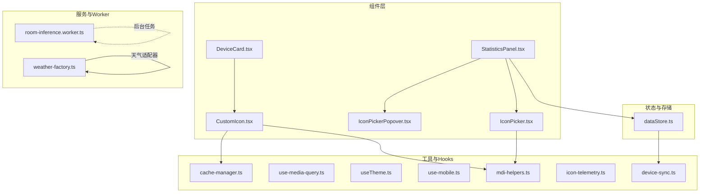
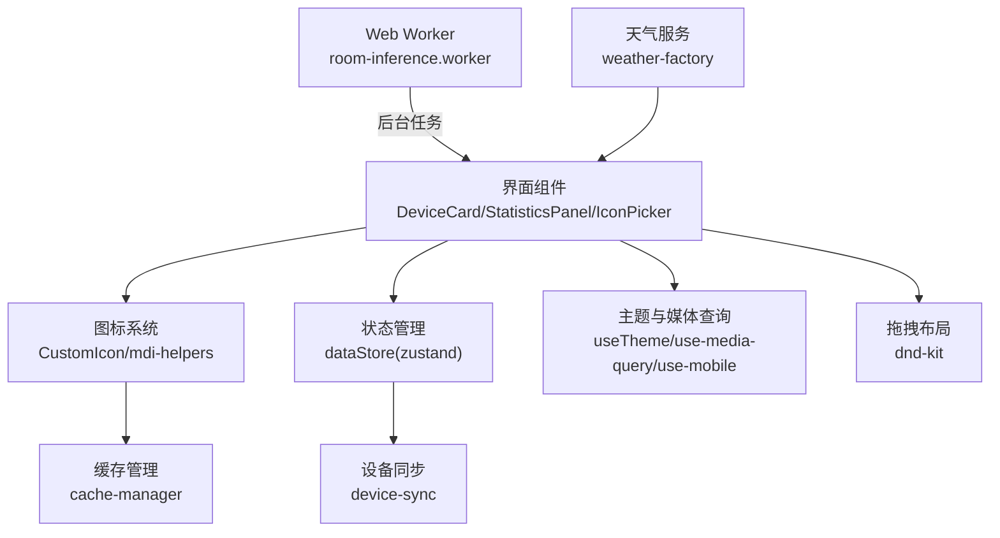
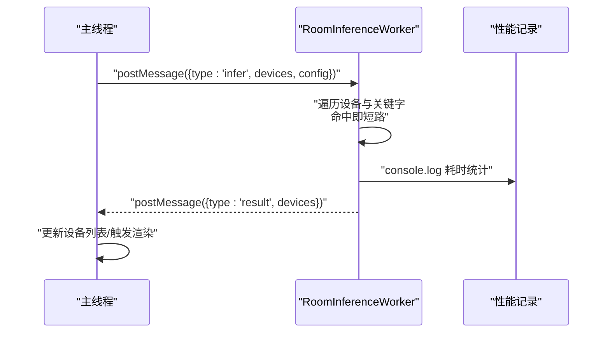
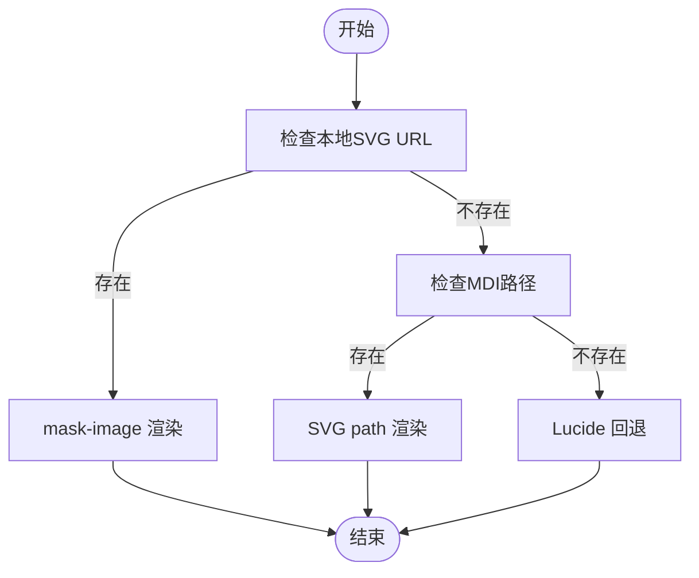
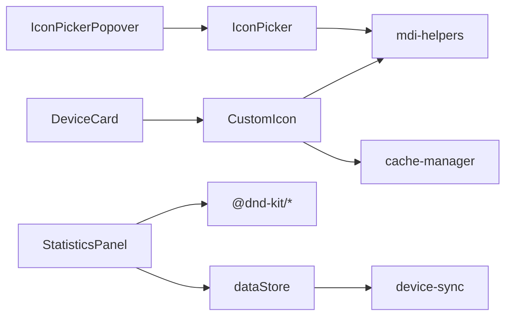

# 性能优化

<cite>
**本文引用的文件**
- [src/workers/room-inference.worker.ts](file://src/workers/room-inference.worker.ts)
- [src/app/components/dashboard/DeviceCard.tsx](file://src/app/components/dashboard/DeviceCard.tsx)
- [src/utils/cache-manager.ts](file://src/utils/cache-manager.ts)
- [src/hooks/use-media-query.ts](file://src/hooks/use-media-query.ts)
- [src/hooks/useTheme.ts](file://src/hooks/useTheme.ts)
- [src/app/components/ui/use-mobile.ts](file://src/app/components/ui/use-mobile.ts)
- [src/app/components/dashboard/cards/shared/CustomIcon.tsx](file://src/app/components/dashboard/cards/shared/CustomIcon.tsx)
- [src/services/weather/weather-factory.ts](file://src/services/weather/weather-factory.ts)
- [src/utils/icon-telemetry.ts](file://src/utils/icon-telemetry.ts)
- [src/utils/mdi-helpers.ts](file://src/utils/mdi-helpers.ts)
- [src/app/components/dashboard/IconPicker.tsx](file://src/app/components/dashboard/IconPicker.tsx)
- [src/app/components/dashboard/IconPickerPopover.tsx](file://src/app/components/dashboard/IconPickerPopover.tsx)
- [src/app/components/dashboard/StatisticsPanel.tsx](file://src/app/components/dashboard/StatisticsPanel.tsx)
- [src/store/dataStore.ts](file://src/store/dataStore.ts)
- [src/utils/device-sync.ts](file://src/utils/device-sync.ts)
</cite>

## 目录
1. [简介](#简介)
2. [项目结构](#项目结构)
3. [核心组件](#核心组件)
4. [架构总览](#架构总览)
5. [详细组件分析](#详细组件分析)
6. [依赖分析](#依赖分析)
7. [性能考量](#性能考量)
8. [故障排查指南](#故障排查指南)
9. [结论](#结论)
10. [附录](#附录)

## 简介
本文件面向HAUI项目的性能优化，系统性梳理并总结以下关键主题：Web Worker的使用策略、虚拟列表与懒加载渲染、图标加载与缓存优化、响应式设计与动画开销控制、大型组件渲染与状态持久化、网络请求与CDN集成、性能监控与基准测试方法，以及问题诊断与瓶颈定位的最佳实践。文档以代码为依据，辅以可视化图示，帮助开发者快速落地优化措施。

## 项目结构
本项目采用前端单页应用架构，核心目录包括：
- src/app/components：页面与组件层，包含仪表盘卡片、小部件、UI控件等
- src/utils：通用工具库，如图标处理、缓存、设备同步、遥测等
- src/hooks：React Hooks，如媒体查询、主题切换、移动端检测等
- src/store：状态管理（Zustand），支持本地持久化
- src/workers：Web Worker，用于后台计算任务（如房间推断）
- src/services：服务层适配器（天气等）

图表来源
- [src/app/components/dashboard/DeviceCard.tsx:1-293](file://src/app/components/dashboard/DeviceCard.tsx#L1-L293)
- [src/app/components/dashboard/StatisticsPanel.tsx:1-371](file://src/app/components/dashboard/StatisticsPanel.tsx#L1-L371)
- [src/app/components/dashboard/IconPicker.tsx:1-90](file://src/app/components/dashboard/IconPicker.tsx#L1-L90)
- [src/app/components/dashboard/IconPickerPopover.tsx:1-91](file://src/app/components/dashboard/IconPickerPopover.tsx#L1-L91)
- [src/app/components/dashboard/cards/shared/CustomIcon.tsx:1-74](file://src/app/components/dashboard/cards/shared/CustomIcon.tsx#L1-L74)
- [src/utils/cache-manager.ts:1-57](file://src/utils/cache-manager.ts#L1-L57)
- [src/hooks/use-media-query.ts:1-35](file://src/hooks/use-media-query.ts#L1-L35)
- [src/hooks/useTheme.ts:1-26](file://src/hooks/useTheme.ts#L1-L26)
- [src/app/components/ui/use-mobile.ts:1-22](file://src/app/components/ui/use-mobile.ts#L1-L22)
- [src/utils/mdi-helpers.ts:1-155](file://src/utils/mdi-helpers.ts#L1-L155)
- [src/utils/icon-telemetry.ts:1-59](file://src/utils/icon-telemetry.ts#L1-L59)
- [src/utils/device-sync.ts:1-191](file://src/utils/device-sync.ts#L1-L191)
- [src/store/dataStore.ts:1-129](file://src/store/dataStore.ts#L1-L129)
- [src/services/weather/weather-factory.ts:1-21](file://src/services/weather/weather-factory.ts#L1-L21)
- [src/workers/room-inference.worker.ts:1-73](file://src/workers/room-inference.worker.ts#L1-L73)

章节来源
- [src/app/components/dashboard/DeviceCard.tsx:1-293](file://src/app/components/dashboard/DeviceCard.tsx#L1-L293)
- [src/app/components/dashboard/StatisticsPanel.tsx:1-371](file://src/app/components/dashboard/StatisticsPanel.tsx#L1-L371)
- [src/app/components/dashboard/IconPicker.tsx:1-90](file://src/app/components/dashboard/IconPicker.tsx#L1-L90)
- [src/app/components/dashboard/IconPickerPopover.tsx:1-91](file://src/app/components/dashboard/IconPickerPopover.tsx#L1-L91)
- [src/app/components/dashboard/cards/shared/CustomIcon.tsx:1-74](file://src/app/components/dashboard/cards/shared/CustomIcon.tsx#L1-L74)
- [src/utils/cache-manager.ts:1-57](file://src/utils/cache-manager.ts#L1-L57)
- [src/hooks/use-media-query.ts:1-35](file://src/hooks/use-media-query.ts#L1-L35)
- [src/hooks/useTheme.ts:1-26](file://src/hooks/useTheme.ts#L1-L26)
- [src/app/components/ui/use-mobile.ts:1-22](file://src/app/components/ui/use-mobile.ts#L1-L22)
- [src/utils/mdi-helpers.ts:1-155](file://src/utils/mdi-helpers.ts#L1-L155)
- [src/utils/icon-telemetry.ts:1-59](file://src/utils/icon-telemetry.ts#L1-L59)
- [src/utils/device-sync.ts:1-191](file://src/utils/device-sync.ts#L1-L191)
- [src/store/dataStore.ts:1-129](file://src/store/dataStore.ts#L1-L129)
- [src/services/weather/weather-factory.ts:1-21](file://src/services/weather/weather-factory.ts#L1-L21)
- [src/workers/room-inference.worker.ts:1-73](file://src/workers/room-inference.worker.ts#L1-L73)

## 核心组件
- 设备卡片渲染与动画：通过React.memo与时间戳参数控制重渲染频率，避免传感器类组件每秒强制刷新；使用轻量动画库进行旋转等视觉效果。
- 图标系统：统一的CustomIcon组件支持本地SVG、MDI矢量与Lucide回退，结合缓存与搜索优化减少重复计算与网络请求。
- 天气服务：工厂模式选择不同天气适配器，便于扩展与替换。
- 状态与持久化：Zustand + localStorage持久化，支持增量同步与字段选择性持久化。
- 响应式与主题：媒体查询与移动端检测Hook，主题切换写入DOM与本地存储。
- 拖拽布局：基于dnd-kit的高性能拖拽，配合精确尺寸测量避免“塌缩”与变形。
- Worker：房间推断在独立线程执行，主线程保持流畅。

章节来源
- [src/app/components/dashboard/DeviceCard.tsx:267-292](file://src/app/components/dashboard/DeviceCard.tsx#L267-L292)
- [src/app/components/dashboard/cards/shared/CustomIcon.tsx:1-74](file://src/app/components/dashboard/cards/shared/CustomIcon.tsx#L1-L74)
- [src/services/weather/weather-factory.ts:1-21](file://src/services/weather/weather-factory.ts#L1-L21)
- [src/store/dataStore.ts:58-128](file://src/store/dataStore.ts#L58-L128)
- [src/hooks/use-media-query.ts:1-35](file://src/hooks/use-media-query.ts#L1-L35)
- [src/hooks/useTheme.ts:1-26](file://src/hooks/useTheme.ts#L1-L26)
- [src/app/components/ui/use-mobile.ts:1-22](file://src/app/components/ui/use-mobile.ts#L1-L22)
- [src/app/components/dashboard/StatisticsPanel.tsx:196-348](file://src/app/components/dashboard/StatisticsPanel.tsx#L196-L348)
- [src/workers/room-inference.worker.ts:24-73](file://src/workers/room-inference.worker.ts#L24-L73)

## 架构总览
下图展示关键模块间的交互关系与数据流，突出性能优化点：Worker异步处理、图标缓存与搜索、状态持久化、响应式与动画控制。

图表来源
- [src/app/components/dashboard/DeviceCard.tsx:1-293](file://src/app/components/dashboard/DeviceCard.tsx#L1-L293)
- [src/app/components/dashboard/StatisticsPanel.tsx:1-371](file://src/app/components/dashboard/StatisticsPanel.tsx#L1-L371)
- [src/app/components/dashboard/IconPicker.tsx:1-90](file://src/app/components/dashboard/IconPicker.tsx#L1-L90)
- [src/app/components/dashboard/cards/shared/CustomIcon.tsx:1-74](file://src/app/components/dashboard/cards/shared/CustomIcon.tsx#L1-L74)
- [src/utils/cache-manager.ts:1-57](file://src/utils/cache-manager.ts#L1-L57)
- [src/utils/mdi-helpers.ts:1-155](file://src/utils/mdi-helpers.ts#L1-L155)
- [src/store/dataStore.ts:1-129](file://src/store/dataStore.ts#L1-L129)
- [src/utils/device-sync.ts:1-191](file://src/utils/device-sync.ts#L1-L191)
- [src/hooks/use-theme.ts:1-26](file://src/hooks/useTheme.ts#L1-L26)
- [src/hooks/use-media-query.ts:1-35](file://src/hooks/use-media-query.ts#L1-L35)
- [src/app/components/ui/use-mobile.ts:1-22](file://src/app/components/ui/use-mobile.ts#L1-L22)
- [src/services/weather/weather-factory.ts:1-21](file://src/services/weather/weather-factory.ts#L1-L21)
- [src/workers/room-inference.worker.ts:1-73](file://src/workers/room-inference.worker.ts#L1-L73)

## 详细组件分析

### Web Worker：房间推断
- 背景：对大量设备进行房间推断会阻塞主线程，影响UI交互与滚动。
- 策略：将推断逻辑放入worker，主线程只负责消息收发与结果回传。
- 关键点：
  - 使用类型安全的消息结构，避免复杂导入导致构建复杂度上升。
  - 在worker内直接遍历优先级列表与关键字集合，命中即短路返回最佳匹配。
  - 记录耗时日志，便于监控与调优。
  - 主线程收到结果后更新设备列表，避免不必要的重渲染。

图表来源
- [src/workers/room-inference.worker.ts:24-73](file://src/workers/room-inference.worker.ts#L24-L73)

章节来源
- [src/workers/room-inference.worker.ts:1-73](file://src/workers/room-inference.worker.ts#L1-L73)

### 虚拟列表与懒加载渲染
- 现状：当前组件未见虚拟列表实现；StatisticsPanel使用CSS网格布局，子项较多时可能引发布局与绘制压力。
- 优化建议：
  - 对长列表（如日志、设备列表）采用虚拟列表，仅渲染可视窗口内的节点。
  - 将昂贵的子组件（如SensorStatusCard、CameraWidget）按需挂载，滚动进入视口后再渲染。
  - 结合React.lazy与Suspense实现组件级懒加载，降低首屏负担。
  - 控制重渲染：DeviceCard已使用memo并根据传感器特性控制nowMs参数，可进一步拆分子组件，细化依赖。

章节来源
- [src/app/components/dashboard/StatisticsPanel.tsx:196-348](file://src/app/components/dashboard/StatisticsPanel.tsx#L196-L348)
- [src/app/components/dashboard/DeviceCard.tsx:267-292](file://src/app/components/dashboard/DeviceCard.tsx#L267-L292)

### 图标加载与缓存优化
- 统一入口：CustomIcon根据名称优先尝试本地SVG URL，再回退到MDI矢量，最后使用Lucide图标。
- 缓存策略：cache-manager提供localStorage缓存，带TTL过期控制；同时提供“过期即取旧值”的读取接口，便于实现“先显示旧值，后台刷新”的体验。
- 搜索与分类：mdi-helpers提供MDI元数据、关键词映射、分类与搜索评分，避免每次全量扫描。
- 性能收益：
  - 减少远程请求与DOM节点数量，mask-image方式渲染SVG更高效。
  - 搜索结果缓存与去重，降低重复计算。
  - 图标遥测记录性能事件，便于定位慢图标与错误。

图表来源
- [src/app/components/dashboard/cards/shared/CustomIcon.tsx:13-73](file://src/app/components/dashboard/cards/shared/CustomIcon.tsx#L13-L73)
- [src/utils/cache-manager.ts:9-43](file://src/utils/cache-manager.ts#L9-L43)
- [src/utils/mdi-helpers.ts:99-149](file://src/utils/mdi-helpers.ts#L99-L149)
- [src/utils/icon-telemetry.ts:35-45](file://src/utils/icon-telemetry.ts#L35-L45)

章节来源
- [src/app/components/dashboard/cards/shared/CustomIcon.tsx:1-74](file://src/app/components/dashboard/cards/shared/CustomIcon.tsx#L1-L74)
- [src/utils/cache-manager.ts:1-57](file://src/utils/cache-manager.ts#L1-L57)
- [src/utils/mdi-helpers.ts:1-155](file://src/utils/mdi-helpers.ts#L1-L155)
- [src/utils/icon-telemetry.ts:1-59](file://src/utils/icon-telemetry.ts#L1-L59)

### 响应式设计与动画优化
- 媒体查询：use-media-query与use-mobile分别提供断点与移动端判断，避免频繁监听导致的重排。
- 动画控制：DeviceCard中的传感器旋转动画仅在触发状态下播放，且使用固定周期与无限循环，避免不必要的帧消耗。
- 布局稳定性：StatisticsPanel在拖拽开始前精确测量元素尺寸，防止“塌缩”与变形，提升交互体验与渲染稳定性。

章节来源
- [src/hooks/use-media-query.ts:1-35](file://src/hooks/use-media-query.ts#L1-L35)
- [src/app/components/ui/use-mobile.ts:1-22](file://src/app/components/ui/use-mobile.ts#L1-L22)
- [src/app/components/dashboard/DeviceCard.tsx:138-171](file://src/app/components/dashboard/DeviceCard.tsx#L138-L171)
- [src/app/components/dashboard/StatisticsPanel.tsx:109-124](file://src/app/components/dashboard/StatisticsPanel.tsx#L109-L124)

### 大型组件渲染优化与状态持久化
- 数据同步：device-sync针对不同设备类型进行差异化属性同步，仅在必要时更新，减少不一致抖动。
- 状态持久化：dataStore使用zustand持久化中间件，选择性持久化关键字段，并在写入时触发同步流程，避免全量序列化带来的开销。
- 组件粒度：将SensorStatusCard、IndoorEnvironmentCard等大组件拆分为更细粒度的子组件，结合memo与浅比较，降低重渲染范围。

章节来源
- [src/utils/device-sync.ts:1-191](file://src/utils/device-sync.ts#L1-L191)
- [src/store/dataStore.ts:58-128](file://src/store/dataStore.ts#L58-L128)

### 网络请求优化、数据压缩与CDN集成
- 适配器模式：weather-factory按提供商选择适配器，便于引入缓存与CDN策略。
- 建议方案：
  - 对天气API增加本地缓存与TTL，结合icon-telemetry记录请求耗时与错误。
  - 使用CDN托管静态资源（如MDI元数据、图标SVG），减少首包体积与解析成本。
  - 对于远程图标，采用懒加载与占位骨架，避免阻塞主线程。
  - 启用HTTP/2多路复用与Gzip/Brotli压缩，减少传输体积。

章节来源
- [src/services/weather/weather-factory.ts:1-21](file://src/services/weather/weather-factory.ts#L1-L21)
- [src/utils/icon-telemetry.ts:1-59](file://src/utils/icon-telemetry.ts#L1-L59)
- [src/utils/mdi-helpers.ts:1-155](file://src/utils/mdi-helpers.ts#L1-L155)

## 依赖分析
- 组件耦合：
  - DeviceCard依赖CustomIcon与传感器时间戳组件，内部通过memo减少重渲染。
  - StatisticsPanel依赖dnd-kit进行拖拽，依赖dataStore进行布局与数据持久化。
  - IconPicker与IconPickerPopover依赖CustomIcon与mdi-helpers，形成图标选择链路。
- 外部依赖：
  - motion/react用于轻量动画；@dnd-kit/core/sortable用于拖拽；lucide-react用于UI图标；@mdi/js用于矢量图标；zustand用于状态管理；localStorage用于持久化。

图表来源
- [src/app/components/dashboard/DeviceCard.tsx:1-293](file://src/app/components/dashboard/DeviceCard.tsx#L1-L293)
- [src/app/components/dashboard/StatisticsPanel.tsx:1-371](file://src/app/components/dashboard/StatisticsPanel.tsx#L1-L371)
- [src/app/components/dashboard/IconPicker.tsx:1-90](file://src/app/components/dashboard/IconPicker.tsx#L1-L90)
- [src/app/components/dashboard/IconPickerPopover.tsx:1-91](file://src/app/components/dashboard/IconPickerPopover.tsx#L1-L91)
- [src/app/components/dashboard/cards/shared/CustomIcon.tsx:1-74](file://src/app/components/dashboard/cards/shared/CustomIcon.tsx#L1-L74)
- [src/utils/cache-manager.ts:1-57](file://src/utils/cache-manager.ts#L1-L57)
- [src/utils/mdi-helpers.ts:1-155](file://src/utils/mdi-helpers.ts#L1-L155)
- [src/utils/device-sync.ts:1-191](file://src/utils/device-sync.ts#L1-L191)
- [src/store/dataStore.ts:1-129](file://src/store/dataStore.ts#L1-L129)

章节来源
- [src/app/components/dashboard/DeviceCard.tsx:1-293](file://src/app/components/dashboard/DeviceCard.tsx#L1-L293)
- [src/app/components/dashboard/StatisticsPanel.tsx:1-371](file://src/app/components/dashboard/StatisticsPanel.tsx#L1-L371)
- [src/app/components/dashboard/IconPicker.tsx:1-90](file://src/app/components/dashboard/IconPicker.tsx#L1-L90)
- [src/app/components/dashboard/IconPickerPopover.tsx:1-91](file://src/app/components/dashboard/IconPickerPopover.tsx#L1-L91)
- [src/app/components/dashboard/cards/shared/CustomIcon.tsx:1-74](file://src/app/components/dashboard/cards/shared/CustomIcon.tsx#L1-L74)
- [src/utils/cache-manager.ts:1-57](file://src/utils/cache-manager.ts#L1-L57)
- [src/utils/mdi-helpers.ts:1-155](file://src/utils/mdi-helpers.ts#L1-L155)
- [src/utils/device-sync.ts:1-191](file://src/utils/device-sync.ts#L1-L191)
- [src/store/dataStore.ts:1-129](file://src/store/dataStore.ts#L1-L129)

## 性能考量
- 渲染层面
  - 使用React.memo与精确依赖比较，避免非必要的重渲染。
  - 控制动画帧率与播放条件，减少合成层压力。
  - 对长列表采用虚拟化与懒加载，降低DOM节点数量。
- 状态与存储
  - 选择性持久化，避免一次性写入过多数据。
  - 写入时触发增量同步，减少全局状态抖动。
- 图标与资源
  - 本地SVG优先、MDI矢量复用、Lucide回退，结合缓存与搜索评分。
  - CDN承载静态资源，减少解析与传输成本。
- 网络与适配器
  - 适配器模式便于引入缓存与CDN；记录遥测事件，持续优化请求路径。

[本节为通用指导，无需列出具体文件来源]

## 故障排查指南
- 图标异常
  - 使用icon-telemetry记录性能与错误事件，定位慢图标与失败原因。
  - 检查本地SVG URL是否存在、MDI路径是否正确、Lucide回退是否生效。
- 渲染卡顿
  - 检查DeviceCard的重渲染条件与nowMs参数传递，避免传感器类组件每秒强制刷新。
  - 观察StatisticsPanel拖拽过程中的尺寸测量是否准确，避免布局抖动。
- 状态不一致
  - 核对device-sync对不同设备类型的同步逻辑，确保状态字段更新及时。
  - 检查dataStore的持久化字段选择与写入时机，避免频繁序列化。
- Worker异常
  - 查看worker控制台日志，确认消息类型与数据结构一致；验证耗时统计是否合理。

章节来源
- [src/utils/icon-telemetry.ts:1-59](file://src/utils/icon-telemetry.ts#L1-L59)
- [src/app/components/dashboard/DeviceCard.tsx:267-292](file://src/app/components/dashboard/DeviceCard.tsx#L267-L292)
- [src/app/components/dashboard/StatisticsPanel.tsx:109-124](file://src/app/components/dashboard/StatisticsPanel.tsx#L109-L124)
- [src/utils/device-sync.ts:1-191](file://src/utils/device-sync.ts#L1-L191)
- [src/store/dataStore.ts:104-127](file://src/store/dataStore.ts#L104-L127)
- [src/workers/room-inference.worker.ts:28-70](file://src/workers/room-inference.worker.ts#L28-L70)

## 结论
HAUI已在多个关键环节体现性能意识：Worker异步处理、图标系统缓存与回退、状态持久化与选择性更新、响应式与动画控制。为进一步提升性能，建议引入虚拟列表与组件懒加载、完善CDN与缓存策略、加强遥测与基准测试体系，并持续优化渲染路径与网络请求链路。通过本文档的可视化与实操建议，团队可系统性推进性能优化落地。

[本节为总结性内容，无需列出具体文件来源]

## 附录
- 性能监控与基准测试
  - 使用icon-telemetry记录图标加载性能与错误，定期导出快照进行趋势分析。
  - 在关键路径（如图标渲染、设备同步、拖拽）埋点，结合浏览器性能面板与FPS监控。
- 最佳实践清单
  - 优先使用memo与浅比较；对长列表采用虚拟化；对昂贵计算放入Worker。
  - 图标加载遵循本地SVG → MDI → Lucide顺序；启用CDN与缓存；记录遥测事件。
  - 状态持久化选择性字段；写入时触发增量同步；避免全量序列化。
  - 响应式与动画控制：断点监听去抖、动画条件化播放、拖拽前测量尺寸。

[本节为通用指导，无需列出具体文件来源]