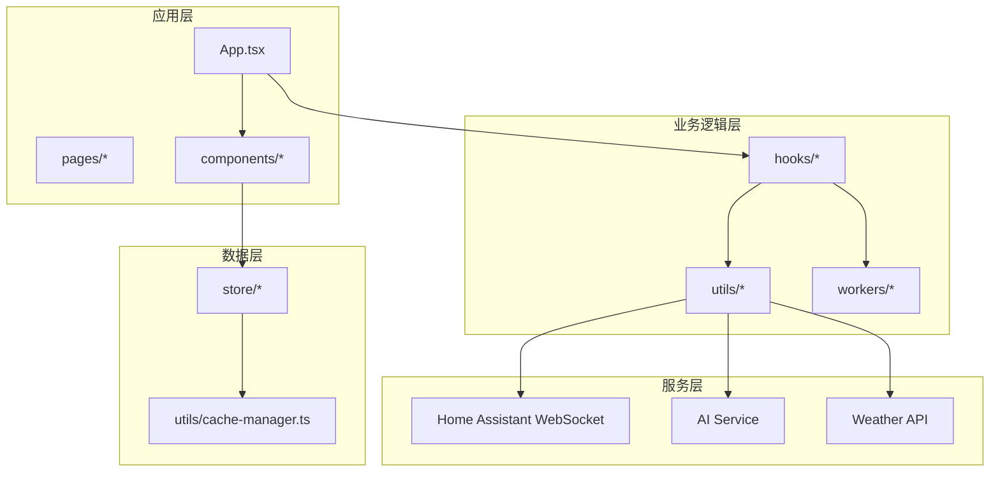
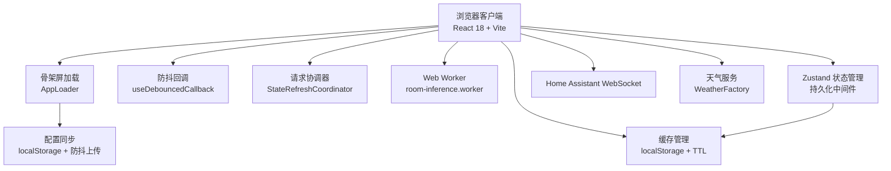
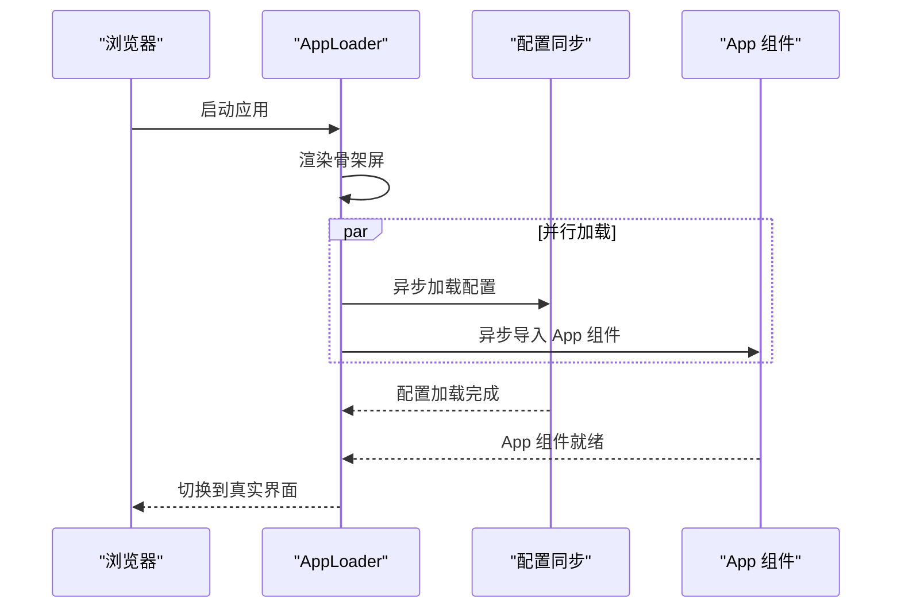
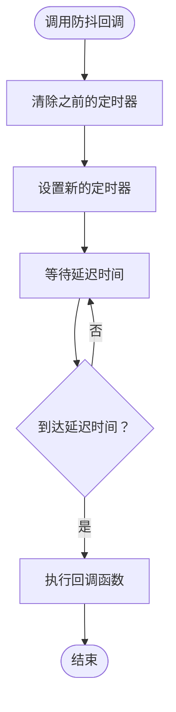
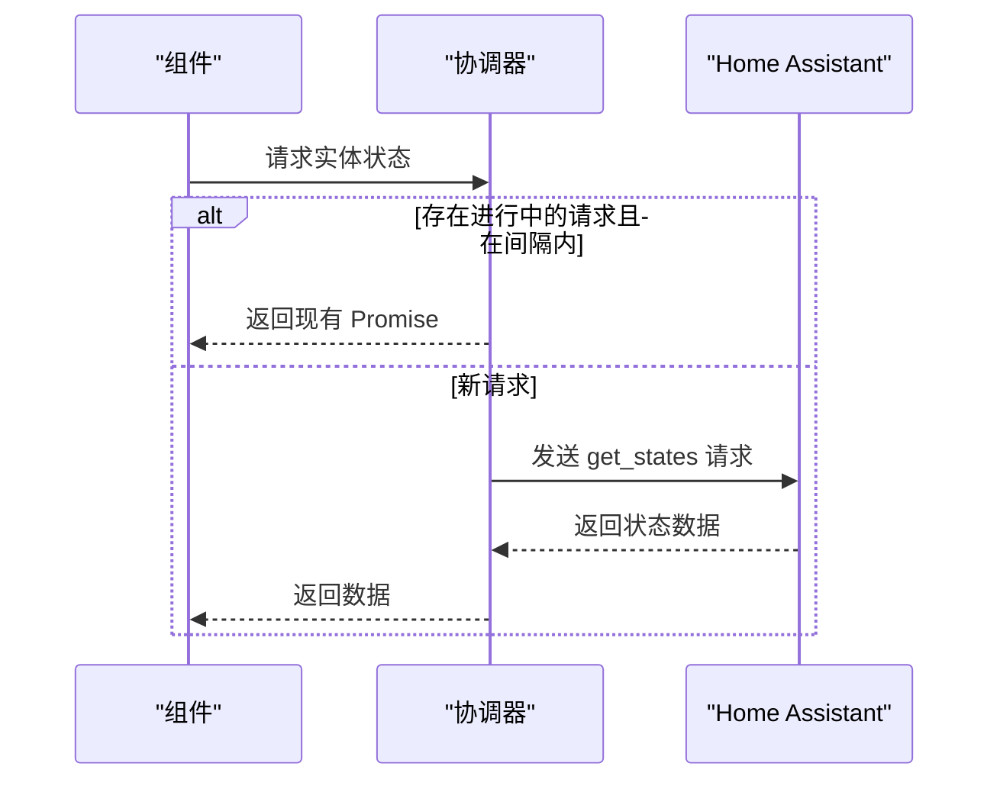
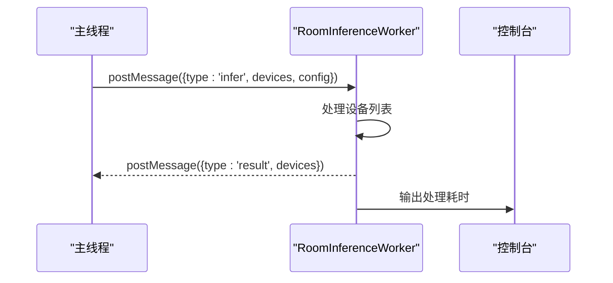
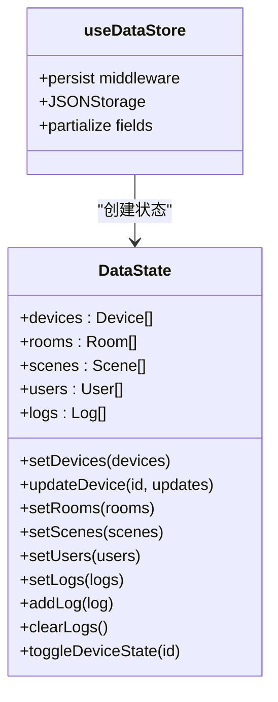
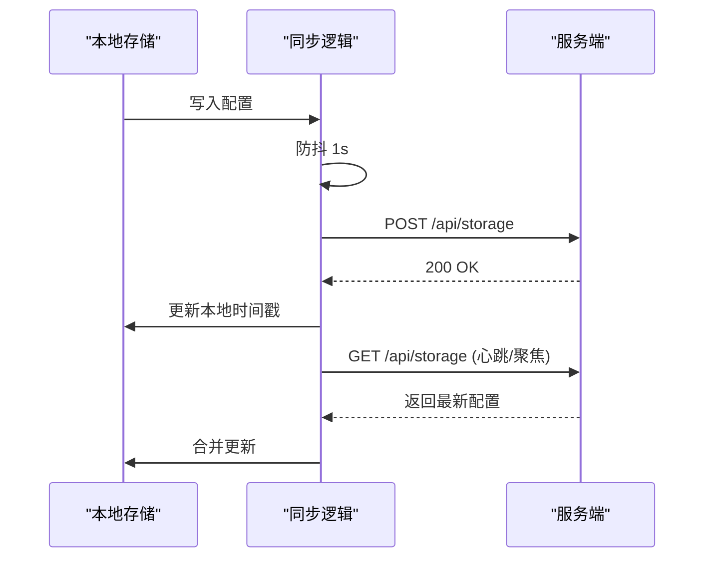
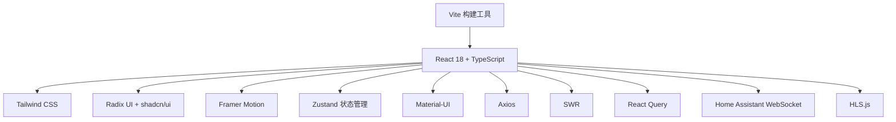

# 性能优化

<cite>
**本文档引用的文件**
- [README.md](file://README.md)
- [package.json](file://package.json)
- [vite.config.ts](file://vite.config.ts)
- [Dockerfile](file://Dockerfile)
- [nginx.conf](file://nginx.conf)
- [src/main.tsx](file://src/main.tsx)
- [src/utils/cache-manager.ts](file://src/utils/cache-manager.ts)
- [src/hooks/useDebouncedCallback.ts](file://src/hooks/useDebouncedCallback.ts)
- [src/workers/room-inference.worker.ts](file://src/workers/room-inference.worker.ts)
- [src/store/dataStore.ts](file://src/store/dataStore.ts)
- [src/utils/request-coordinator.ts](file://src/utils/request-coordinator.ts)
- [src/hooks/useHASyncManager.ts](file://src/hooks/useHASyncManager.ts)
- [src/utils/sync.ts](file://src/utils/sync.ts)
- [src/app/components/dashboard/DeviceCard.tsx](file://src/app/components/dashboard/DeviceCard.tsx)
- [src/services/weather/weather-factory.ts](file://src/services/weather/weather-factory.ts)
</cite>

## 目录
1. [简介](#简介)
2. [项目结构](#项目结构)
3. [核心组件](#核心组件)
4. [架构总览](#架构总览)
5. [详细组件分析](#详细组件分析)
6. [依赖关系分析](#依赖关系分析)
7. [性能考量](#性能考量)
8. [故障排除指南](#故障排除指南)
9. [结论](#结论)

## 简介
本项目是一个为 Home Assistant 打造的高性能现代化前端控制面板，专注于极致视觉体验与企业级性能。项目采用 React 18 + TypeScript + Vite 构建，结合 Tailwind CSS 与 Radix UI + shadcn/ui，提供流畅的交互体验与强大的功能集。性能优化策略包括代码分割、防抖节流、乐观更新、减少动画、Web Worker、缓存管理、请求协调、懒加载与构建优化等。

## 项目结构
项目采用模块化的前端架构，主要分为以下层次：
- 应用层：仪表盘、AI 聊天、设置等页面组件
- 业务逻辑层：设备状态同步、防抖回调、安全确认等 Hook 与工具
- 数据层：Zustand 状态管理，持久化存储
- 服务层：Home Assistant WebSocket、AI 服务、天气 API



**图表来源**
- [src/main.tsx:1-123](file://src/main.tsx#L1-L123)
- [src/store/dataStore.ts:1-129](file://src/store/dataStore.ts#L1-L129)
- [src/utils/cache-manager.ts:1-135](file://src/utils/cache-manager.ts#L1-L135)

**章节来源**
- [README.md:37-77](file://README.md#L37-L77)
- [package.json:1-132](file://package.json#L1-L132)

## 核心组件
本节深入分析与性能优化密切相关的组件与工具：

- **懒加载与骨架屏**：应用启动时先渲染骨架屏，后台异步加载配置与主应用组件，避免首屏阻塞。
- **缓存管理**：基于 localStorage 的带 TTL 缓存，区分不同数据类型的过期策略，限制最大存储大小。
- **防抖回调**：针对频繁触发的事件（如滑块拖动、输入框输入）进行防抖优化，降低请求频率。
- **请求协调器**：防止短时间内对 Home Assistant 的重复请求，通过 Promise 缓存共享请求结果。
- **Web Worker**：房间推断逻辑在 Worker 中执行，避免主线程阻塞。
- **状态管理与持久化**：Zustand 结合持久化中间件，选择性持久化关键字段，并在写入时触发同步。
- **跨设备配置同步**：基于 localStorage 的配置同步，支持防抖上传与增量校验。
- **构建与部署优化**：Vite 构建、外部化大体积依赖、Nginx 压缩与缓存配置。

**章节来源**
- [src/main.tsx:17-123](file://src/main.tsx#L17-L123)
- [src/utils/cache-manager.ts:11-135](file://src/utils/cache-manager.ts#L11-L135)
- [src/hooks/useDebouncedCallback.ts:1-107](file://src/hooks/useDebouncedCallback.ts#L1-L107)
- [src/utils/request-coordinator.ts:20-114](file://src/utils/request-coordinator.ts#L20-L114)
- [src/workers/room-inference.worker.ts:1-73](file://src/workers/room-inference.worker.ts#L1-L73)
- [src/store/dataStore.ts:58-129](file://src/store/dataStore.ts#L58-L129)
- [src/utils/sync.ts:43-161](file://src/utils/sync.ts#L43-L161)

## 架构总览
系统采用分层架构，强调解耦与性能优化：



**图表来源**
- [src/main.tsx:88-123](file://src/main.tsx#L88-L123)
- [src/utils/sync.ts:43-93](file://src/utils/sync.ts#L43-L93)
- [src/utils/cache-manager.ts:30-91](file://src/utils/cache-manager.ts#L30-L91)
- [src/hooks/useDebouncedCallback.ts:19-41](file://src/hooks/useDebouncedCallback.ts#L19-L41)
- [src/utils/request-coordinator.ts:20-58](file://src/utils/request-coordinator.ts#L20-L58)
- [src/workers/room-inference.worker.ts:24-73](file://src/workers/room-inference.worker.ts#L24-L73)
- [src/store/dataStore.ts:58-129](file://src/store/dataStore.ts#L58-L129)
- [src/services/weather/weather-factory.ts:10-21](file://src/services/weather/weather-factory.ts#L10-L21)

## 详细组件分析

### 懒加载与骨架屏（AppLoader）
- **目的**：避免配置加载阻塞首屏渲染，提升感知性能。
- **实现要点**：
  - 后台异步加载配置与 App 组件，失败时仍尝试加载 App。
  - 骨架屏包含旋转动画与加载提示，改善用户体验。
  - 使用 DndProvider 包裹，保证拖拽功能可用。



**图表来源**
- [src/main.tsx:88-123](file://src/main.tsx#L88-L123)
- [src/utils/sync.ts:98-131](file://src/utils/sync.ts#L98-L131)

**章节来源**
- [src/main.tsx:17-123](file://src/main.tsx#L17-L123)

### 缓存管理（CacheManager）
- **目的**：减少重复请求，提升数据访问速度。
- **实现要点**：
  - 不同数据类型配置不同的过期时间（stale/max）。
  - 限制最大存储大小，避免内存占用过高。
  - 支持按模式清理缓存，便于调试与维护。

```mermaid
classDiagram
class CacheManager {
-MAX_STORAGE_SIZE : number
+get(key, type) : {data, isStale}
+set(key, data, type) : void
+getStale(key) : T|null
+invalidate(pattern?) : void
+clear() : void
}
class CacheEntry {
+data : any
+timestamp : number
+ttlMs : number
}
CacheManager --> CacheEntry : "管理"
```

**图表来源**
- [src/utils/cache-manager.ts:30-135](file://src/utils/cache-manager.ts#L30-L135)

**章节来源**
- [src/utils/cache-manager.ts:11-135](file://src/utils/cache-manager.ts#L11-L135)

### 防抖回调（useDebouncedCallback）
- **目的**：优化频繁触发的事件（如滑块拖动、输入框输入），降低请求频率。
- **实现要点**：
  - 基础版本：简单防抖，适合大多数场景。
  - 高级版本：支持立即执行选项、取消与刷新，满足复杂交互需求。



**图表来源**
- [src/hooks/useDebouncedCallback.ts:19-41](file://src/hooks/useDebouncedCallback.ts#L19-L41)

**章节来源**
- [src/hooks/useDebouncedCallback.ts:1-107](file://src/hooks/useDebouncedCallback.ts#L1-L107)

### 请求协调器（StateRefreshCoordinator）
- **目的**：防止短时间内对 Home Assistant 的重复请求，提升网络效率。
- **实现要点**：
  - 通过 Promise 缓存共享请求结果，避免重复发送。
  - 支持最小请求间隔与超时控制，增强稳定性。



**图表来源**
- [src/utils/request-coordinator.ts:37-82](file://src/utils/request-coordinator.ts#L37-L82)

**章节来源**
- [src/utils/request-coordinator.ts:20-114](file://src/utils/request-coordinator.ts#L20-L114)

### Web Worker（room-inference.worker）
- **目的**：将计算密集型任务（房间推断）移出主线程，避免 UI 卡顿。
- **实现要点**：
  - 接收设备列表与房间配置，返回推断结果。
  - 使用性能计时输出处理耗时，便于性能监控。



**图表来源**
- [src/workers/room-inference.worker.ts:24-73](file://src/workers/room-inference.worker.ts#L24-L73)

**章节来源**
- [src/workers/room-inference.worker.ts:1-73](file://src/workers/room-inference.worker.ts#L1-L73)

### 状态管理与持久化（dataStore）
- **目的**：集中管理应用状态，减少不必要的渲染与更新。
- **实现要点**：
  - 使用 Zustand 管理设备、房间、场景、用户、日志等状态。
  - 通过持久化中间件选择性持久化关键字段。
  - 写入时触发同步，保持跨设备一致性。



**图表来源**
- [src/store/dataStore.ts:9-129](file://src/store/dataStore.ts#L9-L129)

**章节来源**
- [src/store/dataStore.ts:58-129](file://src/store/dataStore.ts#L58-L129)

### 跨设备配置同步（sync）
- **目的**：在多设备间保持配置一致，提升用户体验。
- **实现要点**：
  - 主动上传：写入 localStorage 后防抖上传。
  - 主动拉取：定期心跳与页面聚焦时对齐。
  - 增量校验：基于时间戳判断是否需要更新。



**图表来源**
- [src/utils/sync.ts:52-131](file://src/utils/sync.ts#L52-L131)

**章节来源**
- [src/utils/sync.ts:43-161](file://src/utils/sync.ts#L43-L161)

### 设备卡片渲染优化（DeviceCard）
- **目的**：针对不同设备类型进行针对性渲染优化，减少不必要的计算与 DOM 操作。
- **实现要点**：
  - 类型分支渲染：根据设备类型选择对应子组件，避免冗余逻辑。
  - 条件动画：传感器触发时才启用旋转动画，减少动画开销。
  - 传感器状态文本：根据设备类别动态生成状态文本，避免重复计算。

**章节来源**
- [src/app/components/dashboard/DeviceCard.tsx:25-200](file://src/app/components/dashboard/DeviceCard.tsx#L25-L200)

### 天气服务工厂（WeatherFactory）
- **目的**：统一天气服务适配器的选择与创建。
- **实现要点**：
  - 基于枚举选择不同适配器，默认使用 OpenMeteo。
  - 便于扩展新的天气服务提供商。

**章节来源**
- [src/services/weather/weather-factory.ts:1-21](file://src/services/weather/weather-factory.ts#L1-L21)

## 依赖关系分析
项目依赖与性能优化的关系：



**图表来源**
- [package.json:13-96](file://package.json#L13-L96)

**章节来源**
- [package.json:1-132](file://package.json#L1-132)

## 性能考量
- **构建与打包优化**：
  - Vite 提供极速冷启动与按需编译，配合相对路径部署（base: ./）提升灵活性。
  - 外部化大体积依赖（如 ezuikit-js），运行时通过全局变量或 CDN 加载，减小 bundle 体积。
- **运行时性能优化**：
  - 代码分割：路由级懒加载与组件级 Suspense，减少初始包体积。
  - 防抖节流：对频繁触发的操作（灯光亮度、窗帘位置）进行防抖，降低请求频率。
  - 乐观更新：UI 先更新，失败自动回滚，提升交互流畅度。
  - 减少动画：支持 prefers-reduced-motion 媒体查询，减少不必要的动画。
  - Web Worker：将计算密集型任务移出主线程，避免 UI 卡顿。
  - 缓存策略：不同数据类型设置不同 TTL，限制最大存储大小，避免内存占用过高。
  - 请求协调：防止短时间内重复请求 Home Assistant，提升网络效率。
  - 懒加载与骨架屏：应用启动时先渲染骨架屏，后台异步加载配置与组件，提升感知性能。
  - 部署优化：Nginx 启用 gzip 压缩、安全头部与静态资源缓存，提升加载速度。
- **开发与测试**：
  - ESLint 与 TypeScript 提升代码质量，减少运行时错误。
  - Vitest 与 Cypress 提供单元与端到端测试，保障性能优化不引入回归。

**章节来源**
- [README.md:79-86](file://README.md#L79-L86)
- [vite.config.ts:6-51](file://vite.config.ts#L6-L51)
- [nginx.conf:7-37](file://nginx.conf#L7-L37)

## 故障排除指南
- **配置同步失败**：
  - 检查 /api/storage 端点可达性与认证（credentials: include）。
  - 查看防抖定时器是否被频繁触发导致上传失败。
  - 确认服务端返回内容类型为 JSON。
- **请求协调器超时或重复请求**：
  - 调整最小请求间隔与超时时间，避免过于频繁的请求。
  - 检查是否存在多个组件同时请求相同数据。
- **缓存失效或过大**：
  - 确认缓存键命名规范，避免冲突。
  - 检查单条缓存数据大小是否超过最大存储限制。
  - 使用 invalidate 方法按模式清理缓存。
- **Web Worker 性能问题**：
  - 监控处理耗时，必要时拆分任务或减少数据量。
  - 确保消息传递的数据结构简洁，避免序列化开销。
- **懒加载与骨架屏异常**：
  - 确认 AppLoader 正确处理异步加载失败的情况。
  - 检查骨架屏样式与动画是否影响首屏渲染。

**章节来源**
- [src/utils/sync.ts:98-161](file://src/utils/sync.ts#L98-L161)
- [src/utils/request-coordinator.ts:20-114](file://src/utils/request-coordinator.ts#L20-L114)
- [src/utils/cache-manager.ts:30-135](file://src/utils/cache-manager.ts#L30-L135)
- [src/workers/room-inference.worker.ts:24-73](file://src/workers/room-inference.worker.ts#L24-L73)
- [src/main.tsx:88-123](file://src/main.tsx#L88-L123)

## 结论
本项目通过多层次的性能优化策略，在保证功能完整性的同时显著提升了用户体验与系统稳定性。从构建工具到运行时优化，从状态管理到网络请求协调，每个环节都体现了对性能的关注。建议在后续迭代中持续监控关键指标（如首屏渲染时间、交互响应延迟、内存占用等），并根据实际使用场景进一步细化优化策略。