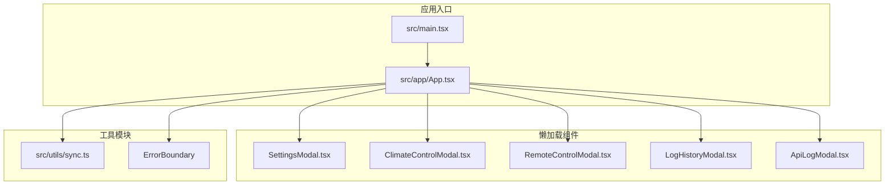
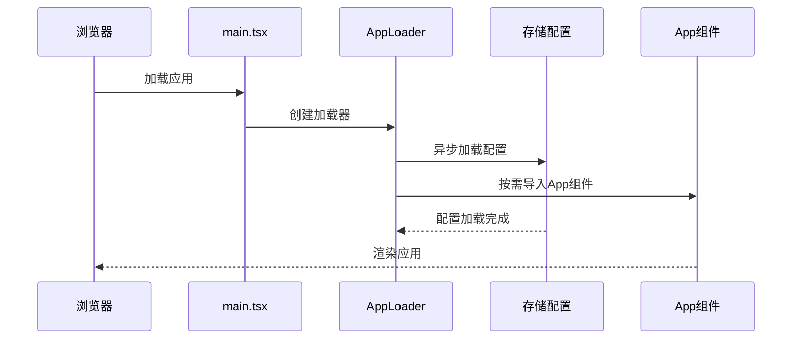
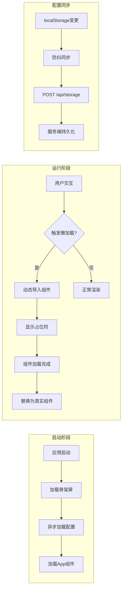
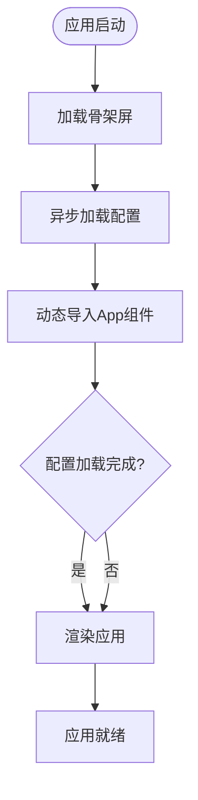
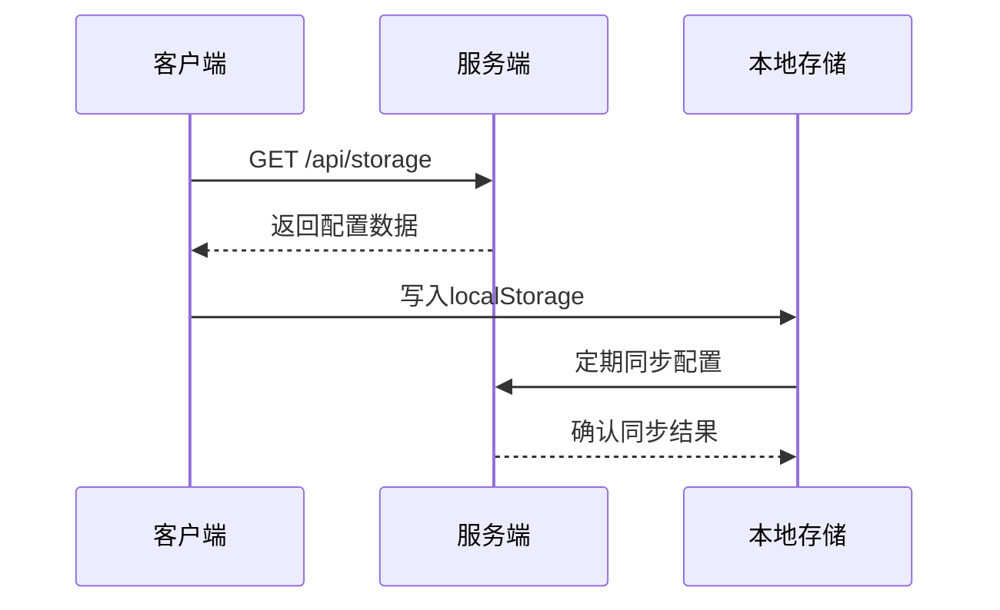
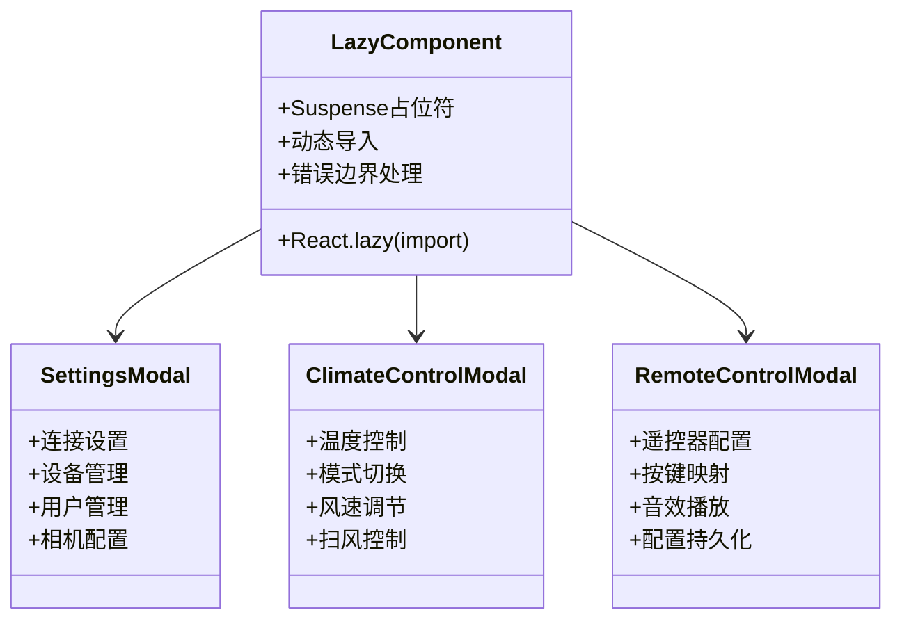
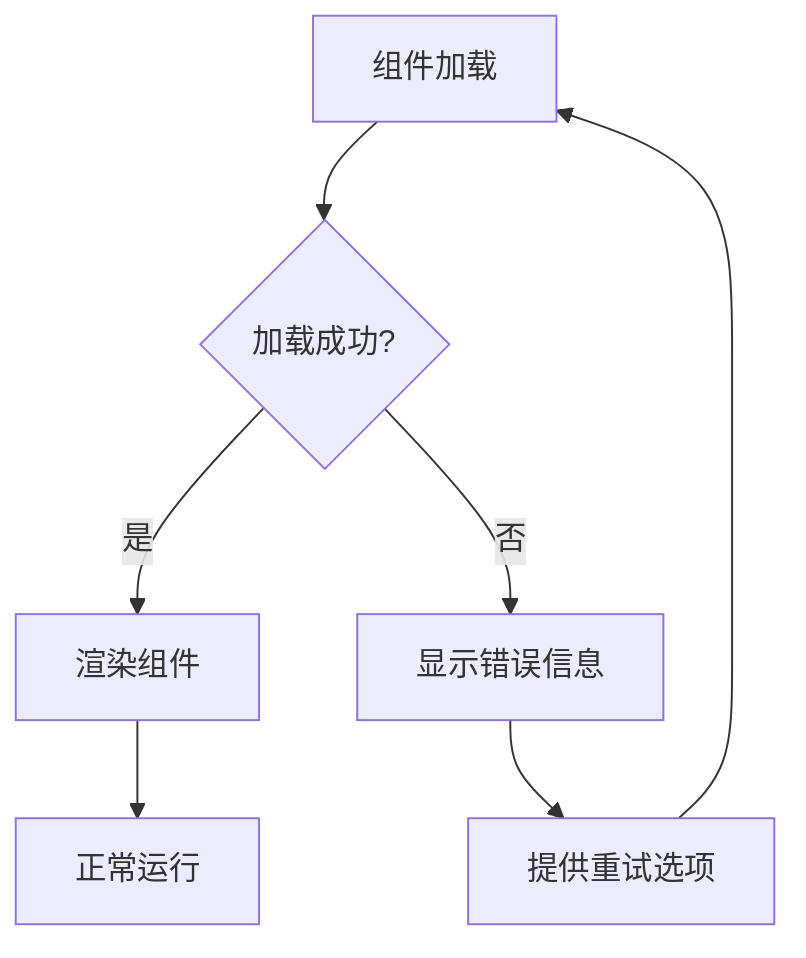
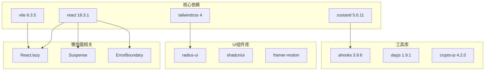

# 懒加载系统

<cite>
**本文档引用的文件**
- [README.md](file://README.md)
- [main.tsx](file://src/main.tsx)
- [App.tsx](file://src/app/App.tsx)
- [sync.ts](file://src/utils/sync.ts)
- [package.json](file://package.json)
- [SettingsModal.tsx](file://src/app/components/SettingsModal.tsx)
- [ClimateControlModal.tsx](file://src/app/components/ClimateControlModal.tsx)
- [RemoteControlModal.tsx](file://src/app/components/remote/RemoteControlModal.tsx)
- [LogHistoryModal.tsx](file://src/app/components/LogHistoryModal.tsx)
- [ApiLogModal.tsx](file://src/app/components/ApiLogModal.tsx)
</cite>

## 目录
1. [简介](#简介)
2. [项目结构](#项目结构)
3. [核心组件](#核心组件)
4. [架构概览](#架构概览)
5. [详细组件分析](#详细组件分析)
6. [依赖关系分析](#依赖关系分析)
7. [性能考虑](#性能考虑)
8. [故障排除指南](#故障排除指南)
9. [结论](#结论)

## 简介

HAUI Dashboard 是一个专为 Home Assistant 打造的高性能现代化前端控制面板，采用了先进的懒加载技术来优化应用启动性能和用户体验。该系统通过多种懒加载策略实现了快速启动、按需加载和资源优化。

根据项目文档，系统的核心架构包括：
- **前端框架**: React 18 + TypeScript
- **构建工具**: Vite 6.3.5
- **样式方案**: Tailwind CSS 4 + Framer Motion
- **性能优化**: 代码分割、防抖节流、乐观更新、Web Worker

## 项目结构

**图表来源**
- [main.tsx:88-122](file://src/main.tsx#L88-L122)
- [App.tsx:37-53](file://src/app/App.tsx#L37-L53)

**章节来源**
- [README.md:37-86](file://README.md#L37-L86)
- [package.json:1-132](file://package.json#L1-L132)

## 核心组件

### 应用启动懒加载

系统采用双重懒加载策略：

1. **配置懒加载**: 启动时异步加载存储配置，不阻塞主应用渲染
2. **组件懒加载**: 使用 React.lazy 实现重型组件的按需加载

**图表来源**
- [main.tsx:88-113](file://src/main.tsx#L88-L113)

### 重型组件懒加载

系统对以下重型组件采用懒加载策略：

| 组件名称 | 加载时机 | 占位符组件 |
|---------|---------|-----------|
| SettingsModal | 用户打开设置时 | ModalSkeleton |
| ClimateControlModal | 点击空调设备时 | 模态框占位符 |
| RemoteControlModal | 点击遥控器设备时 | 模态框占位符 |
| LogHistoryModal | 打开日志历史时 | 模态框占位符 |
| ApiLogModal | 打开API日志时 | 模态框占位符 |

**章节来源**
- [main.tsx:19-122](file://src/main.tsx#L19-L122)
- [App.tsx:37-53](file://src/app/App.tsx#L37-L53)

## 架构概览

**图表来源**
- [main.tsx:19-122](file://src/main.tsx#L19-L122)
- [sync.ts:49-93](file://src/utils/sync.ts#L49-L93)

## 详细组件分析

### 应用启动流程

应用启动采用渐进式加载策略，确保用户能够快速看到界面内容：

**图表来源**
- [main.tsx:88-113](file://src/main.tsx#L88-L113)

### 配置同步机制

系统实现了智能的配置同步机制，支持跨设备配置共享：

**图表来源**
- [sync.ts:19-41](file://src/utils/sync.ts#L19-L41)
- [sync.ts:98-131](file://src/utils/sync.ts#L98-L131)

### 组件懒加载实现

重型组件采用 React.lazy 和 Suspense 实现懒加载：

**图表来源**
- [App.tsx:37-42](file://src/app/App.tsx#L37-L42)

**章节来源**
- [App.tsx:37-53](file://src/app/App.tsx#L37-L53)
- [SettingsModal.tsx:1-200](file://src/app/components/SettingsModal.tsx#L1-L200)
- [ClimateControlModal.tsx:1-200](file://src/app/components/ClimateControlModal.tsx#L1-L200)
- [RemoteControlModal.tsx:1-200](file://src/app/components/remote/RemoteControlModal.tsx#L1-L200)

### 错误处理机制

系统实现了完善的错误处理和降级策略：

**图表来源**
- [main.tsx:99-105](file://src/main.tsx#L99-L105)

**章节来源**
- [main.tsx:99-105](file://src/main.tsx#L99-L105)

## 依赖关系分析

**图表来源**
- [package.json:13-96](file://package.json#L13-L96)

**章节来源**
- [package.json:13-96](file://package.json#L13-L96)

## 性能考虑

### 启动性能优化

1. **骨架屏渲染**: 提供即时视觉反馈，改善感知性能
2. **异步配置加载**: 不阻塞主应用渲染流程
3. **按需组件加载**: 减少初始包体积

### 运行时性能优化

1. **防抖节流**: 对频繁操作进行优化
2. **乐观更新**: 提升用户交互响应速度
3. **缓存策略**: 智能缓存配置和用户数据

### 资源管理

1. **内存优化**: 及时清理事件监听器和定时器
2. **网络优化**: 智能重试和超时处理
3. **存储优化**: 增量同步和版本控制

## 故障排除指南

### 常见问题及解决方案

| 问题类型 | 症状 | 解决方案 |
|---------|------|---------|
| 组件加载失败 | 模态框空白或错误信息 | 检查网络连接，重试加载 |
| 配置同步失败 | 跨设备配置不同步 | 检查 /api/storage 端点，验证认证 |
| 启动缓慢 | 应用启动时间过长 | 检查网络状况，清理浏览器缓存 |
| 懒加载失效 | 组件无法按需加载 | 检查动态导入语法，验证路由配置 |

### 调试技巧

1. **启用开发模式**: 获取详细的错误信息
2. **检查网络请求**: 确认 /api/storage 端点响应
3. **监控组件加载**: 使用浏览器开发者工具跟踪加载进度
4. **验证依赖版本**: 确保 React 和相关库版本兼容

**章节来源**
- [sync.ts:98-131](file://src/utils/sync.ts#L98-L131)
- [main.tsx:99-105](file://src/main.tsx#L99-L105)

## 结论

HAUI Dashboard 的懒加载系统通过多层次的优化策略，实现了优秀的性能表现和用户体验。系统不仅提供了快速的应用启动体验，还通过智能的资源管理和错误处理机制，确保了应用的稳定性和可靠性。

主要优势包括：
- **快速启动**: 骨架屏和异步加载确保用户快速获得界面反馈
- **资源优化**: 按需加载重型组件，减少初始包体积
- **智能同步**: 跨设备配置共享和增量同步机制
- **稳定性保障**: 完善的错误处理和降级策略

这套懒加载系统为现代 Web 应用的性能优化提供了优秀的实践范例，特别适合需要处理大量组件和复杂交互的大型应用场景。