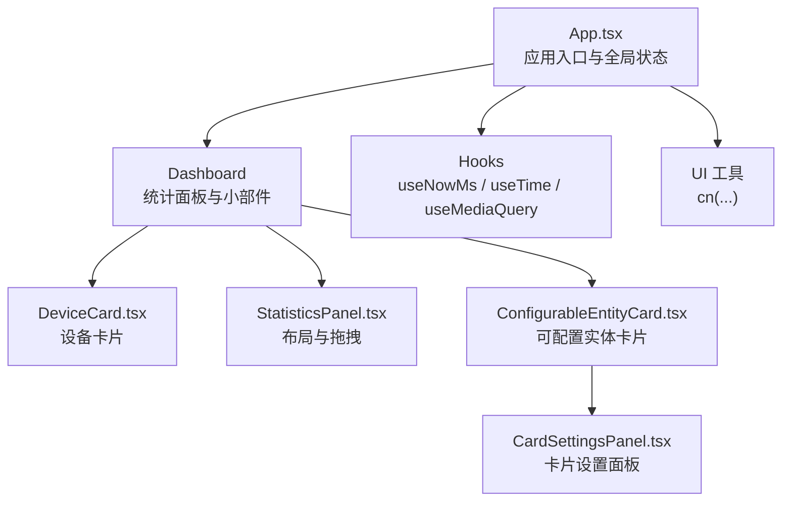
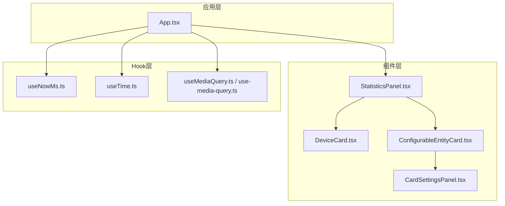
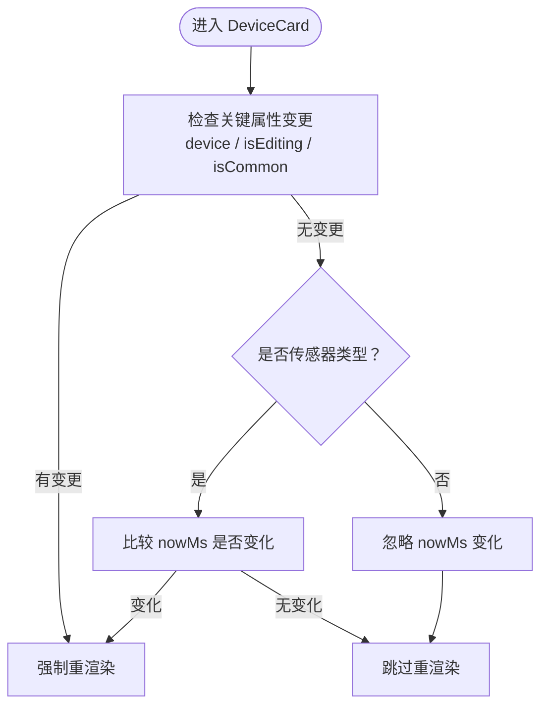
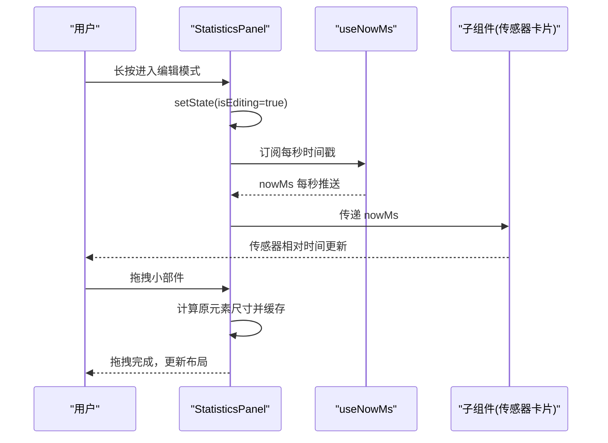
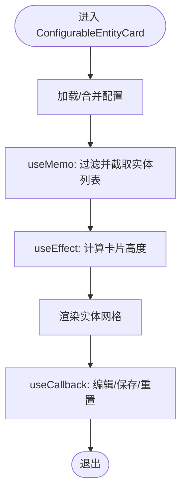
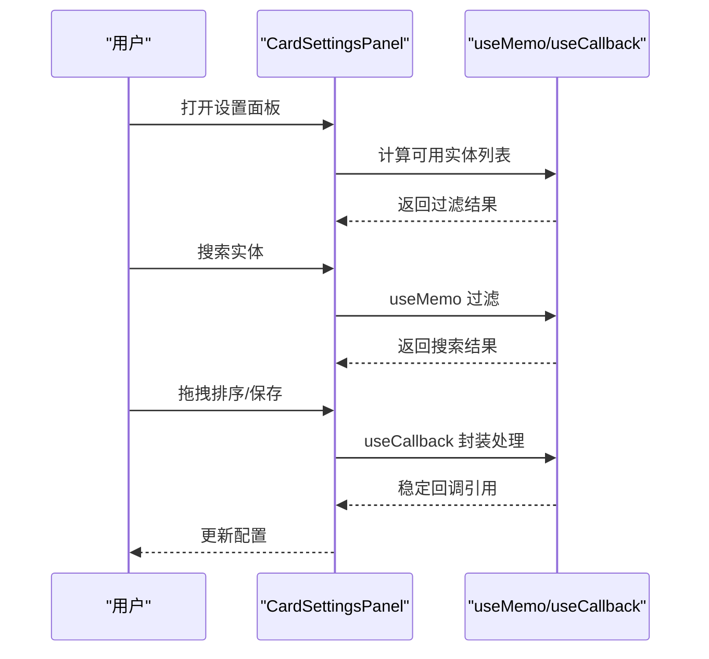
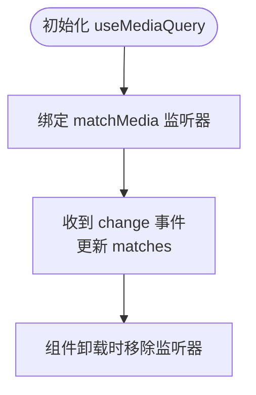
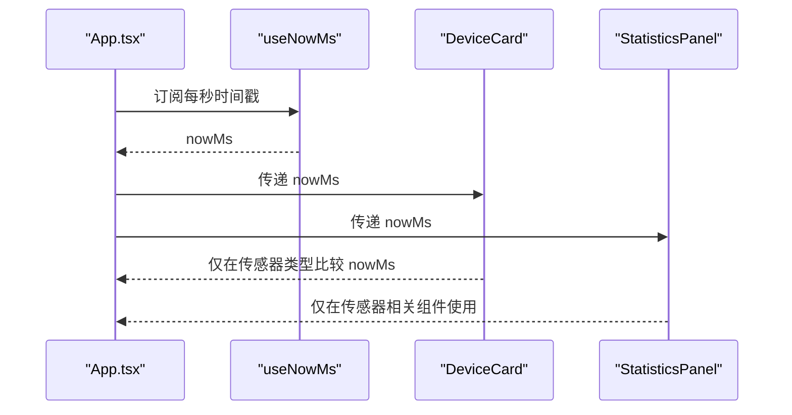
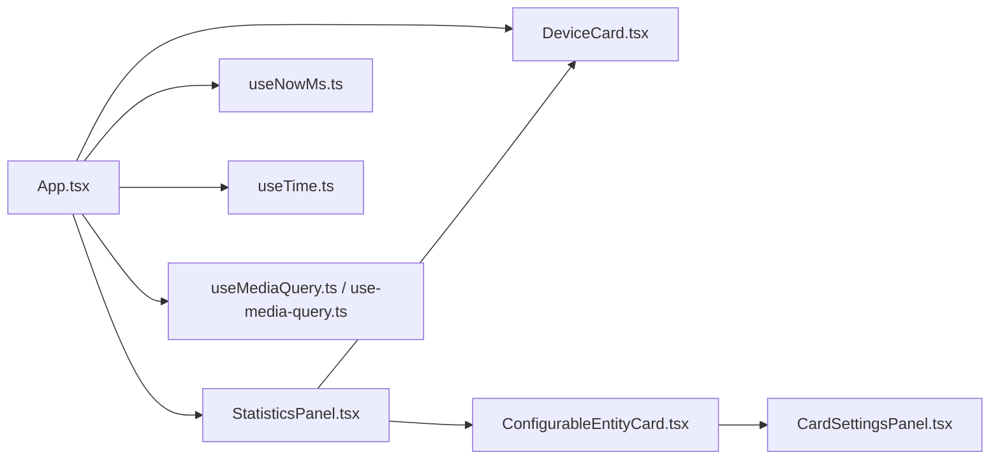

# 渲染性能优化

<cite>
**本文引用的文件**
- [src/app/App.tsx](file://src/app/App.tsx)
- [src/hooks/useMediaQuery.ts](file://src/hooks/useMediaQuery.ts)
- [src/hooks/use-media-query.ts](file://src/hooks/use-media-query.ts)
- [src/hooks/useNowMs.ts](file://src/hooks/useNowMs.ts)
- [src/hooks/useTime.ts](file://src/hooks/useTime.ts)
- [src/app/components/dashboard/DeviceCard.tsx](file://src/app/components/dashboard/DeviceCard.tsx)
- [src/app/components/dashboard/StatisticsPanel.tsx](file://src/app/components/dashboard/StatisticsPanel.tsx)
- [src/app/components/dashboard/cards/shared/ConfigurableEntityCard.tsx](file://src/app/components/dashboard/cards/shared/ConfigurableEntityCard.tsx)
- [src/app/components/dashboard/cards/shared/CardSettingsPanel.tsx](file://src/app/components/dashboard/cards/shared/CardSettingsPanel.tsx)
- [src/app/components/ui/utils.ts](file://src/app/components/ui/utils.ts)
</cite>

## 目录
1. [引言](#引言)
2. [项目结构](#项目结构)
3. [核心组件](#核心组件)
4. [架构总览](#架构总览)
5. [详细组件分析](#详细组件分析)
6. [依赖关系分析](#依赖关系分析)
7. [性能考量](#性能考量)
8. [故障排查指南](#故障排查指南)
9. [结论](#结论)
10. [附录](#附录)

## 引言
本文件面向HAUI项目的渲染性能优化，围绕React组件渲染优化策略展开，重点覆盖以下主题：
- 正确使用useMemo、useCallback以减少不必要重渲染
- 响应式Hook（如useMediaQuery）的性能优化原理与实践
- 时间相关Hook（useNowMs、useTime）如何避免高频重渲染
- 虚拟DOM优化、组件拆分与渲染优先级管理
- 渲染性能监控指标、Fiber调度机制理解与优化实践
- 结合仓库现有代码，给出可落地的优化建议与问题定位方法

## 项目结构
HAUI采用功能域驱动的目录组织，前端主入口位于src/app/App.tsx，核心业务组件分布在src/app/components下，通用Hook位于src/hooks，UI工具函数位于src/app/components/ui。

图表来源
- [src/app/App.tsx:1-120](file://src/app/App.tsx#L1-L120)
- [src/app/components/dashboard/DeviceCard.tsx:1-60](file://src/app/components/dashboard/DeviceCard.tsx#L1-L60)
- [src/app/components/dashboard/StatisticsPanel.tsx:1-80](file://src/app/components/dashboard/StatisticsPanel.tsx#L1-L80)
- [src/app/components/dashboard/cards/shared/ConfigurableEntityCard.tsx:1-60](file://src/app/components/dashboard/cards/shared/ConfigurableEntityCard.tsx#L1-L60)
- [src/app/components/dashboard/cards/shared/CardSettingsPanel.tsx:1-60](file://src/app/components/dashboard/cards/shared/CardSettingsPanel.tsx#L1-L60)
- [src/app/components/ui/utils.ts:1-7](file://src/app/components/ui/utils.ts#L1-L7)

章节来源
- [src/app/App.tsx:1-120](file://src/app/App.tsx#L1-L120)

## 核心组件
- App.tsx：负责全局状态、设备与用户数据同步、事件日志、天气坐标计算、Home Assistant连接与服务调用；通过useNowMs提供每秒时间戳，useTime提供本地时间格式化。
- DeviceCard.tsx：设备卡片主组件，使用React.memo进行浅比较优化，并针对传感器类型按需比较nowMs，避免非必要重渲染。
- StatisticsPanel.tsx：仪表盘网格布局，集成拖拽排序与长按编辑，通过useNowMs驱动传感器时间显示。
- ConfigurableEntityCard.tsx：可配置实体卡片，大量使用useMemo、useCallback、useEffect，确保实体列表与高度计算稳定。
- CardSettingsPanel.tsx：卡片设置面板，使用useMemo过滤可用实体，useCallback封装异步加载与保存流程。
- Hooks：useNowMs、useTime、useMediaQuery提供时间与媒体查询响应能力，避免频繁重渲染。

章节来源
- [src/app/App.tsx:138-216](file://src/app/App.tsx#L138-L216)
- [src/app/components/dashboard/DeviceCard.tsx:267-293](file://src/app/components/dashboard/DeviceCard.tsx#L267-L293)
- [src/app/components/dashboard/StatisticsPanel.tsx:71-146](file://src/app/components/dashboard/StatisticsPanel.tsx#L71-L146)
- [src/app/components/dashboard/cards/shared/ConfigurableEntityCard.tsx:54-137](file://src/app/components/dashboard/cards/shared/ConfigurableEntityCard.tsx#L54-L137)
- [src/app/components/dashboard/cards/shared/CardSettingsPanel.tsx:86-155](file://src/app/components/dashboard/cards/shared/CardSettingsPanel.tsx#L86-L155)
- [src/hooks/useNowMs.ts:1-15](file://src/hooks/useNowMs.ts#L1-L15)
- [src/hooks/useTime.ts:1-37](file://src/hooks/useTime.ts#L1-L37)
- [src/hooks/useMediaQuery.ts:1-19](file://src/hooks/useMediaQuery.ts#L1-L19)
- [src/hooks/use-media-query.ts:1-35](file://src/hooks/use-media-query.ts#L1-L35)

## 架构总览
下图展示应用层、组件层与Hook层的交互关系，以及渲染路径中的关键优化点。

图表来源
- [src/app/App.tsx:138-216](file://src/app/App.tsx#L138-L216)
- [src/app/components/dashboard/DeviceCard.tsx:267-293](file://src/app/components/dashboard/DeviceCard.tsx#L267-L293)
- [src/app/components/dashboard/StatisticsPanel.tsx:71-146](file://src/app/components/dashboard/StatisticsPanel.tsx#L71-L146)
- [src/app/components/dashboard/cards/shared/ConfigurableEntityCard.tsx:54-137](file://src/app/components/dashboard/cards/shared/ConfigurableEntityCard.tsx#L54-L137)
- [src/app/components/dashboard/cards/shared/CardSettingsPanel.tsx:86-155](file://src/app/components/dashboard/cards/shared/CardSettingsPanel.tsx#L86-L155)
- [src/hooks/useNowMs.ts:1-15](file://src/hooks/useNowMs.ts#L1-L15)
- [src/hooks/useTime.ts:1-37](file://src/hooks/useTime.ts#L1-L37)
- [src/hooks/useMediaQuery.ts:1-19](file://src/hooks/useMediaQuery.ts#L1-L19)
- [src/hooks/use-media-query.ts:1-35](file://src/hooks/use-media-query.ts#L1-L35)

## 详细组件分析

### 设备卡片渲染优化（DeviceCard）
- 使用React.memo进行浅比较，仅在device、isEditing、isCommon变化时重渲染；对传感器类型额外比较nowMs，避免非必要重渲染。
- 传感器卡片依赖相对时间显示，因此对nowMs敏感；其他设备忽略nowMs变化，降低1Hz重渲染频率。
- 该策略有效隔离时间相关子树，提升整体滚动与布局稳定性。

图表来源
- [src/app/components/dashboard/DeviceCard.tsx:267-293](file://src/app/components/dashboard/DeviceCard.tsx#L267-L293)

章节来源
- [src/app/components/dashboard/DeviceCard.tsx:267-293](file://src/app/components/dashboard/DeviceCard.tsx#L267-L293)

### 统计面板与拖拽（StatisticsPanel）
- 通过useNowMs提供每秒时间戳，驱动传感器时间显示，避免在非传感器组件上产生不必要的重渲染。
- 使用@dnd-kit实现拖拽排序，结合getBoundingClientRect精确测量原元素尺寸，减少拖拽过程中的布局抖动。
- 编辑模式通过长按触发，避免误触导致的频繁状态切换。

图表来源
- [src/app/components/dashboard/StatisticsPanel.tsx:102-135](file://src/app/components/dashboard/StatisticsPanel.tsx#L102-L135)
- [src/hooks/useNowMs.ts:1-15](file://src/hooks/useNowMs.ts#L1-L15)

章节来源
- [src/app/components/dashboard/StatisticsPanel.tsx:71-146](file://src/app/components/dashboard/StatisticsPanel.tsx#L71-L146)
- [src/app/components/dashboard/StatisticsPanel.tsx:102-135](file://src/app/components/dashboard/StatisticsPanel.tsx#L102-L135)

### 可配置实体卡片（ConfigurableEntityCard）
- 大量使用useMemo：
  - entitiesToShow：基于当前配置过滤并限制数量，避免每次渲染重新计算。
  - 根据实体数量动态计算卡片高度，减少布局重排。
- 使用useCallback：
  - 标题编辑、图标更换、设置面板保存等回调均稳定引用，降低子组件重渲染概率。
- 使用useEffect：
  - 配置持久化与默认配置同步，避免重复IO与无效更新。

图表来源
- [src/app/components/dashboard/cards/shared/ConfigurableEntityCard.tsx:54-137](file://src/app/components/dashboard/cards/shared/ConfigurableEntityCard.tsx#L54-L137)

章节来源
- [src/app/components/dashboard/cards/shared/ConfigurableEntityCard.tsx:54-137](file://src/app/components/dashboard/cards/shared/ConfigurableEntityCard.tsx#L54-L137)

### 卡片设置面板（CardSettingsPanel）
- 使用useMemo过滤可用实体，避免每次输入都全量计算。
- 使用useCallback封装异步加载与保存流程，保证回调引用稳定。
- 使用useSensor与DndContext实现拖拽排序，优化交互体验。

图表来源
- [src/app/components/dashboard/cards/shared/CardSettingsPanel.tsx:86-155](file://src/app/components/dashboard/cards/shared/CardSettingsPanel.tsx#L86-L155)

章节来源
- [src/app/components/dashboard/cards/shared/CardSettingsPanel.tsx:86-155](file://src/app/components/dashboard/cards/shared/CardSettingsPanel.tsx#L86-L155)

### 响应式Hook（useMediaQuery）性能分析
- 仓库提供两个版本的useMediaQuery：
  - 简化版：直接使用window.matchMedia监听change事件，适合简单场景。
  - 兼容版：兼容浏览器差异，支持服务端渲染环境判断，更稳健。
- 性能要点：
  - 仅在query变化时重建监听器，避免重复绑定。
  - 在卸载时移除监听器，防止内存泄漏。
  - 对于频繁变更的断点，建议在上层组件做节流或防抖，避免多次重渲染。

图表来源
- [src/hooks/useMediaQuery.ts:1-19](file://src/hooks/useMediaQuery.ts#L1-L19)
- [src/hooks/use-media-query.ts:1-35](file://src/hooks/use-media-query.ts#L1-L35)

章节来源
- [src/hooks/useMediaQuery.ts:1-19](file://src/hooks/useMediaQuery.ts#L1-L19)
- [src/hooks/use-media-query.ts:1-35](file://src/hooks/use-media-query.ts#L1-L35)

### 时间相关Hook（useNowMs、useTime）优化
- useNowMs：每秒定时器，返回毫秒级时间戳，用于驱动传感器相对时间显示。
- useTime：每秒定时器，返回Date对象与格式化后的字符串，适合静态展示。
- 优化建议：
  - 在不需要毫秒级精度的场景，优先使用useTime减少对象更新频率。
  - 对于大量组件共享时间戳，建议在上层App集中订阅并向下传递，避免多处定时器造成资源浪费。
  - 对于只关心整秒变化的组件，可考虑使用useEffect+setInterval替代，减少闭包与依赖追踪成本。

图表来源
- [src/app/App.tsx:138-216](file://src/app/App.tsx#L138-L216)
- [src/hooks/useNowMs.ts:1-15](file://src/hooks/useNowMs.ts#L1-L15)
- [src/hooks/useTime.ts:1-37](file://src/hooks/useTime.ts#L1-L37)
- [src/app/components/dashboard/DeviceCard.tsx:267-293](file://src/app/components/dashboard/DeviceCard.tsx#L267-L293)
- [src/app/components/dashboard/StatisticsPanel.tsx:71-146](file://src/app/components/dashboard/StatisticsPanel.tsx#L71-L146)

章节来源
- [src/app/App.tsx:138-216](file://src/app/App.tsx#L138-L216)
- [src/hooks/useNowMs.ts:1-15](file://src/hooks/useNowMs.ts#L1-L15)
- [src/hooks/useTime.ts:1-37](file://src/hooks/useTime.ts#L1-L37)
- [src/app/components/dashboard/DeviceCard.tsx:267-293](file://src/app/components/dashboard/DeviceCard.tsx#L267-L293)
- [src/app/components/dashboard/StatisticsPanel.tsx:71-146](file://src/app/components/dashboard/StatisticsPanel.tsx#L71-L146)

## 依赖关系分析
- 组件间依赖：
  - App.tsx是根节点，向下传递nowMs、设备与用户数据、事件日志等。
  - StatisticsPanel依赖DeviceCard与ConfigurableEntityCard等子组件。
  - ConfigurableEntityCard内部再依赖CardSettingsPanel。
- Hook依赖：
  - useNowMs与useTime由App.tsx消费，向下传递给需要时间的组件。
  - useMediaQuery在不同场景下被引入，注意避免重复实例化。

图表来源
- [src/app/App.tsx:138-216](file://src/app/App.tsx#L138-L216)
- [src/app/components/dashboard/StatisticsPanel.tsx:71-146](file://src/app/components/dashboard/StatisticsPanel.tsx#L71-L146)
- [src/app/components/dashboard/DeviceCard.tsx:267-293](file://src/app/components/dashboard/DeviceCard.tsx#L267-L293)
- [src/app/components/dashboard/cards/shared/ConfigurableEntityCard.tsx:54-137](file://src/app/components/dashboard/cards/shared/ConfigurableEntityCard.tsx#L54-L137)
- [src/app/components/dashboard/cards/shared/CardSettingsPanel.tsx:86-155](file://src/app/components/dashboard/cards/shared/CardSettingsPanel.tsx#L86-L155)
- [src/hooks/useNowMs.ts:1-15](file://src/hooks/useNowMs.ts#L1-L15)
- [src/hooks/useTime.ts:1-37](file://src/hooks/useTime.ts#L1-L37)
- [src/hooks/useMediaQuery.ts:1-19](file://src/hooks/useMediaQuery.ts#L1-L19)
- [src/hooks/use-media-query.ts:1-35](file://src/hooks/use-media-query.ts#L1-L35)

章节来源
- [src/app/App.tsx:138-216](file://src/app/App.tsx#L138-L216)
- [src/app/components/dashboard/StatisticsPanel.tsx:71-146](file://src/app/components/dashboard/StatisticsPanel.tsx#L71-L146)
- [src/app/components/dashboard/DeviceCard.tsx:267-293](file://src/app/components/dashboard/DeviceCard.tsx#L267-L293)
- [src/app/components/dashboard/cards/shared/ConfigurableEntityCard.tsx:54-137](file://src/app/components/dashboard/cards/shared/ConfigurableEntityCard.tsx#L54-L137)
- [src/app/components/dashboard/cards/shared/CardSettingsPanel.tsx:86-155](file://src/app/components/dashboard/cards/shared/CardSettingsPanel.tsx#L86-L155)
- [src/hooks/useNowMs.ts:1-15](file://src/hooks/useNowMs.ts#L1-L15)
- [src/hooks/useTime.ts:1-37](file://src/hooks/useTime.ts#L1-L37)
- [src/hooks/useMediaQuery.ts:1-19](file://src/hooks/useMediaQuery.ts#L1-L19)
- [src/hooks/use-media-query.ts:1-35](file://src/hooks/use-media-query.ts#L1-L35)

## 性能考量
- 虚拟DOM优化
  - 使用React.memo对DeviceCard进行浅比较，针对传感器类型按需比较nowMs，避免非必要重渲染。
  - 在上层集中订阅时间源（App.tsx），向下传递nowMs，减少多处定时器实例化。
- 组件拆分与渲染优先级
  - 将时间敏感组件（传感器卡片）与非时间组件分离，降低时间更新对整体布局的影响。
  - 使用拖拽前精确测量原元素尺寸，减少拖拽过程中的布局抖动。
- Hook使用最佳实践
  - useNowMs与useTime：仅在需要的组件中使用，避免全局广播。
  - useMediaQuery：在query稳定时复用同一实例，避免频繁重建监听器。
  - useMemo：对昂贵计算与数组切片进行缓存；useCallback：稳定回调引用，降低子组件重渲染。
- Fiber调度与批处理
  - 将高频更新（如每秒时间戳）与低频更新（如布局、设置）解耦，利用React批处理减少重渲染次数。
  - 对于长列表与复杂布局，优先考虑分页、懒加载与虚拟化策略（若后续扩展）。

## 故障排查指南
- 症状：页面滚动卡顿、传感器时间频繁闪烁
  - 排查要点：
    - 检查DeviceCard的memo比较条件是否合理，确认传感器类型分支是否正确比较nowMs。
    - 确认StatisticsPanel是否在所有子组件上都传递了nowMs，避免部分组件未更新。
  - 参考路径
    - [src/app/components/dashboard/DeviceCard.tsx:267-293](file://src/app/components/dashboard/DeviceCard.tsx#L267-L293)
    - [src/app/components/dashboard/StatisticsPanel.tsx:71-146](file://src/app/components/dashboard/StatisticsPanel.tsx#L71-L146)
- 症状：设置面板搜索/排序卡顿
  - 排查要点：
    - 确认CardSettingsPanel的过滤逻辑是否使用useMemo缓存。
    - 检查useCallback封装的加载与保存流程是否稳定。
  - 参考路径
    - [src/app/components/dashboard/cards/shared/CardSettingsPanel.tsx:86-155](file://src/app/components/dashboard/cards/shared/CardSettingsPanel.tsx#L86-L155)
- 症状：媒体查询切换断点时界面抖动
  - 排查要点：
    - 确认useMediaQuery的query参数是否稳定，避免频繁变更。
    - 在上层组件对断点变化做节流或防抖处理。
  - 参考路径
    - [src/hooks/useMediaQuery.ts:1-19](file://src/hooks/useMediaQuery.ts#L1-L19)
    - [src/hooks/use-media-query.ts:1-35](file://src/hooks/use-media-query.ts#L1-L35)

章节来源
- [src/app/components/dashboard/DeviceCard.tsx:267-293](file://src/app/components/dashboard/DeviceCard.tsx#L267-L293)
- [src/app/components/dashboard/StatisticsPanel.tsx:71-146](file://src/app/components/dashboard/StatisticsPanel.tsx#L71-L146)
- [src/app/components/dashboard/cards/shared/CardSettingsPanel.tsx:86-155](file://src/app/components/dashboard/cards/shared/CardSettingsPanel.tsx#L86-L155)
- [src/hooks/useMediaQuery.ts:1-19](file://src/hooks/useMediaQuery.ts#L1-L19)
- [src/hooks/use-media-query.ts:1-35](file://src/hooks/use-media-query.ts#L1-L35)

## 结论
HAUI在渲染性能方面已具备良好的基础：通过React.memo、useMemo、useCallback等手段控制重渲染范围；通过集中订阅时间源减少重复定时器；通过拖拽前精确测量尺寸降低布局抖动。进一步优化建议包括：
- 在App层集中管理时间源，避免多处定时器；
- 对媒体查询断点做节流/防抖；
- 对长列表与复杂布局考虑虚拟化与懒加载；
- 建立渲染性能监控指标（如FPS、重渲染次数、布局时间）并持续回归。

## 附录
- 渲染性能监控指标建议
  - FPS：使用requestAnimationFrame记录帧间隔，计算平均FPS。
  - 重渲染次数：统计组件重渲染次数与触发原因（props变化、state变化、hook变化）。
  - 布局时间：测量关键布局操作耗时（如滚动、拖拽、窗口大小变化）。
  - 首屏与交互延迟：记录首屏渲染完成时间与首次可交互时间。
- Fiber调度机制理解
  - React在一次渲染中会进行“提交阶段”（commit）与“渲染阶段”（render）。优化目标是在渲染阶段尽量减少不可中断的工作，将高优先级任务（如用户输入）优先执行。
  - 通过拆分组件、使用memo与callback、减少深层依赖，有助于缩短渲染时间并提升交互流畅度。