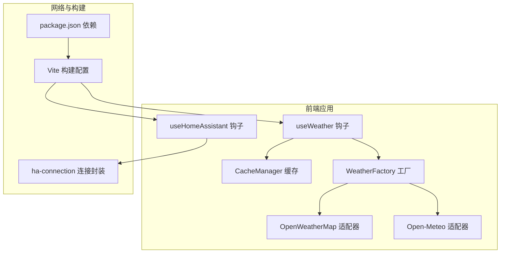
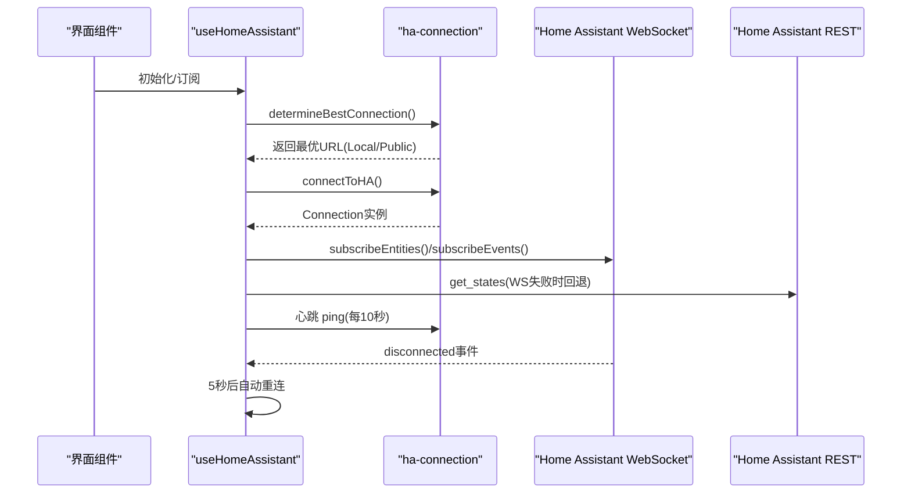
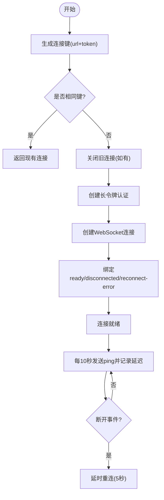
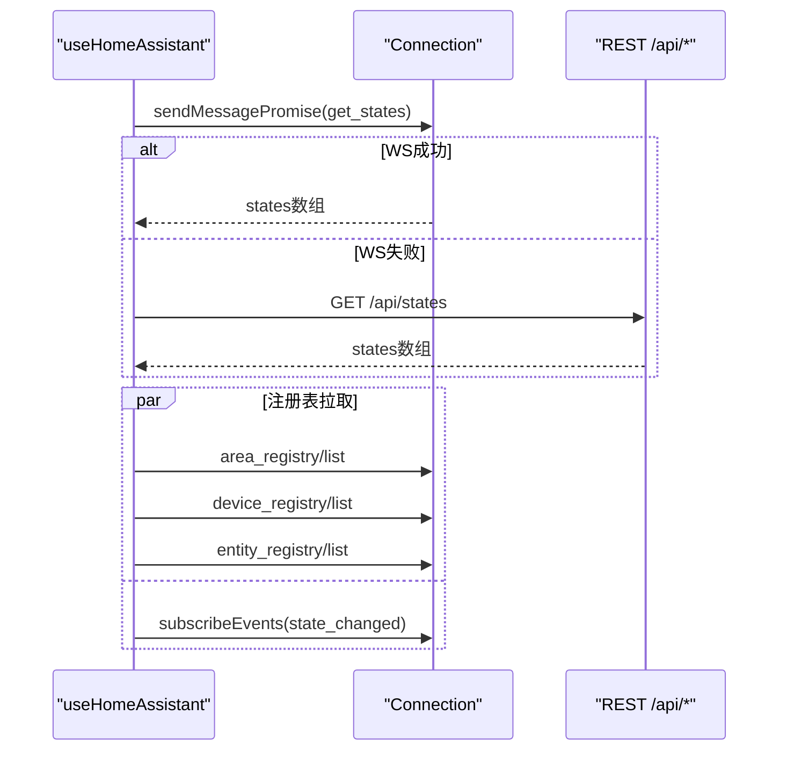
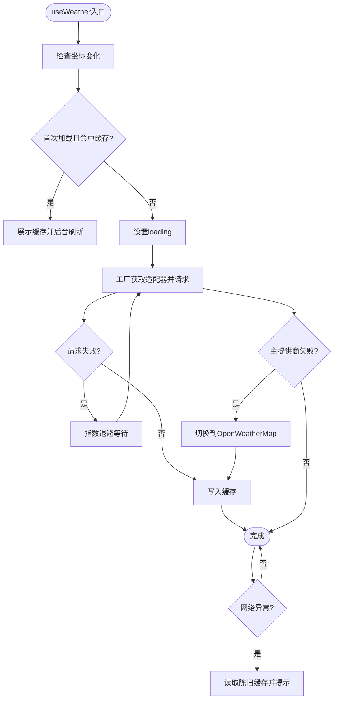
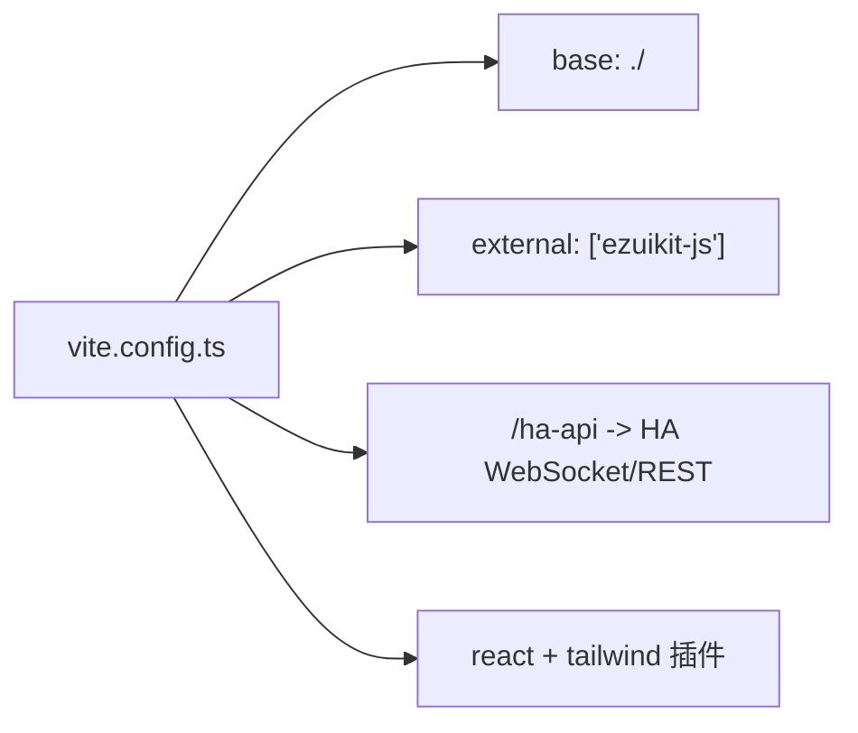
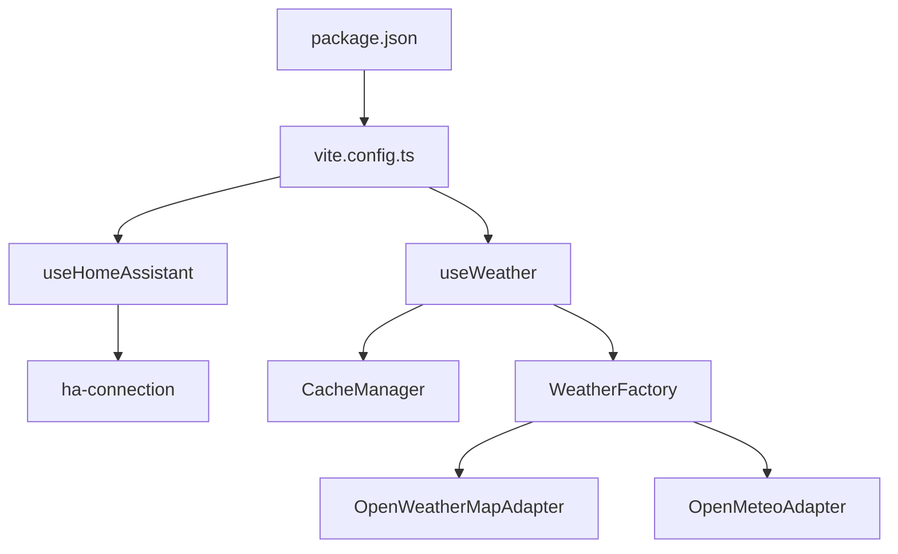

# 网络性能优化

<cite>
**本文引用的文件**
- [src/utils/ha-connection.ts](file://src/utils/ha-connection.ts)
- [src/hooks/useHomeAssistant.ts](file://src/hooks/useHomeAssistant.ts)
- [src/hooks/useWeather.ts](file://src/hooks/useWeather.ts)
- [src/services/weather/weather-factory.ts](file://src/services/weather/weather-factory.ts)
- [src/services/weather/adapters/open-meteo.ts](file://src/services/weather/adapters/open-meteo.ts)
- [src/services/weather/adapters/open-weather-map.ts](file://src/services/weather/adapters/open-weather-map.ts)
- [src/services/weather/types.ts](file://src/services/weather/types.ts)
- [src/utils/cache-manager.ts](file://src/utils/cache-manager.ts)
- [src/config/feature-flags.ts](file://src/config/feature-flags.ts)
- [vite.config.ts](file://vite.config.ts)
- [package.json](file://package.json)
</cite>

## 目录
1. [简介](#简介)
2. [项目结构](#项目结构)
3. [核心组件](#核心组件)
4. [架构总览](#架构总览)
5. [详细组件分析](#详细组件分析)
6. [依赖关系分析](#依赖关系分析)
7. [性能考量](#性能考量)
8. [故障排查指南](#故障排查指南)
9. [结论](#结论)
10. [附录](#附录)

## 简介
本文件聚焦于HAUI项目的网络性能优化，围绕以下目标展开：
- WebSocket连接优化：连接池与复用、断线重连策略、心跳检测与延迟评估
- Home Assistant API调用优化：请求合并、缓存策略、超时与降级处理
- 天气数据API优化：请求去重、数据预取、CDN与HTTPS回退
- 静态资源优化：Vite构建、代码分割与懒加载
- 网络监控与带宽优化：指标采集、代理与跨域处理

## 项目结构
本项目采用前端单页应用架构，核心网络层由WebSocket连接封装、天气服务适配器与缓存管理组成；构建阶段通过Vite进行优化与代理配置。

图表来源
- [src/hooks/useHomeAssistant.ts:1-313](file://src/hooks/useHomeAssistant.ts#L1-L313)
- [src/utils/ha-connection.ts:1-317](file://src/utils/ha-connection.ts#L1-L317)
- [src/hooks/useWeather.ts:1-128](file://src/hooks/useWeather.ts#L1-L128)
- [src/utils/cache-manager.ts:1-57](file://src/utils/cache-manager.ts#L1-L57)
- [src/services/weather/weather-factory.ts:1-21](file://src/services/weather/weather-factory.ts#L1-L21)
- [src/services/weather/adapters/open-weather-map.ts:1-46](file://src/services/weather/adapters/open-weather-map.ts#L1-L46)
- [src/services/weather/adapters/open-meteo.ts:1-115](file://src/services/weather/adapters/open-meteo.ts#L1-L115)
- [vite.config.ts:1-53](file://vite.config.ts#L1-L53)
- [package.json:1-132](file://package.json#L1-L132)

章节来源
- [vite.config.ts:1-53](file://vite.config.ts#L1-L53)
- [package.json:1-132](file://package.json#L1-L132)

## 核心组件
- WebSocket连接与可用性检测：统一的连接封装、最佳URL选择、断线重连与事件监听
- Home Assistant钩子：实体订阅、事件流、注册表批量拉取、REST回退
- 天气服务：工厂模式切换提供商、指数退避重试、本地缓存与离线回退
- 缓存管理：基于localStorage的TTL缓存、过期与“陈旧即用”读取
- 构建与代理：相对路径基础、外部依赖排除、开发代理与WebSocket支持

章节来源
- [src/utils/ha-connection.ts:1-317](file://src/utils/ha-connection.ts#L1-L317)
- [src/hooks/useHomeAssistant.ts:1-313](file://src/hooks/useHomeAssistant.ts#L1-L313)
- [src/hooks/useWeather.ts:1-128](file://src/hooks/useWeather.ts#L1-L128)
- [src/utils/cache-manager.ts:1-57](file://src/utils/cache-manager.ts#L1-L57)
- [src/services/weather/weather-factory.ts:1-21](file://src/services/weather/weather-factory.ts#L1-L21)

## 架构总览
下图展示从页面到后端的关键网络路径与优化点：

图表来源
- [src/hooks/useHomeAssistant.ts:61-210](file://src/hooks/useHomeAssistant.ts#L61-L210)
- [src/utils/ha-connection.ts:47-105](file://src/utils/ha-connection.ts#L47-L105)
- [src/utils/ha-connection.ts:193-238](file://src/utils/ha-connection.ts#L193-L238)
- [src/utils/ha-connection.ts:37-59](file://src/utils/ha-connection.ts#L37-L59)

## 详细组件分析

### WebSocket连接优化
- 连接复用与键控：对同一URL+Token组合进行缓存，避免重复创建连接
- 最佳URL选择：并行探测本地与公网URL，优先返回可达实例
- 断线重连：监听断开事件，延迟重连；心跳检测评估延迟
- 可用性验证：HTTP短超时探测+WebSocket回退，规避CORS限制

图表来源
- [src/utils/ha-connection.ts:47-105](file://src/utils/ha-connection.ts#L47-L105)
- [src/utils/ha-connection.ts:193-238](file://src/utils/ha-connection.ts#L193-L238)
- [src/hooks/useHomeAssistant.ts:37-59](file://src/hooks/useHomeAssistant.ts#L37-L59)
- [src/hooks/useHomeAssistant.ts:140-148](file://src/hooks/useHomeAssistant.ts#L140-L148)

章节来源
- [src/utils/ha-connection.ts:47-105](file://src/utils/ha-connection.ts#L47-L105)
- [src/utils/ha-connection.ts:193-238](file://src/utils/ha-connection.ts#L193-L238)
- [src/hooks/useHomeAssistant.ts:37-59](file://src/hooks/useHomeAssistant.ts#L37-L59)
- [src/hooks/useHomeAssistant.ts:140-148](file://src/hooks/useHomeAssistant.ts#L140-L148)

### Home Assistant API调用优化
- 注册表批量拉取：并发获取区域、设备、实体注册信息，减少往返
- REST回退策略：WebSocket失败时自动回退至REST接口
- 并发状态刷新：防抖/去重的刷新请求，避免重复网络调用
- 跨域与代理：开发环境通过代理转发/升级WebSocket，生产环境可结合反向代理

图表来源
- [src/hooks/useHomeAssistant.ts:166-180](file://src/hooks/useHomeAssistant.ts#L166-L180)
- [src/hooks/useHomeAssistant.ts:267-293](file://src/hooks/useHomeAssistant.ts#L267-L293)
- [src/utils/ha-connection.ts:176-187](file://src/utils/ha-connection.ts#L176-L187)

章节来源
- [src/hooks/useHomeAssistant.ts:166-180](file://src/hooks/useHomeAssistant.ts#L166-L180)
- [src/hooks/useHomeAssistant.ts:267-293](file://src/hooks/useHomeAssistant.ts#L267-L293)
- [src/utils/ha-connection.ts:176-187](file://src/utils/ha-connection.ts#L176-L187)

### 天气数据API优化
- 提供商切换：通过工厂模式在Open-Meteo与OpenWeatherMap之间切换
- 指数退避重试：最多三次，间隔1s、2s，提升弱网鲁棒性
- 缓存与离线回退：命中缓存立即显示，后台刷新；失败时使用陈旧缓存
- HTTPS回退：在HTTP环境下自动回退到HTTP以兼容内网环境

图表来源
- [src/hooks/useWeather.ts:32-113](file://src/hooks/useWeather.ts#L32-L113)
- [src/utils/cache-manager.ts:9-43](file://src/utils/cache-manager.ts#L9-L43)
- [src/services/weather/weather-factory.ts:10-20](file://src/services/weather/weather-factory.ts#L10-L20)
- [src/services/weather/adapters/open-meteo.ts:4-15](file://src/services/weather/adapters/open-meteo.ts#L4-L15)

章节来源
- [src/hooks/useWeather.ts:32-113](file://src/hooks/useWeather.ts#L32-L113)
- [src/utils/cache-manager.ts:9-43](file://src/utils/cache-manager.ts#L9-L43)
- [src/services/weather/weather-factory.ts:10-20](file://src/services/weather/weather-factory.ts#L10-L20)
- [src/services/weather/adapters/open-meteo.ts:4-15](file://src/services/weather/adapters/open-meteo.ts#L4-L15)

### 静态资源优化
- 相对路径基础：构建输出使用相对路径，便于部署在子路径场景
- 外部依赖排除：将大体积SDK作为外部依赖，按需CDN引入，减小bundle体积
- 开发代理：支持WebSocket代理，便于本地联调
- 依赖与插件：React、Tailwind等插件集成，保证构建稳定性

图表来源
- [vite.config.ts:6-51](file://vite.config.ts#L6-L51)

章节来源
- [vite.config.ts:6-51](file://vite.config.ts#L6-L51)
- [package.json:13-96](file://package.json#L13-L96)

## 依赖关系分析
- 组件耦合
  - useHomeAssistant依赖ha-connection进行连接与订阅
  - useWeather依赖CacheManager与WeatherFactory/Adapter链路
- 外部依赖
  - home-assistant-js-websocket用于WebSocket通信
  - 通过Vite代理与外部SDK实现跨域与CDN加速

图表来源
- [src/hooks/useHomeAssistant.ts:1-14](file://src/hooks/useHomeAssistant.ts#L1-L14)
- [src/utils/ha-connection.ts:1-10](file://src/utils/ha-connection.ts#L1-L10)
- [src/hooks/useWeather.ts:1-7](file://src/hooks/useWeather.ts#L1-L7)
- [src/utils/cache-manager.ts:1-57](file://src/utils/cache-manager.ts#L1-L57)
- [src/services/weather/weather-factory.ts:1-21](file://src/services/weather/weather-factory.ts#L1-L21)
- [src/services/weather/adapters/open-weather-map.ts:1-46](file://src/services/weather/adapters/open-weather-map.ts#L1-L46)
- [src/services/weather/adapters/open-meteo.ts:1-115](file://src/services/weather/adapters/open-meteo.ts#L1-L115)
- [vite.config.ts:1-53](file://vite.config.ts#L1-L53)
- [package.json:1-132](file://package.json#L1-L132)

章节来源
- [src/hooks/useHomeAssistant.ts:1-14](file://src/hooks/useHomeAssistant.ts#L1-L14)
- [src/utils/ha-connection.ts:1-10](file://src/utils/ha-connection.ts#L1-L10)
- [src/hooks/useWeather.ts:1-7](file://src/hooks/useWeather.ts#L1-L7)
- [src/utils/cache-manager.ts:1-57](file://src/utils/cache-manager.ts#L1-L57)
- [src/services/weather/weather-factory.ts:1-21](file://src/services/weather/weather-factory.ts#L1-L21)
- [src/services/weather/adapters/open-weather-map.ts:1-46](file://src/services/weather/adapters/open-weather-map.ts#L1-L46)
- [src/services/weather/adapters/open-meteo.ts:1-115](file://src/services/weather/adapters/open-meteo.ts#L1-L115)
- [vite.config.ts:1-53](file://vite.config.ts#L1-L53)
- [package.json:1-132](file://package.json#L1-L132)

## 性能考量
- 连接层面
  - 使用连接键复用，避免频繁握手
  - 心跳检测与延迟上报，辅助网络质量评估
  - 断线重连延迟与事件监听，提升稳定性
- 数据层面
  - 缓存TTL与陈旧即用策略，降低重复请求
  - 指数退避与主备提供商切换，增强弱网韧性
- 构建与传输
  - 相对路径与外部依赖排除，减小包体
  - 开发代理支持WebSocket，简化调试
- 建议
  - 对高频REST接口增加请求合并与节流
  - 在CDN前置与反向代理上启用HTTP/2与压缩
  - 对图片与媒体资源采用懒加载与格式优化

## 故障排查指南
- 连接问题
  - 检查URL与Token配置，确认最佳URL选择逻辑
  - 观察断线事件与重连日志，定位网络波动
- 天气数据
  - 查看指数退避与主备切换日志
  - 确认缓存写入与陈旧缓存读取
- 构建与代理
  - 确认Vite代理规则与WebSocket支持
  - 检查外部依赖是否通过CDN正确加载

章节来源
- [src/utils/ha-connection.ts:193-238](file://src/utils/ha-connection.ts#L193-L238)
- [src/hooks/useHomeAssistant.ts:140-148](file://src/hooks/useHomeAssistant.ts#L140-L148)
- [src/hooks/useWeather.ts:58-91](file://src/hooks/useWeather.ts#L58-L91)
- [vite.config.ts:32-44](file://vite.config.ts#L32-L44)

## 结论
本项目在网络性能方面已具备完善的连接复用、断线重连、心跳检测与缓存策略。建议在后续迭代中进一步引入请求合并、CDN与反向代理优化，并完善监控指标采集，以获得更稳健的用户体验。

## 附录
- 关键实现参考
  - [WebSocket连接封装:47-105](file://src/utils/ha-connection.ts#L47-L105)
  - [最佳URL选择:193-238](file://src/utils/ha-connection.ts#L193-L238)
  - [心跳与延迟评估:37-59](file://src/hooks/useHomeAssistant.ts#L37-L59)
  - [注册表批量拉取:166-180](file://src/hooks/useHomeAssistant.ts#L166-L180)
  - [REST回退策略:267-293](file://src/hooks/useHomeAssistant.ts#L267-L293)
  - [天气缓存与重试:32-113](file://src/hooks/useWeather.ts#L32-L113)
  - [Open-Meteo适配器HTTPS回退:4-15](file://src/services/weather/adapters/open-meteo.ts#L4-L15)
  - [Vite构建与代理:6-51](file://vite.config.ts#L6-L51)