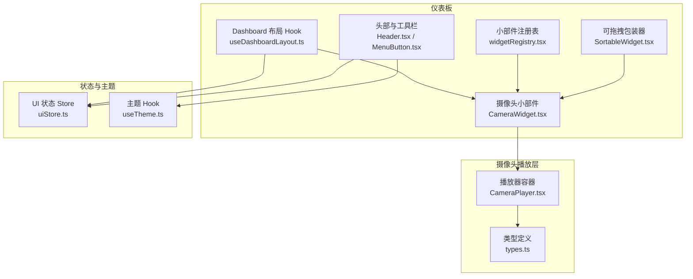
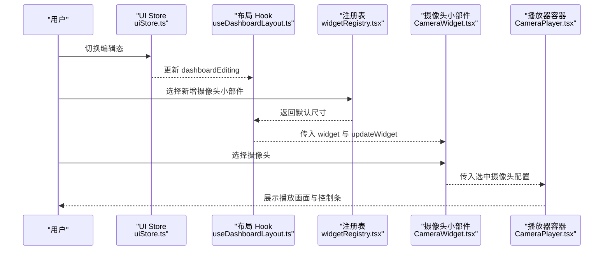
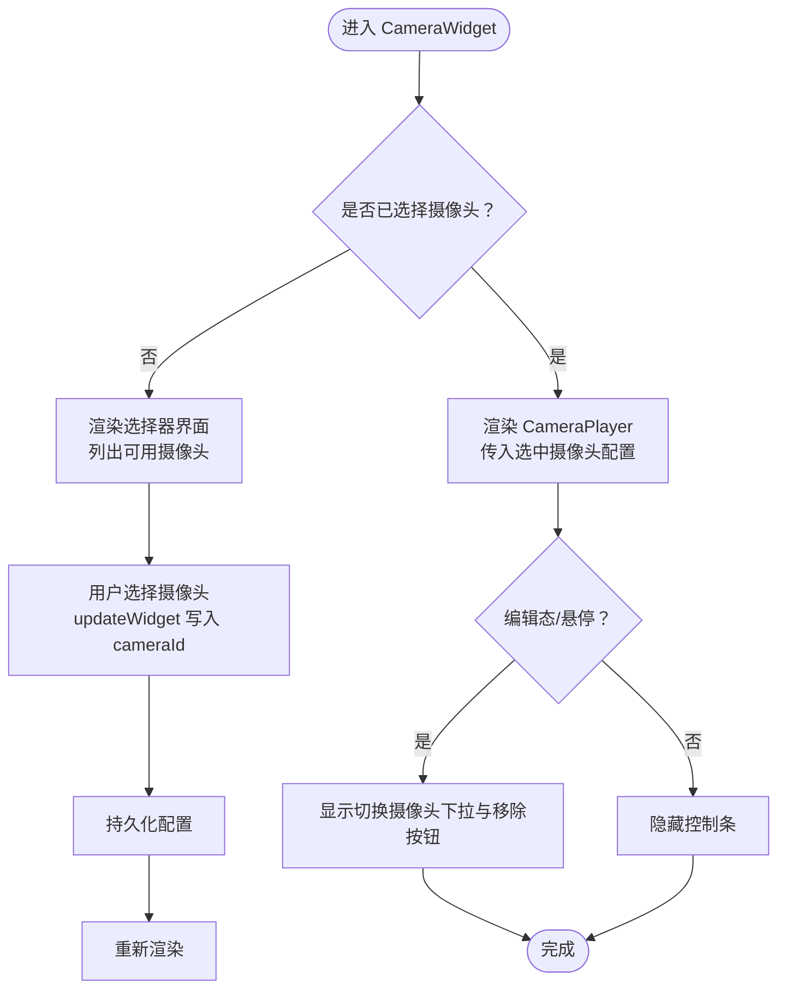
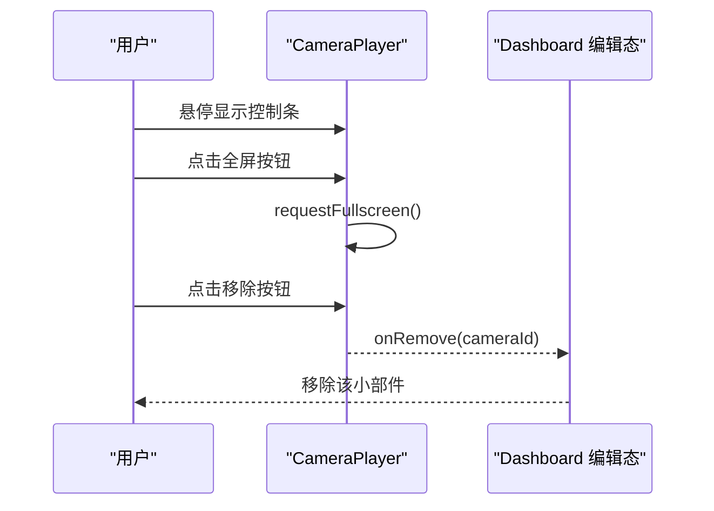
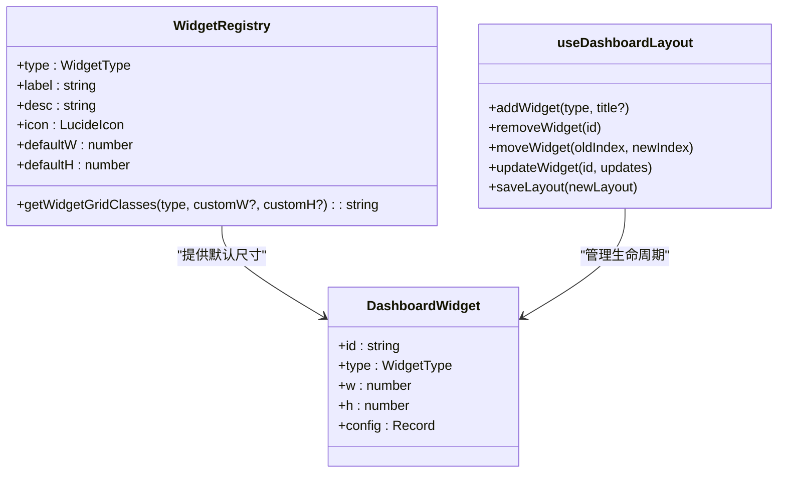
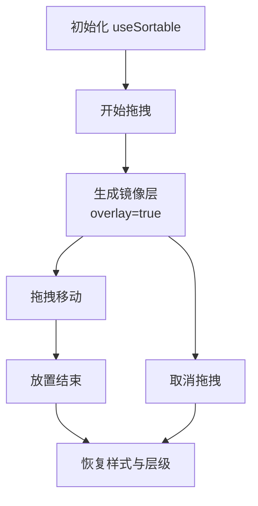
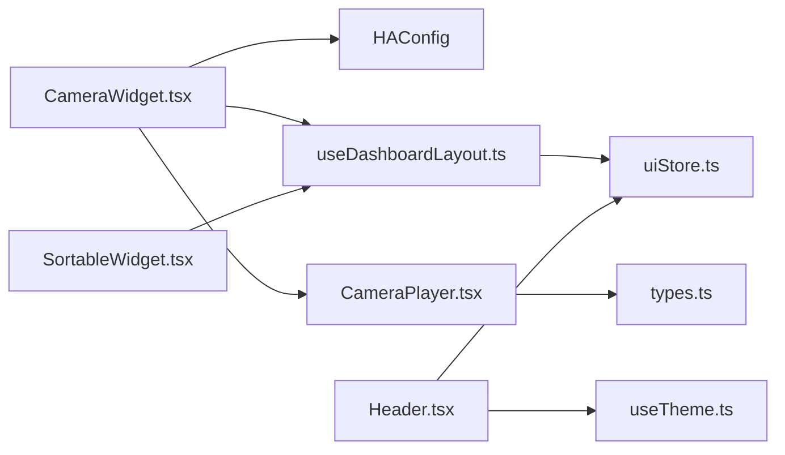

# 仪表板集成

<cite>
**本文引用的文件**
- [CameraWidget.tsx](file://src/app/components/dashboard/widgets/CameraWidget.tsx)
- [widgetRegistry.tsx](file://src/app/components/dashboard/widgetRegistry.tsx)
- [SortableWidget.tsx](file://src/app/components/dashboard/SortableWidget.tsx)
- [useDashboardLayout.ts](file://src/hooks/useDashboardLayout.ts)
- [CameraPlayer.tsx](file://src/components/camera/CameraPlayer.tsx)
- [types.ts](file://src/components/camera/types.ts)
- [uiStore.ts](file://src/store/uiStore.ts)
- [useTheme.ts](file://src/hooks/useTheme.ts)
- [Header.tsx](file://src/app/components/dashboard/Header.tsx)
- [MenuButton.tsx](file://src/app/components/dashboard/MenuButton.tsx)
- [ConfigurableEntityCard.tsx](file://src/app/components/dashboard/cards/shared/ConfigurableEntityCard.tsx)
- [CardSettingsPanel.tsx](file://src/app/components/dashboard/cards/shared/CardSettingsPanel.tsx)
</cite>

## 目录
1. [简介](#简介)
2. [项目结构](#项目结构)
3. [核心组件](#核心组件)
4. [架构总览](#架构总览)
5. [详细组件分析](#详细组件分析)
6. [依赖关系分析](#依赖关系分析)
7. [性能考量](#性能考量)
8. [故障排查指南](#故障排查指南)
9. [结论](#结论)
10. [附录](#附录)

## 简介
本文件面向“仪表板集成”场景，围绕摄像头小部件（CameraWidget）的设计架构展开，系统性阐述组件封装、布局管理与响应式设计；深入分析可拖拽排序功能的实现（事件处理、位置计算与状态持久化）；阐明小部件注册机制与动态加载策略；并分析仪表板整体布局系统（网格、尺寸调整与主题适配）。最后给出摄像头小部件与其他组件的集成模式与最佳实践。

## 项目结构
本项目采用前端单页应用架构，仪表板相关代码集中在 src/app/components/dashboard 下，摄像头播放器位于 src/components/camera。布局与状态管理通过自研 Hook 与 Store 实现，主题与 UI 交互通过独立 Hook 与组件承载。

图表来源
- [useDashboardLayout.ts:1-125](file://src/hooks/useDashboardLayout.ts#L1-L125)
- [widgetRegistry.tsx:1-105](file://src/app/components/dashboard/widgetRegistry.tsx#L1-L105)
- [SortableWidget.tsx:1-77](file://src/app/components/dashboard/SortableWidget.tsx#L1-L77)
- [CameraWidget.tsx:1-96](file://src/app/components/dashboard/widgets/CameraWidget.tsx#L1-L96)
- [CameraPlayer.tsx:1-88](file://src/components/camera/CameraPlayer.tsx#L1-L88)
- [types.ts:1-22](file://src/components/camera/types.ts#L1-L22)
- [uiStore.ts:1-55](file://src/store/uiStore.ts#L1-L55)
- [useTheme.ts:1-26](file://src/hooks/useTheme.ts#L1-L26)
- [Header.tsx:1-157](file://src/app/components/dashboard/Header.tsx#L1-L157)
- [MenuButton.tsx:1-18](file://src/app/components/dashboard/MenuButton.tsx#L1-L18)

章节来源
- [useDashboardLayout.ts:1-125](file://src/hooks/useDashboardLayout.ts#L1-L125)
- [widgetRegistry.tsx:1-105](file://src/app/components/dashboard/widgetRegistry.tsx#L1-L105)
- [CameraWidget.tsx:1-96](file://src/app/components/dashboard/widgets/CameraWidget.tsx#L1-L96)
- [CameraPlayer.tsx:1-88](file://src/components/camera/CameraPlayer.tsx#L1-L88)
- [types.ts:1-22](file://src/components/camera/types.ts#L1-L22)
- [uiStore.ts:1-55](file://src/store/uiStore.ts#L1-L55)
- [useTheme.ts:1-26](file://src/hooks/useTheme.ts#L1-L26)
- [Header.tsx:1-157](file://src/app/components/dashboard/Header.tsx#L1-L157)
- [MenuButton.tsx:1-18](file://src/app/components/dashboard/MenuButton.tsx#L1-L18)

## 核心组件
- 摄像头小部件（CameraWidget）：负责渲染摄像头选择与播放区域，提供配置入口与编辑态交互。
- 播放器容器（CameraPlayer）：封装播放器控制条、全屏与移除逻辑，按类型路由到不同播放实现。
- 小部件注册表（widgetRegistry）：定义小部件元信息与默认网格尺寸，提供网格类名生成。
- 可拖拽包装器（SortableWidget）：基于 dnd-kit 提供拖拽句柄、遮罩与视觉反馈。
- 布局 Hook（useDashboardLayout）：管理仪表板布局、持久化与云端同步。
- UI 状态 Store（uiStore）：集中管理编辑态、模态框等 UI 状态。
- 主题 Hook（useTheme）：主题切换与持久化。
- 头部与菜单（Header/MenuButton）：提供时间、天气、连接状态与全屏切换等控制。

章节来源
- [CameraWidget.tsx:1-96](file://src/app/components/dashboard/widgets/CameraWidget.tsx#L1-L96)
- [CameraPlayer.tsx:1-88](file://src/components/camera/CameraPlayer.tsx#L1-L88)
- [widgetRegistry.tsx:1-105](file://src/app/components/dashboard/widgetRegistry.tsx#L1-L105)
- [SortableWidget.tsx:1-77](file://src/app/components/dashboard/SortableWidget.tsx#L1-L77)
- [useDashboardLayout.ts:1-125](file://src/hooks/useDashboardLayout.ts#L1-L125)
- [uiStore.ts:1-55](file://src/store/uiStore.ts#L1-L55)
- [useTheme.ts:1-26](file://src/hooks/useTheme.ts#L1-L26)
- [Header.tsx:1-157](file://src/app/components/dashboard/Header.tsx#L1-L157)
- [MenuButton.tsx:1-18](file://src/app/components/dashboard/MenuButton.tsx#L1-L18)

## 架构总览
仪表板采用“布局 Hook + 注册表 + 可拖拽包装器”的组合，实现小部件的声明式注册、默认尺寸与拖拽排序；摄像头小部件通过 HA 配置注入摄像头列表，选择后交由播放器容器渲染；编辑态由 UI Store 控制，主题通过 Hook 统一管理。

图表来源
- [uiStore.ts:1-55](file://src/store/uiStore.ts#L1-L55)
- [useDashboardLayout.ts:1-125](file://src/hooks/useDashboardLayout.ts#L1-L125)
- [widgetRegistry.tsx:1-105](file://src/app/components/dashboard/widgetRegistry.tsx#L1-L105)
- [CameraWidget.tsx:1-96](file://src/app/components/dashboard/widgets/CameraWidget.tsx#L1-L96)
- [CameraPlayer.tsx:1-88](file://src/components/camera/CameraPlayer.tsx#L1-L88)

## 详细组件分析

### 摄像头小部件（CameraWidget）
- 组件职责
  - 从 HA 配置中读取可用摄像头列表，根据 widget.config.cameraId 选择当前摄像头。
  - 未配置时渲染“选择摄像头”界面；已配置时渲染 CameraPlayer。
  - 编辑态下提供悬浮设置按钮，内部为下拉选择器，便于切换摄像头。
- 组件封装
  - 接收 widget、updateWidget、isEditing、haConfig 四个属性，解耦布局与业务数据。
  - 使用 useMemo 缓存选中摄像头，避免不必要的重渲染。
- 响应式设计
  - 容器使用圆角边框与阴影，背景色遵循主题卡片变量，确保深浅色一致体验。
  - 编辑态与悬停态通过 opacity/transition 控制控制条显隐与动画。
- 与播放器集成
  - CameraPlayer 作为子组件，接收选中摄像头配置与移除回调，统一由 Dashboard 编辑态控制移除行为。

图表来源
- [CameraWidget.tsx:16-95](file://src/app/components/dashboard/widgets/CameraWidget.tsx#L16-L95)

章节来源
- [CameraWidget.tsx:1-96](file://src/app/components/dashboard/widgets/CameraWidget.tsx#L1-L96)

### 播放器容器（CameraPlayer）
- 控制条与交互
  - 顶部渐变蒙板在悬停时显示，包含拖拽手柄（drag-handle）、全屏与移除按钮。
  - 全屏通过标准 DOM API 对父容器请求全屏，兼容多浏览器前缀。
- 播放实现
  - 根据摄像头类型（ezviz/ha-hls）路由到不同播放器组件。
  - 缺失必要参数时展示错误提示，避免白屏。
- 与 Dashboard 集成
  - 通过 onRemove 回调通知上层移除逻辑，配合 SortableWidget 的删除按钮形成闭环。

图表来源
- [CameraPlayer.tsx:12-87](file://src/components/camera/CameraPlayer.tsx#L12-L87)

章节来源
- [CameraPlayer.tsx:1-88](file://src/components/camera/CameraPlayer.tsx#L1-L88)
- [types.ts:10-22](file://src/components/camera/types.ts#L10-L22)

### 小部件注册机制与动态加载
- 注册表（widgetRegistry）
  - 定义各小部件的元信息（类型、标签、描述、图标、默认列跨度与行跨度）。
  - 提供 getWidgetGridClasses，将默认尺寸映射为 Tailwind 类名，支持响应式断点。
- 动态加载（useDashboardLayout）
  - 初始化时尝试从服务端同步布局，随后从本地加载；若无则回退默认布局。
  - 提供 addWidget/removeWidget/moveWidget/updateWidget/saveLayout 等能力，统一持久化与云端同步。
  - 通过 WIDGET_REGISTRY 推导新小部件的默认尺寸，保证一致性。

图表来源
- [widgetRegistry.tsx:7-104](file://src/app/components/dashboard/widgetRegistry.tsx#L7-L104)
- [useDashboardLayout.ts:7-124](file://src/hooks/useDashboardLayout.ts#L7-L124)

章节来源
- [widgetRegistry.tsx:1-105](file://src/app/components/dashboard/widgetRegistry.tsx#L1-L105)
- [useDashboardLayout.ts:1-125](file://src/hooks/useDashboardLayout.ts#L1-L125)

### 可拖拽排序实现（SortableWidget）
- 事件与状态
  - 使用 @dnd-kit 的 useSortable，暴露 attributes/listeners 作为拖拽句柄，transform/transition 控制拖拽动画。
  - isDragging 控制原始节点透明度与指针事件，overlay 模式用于镜像层。
- 删除与反馈
  - 编辑态下显示删除按钮，点击触发 onRemove；拖拽手柄使用 drag-handle 类名，避免与播放器内部交互冲突。
  - 通过动画类名与延迟，增强拖拽反馈与层级控制。

图表来源
- [SortableWidget.tsx:16-76](file://src/app/components/dashboard/SortableWidget.tsx#L16-L76)

章节来源
- [SortableWidget.tsx:1-77](file://src/app/components/dashboard/SortableWidget.tsx#L1-L77)

### 布局系统、尺寸调整与主题适配
- 布局系统
  - useDashboardLayout 负责布局持久化与云端同步；uiStore 提供编辑态开关。
  - Header/MenuButton 提供全屏与刷新等控制，Header 也负责主题指示与连接状态展示。
- 尺寸调整
  - widgetRegistry 将默认尺寸映射为网格类名，支持响应式断点；ConfigurableEntityCard 展示了根据内容动态计算高度的思路，可借鉴到其他组件。
- 主题适配
  - useTheme 读取系统偏好或用户选择，持久化到 localStorage 并应用到根元素；Header 与各组件使用语义化颜色变量，确保深浅色一致。

章节来源
- [useDashboardLayout.ts:1-125](file://src/hooks/useDashboardLayout.ts#L1-L125)
- [uiStore.ts:1-55](file://src/store/uiStore.ts#L1-L55)
- [Header.tsx:1-157](file://src/app/components/dashboard/Header.tsx#L1-L157)
- [MenuButton.tsx:1-18](file://src/app/components/dashboard/MenuButton.tsx#L1-L18)
- [useTheme.ts:1-26](file://src/hooks/useTheme.ts#L1-L26)
- [ConfigurableEntityCard.tsx:120-137](file://src/app/components/dashboard/cards/shared/ConfigurableEntityCard.tsx#L120-L137)

### 摄像头小部件与其他组件的集成模式与最佳实践
- 与 ConfigurableEntityCard 的对比
  - ConfigurableEntityCard 展示了“配置持久化 + 动态高度 + 设置面板”的通用模式，可借鉴其配置读取/保存、实体列表与图标选择器等做法。
- 与 Header/MenuButton 的协作
  - Header 提供全屏与刷新入口，MenuButton 提供统一的交互风格；建议摄像头小部件在编辑态下复用类似风格的控制按钮。
- 最佳实践
  - 小部件尽量通过 props 注入数据（如 HAConfig），减少内部状态耦合。
  - 控制条与交互元素使用语义化类名（如 drag-handle），避免与播放器内部交互冲突。
  - 编辑态与非编辑态的视觉差异要清晰，保证用户感知。

章节来源
- [ConfigurableEntityCard.tsx:1-310](file://src/app/components/dashboard/cards/shared/ConfigurableEntityCard.tsx#L1-L310)
- [Header.tsx:1-157](file://src/app/components/dashboard/Header.tsx#L1-L157)
- [MenuButton.tsx:1-18](file://src/app/components/dashboard/MenuButton.tsx#L1-L18)

## 依赖关系分析
- 组件耦合
  - CameraWidget 依赖 HAConfig 与 useDashboardLayout 的 updateWidget；CameraPlayer 依赖 types 中的 CameraConfig。
  - SortableWidget 与 useDashboardLayout 解耦，仅依赖 widget.id 与 isEditing/isOverlay。
- 外部依赖
  - dnd-kit 提供拖拽能力；localStorage 用于布局持久化；主题与 UI Store 提供跨组件状态共享。

图表来源
- [CameraWidget.tsx:1-96](file://src/app/components/dashboard/widgets/CameraWidget.tsx#L1-L96)
- [CameraPlayer.tsx:1-88](file://src/components/camera/CameraPlayer.tsx#L1-L88)
- [types.ts:10-22](file://src/components/camera/types.ts#L10-L22)
- [SortableWidget.tsx:1-77](file://src/app/components/dashboard/SortableWidget.tsx#L1-L77)
- [useDashboardLayout.ts:1-125](file://src/hooks/useDashboardLayout.ts#L1-L125)
- [uiStore.ts:1-55](file://src/store/uiStore.ts#L1-L55)
- [Header.tsx:1-157](file://src/app/components/dashboard/Header.tsx#L1-L157)
- [useTheme.ts:1-26](file://src/hooks/useTheme.ts#L1-L26)

章节来源
- [CameraWidget.tsx:1-96](file://src/app/components/dashboard/widgets/CameraWidget.tsx#L1-L96)
- [CameraPlayer.tsx:1-88](file://src/components/camera/CameraPlayer.tsx#L1-L88)
- [types.ts:1-22](file://src/components/camera/types.ts#L1-L22)
- [SortableWidget.tsx:1-77](file://src/app/components/dashboard/SortableWidget.tsx#L1-L77)
- [useDashboardLayout.ts:1-125](file://src/hooks/useDashboardLayout.ts#L1-L125)
- [uiStore.ts:1-55](file://src/store/uiStore.ts#L1-L55)
- [Header.tsx:1-157](file://src/app/components/dashboard/Header.tsx#L1-L157)
- [useTheme.ts:1-26](file://src/hooks/useTheme.ts#L1-L26)

## 性能考量
- 渲染优化
  - CameraWidget 使用 useMemo 缓存选中摄像头，避免重复查找。
  - SortableWidget 在拖拽时降低原始节点透明度与层级，减少视觉闪烁。
- 网络与资源
  - 播放器按类型选择实现，避免不必要的资源加载；缺失参数时提前提示，减少无效渲染。
- 存储与同步
  - 布局持久化使用 localStorage，云端同步在更新后触发，避免覆盖。

## 故障排查指南
- 摄像头无法播放
  - 检查 CameraPlayer 是否存在 url/accessToken 等必要参数；确认摄像头类型与播放器实现匹配。
- 拖拽无效或误触
  - 确保控制条中的拖拽手柄使用 drag-handle 类名；避免与播放器内部交互元素重叠。
- 布局不生效或丢失
  - 检查 useDashboardLayout 的持久化逻辑与云端同步事件；确认 localStorage 中的布局数据格式正确。
- 编辑态不可用
  - 确认 uiStore.dashboardEditing 状态与 Header/菜单按钮联动正常。

章节来源
- [CameraPlayer.tsx:67-84](file://src/components/camera/CameraPlayer.tsx#L67-L84)
- [SortableWidget.tsx:47-69](file://src/app/components/dashboard/SortableWidget.tsx#L47-L69)
- [useDashboardLayout.ts:31-74](file://src/hooks/useDashboardLayout.ts#L31-L74)
- [uiStore.ts:31-54](file://src/store/uiStore.ts#L31-L54)

## 结论
本方案通过“注册表 + 布局 Hook + 可拖拽包装器”的组合，实现了摄像头小部件的模块化与可扩展性；结合播放器容器与编辑态控制，提供了良好的用户体验。建议在后续迭代中进一步抽象配置面板与实体选择流程，提升跨组件的一致性与可维护性。

## 附录
- 术语
  - 小部件：仪表板中的独立功能块（如天气、摄像头、日志等）。
  - 注册表：集中定义小部件元信息与默认尺寸的数据结构。
  - 拖拽句柄：用于限定拖拽触发区域的 DOM 标记，避免误触。
- 参考路径
  - 摄像头小部件：[CameraWidget.tsx:1-96](file://src/app/components/dashboard/widgets/CameraWidget.tsx#L1-L96)
  - 播放器容器：[CameraPlayer.tsx:1-88](file://src/components/camera/CameraPlayer.tsx#L1-L88)
  - 注册表与网格类名：[widgetRegistry.tsx:1-105](file://src/app/components/dashboard/widgetRegistry.tsx#L1-L105)
  - 拖拽包装器：[SortableWidget.tsx:1-77](file://src/app/components/dashboard/SortableWidget.tsx#L1-L77)
  - 布局与持久化：[useDashboardLayout.ts:1-125](file://src/hooks/useDashboardLayout.ts#L1-L125)
  - UI 状态与主题：[uiStore.ts:1-55](file://src/store/uiStore.ts#L1-L55)、[useTheme.ts:1-26](file://src/hooks/useTheme.ts#L1-L26)
  - 头部与菜单：[Header.tsx:1-157](file://src/app/components/dashboard/Header.tsx#L1-L157)、[MenuButton.tsx:1-18](file://src/app/components/dashboard/MenuButton.tsx#L1-L18)
  - 配置卡片与设置面板（参考模式）：[ConfigurableEntityCard.tsx:1-310](file://src/app/components/dashboard/cards/shared/ConfigurableEntityCard.tsx#L1-L310)、[CardSettingsPanel.tsx:1-374](file://src/app/components/dashboard/cards/shared/CardSettingsPanel.tsx#L1-L374)