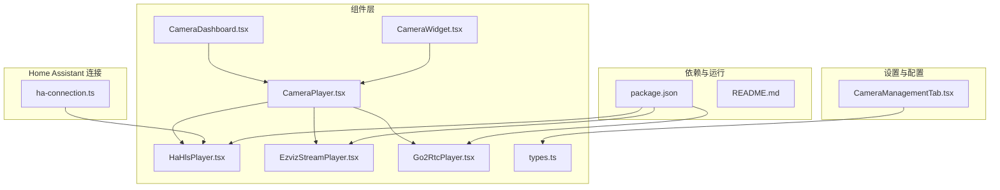
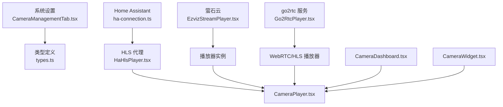
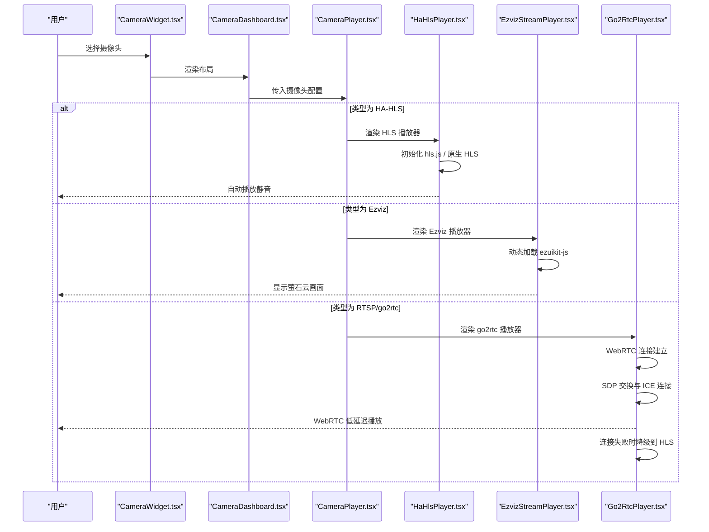
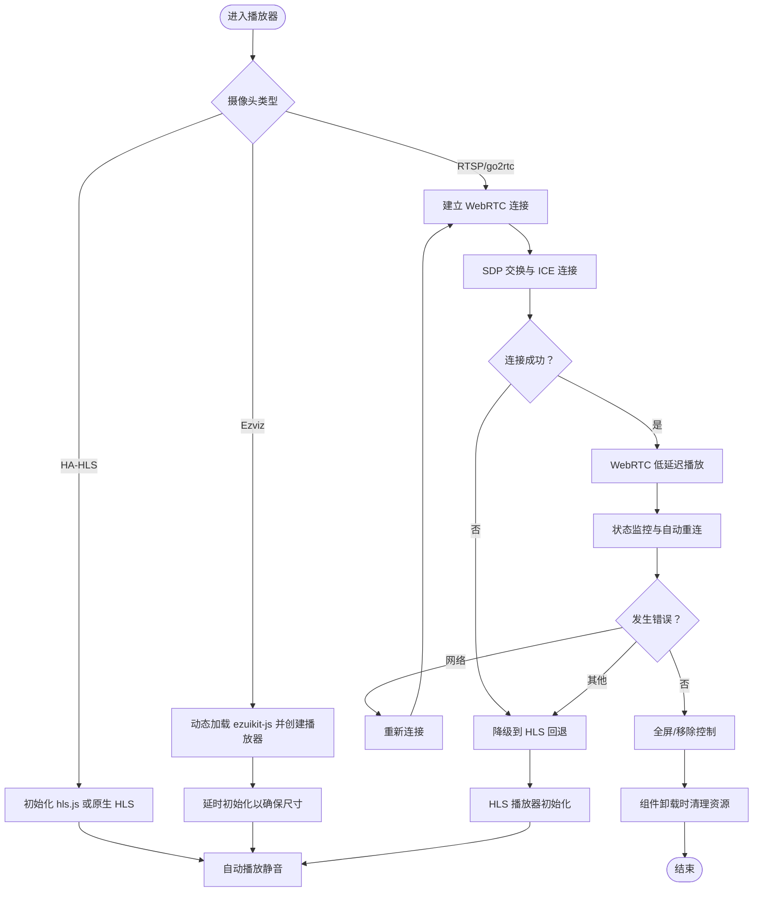
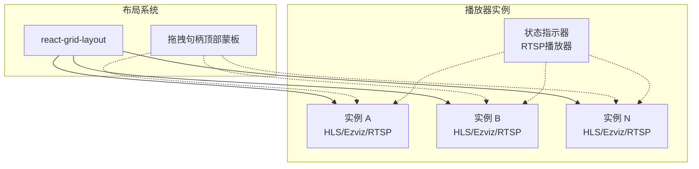
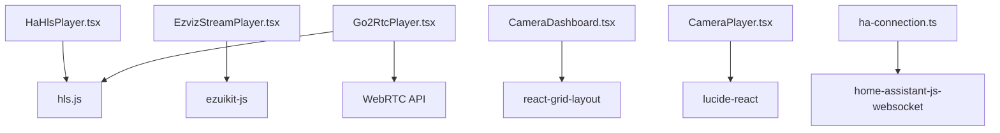

# 摄像头监控系统

<cite>
**本文引用的文件**
- [CameraPlayer.tsx](file://src/components/camera/CameraPlayer.tsx)
- [HaHlsPlayer.tsx](file://src/components/camera/HaHlsPlayer.tsx)
- [EzvizStreamPlayer.tsx](file://src/components/camera/EzvizStreamPlayer.tsx)
- [Go2RtcPlayer.tsx](file://src/components/camera/Go2RtcPlayer.tsx)
- [types.ts](file://src/components/camera/types.ts)
- [CameraDashboard.tsx](file://src/components/camera/CameraDashboard.tsx)
- [CameraWidget.tsx](file://src/app/components/dashboard/widgets/CameraWidget.tsx)
- [CameraManagementTab.tsx](file://src/app/components/settings/CameraManagementTab.tsx)
- [ha-connection.ts](file://src/utils/ha-connection.ts)
- [package.json](file://package.json)
- [README.md](file://README.md)
</cite>

## 更新摘要
**变更内容**
- 新增RTSP/go2rtc相机支持，添加Go2RtcPlayer.tsx组件
- 增强CameraManagementTab.tsx以支持go2rtc服务配置
- 扩展CameraPlayer.tsx以支持RTSP类型播放
- 更新类型定义以支持新的相机类型
- 新增WebRTC优先的自动回退播放机制

## 目录
1. [简介](#简介)
2. [项目结构](#项目结构)
3. [核心组件](#核心组件)
4. [架构总览](#架构总览)
5. [组件详解](#组件详解)
6. [依赖关系分析](#依赖关系分析)
7. [性能考量](#性能考量)
8. [故障排查指南](#故障排查指南)
9. [结论](#结论)
10. [附录](#附录)

## 简介
本项目是一个基于 React 与 Vite 的专业级 Home Assistant 仪表板，具备全双工语音交互与 iOS 风格的视觉体验。其摄像头监控模块支持多协议并行：HLS（通过 Home Assistant 代理）、Ezviz（萤石云）直连协议以及RTSP（go2rtc）流媒体协议。系统提供多路并发监控、可拖拽布局、全屏播放、实时预览与卡片化嵌入等多种能力，并内置安全连接与网络优化策略。

## 项目结构
围绕摄像头监控的关键目录与文件如下：
- 组件层
  - 播放器：CameraPlayer、HaHlsPlayer、EzvizStreamPlayer、Go2RtcPlayer
  - 仪表盘：CameraDashboard
  - 小部件：CameraWidget
  - 类型定义：types.ts
- 设置与配置
  - 摄像头管理：CameraManagementTab.tsx
- Home Assistant 连接
  - 连接工具：ha-connection.ts
- 依赖与运行
  - 包管理：package.json
  - 说明文档：README.md

**图表来源**
- [CameraPlayer.tsx:1-94](file://src/components/camera/CameraPlayer.tsx#L1-L94)
- [HaHlsPlayer.tsx:1-100](file://src/components/camera/HaHlsPlayer.tsx#L1-L100)
- [EzvizStreamPlayer.tsx:1-80](file://src/components/camera/EzvizStreamPlayer.tsx#L1-L80)
- [Go2RtcPlayer.tsx:1-277](file://src/components/camera/Go2RtcPlayer.tsx#L1-L277)
- [CameraDashboard.tsx:1-154](file://src/components/camera/CameraDashboard.tsx#L1-L154)
- [CameraWidget.tsx:1-96](file://src/app/components/dashboard/widgets/CameraWidget.tsx#L1-L96)
- [CameraManagementTab.tsx:1-224](file://src/app/components/settings/CameraManagementTab.tsx#L1-L224)
- [types.ts:1-24](file://src/components/camera/types.ts#L1-L24)
- [ha-connection.ts:1-317](file://src/utils/ha-connection.ts#L1-L317)
- [package.json:1-132](file://package.json#L1-L132)
- [README.md:1-84](file://README.md#L1-L84)

**章节来源**
- [README.md:1-84](file://README.md#L1-L84)
- [package.json:1-132](file://package.json#L1-L132)

## 核心组件
- CameraPlayer：统一入口，根据摄像头类型选择播放器；提供全屏与移除控制；在缺少必要参数时提示错误状态。
- HaHlsPlayer：HLS 播放器，兼容 hls.js 与原生 HLS；启用低延迟模式；处理网络/媒体错误并自动恢复；组件卸载时彻底清理。
- EzvizStreamPlayer：萤石云播放器，动态加载 ezuikit-js；支持多种初始化方式；在卸载时停止与销毁实例。
- Go2RtcPlayer：RTSP/go2rtc播放器，支持WebRTC优先流媒体传输，自动降级到HLS回退；提供实时状态指示与手动重试功能。
- CameraDashboard：多路摄像头的大屏布局，支持拖拽、调整尺寸、一键布局；提供全屏与移除控制。
- CameraWidget：仪表盘卡片，可选择已配置摄像头进行展示；编辑模式下提供快速切换。
- CameraManagementTab：系统设置中的摄像头配置页，支持新增、编辑、删除摄像头，区分 HA-HLS、Ezviz 和 RTSP 配置项。
- types.ts：定义摄像头布局项、配置与状态的数据结构，支持三种相机类型。
- ha-connection.ts：Home Assistant 连接封装，提供长连接、订阅实体、服务调用、连接可用性检测与最佳连接选择。

**章节来源**
- [CameraPlayer.tsx:1-94](file://src/components/camera/CameraPlayer.tsx#L1-L94)
- [HaHlsPlayer.tsx:1-100](file://src/components/camera/HaHlsPlayer.tsx#L1-L100)
- [EzvizStreamPlayer.tsx:1-80](file://src/components/camera/EzvizStreamPlayer.tsx#L1-L80)
- [Go2RtcPlayer.tsx:1-277](file://src/components/camera/Go2RtcPlayer.tsx#L1-L277)
- [CameraDashboard.tsx:1-154](file://src/components/camera/CameraDashboard.tsx#L1-L154)
- [CameraWidget.tsx:1-96](file://src/app/components/dashboard/widgets/CameraWidget.tsx#L1-L96)
- [CameraManagementTab.tsx:1-224](file://src/app/components/settings/CameraManagementTab.tsx#L1-L224)
- [types.ts:1-24](file://src/components/camera/types.ts#L1-L24)
- [ha-connection.ts:1-317](file://src/utils/ha-connection.ts#L1-L317)

## 架构总览
系统采用"配置驱动 + 组件化播放"的架构：
- 配置来源：系统设置页 CameraManagementTab 提供摄像头清单；仪表盘 CameraDashboard 与卡片 CameraWidget 从 HA 配置中读取摄像头列表。
- 播放器分发：CameraPlayer 根据摄像头类型路由到 HaHlsPlayer、EzvizStreamPlayer 或 Go2RtcPlayer。
- 连接与代理：HaHlsPlayer 通过 Home Assistant 代理提供的 HLS 地址播放；EzvizStreamPlayer 直连萤石云；Go2RtcPlayer 通过 go2rtc 服务实现 WebRTC 优先的流媒体传输。
- 布局与交互：CameraDashboard 使用 react-grid-layout 实现拖拽与自适应布局；全屏通过标准 DOM API 实现。

**图表来源**
- [CameraManagementTab.tsx:1-224](file://src/app/components/settings/CameraManagementTab.tsx#L1-L224)
- [types.ts:1-24](file://src/components/camera/types.ts#L1-L24)
- [ha-connection.ts:1-317](file://src/utils/ha-connection.ts#L1-L317)
- [HaHlsPlayer.tsx:1-100](file://src/components/camera/HaHlsPlayer.tsx#L1-L100)
- [EzvizStreamPlayer.tsx:1-80](file://src/components/camera/EzvizStreamPlayer.tsx#L1-L80)
- [Go2RtcPlayer.tsx:1-277](file://src/components/camera/Go2RtcPlayer.tsx#L1-L277)
- [CameraPlayer.tsx:1-94](file://src/components/camera/CameraPlayer.tsx#L1-L94)
- [CameraDashboard.tsx:1-154](file://src/components/camera/CameraDashboard.tsx#L1-L154)
- [CameraWidget.tsx:1-96](file://src/app/components/dashboard/widgets/CameraWidget.tsx#L1-L96)

## 组件详解

### 多协议支持与适配策略
- HLS（Home Assistant 代理）
  - 通过 hls.js 在不支持 HLS 的环境中播放 m3u8；启用低延迟模式与同步步数，提升实时性。
  - 原生 HLS 环境（如 iOS Safari）直接赋值 video.src。
  - 错误处理：网络错误尝试重新加载；媒体错误尝试恢复；致命错误销毁重建。
  - 生命周期：组件卸载时销毁 HLS 实例并清空 video 源，避免内存泄漏。
- Ezviz（萤石云）
  - 动态导入 ezuikit-js，兼容全局挂载与模块导入两种方式。
  - 初始化时传入 accessToken、url、模板与尺寸；初始静音保证自动播放成功率。
  - 生命周期：组件卸载时停止并销毁播放器实例，捕获异常避免 React 卸载阻塞。
- RTSP/go2rtc（WebRTC优先）
  - 通过 WebRTC 实现低延迟流媒体传输，优先使用 STUN 服务器进行 ICE 连接。
  - 支持自动 SDP 交换与超时控制（默认5秒），失败时自动降级到 HLS 回退。
  - 提供实时状态指示器，显示连接状态、传输协议类型和错误信息。
  - 支持手动重试功能，便于用户主动恢复连接。

**图表来源**
- [CameraWidget.tsx:1-96](file://src/app/components/dashboard/widgets/CameraWidget.tsx#L1-L96)
- [CameraDashboard.tsx:1-154](file://src/components/camera/CameraDashboard.tsx#L1-L154)
- [CameraPlayer.tsx:1-94](file://src/components/camera/CameraPlayer.tsx#L1-L94)
- [HaHlsPlayer.tsx:1-100](file://src/components/camera/HaHlsPlayer.tsx#L1-L100)
- [EzvizStreamPlayer.tsx:1-80](file://src/components/camera/EzvizStreamPlayer.tsx#L1-L80)
- [Go2RtcPlayer.tsx:1-277](file://src/components/camera/Go2RtcPlayer.tsx#L1-L277)

**章节来源**
- [HaHlsPlayer.tsx:1-100](file://src/components/camera/HaHlsPlayer.tsx#L1-L100)
- [EzvizStreamPlayer.tsx:1-80](file://src/components/camera/EzvizStreamPlayer.tsx#L1-L80)
- [Go2RtcPlayer.tsx:1-277](file://src/components/camera/Go2RtcPlayer.tsx#L1-L277)
- [CameraPlayer.tsx:1-94](file://src/components/camera/CameraPlayer.tsx#L1-L94)

### 视频播放器实现机制
- 流媒体解码与播放
  - HLS：优先使用 hls.js；在原生支持环境下直接赋值 video.src。
  - Ezviz：通过 EZUIKitPlayer 创建播放容器，绑定 DOM 容器。
  - RTSP/go2rtc：通过 WebRTC 实现低延迟传输，失败时自动降级到 HLS。
- 缓冲优化
  - HLS：启用低延迟模式与 liveSyncDurationCount，减少首帧延迟。
  - Ezviz：延时初始化以等待布局尺寸稳定，避免初次尺寸异常导致的渲染问题。
  - RTSP/go2rtc：WebRTC 传输具有天然的低延迟特性，配合自动回退机制确保稳定性。
- 播放控制
  - 自动播放：均采用静音自动播放策略以规避浏览器拦截。
  - 全屏：通过标准 DOM API 请求全屏，支持多窗口场景。
  - 移除：提供移除按钮，触发 Dashboard onRemove，进而卸载组件释放资源。
  - 状态管理：RTSP播放器提供详细的连接状态指示和错误处理。

**图表来源**
- [HaHlsPlayer.tsx:1-100](file://src/components/camera/HaHlsPlayer.tsx#L1-L100)
- [EzvizStreamPlayer.tsx:1-80](file://src/components/camera/EzvizStreamPlayer.tsx#L1-L80)
- [Go2RtcPlayer.tsx:1-277](file://src/components/camera/Go2RtcPlayer.tsx#L1-L277)
- [CameraPlayer.tsx:1-94](file://src/components/camera/CameraPlayer.tsx#L1-L94)

**章节来源**
- [HaHlsPlayer.tsx:1-100](file://src/components/camera/HaHlsPlayer.tsx#L1-L100)
- [EzvizStreamPlayer.tsx:1-80](file://src/components/camera/EzvizStreamPlayer.tsx#L1-L80)
- [Go2RtcPlayer.tsx:1-277](file://src/components/camera/Go2RtcPlayer.tsx#L1-L277)
- [CameraPlayer.tsx:1-94](file://src/components/camera/CameraPlayer.tsx#L1-L94)

### 多路并发监控与布局
- 并发与资源管理
  - 每个摄像头独立渲染为一个播放器实例；全屏与移除操作仅影响当前实例，避免相互干扰。
  - 卸载时严格销毁播放器与清理媒体资源，防止内存泄漏。
  - RTSP播放器支持自动回退机制，确保在不同网络条件下都能获得最佳播放体验。
- 布局与交互
  - 使用 react-grid-layout 实现拖拽、调整尺寸与响应式布局；支持一键单屏与四宫格布局。
  - 拖拽句柄限定在顶部控制蒙板区域，避免影响播放器交互。
  - RTSP播放器提供状态指示器，实时显示连接状态和传输协议类型。

**图表来源**
- [CameraDashboard.tsx:1-154](file://src/components/camera/CameraDashboard.tsx#L1-L154)
- [CameraPlayer.tsx:1-94](file://src/components/camera/CameraPlayer.tsx#L1-L94)
- [Go2RtcPlayer.tsx:220-247](file://src/components/camera/Go2RtcPlayer.tsx#L220-L247)

**章节来源**
- [CameraDashboard.tsx:1-154](file://src/components/camera/CameraDashboard.tsx#L1-L154)
- [CameraPlayer.tsx:1-94](file://src/components/camera/CameraPlayer.tsx#L1-L94)
- [Go2RtcPlayer.tsx:220-247](file://src/components/camera/Go2RtcPlayer.tsx#L220-L247)

### 摄像头配置管理与用户体验
- 配置管理
  - CameraManagementTab 提供摄像头增删改；区分 HA-HLS、Ezviz 和 RTSP 的配置项。
  - RTSP模式支持go2rtc服务地址和流名称配置，提供实时配置指南。
  - 支持占位提示与配置指南，降低上手成本。
- 实时预览与卡片化
  - CameraWidget 从 HA 配置中读取摄像头列表，支持在卡片内选择与切换摄像头。
  - 编辑模式下提供极简右上角切换入口，不影响播放器交互。
- 全屏播放
  - 顶部控制栏提供全屏按钮，调用标准 DOM API 实现全屏覆盖。
  - RTSP播放器提供手动重试功能，便于用户主动恢复连接。

**章节来源**
- [CameraManagementTab.tsx:1-224](file://src/app/components/settings/CameraManagementTab.tsx#L1-L224)
- [CameraWidget.tsx:1-96](file://src/app/components/dashboard/widgets/CameraWidget.tsx#L1-L96)
- [CameraPlayer.tsx:1-94](file://src/components/camera/CameraPlayer.tsx#L1-L94)
- [Go2RtcPlayer.tsx:191-194](file://src/components/camera/Go2RtcPlayer.tsx#L191-L194)

## 依赖关系分析
- 播放器依赖
  - hls.js：HLS 播放与错误恢复。
  - ezuikit-js：萤石云播放器。
  - WebRTC API：RTSP/go2rtc播放器的实时流媒体传输。
- 布局与交互
  - react-grid-layout：拖拽与响应式布局。
  - lucide-react：图标。
- Home Assistant 连接
  - home-assistant-js-websocket：长连接、订阅实体、服务调用、连接可用性检测。

**图表来源**
- [package.json:1-132](file://package.json#L1-L132)
- [HaHlsPlayer.tsx:1-100](file://src/components/camera/HaHlsPlayer.tsx#L1-L100)
- [EzvizStreamPlayer.tsx:1-80](file://src/components/camera/EzvizStreamPlayer.tsx#L1-L80)
- [Go2RtcPlayer.tsx:1-277](file://src/components/camera/Go2RtcPlayer.tsx#L1-L277)
- [CameraDashboard.tsx:1-154](file://src/components/camera/CameraDashboard.tsx#L1-L154)
- [CameraPlayer.tsx:1-94](file://src/components/camera/CameraPlayer.tsx#L1-L94)
- [ha-connection.ts:1-317](file://src/utils/ha-connection.ts#L1-L317)

**章节来源**
- [package.json:1-132](file://package.json#L1-L132)

## 性能考量
- 播放器性能
  - HLS：启用低延迟模式与同步步数，减少首帧与卡顿；错误恢复避免长时间黑屏。
  - Ezviz：延时初始化确保尺寸稳定，避免多次重绘。
  - RTSP/go2rtc：WebRTC传输具有天然的低延迟特性，配合自动回退机制确保稳定性。
- 内存与资源
  - 卸载时销毁播放器实例与清理媒体源，防止内存泄漏与 UI 卡顿。
  - RTSP播放器提供完善的资源清理机制，包括WebRTC连接和HLS实例的销毁。
- 布局性能
  - react-grid-layout 使用 CSS 变换与合理边距，避免大规模 DOM 重排。
- 网络优化
  - HA 连接封装提供连接可用性检测与最佳连接选择，优先本地可达性，提升稳定性。
  - RTSP播放器的自动回退机制确保在网络不稳定时仍能获得流畅的播放体验。

**章节来源**
- [HaHlsPlayer.tsx:1-100](file://src/components/camera/HaHlsPlayer.tsx#L1-L100)
- [EzvizStreamPlayer.tsx:1-80](file://src/components/camera/EzvizStreamPlayer.tsx#L1-L80)
- [Go2RtcPlayer.tsx:1-277](file://src/components/camera/Go2RtcPlayer.tsx#L1-L277)
- [CameraDashboard.tsx:1-154](file://src/components/camera/CameraDashboard.tsx#L1-L154)
- [ha-connection.ts:1-317](file://src/utils/ha-connection.ts#L1-L317)

## 故障排查指南
- 播放器无法加载
  - 检查摄像头类型与 URL 是否正确；HLS 需要 HA 代理地址；Ezviz 需要有效的 accessToken；RTSP 需要正确的 go2rtc 服务地址和流名称。
  - 查看浏览器控制台是否有模块导入或构造函数缺失的错误。
- 自动播放被拦截
  - 播放器采用静音自动播放策略；若仍失败，检查浏览器策略与用户手势要求。
- 网络中断或卡顿
  - HLS 播放器会尝试网络重载与媒体恢复；若无效，检查网络与服务器状态。
  - RTSP播放器会在连接失败时自动降级到HLS回退，检查go2rtc服务状态。
- 全屏无效
  - 确认浏览器支持全屏 API；部分环境可能需要用户手势触发。
- 连接 HA 失败
  - 检查 HA URL 与 Token 配置；使用连接可用性检测方法验证可达性。
- RTSP连接问题
  - 检查go2rtc服务是否正常运行，确认流名称配置正确。
  - 查看状态指示器，RTSP播放器会显示详细的连接状态和错误信息。
  - 使用手动重试功能主动恢复连接。

**章节来源**
- [CameraPlayer.tsx:1-94](file://src/components/camera/CameraPlayer.tsx#L1-L94)
- [HaHlsPlayer.tsx:1-100](file://src/components/camera/HaHlsPlayer.tsx#L1-L100)
- [EzvizStreamPlayer.tsx:1-80](file://src/components/camera/EzvizStreamPlayer.tsx#L1-L80)
- [Go2RtcPlayer.tsx:1-277](file://src/components/camera/Go2RtcPlayer.tsx#L1-L277)
- [ha-connection.ts:1-317](file://src/utils/ha-connection.ts#L1-L317)

## 结论
本摄像头监控系统通过清晰的多协议适配与组件化架构，实现了对 HLS、Ezviz 和 RTSP/go2rtc 的统一接入。新增的RTSP/go2rtc支持通过WebRTC优先的流媒体传输，结合自动HLS回退机制，提供了低延迟且稳定的播放体验。系统在布局、播放控制、错误恢复与资源管理方面均有明确策略，兼顾易用性与性能表现。通过设置页与卡片化组件，用户可以灵活配置与预览监控画面，满足家庭与小型办公的安防需求。

## 附录
- 开发与运行
  - 使用 Docker Compose 启动 HA 与前端开发服务；访问 http://localhost:5173。
  - 支持 E2E 与单元测试脚本。
- 依赖版本
  - 关键依赖包括 hls.js、home-assistant-js-websocket、react-grid-layout、WebRTC API 等。

**章节来源**
- [README.md:1-84](file://README.md#L1-L84)
- [package.json:1-132](file://package.json#L1-L132)