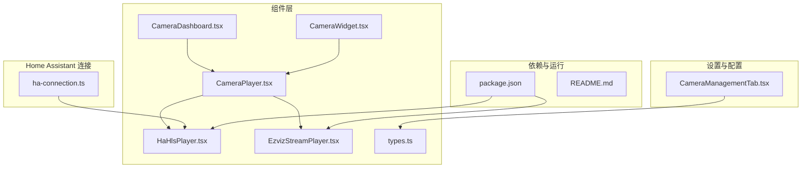
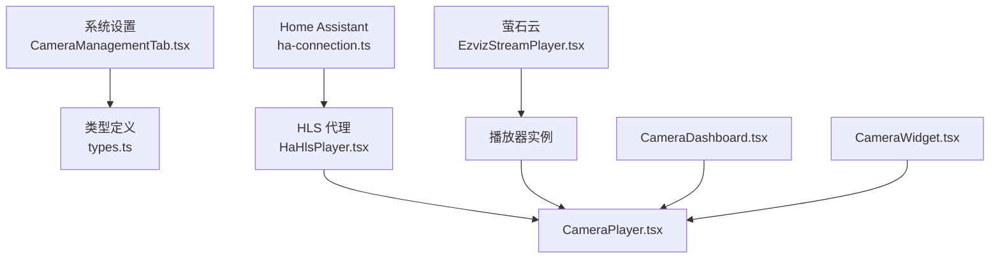
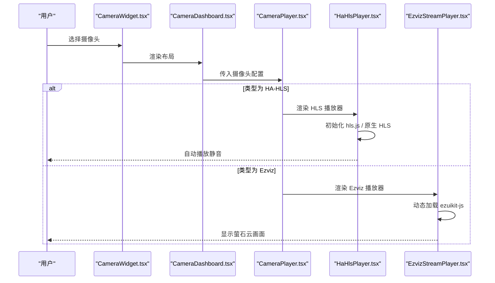
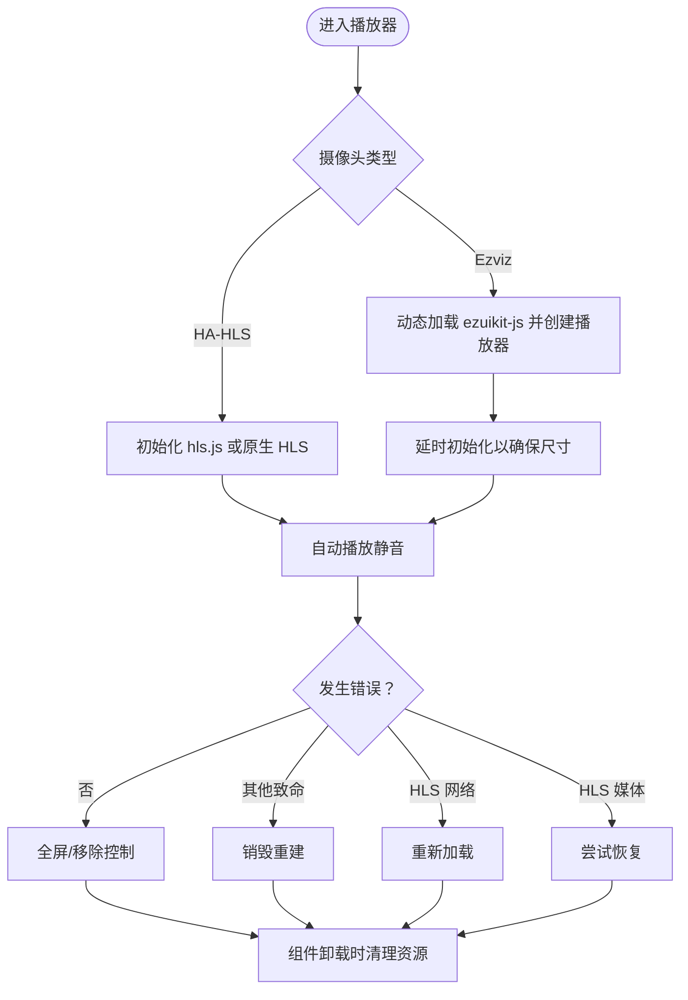
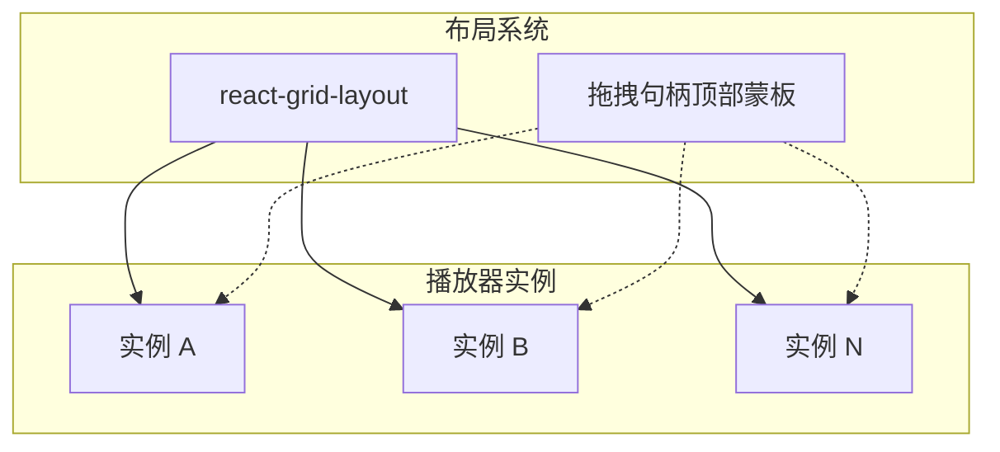
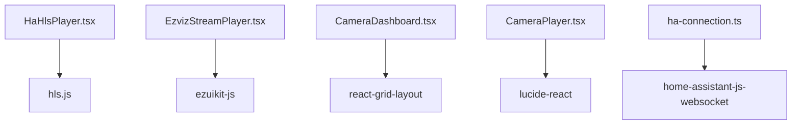

# 摄像头监控系统

<cite>
**本文引用的文件**
- [CameraPlayer.tsx](file://src/components/camera/CameraPlayer.tsx)
- [HaHlsPlayer.tsx](file://src/components/camera/HaHlsPlayer.tsx)
- [EzvizStreamPlayer.tsx](file://src/components/camera/EzvizStreamPlayer.tsx)
- [types.ts](file://src/components/camera/types.ts)
- [CameraDashboard.tsx](file://src/components/camera/CameraDashboard.tsx)
- [CameraWidget.tsx](file://src/app/components/dashboard/widgets/CameraWidget.tsx)
- [CameraManagementTab.tsx](file://src/app/components/settings/CameraManagementTab.tsx)
- [ha-connection.ts](file://src/utils/ha-connection.ts)
- [package.json](file://package.json)
- [README.md](file://README.md)
</cite>

## 目录
1. [简介](#简介)
2. [项目结构](#项目结构)
3. [核心组件](#核心组件)
4. [架构总览](#架构总览)
5. [组件详解](#组件详解)
6. [依赖关系分析](#依赖关系分析)
7. [性能考量](#性能考量)
8. [故障排查指南](#故障排查指南)
9. [结论](#结论)
10. [附录](#附录)

## 简介
本项目是一个基于 React 与 Vite 的专业级 Home Assistant 仪表板，具备全双工语音交互与 iOS 风格的视觉体验。其摄像头监控模块支持多协议并行：HLS（通过 Home Assistant 代理）与 Ezviz（萤石云）直连协议。系统提供多路并发监控、可拖拽布局、全屏播放、实时预览与卡片化嵌入等多种能力，并内置安全连接与网络优化策略。

## 项目结构
围绕摄像头监控的关键目录与文件如下：
- 组件层
  - 播放器：CameraPlayer、HaHlsPlayer、EzvizStreamPlayer
  - 仪表盘：CameraDashboard
  - 小部件：CameraWidget
  - 类型定义：types.ts
- 设置与配置
  - 摄像头管理：CameraManagementTab.tsx
- Home Assistant 连接
  - 连接工具：ha-connection.ts
- 依赖与运行
  - 包管理：package.json
  - 说明文档：README.md

图表来源
- [CameraPlayer.tsx:1-88](file://src/components/camera/CameraPlayer.tsx#L1-L88)
- [HaHlsPlayer.tsx:1-100](file://src/components/camera/HaHlsPlayer.tsx#L1-L100)
- [EzvizStreamPlayer.tsx:1-80](file://src/components/camera/EzvizStreamPlayer.tsx#L1-L80)
- [CameraDashboard.tsx:1-154](file://src/components/camera/CameraDashboard.tsx#L1-L154)
- [CameraWidget.tsx:1-96](file://src/app/components/dashboard/widgets/CameraWidget.tsx#L1-L96)
- [CameraManagementTab.tsx:1-188](file://src/app/components/settings/CameraManagementTab.tsx#L1-L188)
- [types.ts:1-22](file://src/components/camera/types.ts#L1-L22)
- [ha-connection.ts:1-317](file://src/utils/ha-connection.ts#L1-L317)
- [package.json:1-132](file://package.json#L1-L132)
- [README.md:1-84](file://README.md#L1-L84)

章节来源
- [README.md:1-84](file://README.md#L1-L84)
- [package.json:1-132](file://package.json#L1-L132)

## 核心组件
- CameraPlayer：统一入口，根据摄像头类型选择播放器；提供全屏与移除控制；在缺少必要参数时提示错误状态。
- HaHlsPlayer：HLS 播放器，兼容 hls.js 与原生 HLS；启用低延迟模式；处理网络/媒体错误并自动恢复；组件卸载时彻底清理。
- EzvizStreamPlayer：萤石云播放器，动态加载 ezuikit-js；支持多种初始化方式；在卸载时停止与销毁实例。
- CameraDashboard：多路摄像头的大屏布局，支持拖拽、调整尺寸、一键布局；提供全屏与移除控制。
- CameraWidget：仪表盘卡片，可选择已配置摄像头进行展示；编辑模式下提供快速切换。
- CameraManagementTab：系统设置中的摄像头配置页，支持新增、编辑、删除摄像头，区分 HA-HLS 与 Ezviz 配置项。
- types.ts：定义摄像头布局项、配置与状态的数据结构。
- ha-connection.ts：Home Assistant 连接封装，提供长连接、订阅实体、服务调用、连接可用性检测与最佳连接选择。

章节来源
- [CameraPlayer.tsx:1-88](file://src/components/camera/CameraPlayer.tsx#L1-L88)
- [HaHlsPlayer.tsx:1-100](file://src/components/camera/HaHlsPlayer.tsx#L1-L100)
- [EzvizStreamPlayer.tsx:1-80](file://src/components/camera/EzvizStreamPlayer.tsx#L1-L80)
- [CameraDashboard.tsx:1-154](file://src/components/camera/CameraDashboard.tsx#L1-L154)
- [CameraWidget.tsx:1-96](file://src/app/components/dashboard/widgets/CameraWidget.tsx#L1-L96)
- [CameraManagementTab.tsx:1-188](file://src/app/components/settings/CameraManagementTab.tsx#L1-L188)
- [types.ts:1-22](file://src/components/camera/types.ts#L1-L22)
- [ha-connection.ts:1-317](file://src/utils/ha-connection.ts#L1-L317)

## 架构总览
系统采用“配置驱动 + 组件化播放”的架构：
- 配置来源：系统设置页 CameraManagementTab 提供摄像头清单；仪表盘 CameraDashboard 与卡片 CameraWidget 从 HA 配置中读取摄像头列表。
- 播放器分发：CameraPlayer 根据摄像头类型路由到 HaHlsPlayer 或 EzvizStreamPlayer。
- 连接与代理：HaHlsPlayer 通过 Home Assistant 代理提供的 HLS 地址播放；EzvizStreamPlayer 直连萤石云。
- 布局与交互：CameraDashboard 使用 react-grid-layout 实现拖拽与自适应布局；全屏通过标准 DOM API 实现。

图表来源
- [CameraManagementTab.tsx:1-188](file://src/app/components/settings/CameraManagementTab.tsx#L1-L188)
- [types.ts:1-22](file://src/components/camera/types.ts#L1-L22)
- [ha-connection.ts:1-317](file://src/utils/ha-connection.ts#L1-L317)
- [HaHlsPlayer.tsx:1-100](file://src/components/camera/HaHlsPlayer.tsx#L1-L100)
- [EzvizStreamPlayer.tsx:1-80](file://src/components/camera/EzvizStreamPlayer.tsx#L1-L80)
- [CameraPlayer.tsx:1-88](file://src/components/camera/CameraPlayer.tsx#L1-L88)
- [CameraDashboard.tsx:1-154](file://src/components/camera/CameraDashboard.tsx#L1-L154)
- [CameraWidget.tsx:1-96](file://src/app/components/dashboard/widgets/CameraWidget.tsx#L1-L96)

## 组件详解

### 多协议支持与适配策略
- HLS（Home Assistant 代理）
  - 通过 hls.js 在不支持 HLS 的环境中播放 m3u8；启用低延迟模式与同步步数，提升实时性。
  - 原生 HLS 环境（如 iOS Safari）直接赋值 video.src。
  - 错误处理：网络错误尝试重新加载；媒体错误尝试恢复；致命错误销毁重建。
  - 生命周期：组件卸载时销毁 HLS 实例并清空 video 源，避免内存泄漏。
- Ezviz（萤石云）
  - 动态导入 ezuikit-js，兼容全局挂载与模块导入两种方式。
  - 初始化时传入 accessToken、url、模板与尺寸；初始静音保证自动播放成功率。
  - 生命周期：组件卸载时停止并销毁播放器实例，捕获异常避免 React 卸载阻塞。

图表来源
- [CameraWidget.tsx:1-96](file://src/app/components/dashboard/widgets/CameraWidget.tsx#L1-L96)
- [CameraDashboard.tsx:1-154](file://src/components/camera/CameraDashboard.tsx#L1-L154)
- [CameraPlayer.tsx:1-88](file://src/components/camera/CameraPlayer.tsx#L1-L88)
- [HaHlsPlayer.tsx:1-100](file://src/components/camera/HaHlsPlayer.tsx#L1-L100)
- [EzvizStreamPlayer.tsx:1-80](file://src/components/camera/EzvizStreamPlayer.tsx#L1-L80)

章节来源
- [HaHlsPlayer.tsx:1-100](file://src/components/camera/HaHlsPlayer.tsx#L1-L100)
- [EzvizStreamPlayer.tsx:1-80](file://src/components/camera/EzvizStreamPlayer.tsx#L1-L80)
- [CameraPlayer.tsx:1-88](file://src/components/camera/CameraPlayer.tsx#L1-L88)

### 视频播放器实现机制
- 流媒体解码与播放
  - HLS：优先使用 hls.js；在原生支持环境下直接赋值 video.src。
  - Ezviz：通过 EZUIKitPlayer 创建播放容器，绑定 DOM 容器。
- 缓冲优化
  - HLS：启用低延迟模式与 liveSyncDurationCount，减少首帧延迟。
  - Ezviz：延时初始化以等待布局尺寸稳定，避免初次尺寸异常导致的渲染问题。
- 播放控制
  - 自动播放：均采用静音自动播放策略以规避浏览器拦截。
  - 全屏：通过标准 DOM API 请求全屏，支持多窗口场景。
  - 移除：提供移除按钮，触发 Dashboard onRemove，进而卸载组件释放资源。

图表来源
- [HaHlsPlayer.tsx:1-100](file://src/components/camera/HaHlsPlayer.tsx#L1-L100)
- [EzvizStreamPlayer.tsx:1-80](file://src/components/camera/EzvizStreamPlayer.tsx#L1-L80)
- [CameraPlayer.tsx:1-88](file://src/components/camera/CameraPlayer.tsx#L1-L88)

章节来源
- [HaHlsPlayer.tsx:1-100](file://src/components/camera/HaHlsPlayer.tsx#L1-L100)
- [EzvizStreamPlayer.tsx:1-80](file://src/components/camera/EzvizStreamPlayer.tsx#L1-L80)
- [CameraPlayer.tsx:1-88](file://src/components/camera/CameraPlayer.tsx#L1-L88)

### 多路并发监控与布局
- 并发与资源管理
  - 每个摄像头独立渲染为一个播放器实例；全屏与移除操作仅影响当前实例，避免相互干扰。
  - 卸载时严格销毁播放器与清理媒体资源，防止内存泄漏。
- 布局与交互
  - 使用 react-grid-layout 实现拖拽、调整尺寸与响应式布局；支持一键单屏与四宫格布局。
  - 拖拽句柄限定在顶部控制蒙板区域，避免影响播放器交互。

图表来源
- [CameraDashboard.tsx:1-154](file://src/components/camera/CameraDashboard.tsx#L1-L154)
- [CameraPlayer.tsx:1-88](file://src/components/camera/CameraPlayer.tsx#L1-L88)

章节来源
- [CameraDashboard.tsx:1-154](file://src/components/camera/CameraDashboard.tsx#L1-L154)
- [CameraPlayer.tsx:1-88](file://src/components/camera/CameraPlayer.tsx#L1-L88)

### 摄像头配置管理与用户体验
- 配置管理
  - CameraManagementTab 提供摄像头增删改；区分 HA-HLS 与 Ezviz 的配置项（URL、AccessToken）。
  - 支持占位提示与配置指南，降低上手成本。
- 实时预览与卡片化
  - CameraWidget 从 HA 配置中读取摄像头列表，支持在卡片内选择与切换摄像头。
  - 编辑模式下提供极简右上角切换入口，不影响播放器交互。
- 全屏播放
  - 顶部控制栏提供全屏按钮，调用标准 DOM API 实现全屏覆盖。

章节来源
- [CameraManagementTab.tsx:1-188](file://src/app/components/settings/CameraManagementTab.tsx#L1-L188)
- [CameraWidget.tsx:1-96](file://src/app/components/dashboard/widgets/CameraWidget.tsx#L1-L96)
- [CameraPlayer.tsx:1-88](file://src/components/camera/CameraPlayer.tsx#L1-L88)

## 依赖关系分析
- 播放器依赖
  - hls.js：HLS 播放与错误恢复。
  - ezuikit-js：萤石云播放器。
- 布局与交互
  - react-grid-layout：拖拽与响应式布局。
  - lucide-react：图标。
- Home Assistant 连接
  - home-assistant-js-websocket：长连接、订阅实体、服务调用、连接可用性检测。

图表来源
- [package.json:1-132](file://package.json#L1-L132)
- [HaHlsPlayer.tsx:1-100](file://src/components/camera/HaHlsPlayer.tsx#L1-L100)
- [EzvizStreamPlayer.tsx:1-80](file://src/components/camera/EzvizStreamPlayer.tsx#L1-L80)
- [CameraDashboard.tsx:1-154](file://src/components/camera/CameraDashboard.tsx#L1-L154)
- [CameraPlayer.tsx:1-88](file://src/components/camera/CameraPlayer.tsx#L1-L88)
- [ha-connection.ts:1-317](file://src/utils/ha-connection.ts#L1-L317)

章节来源
- [package.json:1-132](file://package.json#L1-L132)

## 性能考量
- 播放器性能
  - HLS：启用低延迟模式与同步步数，减少首帧与卡顿；错误恢复避免长时间黑屏。
  - Ezviz：延时初始化确保尺寸稳定，避免多次重绘。
- 内存与资源
  - 卸载时销毁播放器实例与清理媒体源，防止内存泄漏与 UI 卡顿。
- 布局性能
  - react-grid-layout 使用 CSS 变换与合理边距，避免大规模 DOM 重排。
- 网络优化
  - HA 连接封装提供连接可用性检测与最佳连接选择，优先本地可达性，提升稳定性。

章节来源
- [HaHlsPlayer.tsx:1-100](file://src/components/camera/HaHlsPlayer.tsx#L1-L100)
- [EzvizStreamPlayer.tsx:1-80](file://src/components/camera/EzvizStreamPlayer.tsx#L1-L80)
- [CameraDashboard.tsx:1-154](file://src/components/camera/CameraDashboard.tsx#L1-L154)
- [ha-connection.ts:1-317](file://src/utils/ha-connection.ts#L1-L317)

## 故障排查指南
- 播放器无法加载
  - 检查摄像头类型与 URL 是否正确；HLS 需要 HA 代理地址；Ezviz 需要有效的 accessToken。
  - 查看浏览器控制台是否有模块导入或构造函数缺失的错误。
- 自动播放被拦截
  - 播放器采用静音自动播放策略；若仍失败，检查浏览器策略与用户手势要求。
- 网络中断或卡顿
  - HLS 播放器会尝试网络重载与媒体恢复；若无效，检查网络与服务器状态。
- 全屏无效
  - 确认浏览器支持全屏 API；部分环境可能需要用户手势触发。
- 连接 HA 失败
  - 检查 HA URL 与 Token 配置；使用连接可用性检测方法验证可达性。

章节来源
- [CameraPlayer.tsx:1-88](file://src/components/camera/CameraPlayer.tsx#L1-L88)
- [HaHlsPlayer.tsx:1-100](file://src/components/camera/HaHlsPlayer.tsx#L1-L100)
- [EzvizStreamPlayer.tsx:1-80](file://src/components/camera/EzvizStreamPlayer.tsx#L1-L80)
- [ha-connection.ts:1-317](file://src/utils/ha-connection.ts#L1-L317)

## 结论
本摄像头监控系统通过清晰的多协议适配与组件化架构，实现了对 HLS 与 Ezviz 的统一接入；结合 Home Assistant 的代理能力与萤石云直连能力，满足多场景部署需求。系统在布局、播放控制、错误恢复与资源管理方面均有明确策略，兼顾易用性与性能表现。通过设置页与卡片化组件，用户可以灵活配置与预览监控画面，满足家庭与小型办公的安防需求。

## 附录
- 开发与运行
  - 使用 Docker Compose 启动 HA 与前端开发服务；访问 http://localhost:5173。
  - 支持 E2E 与单元测试脚本。
- 依赖版本
  - 关键依赖包括 hls.js、home-assistant-js-websocket、react-grid-layout 等。

章节来源
- [README.md:1-84](file://README.md#L1-L84)
- [package.json:1-132](file://package.json#L1-L132)