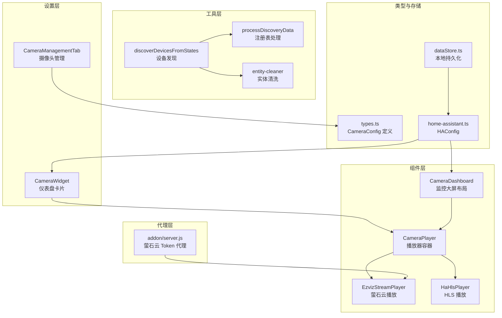
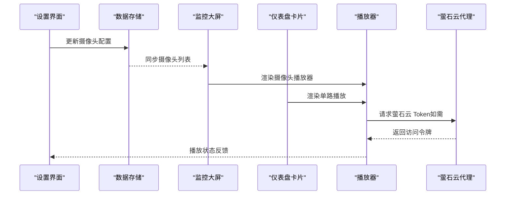
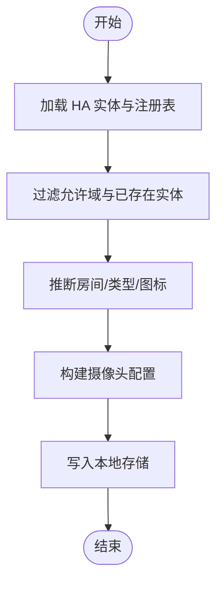
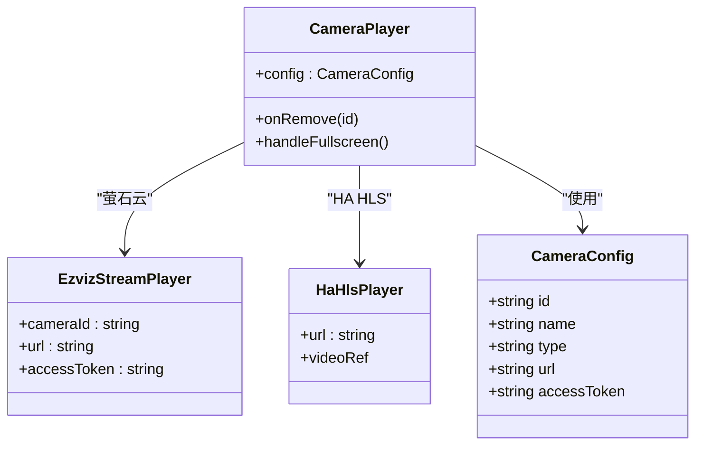
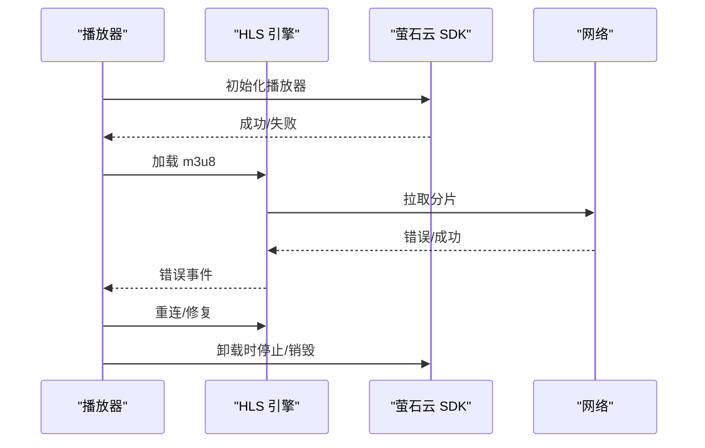
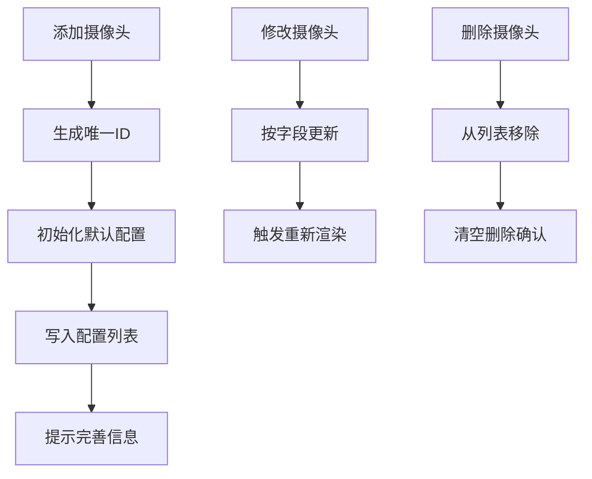
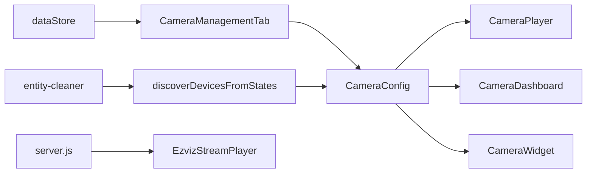

# 摄像头设备管理

<cite>
**本文档引用的文件**
- [CameraDashboard.tsx](file://src/components/camera/CameraDashboard.tsx)
- [CameraPlayer.tsx](file://src/components/camera/CameraPlayer.tsx)
- [EzvizStreamPlayer.tsx](file://src/components/camera/EzvizStreamPlayer.tsx)
- [HaHlsPlayer.tsx](file://src/components/camera/HaHlsPlayer.tsx)
- [types.ts](file://src/components/camera/types.ts)
- [CameraManagementTab.tsx](file://src/app/components/settings/CameraManagementTab.tsx)
- [CameraWidget.tsx](file://src/app/components/dashboard/widgets/CameraWidget.tsx)
- [device-discovery.ts](file://src/utils/device-discovery.ts)
- [ha-discovery.ts](file://src/utils/ha-discovery.ts)
- [entity-cleaner.ts](file://src/utils/entity-cleaner.ts)
- [home-assistant.ts](file://src/types/home-assistant.ts)
- [dataStore.ts](file://src/store/dataStore.ts)
- [server.js](file://addon/server.js)
</cite>

## 目录
1. [简介](#简介)
2. [项目结构](#项目结构)
3. [核心组件](#核心组件)
4. [架构总览](#架构总览)
5. [详细组件分析](#详细组件分析)
6. [依赖关系分析](#依赖关系分析)
7. [性能考虑](#性能考虑)
8. [故障排查指南](#故障排查指南)
9. [结论](#结论)

## 简介
本文件面向摄像头设备管理模块，系统化梳理从设备发现、配置管理、播放架构到状态监控与故障诊断的完整技术方案。重点覆盖以下方面：
- 设备发现机制：自动扫描 Home Assistant 实体，推断房间与设备类型，生成设备清单
- 配置管理：IP/端口、用户名密码、RTSP/HLS 地址格式、萤石云 Token 管理
- 并发管理：多路视频同时播放的资源分配、负载均衡与性能监控
- 状态监控与诊断：连接状态检查、播放异常处理、自动重连策略
- 生命周期操作：添加、删除、修改摄像头配置的实现细节

## 项目结构
摄像头相关功能主要分布在以下模块：
- 组件层：播放器、仪表盘、小部件
- 设置层：摄像头管理界面
- 工具层：设备发现、实体清洗、分类
- 类型层：配置与状态模型
- 存储层：本地持久化
- 代理层：萤石云 Token 代理

**图表来源**
- [CameraDashboard.tsx:1-154](file://src/components/camera/CameraDashboard.tsx#L1-L154)
- [CameraPlayer.tsx:1-88](file://src/components/camera/CameraPlayer.tsx#L1-L88)
- [EzvizStreamPlayer.tsx:1-80](file://src/components/camera/EzvizStreamPlayer.tsx#L1-L80)
- [HaHlsPlayer.tsx:1-100](file://src/components/camera/HaHlsPlayer.tsx#L1-L100)
- [CameraManagementTab.tsx:1-188](file://src/app/components/settings/CameraManagementTab.tsx#L1-L188)
- [CameraWidget.tsx:1-96](file://src/app/components/dashboard/widgets/CameraWidget.tsx#L1-L96)
- [device-discovery.ts:1-161](file://src/utils/device-discovery.ts#L1-L161)
- [ha-discovery.ts:1-167](file://src/utils/ha-discovery.ts#L1-L167)
- [entity-cleaner.ts:1-381](file://src/utils/entity-cleaner.ts#L1-L381)
- [types.ts:1-22](file://src/components/camera/types.ts#L1-L22)
- [home-assistant.ts:1-12](file://src/types/home-assistant.ts#L1-L12)
- [dataStore.ts:1-129](file://src/store/dataStore.ts#L1-L129)
- [server.js:132-229](file://addon/server.js#L132-L229)

**章节来源**
- [CameraDashboard.tsx:1-154](file://src/components/camera/CameraDashboard.tsx#L1-L154)
- [CameraPlayer.tsx:1-88](file://src/components/camera/CameraPlayer.tsx#L1-L88)
- [types.ts:1-22](file://src/components/camera/types.ts#L1-L22)

## 核心组件
- 摄像头配置模型：定义摄像头标识、名称、类型（萤石云/HA HLS）、URL、访问令牌等字段
- 播放器容器：根据类型选择萤石云播放器或 HLS 播放器，提供全屏与移除控制
- 萤石云播放器：动态加载 SDK，初始化播放实例，处理生命周期销毁
- HA HLS 播放器：基于 hls.js 的跨平台 HLS 播放，含自动重连与资源清理
- 仪表盘与设置：支持摄像头添加、删除、修改、布局管理与卡片绑定

**章节来源**
- [types.ts:10-16](file://src/components/camera/types.ts#L10-L16)
- [CameraPlayer.tsx:12-87](file://src/components/camera/CameraPlayer.tsx#L12-L87)
- [EzvizStreamPlayer.tsx:9-71](file://src/components/camera/EzvizStreamPlayer.tsx#L9-L71)
- [HaHlsPlayer.tsx:8-87](file://src/components/camera/HaHlsPlayer.tsx#L8-L87)
- [CameraManagementTab.tsx:14-36](file://src/app/components/settings/CameraManagementTab.tsx#L14-L36)

## 架构总览
系统采用“配置驱动 + 播放器抽象 + 代理服务”的架构：
- 配置驱动：通过 HAConfig 持有摄像头列表，Dashboard 与 Widget 读取配置进行渲染
- 播放器抽象：CameraPlayer 根据类型路由到具体播放器，统一控制栏与错误提示
- 代理服务：萤石云 Token 代理隐藏敏感参数，保障前端安全

**图表来源**
- [CameraManagementTab.tsx:25-30](file://src/app/components/settings/CameraManagementTab.tsx#L25-L30)
- [dataStore.ts:58-129](file://src/store/dataStore.ts#L58-L129)
- [CameraDashboard.tsx:27-61](file://src/components/camera/CameraDashboard.tsx#L27-L61)
- [CameraWidget.tsx:16-31](file://src/app/components/dashboard/widgets/CameraWidget.tsx#L16-L31)
- [EzvizStreamPlayer.tsx:14-46](file://src/components/camera/EzvizStreamPlayer.tsx#L14-L46)
- [server.js:200-227](file://addon/server.js#L200-L227)

## 详细组件分析

### 设备发现与配置管理
- 自动发现：从 Home Assistant 实体状态与注册表中提取设备信息，推断房间与类型，生成设备清单
- 配置管理：设置界面支持新增、编辑、删除摄像头；区分萤石云与 HA HLS 两种类型，分别填写 ezopen URL 与 /api/hls 地址，以及访问令牌
- 数据持久化：通过 Zustand 持久化存储摄像头配置，变更时触发同步

**图表来源**
- [device-discovery.ts:12-160](file://src/utils/device-discovery.ts#L12-L160)
- [ha-discovery.ts:18-73](file://src/utils/ha-discovery.ts#L18-L73)
- [entity-cleaner.ts:171-381](file://src/utils/entity-cleaner.ts#L171-L381)
- [CameraManagementTab.tsx:14-36](file://src/app/components/settings/CameraManagementTab.tsx#L14-L36)
- [dataStore.ts:58-129](file://src/store/dataStore.ts#L58-L129)

**章节来源**
- [device-discovery.ts:12-160](file://src/utils/device-discovery.ts#L12-L160)
- [ha-discovery.ts:18-73](file://src/utils/ha-discovery.ts#L18-L73)
- [entity-cleaner.ts:171-381](file://src/utils/entity-cleaner.ts#L171-L381)
- [CameraManagementTab.tsx:14-36](file://src/app/components/settings/CameraManagementTab.tsx#L14-L36)
- [dataStore.ts:58-129](file://src/store/dataStore.ts#L58-L129)

### 播放器架构与并发管理
- 播放器选择：根据摄像头类型选择 EzvizStreamPlayer 或 HaHlsPlayer
- 资源分配：每个播放器实例独立管理 DOM 容器与播放器对象，卸载时释放资源
- 并发策略：多路播放时，HLS 播放器启用低延迟模式；萤石云播放器按需初始化，避免同时加载过多 SDK
- 性能监控：通过错误事件回调记录播放异常，触发自动重连或降级策略

**图表来源**
- [types.ts:10-16](file://src/components/camera/types.ts#L10-L16)
- [CameraPlayer.tsx:12-87](file://src/components/camera/CameraPlayer.tsx#L12-L87)
- [EzvizStreamPlayer.tsx:9-71](file://src/components/camera/EzvizStreamPlayer.tsx#L9-L71)
- [HaHlsPlayer.tsx:8-87](file://src/components/camera/HaHlsPlayer.tsx#L8-L87)

**章节来源**
- [CameraPlayer.tsx:12-87](file://src/components/camera/CameraPlayer.tsx#L12-L87)
- [EzvizStreamPlayer.tsx:9-71](file://src/components/camera/EzvizStreamPlayer.tsx#L9-L71)
- [HaHlsPlayer.tsx:8-87](file://src/components/camera/HaHlsPlayer.tsx#L8-L87)

### 状态监控与故障诊断
- 连接状态检查：萤石云播放器在初始化失败时记录错误；HLS 播放器监听错误事件并尝试恢复
- 播放异常处理：网络错误触发重新加载，媒体错误尝试修复，致命错误销毁重建
- 重连策略：HLS 播放器根据错误类型执行不同恢复动作；萤石云播放器在卸载时清理长连接

**图表来源**
- [EzvizStreamPlayer.tsx:14-71](file://src/components/camera/EzvizStreamPlayer.tsx#L14-L71)
- [HaHlsPlayer.tsx:24-87](file://src/components/camera/HaHlsPlayer.tsx#L24-L87)

**章节来源**
- [EzvizStreamPlayer.tsx:14-71](file://src/components/camera/EzvizStreamPlayer.tsx#L14-L71)
- [HaHlsPlayer.tsx:24-87](file://src/components/camera/HaHlsPlayer.tsx#L24-L87)

### 添加、删除与修改操作
- 添加：生成唯一 ID，预设类型与空 URL，写入配置并提示完善信息
- 修改：按字段更新配置，触发重新渲染
- 删除：移除对应摄像头，清空删除确认状态

**图表来源**
- [CameraManagementTab.tsx:14-36](file://src/app/components/settings/CameraManagementTab.tsx#L14-L36)

**章节来源**
- [CameraManagementTab.tsx:14-36](file://src/app/components/settings/CameraManagementTab.tsx#L14-L36)

## 依赖关系分析
- 类型依赖：CameraConfig 作为播放器与设置界面的共同数据契约
- 组件依赖：CameraPlayer 依赖具体播放器实现；Dashboard 与 Widget 依赖 CameraConfig 列表
- 工具依赖：设备发现依赖注册表与实体清洗工具；设置界面依赖数据存储进行持久化
- 代理依赖：萤石云播放器依赖后端代理获取访问令牌

**图表来源**
- [types.ts:10-16](file://src/components/camera/types.ts#L10-L16)
- [CameraPlayer.tsx:12-87](file://src/components/camera/CameraPlayer.tsx#L12-L87)
- [CameraDashboard.tsx:27-61](file://src/components/camera/CameraDashboard.tsx#L27-L61)
- [CameraWidget.tsx:16-31](file://src/app/components/dashboard/widgets/CameraWidget.tsx#L16-L31)
- [CameraManagementTab.tsx:25-30](file://src/app/components/settings/CameraManagementTab.tsx#L25-L30)
- [device-discovery.ts:12-160](file://src/utils/device-discovery.ts#L12-L160)
- [entity-cleaner.ts:171-381](file://src/utils/entity-cleaner.ts#L171-L381)
- [dataStore.ts:58-129](file://src/store/dataStore.ts#L58-L129)
- [server.js:200-227](file://addon/server.js#L200-L227)

**章节来源**
- [types.ts:10-16](file://src/components/camera/types.ts#L10-L16)
- [CameraPlayer.tsx:12-87](file://src/components/camera/CameraPlayer.tsx#L12-L87)
- [CameraDashboard.tsx:27-61](file://src/components/camera/CameraDashboard.tsx#L27-L61)
- [CameraWidget.tsx:16-31](file://src/app/components/dashboard/widgets/CameraWidget.tsx#L16-L31)
- [CameraManagementTab.tsx:25-30](file://src/app/components/settings/CameraManagementTab.tsx#L25-L30)
- [device-discovery.ts:12-160](file://src/utils/device-discovery.ts#L12-L160)
- [entity-cleaner.ts:171-381](file://src/utils/entity-cleaner.ts#L171-L381)
- [dataStore.ts:58-129](file://src/store/dataStore.ts#L58-L129)
- [server.js:200-227](file://addon/server.js#L200-L227)

## 性能考虑
- 播放器生命周期：确保卸载时销毁播放器实例与停止网络请求，避免内存泄漏
- 并发播放：限制同时初始化的播放器数量，优先级队列加载，降低首帧延迟
- 缓存与复用：HLS 播放器复用同一实例，减少频繁创建销毁成本
- 网络优化：启用低延迟模式与合适的缓冲策略，平衡流畅度与延迟

## 故障排查指南
- 播放黑屏/无画面
  - 检查摄像头 URL 是否正确，萤石云需使用 ezopen 协议，HA HLS 需使用 /api/hls 开头的地址
  - 确认访问令牌有效，必要时通过代理重新获取
- 自动重连无效
  - 查看错误事件日志，确认是否为网络错误或媒体错误
  - 对于 HLS，检查 m3u8 源可用性与跨域配置
- 萤石云播放失败
  - 确认后端代理已配置 AppKey/AppSecret
  - 检查设备序列号与通道号参数是否正确

**章节来源**
- [HaHlsPlayer.tsx:46-62](file://src/components/camera/HaHlsPlayer.tsx#L46-L62)
- [server.js:132-229](file://addon/server.js#L132-L229)

## 结论
本摄像头设备管理模块以清晰的配置模型与播放器抽象为核心，结合设备发现与设置界面，实现了从配置到播放的完整闭环。通过代理服务与错误处理机制，系统在安全性与稳定性方面具备良好表现。建议后续在并发播放与性能监控方面进一步细化指标采集与可视化。