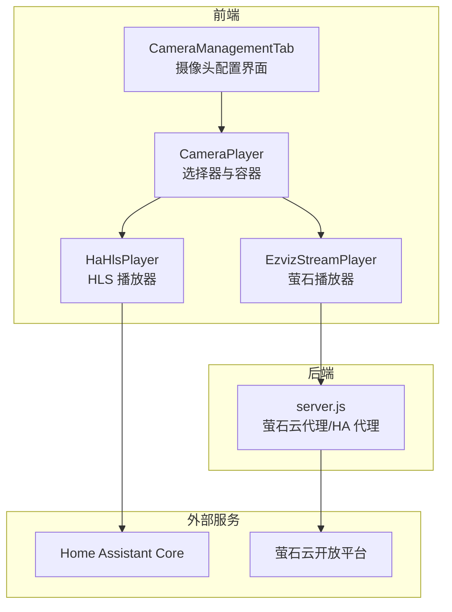
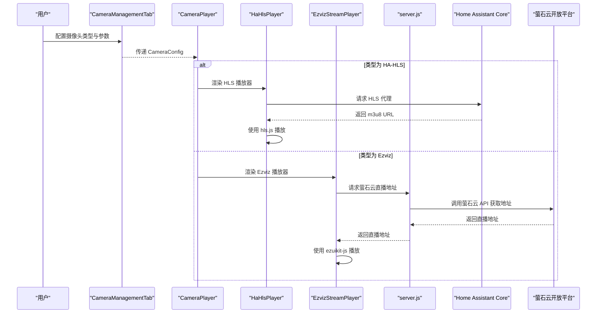
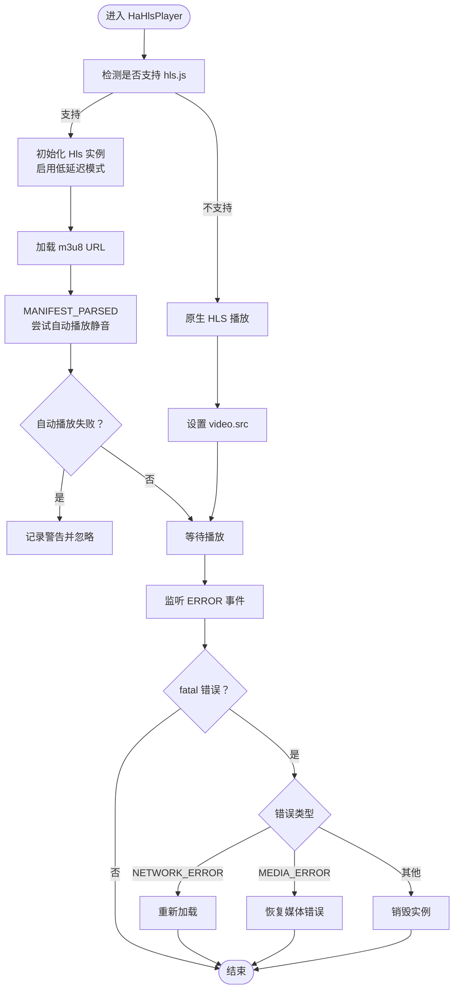
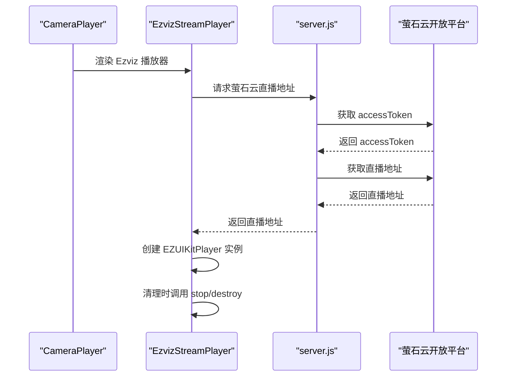
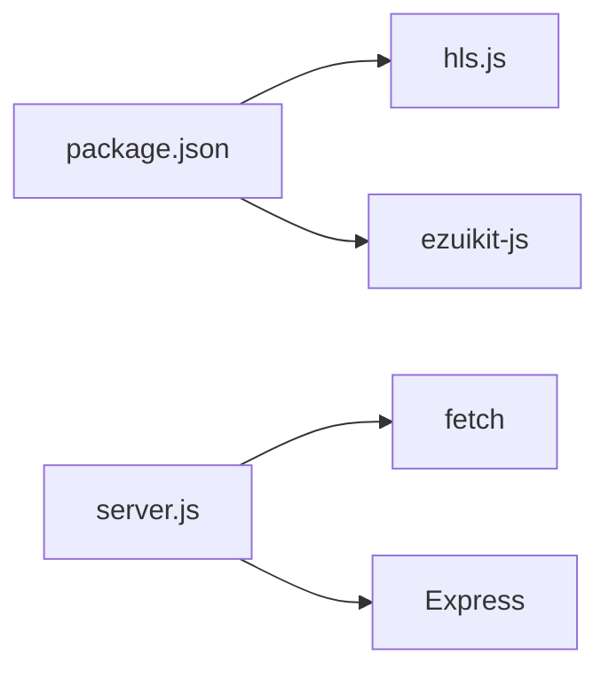

# 流媒体协议支持

<cite>
**本文引用的文件列表**
- [CameraPlayer.tsx](file://src/components/camera/CameraPlayer.tsx)
- [HaHlsPlayer.tsx](file://src/components/camera/HaHlsPlayer.tsx)
- [EzvizStreamPlayer.tsx](file://src/components/camera/EzvizStreamPlayer.tsx)
- [types.ts](file://src/components/camera/types.ts)
- [server.js](file://addon/server.js)
- [CameraManagementTab.tsx](file://src/app/components/settings/CameraManagementTab.tsx)
- [package.json](file://package.json)
- [ezuikit-js.d.ts](file://src/types/ezuikit-js.d.ts)
</cite>

## 目录
1. [简介](#简介)
2. [项目结构](#项目结构)
3. [核心组件](#核心组件)
4. [架构总览](#架构总览)
5. [详细组件分析](#详细组件分析)
6. [依赖关系分析](#依赖关系分析)
7. [性能考量](#性能考量)
8. [故障排查指南](#故障排查指南)
9. [结论](#结论)
10. [附录](#附录)

## 简介
本文件面向流媒体协议支持的技术文档，重点覆盖以下内容：
- HLS 协议在本项目中的实现原理与工作机制，包括 HTTP Live Streaming 的分片播放与自适应码率能力的利用方式
- Ezviz（萤石云）协议的特殊性，包括 SDK 集成、加密传输与设备兼容性处理
- 不同协议的优缺点对比、适用场景与性能表现
- 协议选择策略、降级处理与错误恢复机制
- 协议扩展开发指南，支持新协议的集成与适配

## 项目结构
本项目围绕“摄像头播放器”这一核心功能，采用组件化与插件化的架构组织：
- 前端 React 组件负责渲染与交互，分别针对不同协议封装播放器
- 后端 Node.js 服务提供萤石云 API 代理，隐藏敏感凭据并解决跨域问题
- 配置界面支持摄像头类型与参数的动态配置

图表来源
- [CameraPlayer.tsx:12-87](file://src/components/camera/CameraPlayer.tsx#L12-L87)
- [HaHlsPlayer.tsx:1-100](file://src/components/camera/HaHlsPlayer.tsx#L1-L100)
- [EzvizStreamPlayer.tsx:1-80](file://src/components/camera/EzvizStreamPlayer.tsx#L1-L80)
- [server.js:122-196](file://addon/server.js#L122-L196)
- [CameraManagementTab.tsx:1-188](file://src/app/components/settings/CameraManagementTab.tsx#L1-L188)

章节来源
- [CameraPlayer.tsx:12-87](file://src/components/camera/CameraPlayer.tsx#L12-L87)
- [server.js:122-196](file://addon/server.js#L122-L196)

## 核心组件
- 摄像头播放器选择器：根据摄像头配置类型，动态渲染对应播放器组件
- HLS 播放器：基于 hls.js 的跨平台 HLS 播放实现，含自动播放、错误恢复与资源清理
- 萤石播放器：基于 ezuikit-js SDK 的播放器封装，支持动态导入与兼容处理
- 配置界面：支持摄像头类型切换、URL 与访问令牌输入，提供配置指引

章节来源
- [types.ts:10-16](file://src/components/camera/types.ts#L10-L16)
- [CameraPlayer.tsx:69-75](file://src/components/camera/CameraPlayer.tsx#L69-L75)
- [HaHlsPlayer.tsx:24-87](file://src/components/camera/HaHlsPlayer.tsx#L24-L87)
- [EzvizStreamPlayer.tsx:14-71](file://src/components/camera/EzvizStreamPlayer.tsx#L14-L71)
- [CameraManagementTab.tsx:83-90](file://src/app/components/settings/CameraManagementTab.tsx#L83-L90)

## 架构总览
本项目的流媒体播放架构分为三层：
- 前端播放层：React 组件负责渲染与生命周期管理
- 协议适配层：HLS 与 Ezviz 分别通过第三方库与 SDK 完成播放
- 后端服务层：萤石云 API 代理隐藏凭据并生成可用的直播地址；HA 代理用于统一访问 Home Assistant

图表来源
- [CameraManagementTab.tsx:14-36](file://src/app/components/settings/CameraManagementTab.tsx#L14-L36)
- [CameraPlayer.tsx:69-75](file://src/components/camera/CameraPlayer.tsx#L69-L75)
- [HaHlsPlayer.tsx:12-22](file://src/components/camera/HaHlsPlayer.tsx#L12-L22)
- [EzvizStreamPlayer.tsx:14-46](file://src/components/camera/EzvizStreamPlayer.tsx#L14-L46)
- [server.js:125-196](file://addon/server.js#L125-L196)

## 详细组件分析

### HLS 播放器（HaHlsPlayer）
- 工作机制
  - 通过 hls.js 在不支持 HLS 的环境中播放 m3u8 流
  - 在原生支持 HLS 的环境下（如 iOS Safari）直接使用原生播放
  - 支持低延迟模式与直播同步参数优化
- 自动播放与静音策略
  - 自动播放前需静音，以满足浏览器策略要求
- 错误恢复
  - 监听错误事件，区分网络与媒体错误，执行相应恢复策略
  - fatal 错误时进行重试或销毁重建
- 生命周期管理
  - 组件卸载时销毁 HLS 实例与视频元素，防止内存泄漏

图表来源
- [HaHlsPlayer.tsx:24-87](file://src/components/camera/HaHlsPlayer.tsx#L24-L87)

章节来源
- [HaHlsPlayer.tsx:24-87](file://src/components/camera/HaHlsPlayer.tsx#L24-L87)

### Ezviz 播放器（EzvizStreamPlayer）
- SDK 集成
  - 动态导入 ezuikit-js，避免构建期缺失导致失败
  - 兼容全局挂载与模块导入两种方式
- 参数与模板
  - 传入访问令牌与直播地址，选择播放模板与尺寸
  - 默认静音以保证自动播放成功率
- 生命周期与清理
  - 组件卸载时调用 stop/destroy，避免长连接与对象泄漏

图表来源
- [EzvizStreamPlayer.tsx:14-71](file://src/components/camera/EzvizStreamPlayer.tsx#L14-L71)
- [server.js:125-196](file://addon/server.js#L125-L196)

章节来源
- [EzvizStreamPlayer.tsx:14-71](file://src/components/camera/EzvizStreamPlayer.tsx#L14-L71)
- [server.js:125-196](file://addon/server.js#L125-L196)

### 摄像头播放器选择器（CameraPlayer）
- 根据摄像头类型渲染对应播放器
- 提供全屏与移除操作
- 缺省参数时展示错误提示

章节来源
- [CameraPlayer.tsx:69-83](file://src/components/camera/CameraPlayer.tsx#L69-L83)

### 配置界面（CameraManagementTab）
- 支持摄像头类型切换（HA-HLS / Ezviz）
- 输入流媒体地址与访问令牌
- 提供配置说明与占位符提示

章节来源
- [CameraManagementTab.tsx:83-90](file://src/app/components/settings/CameraManagementTab.tsx#L83-L90)
- [CameraManagementTab.tsx:102-108](file://src/app/components/settings/CameraManagementTab.tsx#L102-L108)
- [CameraManagementTab.tsx:116-122](file://src/app/components/settings/CameraManagementTab.tsx#L116-L122)

## 依赖关系分析
- 前端依赖
  - hls.js：HLS 播放能力
  - ezuikit-js：萤石播放 SDK（动态导入）
- 后端依赖
  - Express：提供代理服务
  - fetch：调用萤石云 API

图表来源
- [package.json:64-64](file://package.json#L64-L64)
- [package.json:13-96](file://package.json#L13-L96)
- [server.js:1-7](file://addon/server.js#L1-L7)

章节来源
- [package.json:64-64](file://package.json#L64-L64)
- [package.json:13-96](file://package.json#L13-L96)
- [server.js:1-7](file://addon/server.js#L1-L7)

## 性能考量
- HLS 低延迟与直播同步
  - 通过低延迟模式与直播同步参数减少首帧与卡顿
- 自动播放与静音
  - 静音策略提升自动播放成功率，降低首帧阻塞
- 资源清理
  - 组件卸载时销毁播放器与视频元素，避免内存泄漏
- SDK 兼容性
  - 动态导入与兼容处理，减少初始化失败概率

章节来源
- [HaHlsPlayer.tsx:31-35](file://src/components/camera/HaHlsPlayer.tsx#L31-L35)
- [HaHlsPlayer.tsx:40-43](file://src/components/camera/HaHlsPlayer.tsx#L40-L43)
- [HaHlsPlayer.tsx:77-86](file://src/components/camera/HaHlsPlayer.tsx#L77-L86)
- [EzvizStreamPlayer.tsx:17-25](file://src/components/camera/EzvizStreamPlayer.tsx#L17-L25)
- [EzvizStreamPlayer.tsx:54-70](file://src/components/camera/EzvizStreamPlayer.tsx#L54-L70)

## 故障排查指南
- HLS 播放失败
  - 检查 m3u8 URL 是否有效与网络连通性
  - 查看浏览器自动播放限制与静音策略
  - 观察错误事件类型并执行对应恢复
- Ezviz 播放失败
  - 确认访问令牌与设备序列号有效
  - 检查萤石云代理接口返回与网络状况
  - 确认 ezuikit-js 是否正确导入或全局可用
- 内存泄漏
  - 确保组件卸载时调用 stop/destroy 与实例销毁

章节来源
- [HaHlsPlayer.tsx:46-62](file://src/components/camera/HaHlsPlayer.tsx#L46-L62)
- [server.js:149-157](file://addon/server.js#L149-L157)
- [server.js:176-184](file://addon/server.js#L176-L184)
- [EzvizStreamPlayer.tsx:54-70](file://src/components/camera/EzvizStreamPlayer.tsx#L54-L70)

## 结论
本项目通过清晰的组件划分与后端代理，实现了对 HLS 与 Ezviz 两大主流流媒体协议的支持。HLS 播放器侧重跨平台兼容与低延迟优化，Ezviz 播放器强调 SDK 集成与动态兼容。整体架构具备良好的扩展性，便于后续接入其他协议。

## 附录

### 协议对比与选择策略
- HLS（HA-HLS）
  - 优点：跨平台兼容性好、生态成熟、低延迟优化空间大
  - 缺点：需要代理服务或浏览器支持
  - 适用场景：跨设备、跨浏览器的统一播放体验
- Ezviz（萤石云）
  - 优点：直连设备、SDK 功能丰富
  - 缺点：需要访问令牌与网络稳定性保障
  - 适用场景：萤石云设备直连、对 SDK 能力有需求

章节来源
- [types.ts:10-16](file://src/components/camera/types.ts#L10-L16)
- [CameraManagementTab.tsx:178-182](file://src/app/components/settings/CameraManagementTab.tsx#L178-L182)

### 错误恢复与降级处理
- HLS
  - 网络错误：重新加载
  - 媒体错误：尝试恢复媒体错误
  - 其他致命错误：销毁实例
- Ezviz
  - 初始化失败：检查 SDK 导入与全局可用性
  - 播放失败：检查令牌与地址有效性

章节来源
- [HaHlsPlayer.tsx:46-62](file://src/components/camera/HaHlsPlayer.tsx#L46-L62)
- [EzvizStreamPlayer.tsx:14-46](file://src/components/camera/EzvizStreamPlayer.tsx#L14-L46)

### 协议扩展开发指南
- 新增协议步骤
  - 定义配置类型：在类型定义中新增协议枚举与字段
  - 实现播放器组件：封装播放逻辑与生命周期管理
  - 配置界面：在设置页增加类型选择与参数输入
  - 后端代理（如需）：提供必要的 API 代理与凭据保护
- 注意事项
  - 保持组件卸载时的资源清理
  - 遵循自动播放策略与静音要求
  - 提供错误事件监听与恢复机制

章节来源
- [types.ts:10-16](file://src/components/camera/types.ts#L10-L16)
- [CameraManagementTab.tsx:83-90](file://src/app/components/settings/CameraManagementTab.tsx#L83-L90)
- [server.js:122-196](file://addon/server.js#L122-L196)