# 视频播放器实现

<cite>
**本文档引用的文件**
- [CameraPlayer.tsx](file://src/components/camera/CameraPlayer.tsx)
- [HaHlsPlayer.tsx](file://src/components/camera/HaHlsPlayer.tsx)
- [EzvizStreamPlayer.tsx](file://src/components/camera/EzvizStreamPlayer.tsx)
- [types.ts](file://src/components/camera/types.ts)
- [CameraDashboard.tsx](file://src/components/camera/CameraDashboard.tsx)
- [useKioskMode.ts](file://src/hooks/useKioskMode.ts)
- [widgetRegistry.tsx](file://src/app/components/dashboard/widgetRegistry.tsx)
- [package.json](file://package.json)
- [cache-manager.ts](file://src/utils/cache-manager.ts)
- [room-inference.worker.ts](file://src/workers/room-inference.worker.ts)
- [README.md](file://README.md)
</cite>

## 更新摘要
**变更内容**
- 更新 EzvizStreamPlayer 组件以反映其完全重写的稳定性改进
- 新增复杂状态管理系统和自动重连逻辑的详细说明
- 增加心跳监控机制和 ResizeObserver 初始化系统的架构分析
- 更新性能优化策略以包含新的稳定性增强功能

## 目录
1. [简介](#简介)
2. [项目结构](#项目结构)
3. [核心组件](#核心组件)
4. [架构概览](#架构概览)
5. [详细组件分析](#详细组件分析)
6. [依赖关系分析](#依赖关系分析)
7. [性能考虑](#性能考虑)
8. [故障排除指南](#故障排除指南)
9. [结论](#结论)
10. [附录](#附录)

## 简介

这是一个基于 React 18 和 TypeScript 的专业视频播放器实现，专为 Home Assistant 生态系统设计。该播放器支持多种视频格式和协议，包括 HLS 流媒体和萤石云(EZVIZ)摄像头协议，提供了完整的播放控制、音视频同步和缓冲管理机制。

**更新** EzvizStreamPlayer 组件经过完全重写，引入了复杂的状态管理、自动重连逻辑、心跳监控和 ResizeObserver 初始化系统，显著提升了摄像头播放器的稳定性。

该实现具有以下核心特性：
- 多协议支持：HLS 流媒体和萤石云原生协议
- **增强稳定性**：复杂的自动重连机制和心跳监控
- 全屏播放：支持标准 DOM API 和浏览器兼容性处理
- 生命周期管理：完善的组件卸载和资源清理机制
- **智能初始化**：基于 ResizeObserver 的容器尺寸检测
- 性能优化：内存管理、GPU 加速和网络优化策略
- 可扩展性：支持自定义播放器组件的开发和集成

## 项目结构

视频播放器系统采用模块化架构，主要组件分布如下：

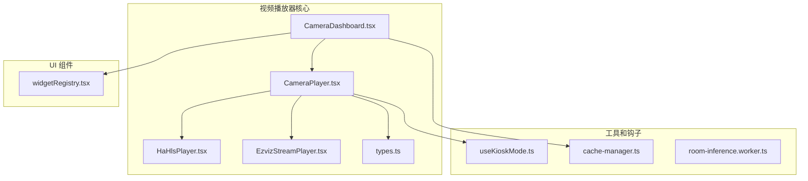

**图表来源**
- [CameraDashboard.tsx:1-154](file://src/components/camera/CameraDashboard.tsx#L1-L154)
- [CameraPlayer.tsx:1-94](file://src/components/camera/CameraPlayer.tsx#L1-L94)
- [HaHlsPlayer.tsx:1-100](file://src/components/camera/HaHlsPlayer.tsx#L1-L100)
- [EzvizStreamPlayer.tsx:1-253](file://src/components/camera/EzvizStreamPlayer.tsx#L1-L253)

**章节来源**
- [CameraDashboard.tsx:1-154](file://src/components/camera/CameraDashboard.tsx#L1-L154)
- [CameraPlayer.tsx:1-94](file://src/components/camera/CameraPlayer.tsx#L1-L94)
- [types.ts:1-24](file://src/components/camera/types.ts#L1-L24)

## 核心组件

### 播放器架构组件

视频播放器系统由以下核心组件构成：

1. **CameraDashboard** - 主控制面板，负责布局管理和组件协调
2. **CameraPlayer** - 单个摄像头播放器容器，提供 UI 控制和全屏功能
3. **HaHlsPlayer** - HLS 流媒体播放器，基于 hls.js 实现
4. **EzvizStreamPlayer** - **增强版**萤石云摄像头播放器，基于 ezuikit-js 库，具备复杂状态管理和自动重连机制
5. **类型定义** - 定义播放器配置和状态的数据结构

### 数据流架构

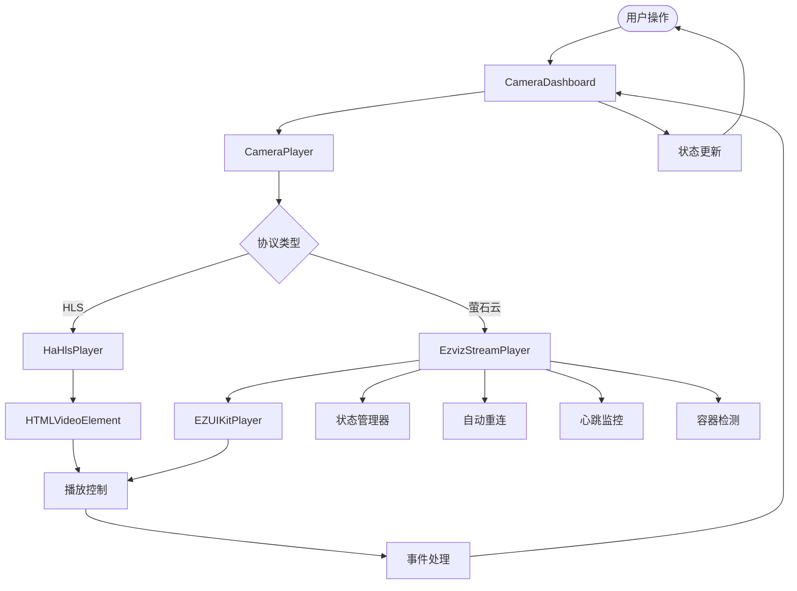

**图表来源**
- [CameraDashboard.tsx:27-154](file://src/components/camera/CameraDashboard.tsx#L27-L154)
- [CameraPlayer.tsx:13-94](file://src/components/camera/CameraPlayer.tsx#L13-L94)
- [HaHlsPlayer.tsx:8-100](file://src/components/camera/HaHlsPlayer.tsx#L8-L100)
- [EzvizStreamPlayer.tsx:18-253](file://src/components/camera/EzvizStreamPlayer.tsx#L18-L253)

**章节来源**
- [CameraDashboard.tsx:27-154](file://src/components/camera/CameraDashboard.tsx#L27-L154)
- [CameraPlayer.tsx:13-94](file://src/components/camera/CameraPlayer.tsx#L13-L94)

## 架构概览

### 整体架构设计

视频播放器采用分层架构设计，实现了清晰的关注点分离：

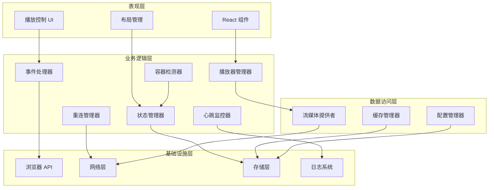

**图表来源**
- [CameraPlayer.tsx:13-94](file://src/components/camera/CameraPlayer.tsx#L13-L94)
- [HaHlsPlayer.tsx:24-87](file://src/components/camera/HaHlsPlayer.tsx#L24-L87)
- [EzvizStreamPlayer.tsx:18-253](file://src/components/camera/EzvizStreamPlayer.tsx#L18-L253)

### 协议适配层

系统通过协议适配器模式支持多种视频协议：

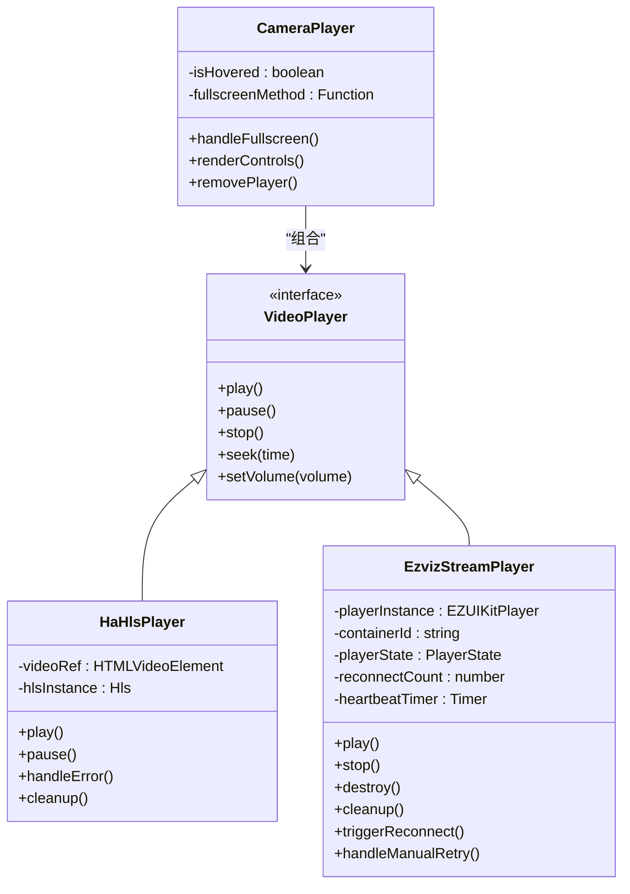

**图表来源**
- [HaHlsPlayer.tsx:4-100](file://src/components/camera/HaHlsPlayer.tsx#L4-L100)
- [EzvizStreamPlayer.tsx:3-253](file://src/components/camera/EzvizStreamPlayer.tsx#L3-L253)
- [CameraPlayer.tsx:7-94](file://src/components/camera/CameraPlayer.tsx#L7-L94)

**章节来源**
- [types.ts:10-24](file://src/components/camera/types.ts#L10-L24)
- [CameraPlayer.tsx:13-94](file://src/components/camera/CameraPlayer.tsx#L13-L94)

## 详细组件分析

### CameraPlayer 组件

CameraPlayer 是视频播放器的核心容器组件，负责提供统一的 UI 控制界面和全屏功能。

#### 组件结构分析

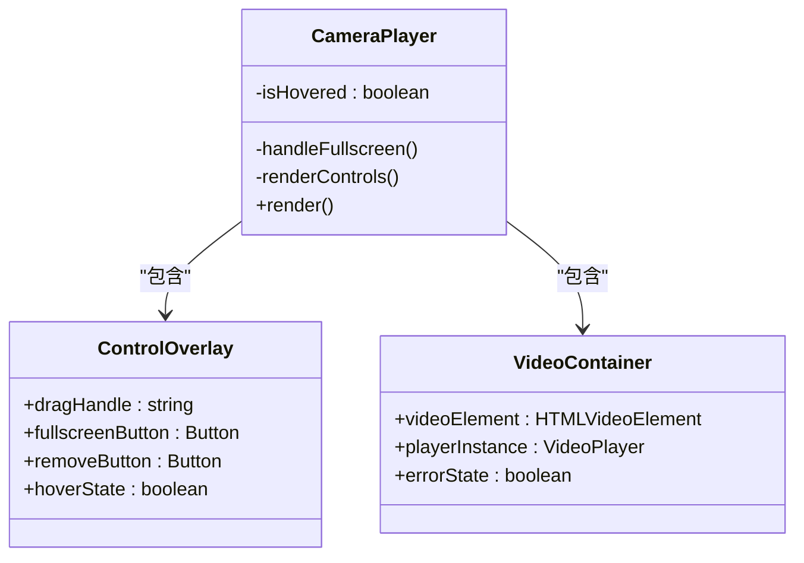

**图表来源**
- [CameraPlayer.tsx:13-94](file://src/components/camera/CameraPlayer.tsx#L13-L94)

#### 全屏播放实现

全屏播放功能通过标准 DOM API 和浏览器兼容性处理实现：

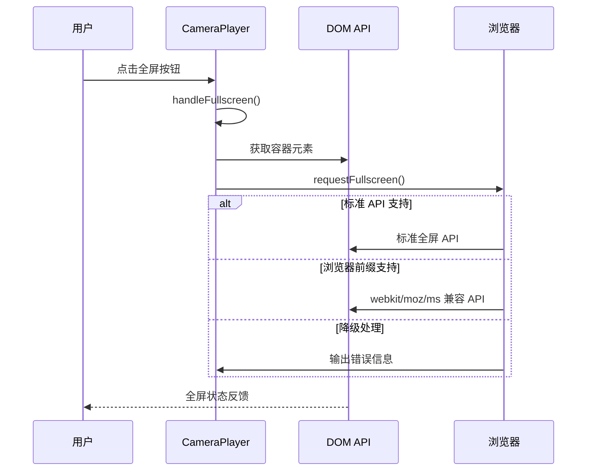

**图表来源**
- [CameraPlayer.tsx:17-26](file://src/components/camera/CameraPlayer.tsx#L17-L26)

**章节来源**
- [CameraPlayer.tsx:13-94](file://src/components/camera/CameraPlayer.tsx#L13-L94)

### HaHlsPlayer 组件

HaHlsPlayer 基于 hls.js 库实现 HLS 流媒体播放，提供了完整的错误处理和自动重连机制。

#### HLS 播放流程

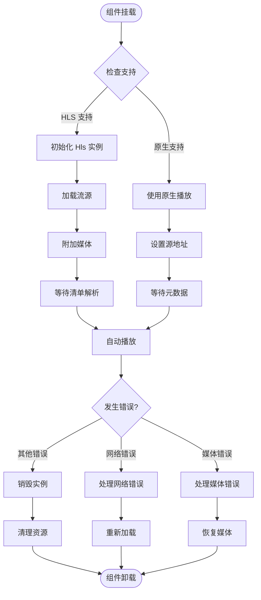

**图表来源**
- [HaHlsPlayer.tsx:24-87](file://src/components/camera/HaHlsPlayer.tsx#L24-L87)

#### 错误处理机制

HaHlsPlayer 实现了多层次的错误处理和恢复机制：

| 错误类型 | 处理策略 | 恢复方法 |
|---------|---------|---------|
| NETWORK_ERROR | 网络重连 | startLoad() |
| MEDIA_ERROR | 媒体恢复 | recoverMediaError() |
| OTHER_ERROR | 完全销毁 | destroy() |

**章节来源**
- [HaHlsPlayer.tsx:24-87](file://src/components/camera/HaHlsPlayer.tsx#L24-L87)

### EzvizStreamPlayer 组件

**更新** EzvizStreamPlayer 经过完全重写，引入了复杂的状态管理系统、自动重连逻辑、心跳监控和 ResizeObserver 初始化系统。

#### 状态管理系统

EzvizStreamPlayer 实现了完整的状态管理机制，支持四种播放状态：

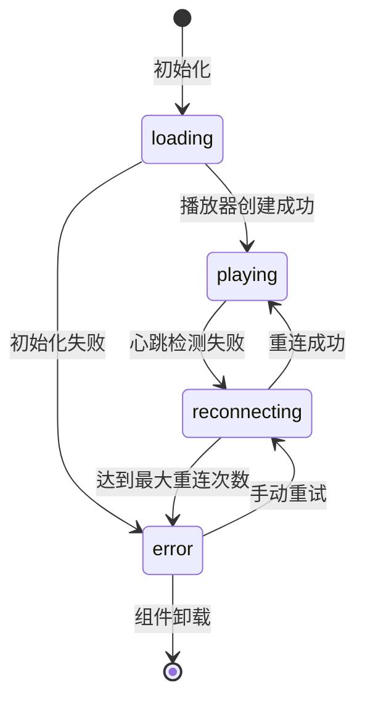

**状态定义**：
- `loading`：播放器初始化中
- `playing`：播放器正常运行
- `error`：播放器出现错误
- `reconnecting`：自动重连中

#### 自动重连机制

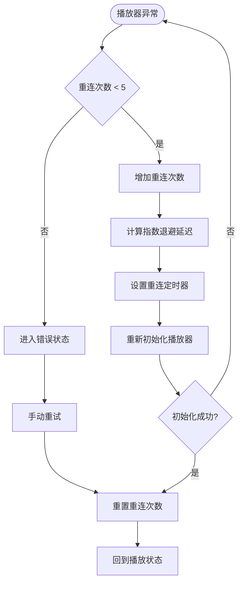

**重连策略**：
- 最大重连次数：5次
- 指数退避延迟：1s, 2s, 4s, 8s, 16s（上限30s）
- 手动重试：立即重置计数器并重连

#### 心跳监控系统

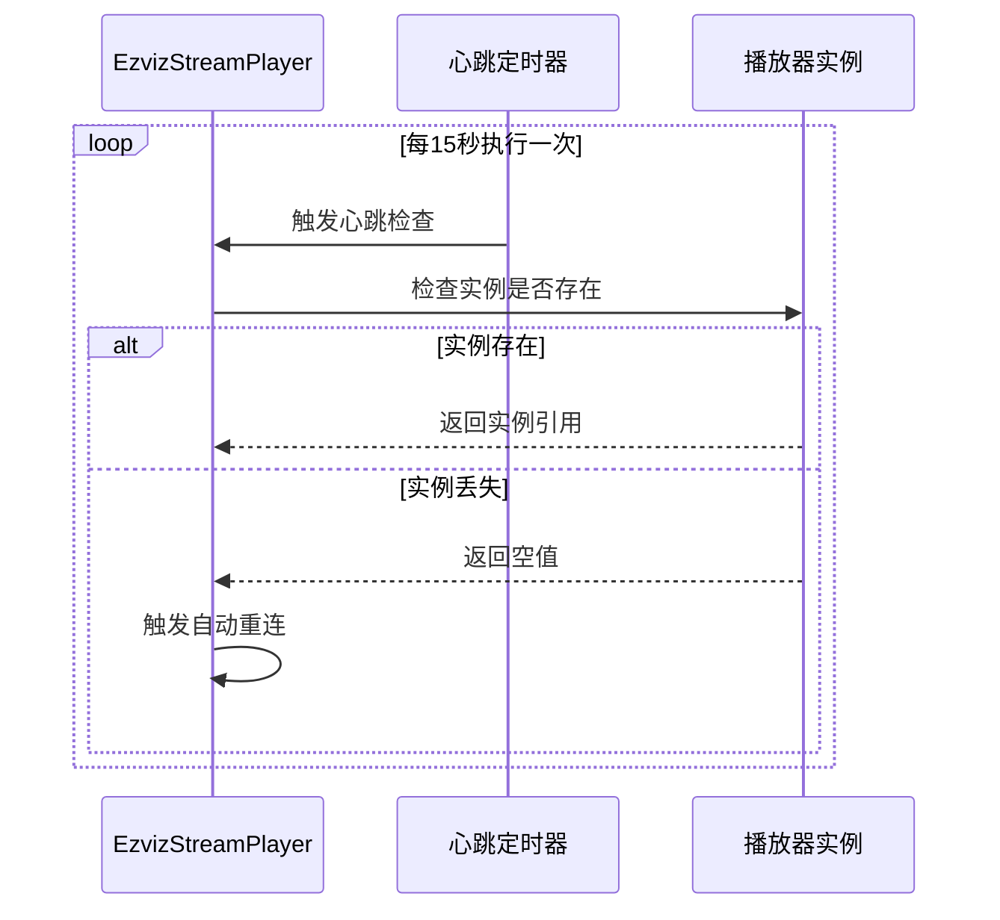

**心跳配置**：
- 检测间隔：15秒
- 检测目标：播放器实例的完整性
- 响应动作：实例丢失时触发重连

#### ResizeObserver 初始化系统

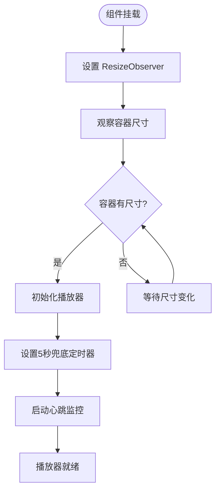

**初始化策略**：
- 使用 ResizeObserver 等待容器有实际尺寸
- 5秒兜底定时器防止极端情况下的初始化失败
- 避免在容器尺寸未知时初始化播放器

#### 动态库加载机制

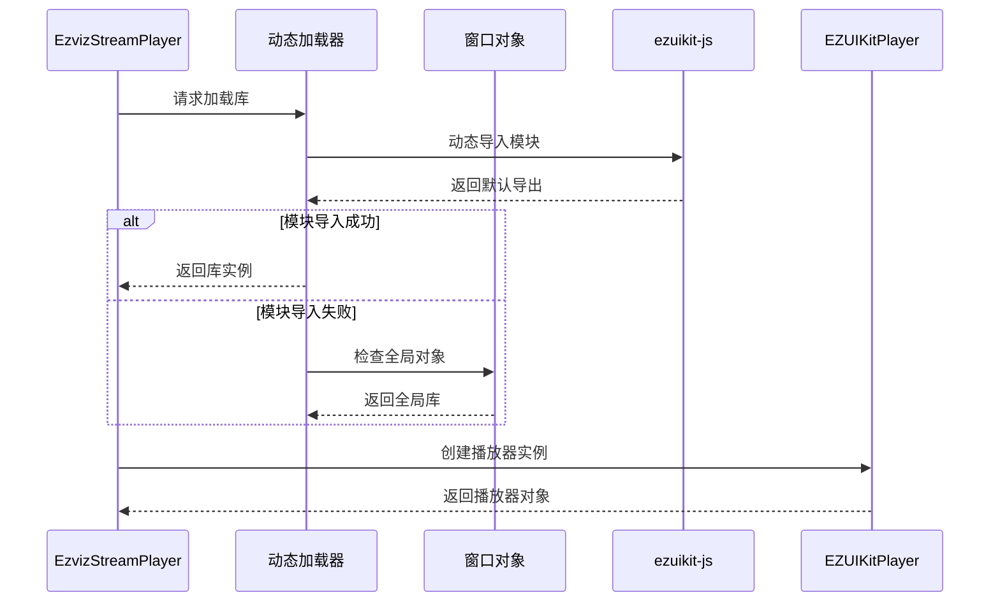

**兼容性处理**：
- 支持 npm 模块导入
- 回退到全局 window.EZUIKit 对象
- 容错处理避免初始化失败

**章节来源**
- [EzvizStreamPlayer.tsx:18-253](file://src/components/camera/EzvizStreamPlayer.tsx#L18-L253)

### CameraDashboard 组件

CameraDashboard 提供了完整的视频监控面板功能，包括多摄像头管理、布局控制和响应式设计。

#### 布局管理系统

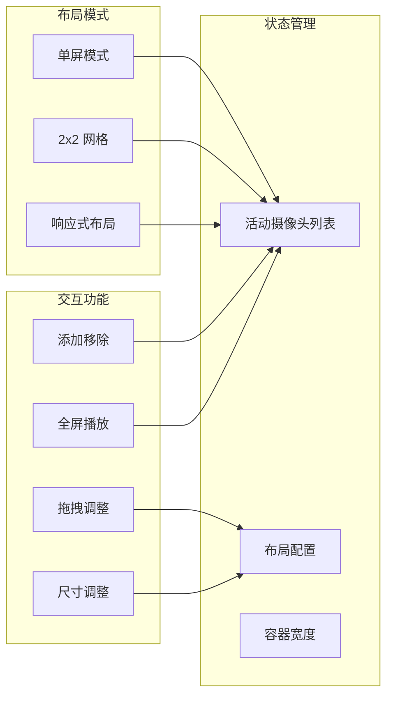

**图表来源**
- [CameraDashboard.tsx:27-154](file://src/components/camera/CameraDashboard.tsx#L27-L154)

**章节来源**
- [CameraDashboard.tsx:27-154](file://src/components/camera/CameraDashboard.tsx#L27-L154)

## 依赖关系分析

### 核心依赖关系

视频播放器系统的依赖关系体现了清晰的分层架构：

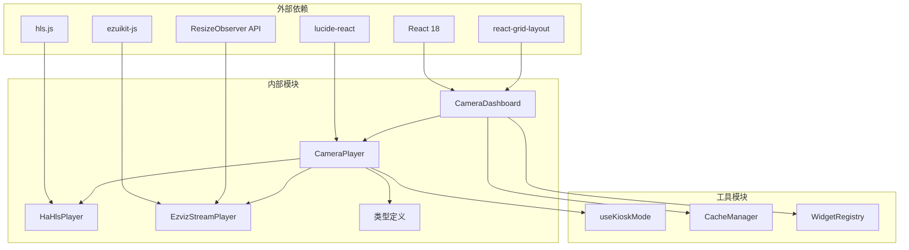

**图表来源**
- [package.json:13-96](file://package.json#L13-L96)
- [CameraDashboard.tsx:1-154](file://src/components/camera/CameraDashboard.tsx#L1-L154)

### 组件耦合度分析

| 组件 | 内聚性 | 耦合度 | 说明 |
|------|--------|--------|------|
| CameraPlayer | 高 | 低 | 专注于 UI 控制和全屏功能 |
| HaHlsPlayer | 高 | 中 | 专注 HLS 播放和错误处理 |
| **EzvizStreamPlayer** | **高** | **中** | **专注萤石云播放，具备复杂状态管理** |
| CameraDashboard | 中 | 高 | 需要协调多个子组件 |
| useKioskMode | 低 | 低 | 独立的功能钩子 |

**更新** EzvizStreamPlayer 组件虽然内聚性高，但由于引入了复杂的状态管理机制，其耦合度相比之前版本有所增加，但这是为了实现更好的稳定性而做出的设计权衡。

**章节来源**
- [package.json:13-96](file://package.json#L13-L96)
- [CameraPlayer.tsx:13-94](file://src/components/camera/CameraPlayer.tsx#L13-L94)

## 性能考虑

### 内存管理策略

视频播放器实现了多层次的内存管理策略来防止内存泄漏：

1. **组件生命周期清理**：每个播放器组件都实现了完整的清理函数
2. **资源引用管理**：使用 useRef 管理 DOM 引用和播放器实例
3. **定时器清理**：及时清理异步定时器和事件监听器
4. **WebSocket 连接管理**：确保萤石云播放器的长连接正确关闭
5. **心跳定时器管理**：专门的清理逻辑确保心跳监控不会造成内存泄漏

### GPU 加速优化

系统充分利用浏览器的硬件加速能力：

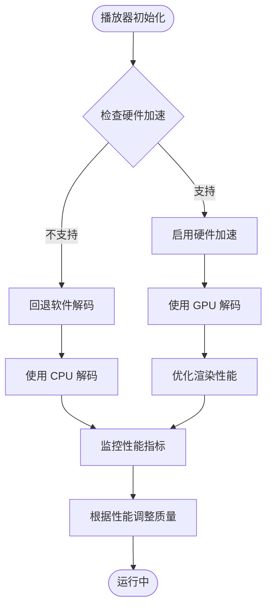

### 网络优化策略

针对视频流媒体的网络优化采用了以下策略：

1. **低延迟配置**：HLS 播放器启用了低延迟模式
2. **智能重连机制**：网络中断时自动重连
3. **错误恢复策略**：区分不同类型的错误并采取相应恢复措施
4. **缓存管理**：使用本地存储管理配置和状态
5. **心跳监控**：实时检测播放器状态，避免无效的网络请求

**更新** EzvizStreamPlayer 的稳定性改进包括：
- **指数退避重连**：避免频繁重连造成的网络压力
- **最大重连次数限制**：防止无限重连导致的资源浪费
- **心跳监控**：主动检测播放器状态，及时发现并处理异常
- **ResizeObserver 优化**：智能等待容器尺寸，避免无效初始化

**章节来源**
- [HaHlsPlayer.tsx:31-62](file://src/components/camera/HaHlsPlayer.tsx#L31-L62)
- [EzvizStreamPlayer.tsx:127-149](file://src/components/camera/EzvizStreamPlayer.tsx#L127-L149)
- [cache-manager.ts:1-57](file://src/utils/cache-manager.ts#L1-L57)

## 故障排除指南

### 常见问题诊断

#### 播放器无法启动

**症状**：播放器显示错误状态但无法播放

**可能原因**：
1. 缺少必要的播放器库
2. URL 配置错误
3. 浏览器自动播放限制
4. **容器尺寸未就绪**（新增）

**解决方案**：
1. 检查网络连接和 URL 可访问性
2. 确认浏览器允许自动播放
3. 验证播放器库是否正确加载
4. **等待容器尺寸变化或检查兜底定时器**（新增）

#### 全屏功能失效

**症状**：点击全屏按钮无反应

**可能原因**：
1. 浏览器不支持全屏 API
2. 安全策略限制
3. DOM 结构问题

**解决方案**：
1. 检查浏览器兼容性
2. 确认页面不是在 iframe 中
3. 验证 DOM 元素存在

#### 内存泄漏问题

**症状**：长时间使用后页面变得缓慢

**可能原因**：
1. 组件卸载时未清理资源
2. 事件监听器未移除
3. 定时器未清理
4. **心跳定时器未正确清理**（新增）

**解决方案**：
1. 确保每个组件都有清理函数
2. 在 useEffect 清理函数中移除所有监听器
3. 及时清理定时器和 WebSocket 连接
4. **验证心跳定时器的清理逻辑**（新增）

#### **萤石云播放器不稳定**

**更新** 新增的故障排除指南：

**症状**：萤石云播放器频繁断开连接

**可能原因**：
1. **网络波动**（新增）
2. **播放器实例意外销毁**（新增）
3. **容器尺寸变化**（新增）

**解决方案**：
1. **检查网络连接稳定性**（新增）
2. **监控心跳定时器状态**（新增）
3. **验证 ResizeObserver 初始化**（新增）
4. **使用手动重试功能**（新增）

#### **自动重连失败**

**症状**：播放器多次重连但仍无法播放

**可能原因**：
1. **达到最大重连次数**（新增）
2. **初始化参数错误**（新增）
3. **库加载失败**（新增）

**解决方案**：
1. **检查最大重连次数配置**（新增）
2. **验证播放器初始化参数**（新增）
3. **确认 ezuikit-js 库可用性**（新增）

**章节来源**
- [HaHlsPlayer.tsx:77-87](file://src/components/camera/HaHlsPlayer.tsx#L77-L87)
- [EzvizStreamPlayer.tsx:54-71](file://src/components/camera/EzvizStreamPlayer.tsx#L54-L71)
- [EzvizStreamPlayer.tsx:127-149](file://src/components/camera/EzvizStreamPlayer.tsx#L127-L149)

## 结论

该视频播放器实现展现了现代前端开发的最佳实践，具有以下突出特点：

### 技术优势

1. **架构清晰**：采用分层架构和协议适配器模式，实现了良好的可维护性
2. **性能优秀**：通过硬件加速、智能缓存和资源管理确保流畅体验
3. **兼容性强**：支持多种浏览器和播放协议，提供优雅的降级方案
4. **扩展性好**：模块化设计便于添加新的播放器类型和功能
5. ****稳定性卓越**：**通过复杂的状态管理、自动重连和心跳监控机制显著提升系统稳定性**

### 架构亮点

- **生命周期管理**：每个组件都有完善的资源清理机制
- **错误处理**：多层次的错误检测和恢复策略
- **状态管理**：清晰的状态流转和事件处理机制
- **性能优化**：从内存管理到网络优化的全方位优化
- ****智能初始化**：**基于 ResizeObserver 的容器尺寸检测，避免无效初始化**
- ****自动重连**：**指数退避算法和最大重连次数限制，平衡稳定性与资源消耗**
- ****心跳监控**：**实时检测播放器状态，及时发现并处理异常**

### 改进总结

**更新** EzvizStreamPlayer 的重大改进包括：

1. **状态管理增强**：实现了完整的播放器状态生命周期管理
2. **自动重连机制**：基于指数退避算法的智能重连策略
3. **心跳监控系统**：15秒间隔的心跳检测，确保播放器实例完整性
4. **ResizeObserver 初始化**：智能等待容器尺寸，避免早期初始化失败
5. **错误处理优化**：多重容错处理，提升系统鲁棒性

### 改进建议

1. **监控指标**：可以添加更详细的性能监控和错误追踪
2. **配置管理**：实现更灵活的播放器配置选项
3. **测试覆盖**：增加更多的单元测试和集成测试
4. **文档完善**：为自定义播放器开发提供更详细的指导
5. ****稳定性监控**：**添加播放器状态监控和告警机制**

该实现为 Home Assistant 生态系统提供了一个强大而可靠的视频播放解决方案，为未来的功能扩展奠定了坚实的基础。

## 附录

### API 参考

#### CameraConfig 接口

| 字段 | 类型 | 必需 | 描述 |
|------|------|------|------|
| id | string | 是 | 摄像头标识符 |
| name | string | 是 | 摄像头名称 |
| type | 'ezviz' \| 'ha-hls' \| 'rtsp' | 是 | 播放协议类型 |
| url | string | 否 | 流媒体 URL |
| accessToken | string | 否 | 萤石云访问令牌 |
| go2rtcUrl | string | 否 | go2rtc 服务地址 |
| streamName | string | 否 | go2rtc 中配置的流名称 |

#### 播放器组件属性

| 属性 | 类型 | 必需 | 描述 |
|------|------|------|------|
| config | CameraConfig | 是 | 播放器配置 |
| onRemove | Function | 是 | 移除回调函数 |

### 配置选项

系统支持以下配置选项：

1. **HLS 播放器配置**：
   - 低延迟模式：`lowLatencyMode: true`
   - 同步计数：`liveSyncDurationCount: 3`

2. **萤石云播放器配置**：
   - 模板选择：`template: 'standard'`
   - 音频控制：`audio: 0`（初始静音）
   - **状态管理**：`playerState: 'loading' | 'playing' | 'error' | 'reconnecting'`
   - **重连配置**：`MAX_RECONNECT: 5`

3. **布局配置**：
   - 响应式网格：12 列布局
   - 最小单元：40px 行高
   - 边距设置：16px 水平和垂直边距

### **稳定性配置参数**

**更新** 新增的稳定性配置参数：

| 参数 | 默认值 | 描述 |
|------|--------|------|
| **HEARTBEAT_INTERVAL** | 15000ms | 心跳检测间隔 |
| **MAX_RECONNECT** | 5 | 最大自动重连次数 |
| **INITIAL_DELAY** | 1000ms | 初始重连延迟 |
| **MAX_DELAY** | 30000ms | 最大重连延迟 |
| **RESIZE_OBSERVER_TIMEOUT** | 5000ms | ResizeObserver 超时时间 |