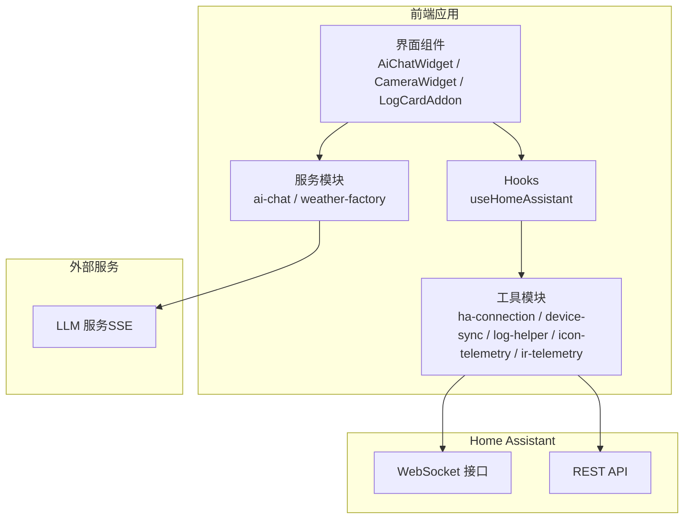
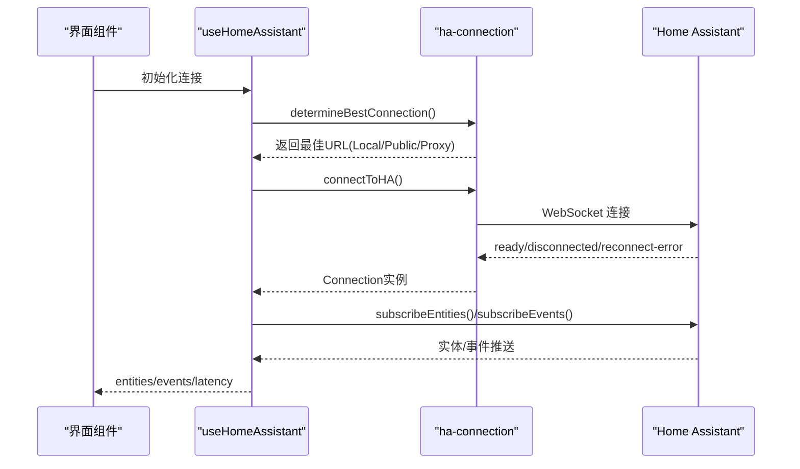
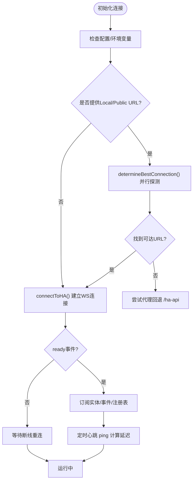
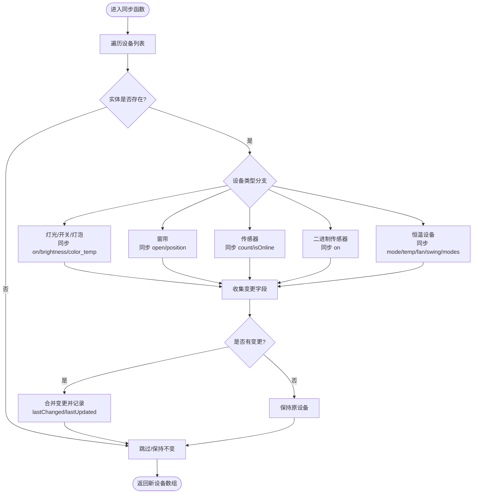
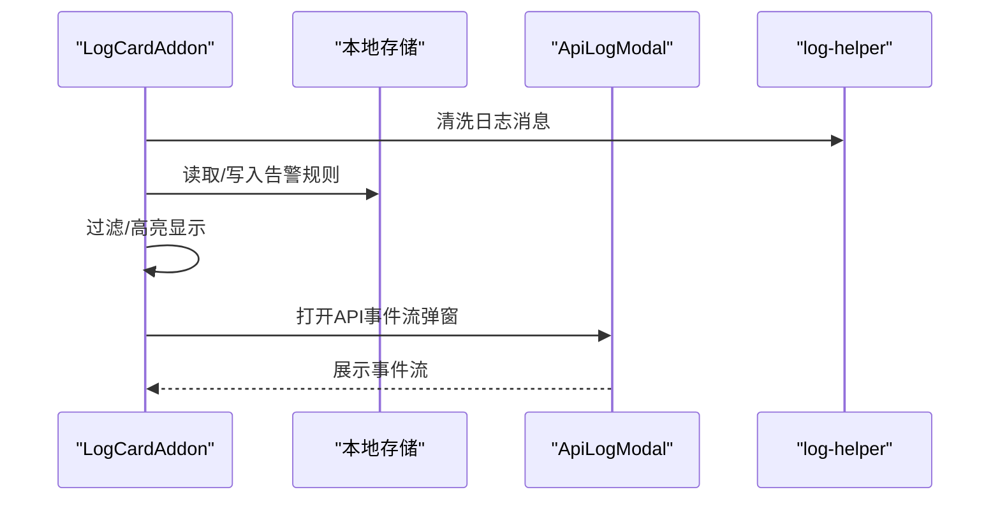
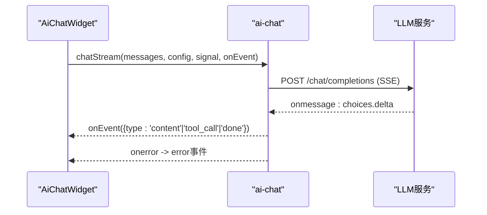
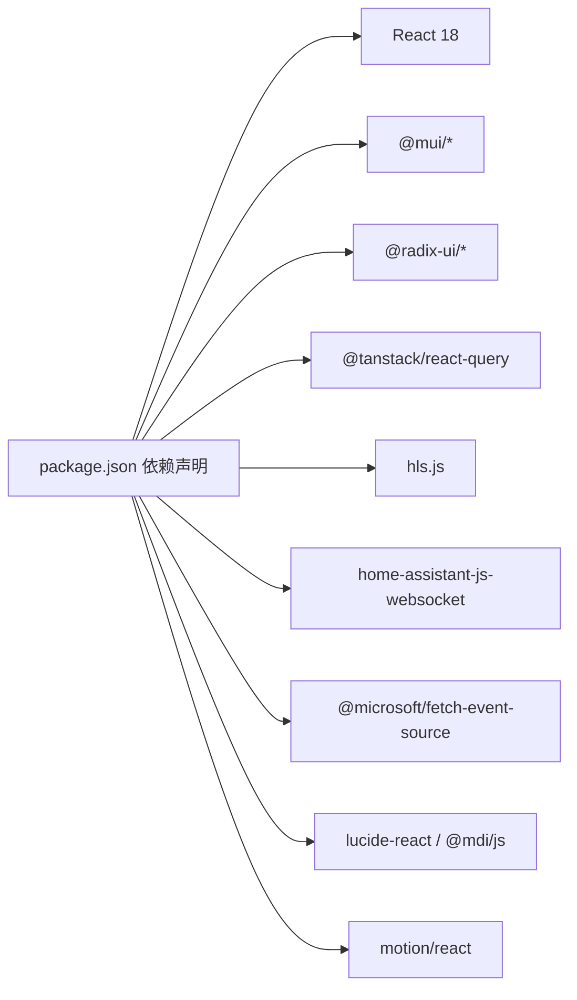

# 故障排除指南

<cite>
**本文引用的文件**   
- [README.md](file://README.md)
- [package.json](file://package.json)
- [src/utils/log-helper.ts](file://src/utils/log-helper.ts)
- [src/app/components/ErrorBoundary.tsx](file://src/app/components/ErrorBoundary.tsx)
- [src/services/ai-chat.ts](file://src/services/ai-chat.ts)
- [src/utils/device-sync.ts](file://src/utils/device-sync.ts)
- [src/utils/ha-connection.ts](file://src/utils/ha-connection.ts)
- [src/app/components/AiChatWidget.tsx](file://src/app/components/AiChatWidget.tsx)
- [src/app/components/dashboard/widgets/CameraWidget.tsx](file://src/app/components/dashboard/widgets/CameraWidget.tsx)
- [src/app/components/LogCardAddon.tsx](file://src/app/components/LogCardAddon.tsx)
- [src/app/components/ApiLogModal.tsx](file://src/app/components/ApiLogModal.tsx)
- [src/app/components/LogHistoryModal.tsx](file://src/app/components/LogHistoryModal.tsx)
- [src/utils/ir-telemetry.ts](file://src/utils/ir-telemetry.ts)
- [src/utils/icon-telemetry.ts](file://src/utils/icon-telemetry.ts)
- [src/hooks/useHomeAssistant.ts](file://src/hooks/useHomeAssistant.ts)
- [src/services/weather/weather-factory.ts](file://src/services/weather/weather-factory.ts)
</cite>

## 目录
1. [简介](#简介)
2. [项目结构](#项目结构)
3. [核心组件](#核心组件)
4. [架构总览](#架构总览)
5. [详细组件分析](#详细组件分析)
6. [依赖关系分析](#依赖关系分析)
7. [性能考虑](#性能考虑)
8. [故障排除指南](#故障排除指南)
9. [结论](#结论)
10. [附录](#附录)

## 简介
本指南面向HAUI项目的使用者与维护者，聚焦于常见问题的快速定位与解决，涵盖日志系统使用、调试工具配置、性能分析、网络连接与设备通信故障排查、用户反馈典型问题与预防措施，并提供错误代码对照表、诊断工具使用说明以及专家级处理方法。文档同时给出社区支持渠道与问题反馈流程，帮助团队高效协作。

## 项目结构
HAUI是一个基于React 18、Vite与Tailwind CSS构建的专业AI智能家居仪表板，具备全双工语音交互、iOS风格视觉与多窗口摄像头监控能力。前端通过WebSocket与Home Assistant交互，支持本地/公网URL自动探测与代理回退；AI对话通过SSE直连外部LLM服务；日志与遥测模块用于问题定位与性能观测。

**图表来源**
- [src/app/components/AiChatWidget.tsx:1-678](file://src/app/components/AiChatWidget.tsx#L1-L678)
- [src/app/components/dashboard/widgets/CameraWidget.tsx:1-96](file://src/app/components/dashboard/widgets/CameraWidget.tsx#L1-L96)
- [src/app/components/LogCardAddon.tsx:1-393](file://src/app/components/LogCardAddon.tsx#L1-L393)
- [src/hooks/useHomeAssistant.ts:1-313](file://src/hooks/useHomeAssistant.ts#L1-L313)
- [src/utils/ha-connection.ts:1-317](file://src/utils/ha-connection.ts#L1-L317)
- [src/services/ai-chat.ts:1-153](file://src/services/ai-chat.ts#L1-L153)
- [src/services/weather/weather-factory.ts:1-21](file://src/services/weather/weather-factory.ts#L1-L21)

**章节来源**
- [README.md:1-84](file://README.md#L1-L84)
- [package.json:1-132](file://package.json#L1-L132)

## 核心组件
- 连接与事件订阅：通过自定义Hook封装HA连接、实体订阅、事件监听与注册表拉取，内置心跳与断线重连策略。
- 设备状态同步：根据实体属性与状态，同步灯光、窗帘、传感器、恒温设备等的状态与属性变更。
- 日志与告警：提供日志卡片扩展、历史日志弹窗与API事件流查看器，支持关键词检索与告警规则持久化。
- AI对话：直接通过SSE与外部LLM服务通信，支持工具调用与流式输出，具备错误事件处理。
- 摄像头播放：多源摄像头播放器集成，支持HLS与萤石协议，提供选择与配置入口。
- 遥测与性能：图标加载性能与错误遥测，支持本地调试开关。

**章节来源**
- [src/hooks/useHomeAssistant.ts:1-313](file://src/hooks/useHomeAssistant.ts#L1-L313)
- [src/utils/device-sync.ts:1-191](file://src/utils/device-sync.ts#L1-L191)
- [src/app/components/LogCardAddon.tsx:1-393](file://src/app/components/LogCardAddon.tsx#L1-L393)
- [src/app/components/ApiLogModal.tsx:1-53](file://src/app/components/ApiLogModal.tsx#L1-L53)
- [src/services/ai-chat.ts:1-153](file://src/services/ai-chat.ts#L1-L153)
- [src/app/components/dashboard/widgets/CameraWidget.tsx:1-96](file://src/app/components/dashboard/widgets/CameraWidget.tsx#L1-L96)
- [src/utils/icon-telemetry.ts:1-59](file://src/utils/icon-telemetry.ts#L1-L59)
- [src/utils/ir-telemetry.ts:1-21](file://src/utils/ir-telemetry.ts#L1-L21)

## 架构总览
HAUI前端通过useHomeAssistant建立与HA的双向通信，订阅实体状态与事件，同时支持REST回退与代理路径。AI对话通过独立服务直连外部LLM，日志与遥测模块贯穿运行时问题定位。

**图表来源**
- [src/hooks/useHomeAssistant.ts:61-120](file://src/hooks/useHomeAssistant.ts#L61-L120)
- [src/utils/ha-connection.ts:193-238](file://src/utils/ha-connection.ts#L193-L238)
- [src/utils/ha-connection.ts:47-105](file://src/utils/ha-connection.ts#L47-L105)

## 详细组件分析

### 组件A：网络连接与设备通信（useHomeAssistant + ha-connection）
- 关键职责：自动探测本地/公网URL、代理回退、心跳与延迟测量、实体订阅、事件订阅、注册表拉取、REST回退。
- 断线重连：断开后5秒重试，避免频繁重建连接。
- 错误分类：区分网络不可达与鉴权失败，抛出明确错误信息。
- 性能指标：每10秒一次ping，计算往返延迟。

**图表来源**
- [src/hooks/useHomeAssistant.ts:61-120](file://src/hooks/useHomeAssistant.ts#L61-L120)
- [src/utils/ha-connection.ts:193-238](file://src/utils/ha-connection.ts#L193-L238)
- [src/utils/ha-connection.ts:47-105](file://src/utils/ha-connection.ts#L47-L105)

**章节来源**
- [src/hooks/useHomeAssistant.ts:1-313](file://src/hooks/useHomeAssistant.ts#L1-L313)
- [src/utils/ha-connection.ts:1-317](file://src/utils/ha-connection.ts#L1-L317)

### 组件B：设备状态同步（device-sync）
- 同步范围：灯光/开关/灯泡亮度/色温、窗帘位置/开关、传感器数值/在线状态、二进制传感器、恒温设备模式/温度/风档/摆风等。
- 变更检测：比较实体状态与属性，仅在必要字段变化时更新设备对象，减少渲染与副作用。
- 可用性判断：依据实体状态判定“可用/未知”，并同步last_updated/last_changed时间戳。

**图表来源**
- [src/utils/device-sync.ts:4-191](file://src/utils/device-sync.ts#L4-L191)

**章节来源**
- [src/utils/device-sync.ts:1-191](file://src/utils/device-sync.ts#L1-L191)

### 组件C：日志系统与告警（LogCardAddon + ApiLogModal + LogHistoryModal + log-helper）
- 日志过滤：支持关键词与级别过滤，高亮匹配项；告警模式下展示最近N条上下文。
- 告警规则：本地持久化规则，支持新增/删除；触发后切换到告警视图。
- API事件流：弹窗展示HA事件流，标注时间与类型，便于实时观察。
- 日志清洗：数字精度清洗与常用英文术语翻译，提升可读性。

**图表来源**
- [src/app/components/LogCardAddon.tsx:1-393](file://src/app/components/LogCardAddon.tsx#L1-L393)
- [src/app/components/ApiLogModal.tsx:1-53](file://src/app/components/ApiLogModal.tsx#L1-L53)
- [src/app/components/LogHistoryModal.tsx:1-53](file://src/app/components/LogHistoryModal.tsx#L1-L53)
- [src/utils/log-helper.ts:1-33](file://src/utils/log-helper.ts#L1-L33)

**章节来源**
- [src/app/components/LogCardAddon.tsx:1-393](file://src/app/components/LogCardAddon.tsx#L1-L393)
- [src/app/components/ApiLogModal.tsx:1-53](file://src/app/components/ApiLogModal.tsx#L1-L53)
- [src/app/components/LogHistoryModal.tsx:1-53](file://src/app/components/LogHistoryModal.tsx#L1-L53)
- [src/utils/log-helper.ts:1-33](file://src/utils/log-helper.ts#L1-L33)

### 组件D：AI对话（AiChatWidget + ai-chat）
- SSE直连：通过fetch-event-source与外部LLM服务通信，支持工具调用与流式增量输出。
- 错误处理：HTTP错误解析、网络中断事件、数据片段解析异常均以事件形式上报。
- 语音模式：支持语音识别与TTS朗读，状态指示器可视化当前阶段。

**图表来源**
- [src/app/components/AiChatWidget.tsx:1-678](file://src/app/components/AiChatWidget.tsx#L1-L678)
- [src/services/ai-chat.ts:25-153](file://src/services/ai-chat.ts#L25-L153)

**章节来源**
- [src/app/components/AiChatWidget.tsx:1-678](file://src/app/components/AiChatWidget.tsx#L1-L678)
- [src/services/ai-chat.ts:1-153](file://src/services/ai-chat.ts#L1-L153)

### 组件E：摄像头播放（CameraWidget）
- 摄像头选择：从HA配置中读取可用摄像头，支持下拉切换。
- 播放器集成：统一渲染播放器，编辑模式下提供配置入口与设置按钮。

**章节来源**
- [src/app/components/dashboard/widgets/CameraWidget.tsx:1-96](file://src/app/components/dashboard/widgets/CameraWidget.tsx#L1-L96)

### 组件F：遥测与性能（icon-telemetry / ir-telemetry）
- 图标遥测：记录图标加载性能与错误，带去重窗口，支持本地调试开关。
- 红外遥测：发射IR发送事件，携带设备ID、实体ID、编码、时间戳与结果。

**章节来源**
- [src/utils/icon-telemetry.ts:1-59](file://src/utils/icon-telemetry.ts#L1-L59)
- [src/utils/ir-telemetry.ts:1-21](file://src/utils/ir-telemetry.ts#L1-L21)

## 依赖关系分析
- 前端依赖：React 18、@emotion、@mui/material、@radix-ui、@tanstack/react-query、hls.js、home-assistant-js-websocket、@microsoft/fetch-event-source、lucide-react、motion等。
- 开发与测试：Vite、TailwindCSS、Cypress、Playwright、Vitest、ESLint等。
- 项目特性：图标搜索在Web Worker中执行、虚拟列表渲染、MDI图标CSS mask渲染、性能调试开关。

**图表来源**
- [package.json:13-96](file://package.json#L13-L96)

**章节来源**
- [package.json:1-132](file://package.json#L1-L132)
- [README.md:37-83](file://README.md#L37-L83)

## 性能考虑
- 图标性能：Web Worker执行搜索、虚拟列表渲染、CSS mask加载SVG，避免主线程阻塞与大量DOM节点。
- 事件流：SSE增量输出，避免一次性渲染大块内容。
- 连接优化：心跳10秒一次，断线重连5秒间隔，代理回退降低跨域影响。
- 缓存与清理：错误边界提供缓存清理与刷新入口，减少异常状态累积。

**章节来源**
- [README.md:37-83](file://README.md#L37-L83)
- [src/app/components/ErrorBoundary.tsx:1-51](file://src/app/components/ErrorBoundary.tsx#L1-L51)
- [src/hooks/useHomeAssistant.ts:37-59](file://src/hooks/useHomeAssistant.ts#L37-L59)

## 故障排除指南

### 一、网络连接问题
- 症状
  - 仪表板空白或加载缓慢
  - 实时状态不同步
  - API事件流弹窗无数据
- 原因分析
  - URL配置错误或网络不可达
  - Token无效或过短
  - CORS限制导致HTTP探测失败但WebSocket可用
  - 代理路径/反向代理未正确转发
- 解决步骤
  - 使用“最佳连接探测”确认Local/Public可达性
  - 若默认连接失败，启用代理回退（/ha-api）
  - 校验VITE_HA_URL与VITE_HA_TOKEN，确保非默认占位符
  - 在DevTools中开启图标调试开关以辅助定位资源问题
  - 查看API事件流弹窗，确认事件是否到达
- 诊断要点
  - 心跳延迟与断线事件
  - 可用性检查与WebSocket验证
  - REST回退路径有效性

**章节来源**
- [src/utils/ha-connection.ts:193-238](file://src/utils/ha-connection.ts#L193-L238)
- [src/utils/ha-connection.ts:244-296](file://src/utils/ha-connection.ts#L244-L296)
- [src/hooks/useHomeAssistant.ts:61-120](file://src/hooks/useHomeAssistant.ts#L61-L120)
- [src/app/components/ApiLogModal.tsx:1-53](file://src/app/components/ApiLogModal.tsx#L1-L53)

### 二、设备通信故障
- 症状
  - 控制指令无响应
  - 设备状态不同步或闪烁
  - 传感器数值长时间未更新
- 原因分析
  - 实体不存在或被禁用
  - 设备类映射不匹配
  - 属性缺失或状态异常（unavailable/unknown）
  - 服务调用失败或权限不足
- 解决步骤
  - 检查实体ID与映射关系
  - 核对设备类型分支与属性字段
  - 使用REST接口单独验证实体状态
  - 通过事件流观察state_changed事件
  - 在错误边界中清理缓存并刷新页面
- 诊断要点
  - device-sync变更检测与last_updated/last_changed
  - 服务调用异常堆栈
  - 事件订阅与实体订阅是否生效

**章节来源**
- [src/utils/device-sync.ts:1-191](file://src/utils/device-sync.ts#L1-L191)
- [src/hooks/useHomeAssistant.ts:212-248](file://src/hooks/useHomeAssistant.ts#L212-L248)
- [src/app/components/ErrorBoundary.tsx:1-51](file://src/app/components/ErrorBoundary.tsx#L1-L51)

### 三、系统性能问题
- 症状
  - 页面卡顿、输入延迟
  - 图标加载慢或闪烁
  - 日志面板滚动卡顿
- 原因分析
  - 图标搜索未在Worker中执行
  - 未启用虚拟列表或DOM节点过多
  - MDI图标未使用CSS mask
  - 未开启性能调试日志
- 解决步骤
  - 确认Web Worker与虚拟列表已启用
  - 使用CSS mask加载图标资源
  - 在DevTools中设置localStorage.debug-icons=1
  - 分析图标遥测快照，定位耗时操作
- 诊断要点
  - 图标遥测缓冲区与去重窗口
  - 性能计数与错误事件统计

**章节来源**
- [README.md:37-83](file://README.md#L37-L83)
- [src/utils/icon-telemetry.ts:1-59](file://src/utils/icon-telemetry.ts#L1-L59)

### 四、AI对话与语音问题
- 症状
  - 对话无响应或中断
  - 工具调用未触发
  - 语音识别/朗读异常
- 原因分析
  - LLM服务地址或密钥缺失
  - SSE连接中断或HTTP错误
  - 语音权限未授权或设备不可用
- 解决步骤
  - 校验AI配置（baseUrl/modelName/apiKey）
  - 查看SSE错误事件与HTTP状态码
  - 允许麦克风权限，检查TTS支持情况
  - 在AI设置中保存配置并重试
- 诊断要点
  - SSE onerror事件与数据片段解析警告
  - 语音状态指示器与TTS回调

**章节来源**
- [src/services/ai-chat.ts:25-153](file://src/services/ai-chat.ts#L25-L153)
- [src/app/components/AiChatWidget.tsx:1-678](file://src/app/components/AiChatWidget.tsx#L1-L678)

### 五、摄像头播放问题
- 症状
  - 摄像头画面不显示或黑屏
  - 无法切换摄像头
- 原因分析
  - HA配置中未添加摄像头
  - 播放器参数不正确
- 解决步骤
  - 在系统设置中添加摄像头
  - 选择可用摄像头并检查播放器配置
- 诊断要点
  - 可用摄像头列表与选中项
  - 播放器渲染与编辑模式下的配置入口

**章节来源**
- [src/app/components/dashboard/widgets/CameraWidget.tsx:1-96](file://src/app/components/dashboard/widgets/CameraWidget.tsx#L1-L96)

### 六、日志与告警问题
- 症状
  - 日志为空或无法过滤
  - 告警规则不生效
- 原因分析
  - 本地存储损坏或规则格式错误
  - 关键词匹配逻辑未命中
- 解决步骤
  - 清空并重建告警规则
  - 使用关键词与级别过滤进行验证
  - 在告警模式下查看上下文快照
- 诊断要点
  - 规则持久化与触发逻辑
  - 日志清洗与高亮显示

**章节来源**
- [src/app/components/LogCardAddon.tsx:1-393](file://src/app/components/LogCardAddon.tsx#L1-L393)

### 七、错误代码对照表
- 连接错误
  - 无法连接：检查URL与网络
  - 鉴权失败：校验Token有效性
  - 默认Token占位符：替换为真实长期访问令牌
- SSE错误
  - HTTP错误：查看响应体中的错误消息
  - 网络中断：检查网络与代理
  - 数据解析警告：关注片段完整性
- 设备同步
  - 实体不存在：检查实体ID与映射
  - 状态异常：确认实体状态非unavailable/unknown
- 日志与告警
  - 规则无效：检查名称与关键字
  - 本地存储异常：清除缓存后重试

**章节来源**
- [src/utils/ha-connection.ts:98-104](file://src/utils/ha-connection.ts#L98-L104)
- [src/services/ai-chat.ts:97-150](file://src/services/ai-chat.ts#L97-L150)
- [src/utils/device-sync.ts:14-191](file://src/utils/device-sync.ts#L14-L191)

### 八、诊断工具使用
- 日志系统
  - 实时日志历史弹窗：查看事件流与时间戳
  - 日志清洗：数字精度与术语翻译
  - 告警规则：本地持久化，支持增删改查
- 性能遥测
  - 图标遥测：记录性能与错误，支持去重与快照
  - 本地调试：localStorage.debug-icons=1
- 连接诊断
  - 最佳连接探测：并行检查Local/Public
  - WebSocket验证：绕过CORS限制
  - REST回退：在WS失败时使用HTTP GET /api/

**章节来源**
- [src/app/components/ApiLogModal.tsx:1-53](file://src/app/components/ApiLogModal.tsx#L1-L53)
- [src/utils/log-helper.ts:1-33](file://src/utils/log-helper.ts#L1-L33)
- [src/app/components/LogCardAddon.tsx:1-393](file://src/app/components/LogCardAddon.tsx#L1-L393)
- [src/utils/icon-telemetry.ts:1-59](file://src/utils/icon-telemetry.ts#L1-L59)
- [src/utils/ha-connection.ts:244-296](file://src/utils/ha-connection.ts#L244-L296)

### 九、专家级故障处理方法
- 多路径回退策略：优先本地直连，失败后尝试公网，再回退代理
- 事件驱动排查：结合state_changed事件与实体订阅，定位状态变更链路
- 工具链协同：SSE事件、日志清洗、遥测快照与错误边界联动
- 性能剖析：利用图标遥测与DevTools性能面板，定位瓶颈
- 配置审计：逐项核对URL、Token、模型名与服务域/服务名

**章节来源**
- [src/hooks/useHomeAssistant.ts:61-120](file://src/hooks/useHomeAssistant.ts#L61-L120)
- [src/services/ai-chat.ts:25-153](file://src/services/ai-chat.ts#L25-L153)
- [src/utils/icon-telemetry.ts:1-59](file://src/utils/icon-telemetry.ts#L1-L59)

### 十、社区支持与问题反馈
- 快速开始与开发环境
  - 使用Docker Compose一键启动Home Assistant、Mosquitto与前端开发服务
  - 访问本地仪表板地址，自动连接本地HA实例
- 测试与性能调优
  - E2E/单元测试与组件测试
  - 图标加载调试开关localStorage.debug-icons=1
- 社区与反馈
  - 通过仓库提供的问题反馈渠道提交问题
  - 提供日志快照、告警规则与SSE事件流截图以便复现

**章节来源**
- [README.md:13-83](file://README.md#L13-L83)

## 结论
HAUI通过完善的连接管理、设备同步、日志与遥测体系，以及直观的AI对话与摄像头播放能力，为智能家居场景提供了可靠的前端支撑。遵循本指南的排查流程与工具使用建议，可显著缩短问题定位时间并提升系统稳定性。建议在生产环境中启用代理回退、心跳监控与告警规则，并定期审查日志与遥测数据，形成闭环运维。

## 附录
- 常用命令
  - 开发：docker compose up -d
  - 访问：http://localhost:5173
  - 测试：npm run test:e2e / npm run test:unit
- 关键配置
  - VITE_HA_URL/VITE_HA_TOKEN
  - AI服务配置（baseUrl/modelName/apiKey）
  - 摄像头配置（HA设置中添加）