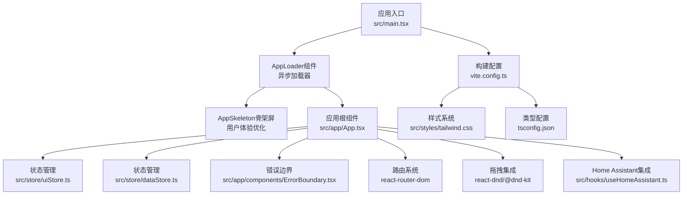
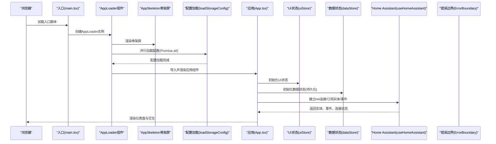
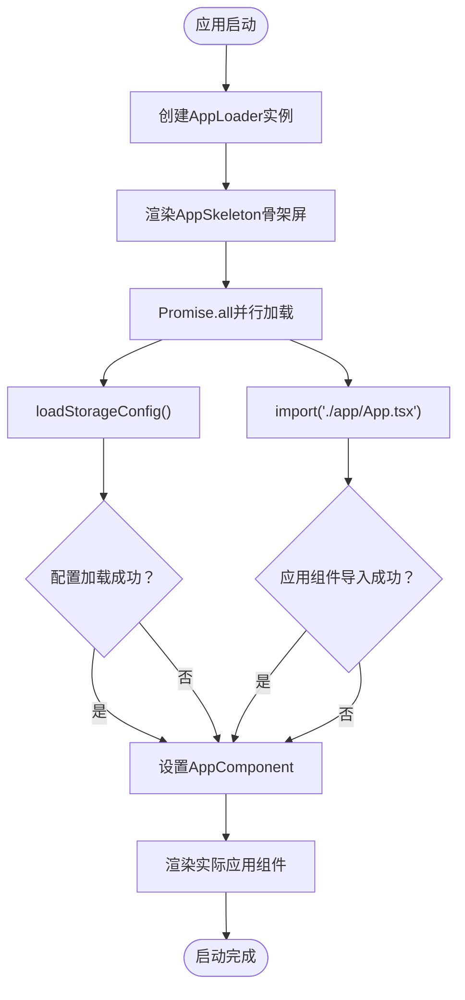
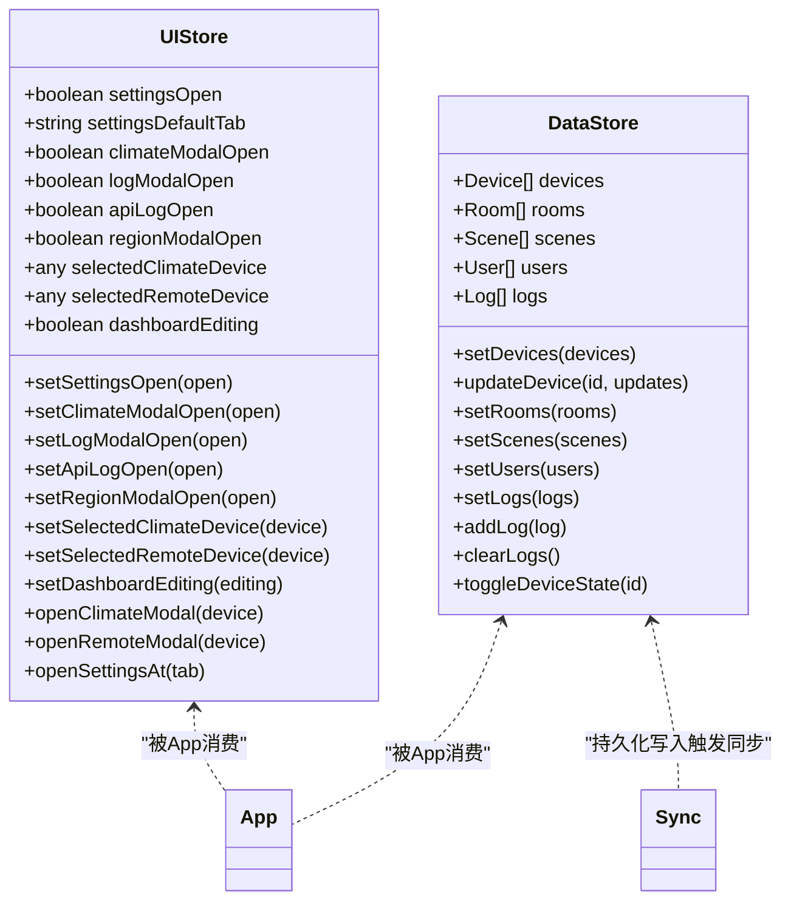
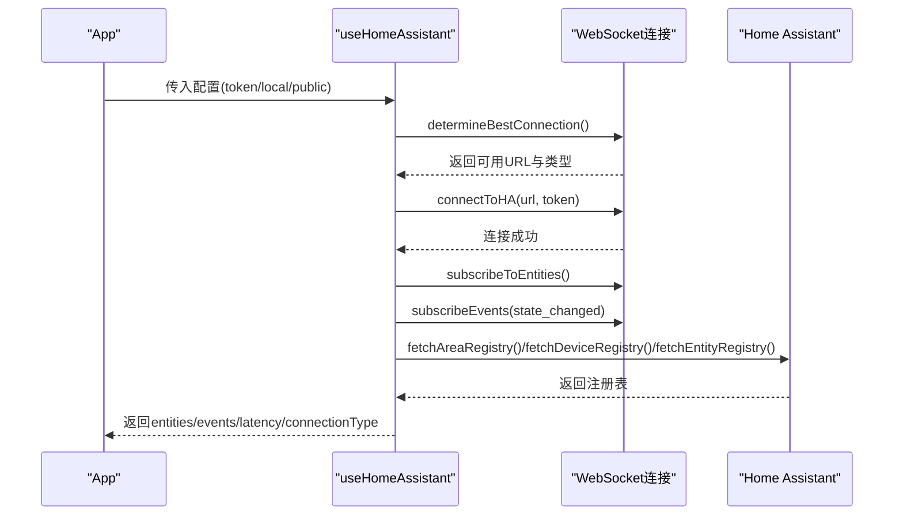
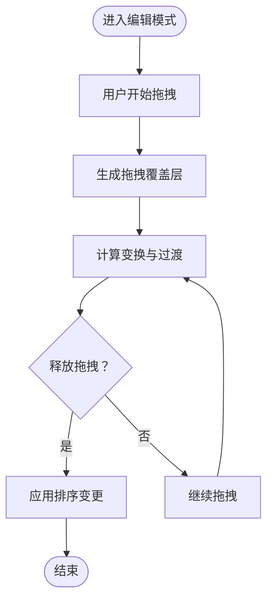
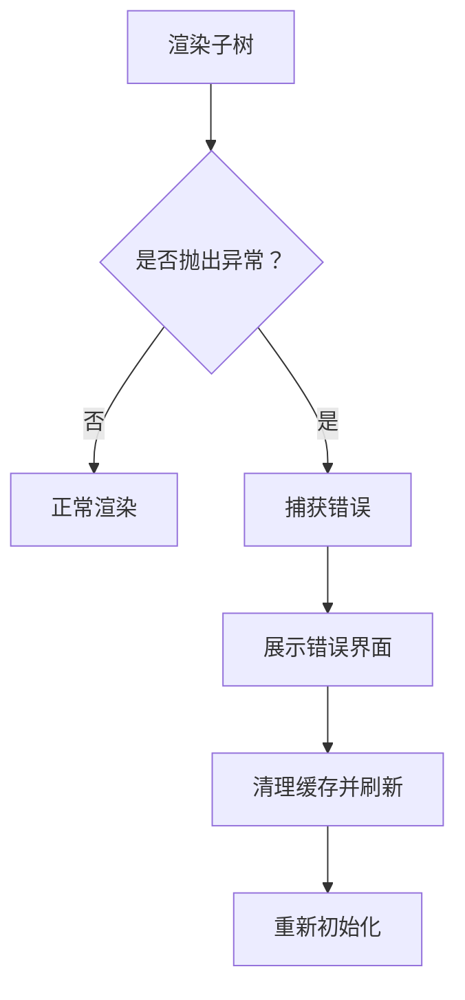
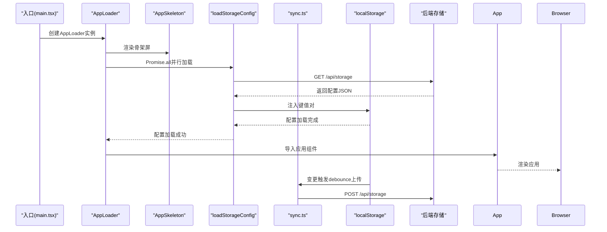
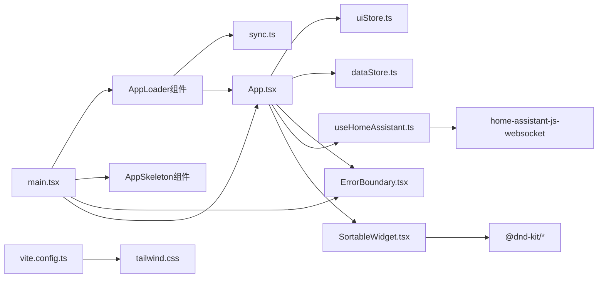

# 前端架构设计

<cite>
**本文档引用的文件**
- [package.json](file://package.json)
- [vite.config.ts](file://vite.config.ts)
- [tsconfig.json](file://tsconfig.json)
- [src/main.tsx](file://src/main.tsx)
- [src/app/App.tsx](file://src/app/App.tsx)
- [src/store/uiStore.ts](file://src/store/uiStore.ts)
- [src/store/dataStore.ts](file://src/store/dataStore.ts)
- [src/app/components/ErrorBoundary.tsx](file://src/app/components/ErrorBoundary.tsx)
- [src/hooks/useHomeAssistant.ts](file://src/hooks/useHomeAssistant.ts)
- [src/utils/sync.ts](file://src/utils/sync.ts)
- [src/app/components/dashboard/SortableWidget.tsx](file://src/app/components/dashboard/SortableWidget.tsx)
- [src/styles/tailwind.css](file://src/styles/tailwind.css)
- [src/types/dashboard.ts](file://src/types/dashboard.ts)
- [src/config/feature-flags.ts](file://src/config/feature-flags.ts)
</cite>

## 更新摘要
**变更内容**
- 新增AppLoader组件实现异步启动流程
- 引入AppSkeleton骨架屏提升用户体验
- 采用Promise.all并行加载优化启动性能
- 改进配置加载策略，支持超时和重试机制
- 更新应用启动序列图以反映新的异步架构

## 目录
1. [简介](#简介)
2. [项目结构](#项目结构)
3. [核心组件](#核心组件)
4. [架构总览](#架构总览)
5. [详细组件分析](#详细组件分析)
6. [依赖关系分析](#依赖关系分析)
7. [性能考虑](#性能考虑)
8. [故障排除指南](#故障排除指南)
9. [结论](#结论)
10. [附录](#附录)

## 简介
本文件面向HAUI前端架构，围绕基于React 18的前端体系，系统性阐述组件化架构、状态管理（Zustand）、路由系统、构建配置与部署、错误边界处理、拖拽功能集成（react-dnd）、性能优化策略、TypeScript类型系统的作用、组件间通信机制以及与Home Assistant生态的集成方式。文档同时提供可视化图示与分层讲解，帮助不同背景读者快速理解与落地。

**更新** 本版本重点反映了主应用启动流程的重大改进，包括异步配置加载、AppLoader组件的引入，以及整体架构向更现代的异步加载模式转变。

## 项目结构
- 技术栈与工具链
  - 前端框架：React 18.3.1
  - 状态管理：Zustand（轻量、函数式）
  - 路由系统：react-router-dom 7.x
  - 构建工具：Vite 6.3.5
  - 样式系统：Tailwind CSS 4.1.12
  - 拖拽：react-dnd + @dnd-kit
  - 类型系统：TypeScript 5.9.3
  - 实时通信：home-assistant-js-websocket
  - 测试：Cypress（E2E）、Vitest（单元测试）
- 目录组织
  - 源码位于src目录，采用按功能域划分的组件化结构
  - store目录存放Zustand状态模块
  - hooks目录封装业务与平台能力
  - utils目录提供通用工具与与Home Assistant的连接封装
  - styles目录统一样式入口
  - types目录集中定义类型
  - config目录存放特性开关与初始配置

**图表来源**
- [src/main.tsx:1-123](file://src/main.tsx#L1-L123)
- [src/app/App.tsx:1-1054](file://src/app/App.tsx#L1-L1054)
- [src/store/uiStore.ts:1-55](file://src/store/uiStore.ts#L1-L55)
- [src/store/dataStore.ts:1-129](file://src/store/dataStore.ts#L1-L129)
- [src/app/components/ErrorBoundary.tsx:1-51](file://src/app/components/ErrorBoundary.tsx#L1-L51)
- [src/hooks/useHomeAssistant.ts:1-313](file://src/hooks/useHomeAssistant.ts#L1-L313)
- [vite.config.ts:1-53](file://vite.config.ts#L1-L53)
- [src/styles/tailwind.css:1-14](file://src/styles/tailwind.css#L1-L14)
- [tsconfig.json:1-30](file://tsconfig.json#L1-L30)

**章节来源**
- [package.json:1-132](file://package.json#L1-L132)
- [vite.config.ts:1-53](file://vite.config.ts#L1-L53)
- [tsconfig.json:1-30](file://tsconfig.json#L1-L30)

## 核心组件
- **应用入口与启动流程**
  - **新增** AppLoader组件实现异步启动：先渲染AppSkeleton骨架屏，后台并行加载配置和应用组件，提升首屏加载体验。
  - 使用Promise.all并行执行配置加载和App组件导入，显著减少启动时间。
  - 支持超时和重试机制，确保在网络不稳定情况下也能正常启动。
- 状态管理（Zustand）
  - UI状态：uiStore管理设置面板、日志面板、区域选择、仪表盘编辑态等UI行为状态。
  - 数据状态：dataStore管理设备、房间、场景、用户、日志等业务数据，结合persist中间件实现本地持久化与自动同步。
- 错误边界
  - 提供全局错误捕获与降级展示，支持一键清理缓存并刷新，便于快速恢复。
- Home Assistant集成
  - useHomeAssistant封装连接建立、实体订阅、事件监听、服务调用、REST回退与延迟检测，提供统一的HA能力抽象。
- 拖拽功能
  - 使用react-dnd与@sortable实现仪表盘小部件的拖拽排序与移除交互。
- 构建与样式
  - Vite提供开发与生产构建，Tailwind作为原子化样式基础，配合动画扩展与主题定制。

**更新** 启动流程经过重大重构，采用异步加载模式替代传统的同步加载，提供更好的用户体验和更强的容错能力。

**章节来源**
- [src/main.tsx:88-123](file://src/main.tsx#L88-L123)
- [src/store/uiStore.ts:1-55](file://src/store/uiStore.ts#L1-L55)
- [src/store/dataStore.ts:1-129](file://src/store/dataStore.ts#L1-L129)
- [src/app/components/ErrorBoundary.tsx:1-51](file://src/app/components/ErrorBoundary.tsx#L1-L51)
- [src/hooks/useHomeAssistant.ts:23-313](file://src/hooks/useHomeAssistant.ts#L23-L313)
- [src/app/components/dashboard/SortableWidget.tsx:1-77](file://src/app/components/dashboard/SortableWidget.tsx#L1-L77)
- [vite.config.ts:1-53](file://vite.config.ts#L1-L53)
- [src/styles/tailwind.css:1-14](file://src/styles/tailwind.css#L1-L14)

## 架构总览
下图展示了从应用启动到与Home Assistant交互的端到端流程，涵盖新的异步加载架构、配置同步、状态管理、错误边界与拖拽集成：

**更新** 新的启动序列图反映了异步加载模式的核心变化：AppLoader组件负责协调配置加载和应用渲染，AppSkeleton提供即时的用户反馈。

**图表来源**
- [src/main.tsx:88-123](file://src/main.tsx#L88-L123)
- [src/utils/sync.ts:19-70](file://src/utils/sync.ts#L19-L70)
- [src/app/App.tsx:83-1054](file://src/app/App.tsx#L83-L1054)
- [src/store/uiStore.ts:1-55](file://src/store/uiStore.ts#L1-L55)
- [src/store/dataStore.ts:1-129](file://src/store/dataStore.ts#L1-L129)
- [src/hooks/useHomeAssistant.ts:23-313](file://src/hooks/useHomeAssistant.ts#L23-L313)
- [src/app/components/ErrorBoundary.tsx:1-51](file://src/app/components/ErrorBoundary.tsx#L1-L51)

## 详细组件分析

### 异步启动架构（AppLoader组件）
- **核心职责**
  - 实现异步启动流程，避免阻塞首屏渲染
  - 并行加载配置和应用组件，提升启动性能
  - 提供骨架屏体验，改善用户感知
- **实现机制**
  - 使用useState管理应用组件状态，初始为null
  - useEffect中使用Promise.all并行执行配置加载和组件导入
  - 支持失败回退：即使配置加载失败也尝试渲染应用
  - AppSkeleton提供渐进式加载体验

**图表来源**
- [src/main.tsx:88-113](file://src/main.tsx#L88-L113)

**章节来源**
- [src/main.tsx:88-113](file://src/main.tsx#L88-L113)

### 骨架屏组件（AppSkeleton）
- **设计理念**
  - 提供即时的视觉反馈，避免用户等待焦虑
  - 使用渐进式加载动画，营造流畅体验
  - 保持品牌一致性，使用HAUI主题色彩
- **实现特点**
  - 中央居中的布局设计
  - 渐变脉冲动画效果
  - 旋转加载指示器
  - 渐变背景色块

**章节来源**
- [src/main.tsx:72-86](file://src/main.tsx#L72-L86)

### 状态管理（Zustand）分析
- UI状态（uiStore）
  - 职责：管理设置面板、日志面板、区域选择、气候/遥控器模态框、仪表盘编辑态等UI行为。
  - 设计：函数式更新，无副作用，动作方法简洁明确，便于追踪与测试。
- 数据状态（dataStore）
  - 职责：管理设备、房间、场景、用户、日志等业务数据。
  - 特性：使用persist中间件，自定义storage实现localStorage写入时触发同步；仅持久化必要字段；限制日志数量，避免无限增长。
  - 复杂度：O(n)遍历与映射，适合中等规模数据；可通过分页或懒加载进一步优化。

**图表来源**
- [src/store/uiStore.ts:1-55](file://src/store/uiStore.ts#L1-L55)
- [src/store/dataStore.ts:1-129](file://src/store/dataStore.ts#L1-L129)
- [src/app/App.tsx:83-1054](file://src/app/App.tsx#L83-L1054)
- [src/utils/sync.ts:104-161](file://src/utils/sync.ts#L104-L161)

**章节来源**
- [src/store/uiStore.ts:1-55](file://src/store/uiStore.ts#L1-L55)
- [src/store/dataStore.ts:1-129](file://src/store/dataStore.ts#L1-L129)
- [src/types/dashboard.ts:1-12](file://src/types/dashboard.ts#L1-L12)

### Home Assistant集成分析
- 连接与订阅
  - 自动判定最佳连接（本地/公网），失败时回退到代理路径；建立WebSocket连接后订阅实体与事件，同时获取区域/设备/实体注册表。
- 服务调用与REST回退
  - 优先使用WebSocket服务调用；当WebSocket不可用时回退到REST接口；提供延迟检测与心跳维护。
- 实体与事件处理
  - 将事件转换为友好日志，支持按设备映射查找名称；自动同步设备状态与用户在线状态。

**图表来源**
- [src/hooks/useHomeAssistant.ts:23-313](file://src/hooks/useHomeAssistant.ts#L23-L313)

**章节来源**
- [src/hooks/useHomeAssistant.ts:23-313](file://src/hooks/useHomeAssistant.ts#L23-L313)

### 拖拽功能集成分析
- 集成方案
  - 使用react-dnd与@sortable，结合CSS Transform与过渡实现平滑拖拽体验；在编辑模式下显示拖拽手柄与删除按钮。
- 交互细节
  - 拖拽时降低原始节点透明度与层级，镜像节点置于顶层；支持拖拽覆盖层与占位动画；移除按钮阻止事件冒泡，避免误触。

**图表来源**
- [src/app/components/dashboard/SortableWidget.tsx:16-77](file://src/app/components/dashboard/SortableWidget.tsx#L16-L77)

**章节来源**
- [src/app/components/dashboard/SortableWidget.tsx:1-77](file://src/app/components/dashboard/SortableWidget.tsx#L1-L77)

### 错误边界处理
- 捕获策略
  - 使用getDerivedStateFromError与componentDidCatch捕获子树未处理异常，记录错误信息。
- 用户体验
  - 展示错误摘要与清空缓存并刷新的按钮，便于快速恢复。

**图表来源**
- [src/app/components/ErrorBoundary.tsx:12-51](file://src/app/components/ErrorBoundary.tsx#L12-L51)

**章节来源**
- [src/app/components/ErrorBoundary.tsx:1-51](file://src/app/components/ErrorBoundary.tsx#L1-L51)

### 应用启动流程与配置同步
- **启动阶段**
  - **更新** AppLoader组件先渲染AppSkeleton骨架屏，立即给用户反馈
  - 后台并行执行配置加载和应用组件导入
  - 支持超时和重试机制，确保启动稳定性
- **同步策略**
  - localStorage写入后进行防抖上传；定期心跳与页面聚焦触发对齐；支持强制对齐与增量校验。
  - 改进的超时控制：缩短超时时间至5秒，减少等待时间
  - 优化重试逻辑：根据HTTP状态码采取不同的重试策略

**更新** 启动流程图反映了新的异步架构：AppLoader组件协调配置加载和应用渲染，提供即时的用户反馈。

**图表来源**
- [src/main.tsx:88-123](file://src/main.tsx#L88-L123)
- [src/utils/sync.ts:19-70](file://src/utils/sync.ts#L19-L70)

**章节来源**
- [src/main.tsx:88-123](file://src/main.tsx#L88-L123)
- [src/utils/sync.ts:1-161](file://src/utils/sync.ts#L1-L161)

### 路由系统与页面组织
- 路由容器
  - 使用HashRouter包裹应用，支持Home Assistant /local/部署场景下的相对路径。
- 页面组织
  - 页面按功能域划分在src/app/pages，组件在src/app/components下，保持关注点分离。

**章节来源**
- [src/app/App.tsx:32-54](file://src/app/App.tsx#L32-L54)
- [vite.config.ts:31-45](file://vite.config.ts#L31-L45)

### TypeScript类型系统与最佳实践
- 类型覆盖
  - 编译目标ES2020，启用严格模式与未使用检查；路径别名@指向src，提升导入一致性。
- 类型定义
  - 业务类型集中在types目录，如Scene、Log等，保证跨组件一致的数据契约。
- 最佳实践
  - 使用类型守卫与解构赋值减少运行时错误；在工具函数中明确输入输出类型；在组件props中使用接口约束。

**章节来源**
- [tsconfig.json:1-30](file://tsconfig.json#L1-L30)
- [src/types/dashboard.ts:1-12](file://src/types/dashboard.ts#L1-L12)

### 样式系统与主题
- Tailwind集成
  - 通过@tailwindcss/vite插件启用，支持按源文件扫描与原子化类名；自定义动画与主题变量。
- 动画与交互
  - 结合motion/react与Tailwind动画类，实现流畅的过渡与拖拽反馈。

**章节来源**
- [vite.config.ts:1-53](file://vite.config.ts#L1-L53)
- [src/styles/tailwind.css:1-14](file://src/styles/tailwind.css#L1-L14)

## 依赖关系分析
- 组件耦合
  - App作为协调者，依赖Zustand状态、错误边界、路由与Home Assistant钩子；状态模块之间低耦合，通过动作与选择器交互。
  - **新增** AppLoader作为启动协调者，依赖配置加载和应用组件导入。
- 外部依赖
  - react-dnd与@sortable用于拖拽；home-assistant-js-websocket用于HA通信；Zustand用于状态管理；Tailwind用于样式；Vite用于构建与代理。

**更新** 依赖关系图新增了AppLoader和AppSkeleton组件，反映了新的异步启动架构。

**图表来源**
- [src/app/App.tsx:83-1054](file://src/app/App.tsx#L83-L1054)
- [src/store/uiStore.ts:1-55](file://src/store/uiStore.ts#L1-L55)
- [src/store/dataStore.ts:1-129](file://src/store/dataStore.ts#L1-L129)
- [src/app/components/ErrorBoundary.tsx:1-51](file://src/app/components/ErrorBoundary.tsx#L1-L51)
- [src/hooks/useHomeAssistant.ts:1-313](file://src/hooks/useHomeAssistant.ts#L1-L313)
- [src/app/components/dashboard/SortableWidget.tsx:1-77](file://src/app/components/dashboard/SortableWidget.tsx#L1-L77)
- [src/main.tsx:1-123](file://src/main.tsx#L1-L123)
- [src/utils/sync.ts:1-161](file://src/utils/sync.ts#L1-L161)
- [vite.config.ts:1-53](file://vite.config.ts#L1-L53)
- [src/styles/tailwind.css:1-14](file://src/styles/tailwind.css#L1-L14)

**章节来源**
- [package.json:13-96](file://package.json#L13-L96)

## 性能考虑
- **启动性能**
  - **更新** AppLoader采用异步启动模式，避免阻塞首屏渲染
  - Promise.all并行加载配置和应用组件，显著减少启动时间
  - AppSkeleton提供即时视觉反馈，改善用户感知
  - 改进的超时控制：缩短超时时间至5秒，减少等待时间
- 状态管理
  - Zustand函数式更新与局部选择器减少重渲染；dataStore持久化仅保留必要字段，避免冗余存储。
- 拖拽与动画
  - 使用CSS Transform与过渡，避免布局抖动；拖拽覆盖层与占位动画减少视觉闪烁。
- 构建与资源
  - Vite热更新与按需打包；Tailwind按源文件扫描，避免无用样式；外部SDK通过external按运行时加载，减小bundle体积。
- 网络与实时性
  - HA连接心跳与延迟检测，WebSocket失败时自动回退REST；事件队列限制长度，避免内存膨胀。

**更新** 性能优化策略重点体现在异步启动架构上，通过并行加载和骨架屏技术显著提升用户体验。

## 故障排除指南
- **异步启动问题**
  - 症状：应用长时间无响应或加载失败
  - 排查：检查AppLoader组件的Promise.all执行情况；确认配置加载超时设置；验证应用组件导入是否成功
- **配置同步问题**
  - 症状：首屏空白或配置缺失
  - 排查：检查后端存储端点与响应格式；确认超时与重试逻辑；验证localStorage写入与同步触发
- **骨架屏显示问题**
  - 症状：骨架屏不显示或显示异常
  - 排查：确认AppLoader组件状态管理；检查AppSkeleton组件样式；验证异步加载流程
- HA连接失败
  - 症状：无法订阅实体或服务调用失败
  - 排查：确认token有效性与环境变量；检查代理配置与证书；观察心跳与断线重连
- 拖拽异常
  - 症状：拖拽无效或覆盖层层级异常
  - 排查：确认编辑态开关；检查useSortable禁用条件与事件冒泡；验证CSS层级与动画
- 错误边界触发
  - 症状：页面显示错误界面
  - 排查：查看控制台错误堆栈；使用"清空缓存并刷新"恢复；定位具体组件异常

**更新** 新增了异步启动相关的故障排除指南，重点关注AppLoader和AppSkeleton组件的问题排查。

**章节来源**
- [src/main.tsx:88-123](file://src/main.tsx#L88-L123)
- [src/utils/sync.ts:1-161](file://src/utils/sync.ts#L1-L161)
- [src/hooks/useHomeAssistant.ts:23-313](file://src/hooks/useHomeAssistant.ts#L23-L313)
- [src/app/components/dashboard/SortableWidget.tsx:16-77](file://src/app/components/dashboard/SortableWidget.tsx#L16-L77)
- [src/app/components/ErrorBoundary.tsx:12-51](file://src/app/components/ErrorBoundary.tsx#L12-L51)

## 结论
HAUI前端架构以React 18为基础，结合Zustand实现轻量高效的状态管理，通过Vite与Tailwind构建现代化开发与样式体系，借助react-dnd提供直观的拖拽交互，并以useHomeAssistant统一抽象Home Assistant生态。**更新后的架构**采用异步启动模式，通过AppLoader组件和AppSkeleton骨架屏提供更好的用户体验，Promise.all并行加载优化启动性能，整体设计强调可维护性、可扩展性与用户体验，适合在Home Assistant生态中快速迭代与规模化部署。

**更新** 本次架构升级体现了现代前端开发的最佳实践，异步加载模式和骨架屏技术的应用显著提升了用户体验和系统稳定性。

## 附录
- 特性开关
  - 天气服务提供商切换：通过FEATURE_FLAGS控制OPEN_METEO与OPEN_WEATHER_MAP切换。
- 关键配置
  - 构建：相对路径base、插件alias、external与proxy配置
  - 类型：严格模式、路径别名、Bundler模式

**章节来源**
- [src/config/feature-flags.ts:1-7](file://src/config/feature-flags.ts#L1-L7)
- [vite.config.ts:6-51](file://vite.config.ts#L6-L51)
- [tsconfig.json:18-26](file://tsconfig.json#L18-L26)