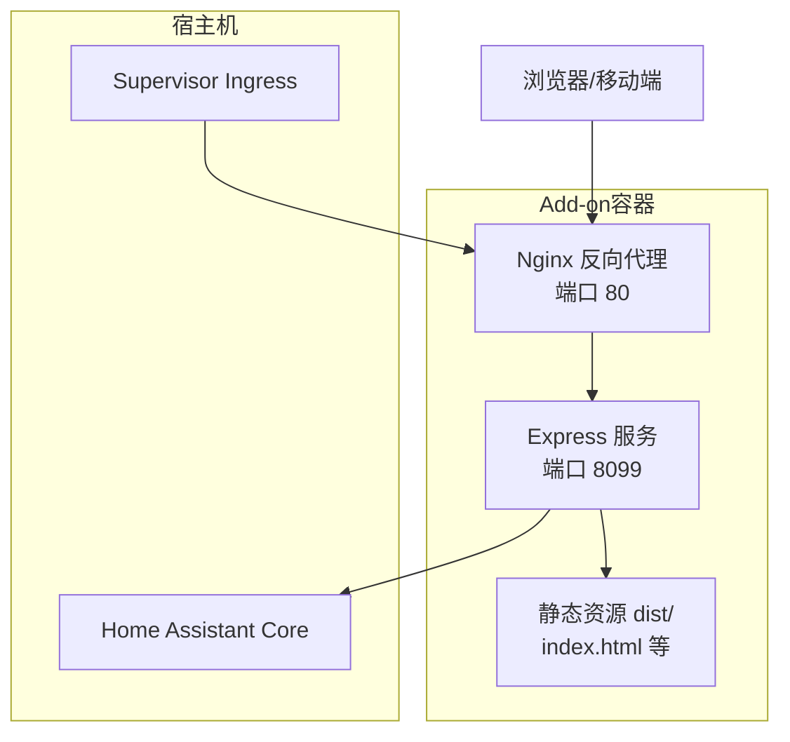
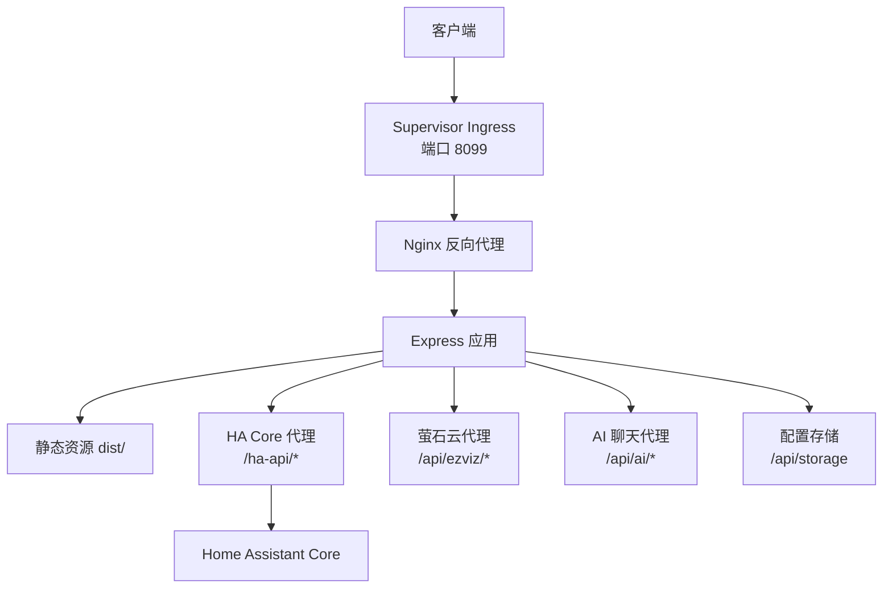
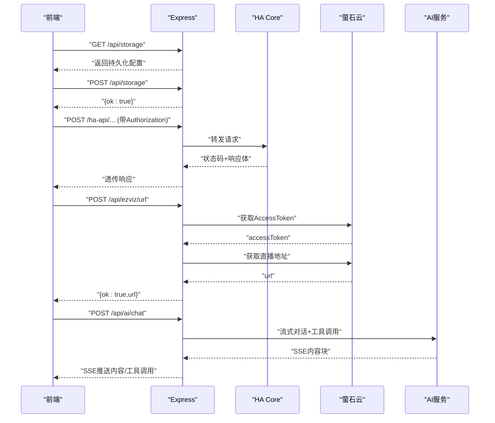
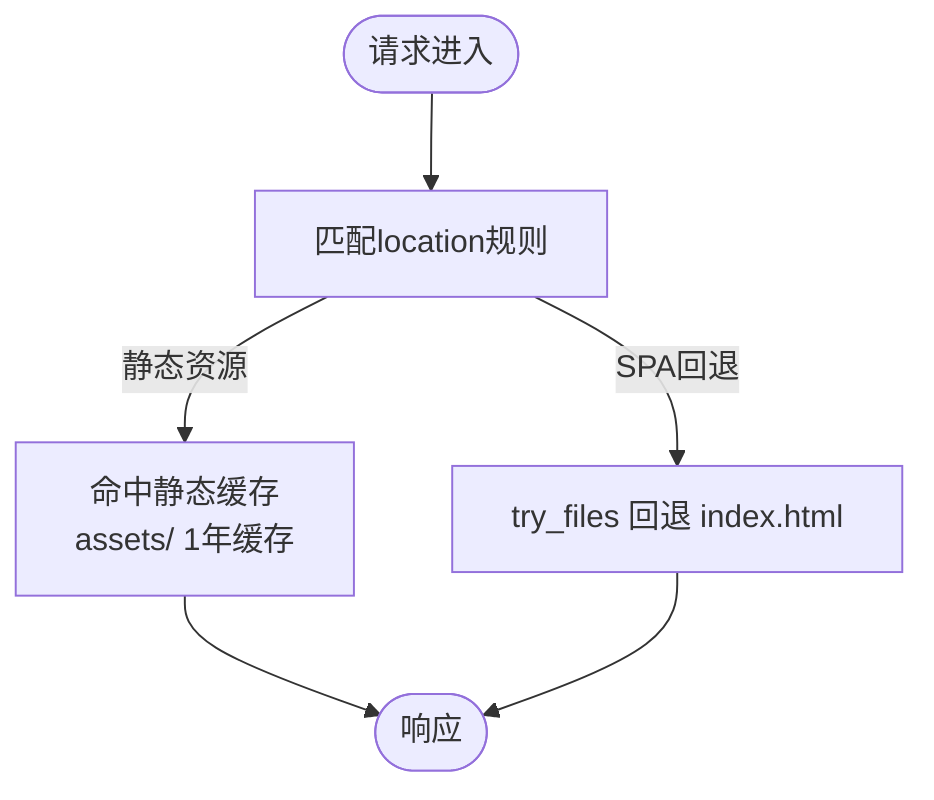
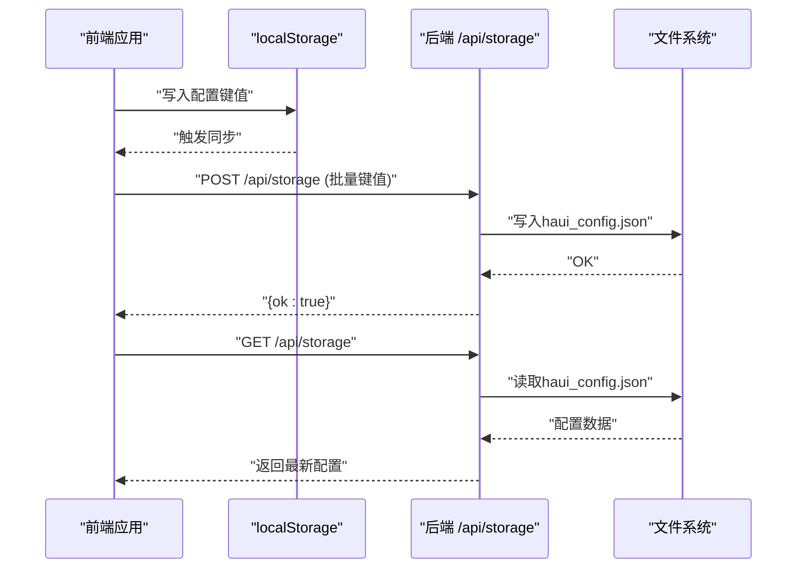
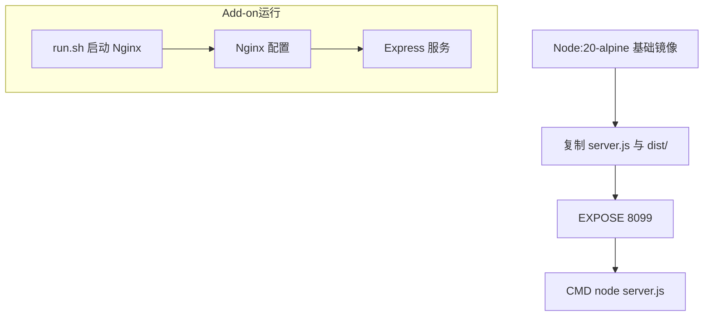
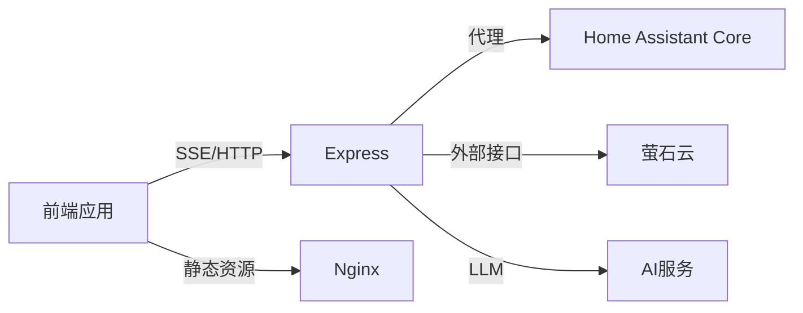

# 后端服务架构

<cite>
**本文引用的文件**
- [addon/server.js](file://addon/server.js)
- [addon/Dockerfile](file://addon/Dockerfile)
- [addon/nginx.conf](file://addon/nginx.conf)
- [addon/run.sh](file://addon/run.sh)
- [addon/config.yaml](file://addon/config.yaml)
- [addon/.data/haui_config.json](file://addon/.data/haui_config.json)
- [src/utils/sync.ts](file://src/utils/sync.ts)
- [src/utils/device-sync.ts](file://src/utils/device-sync.ts)
- [src/store/dataStore.ts](file://src/store/dataStore.ts)
- [src/types/device.ts](file://src/types/device.ts)
- [src/utils/security.ts](file://src/utils/security.ts)
- [docker-compose.yml](file://docker-compose.yml)
- [package.json](file://package.json)
- [README.md](file://README.md)
- [addon/DOCS.md](file://addon/DOCS.md)
</cite>

## 目录
1. [简介](#简介)
2. [项目结构](#项目结构)
3. [核心组件](#核心组件)
4. [架构总览](#架构总览)
5. [详细组件分析](#详细组件分析)
6. [依赖分析](#依赖分析)
7. [性能考量](#性能考量)
8. [故障排查指南](#故障排查指南)
9. [结论](#结论)
10. [附录](#附录)

## 简介
本文件面向HAUI后端服务架构，围绕Node.js + Express后端、API端点设计、中间件与路由、跨设备同步机制、Nginx反向代理、Docker容器化部署以及与Home Assistant Add-on生态的集成进行系统化技术说明。文档同时覆盖安全、性能优化与监控要点，并提供API架构图与数据流图，帮助读者快速理解服务间交互关系。

## 项目结构
后端服务位于addon目录，采用“前端打包产物 + Node.js + Nginx”的组合：Express负责API与静态资源分发，Nginx提供静态缓存与Gzip压缩，Add-on通过HA Ingress对外暴露服务。开发与测试环境由docker-compose提供，便于本地联调Home Assistant与Mosquitto。

图表来源
- [addon/server.js:505-521](file://addon/server.js#L505-L521)
- [addon/nginx.conf:16-25](file://addon/nginx.conf#L16-L25)
- [addon/config.yaml:31-33](file://addon/config.yaml#L31-L33)

章节来源
- [addon/server.js:1-521](file://addon/server.js#L1-L521)
- [addon/Dockerfile:1-17](file://addon/Dockerfile#L1-L17)
- [addon/nginx.conf:1-26](file://addon/nginx.conf#L1-L26)
- [addon/config.yaml:1-37](file://addon/config.yaml#L1-L37)
- [docker-compose.yml:1-42](file://docker-compose.yml#L1-L42)

## 核心组件
- Express后端服务：提供API端点、静态文件服务、HA Core代理、AI聊天与萤石云代理等能力。
- Nginx反向代理：提供静态资源缓存、Gzip压缩、入口流量分发。
- Add-on配置：声明Ingress、端口映射、选项参数与持久化卷映射。
- 前端同步模块：负责本地配置与后端存储的双向同步与版本控制。
- 设备同步算法：将Home Assistant实体状态映射到前端设备模型，保持状态一致。

章节来源
- [addon/server.js:48-94](file://addon/server.js#L48-L94)
- [addon/server.js:96-121](file://addon/server.js#L96-L121)
- [addon/server.js:122-196](file://addon/server.js#L122-L196)
- [addon/server.js:229-286](file://addon/server.js#L229-L286)
- [addon/server.js:288-291](file://addon/server.js#L288-L291)
- [addon/server.js:293-313](file://addon/server.js#L293-L313)
- [addon/server.js:315-503](file://addon/server.js#L315-L503)
- [addon/server.js:505-521](file://addon/server.js#L505-L521)

## 架构总览
下图展示HAUI后端在Add-on中的整体架构：前端通过Ingress访问Nginx，Nginx将静态资源请求交由Express提供，API请求经由Express代理到HA Core或外部服务；静态资源由Nginx提供，Express仅处理API与SPA回退。

图表来源
- [addon/config.yaml:31-33](file://addon/config.yaml#L31-L33)
- [addon/server.js:48-94](file://addon/server.js#L48-L94)
- [addon/server.js:122-196](file://addon/server.js#L122-L196)
- [addon/server.js:293-313](file://addon/server.js#L293-L313)
- [addon/server.js:315-503](file://addon/server.js#L315-L503)
- [addon/server.js:505-521](file://addon/server.js#L505-L521)

## 详细组件分析

### Express后端服务
- 中间件与路由
  - JSON Body解析：支持较大负载（如摄像头配置、Base64头像、布局信息）。
  - 静态文件服务：提供React打包产物，开启缓存与ETag。
  - SPA回退：未知路径返回index.html，配合前端路由。
- HA Core代理：将前端REST请求转发至HA Core，支持Authorization头与Supervisor Token回退。
- 配置存储API：提供/ha-api、/api/storage、/api/ai/config等端点，支持读写配置与AI配置。
- 萤石云代理：封装AppKey/AppSecret，获取AccessToken与直播地址，解决跨域与敏感信息保护。
- ONVIF PTZ控制：将前端指令转换为HA onvif.ptz服务调用。
- AI聊天代理：支持工具调用与SSE流式输出，限制最大工具轮次，确保安全性与稳定性。
- 健康检查：/api/health用于Ingress心跳探测。

图表来源
- [addon/server.js:96-121](file://addon/server.js#L96-L121)
- [addon/server.js:48-94](file://addon/server.js#L48-L94)
- [addon/server.js:122-196](file://addon/server.js#L122-L196)
- [addon/server.js:315-503](file://addon/server.js#L315-L503)

章节来源
- [addon/server.js:45-46](file://addon/server.js#L45-L46)
- [addon/server.js:505-521](file://addon/server.js#L505-L521)
- [addon/server.js:96-121](file://addon/server.js#L96-L121)
- [addon/server.js:122-196](file://addon/server.js#L122-L196)
- [addon/server.js:229-286](file://addon/server.js#L229-L286)
- [addon/server.js:288-291](file://addon/server.js#L288-L291)
- [addon/server.js:293-313](file://addon/server.js#L293-L313)
- [addon/server.js:315-503](file://addon/server.js#L315-L503)

### Nginx反向代理
- 提供静态资源缓存（assets一年缓存）、Gzip压缩、入口路由回退。
- 与Express配合，将静态请求与API请求分流，提升前端加载性能与安全性。

图表来源
- [addon/nginx.conf:16-25](file://addon/nginx.conf#L16-L25)

章节来源
- [addon/nginx.conf:1-26](file://addon/nginx.conf#L1-L26)

### Add-on配置与Ingress
- Ingress启用与端口映射：通过config.yaml声明ingress与端口，Supervisor自动将容器8099端口映射为Ingress入口。
- 选项参数：支持AI Provider、API Key、Model、Base URL等配置项。
- 卷映射：config与ssl目录读写权限映射，便于持久化与证书管理。

章节来源
- [addon/config.yaml:31-33](file://addon/config.yaml#L31-L33)
- [addon/config.yaml:18-21](file://addon/config.yaml#L18-L21)
- [addon/config.yaml:22-30](file://addon/config.yaml#L22-L30)

### 跨设备同步机制
- 前端同步策略
  - 版本控制：使用时间戳键记录本地/远端版本，30秒心跳与页面聚焦触发对齐。
  - 防抖合并：本地变更后1秒内防抖批量同步，减少网络压力。
  - 超时控制：统一fetch超时，避免阻塞。
- 后端存储策略
  - 配置文件：/data/haui_config.json（Add-on）或本地.data/haui_config.json（开发），确保存在性与默认值。
  - AI配置：独立文件haui_ai_config.json，隔离面板数据与AI配置。
- 设备状态同步
  - 将Home Assistant实体状态映射到前端设备模型，覆盖灯光、窗帘、传感器、恒温设备等类型，保持在线状态、属性与最后变更时间一致。

图表来源
- [src/utils/sync.ts:52-93](file://src/utils/sync.ts#L52-L93)
- [src/utils/sync.ts:98-131](file://src/utils/sync.ts#L98-L131)
- [addon/server.js:96-121](file://addon/server.js#L96-L121)
- [addon/server.js:28-33](file://addon/server.js#L28-L33)
- [addon/.data/haui_config.json:1-1](file://addon/.data/haui_config.json#L1-L1)

章节来源
- [src/utils/sync.ts:1-161](file://src/utils/sync.ts#L1-L161)
- [addon/server.js:28-33](file://addon/server.js#L28-L33)
- [addon/server.js:96-121](file://addon/server.js#L96-L121)
- [src/utils/device-sync.ts:1-191](file://src/utils/device-sync.ts#L1-L191)
- [src/store/dataStore.ts:104-127](file://src/store/dataStore.ts#L104-L127)
- [src/types/device.ts:1-46](file://src/types/device.ts#L1-L46)

### 安全考虑
- Token混淆：前端对HA Token进行Base64混淆，降低屏幕截图泄露风险（仅弱混淆）。
- 代理鉴权：HA Core代理优先使用前端传入Authorization，其次使用Supervisor Token。
- 健康检查：/api/health用于Ingress心跳，避免未授权访问。
- CORS与跨域：萤石云代理隐藏敏感参数，前端通过后端代理访问，避免直接暴露。

章节来源
- [src/utils/security.ts:1-27](file://src/utils/security.ts#L1-L27)
- [addon/server.js:56-94](file://addon/server.js#L56-L94)
- [addon/server.js:288-291](file://addon/server.js#L288-L291)
- [addon/server.js:122-196](file://addon/server.js#L122-L196)

### Docker容器化与部署
- Add-on镜像：基于node:20-alpine，生产环境，拷贝server.js与dist目录，暴露8099端口。
- 运行脚本：run.sh启动Nginx，配合Supervisor管理。
- 开发环境：docker-compose启动HA、Mosquitto与前端开发服务，便于联调。

图表来源
- [addon/Dockerfile:1-17](file://addon/Dockerfile#L1-L17)
- [addon/run.sh:1-10](file://addon/run.sh#L1-L10)
- [docker-compose.yml:27-42](file://docker-compose.yml#L27-L42)

章节来源
- [addon/Dockerfile:1-17](file://addon/Dockerfile#L1-L17)
- [addon/run.sh:1-10](file://addon/run.sh#L1-L10)
- [docker-compose.yml:1-42](file://docker-compose.yml#L1-L42)

### 与Home Assistant Add-on生态集成
- Ingress融合：通过Supervisor Ingress将Add-on服务无缝接入HA侧边栏，免登录直连。
- 选项参数：在Add-on配置中设置AI Provider、API Key、Model、Base URL等。
- 持久化：/data目录映射为持久卷，配置与AI配置文件落地到Add-on存储。

章节来源
- [addon/config.yaml:31-33](file://addon/config.yaml#L31-L33)
- [addon/config.yaml:22-30](file://addon/config.yaml#L22-L30)
- [addon/server.js:10-17](file://addon/server.js#L10-L17)

## 依赖分析
- 前端依赖：React 18、Vite、Tailwind CSS、@microsoft/fetch-event-source等，支持SSE与高性能UI。
- Add-on运行时：Node.js 20、Express、Nginx。
- 开发与测试：Cypress、Vitest、Playwright等。

图表来源
- [package.json:1-132](file://package.json#L1-L132)
- [addon/server.js:48-94](file://addon/server.js#L48-L94)
- [addon/server.js:122-196](file://addon/server.js#L122-L196)
- [addon/server.js:315-503](file://addon/server.js#L315-L503)

章节来源
- [package.json:1-132](file://package.json#L1-L132)

## 性能考量
- 静态资源优化：Nginx启用Gzip与长缓存，减少带宽与首屏加载时间。
- 前端性能：Web Worker与虚拟化渲染，图标按需加载，避免主线程阻塞。
- 后端限流与超时：Express JSON大小限制、fetch超时控制、SSE流式推送。
- 存储策略：本地localStorage + 后端持久化，版本控制与防抖合并，降低冲突与IO压力。

章节来源
- [addon/nginx.conf:8-14](file://addon/nginx.conf#L8-L14)
- [src/utils/sync.ts:29-41](file://src/utils/sync.ts#L29-L41)
- [src/utils/sync.ts:52-93](file://src/utils/sync.ts#L52-L93)
- [addon/server.js:45-46](file://addon/server.js#L45-L46)

## 故障排查指南
- HA Core代理失败：检查Authorization头或Supervisor Token配置，确认HA Core可达与Ingress映射正确。
- 配置读写异常：确认/data或本地.data目录存在与可写，检查haui_config.json格式与权限。
- 萤石云代理报错：核对AppKey/AppSecret与设备序列号，查看Token与直播地址获取流程日志。
- AI聊天异常：检查AI API Key、Provider与Base URL配置，关注SSE流解析与工具调用轮次上限。
- 健康检查失败：确认/ha-api与/api/health端点可达，排查网络与代理链路。

章节来源
- [addon/server.js:56-94](file://addon/server.js#L56-L94)
- [addon/server.js:28-33](file://addon/server.js#L28-L33)
- [addon/server.js:122-196](file://addon/server.js#L122-L196)
- [addon/server.js:315-503](file://addon/server.js#L315-L503)
- [addon/server.js:288-291](file://addon/server.js#L288-L291)

## 结论
HAUI后端服务采用“Express + Nginx + Add-on Ingress”的轻量架构，结合前端localStorage与后端持久化实现跨设备配置同步；通过HA Core代理与外部服务代理（萤石云、AI服务）实现与Home Assistant及第三方能力的深度集成。该架构在保证易用性的同时兼顾性能与安全，适合在HA Add-on生态中稳定运行。

## 附录
- 开发与测试：README提供开发与测试指引，docker-compose定义本地联调环境。
- Add-on文档：DOCS.md涵盖安装、配置与网络细节，便于用户快速上手。

章节来源
- [README.md:1-84](file://README.md#L1-L84)
- [addon/DOCS.md:1-34](file://addon/DOCS.md#L1-L34)