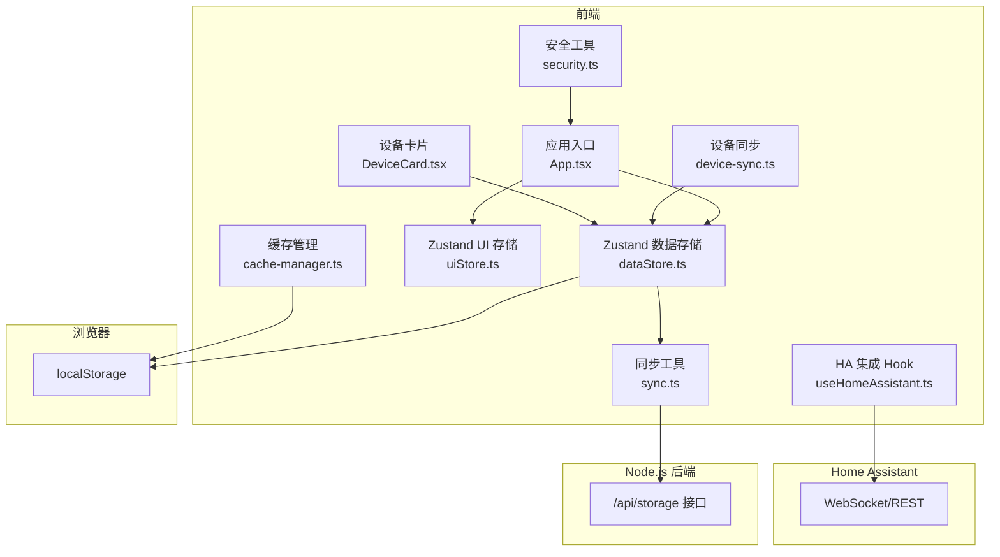
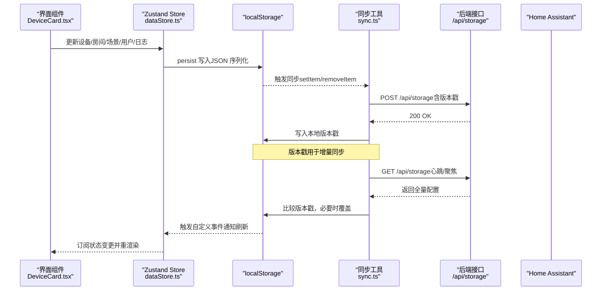
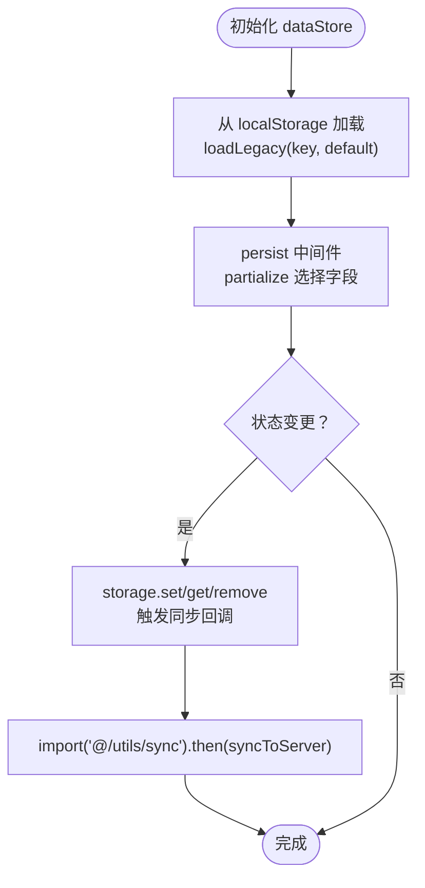
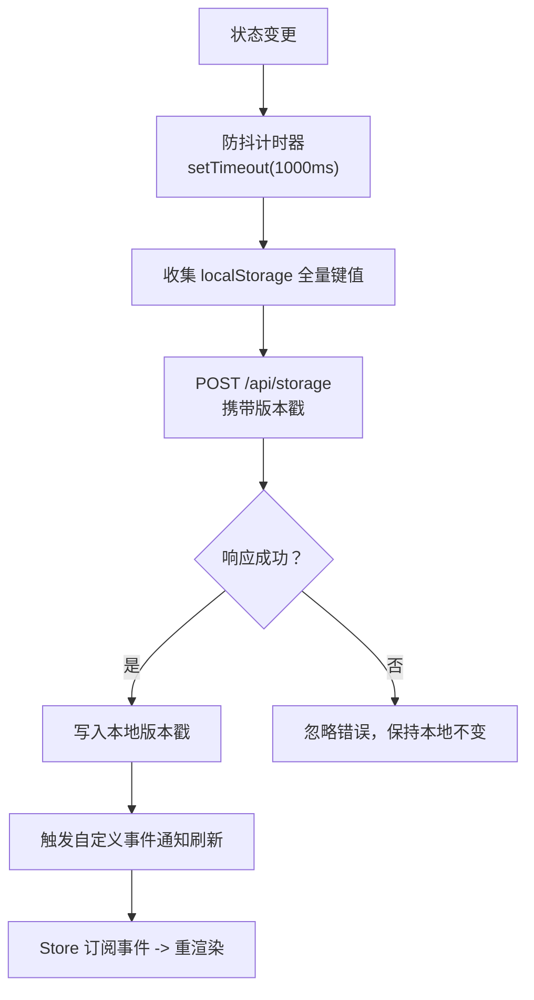
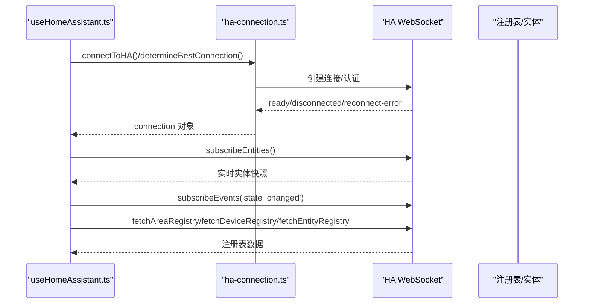
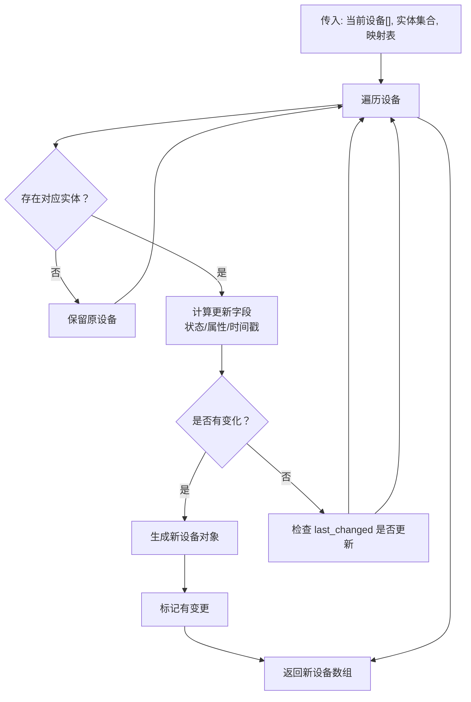
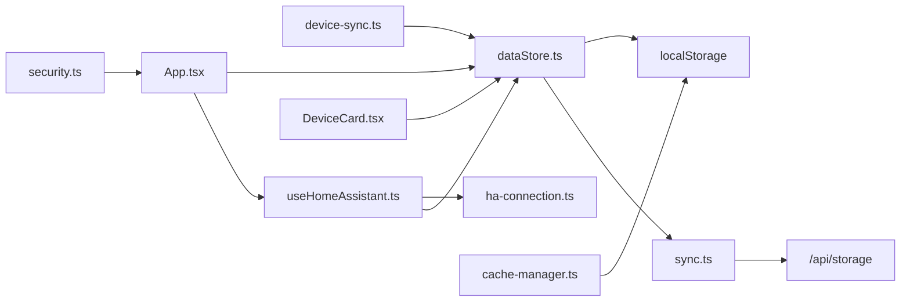

# 数据存储架构

<cite>
**本文引用的文件**
- [dataStore.ts](file://src/store/dataStore.ts)
- [uiStore.ts](file://src/store/uiStore.ts)
- [sync.ts](file://src/utils/sync.ts)
- [device-sync.ts](file://src/utils/device-sync.ts)
- [ha-connection.ts](file://src/utils/ha-connection.ts)
- [useHomeAssistant.ts](file://src/hooks/useHomeAssistant.ts)
- [security.ts](file://src/utils/security.ts)
- [initialDevices.ts](file://src/config/initialDevices.ts)
- [device.ts](file://src/types/device.ts)
- [room.ts](file://src/types/room.ts)
- [cache-manager.ts](file://src/utils/cache-manager.ts)
- [App.tsx](file://src/app/App.tsx)
- [DeviceCard.tsx](file://src/app/components/dashboard/DeviceCard.tsx)
- [main.tsx](file://src/main.tsx)
</cite>

## 目录
1. [简介](#简介)
2. [项目结构](#项目结构)
3. [核心组件](#核心组件)
4. [架构总览](#架构总览)
5. [详细组件分析](#详细组件分析)
6. [依赖关系分析](#依赖关系分析)
7. [性能考量](#性能考量)
8. [故障排查指南](#故障排查指南)
9. [结论](#结论)
10. [附录](#附录)

## 简介
本文件系统性梳理 HAUI 的多层数据存储架构，覆盖以下方面：
- 多层存储策略：localStorage 本地持久化、Zustand 状态管理、Node.js 后端存储、Home Assistant 实体状态同步
- 跨设备同步与一致性：版本控制、增量同步、冲突处理与回退策略
- 状态管理模式：数据流向、更新机制、性能优化
- 安全、备份与迁移：凭据混淆、缓存与持久化边界、迁移与兼容
- 架构图与同步流程图：展示各层关系与交互

## 项目结构
围绕数据存储的关键目录与文件：
- 状态管理：Zustand stores（dataStore、uiStore）
- 同步与持久化：localStorage 包装与同步工具（sync）
- Home Assistant 集成：连接、订阅、服务调用（ha-connection、useHomeAssistant）
- 设备状态同步：将 HA 实体状态映射到本地设备模型（device-sync）
- 类型与初始数据：设备与房间类型、初始设备数据
- 缓存与安全：通用缓存管理、令牌混淆
- 应用入口与组件：应用启动时的存储初始化、设备卡片消费状态

图表来源
- [dataStore.ts:58-128](file://src/store/dataStore.ts#L58-L128)
- [sync.ts:52-160](file://src/utils/sync.ts#L52-L160)
- [device-sync.ts:4-191](file://src/utils/device-sync.ts#L4-L191)
- [ha-connection.ts:47-147](file://src/utils/ha-connection.ts#L47-L147)
- [useHomeAssistant.ts:23-312](file://src/hooks/useHomeAssistant.ts#L23-L312)
- [security.ts:1-27](file://src/utils/security.ts#L1-L27)
- [cache-manager.ts:6-56](file://src/utils/cache-manager.ts#L6-L56)
- [App.tsx:83-200](file://src/app/App.tsx#L83-L200)
- [DeviceCard.tsx:26-200](file://src/app/components/dashboard/DeviceCard.tsx#L26-L200)

章节来源
- [dataStore.ts:1-129](file://src/store/dataStore.ts#L1-L129)
- [sync.ts:1-161](file://src/utils/sync.ts#L1-L161)
- [device-sync.ts:1-191](file://src/utils/device-sync.ts#L1-L191)
- [ha-connection.ts:1-317](file://src/utils/ha-connection.ts#L1-L317)
- [useHomeAssistant.ts:1-313](file://src/hooks/useHomeAssistant.ts#L1-L313)
- [security.ts:1-27](file://src/utils/security.ts#L1-L27)
- [cache-manager.ts:1-56](file://src/utils/cache-manager.ts#L1-L56)
- [App.tsx:1-200](file://src/app/App.tsx#L1-L200)
- [DeviceCard.tsx:1-200](file://src/app/components/dashboard/DeviceCard.tsx#L1-L200)
- [main.tsx:31-81](file://src/main.tsx#L31-L81)

## 核心组件
- 数据存储层（localStorage + Zustand）
  - dataStore：封装设备、房间、场景、用户、日志等状态，通过 persist 中间件将状态持久化到 localStorage，并在变更时触发同步
  - uiStore：管理 UI 状态（模态框、编辑模式等），不持久化
- 同步与版本控制
  - sync：提供主动/被动同步、防抖、版本戳（SYNC_TS_KEY）、增量校验、心跳与聚焦对齐
- Home Assistant 集成
  - ha-connection：建立长连接、订阅实体、服务调用、注册表获取、可用性探测
  - useHomeAssistant：封装连接生命周期、实体订阅、事件订阅、延迟测量、REST 回退
- 设备状态同步
  - device-sync：将 HA 实体状态映射到本地设备模型，按设备类型进行字段同步与一致性判断
- 安全与缓存
  - security：令牌混淆/解码（Base64）
  - cache-manager：基于 localStorage 的带 TTL 缓存

章节来源
- [dataStore.ts:58-128](file://src/store/dataStore.ts#L58-L128)
- [sync.ts:46-160](file://src/utils/sync.ts#L46-L160)
- [ha-connection.ts:47-147](file://src/utils/ha-connection.ts#L47-L147)
- [useHomeAssistant.ts:23-312](file://src/hooks/useHomeAssistant.ts#L23-L312)
- [device-sync.ts:4-191](file://src/utils/device-sync.ts#L4-L191)
- [security.ts:1-27](file://src/utils/security.ts#L1-L27)
- [cache-manager.ts:6-56](file://src/utils/cache-manager.ts#L6-L56)

## 架构总览
多层数据流与一致性保障：

图表来源
- [dataStore.ts:108-128](file://src/store/dataStore.ts#L108-L128)
- [sync.ts:52-160](file://src/utils/sync.ts#L52-L160)
- [DeviceCard.tsx:26-200](file://src/app/components/dashboard/DeviceCard.tsx#L26-L200)

## 详细组件分析

### Zustand 数据存储（dataStore）
- 状态域：devices、rooms、scenes、users、logs
- 持久化策略：persist 中间件 + 自定义 storage（localStorage），partialize 选择性持久化
- 变更触发：storage 包装的 setItem/removeItem 回调中动态导入 sync.ts 并触发同步
- 初始化：loadLegacy 读取 localStorage 或回退到默认值（INITIAL_DEVICES、DEFAULT_ROOMS）

图表来源
- [dataStore.ts:49-128](file://src/store/dataStore.ts#L49-L128)

章节来源
- [dataStore.ts:1-129](file://src/store/dataStore.ts#L1-L129)
- [initialDevices.ts:1-68](file://src/config/initialDevices.ts#L1-L68)
- [room.ts:21-33](file://src/types/room.ts#L21-L33)

### UI 状态存储（uiStore）
- 管理 UI 行为开关与当前选中项，不持久化，避免污染本地存储
- 提供便捷方法打开特定模态框与跳转标签页

章节来源
- [uiStore.ts:1-55](file://src/store/uiStore.ts#L1-L55)

### 同步与版本控制（sync）
- 版本戳：haui_last_sync_ts，用于增量同步判断
- 防抖：1 秒内多次变更合并为一次同步请求
- 增量同步：GET /api/storage 拉取全量，比较版本戳后决定是否覆盖
- 自动同步：每 30 秒心跳、页面聚焦事件触发对齐
- 超时与错误：fetchWithTimeout + try/catch 忽略失败，保证稳定性

图表来源
- [sync.ts:46-160](file://src/utils/sync.ts#L46-L160)

章节来源
- [sync.ts:1-161](file://src/utils/sync.ts#L1-L161)

### Home Assistant 集成（ha-connection 与 useHomeAssistant）
- 连接建立：长连接、事件监听、断线重连、代理回退
- 实体订阅：实时获取 HassEntities，驱动设备状态同步
- 注册表获取：区域、设备、实体注册表
- REST 回退：WebSocket 失败时走 REST API
- 延迟测量：周期性 ping 测量延迟

图表来源
- [useHomeAssistant.ts:23-312](file://src/hooks/useHomeAssistant.ts#L23-L312)
- [ha-connection.ts:47-147](file://src/utils/ha-connection.ts#L47-L147)

章节来源
- [ha-connection.ts:1-317](file://src/utils/ha-connection.ts#L1-L317)
- [useHomeAssistant.ts:1-313](file://src/hooks/useHomeAssistant.ts#L1-L313)

### 设备状态同步（device-sync）
- 输入：本地设备数组、HA 实体集合、设备 ID 到实体 ID 的映射
- 同步规则：按设备类型分别处理（灯光/开关/窗帘/传感器/二进制传感器/空调等）
- 一致性字段：状态（on/off）、亮度/色温、位置、数值显示、在线状态、设备类、时间戳
- 变更标记：只要任一字段发生变化则返回新设备数组，否则返回原数组

图表来源
- [device-sync.ts:4-191](file://src/utils/device-sync.ts#L4-L191)

章节来源
- [device-sync.ts:1-191](file://src/utils/device-sync.ts#L1-L191)
- [device.ts:1-46](file://src/types/device.ts#L1-L46)

### 应用启动与存储初始化（main.tsx）
- 启动阶段先执行 initStorage：向后端拉取配置并写入 localStorage，最多重试若干次，超时即放弃并继续启动
- 保证首屏渲染时具备完整配置，避免“空白页”问题

章节来源
- [main.tsx:31-81](file://src/main.tsx#L31-L81)

### 组件消费与渲染（App.tsx 与 DeviceCard.tsx）
- App：从 dataStore 与 uiStore 读取状态，结合 useHomeAssistant 获取实体与事件
- DeviceCard：根据设备类型渲染不同控件，消费设备状态（如 isOn、lastChanged、count 等）

章节来源
- [App.tsx:83-200](file://src/app/App.tsx#L83-L200)
- [DeviceCard.tsx:26-200](file://src/app/components/dashboard/DeviceCard.tsx#L26-L200)

## 依赖关系分析

图表来源
- [dataStore.ts:58-128](file://src/store/dataStore.ts#L58-L128)
- [sync.ts:52-160](file://src/utils/sync.ts#L52-L160)
- [device-sync.ts:4-191](file://src/utils/device-sync.ts#L4-L191)
- [ha-connection.ts:47-147](file://src/utils/ha-connection.ts#L47-L147)
- [useHomeAssistant.ts:23-312](file://src/hooks/useHomeAssistant.ts#L23-L312)
- [App.tsx:83-200](file://src/app/App.tsx#L83-L200)
- [DeviceCard.tsx:26-200](file://src/app/components/dashboard/DeviceCard.tsx#L26-L200)
- [security.ts:1-27](file://src/utils/security.ts#L1-L27)
- [cache-manager.ts:6-56](file://src/utils/cache-manager.ts#L6-L56)

章节来源
- [dataStore.ts:1-129](file://src/store/dataStore.ts#L1-L129)
- [sync.ts:1-161](file://src/utils/sync.ts#L1-L161)
- [device-sync.ts:1-191](file://src/utils/device-sync.ts#L1-L191)
- [ha-connection.ts:1-317](file://src/utils/ha-connection.ts#L1-L317)
- [useHomeAssistant.ts:1-313](file://src/hooks/useHomeAssistant.ts#L1-L313)
- [security.ts:1-27](file://src/utils/security.ts#L1-L27)
- [cache-manager.ts:1-56](file://src/utils/cache-manager.ts#L1-L56)
- [App.tsx:1-200](file://src/app/App.tsx#L1-L200)
- [DeviceCard.tsx:1-200](file://src/app/components/dashboard/DeviceCard.tsx#L1-L200)
- [main.tsx:31-81](file://src/main.tsx#L31-L81)

## 性能考量
- 防抖与批处理：syncToServer 使用 1 秒防抖，避免频繁网络请求
- 增量同步：通过版本戳避免全量覆盖，减少不必要的写入与刷新
- 订阅粒度：useHomeAssistant 订阅实体与事件，避免轮询；REST 回退仅在 WebSocket 失败时启用
- 渲染优化：Zustand 仅在状态变化时触发组件重渲染；DeviceCard 根据设备类型分支渲染
- 缓存策略：cache-manager 提供 TTL 缓存，适合临时数据与网络回退场景

[本节为通用性能讨论，无需列出具体文件来源]

## 故障排查指南
- 同步失败
  - 现象：POST /api/storage 失败或超时
  - 排查：检查网络、后端接口可达性；确认 credentials: include 生效；查看 sync.ts 的 fetchWithTimeout 与 try/catch
- 版本不一致
  - 现象：本地版本戳落后于远端
  - 排查：确认 initAutoSync 是否运行（心跳与聚焦事件）；检查 localStorage 中 SYNC_TS_KEY 是否正确更新
- HA 连接问题
  - 现象：WebSocket 连接断开、延迟为 null
  - 排查：useHomeAssistant 的断线重连逻辑；ha-connection 的可用性探测与代理回退；检查 token 有效性
- 令牌安全
  - 现象：令牌泄露风险
  - 处理：security.ts 采用 Base64 混淆；建议在可信环境部署，避免仅前端加密作为安全边界
- 启动白屏
  - 现象：首屏长时间空白
  - 处理：main.tsx 的 initStorage 已内置超时与重试兜底，确保 Promise 必然 resolve

章节来源
- [sync.ts:29-93](file://src/utils/sync.ts#L29-L93)
- [sync.ts:98-160](file://src/utils/sync.ts#L98-L160)
- [useHomeAssistant.ts:140-148](file://src/hooks/useHomeAssistant.ts#L140-L148)
- [ha-connection.ts:244-296](file://src/utils/ha-connection.ts#L244-L296)
- [security.ts:1-27](file://src/utils/security.ts#L1-L27)
- [main.tsx:31-81](file://src/main.tsx#L31-L81)

## 结论
HAUI 的数据存储架构以 localStorage 为核心持久化层，配合 Zustand 提供高性能的状态管理，并通过 sync.ts 实现与 Node.js 后端的增量同步与版本控制。Home Assistant 通过 WebSocket/REST 实时同步实体状态，device-sync 将 HA 实体映射到本地设备模型，形成闭环。整体设计在易用性、一致性与性能之间取得平衡，同时提供必要的安全与容错能力。

[本节为总结性内容，无需列出具体文件来源]

## 附录

### 数据一致性与冲突解决策略
- 版本戳驱动的增量同步：远端版本戳大于本地时才覆盖，避免无谓写入
- 写入侧触发同步：localStorage 的 setItem/removeItem 回调中触发同步，确保远端尽快得到最新数据
- 心跳与聚焦对齐：定期拉取远端配置，保证跨设备一致性
- 设备状态同步：按设备类型精确映射，仅在字段变化时更新，降低冲突概率

章节来源
- [sync.ts:46-160](file://src/utils/sync.ts#L46-L160)
- [device-sync.ts:4-191](file://src/utils/device-sync.ts#L4-L191)

### 状态管理模式设计原则
- 单向数据流：组件只负责读取与派发动作，状态变更由 Zustand reducer 处理
- 局部更新：仅更新受影响字段，减少渲染与序列化成本
- 异步副作用：同步逻辑与 UI 更新分离，避免阻塞渲染

章节来源
- [dataStore.ts:58-128](file://src/store/dataStore.ts#L58-L128)
- [App.tsx:83-200](file://src/app/App.tsx#L83-L200)

### 数据安全、备份与迁移
- 凭据混淆：security.ts 使用 Base64 混淆 HA Token，仅作弱防护
- 备份与恢复：通过 /api/storage 的全量导出/导入实现；建议定期导出 localStorage 关键键
- 迁移方案：新增字段时在 dataStore 中提供默认值；device-sync 新增字段需兼容旧实体属性

章节来源
- [security.ts:1-27](file://src/utils/security.ts#L1-L27)
- [sync.ts:52-160](file://src/utils/sync.ts#L52-L160)
- [device-sync.ts:4-191](file://src/utils/device-sync.ts#L4-L191)