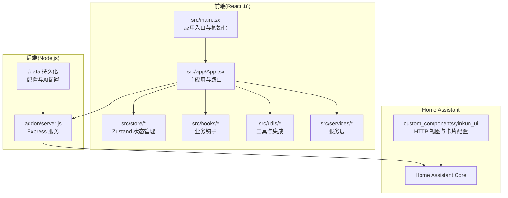
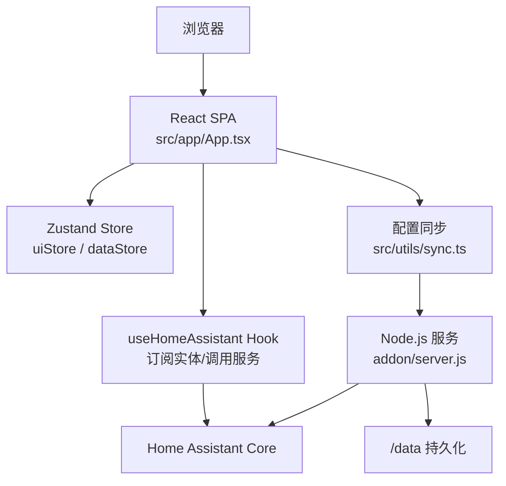
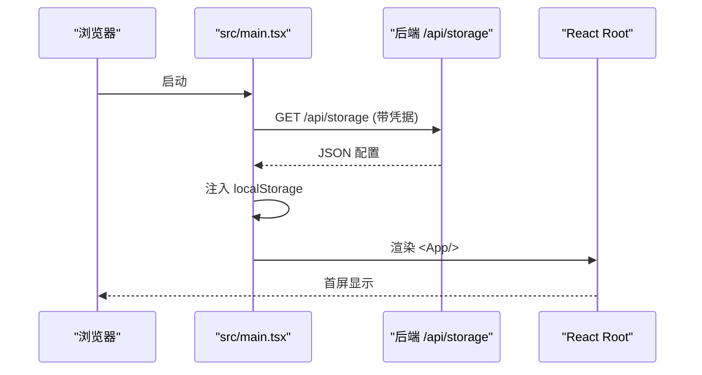
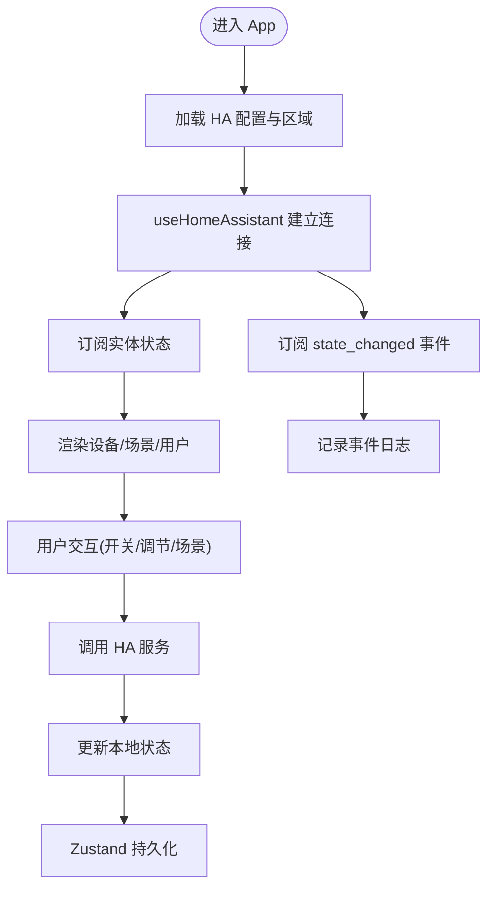
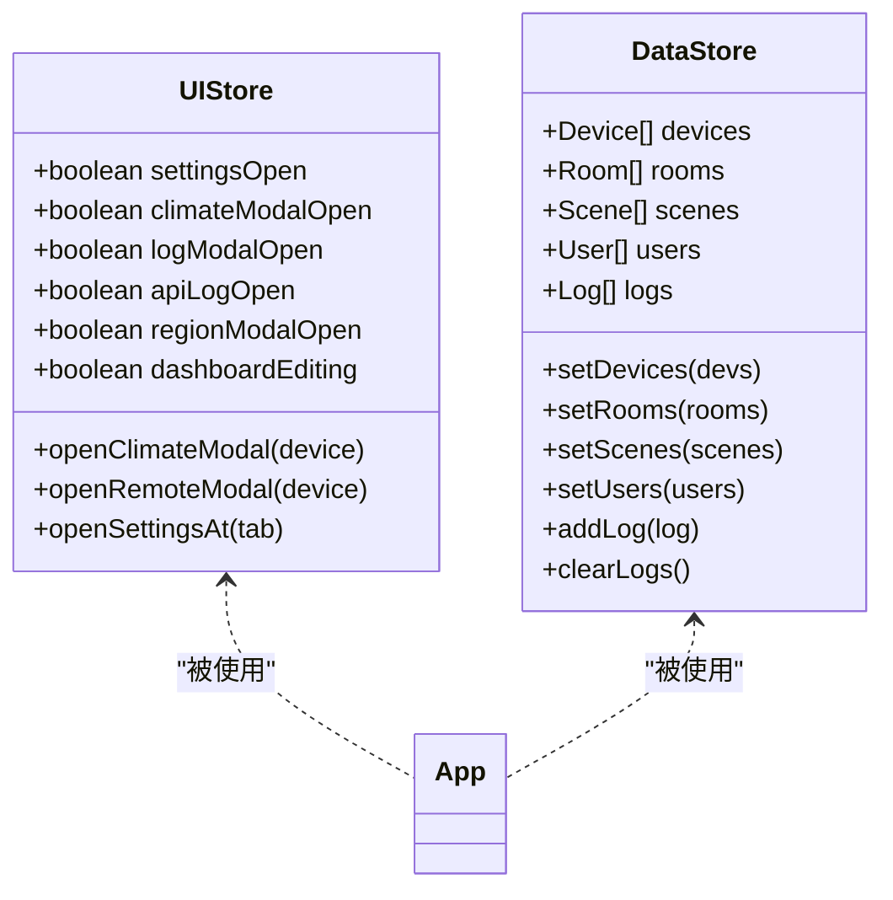
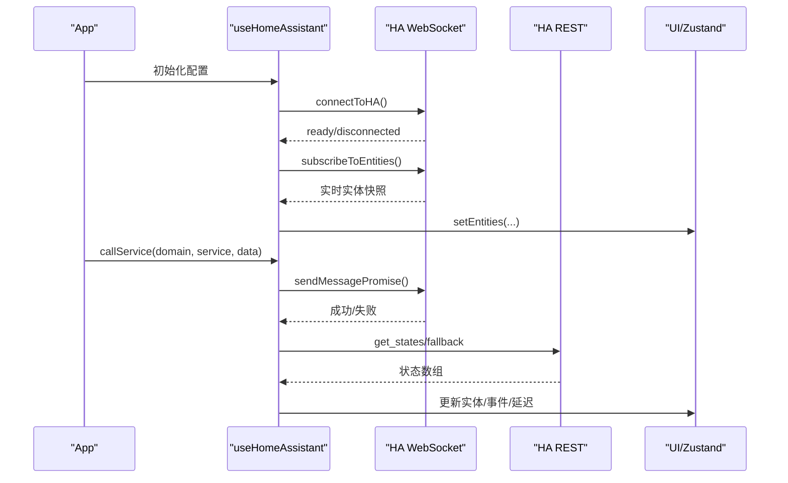
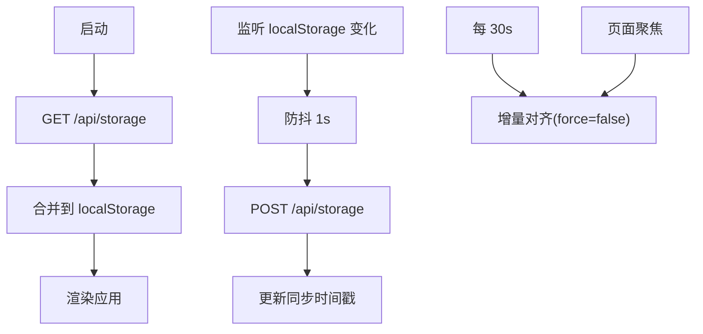
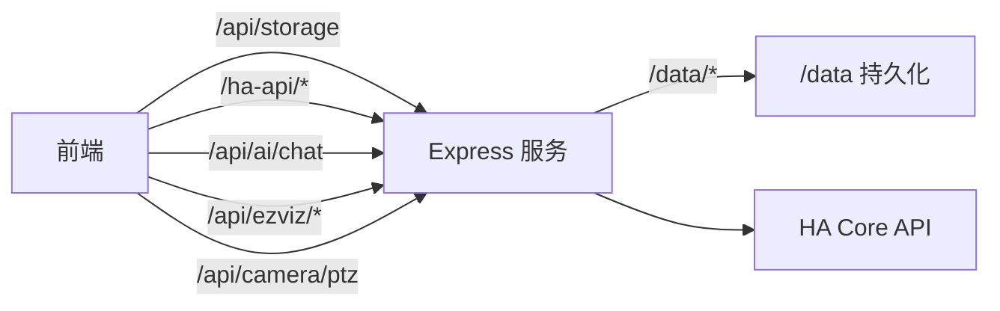
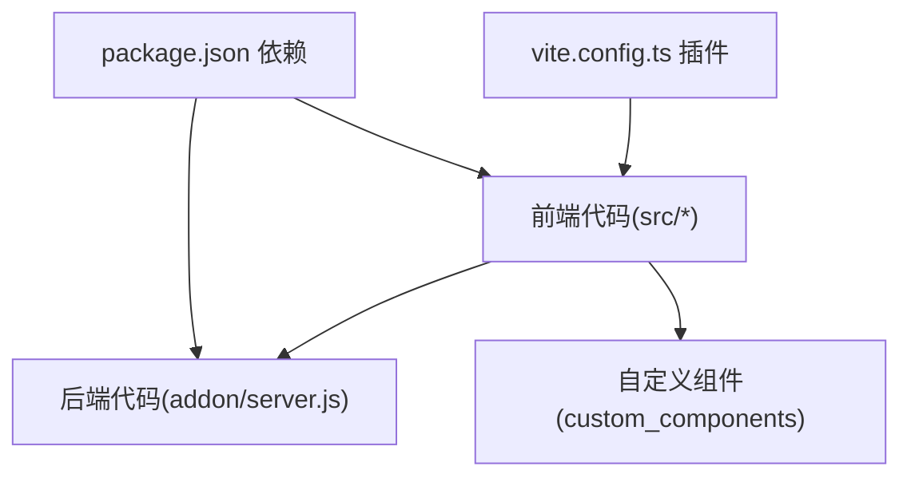

# 架构设计

<cite>
**本文档引用的文件**
- [package.json](file://package.json)
- [README.md](file://README.md)
- [vite.config.ts](file://vite.config.ts)
- [src/main.tsx](file://src/main.tsx)
- [src/app/App.tsx](file://src/app/App.tsx)
- [src/store/uiStore.ts](file://src/store/uiStore.ts)
- [src/store/dataStore.ts](file://src/store/dataStore.ts)
- [src/hooks/useHomeAssistant.ts](file://src/hooks/useHomeAssistant.ts)
- [src/utils/ha-connection.ts](file://src/utils/ha-connection.ts)
- [src/utils/sync.ts](file://src/utils/sync.ts)
- [src/types/home-assistant.ts](file://src/types/home-assistant.ts)
- [addon/server.js](file://addon/server.js)
- [custom_components/yinkun_ui/__init__.py](file://custom_components/yinkun_ui/__init__.py)
</cite>

## 目录
1. [简介](#简介)
2. [项目结构](#项目结构)
3. [核心组件](#核心组件)
4. [架构总览](#架构总览)
5. [详细组件分析](#详细组件分析)
6. [依赖分析](#依赖分析)
7. [性能考虑](#性能考虑)
8. [故障排查指南](#故障排查指南)
9. [结论](#结论)
10. [附录](#附录)

## 简介
HAUI 是一个专业、AI 驱动的 Home Assistant 仪表板，强调 iOS 风格的视觉与交互体验。系统采用 React 18 + TypeScript + Vite + Tailwind CSS 技术栈构建前端，结合 Node.js 后端服务与 Home Assistant 的双向集成，提供全双工语音交互、多窗口摄像头监控、跨设备配置云同步等能力。本文档系统阐述整体架构、组件关系、数据流与事件驱动机制，并给出性能与可扩展性建议。

## 项目结构
项目采用按功能域划分的组织方式：
- 前端源码位于 src/，包含页面、组件、服务层、状态管理、工具与类型定义
- 后端 Node.js 服务位于 addon/，提供配置存储、HA 代理、AI 聊天与摄像头代理
- Home Assistant 自定义组件位于 custom_components/yinkun_ui/，用于注册面板与状态接口
- 构建与开发工具配置位于根目录的 package.json、vite.config.ts 等

图表来源
- [src/main.tsx:1-82](file://src/main.tsx#L1-L82)
- [src/app/App.tsx:1-1053](file://src/app/App.tsx#L1-L1053)
- [addon/server.js:1-521](file://addon/server.js#L1-L521)
- [custom_components/yinkun_ui/__init__.py:1-30](file://custom_components/yinkun_ui/__init__.py#L1-L30)

章节来源
- [README.md:1-84](file://README.md#L1-L84)
- [package.json:1-132](file://package.json#L1-L132)
- [vite.config.ts:1-53](file://vite.config.ts#L1-L53)

## 核心组件
- 前端应用入口与初始化：负责在渲染前完成配置云同步，确保首屏具备完整配置
- 主应用与路由：承载仪表盘、设置、日志、天气等模块，协调设备状态与交互
- 状态管理：使用 Zustand 分离 UI 状态与数据状态，持久化关键数据
- Home Assistant 集成：通过 WebSocket/REST 订阅实体状态、调用服务、获取注册表
- 后端服务：提供配置存储、HA 代理、AI 聊天与摄像头代理，支持 HA Ingress 与 Supervisor 环境
- 自定义组件：注册 HTTP 视图，便于健康检查与卡片配置

章节来源
- [src/main.tsx:18-82](file://src/main.tsx#L18-L82)
- [src/app/App.tsx:83-1053](file://src/app/App.tsx#L83-L1053)
- [src/store/uiStore.ts:1-55](file://src/store/uiStore.ts#L1-L55)
- [src/store/dataStore.ts:1-129](file://src/store/dataStore.ts#L1-L129)
- [src/hooks/useHomeAssistant.ts:1-313](file://src/hooks/useHomeAssistant.ts#L1-L313)
- [addon/server.js:1-521](file://addon/server.js#L1-L521)
- [custom_components/yinkun_ui/__init__.py:1-30](file://custom_components/yinkun_ui/__init__.py#L1-L30)

## 架构总览
系统采用“前端单页应用 + Node.js 后端 + Home Assistant Core”的三层架构：
- 前端负责 UI 渲染、交互与状态管理，通过代理接口访问 Home Assistant 与后端服务
- 后端提供配置云同步、HA API 代理、AI 聊天与摄像头代理，保障安全与跨域
- Home Assistant 提供设备状态、服务调用与注册表，作为系统数据与控制中心

图表来源
- [src/app/App.tsx:83-1053](file://src/app/App.tsx#L83-L1053)
- [src/store/uiStore.ts:1-55](file://src/store/uiStore.ts#L1-L55)
- [src/store/dataStore.ts:1-129](file://src/store/dataStore.ts#L1-L129)
- [src/hooks/useHomeAssistant.ts:1-313](file://src/hooks/useHomeAssistant.ts#L1-L313)
- [src/utils/sync.ts:1-161](file://src/utils/sync.ts#L1-L161)
- [addon/server.js:1-521](file://addon/server.js#L1-L521)

## 详细组件分析

### 前端应用入口与初始化
- 在渲染前执行配置云同步，优先从后端拉取配置注入 localStorage，随后渲染应用，避免空白页
- 采用带超时的 fetch 与重试策略，保证启动速度与稳定性
- 使用 ErrorBoundary 包裹根组件，提升健壮性

图表来源
- [src/main.tsx:18-82](file://src/main.tsx#L18-L82)
- [src/utils/sync.ts:98-131](file://src/utils/sync.ts#L98-L131)

章节来源
- [src/main.tsx:18-82](file://src/main.tsx#L18-L82)

### 主应用与路由
- 使用 HashRouter 管理前端路由，支持审计模式与远程控制演示
- 集成天气、时间、日志、区域选择等横切关注点
- 通过 useHomeAssistant 钩子建立与 Home Assistant 的连接，订阅实体状态与事件

图表来源
- [src/app/App.tsx:83-1053](file://src/app/App.tsx#L83-L1053)
- [src/hooks/useHomeAssistant.ts:1-313](file://src/hooks/useHomeAssistant.ts#L1-L313)

章节来源
- [src/app/App.tsx:83-1053](file://src/app/App.tsx#L83-L1053)

### 状态管理（Zustand）
- UI 状态：设置面板、日志面板、编辑模式等
- 数据状态：设备、房间、场景、用户、日志等，持久化到 localStorage
- 通过中间件在写入时触发后端同步，确保跨设备一致性

图表来源
- [src/store/uiStore.ts:1-55](file://src/store/uiStore.ts#L1-L55)
- [src/store/dataStore.ts:1-129](file://src/store/dataStore.ts#L1-L129)

章节来源
- [src/store/uiStore.ts:1-55](file://src/store/uiStore.ts#L1-L55)
- [src/store/dataStore.ts:1-129](file://src/store/dataStore.ts#L1-L129)

### Home Assistant 集成（事件驱动）
- 连接策略：优先根据可用性判断最佳连接（本地/公网），失败时回退到代理
- 事件驱动：订阅实体状态变化与 state_changed 事件，实时更新 UI 并记录日志
- 服务调用：封装 callService，统一处理错误与延迟检测

图表来源
- [src/hooks/useHomeAssistant.ts:1-313](file://src/hooks/useHomeAssistant.ts#L1-L313)
- [src/utils/ha-connection.ts:1-317](file://src/utils/ha-connection.ts#L1-L317)

章节来源
- [src/hooks/useHomeAssistant.ts:1-313](file://src/hooks/useHomeAssistant.ts#L1-L313)
- [src/utils/ha-connection.ts:1-317](file://src/utils/ha-connection.ts#L1-L317)

### 配置云同步（跨设备一致性）
- 启动阶段：从后端拉取配置并注入 localStorage
- 运行阶段：localStorage 变更后防抖上传，后台定时对齐与聚焦触发
- 版本控制：基于时间戳的增量同步，避免冲突

图表来源
- [src/utils/sync.ts:1-161](file://src/utils/sync.ts#L1-L161)
- [src/main.tsx:18-82](file://src/main.tsx#L18-L82)

章节来源
- [src/utils/sync.ts:1-161](file://src/utils/sync.ts#L1-L161)
- [src/main.tsx:18-82](file://src/main.tsx#L18-L82)

### 后端服务（Node.js）
- 配置存储：/api/storage GET/POST，持久化到 /data/haui_config.json
- HA 代理：/ha-api 透传 REST 请求，支持 Supervisor 环境与备用令牌
- AI 聊天：/api/ai/chat SSE 流式响应，支持工具调用与最大轮次限制
- 摄像头代理：萤石云与 ONVIF PTZ 控制，隐藏密钥并解决跨域
- 静态资源：提供 React 打包产物静态文件与路由回退

图表来源
- [addon/server.js:1-521](file://addon/server.js#L1-L521)

章节来源
- [addon/server.js:1-521](file://addon/server.js#L1-L521)

### Home Assistant 自定义组件
- 注册 HTTP 视图，提供状态检查与卡片配置接口
- 便于在 HA 环境中验证集成与面板可用性

章节来源
- [custom_components/yinkun_ui/__init__.py:1-30](file://custom_components/yinkun_ui/__init__.py#L1-L30)

## 依赖分析
- 前端依赖：React 18、TypeScript、Vite、Tailwind CSS、Radix UI、Zustand、React Query、Motion 等
- 构建与开发：Vite 插件、Tailwind、ESLint、Cypress、Playwright、Vitest
- 后端依赖：Express、CORS、FS、Path 等

图表来源
- [package.json:1-132](file://package.json#L1-L132)
- [vite.config.ts:1-53](file://vite.config.ts#L1-L53)

章节来源
- [package.json:1-132](file://package.json#L1-L132)
- [vite.config.ts:1-53](file://vite.config.ts#L1-L53)

## 性能考虑
- 首屏性能：配置云同步前置，避免空白页；Vite 开发热更新与生产构建优化
- 渲染性能：虚拟列表与 Web Worker 用于图标搜索；拖拽排序与动画库减少重排
- 网络性能：WebSocket 为主、REST 为辅；代理层统一鉴权与缓存策略
- 存储性能：Zustand 持久化中间件按需序列化；localStorage 防抖批量上传

## 故障排查指南
- Home Assistant 连接失败：检查 VITE_HA_URL 与 VITE_HA_TOKEN；确认代理 /ha-api 是否可达
- 配置不同步：确认 /api/storage 可用；检查 localStorage 防抖与同步时间戳
- AI 聊天异常：核对 /api/ai/chat 的 API Key、模型与工具清单；观察 SSE 流是否中断
- 摄像头播放问题：验证萤石云代理 /api/ezviz/* 参数与密钥；ONVIF PTZ 服务调用

章节来源
- [src/hooks/useHomeAssistant.ts:195-210](file://src/hooks/useHomeAssistant.ts#L195-L210)
- [src/utils/sync.ts:98-131](file://src/utils/sync.ts#L98-L131)
- [addon/server.js:422-503](file://addon/server.js#L422-L503)

## 结论
HAUI 通过 React 18 + TypeScript + Vite + Tailwind CSS 构建高性能前端，结合 Zustand 实现清晰的状态管理，借助 Node.js 后端提供安全可靠的配置云同步与 HA 代理，最终与 Home Assistant 形成事件驱动的双向集成。该架构在用户体验、性能与可扩展性之间取得良好平衡，适合在家庭自动化场景中长期演进。

## 附录
- 开发与部署：使用 Docker Compose 启动 HA、Mosquitto 与前端开发服务；生产环境由后端提供静态资源与代理
- 测试：支持 E2E（Cypress）、单元测试（Vitest）与组件测试（pytest）

章节来源
- [README.md:13-84](file://README.md#L13-L84)