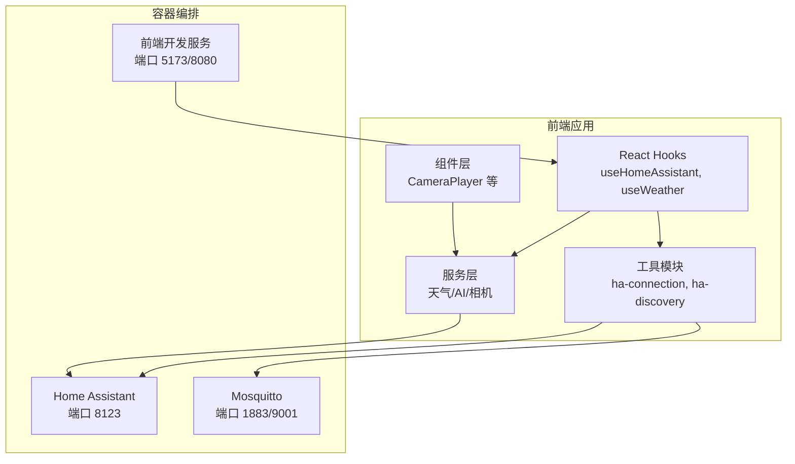
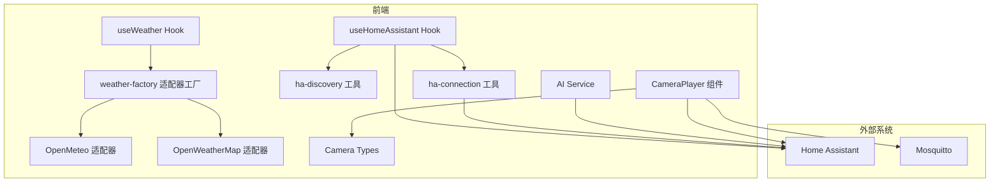
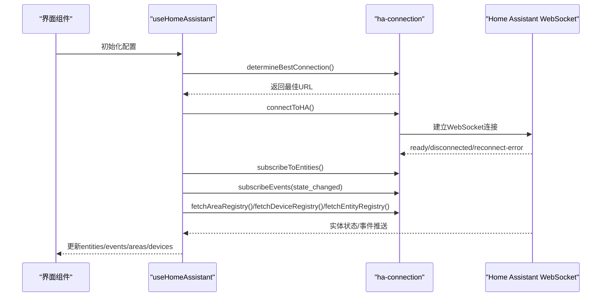
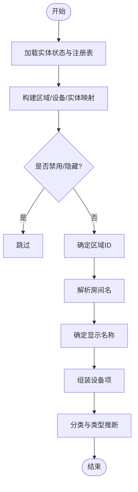
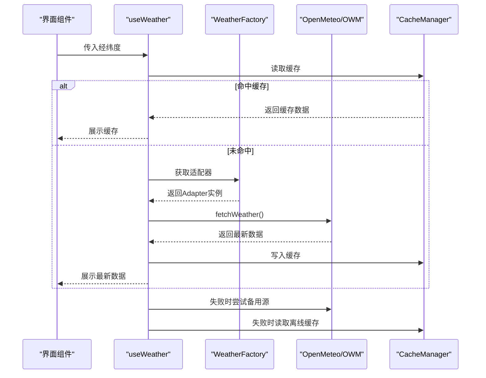
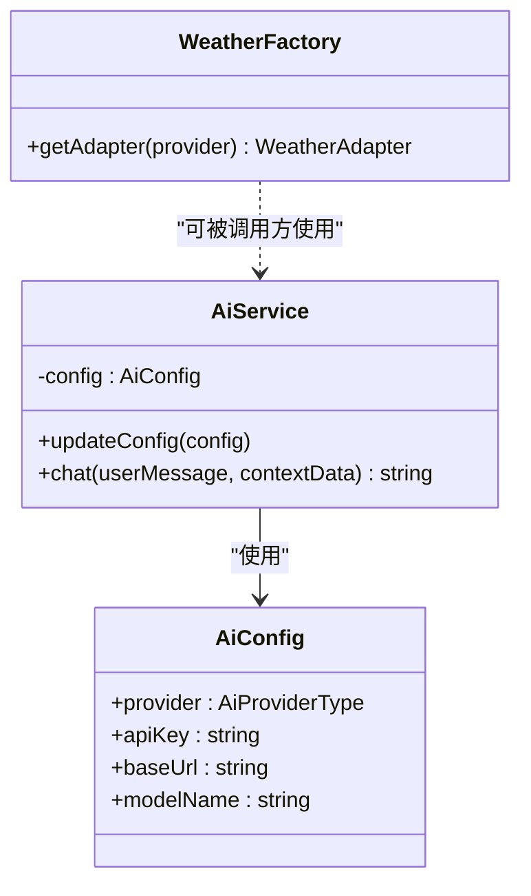
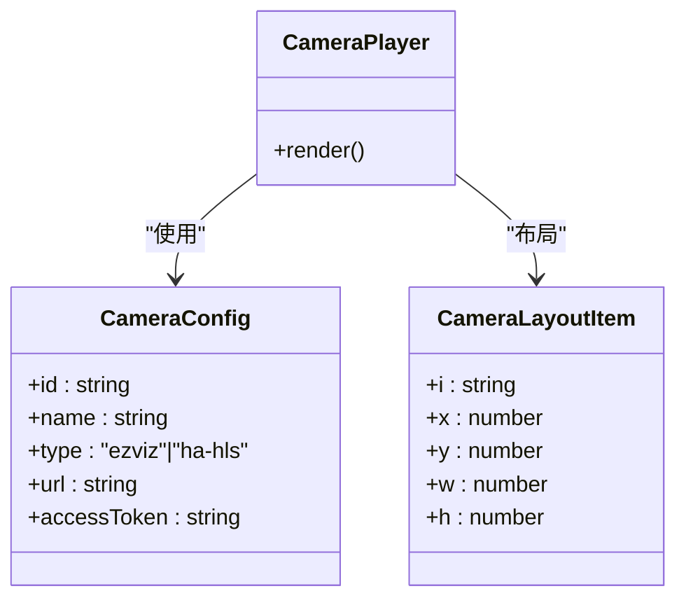
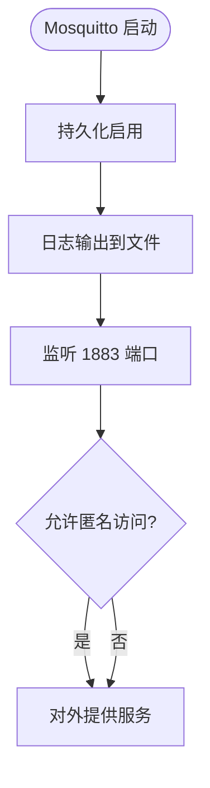
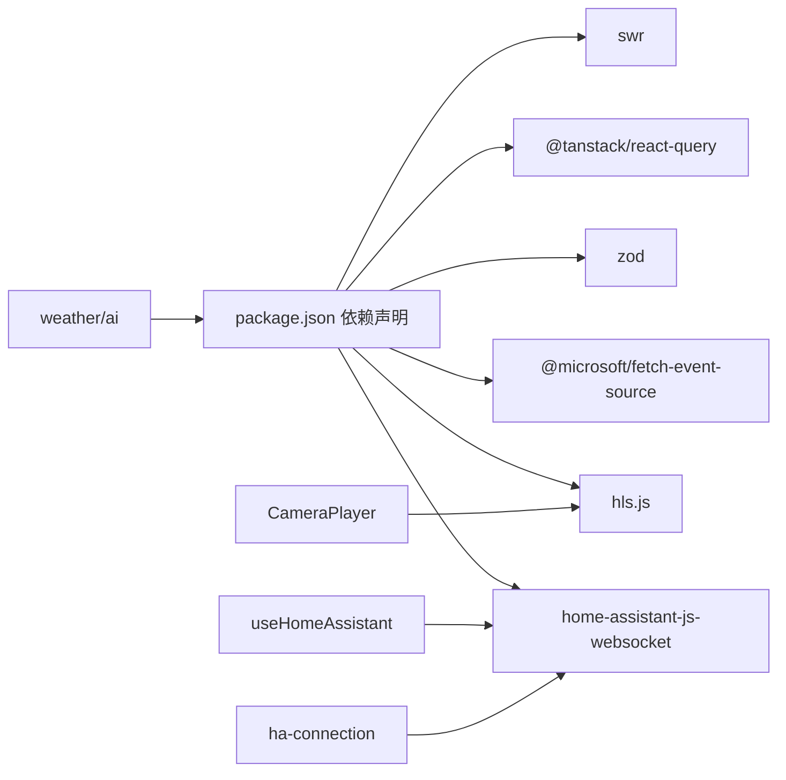

# 系统集成架构

<cite>
**本文引用的文件**
- [README.md](file://README.md)
- [docker-compose.yml](file://docker-compose.yml)
- [mosquitto.conf](file://mosquitto/config/mosquitto.conf)
- [ha-connection.ts](file://src/utils/ha-connection.ts)
- [ha-discovery.ts](file://src/utils/ha-discovery.ts)
- [useHomeAssistant.ts](file://src/hooks/useHomeAssistant.ts)
- [weather-factory.ts](file://src/services/weather/weather-factory.ts)
- [open-meteo.ts](file://src/services/weather/adapters/open-meteo.ts)
- [open-weather-map.ts](file://src/services/weather/adapters/open-weather-map.ts)
- [useWeather.ts](file://src/hooks/useWeather.ts)
- [feature-flags.ts](file://src/config/feature-flags.ts)
- [ai-service.ts](file://src/services/ai-service.ts)
- [types.ts](file://src/components/camera/types.ts)
- [CameraPlayer.tsx](file://src/components/camera/CameraPlayer.tsx)
- [package.json](file://package.json)
</cite>

## 目录
1. [简介](#简介)
2. [项目结构](#项目结构)
3. [核心组件](#核心组件)
4. [架构总览](#架构总览)
5. [详细组件分析](#详细组件分析)
6. [依赖分析](#依赖分析)
7. [性能考虑](#性能考虑)
8. [故障排查指南](#故障排查指南)
9. [结论](#结论)
10. [附录](#附录)

## 简介
本技术文档面向HAUI系统集成架构，围绕Home Assistant生态的深度集成展开，涵盖WebSocket连接管理、实体发现机制、服务调用与事件监听；同时深入解析MQTT协议集成（Mosquitto代理配置、主题订阅与消息路由）、第三方服务集成（天气数据服务、AI平台集成、摄像头协议支持），并给出扩展性设计与标准化接入流程、错误处理与重连机制，以及系统集成图与数据流图，帮助读者快速理解并高效扩展。

## 项目结构
HAUI采用前后端一体化开发与容器化部署方式，通过Docker Compose编排Home Assistant、Mosquitto与前端开发服务，形成可复现的本地集成环境。前端以React 18 + Vite构建，模块化组织在src目录下，按功能域划分组件、服务、Hooks与工具类。

图表来源
- [docker-compose.yml:1-42](file://docker-compose.yml#L1-L42)
- [README.md:19-30](file://README.md#L19-L30)

章节来源
- [README.md:19-30](file://README.md#L19-L30)
- [docker-compose.yml:1-42](file://docker-compose.yml#L1-L42)

## 核心组件
- Home Assistant WebSocket连接与事件监听：通过统一的连接管理与订阅封装，实现实体状态订阅、事件监听、服务调用与注册表获取。
- 实体发现与分类：基于实体状态、区域与设备注册表，生成可展示的设备清单并进行类型归类。
- 天气服务适配器工厂：抽象不同天气提供商的差异，支持主备切换与缓存策略。
- AI服务集成：统一OpenAI兼容接口，内置安全校验与错误脱敏，支持多家模型厂商。
- 摄像头协议支持：统一配置与播放器分发，支持萤石云ezopen与Home Assistant HLS两种协议。
- MQTT集成：Mosquitto代理提供本地消息总线，便于扩展设备与外部系统通信。

章节来源
- [ha-connection.ts:1-317](file://src/utils/ha-connection.ts#L1-L317)
- [ha-discovery.ts:1-167](file://src/utils/ha-discovery.ts#L1-L167)
- [useHomeAssistant.ts:1-313](file://src/hooks/useHomeAssistant.ts#L1-L313)
- [weather-factory.ts:1-21](file://src/services/weather/weather-factory.ts#L1-L21)
- [open-meteo.ts:1-115](file://src/services/weather/adapters/open-meteo.ts#L1-L115)
- [open-weather-map.ts:1-46](file://src/services/weather/adapters/open-weather-map.ts#L1-L46)
- [useWeather.ts:1-128](file://src/hooks/useWeather.ts#L1-L128)
- [ai-service.ts:1-201](file://src/services/ai-service.ts#L1-L201)
- [types.ts:1-22](file://src/components/camera/types.ts#L1-L22)
- [CameraPlayer.tsx:1-88](file://src/components/camera/CameraPlayer.tsx#L1-L88)
- [mosquitto.conf:1-6](file://mosquitto/config/mosquitto.conf#L1-L6)

## 架构总览
HAUI的系统集成架构以“前端Hooks + 工具层 + 服务层 + 组件层”为主线，围绕Home Assistant与Mosquitto两大外部系统构建：

图表来源
- [useHomeAssistant.ts:1-313](file://src/hooks/useHomeAssistant.ts#L1-L313)
- [ha-connection.ts:1-317](file://src/utils/ha-connection.ts#L1-L317)
- [ha-discovery.ts:1-167](file://src/utils/ha-discovery.ts#L1-L167)
- [useWeather.ts:1-128](file://src/hooks/useWeather.ts#L1-L128)
- [weather-factory.ts:1-21](file://src/services/weather/weather-factory.ts#L1-L21)
- [open-meteo.ts:1-115](file://src/services/weather/adapters/open-meteo.ts#L1-L115)
- [open-weather-map.ts:1-46](file://src/services/weather/adapters/open-weather-map.ts#L1-L46)
- [ai-service.ts:1-201](file://src/services/ai-service.ts#L1-L201)
- [types.ts:1-22](file://src/components/camera/types.ts#L1-L22)
- [CameraPlayer.tsx:1-88](file://src/components/camera/CameraPlayer.tsx#L1-L88)

## 详细组件分析

### Home Assistant 集成：连接、订阅与服务调用
- 连接管理：支持环境变量与显式配置，自动规范化URL，提供一次性连接与持久连接两种模式；具备可用性探测与WebSocket验证双重路径，优先选择可达地址。
- 实体订阅：订阅实体状态变更，实时更新前端状态；支持事件监听（state_changed）并截取最近100条事件。
- 服务调用：封装callService，统一错误处理与日志记录。
- 注册表获取：批量获取区域、设备与实体注册表，用于设备发现与分类。
- 重连与健康：心跳检测与断线重连，断线后5秒指数退避重试；支持代理回退（/ha-api）。

图表来源
- [useHomeAssistant.ts:61-210](file://src/hooks/useHomeAssistant.ts#L61-L210)
- [ha-connection.ts:47-105](file://src/utils/ha-connection.ts#L47-L105)
- [ha-connection.ts:177-187](file://src/utils/ha-connection.ts#L177-L187)

章节来源
- [useHomeAssistant.ts:1-313](file://src/hooks/useHomeAssistant.ts#L1-L313)
- [ha-connection.ts:1-317](file://src/utils/ha-connection.ts#L1-L317)

### 实体发现与分类
- 数据来源：实体状态、区域注册表、设备注册表、实体注册表。
- 发现逻辑：构建映射表，过滤禁用/隐藏实体，回退到设备级区域，确定房间名；名称优先级：注册名 > 友好名 > 原始名 > 实体ID。
- 分类规则：按domain与device_class进行安全、照明、开关、HVAC、窗帘、传感器、安防、场景、人物、其他等类别判定；支持自动推断具体类型（如灯光亮度支持区分“调光器/开关”）。

图表来源
- [ha-discovery.ts:18-73](file://src/utils/ha-discovery.ts#L18-L73)
- [ha-discovery.ts:89-166](file://src/utils/ha-discovery.ts#L89-L166)

章节来源
- [ha-discovery.ts:1-167](file://src/utils/ha-discovery.ts#L1-L167)

### 天气服务集成：适配器工厂与主备切换
- 工厂模式：根据配置选择Open-Meteo或OpenWeatherMap适配器。
- 缓存与刷新：首次加载优先命中缓存，后台刷新；坐标变化时清空旧天气数据。
- 主备切换：主源失败时自动尝试备用源，失败后启用离线缓存兜底。
- 重试策略：指数退避重试，30分钟周期刷新。

图表来源
- [useWeather.ts:9-128](file://src/hooks/useWeather.ts#L9-L128)
- [weather-factory.ts:10-20](file://src/services/weather/weather-factory.ts#L10-L20)
- [open-meteo.ts:3-71](file://src/services/weather/adapters/open-meteo.ts#L3-L71)
- [open-weather-map.ts:3-45](file://src/services/weather/adapters/open-weather-map.ts#L3-L45)

章节来源
- [useWeather.ts:1-128](file://src/hooks/useWeather.ts#L1-L128)
- [weather-factory.ts:1-21](file://src/services/weather/weather-factory.ts#L1-L21)
- [open-meteo.ts:1-115](file://src/services/weather/adapters/open-meteo.ts#L1-L115)
- [open-weather-map.ts:1-46](file://src/services/weather/adapters/open-weather-map.ts#L1-L46)
- [feature-flags.ts:1-7](file://src/config/feature-flags.ts#L1-L7)

### AI平台集成：统一OpenAI兼容接口与安全校验
- 配置与模型：内置多家厂商配置与常用模型，支持自定义OpenAI兼容接口。
- 安全校验：Zod Schema验证配置合法性，API Key脱敏输出，ASCII字符白名单过滤。
- 错误处理：针对401/404/网络错误进行差异化提示，开发模式下输出详细日志。
- 服务封装：AiService统一聊天入口，系统提示词内嵌当前设备状态快照。

图表来源
- [ai-service.ts:160-201](file://src/services/ai-service.ts#L160-L201)
- [ai-service.ts:44-69](file://src/services/ai-service.ts#L44-L69)

章节来源
- [ai-service.ts:1-201](file://src/services/ai-service.ts#L1-L201)

### 摄像头协议支持：萤石云与HLS
- 统一配置：CameraConfig抽象ezviz与ha-hls两类协议，支持ezopen与Home Assistant代理HLS。
- 组件分发：CameraPlayer根据类型选择EzvizStreamPlayer或HaHlsPlayer，提供全屏与移除控制。
- 类型约束：明确布局项与配置项接口，便于仪表盘布局与运行时参数传递。

图表来源
- [types.ts:10-22](file://src/components/camera/types.ts#L10-L22)
- [CameraPlayer.tsx:12-88](file://src/components/camera/CameraPlayer.tsx#L12-L88)

章节来源
- [types.ts:1-22](file://src/components/camera/types.ts#L1-L22)
- [CameraPlayer.tsx:1-88](file://src/components/camera/CameraPlayer.tsx#L1-L88)

### MQTT集成：Mosquitto代理配置与消息路由
- 代理配置：持久化存储、日志文件、监听端口与匿名访问策略。
- 集成点：前端通过Mosquitto作为本地消息总线，可扩展订阅主题、发布控制指令，实现设备与外部系统解耦。
- 部署：Docker Compose提供端口映射与持久化目录，便于开发与演示。

图表来源
- [mosquitto.conf:1-6](file://mosquitto/config/mosquitto.conf#L1-L6)
- [docker-compose.yml:15-26](file://docker-compose.yml#L15-L26)

章节来源
- [mosquitto.conf:1-6](file://mosquitto/config/mosquitto.conf#L1-L6)
- [docker-compose.yml:15-26](file://docker-compose.yml#L15-L26)

## 依赖分析
- 外部依赖：home-assistant-js-websocket用于WebSocket通信；hls.js用于HLS播放；@microsoft/fetch-event-source用于SSE；@tanstack/react-query与swr用于数据获取与缓存；zod用于配置校验。
- 内部依赖：Hooks依赖工具层；工具层依赖外部SDK；服务层依赖工具层；组件层依赖服务层与类型定义。

图表来源
- [package.json:13-96](file://package.json#L13-L96)
- [useHomeAssistant.ts:1-15](file://src/hooks/useHomeAssistant.ts#L1-L15)
- [ha-connection.ts:1-10](file://src/utils/ha-connection.ts#L1-L10)

章节来源
- [package.json:1-132](file://package.json#L1-L132)

## 性能考虑
- WebSocket长连接：减少HTTP轮询开销，事件驱动更新。
- 实体订阅与事件截取：限制事件数量（最近100条），避免内存膨胀。
- 天气缓存与离线兜底：降低第三方API压力，提升弱网体验。
- 图标与渲染优化：Web Worker与虚拟化列表减少主线程压力。
- 重试与退避：指数退避降低抖动，避免雪崩效应。

## 故障排查指南
- 连接失败
  - 检查URL与Token配置，确认环境变量或显式配置有效。
  - 使用可用性探测与WebSocket验证双重路径定位问题。
  - 断线后自动重连，若持续失败，检查网络与代理设置。
- 服务调用失败
  - 确认WebSocket可用；若失败，回退至REST API（states接口）。
  - 查看错误日志与事件队列，定位具体实体与服务。
- 天气数据异常
  - 主源失败自动切换备用源；若仍失败，检查缓存与离线数据。
  - 确认经纬度精度与缓存键一致性。
- AI服务错误
  - 校验API Key与Base URL；开发模式下查看脱敏日志。
  - 网络错误提示用户检查连通性。
- 摄像头播放问题
  - 确认协议类型与URL/Token配置；HLS需Home Assistant代理可用。
  - 检查浏览器对HLS的支持与跨域策略。

章节来源
- [useHomeAssistant.ts:182-203](file://src/hooks/useHomeAssistant.ts#L182-L203)
- [useWeather.ts:94-112](file://src/hooks/useWeather.ts#L94-L112)
- [ai-service.ts:144-158](file://src/services/ai-service.ts#L144-L158)
- [CameraPlayer.tsx:78-84](file://src/components/camera/CameraPlayer.tsx#L78-L84)

## 结论
HAUI通过模块化的Hooks与工具层，实现了与Home Assistant的深度集成与稳健的错误处理机制；借助适配器工厂与缓存策略，第三方服务（天气、AI）具备良好的可替换性与可靠性；Mosquitto为本地消息总线提供了简洁扩展点。整体架构具备清晰的职责边界、可扩展的接入流程与完善的重连与降级策略，适合在复杂家庭自动化场景中长期演进。

## 附录
- 开发与部署
  - 使用Docker Compose一键启动Home Assistant、Mosquitto与前端开发服务。
  - 前端通过环境变量或Hook配置连接Home Assistant，自动选择最优地址。
- 新服务接入流程（标准化）
  - 定义适配器接口与实现，加入工厂选择逻辑。
  - 在Hook中引入缓存与重试策略，必要时提供离线兜底。
  - 提供最小可测试用例与错误码映射，完善日志与脱敏输出。
- 扩展建议
  - 引入统一的事件总线与中间件，增强MQTT与HA之间的消息路由能力。
  - 将相机协议抽象为插件，支持更多厂商协议。
  - 增加集成测试与端到端测试覆盖，保障多服务协同稳定性。