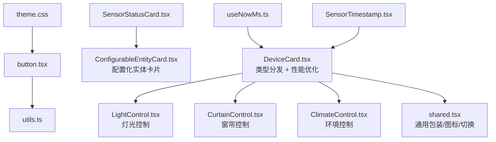
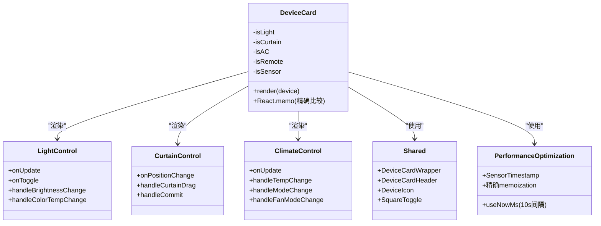
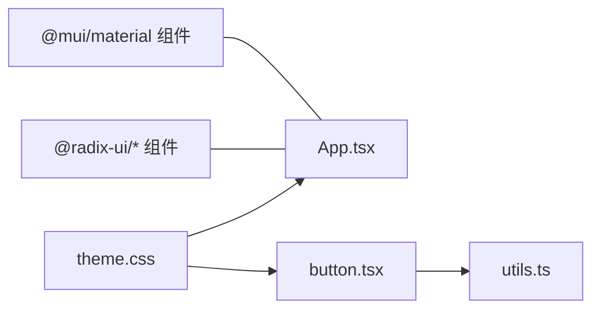
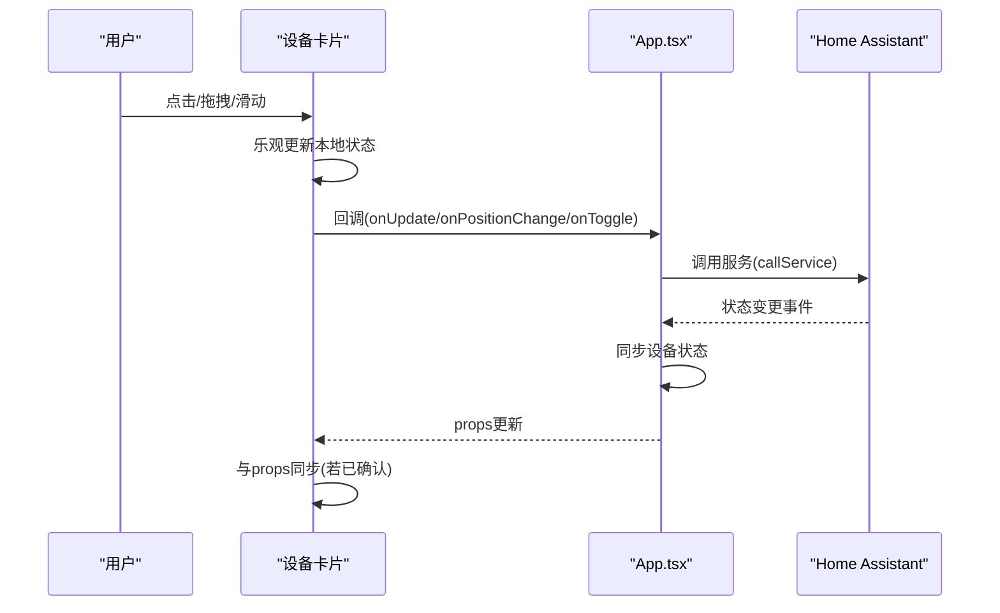
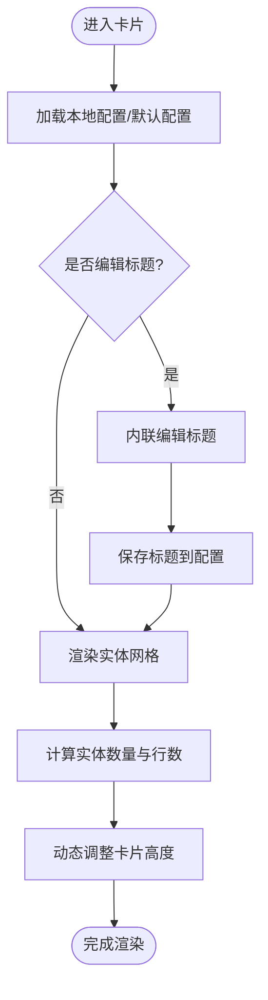
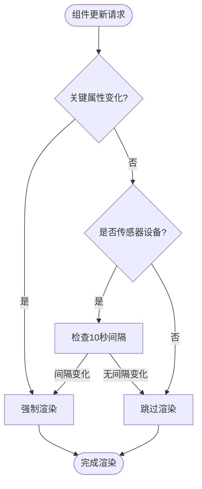
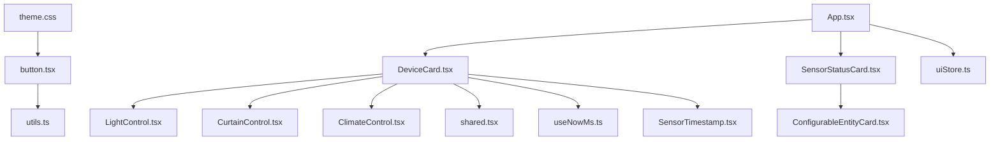

# 组件架构设计

<cite>
**本文档引用的文件**
- [README.md](file://README.md)
- [DeviceCard.tsx](file://src/app/components/dashboard/DeviceCard.tsx)
- [shared.tsx](file://src/app/components/dashboard/cards/shared.tsx)
- [LightControl.tsx](file://src/app/components/dashboard/cards/LightControl.tsx)
- [CurtainControl.tsx](file://src/app/components/dashboard/cards/CurtainControl.tsx)
- [ClimateControl.tsx](file://src/app/components/dashboard/cards/ClimateControl.tsx)
- [ConfigurableEntityCard.tsx](file://src/app/components/dashboard/cards/shared/ConfigurableEntityCard.tsx)
- [SensorStatusCard.tsx](file://src/app/components/dashboard/cards/SensorStatusCard.tsx)
- [button.tsx](file://src/app/components/ui/button.tsx)
- [utils.ts](file://src/app/components/ui/utils.ts)
- [theme.css](file://src/styles/theme.css)
- [App.tsx](file://src/app/App.tsx)
- [uiStore.ts](file://src/store/uiStore.ts)
- [device.ts](file://src/types/device.ts)
- [package.json](file://package.json)
- [useNowMs.ts](file://src/hooks/useNowMs.ts)
- [SensorTimestamp.tsx](file://src/app/components/dashboard/SensorTimestamp.tsx)
</cite>

## 目录
1. [简介](#简介)
2. [项目结构](#项目结构)
3. [核心组件](#核心组件)
4. [架构总览](#架构总览)
5. [详细组件分析](#详细组件分析)
6. [依赖分析](#依赖分析)
7. [性能考量](#性能考量)
8. [故障排查指南](#故障排查指南)
9. [结论](#结论)
10. [附录](#附录)

## 简介
本文件面向HAUI组件架构设计，系统化阐述基于React的组件化架构模式，涵盖组件分类、层级结构与复用策略；深入解析设备卡片组件的设计理念，包括通用卡片抽象、特定设备组件扩展与配置化渲染机制；梳理UI组件库的架构设计，包括Material UI与Radix UI的组合使用、自定义组件封装与主题系统；总结组件通信模式、事件处理机制与状态提升策略，并提供组件架构图与组件关系图，说明组件间的依赖关系与数据流向。

## 项目结构
项目采用以功能域为中心的分层组织方式：
- 应用入口与页面：App.tsx负责全局状态、设备同步与事件处理
- 仪表盘组件：dashboard目录下包含设备卡片、卡片共享组件与统计卡片
- UI组件库：ui目录封装Radix UI与基础样式工具，形成一致的视觉与交互基座
- 状态管理：store目录使用Zustand进行UI状态与数据状态分离
- 类型定义：types目录提供设备与卡片配置等类型约束
- 主题与样式：styles目录提供CSS变量主题与容器查询适配
- 性能优化：hooks目录提供专门的时间管理与性能监控工具

```mermaid
graph TB
subgraph "应用层"
APP["App.tsx"]
end
subgraph "仪表盘组件"
DC["DeviceCard.tsx"]
LC["LightControl.tsx"]
CC["CurtainControl.tsx"]
AC["ClimateControl.tsx"]
S["shared.tsx"]
SEC["SensorStatusCard.tsx"]
CEC["ConfigurableEntityCard.tsx"]
ST["SensorTimestamp.tsx"]
end
subgraph "UI组件库"
BTN["button.tsx"]
U["utils.ts"]
end
subgraph "状态管理"
UIStore["uiStore.ts"]
end
subgraph "主题与样式"
THEME["theme.css"]
end
subgraph "类型与依赖"
DEVTYPE["device.ts"]
PKG["package.json"]
END
subgraph "性能优化"
NOWMS["useNowMs.ts"]
END
APP --> DC
DC --> LC
DC --> CC
DC --> AC
DC --> S
SEC --> CEC
APP --> UIStore
BTN --> U
THEME --> BTN
DEVTYPE --> DC
PKG --> BTN
DC --> NOWMS
DC --> ST
```

**图表来源**
- [App.tsx:1-120](file://src/app/App.tsx#L1-L120)
- [DeviceCard.tsx:1-60](file://src/app/components/dashboard/DeviceCard.tsx#L1-L60)
- [LightControl.tsx:1-40](file://src/app/components/dashboard/cards/LightControl.tsx#L1-L40)
- [CurtainControl.tsx:1-40](file://src/app/components/dashboard/cards/CurtainControl.tsx#L1-L40)
- [ClimateControl.tsx:1-40](file://src/app/components/dashboard/cards/ClimateControl.tsx#L1-L40)
- [shared.tsx:1-40](file://src/app/components/dashboard/cards/shared.tsx#L1-L40)
- [SensorStatusCard.tsx:1-40](file://src/app/components/dashboard/cards/SensorStatusCard.tsx#L1-L40)
- [ConfigurableEntityCard.tsx:1-40](file://src/app/components/dashboard/cards/shared/ConfigurableEntityCard.tsx#L1-L40)
- [button.tsx:1-40](file://src/app/components/ui/button.tsx#L1-L40)
- [utils.ts:1-7](file://src/app/components/ui/utils.ts#L1-L7)
- [theme.css:1-60](file://src/styles/theme.css#L1-L60)
- [uiStore.ts:1-40](file://src/store/uiStore.ts#L1-L40)
- [device.ts:1-40](file://src/types/device.ts#L1-L40)
- [package.json:13-96](file://package.json#L13-L96)
- [useNowMs.ts:1-66](file://src/hooks/useNowMs.ts#L1-L66)
- [SensorTimestamp.tsx:1-65](file://src/app/components/dashboard/SensorTimestamp.tsx#L1-L65)

**章节来源**
- [README.md:1-84](file://README.md#L1-L84)
- [package.json:13-96](file://package.json#L13-L96)

## 核心组件
- 设备卡片聚合器：DeviceCard作为设备类型分发器，依据设备类型渲染不同专用卡片或通用卡片
- 专用设备卡片：LightControl（灯光）、CurtainControl（窗帘）、ClimateControl（空调/环境控制）
- 通用卡片共享层：shared.tsx提供统一包装器、图标、切换控件与可视化组件
- 配置化实体卡片：ConfigurableEntityCard实现卡片配置持久化、实体列表渲染与设置面板
- 传感器状态卡片：SensorStatusCard基于设备动态生成实体配置，提供可编辑的"家庭状态"面板
- UI组件库：button.tsx结合Radix UI与class-variance-authority实现可变样式按钮
- 主题系统：theme.css通过CSS变量与容器查询实现深浅主题与响应式缩放
- 性能优化：useNowMs提供10秒间隔的默认时间更新，SensorTimestamp处理传感器时间显示

**章节来源**
- [DeviceCard.tsx:25-114](file://src/app/components/dashboard/DeviceCard.tsx#L25-L114)
- [shared.tsx:184-251](file://src/app/components/dashboard/cards/shared.tsx#L184-L251)
- [ConfigurableEntityCard.tsx:54-120](file://src/app/components/dashboard/cards/shared/ConfigurableEntityCard.tsx#L54-L120)
- [SensorStatusCard.tsx:34-60](file://src/app/components/dashboard/cards/SensorStatusCard.tsx#L34-L60)
- [button.tsx:7-35](file://src/app/components/ui/button.tsx#L7-L35)
- [theme.css:1-80](file://src/styles/theme.css#L1-L80)
- [useNowMs.ts:12-23](file://src/hooks/useNowMs.ts#L12-L23)
- [SensorTimestamp.tsx:7-19](file://src/app/components/dashboard/SensorTimestamp.tsx#L7-L19)

## 架构总览
整体采用"类型分发 + 专用卡片 + 通用共享层"的三层架构：
- 类型分发层：DeviceCard依据设备类型与属性判断，路由到对应专用卡片
- 专用卡片层：LightControl/CurtainControl/ClimateControl封装设备特有交互与状态
- 通用共享层：shared.tsx提供统一外观、图标与交互基元，降低重复代码
- 配置化渲染：ConfigurableEntityCard与SensorStatusCard支持用户配置实体列表与图标
- UI与主题：button.tsx与theme.css统一风格，Radix UI提供无障碍与可访问性基座
- 性能优化：useNowMs与自定义memoization逻辑确保高效渲染



**图表来源**
- [DeviceCard.tsx:25-114](file://src/app/components/dashboard/DeviceCard.tsx#L25-L114)
- [LightControl.tsx:17-40](file://src/app/components/dashboard/cards/LightControl.tsx#L17-L40)
- [CurtainControl.tsx:16-40](file://src/app/components/dashboard/cards/CurtainControl.tsx#L16-L40)
- [ClimateControl.tsx:40-70](file://src/app/components/dashboard/cards/ClimateControl.tsx#L40-L70)
- [shared.tsx:184-251](file://src/app/components/dashboard/cards/shared.tsx#L184-L251)
- [SensorStatusCard.tsx:34-60](file://src/app/components/dashboard/cards/SensorStatusCard.tsx#L34-L60)
- [ConfigurableEntityCard.tsx:54-120](file://src/app/components/dashboard/cards/shared/ConfigurableEntityCard.tsx#L54-L120)
- [button.tsx:1-40](file://src/app/components/ui/button.tsx#L1-L40)
- [utils.ts:1-7](file://src/app/components/ui/utils.ts#L1-L7)
- [theme.css:1-60](file://src/styles/theme.css#L1-L60)
- [useNowMs.ts:12-23](file://src/hooks/useNowMs.ts#L12-L23)
- [SensorTimestamp.tsx:7-19](file://src/app/components/dashboard/SensorTimestamp.tsx#L7-L19)

## 详细组件分析

### 设备卡片组件设计
- 通用卡片抽象：DeviceCard通过类型判断与条件渲染，将通用布局与交互封装在shared.tsx中，确保不同设备类型共享一致的视觉与行为基线
- 特定设备组件扩展：LightControl/CurtainControl/ClimateControl分别实现亮度/色温、开合位置与温度/模式/风速的交互逻辑
- 配置化渲染机制：SensorStatusCard与ConfigurableEntityCard支持用户自定义实体列表、图标与标题，结合localStorage实现配置持久化
- **性能优化机制**：DeviceCard使用React.memo和精确的比较函数，针对传感器设备实施特殊的渲染策略



**图表来源**
- [DeviceCard.tsx:25-114](file://src/app/components/dashboard/DeviceCard.tsx#L25-L114)
- [LightControl.tsx:17-40](file://src/app/components/dashboard/cards/LightControl.tsx#L17-L40)
- [CurtainControl.tsx:16-40](file://src/app/components/dashboard/cards/CurtainControl.tsx#L16-L40)
- [ClimateControl.tsx:40-70](file://src/app/components/dashboard/cards/ClimateControl.tsx#L40-L70)
- [shared.tsx:184-251](file://src/app/components/dashboard/cards/shared.tsx#L184-L251)
- [useNowMs.ts:12-23](file://src/hooks/useNowMs.ts#L12-L23)
- [SensorTimestamp.tsx:7-19](file://src/app/components/dashboard/SensorTimestamp.tsx#L7-L19)

**章节来源**
- [DeviceCard.tsx:25-114](file://src/app/components/dashboard/DeviceCard.tsx#L25-L114)
- [shared.tsx:184-251](file://src/app/components/dashboard/cards/shared.tsx#L184-L251)

### UI组件库与主题系统
- Material UI与Radix UI组合：项目同时引入@mui/material与大量@radix-ui/*组件，用于对话框、菜单、开关、滚动区域等高阶交互
- 自定义组件封装：button.tsx基于Radix UI Slot与class-variance-authority实现可变样式按钮，统一交互语义
- 主题系统：theme.css通过CSS变量定义颜色与半径，支持深浅主题切换；容器查询实现卡片内容的响应式缩放



**图表来源**
- [package.json:23-51](file://package.json#L23-L51)
- [button.tsx:1-40](file://src/app/components/ui/button.tsx#L1-L40)
- [utils.ts:1-7](file://src/app/components/ui/utils.ts#L1-L7)
- [theme.css:1-80](file://src/styles/theme.css#L1-L80)

**章节来源**
- [package.json:23-51](file://package.json#L23-L51)
- [button.tsx:7-35](file://src/app/components/ui/button.tsx#L7-L35)
- [theme.css:1-80](file://src/styles/theme.css#L1-L80)

### 组件通信模式与状态提升
- 事件冒泡与阻止传播：各卡片通过e.stopPropagation()避免误触导航，仅在必要区域触发父级回调
- 状态提升策略：App.tsx集中管理设备状态、场景与日志，各卡片通过回调函数向上提交变更
- 乐观更新与重试：灯光/窗帘/空调卡片在提交后等待后端确认，超时或失败时回滚本地状态，提升交互流畅度



**图表来源**
- [LightControl.tsx:82-119](file://src/app/components/dashboard/cards/LightControl.tsx#L82-L119)
- [CurtainControl.tsx:101-134](file://src/app/components/dashboard/cards/CurtainControl.tsx#L101-L134)
- [ClimateControl.tsx:107-135](file://src/app/components/dashboard/cards/ClimateControl.tsx#L107-L135)
- [App.tsx:488-550](file://src/app/App.tsx#L488-L550)

**章节来源**
- [LightControl.tsx:82-119](file://src/app/components/dashboard/cards/LightControl.tsx#L82-L119)
- [CurtainControl.tsx:101-134](file://src/app/components/dashboard/cards/CurtainControl.tsx#L101-L134)
- [ClimateControl.tsx:107-135](file://src/app/components/dashboard/cards/ClimateControl.tsx#L107-L135)
- [App.tsx:488-550](file://src/app/App.tsx#L488-L550)

### 配置化渲染机制
- 配置持久化：ConfigurableEntityCard通过localStorage存储卡片配置，支持默认配置回退与动态合并
- 可编辑标题与图标：支持内联编辑标题与统一图标选择器，提升个性化能力
- 动态实体容器：根据实体数量计算网格行数，动态调整卡片高度，保证布局一致性



**图表来源**
- [ConfigurableEntityCard.tsx:54-120](file://src/app/components/dashboard/cards/shared/ConfigurableEntityCard.tsx#L54-L120)
- [ConfigurableEntityCard.tsx:125-137](file://src/app/components/dashboard/cards/shared/ConfigurableEntityCard.tsx#L125-L137)

**章节来源**
- [ConfigurableEntityCard.tsx:54-120](file://src/app/components/dashboard/cards/shared/ConfigurableEntityCard.tsx#L54-L120)
- [ConfigurableEntityCard.tsx:125-137](file://src/app/components/dashboard/cards/shared/ConfigurableEntityCard.tsx#L125-L137)

### 性能优化机制
**更新** 设备卡片组件实施了重大性能优化，包括精确的memoization逻辑和传感器设备的特殊处理机制

- **精确的memoization逻辑**：DeviceCard使用React.memo和自定义比较函数，仅在关键属性变化时重新渲染
- **传感器设备特殊处理**：针对传感器设备实施10秒间隔的渲染策略，大幅减少渲染频率
- **优化的时间管理**：useNowMs提供10秒间隔的默认时间更新，SensorTimestamp处理传感器时间显示
- **条件渲染优化**：传感器设备在非活动状态下跳过渲染，进一步提升性能



**图表来源**
- [DeviceCard.tsx:267-301](file://src/app/components/dashboard/DeviceCard.tsx#L267-L301)
- [useNowMs.ts:12-23](file://src/hooks/useNowMs.ts#L12-L23)
- [SensorTimestamp.tsx:7-19](file://src/app/components/dashboard/SensorTimestamp.tsx#L7-L19)

**章节来源**
- [DeviceCard.tsx:267-301](file://src/app/components/dashboard/DeviceCard.tsx#L267-L301)
- [useNowMs.ts:12-23](file://src/hooks/useNowMs.ts#L12-L23)
- [SensorTimestamp.tsx:7-19](file://src/app/components/dashboard/SensorTimestamp.tsx#L7-L19)

## 依赖分析
- 组件间依赖：DeviceCard依赖专用卡片与shared.tsx；SensorStatusCard依赖ConfigurableEntityCard；UI组件依赖utils与theme
- 外部依赖：@radix-ui/*提供可访问性与语义化组件；@mui/material提供图标与部分UI元素；class-variance-authority与clsx/tailwind-merge统一样式拼装
- 状态依赖：App.tsx通过useDataStore与useUIStore集中管理设备、场景、日志与UI状态
- **性能依赖**：DeviceCard依赖useNowMs进行时间管理，SensorTimestamp依赖时间戳进行状态显示



**图表来源**
- [DeviceCard.tsx:1-20](file://src/app/components/dashboard/DeviceCard.tsx#L1-L20)
- [LightControl.tsx:1-15](file://src/app/components/dashboard/cards/LightControl.tsx#L1-L15)
- [CurtainControl.tsx:1-14](file://src/app/components/dashboard/cards/CurtainControl.tsx#L1-L14)
- [ClimateControl.tsx:1-14](file://src/app/components/dashboard/cards/ClimateControl.tsx#L1-L14)
- [shared.tsx:1-10](file://src/app/components/dashboard/cards/shared.tsx#L1-L10)
- [SensorStatusCard.tsx:1-10](file://src/app/components/dashboard/cards/SensorStatusCard.tsx#L1-L10)
- [ConfigurableEntityCard.tsx:1-10](file://src/app/components/dashboard/cards/shared/ConfigurableEntityCard.tsx#L1-L10)
- [button.tsx:1-10](file://src/app/components/ui/button.tsx#L1-L10)
- [utils.ts:1-7](file://src/app/components/ui/utils.ts#L1-L7)
- [theme.css:1-20](file://src/styles/theme.css#L1-L20)
- [App.tsx:1-20](file://src/app/App.tsx#L1-L20)
- [uiStore.ts:1-20](file://src/store/uiStore.ts#L1-L20)
- [useNowMs.ts:1-10](file://src/hooks/useNowMs.ts#L1-L10)
- [SensorTimestamp.tsx:1-10](file://src/app/components/dashboard/SensorTimestamp.tsx#L1-L10)

**章节来源**
- [package.json:13-96](file://package.json#L13-L96)
- [App.tsx:1-20](file://src/app/App.tsx#L1-L20)

## 性能考量
**更新** 设备卡片组件实施了多项性能优化措施：

- **精确的memoization逻辑**：DeviceCard使用React.memo和自定义比较函数，仅在关键属性变化时重新渲染
- **传感器设备特殊处理**：针对传感器设备实施10秒间隔的渲染策略，大幅减少渲染频率
- **优化的时间管理**：useNowMs提供10秒间隔的默认时间更新，SensorTimestamp处理传感器时间显示
- **条件渲染优化**：传感器设备在非活动状态下跳过渲染，进一步提升性能
- 乐观更新与超时回滚：减少网络延迟对交互的影响，提升感知性能
- 本地状态缓存：localStorage持久化卡片配置，避免每次重新计算
- 虚拟化与懒加载：主题系统与容器查询优化渲染成本，避免大规模DOM重建
- 事件传播控制：通过stopPropagation减少不必要的父级重渲染

**章节来源**
- [DeviceCard.tsx:267-301](file://src/app/components/dashboard/DeviceCard.tsx#L267-L301)
- [useNowMs.ts:12-23](file://src/hooks/useNowMs.ts#L12-L23)
- [SensorTimestamp.tsx:7-19](file://src/app/components/dashboard/SensorTimestamp.tsx#L7-L19)

## 故障排查指南
- 事件未触发：检查e.stopPropagation()是否在正确区域调用，避免误拦截
- 状态不一致：确认乐观更新是否在超时后回滚，检查onUpdate/onPositionChange回调是否正确传递
- 主题异常：核对CSS变量覆盖顺序与深浅主题类名，确保根节点存在正确的主题类
- 配置丢失：检查localStorage键名与JSON序列化/反序列化逻辑
- **渲染性能问题**：检查DeviceCard的memoization逻辑是否正确，确认传感器设备的10秒间隔是否生效
- **时间显示异常**：验证useNowMs的间隔设置，检查SensorTimestamp的时间计算逻辑

**章节来源**
- [LightControl.tsx:82-119](file://src/app/components/dashboard/cards/LightControl.tsx#L82-L119)
- [CurtainControl.tsx:101-134](file://src/app/components/dashboard/cards/CurtainControl.tsx#L101-L134)
- [ClimateControl.tsx:107-135](file://src/app/components/dashboard/cards/ClimateControl.tsx#L107-L135)
- [theme.css:1-80](file://src/styles/theme.css#L1-L80)
- [DeviceCard.tsx:267-301](file://src/app/components/dashboard/DeviceCard.tsx#L267-L301)
- [useNowMs.ts:12-23](file://src/hooks/useNowMs.ts#L12-L23)
- [SensorTimestamp.tsx:7-19](file://src/app/components/dashboard/SensorTimestamp.tsx#L7-L19)

## 结论
HAUI采用清晰的三层组件架构：类型分发层、专用卡片层与通用共享层，配合配置化渲染与乐观更新策略，在保证交互流畅的同时实现了高度的可扩展性与可维护性。**新增的性能优化机制**包括精确的memoization逻辑和传感器设备的特殊处理，显著提升了渲染效率。UI组件库与主题系统统一了视觉与交互基线，为复杂仪表盘提供了稳定可靠的组件基座。

## 附录
- 设备类型与属性：device.ts定义了设备的核心字段，包括类型、状态、可见性与自定义显示设置
- 应用入口：App.tsx集中处理设备同步、事件监听与模态框管理，是组件间通信的中枢
- **性能工具**：useNowMs提供灵活的时间管理，SensorTimestamp处理传感器时间显示，共同支撑设备卡片的性能优化

**章节来源**
- [device.ts:1-46](file://src/types/device.ts#L1-L46)
- [App.tsx:83-120](file://src/app/App.tsx#L83-L120)
- [useNowMs.ts:12-23](file://src/hooks/useNowMs.ts#L12-L23)
- [SensorTimestamp.tsx:7-19](file://src/app/components/dashboard/SensorTimestamp.tsx#L7-L19)