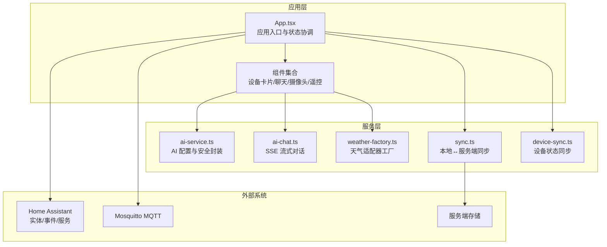
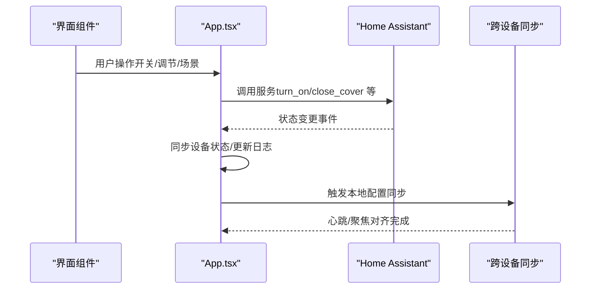
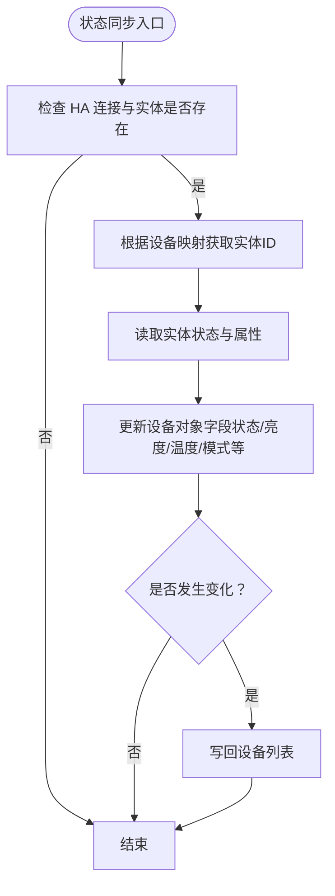
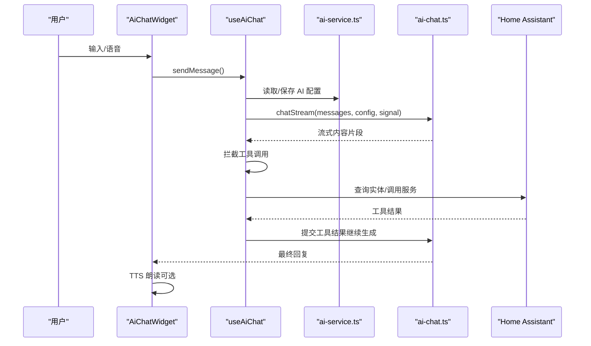
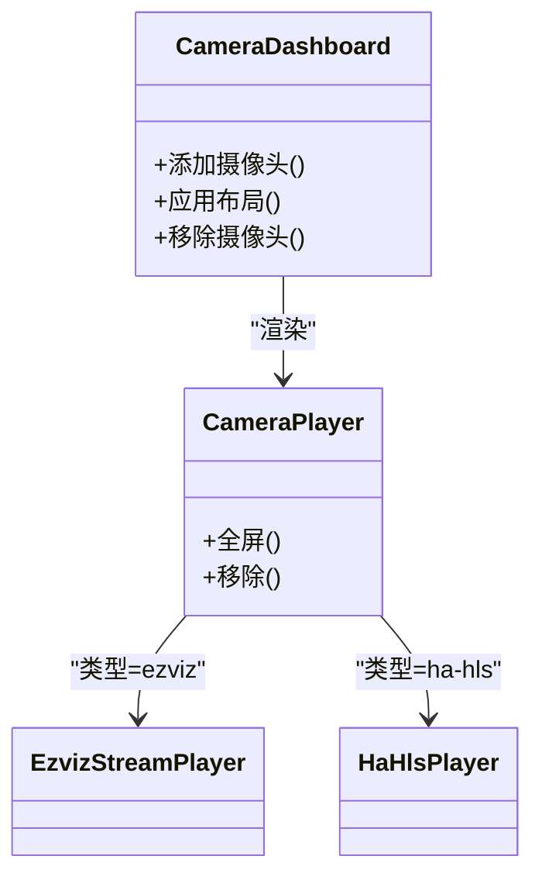
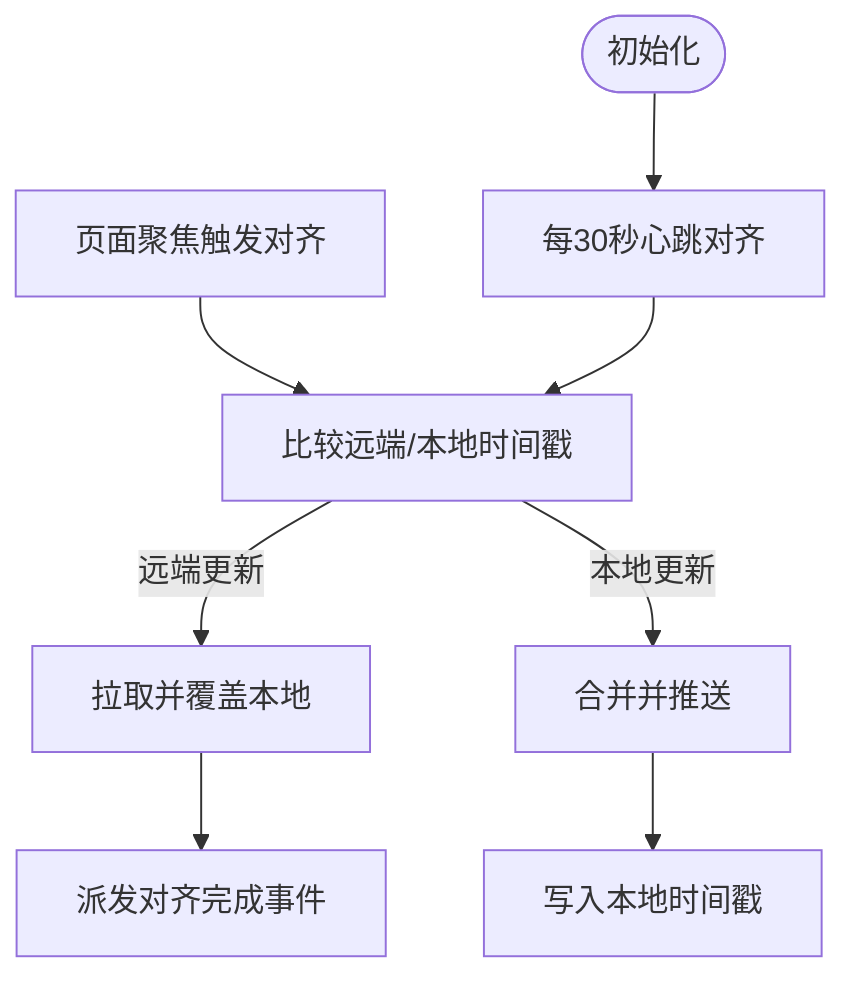
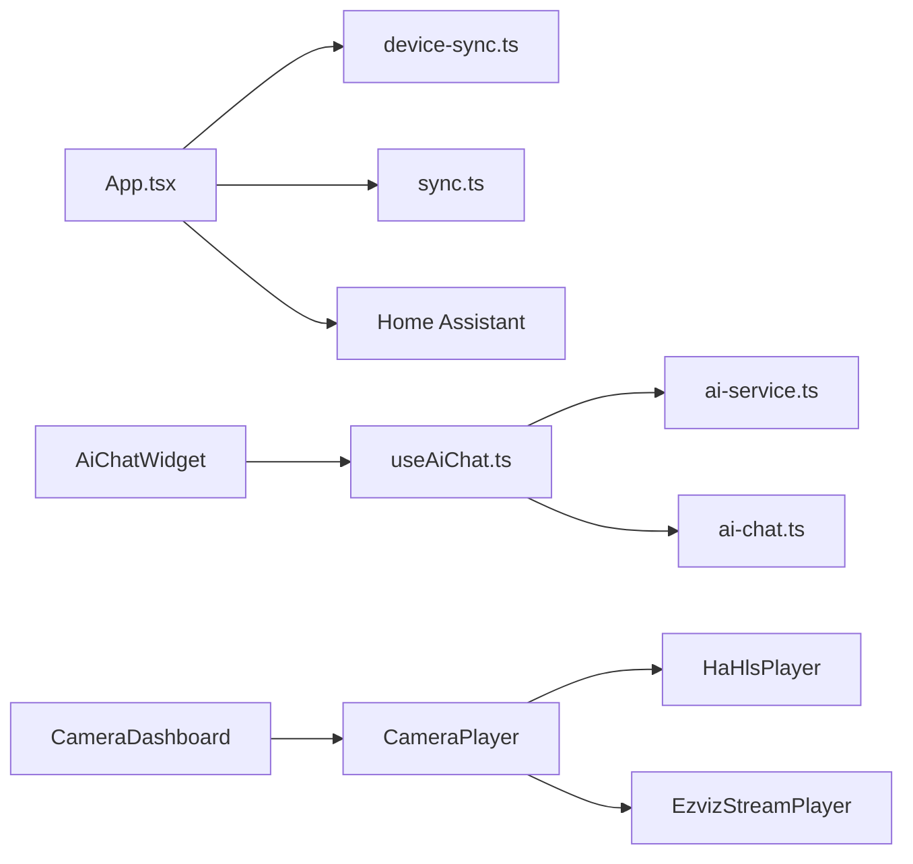

# 核心功能

<cite>
**本文引用的文件**
- [README.md](file://README.md)
- [package.json](file://package.json)
- [src/app/App.tsx](file://src/app/App.tsx)
- [src/services/ai-chat.ts](file://src/services/ai-chat.ts)
- [src/services/ai-service.ts](file://src/services/ai-service.ts)
- [src/hooks/useAiChat.ts](file://src/hooks/useAiChat.ts)
- [src/app/components/AiChatWidget.tsx](file://src/app/components/AiChatWidget.tsx)
- [src/components/camera/CameraDashboard.tsx](file://src/components/camera/CameraDashboard.tsx)
- [src/components/camera/CameraPlayer.tsx](file://src/components/camera/CameraPlayer.tsx)
- [src/utils/device-sync.ts](file://src/utils/device-sync.ts)
- [src/utils/sync.ts](file://src/utils/sync.ts)
- [src/types/device.ts](file://src/types/device.ts)
- [src/app/components/remote/RemoteControlModal.tsx](file://src/app/components/remote/RemoteControlModal.tsx)
- [src/app/components/settings/DeviceEditorForm.tsx](file://src/app/components/settings/DeviceEditorForm.tsx)
- [src/services/weather/weather-factory.ts](file://src/services/weather/weather-factory.ts)
</cite>

## 目录
1. [简介](#简介)
2. [项目结构](#项目结构)
3. [核心组件](#核心组件)
4. [架构总览](#架构总览)
5. [详细组件分析](#详细组件分析)
6. [依赖分析](#依赖分析)
7. [性能考虑](#性能考虑)
8. [故障排查指南](#故障排查指南)
9. [结论](#结论)
10. [附录](#附录)

## 简介
本文件面向开发者与高级用户，系统梳理 HAUI 的核心功能与实现机制，包括：
- 智能家居设备控制：基于 Home Assistant 实体的状态同步与服务调用
- AI 智能助手：基于函数调用（Function Calling）的流式对话与工具执行
- 摄像头监控：HLS/萤石等多协议视频流的播放与布局管理
- 跨设备同步：本地配置与服务端存储的双向对齐与心跳同步

文档同时给出模块间协作关系、数据流转过程、配置选项、使用场景、最佳实践与性能优化策略，帮助读者快速理解并扩展 HAUI 的内部机制。

## 项目结构
HAUI 采用 React 18 + Vite + Tailwind 的前端架构，核心功能分布在以下层次：
- 应用入口与状态：App.tsx 负责连接 Home Assistant、设备与用户数据、事件日志与同步
- 业务组件：设备卡片、AI 聊天小部件、摄像头仪表盘、遥控器模态框、设置面板
- 服务与工具：AI 对话服务、天气适配器工厂、设备同步与跨设备同步
- 类型与配置：设备类型定义、功能开关与初始设备配置

图表来源
- [src/app/App.tsx](file://src/app/App.tsx)
- [src/services/ai-service.ts](file://src/services/ai-service.ts)
- [src/services/ai-chat.ts](file://src/services/ai-chat.ts)
- [src/services/weather/weather-factory.ts](file://src/services/weather/weather-factory.ts)
- [src/utils/sync.ts](file://src/utils/sync.ts)
- [src/utils/device-sync.ts](file://src/utils/device-sync.ts)

章节来源
- [README.md](file://README.md)
- [package.json](file://package.json)

## 核心组件
- 设备控制与状态同步：通过 Home Assistant 连接，将实体状态映射为设备对象，支持灯光、开关、窗帘、传感器、空调等类型；设备状态变更通过事件驱动日志与 UI 更新
- AI 智能助手：提供文本与语音输入，支持流式响应与工具调用（查询实体状态、调用 HA 服务），并可选 TTS 朗读
- 摄像头监控：支持多路视频源（HLS/萤石），提供拖拽布局、全屏与移除能力
- 跨设备同步：本地配置持久化与服务端存储双向同步，包含防抖、超时、心跳与聚焦对齐

章节来源
- [src/app/App.tsx](file://src/app/App.tsx)
- [src/utils/device-sync.ts](file://src/utils/device-sync.ts)
- [src/utils/sync.ts](file://src/utils/sync.ts)

## 架构总览
HAUI 的运行时架构围绕“状态驱动 + 事件驱动”的模式：
- 状态驱动：设备、用户、场景、房间等数据通过本地状态与持久化存储维护
- 事件驱动：来自 Home Assistant 的实体状态变更事件被转换为可视化日志与 UI 更新
- 工具链驱动：AI 对话通过工具调用实现“查询状态→执行动作”的闭环

图表来源
- [src/app/App.tsx](file://src/app/App.tsx)
- [src/utils/sync.ts](file://src/utils/sync.ts)

## 详细组件分析

### 设备控制与状态同步
- 设备类型与属性：设备对象包含状态、亮度、色温、位置、模式、可用性等字段，覆盖灯光、开关、窗帘、传感器、空调等
- 实体映射与服务调用：通过设备映射表将设备 ID 映射到 Home Assistant 实体 ID，统一调用服务域与服务名
- 状态同步：周期性将 HA 实体状态同步到本地设备对象，保持 UI 与真实设备一致
- 日志与可视化：状态变更事件被格式化为人类可读日志并展示

图表来源
- [src/utils/device-sync.ts](file://src/utils/device-sync.ts)
- [src/types/device.ts](file://src/types/device.ts)

章节来源
- [src/app/App.tsx](file://src/app/App.tsx)
- [src/utils/device-sync.ts](file://src/utils/device-sync.ts)
- [src/types/device.ts](file://src/types/device.ts)

### AI 智能助手
- 对话流程：用户输入 → 构造系统提示与消息上下文 → 流式 SSE 推送 → 工具调用拦截 → 执行工具（查询实体/调用服务）→ 再次请求模型生成最终回复 → 可选 TTS 朗读
- 安全与配置：Zod 校验配置、API Key 脱敏、错误处理与网络异常兜底
- 语音与 UI：支持文本与语音输入，提供浮动/侧边栏视图、最小化、拖拽关闭、快捷键等交互

图表来源
- [src/app/components/AiChatWidget.tsx](file://src/app/components/AiChatWidget.tsx)
- [src/hooks/useAiChat.ts](file://src/hooks/useAiChat.ts)
- [src/services/ai-service.ts](file://src/services/ai-service.ts)
- [src/services/ai-chat.ts](file://src/services/ai-chat.ts)

章节来源
- [src/app/components/AiChatWidget.tsx](file://src/app/components/AiChatWidget.tsx)
- [src/hooks/useAiChat.ts](file://src/hooks/useAiChat.ts)
- [src/services/ai-service.ts](file://src/services/ai-service.ts)
- [src/services/ai-chat.ts](file://src/services/ai-chat.ts)

### 摄像头监控
- 仪表盘：支持多路摄像头添加、布局切换（单屏/四宫格）、拖拽调整尺寸与位置
- 播放器：根据类型选择 HLS 或萤石播放器，提供全屏与移除能力
- 布局：基于 react-grid-layout 的响应式网格布局，支持拖拽句柄与手柄层

图表来源
- [src/components/camera/CameraDashboard.tsx](file://src/components/camera/CameraDashboard.tsx)
- [src/components/camera/CameraPlayer.tsx](file://src/components/camera/CameraPlayer.tsx)

章节来源
- [src/components/camera/CameraDashboard.tsx](file://src/components/camera/CameraDashboard.tsx)
- [src/components/camera/CameraPlayer.tsx](file://src/components/camera/CameraPlayer.tsx)

### 跨设备同步
- 本地到服务端：防抖合并、超时控制、携带时间戳，成功后更新本地同步时间
- 服务端到本地：增量校验，仅在远端更新时对齐，支持强制同步与心跳/聚焦对齐
- 配置持久化：localStorage 与服务端存储双向同步，保障多设备一致性

图表来源
- [src/utils/sync.ts](file://src/utils/sync.ts)

章节来源
- [src/utils/sync.ts](file://src/utils/sync.ts)

### 遥控器与设备管理
- 遥控器：支持多档位配置（TV/机顶盒/音响），可自定义按键名称、图标与绑定实体，支持拖拽排序与批量编辑
- 设备管理：提供实体选择、类型推断、图标选择、房间选择与名称校验，支持删除确认与错误提示

章节来源
- [src/app/components/remote/RemoteControlModal.tsx](file://src/app/components/remote/RemoteControlModal.tsx)
- [src/app/components/settings/DeviceEditorForm.tsx](file://src/app/components/settings/DeviceEditorForm.tsx)

## 依赖分析
- 外部依赖：Home Assistant WebSocket、fetch-event-source、Motion、Lucide、Zod、Tailwind 等
- 内部耦合：AI 对话依赖设备状态上下文；设备控制依赖 HA 服务；摄像头播放依赖播放器组件；同步依赖 localStorage 与服务端存储

图表来源
- [src/app/App.tsx](file://src/app/App.tsx)
- [src/hooks/useAiChat.ts](file://src/hooks/useAiChat.ts)
- [src/services/ai-service.ts](file://src/services/ai-service.ts)
- [src/services/ai-chat.ts](file://src/services/ai-chat.ts)
- [src/components/camera/CameraDashboard.tsx](file://src/components/camera/CameraDashboard.tsx)
- [src/components/camera/CameraPlayer.tsx](file://src/components/camera/CameraPlayer.tsx)

章节来源
- [package.json](file://package.json)

## 性能考虑
- 主线程保护：图标搜索在 Web Worker 中执行，虚拟化网格避免大量节点渲染
- 流式渲染：AI 对话采用 SSE 流式推送，逐步更新 UI，降低首帧延迟
- 状态更新：设备状态同步按需更新，避免不必要的重渲染
- 网络优化：跨设备同步采用防抖与超时控制，减少频繁请求
- 媒体播放：HLS/萤石播放器按需挂载与卸载，移除时释放资源

章节来源
- [README.md](file://README.md)
- [src/app/components/AiChatWidget.tsx](file://src/app/components/AiChatWidget.tsx)
- [src/components/camera/CameraDashboard.tsx](file://src/components/camera/CameraDashboard.tsx)

## 故障排查指南
- AI 对话失败
  - 检查 API Key、Base URL 与模型名称是否正确
  - 查看网络连接与跨域配置
  - 关注错误事件与日志脱敏输出
- 设备状态不同步
  - 确认设备映射表与实体 ID 正确
  - 检查 HA 连接状态与事件订阅
  - 观察日志中状态变更提示
- 摄像头播放异常
  - 确认 URL 与令牌有效
  - 检查播放器类型与浏览器权限
- 跨设备同步未生效
  - 确认服务端存储可达
  - 触发强制同步或等待心跳对齐
  - 检查本地时间戳与版本号

章节来源
- [src/services/ai-chat.ts](file://src/services/ai-chat.ts)
- [src/services/ai-service.ts](file://src/services/ai-service.ts)
- [src/app/App.tsx](file://src/app/App.tsx)
- [src/utils/sync.ts](file://src/utils/sync.ts)

## 结论
HAUI 以“状态与事件驱动”为核心，结合 AI 工具链、摄像头播放与跨设备同步，构建了专业、流畅且可扩展的智能家居控制与可视化平台。通过清晰的模块划分与稳健的错误处理，开发者可以在此基础上快速迭代功能、优化性能并提升用户体验。

## 附录
- 配置选项
  - AI 服务提供商与模型选择（SiliconFlow、阿里云百炼、自定义）
  - API Key、Base URL、模型名称
  - 本地/服务端同步开关与心跳间隔
- 使用场景
  - 语音/文本控制灯光、开关、窗帘与空调
  - 实时查看传感器状态与设备在线情况
  - 多路视频监控与布局管理
  - 跨设备配置共享与一致性保障
- 最佳实践
  - 合理设置设备映射，避免实体冲突
  - 使用工具调用前先查询状态，再执行动作
  - 控制摄像头数量与分辨率，平衡性能与体验
  - 定期清理日志与缓存，保持系统轻量